# Classification Models: Intuition, Mathematics, Evaluation, and Safe Projects

> Detailed English study notes created from the supplied YouTube transcript, `TitanicModels.ipynb`, and `HeartdiseaseFinal.ipynb`.

These notes explain **what**, **why**, **how**, and **when** behind classification. They cover logistic regression, K-nearest neighbors, Naive Bayes, decision trees, support-vector machines, metrics, cross-validation, Titanic survival modeling, and heart-disease classification. The code examples correct leakage and deployment problems found in the source notebooks.

> **Source limitation:** The Titanic notebook loads data through `seaborn`, and the heart notebook refers to `heart.csv`; neither standalone CSV was supplied with this request. Their saved scores are therefore labeled as **notebook-recorded results** rather than independently reproduced results.

**Medical-use warning:** The heart example is educational. It is not a diagnostic device. A clinical model requires representative data, external validation, calibration, threshold governance, subgroup assessment, monitoring, human oversight, privacy protection, and regulatory review.

---

## Table of contents

1. [Learning objectives](#1-learning-objectives)
2. [What is classification?](#2-what-is-classification)
3. [Probabilities, scores, and decision thresholds](#3-probabilities-scores-and-decision-thresholds)
4. [Logistic regression](#4-logistic-regression)
5. [Log loss and model fitting](#5-log-loss-and-model-fitting)
6. [The confusion matrix](#6-the-confusion-matrix)
7. [Classification metrics](#7-classification-metrics)
8. [Choosing thresholds and probability metrics](#8-choosing-thresholds-and-probability-metrics)
9. [K-nearest neighbors](#9-k-nearest-neighbors)
10. [Naive Bayes](#10-naive-bayes)
11. [Decision trees](#11-decision-trees)
12. [Support-vector machines](#12-support-vector-machines)
13. [Cross-validation and model selection](#13-cross-validation-and-model-selection)
14. [Preprocessing and data leakage](#14-preprocessing-and-data-leakage)
15. [Reusable leakage-safe utilities](#15-reusable-leakage-safe-utilities)
16. [Titanic survival project](#16-titanic-survival-project)
17. [Heart-disease project](#17-heart-disease-project)
18. [Saving and using the complete pipeline](#18-saving-and-using-the-complete-pipeline)
19. [Algorithm comparison](#19-algorithm-comparison)
20. [Corrections and clarifications](#20-corrections-and-clarifications)
21. [Practice questions with solutions](#21-practice-questions-with-solutions)
22. [Quick-reference cheat sheet](#22-quick-reference-cheat-sheet)

---

## 1. Learning objectives

After studying these notes, you should be able to:

- distinguish regression from binary and multiclass classification;
- explain scores, probabilities, labels, and thresholds;
- derive the sigmoid and binary log-loss formulas;
- read a confusion matrix correctly;
- calculate accuracy, precision, recall, specificity, F1, and balanced accuracy;
- explain ROC-AUC, PR-AUC, calibration, and log loss;
- describe how KNN, Naive Bayes, decision trees, and SVMs make decisions;
- identify when scaling and one-hot encoding are required;
- prevent preprocessing and model-selection leakage;
- compare complete pipelines through stratified cross-validation;
- tune thresholds without touching the final test set;
- save one complete preprocessing-plus-model pipeline for deployment.

---

## 2. What is classification?

Classification predicts a discrete class or the probability of that class.

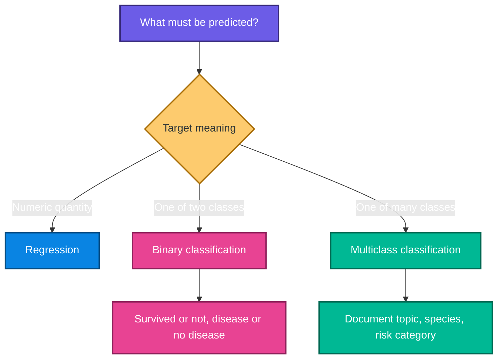

### Binary classification

The target has two classes, often encoded as $0$ and $1$:

$$
Y\in\{0,1\}
$$

The numeric encoding is a representation, not a claim that class 1 is quantitatively one unit larger than class 0.

### Multiclass classification

The target has $K>2$ mutually exclusive classes:

$$
Y\in\{1,2,\ldots,K\}
$$

### Multilabel classification

One observation may have several labels simultaneously, such as a document tagged both “finance” and “technology.” This differs from ordinary multiclass classification.

### When should classification be used?

Use classification when the action depends on class membership or class probability. If the target is an amount, duration, or price whose numerical distance matters, use regression instead.

> **Fun fact:** A good classifier often produces useful probabilities first and class labels second. The threshold converts probability into an action.

---

## 3. Probabilities, scores, and decision thresholds

A binary classifier may estimate:

$$
\hat{p}(\mathbf{x})=P(Y=1\mid\mathbf{x})
$$

A threshold $t$ converts the probability into a label:

$$
\hat{y}=\begin{cases}
1,&\hat{p}\geq t\\
0,&\hat{p}<t
\end{cases}
$$

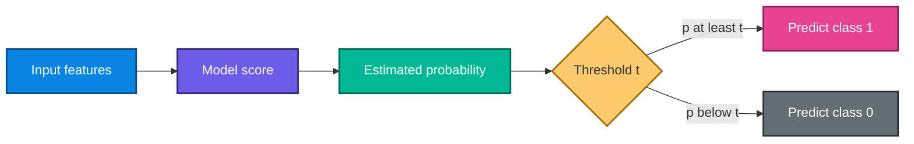

The common threshold $t=0.5$ is a default, not a universal law. Lowering $t$ usually predicts more positives, increasing recall and often increasing false positives. Raising $t$ usually does the reverse.

### Threshold example

If $\hat{p}=0.72$:

- at $t=0.50$, predict class 1;
- at $t=0.80$, predict class 0.

The model probability did not change. The decision rule changed.

---

## 4. Logistic regression

Despite its name, logistic regression is primarily a classification algorithm.

### 4.1 Linear score

$$
z=\beta_0+\beta_1x_1+\cdots+\beta_px_p
$$

The score $z$ can be any real number.

### 4.2 Sigmoid function

The sigmoid maps the score to $(0,1)$:

$$
\sigma(z)=\frac{1}{1+e^{-z}}
$$

Therefore:

$$
P(Y=1\mid\mathbf{x})=
\frac{1}{1+e^{-(\beta_0+\boldsymbol{\beta}^{T}\mathbf{x})}}
$$

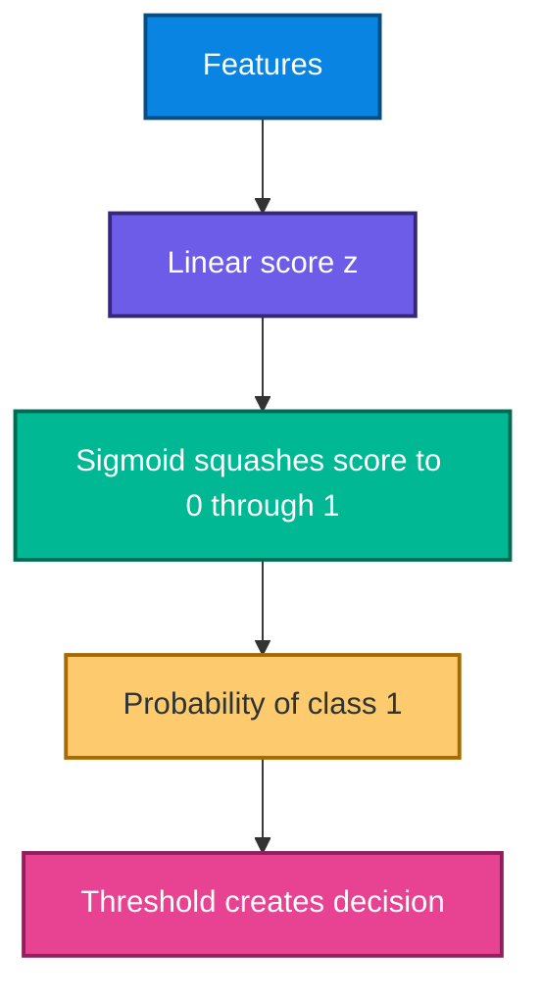

### 4.3 Log odds

Logistic regression assumes the log odds are linear:

$$
\log\left(\frac{p}{1-p}\right)=
\beta_0+\sum_{j=1}^{p}\beta_jx_j
$$

Exponentiating a coefficient gives an odds ratio:

$$
OR_j=e^{\beta_j}
$$

Holding other included features constant, a one-unit increase in $x_j$ multiplies the modeled odds by $e^{\beta_j}$.

### 4.4 Decision boundary

At threshold $0.5$:

$$
\sigma(z)\geq0.5\iff z\geq0
$$

Thus the boundary is:

$$
\beta_0+\boldsymbol{\beta}^{T}\mathbf{x}=0
$$

The boundary is linear in the provided feature space. Polynomial and interaction features can make it nonlinear in the original inputs.

### 4.5 Small sigmoid example

```python
import numpy as np

def sigmoid(z):
    """Convert any real-valued score into a probability-like value."""
    return 1.0 / (1.0 + np.exp(-z))

scores = np.array([-4.0, -1.0, 0.0, 1.0, 4.0])
probabilities = sigmoid(scores)

for score, probability in zip(scores, probabilities):
    print(f"score={score:>4.1f}, probability={probability:.4f}")
```

---

## 5. Log loss and model fitting

Squared error is not the standard objective for logistic regression. Binary cross-entropy, also called log loss, is used.

### 5.1 One observation

$$
\ell(y,p)=-\left[y\log(p)+(1-y)\log(1-p)\right]
$$

If $y=1$:

$$
\ell=-\log(p)
$$

If $y=0$:

$$
\ell=-\log(1-p)
$$

### 5.2 Dataset average

$$
J(\boldsymbol{\beta})=-\frac{1}{n}\sum_{i=1}^{n}
\left[y_i\log(p_i)+(1-y_i)\log(1-p_i)\right]
$$

Confident wrong predictions receive a large penalty. Predicting $p=0.99$ when $y=0$ is punished much more than predicting $p=0.55$.

### 5.3 Regularized logistic regression

An L2-regularized objective can be written as:

$$
J_{L2}=J+\lambda\sum_{j=1}^{p}\beta_j^2
$$

The intercept is ordinarily excluded from the penalty.

### 5.4 Why not take `log(0)`?

$\log(0)$ is undefined. Stable implementations clip probabilities or compute the loss directly from logits using numerically stable functions.

> **Fun fact:** Log loss evaluates probability quality, while accuracy evaluates thresholded labels. Two models with equal accuracy can have very different log loss.

---

## 6. The confusion matrix

For binary classification:

| Actual / Predicted | Negative | Positive |
|---|---:|---:|
| Negative | true negative, TN | false positive, FP |
| Positive | false negative, FN | true positive, TP |

### Error types

- **Type I error:** false positive.
- **Type II error:** false negative.

These names come from hypothesis testing. In an application, always state the actual consequence instead of relying only on the type number.

### Confusion-matrix example

Suppose:

$$
TN=90,\quad FP=10,\quad FN=20,\quad TP=80
$$

Total observations:

$$
N=TN+FP+FN+TP=200
$$

---

## 7. Classification metrics

### 7.1 Accuracy

$$
Accuracy=\frac{TP+TN}{TP+TN+FP+FN}
$$

Useful when classes and error costs are reasonably balanced. It can be misleading under class imbalance.

### 7.2 Precision

$$
Precision=\frac{TP}{TP+FP}
$$

Question answered: “Among predicted positives, how many were truly positive?”

Prioritize precision when false-positive actions are expensive, such as wrongly blocking legitimate communication.

### 7.3 Recall or sensitivity

$$
Recall=Sensitivity=\frac{TP}{TP+FN}
$$

Question answered: “Among actual positives, how many did the model detect?”

Prioritize recall when missed positives are especially costly, while still controlling harmful false positives.

### 7.4 Specificity

$$
Specificity=\frac{TN}{TN+FP}
$$

### 7.5 False-positive rate

$$
FPR=\frac{FP}{FP+TN}=1-Specificity
$$

### 7.6 F1 score

$$
F_1=2\frac{Precision\times Recall}{Precision+Recall}
$$

F1 is the harmonic mean. It is low when either precision or recall is low. It ignores true negatives, so do not use it automatically.

### 7.7 Balanced accuracy

$$
Balanced\ Accuracy=\frac{Sensitivity+Specificity}{2}
$$

Useful when both classes matter but prevalence is uneven.

### 7.8 Worked example

Using $TN=90$, $FP=10$, $FN=20$, and $TP=80$:

$$
Accuracy=\frac{80+90}{200}=0.85
$$

$$
Precision=\frac{80}{80+10}\approx0.889
$$

$$
Recall=\frac{80}{80+20}=0.80
$$

$$
Specificity=\frac{90}{90+10}=0.90
$$

$$
F_1=2\frac{0.889\times0.80}{0.889+0.80}\approx0.842
$$

### Which metric should lead?

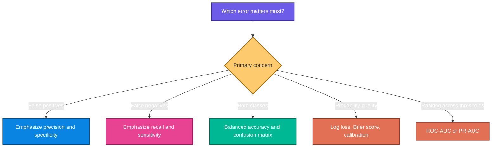

---

## 8. Choosing thresholds and probability metrics

### 8.1 ROC curve and ROC-AUC

The ROC curve plots recall against false-positive rate across thresholds. ROC-AUC measures ranking quality across all thresholds.

An AUC of 0.5 corresponds to random ranking under ordinary conditions; 1.0 is perfect ranking. AUC does not prove calibrated probabilities or usefulness at the chosen threshold.

### 8.2 Precision-recall curve and PR-AUC

PR curves focus on positive-class precision and recall. They are often more informative when the positive class is rare and operationally important.

### 8.3 Calibration

If predictions around 0.8 are calibrated, approximately 80% of comparable cases should be positive.

The Brier score is:

$$
Brier=\frac{1}{n}\sum_{i=1}^{n}(p_i-y_i)^2
$$

Lower is better. It combines calibration and discrimination effects.

### 8.4 Cost-based thresholding

A simple validation-set cost is:

$$
Cost(t)=C_{FP}\,FP(t)+C_{FN}\,FN(t)
$$

Choose $t$ on validation data after specifying $C_{FP}$ and $C_{FN}$. Never tune the threshold on the final test set.

### Threshold-tuning example

```python
import numpy as np
from sklearn.metrics import precision_recall_curve

# validation_probability must come from a model that did not train on X_valid.
precision, recall, thresholds = precision_recall_curve(
    y_valid,
    validation_probability,
)

# thresholds has one fewer element than precision and recall.
valid = np.flatnonzero(recall[:-1] >= 0.90)
if len(valid) == 0:
    raise ValueError("No threshold achieved the required validation recall")

# Among thresholds meeting recall, choose the one with highest precision.
best_index = valid[np.argmax(precision[:-1][valid])]
chosen_threshold = thresholds[best_index]
print("Chosen validation threshold:", chosen_threshold)
```

---

## 9. K-nearest neighbors

KNN predicts using nearby training observations. It stores the training data rather than learning a compact global equation.

### 9.1 Euclidean distance

$$
d(\mathbf{x},\mathbf{z})=
\sqrt{\sum_{j=1}^{p}(x_j-z_j)^2}
$$

### 9.2 Minkowski distance

$$
d_q(\mathbf{x},\mathbf{z})=
\left(\sum_{j=1}^{p}|x_j-z_j|^q\right)^{1/q}
$$

$q=1$ gives Manhattan distance; $q=2$ gives Euclidean distance.

### 9.3 Voting

For neighborhood $N_k(\mathbf{x})$:

$$
\hat{y}=mode\{y_i:i\in N_k(\mathbf{x})\}
$$

An unweighted probability estimate is:

$$
\hat{P}(Y=c\mid\mathbf{x})=
\frac{1}{k}\sum_{i\in N_k(\mathbf{x})}\mathbf{1}(y_i=c)
$$

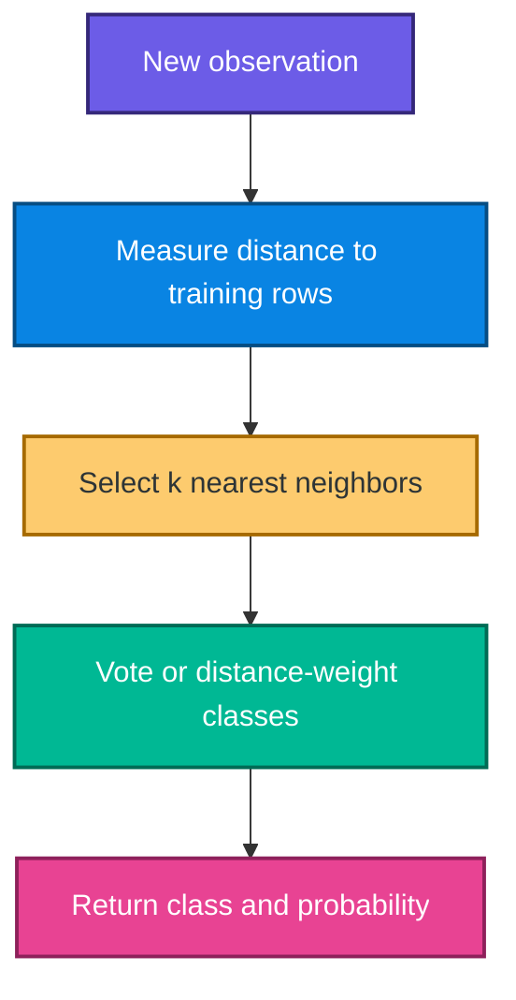

### Why scaling is essential

Without scaling, a feature measured in thousands can dominate one measured from 0 to 1. Fit the scaler on training data and apply the same transformation to validation, test, and production inputs.

### Choosing $k$

- small $k$: flexible, noisy, high variance;
- large $k$: smoother, potentially high bias;
- tune $k$ through cross-validation;
- use an odd $k$ in binary tasks only as a tie-reduction heuristic, not a universal rule.

### Strengths and limitations

| Strength | Limitation |
|---|---|
| simple and nonlinear | prediction can be slow |
| few modeling assumptions | sensitive to scale and irrelevant features |
| local decision behavior | suffers in high dimensions |

> **Fun fact:** As dimensions grow, distances often become less distinguishable. This is one aspect of the curse of dimensionality.

---

## 10. Naive Bayes

Naive Bayes applies Bayes' theorem with a conditional-independence assumption.

### 10.1 Bayes' theorem

$$
P(C\mid\mathbf{x})=
\frac{P(\mathbf{x}\mid C)P(C)}{P(\mathbf{x})}
$$

For class comparison, $P(\mathbf{x})$ is common:

$$
P(C\mid\mathbf{x})\propto P(C)P(\mathbf{x}\mid C)
$$

### 10.2 Naive factorization

$$
P(\mathbf{x}\mid C)=\prod_{j=1}^{p}P(x_j\mid C)
$$

Therefore:

$$
\hat{C}=\arg\max_C
P(C)\prod_{j=1}^{p}P(x_j\mid C)
$$

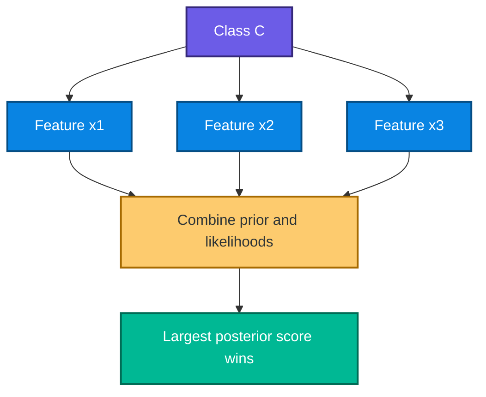

The diagram expresses conditional independence of features given the class. Real features are often dependent, but the classifier can still perform well.

### 10.3 Gaussian Naive Bayes

For continuous feature $x_j$ within class $C$:

$$
P(x_j\mid C)=
\frac{1}{\sqrt{2\pi\sigma_{Cj}^{2}}}
\exp\left[-\frac{(x_j-\mu_{Cj})^2}{2\sigma_{Cj}^{2}}\right]
$$

### 10.4 Log space

Multiplying many small probabilities can underflow. Implementations add log probabilities:

$$
\log P(C\mid\mathbf{x})=
constant+\log P(C)+\sum_{j=1}^{p}\log P(x_j\mid C)
$$

### Variants

- GaussianNB: continuous approximately Gaussian features;
- MultinomialNB: non-negative counts, common for text;
- BernoulliNB: binary indicators;
- ComplementNB: often useful for imbalanced text classification.

---

## 11. Decision trees

A decision tree recursively splits the feature space into regions.

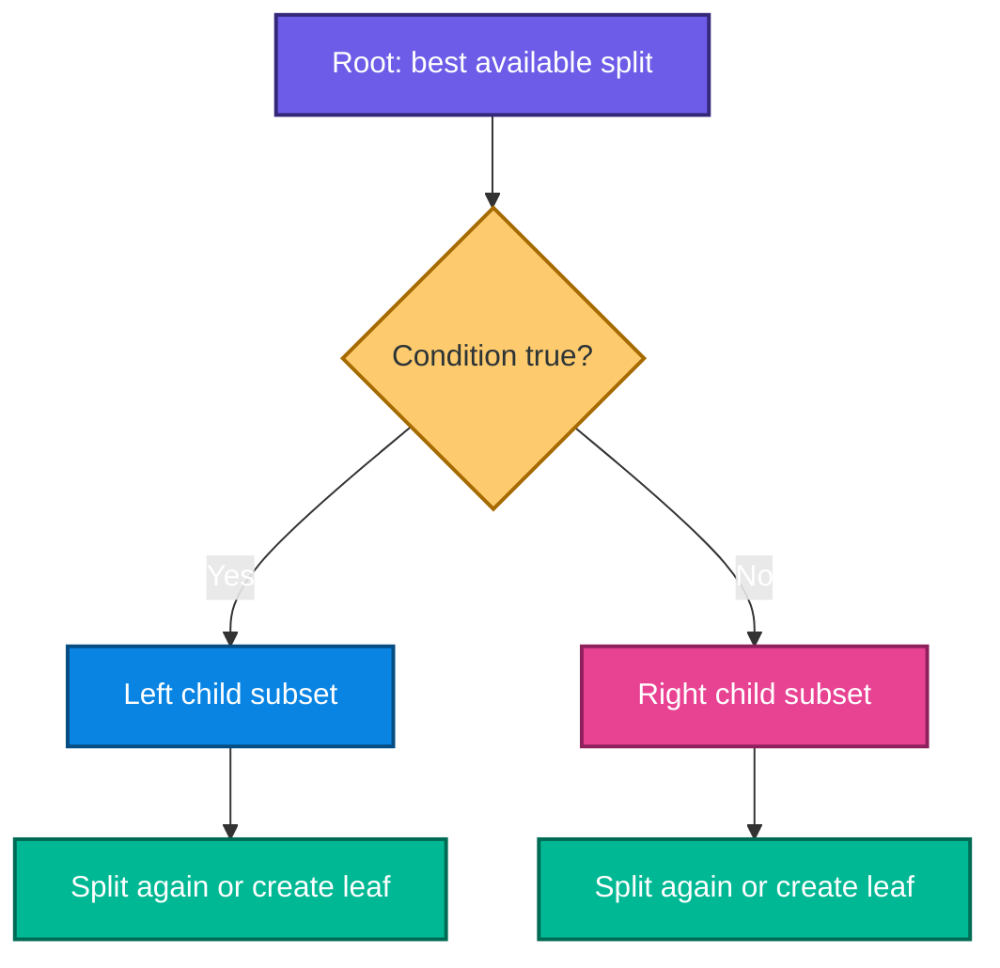

### 11.1 Entropy

For class proportions $p_1,\ldots,p_K$:

$$
H(S)=-\sum_{k=1}^{K}p_k\log_2(p_k)
$$

Pure nodes have entropy 0.

### 11.2 Gini impurity

$$
Gini(S)=1-\sum_{k=1}^{K}p_k^2
$$

### 11.3 Information gain

For child subsets $S_v$:

$$
IG(S,split)=H(S)-
\sum_v\frac{|S_v|}{|S|}H(S_v)
$$

The tree prefers large impurity reduction.

### 11.4 Why trees overfit

An unrestricted tree can isolate individual training rows. Control complexity with:

- `max_depth`;
- `min_samples_split`;
- `min_samples_leaf`;
- `max_leaf_nodes`;
- cost-complexity pruning through `ccp_alpha`.

### Scaling

Ordinary decision-tree splits depend on feature order, so scaling is generally unnecessary.

### Random forests

The transcript previews random forests. A random forest averages many trees fitted to bootstrap samples and random feature subsets. This usually reduces variance compared with one deep tree, but it is not implemented in the attached notebooks.

---

## 12. Support-vector machines

An SVM searches for a separating hyperplane with a large margin.

### 12.1 Hyperplane

$$
\mathbf{w}^{T}\mathbf{x}+b=0
$$

Prediction for a linear SVM is based on:

$$
sign(\mathbf{w}^{T}\mathbf{x}+b)
$$

### 12.2 Distance and margin

The signed distance is proportional to:

$$
\frac{\mathbf{w}^{T}\mathbf{x}+b}{\|\mathbf{w}\|}
$$

Under the canonical scaling, total margin width is:

$$
\frac{2}{\|\mathbf{w}\|}
$$

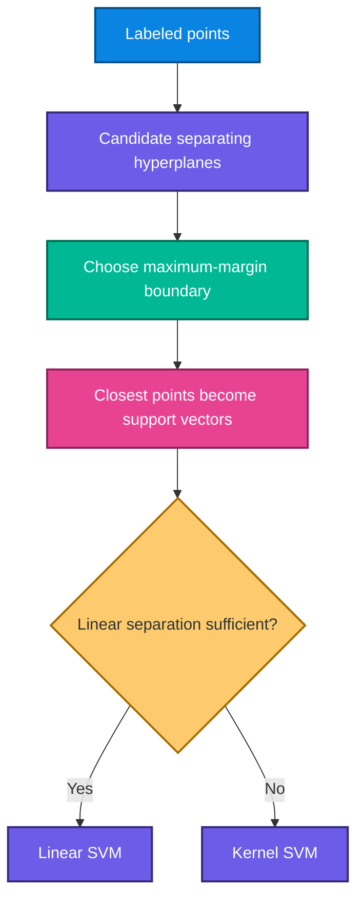

### 12.3 Soft margin and hinge loss

For $y_i\in\{-1,+1\}$, hinge loss is:

$$
\ell_i=\max\left(0,1-y_i(\mathbf{w}^{T}\mathbf{x}_i+b)\right)
$$

A simplified soft-margin objective is:

$$
\min_{\mathbf{w},b}
\frac{1}{2}\|\mathbf{w}\|^2+
C\sum_{i=1}^{n}\ell_i
$$

- large $C$: stronger penalty for violations, potentially higher variance;
- small $C$: wider, softer margin, potentially higher bias.

### 12.4 Kernel trick

A kernel computes similarity as if data had been mapped to another feature space.

The RBF kernel is:

$$
K(\mathbf{x},\mathbf{z})=
\exp\left(-\gamma\|\mathbf{x}-\mathbf{z}\|^2\right)
$$

- large $\gamma$: very local and flexible boundary;
- small $\gamma$: smoother, broader influence.

### Important practical points

- scale features before SVM fitting;
- tune $C$ and $\gamma$ through cross-validation;
- `SVC(probability=True)` adds probability calibration work and cost;
- SVM decision scores are not automatically calibrated probabilities;
- kernel SVMs can be slow on very large datasets.

---

## 13. Cross-validation and model selection

In stratified $K$-fold cross-validation, each fold approximately preserves class proportions.

$$
\bar{s}_{CV}=\frac{1}{K}\sum_{k=1}^{K}s_k
$$

The fold standard deviation is:

$$
s_{CV}=\sqrt{\frac{1}{K-1}\sum_{k=1}^{K}(s_k-\bar{s}_{CV})^2}
$$

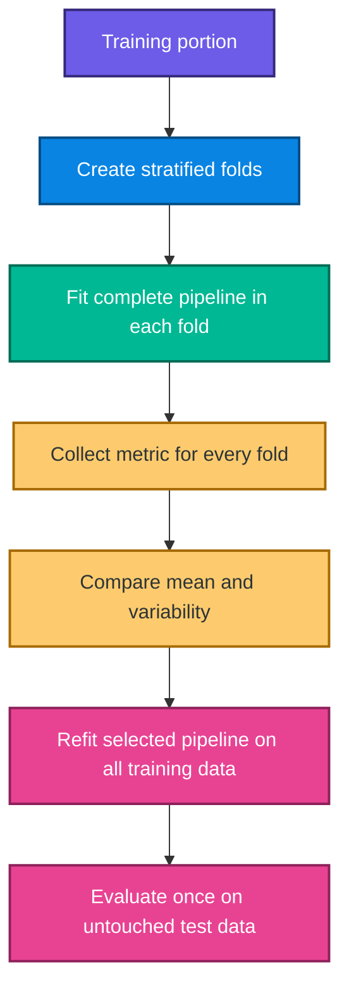

### Why the complete pipeline must be cross-validated

If scaling or imputation is fitted before CV, each validation fold influences the transformation applied to its training folds. Cross-validation must receive raw fold data and fit preprocessing internally.

### Model selection versus final evaluation

If five models are compared on one test set and the best is selected, the test set has influenced model choice. Use CV inside the training portion for selection; reserve test data for one final estimate.

---

## 14. Preprocessing and data leakage

### 14.1 Split before learned preprocessing

Fit these on training data only:

- numeric imputation values;
- category imputation values;
- scaling means and standard deviations;
- encoders with learned categories;
- feature selection;
- model hyperparameters;
- probability calibration;
- decision thresholds.

### 14.2 Correct test transformation

```python
# Correct pattern outside a pipeline.
X_train_scaled = scaler.fit_transform(X_train)
X_test_scaled = scaler.transform(X_test)
```

Never call `fit_transform` on the test set. That creates a different coordinate system.

### 14.3 Nominal categories

Titanic `embarked` values C, Q, and S have no numeric order. Label encoding C=0, Q=1, S=2 lets a linear or distance model treat S as numerically farther from C than Q. One-hot encoding is safer.

### 14.4 Do not cast continuous values to integer

Whole-frame `astype(int)` truncates:

- Titanic age and fare;
- heart-disease `Oldpeak`;
- imputed cholesterol and blood-pressure values;
- Boolean dummies are converted correctly, but unrelated floats are damaged.

### 14.5 Sentinel values

The heart notebook shows zero values for cholesterol and resting blood pressure. A zero may represent missing measurement, but this must be verified with dataset documentation. Replace verified sentinels with `NaN` before a training-only imputer.

---

## 15. Reusable leakage-safe utilities

The following helpers compare classifiers while fitting preprocessing separately inside every CV fold.

```python
from sklearn.base import clone
from sklearn.linear_model import LogisticRegression
from sklearn.metrics import make_scorer, precision_score
from sklearn.model_selection import StratifiedKFold, cross_validate
from sklearn.naive_bayes import GaussianNB
from sklearn.neighbors import KNeighborsClassifier
from sklearn.pipeline import Pipeline
from sklearn.svm import SVC
from sklearn.tree import DecisionTreeClassifier

RANDOM_STATE = 42

def build_candidates(feature_processor):
    """Attach several classifiers to independent preprocessing clones."""
    estimators = {
        "Logistic Regression": LogisticRegression(
            max_iter=2_000,
            random_state=RANDOM_STATE,
        ),
        "KNN": KNeighborsClassifier(n_neighbors=5),
        "Gaussian Naive Bayes": GaussianNB(),
        "Decision Tree": DecisionTreeClassifier(
            max_depth=5,
            min_samples_leaf=10,
            random_state=RANDOM_STATE,
        ),
        "RBF SVM": SVC(
            kernel="rbf",
            probability=True,
            random_state=RANDOM_STATE,
        ),
    }

    return {
        name: Pipeline(
            steps=[
                ("features", clone(feature_processor)),
                ("model", estimator),
            ]
        )
        for name, estimator in estimators.items()
    }

def compare_candidates(candidates, X_train, y_train):
    """Return CV means and variability without touching the test set."""
    cv = StratifiedKFold(
        n_splits=5,
        shuffle=True,
        random_state=RANDOM_STATE,
    )

    scoring = {
        "accuracy": "accuracy",
        "balanced_accuracy": "balanced_accuracy",
        "precision": make_scorer(precision_score, zero_division=0),
        "recall": "recall",
        "f1": "f1",
        "roc_auc": "roc_auc",
    }

    rows = []
    for name, pipeline in candidates.items():
        scores = cross_validate(
            pipeline,
            X_train,
            y_train,
            cv=cv,
            scoring=scoring,
            n_jobs=-1,
        )
        rows.append(
            {
                "Model": name,
                "CV F1": scores["test_f1"].mean(),
                "CV Recall": scores["test_recall"].mean(),
                "CV Precision": scores["test_precision"].mean(),
                "CV Balanced Accuracy": scores[
                    "test_balanced_accuracy"
                ].mean(),
                "CV ROC-AUC": scores["test_roc_auc"].mean(),
                "F1 Std": scores["test_f1"].std(),
            }
        )

    return rows
```

Hyperparameters such as KNN's $k$, tree depth, and SVM's $C$ and $\gamma$ should later be tuned through a nested pipeline search rather than fixed permanently from this initial comparison.

---

## 16. Titanic survival project

### 16.1 Recorded data audit

The notebook records:

| Property | Recorded value |
|---|---:|
| rows before cleaning | 891 |
| original columns | 15 |
| non-missing age values | 714 |
| non-missing embarked values | 889 |
| non-missing deck values | 203 |
| rows after dropping missing embarked | 889 |

The notebook correctly removes `alive`, which directly restates the target and would cause target leakage. It also drops redundant or highly missing columns.

### 16.2 Project structure

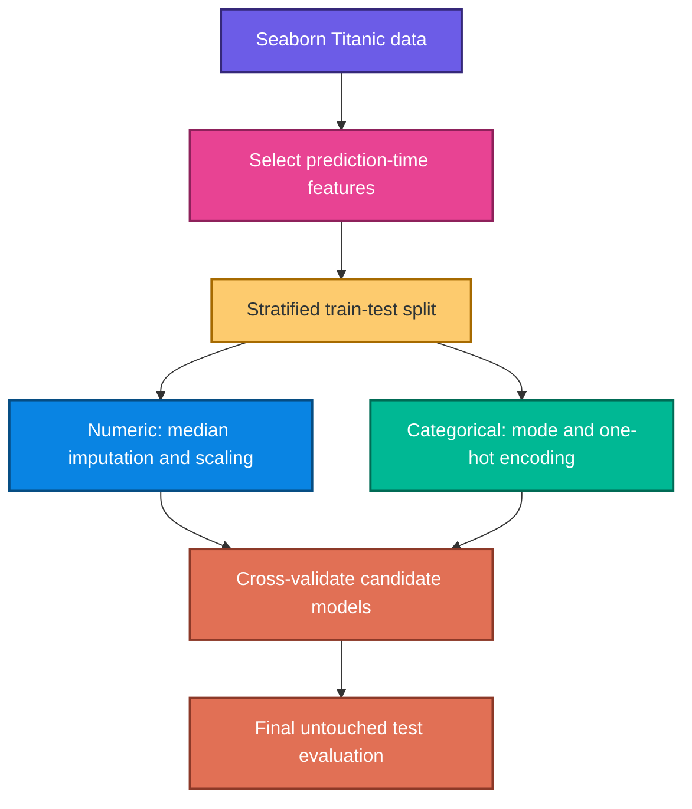

### 16.3 Corrected Titanic implementation

```python
import pandas as pd
import seaborn as sns
from sklearn.compose import ColumnTransformer
from sklearn.impute import SimpleImputer
from sklearn.metrics import classification_report, confusion_matrix, roc_auc_score
from sklearn.model_selection import train_test_split
from sklearn.pipeline import Pipeline
from sklearn.preprocessing import OneHotEncoder, StandardScaler

# Seaborn downloads this dataset when it is not already cached.
titanic = sns.load_dataset("titanic")

# Use features that can be defined consistently at prediction time.
feature_columns = [
    "pclass",
    "sex",
    "age",
    "sibsp",
    "parch",
    "fare",
    "embarked",
    "alone",
]

X = titanic[feature_columns]
y = titanic["survived"]

X_train, X_test, y_train, y_test = train_test_split(
    X,
    y,
    test_size=0.20,
    random_state=RANDOM_STATE,
    stratify=y,
)

numeric_features = ["age", "sibsp", "parch", "fare"]
categorical_features = ["pclass", "sex", "embarked", "alone"]

numeric_pipeline = Pipeline(
    steps=[
        ("imputer", SimpleImputer(strategy="median", add_indicator=True)),
        ("scaler", StandardScaler()),
    ]
)

categorical_pipeline = Pipeline(
    steps=[
        ("imputer", SimpleImputer(strategy="most_frequent")),
        (
            "onehot",
            OneHotEncoder(
                handle_unknown="ignore",
                sparse_output=False,
            ),
        ),
    ]
)

feature_processor = ColumnTransformer(
    transformers=[
        ("numeric", numeric_pipeline, numeric_features),
        ("categorical", categorical_pipeline, categorical_features),
    ]
)

candidates = build_candidates(feature_processor)
comparison = pd.DataFrame(
    compare_candidates(candidates, X_train, y_train)
).sort_values("CV F1", ascending=False)
print(comparison)

# Model selection uses CV results from training data, not the test set.
selected_name = comparison.iloc[0]["Model"]
selected_pipeline = candidates[selected_name]
selected_pipeline.fit(X_train, y_train)

test_class = selected_pipeline.predict(X_test)
test_probability = selected_pipeline.predict_proba(X_test)[:, 1]

print("Selected model:", selected_name)
print(confusion_matrix(y_test, test_class))
print(classification_report(y_test, test_class, digits=3))
print("Test ROC-AUC:", roc_auc_score(y_test, test_probability))
```

### 16.4 Notebook-recorded holdout results

The original notebook uses one 80/20 split after preprocessing:

| Model | Accuracy | Positive-class precision | Positive-class recall | Positive-class F1 |
|---|---:|---:|---:|---:|
| Logistic Regression | 0.8034 | 0.74 | 0.77 | 0.75 |
| KNN | 0.7753 | 0.71 | 0.71 | 0.71 |
| Gaussian Naive Bayes | 0.7753 | 0.68 | 0.78 | 0.73 |
| Decision Tree | 0.7697 | 0.70 | 0.71 | 0.71 |
| Linear SVM | 0.8034 | 0.74 | 0.75 | 0.75 |

The logistic confusion matrix is:

$$
\begin{bmatrix}
90 & 19\\
16 & 53
\end{bmatrix}
$$

The notebook also records mean five-fold SVM accuracy 0.7874, but scaling was fitted before cross-validation, so that CV estimate is not fully leakage-safe.

### 16.5 Titanic notebook corrections

- age mean imputation occurs before splitting;
- `embarked` receives arbitrary ordinal integers;
- whole-frame integer casting truncates age and fare;
- KNN and SVM test data are scaled using `fit_transform` rather than `transform`;
- the test set is reused to compare many models;
- CV is run after full-data scaling;
- the split does not stratify the target;
- warnings are globally suppressed;
- probability quality and threshold choice are not evaluated.

---

## 17. Heart-disease project

### 17.1 Recorded data audit

The notebook records:

| Property | Recorded value |
|---|---:|
| rows | 918 |
| columns | 12 |
| ordinary `NaN` cells | 0 |
| exact duplicate rows | 0 |
| positive target share | 0.5534 |
| minimum resting BP | 0 |
| minimum cholesterol | 0 |

The target counts implied by the recorded share are 508 positive and 410 negative rows.

Zero cholesterol and resting blood pressure require domain verification because they may be missing-value sentinels rather than measurements.

### 17.2 Medical-model workflow

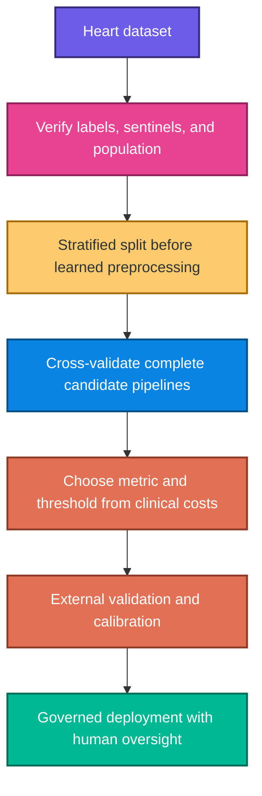

### 17.3 Corrected heart implementation

This example requires the missing `heart.csv` file.

```python
from pathlib import Path

import pandas as pd
from sklearn.compose import ColumnTransformer
from sklearn.impute import SimpleImputer
from sklearn.model_selection import train_test_split
from sklearn.pipeline import Pipeline
from sklearn.preprocessing import OneHotEncoder, StandardScaler

heart = pd.read_csv(Path("heart.csv"))

X = heart.drop(columns="HeartDisease")
y = heart["HeartDisease"]

X_train, X_test, y_train, y_test = train_test_split(
    X,
    y,
    test_size=0.20,
    random_state=RANDOM_STATE,
    stratify=y,
)

regular_numeric_features = [
    "Age",
    "MaxHR",
    "Oldpeak",
]
zero_sentinel_features = ["RestingBP", "Cholesterol"]
categorical_features = [
    "Sex",
    "ChestPainType",
    "FastingBS",
    "RestingECG",
    "ExerciseAngina",
    "ST_Slope",
]

regular_numeric_pipeline = Pipeline(
    steps=[
        ("imputer", SimpleImputer(strategy="median", add_indicator=True)),
        ("scaler", StandardScaler()),
    ]
)

# Use this only after confirming that zero means missing in these columns.
# The imputer learns replacement medians from each training fold.
zero_sentinel_pipeline = Pipeline(
    steps=[
        (
            "imputer",
            SimpleImputer(
                missing_values=0,
                strategy="median",
                add_indicator=True,
            ),
        ),
        ("scaler", StandardScaler()),
    ]
)

categorical_pipeline = Pipeline(
    steps=[
        ("imputer", SimpleImputer(strategy="most_frequent")),
        (
            "onehot",
            OneHotEncoder(
                handle_unknown="ignore",
                sparse_output=False,
            ),
        ),
    ]
)

column_processor = ColumnTransformer(
    transformers=[
        (
            "regular_numeric",
            regular_numeric_pipeline,
            regular_numeric_features,
        ),
        (
            "zero_sentinels",
            zero_sentinel_pipeline,
            zero_sentinel_features,
        ),
        ("categorical", categorical_pipeline, categorical_features),
    ]
)

# Every preprocessing statistic is learned separately inside each training fold.
feature_processor = column_processor

candidates = build_candidates(feature_processor)
comparison = pd.DataFrame(
    compare_candidates(candidates, X_train, y_train)
).sort_values("CV Recall", ascending=False)
print(comparison)

# This is only an illustrative rule. A real project must first define the
# minimum acceptable sensitivity, specificity, calibration, and clinical cost.
selected_name = comparison.iloc[0]["Model"]
selected_pipeline = candidates[selected_name]
print("CV-selected candidate:", selected_name)
```

For a real medical use case, select the primary metric and minimum sensitivity before model comparison. Do not automatically select whichever model has the largest accuracy or F1 on one split.

### 17.4 Notebook-recorded holdout results

| Model | Accuracy | F1 |
|---|---:|---:|
| Logistic Regression | 0.8750 | 0.8878 |
| KNN | 0.8859 | 0.8986 |
| Gaussian Naive Bayes | 0.8696 | 0.8788 |
| Decision Tree | 0.7446 | 0.7513 |
| RBF SVM | 0.8641 | 0.8804 |

These values come from one holdout reused for model selection. They are not final clinical-performance claims.

### 17.5 Heart notebook corrections

- sentinel means are calculated from the full dataset before splitting;
- mean imputation is sensitive to skew and is not justified against median;
- all categories are dummy-encoded before splitting;
- `astype(int)` truncates `Oldpeak` and imputed float values;
- the same test set chooses KNN and reports its performance;
- no CV variability, ROC-AUC, PR-AUC, calibration, or threshold analysis is shown;
- the decision tree lacks a fixed random state and complexity controls;
- a third-party EDA package is installed for information pandas can report transparently;
- the saved artifacts omit sentinel handling, imputation, and encoding;
- no external or subgroup validation is performed.

---

## 18. Saving and using the complete pipeline

Save the chosen fitted pipeline as one object.

```python
import joblib
import pandas as pd

# Fit only after model and threshold choices have been finalized from training/CV.
selected_pipeline.fit(X_train, y_train)
joblib.dump(selected_pipeline, "heart_classification_pipeline.joblib")

# Load the same preprocessing and model together.
loaded_pipeline = joblib.load("heart_classification_pipeline.joblib")

# Production input keeps the original raw schema.
one_patient = pd.DataFrame(
    [
        {
            "Age": 54,
            "Sex": "M",
            "ChestPainType": "ASY",
            "RestingBP": 140,
            "Cholesterol": 230,
            "FastingBS": 0,
            "RestingECG": "Normal",
            "MaxHR": 150,
            "ExerciseAngina": "N",
            "Oldpeak": 1.2,
            "ST_Slope": "Flat",
        }
    ]
)

probability = loaded_pipeline.predict_proba(one_patient)[:, 1]
print("Model probability:", probability[0])
```

The pipeline ensures raw features undergo the exact same sentinel handling, imputation, encoding, scaling, and prediction logic used during training.

Do not treat the probability as a diagnosis. A governed application must also apply the validated threshold, intended-use restrictions, human review, and uncertainty communication.

---

## 19. Algorithm comparison

| Algorithm | Boundary | Scaling | Main strength | Main risk |
|---|---|---|---|---|
| Logistic Regression | linear in feature space | recommended | interpretable baseline and probabilities | misses unmodeled nonlinear patterns |
| KNN | local and nonlinear | essential | simple local behavior | slow prediction and curse of dimensionality |
| Gaussian NB | probabilistic generative | usually optional | fast and effective on small data | conditional-independence/Gaussian mismatch |
| Decision Tree | axis-aligned regions | unnecessary | interpretable rules and interactions | high variance and overfitting |
| Linear SVM | maximum-margin linear | essential | strong high-dimensional classifier | probabilities require extra work |
| RBF SVM | nonlinear kernel | essential | flexible boundary | sensitive tuning and poor large-$n$ scaling |

### When to start with each

- Logistic regression: always valuable as a transparent baseline.
- KNN: small, scaled datasets with meaningful local geometry.
- Naive Bayes: fast baseline, especially for text or limited data.
- Decision tree: interpretable nonlinear rules and interactions.
- SVM: medium-sized, scaled datasets with clear margins or nonlinear structure.

No algorithm is universally best. The best choice depends on the target, cost of errors, data-generating process, validation design, and operational constraints.

---

## 20. Corrections and clarifications

| Source statement or practice | Correct interpretation |
|---|---|
| test data uses `scaler.fit_transform` | fit on training data; use `transform` on test data |
| full-data scaling before cross-validation is acceptable | cross-validate the complete preprocessing-plus-model pipeline |
| highest holdout accuracy identifies the final model | select by training/CV; evaluate once on untouched test data |
| label encoding is appropriate for embarked ports | nominal categories need one-hot or another non-ordinal encoding |
| whole-frame `astype(int)` only changes dummies | it also truncates age, fare, Oldpeak, and imputed measurements |
| F1 is always the best metric for disease prediction | metric choice depends on clinical costs; recall, calibration, and specificity may be critical |
| a default 0.5 threshold is optimal | threshold must be selected on validation data from operational costs |
| SVM output is automatically a calibrated probability | SVM scores need calibration; `probability=True` adds an estimation step |
| scaling is needed for decision trees | tree split order is unchanged by ordinary scaling |
| logistic regression never needs scaling | scaling helps optimization and regularization when magnitudes differ |
| a KNN score near 0.89 means deploy the model | one internal holdout is insufficient, especially for medical use |
| saving the model, scaler, and columns separately is complete | save the full pipeline, including sentinel handling, imputation, and encoding |
| no `NaN` values means no missing data | numeric sentinels such as zero can hide missingness |
| globally suppressing warnings is harmless | it can hide convergence, deprecation, casting, and metric problems |

---

## 21. Practice questions with solutions

### Question 1: task type

Predicting whether a passenger survived is regression or classification?

#### Solution 1

Binary classification because the target has two classes: survived and not survived.

### Question 2: sigmoid value

What is $\sigma(0)$?

#### Solution 2

$$
\sigma(0)=\frac{1}{1+e^0}=\frac{1}{2}=0.5
$$

### Question 3: decision boundary

At threshold 0.5, what logistic score separates the classes?

#### Solution 3

$z=0$, because $\sigma(0)=0.5$.

### Question 4: threshold effect

What usually happens to recall when the positive threshold decreases?

#### Solution 4

Recall usually increases because more observations are labeled positive. False positives often increase as well.

### Question 5: log loss

For $y=1$ and predicted probability $p=0.8$, calculate the individual log loss.

#### Solution 5

$$
\ell=-\log(0.8)\approx0.223
$$

### Question 6: confident mistake

Which receives larger log loss for an actual positive: $p=0.4$ or $p=0.01$?

#### Solution 6

$p=0.01$, because it is a much more confident wrong prediction.

### Question 7: confusion matrix

If $TP=40$, $FN=10$, $FP=5$, and $TN=45$, calculate accuracy.

#### Solution 7

$$
Accuracy=\frac{40+45}{40+10+5+45}=0.85
$$

### Question 8: precision

Using the same counts, calculate precision.

#### Solution 8

$$
Precision=\frac{40}{40+5}\approx0.889
$$

### Question 9: recall

Using the same counts, calculate recall.

#### Solution 9

$$
Recall=\frac{40}{40+10}=0.80
$$

### Question 10: specificity

Using the same counts, calculate specificity.

#### Solution 10

$$
Specificity=\frac{45}{45+5}=0.90
$$

### Question 11: false-positive application

Which metric becomes especially important when false positives trigger an expensive action?

#### Solution 11

Precision for the positive alerts and specificity for actual negatives are important. The exact choice should reflect the operational cost model.

### Question 12: false-negative application

Which metric directly measures the proportion of actual positives found?

#### Solution 12

Recall or sensitivity.

### Question 13: F1 limitation

Why can F1 be insufficient by itself?

#### Solution 13

It ignores true negatives, depends on the selected threshold, and does not measure calibration or actual business/clinical cost.

### Question 14: KNN distance

Find the Euclidean distance between $(1,2)$ and $(4,6)$.

#### Solution 14

$$
d=\sqrt{(4-1)^2+(6-2)^2}=\sqrt{9+16}=5
$$

### Question 15: KNN scaling

Why must mileage and a binary indicator usually be scaled before KNN?

#### Solution 15

Mileage may differ by tens of thousands and dominate the distance. Scaling gives features comparable numerical influence.

### Question 16: KNN value of $k$

What is the bias-variance effect of a very small $k$?

#### Solution 16

Low bias and high variance. The boundary follows local noise closely.

### Question 17: Bayes theorem

What is the difference between $P(C\mid X)$ and $P(X\mid C)$?

#### Solution 17

$P(C\mid X)$ is the posterior class probability after observing features. $P(X\mid C)$ is the likelihood of those features under a class.

### Question 18: naive assumption

What assumption makes Naive Bayes “naive”?

#### Solution 18

Features are assumed conditionally independent given the class.

### Question 19: tree purity

What is the entropy of a node containing only one class?

#### Solution 19

Zero, because there is no class uncertainty.

### Question 20: tree overfitting

Name two controls that can reduce decision-tree overfitting.

#### Solution 20

Examples include limiting `max_depth`, increasing `min_samples_leaf`, limiting leaf nodes, or increasing `ccp_alpha`.

### Question 21: SVM support vectors

Which observations determine the maximum-margin boundary most directly?

#### Solution 21

The support vectors, which lie on or inside the margin boundaries.

### Question 22: SVM scaling

Why is scaling important for an RBF SVM?

#### Solution 22

The kernel depends on squared distances. A large-scale feature can dominate those distances and distort the boundary.

### Question 23: SVM $C$

What is the general effect of increasing $C$?

#### Solution 23

Margin violations are penalized more strongly. The boundary may fit training data more tightly and become higher variance.

### Question 24: RBF $\gamma$

What is the general effect of a very large $\gamma$?

#### Solution 24

Each observation has very local influence, creating a highly flexible boundary that may overfit.

### Question 25: test scaling bug

Why is `scaler.fit_transform(X_test)` incorrect?

#### Solution 25

It fits new means and scales on test rows, placing test data in a different coordinate system and leaking test distribution information.

### Question 26: model-selection leakage

Why should five models not be compared repeatedly on the final test set?

#### Solution 26

Choosing the best test score makes the test set part of model selection. Its score becomes optimistically biased. Use CV on training data for comparison.

### Question 27: target leakage

Why must Titanic's `alive` column be removed when predicting `survived`?

#### Solution 27

It directly restates the outcome in text form. It would reveal the answer rather than provide a genuine prediction-time feature.

### Question 28: integer casting

What happens to heart `Oldpeak=1.5` after whole-frame `astype(int)`?

#### Solution 28

It becomes 1 through truncation, destroying measurement precision.

### Question 29: missing sentinels

Why does `isna().sum()==0` not prove the heart data has no missing measurements?

#### Solution 29

Missingness may be encoded as an ordinary number such as zero. Domain documentation must determine whether that number is a valid measurement or sentinel.

### Question 30: deployment artifact

Why save the full pipeline instead of only KNN and a scaler?

#### Solution 30

Production also needs identical sentinel replacement, imputation, category encoding, feature order, scaling, and model behavior. One pipeline preserves the complete transformation contract.

---

## 22. Quick-reference cheat sheet

### Core formulas

| Concept | Formula |
|---|---|
| sigmoid | $\sigma(z)=1/(1+e^{-z})$ |
| log odds | $\log(p/(1-p))=\beta_0+\boldsymbol{\beta}^{T}\mathbf{x}$ |
| log loss | $-[y\log p+(1-y)\log(1-p)]$ |
| accuracy | $(TP+TN)/(TP+TN+FP+FN)$ |
| precision | $TP/(TP+FP)$ |
| recall | $TP/(TP+FN)$ |
| specificity | $TN/(TN+FP)$ |
| F1 | $2PR/(P+R)$ |
| balanced accuracy | $(Sensitivity+Specificity)/2$ |
| Euclidean distance | $\sqrt{\sum_j(x_j-z_j)^2}$ |
| Bayes theorem | $P(C\mid X)=P(X\mid C)P(C)/P(X)$ |
| entropy | $-\sum_k p_k\log_2p_k$ |
| Gini impurity | $1-\sum_kp_k^2$ |
| SVM hyperplane | $\mathbf{w}^{T}\mathbf{x}+b=0$ |
| RBF kernel | $\exp(-\gamma\lVert\mathbf{x}-\mathbf{z}\rVert^2)$ |

### Algorithm requirements

| Algorithm | Scale numeric features? | Encode categories? | Probability note |
|---|---|---|---|
| Logistic Regression | recommended | yes | often usable, verify calibration |
| KNN | yes | yes | neighbor proportion, may be rough |
| Gaussian NB | usually optional | yes | often poorly calibrated under mismatch |
| Decision Tree | no | yes | leaf frequency, can be extreme |
| SVM | yes | yes | calibration step required |

### Final checklist

- [ ] Define the positive class and prediction time.
- [ ] Specify the costs of false positives and false negatives.
- [ ] Remove target leakage and post-outcome variables.
- [ ] Verify missing-value sentinels and impossible values.
- [ ] Split before learned preprocessing.
- [ ] Put imputation, encoding, scaling, and model inside one pipeline.
- [ ] Use stratified CV for model and hyperparameter selection.
- [ ] Compare against majority and simple linear baselines.
- [ ] Report the confusion matrix and several relevant metrics.
- [ ] Evaluate ROC/PR ranking and probability calibration when needed.
- [ ] Select thresholds on validation data, not test data.
- [ ] Evaluate the selected pipeline once on untouched test data.
- [ ] Save and version the complete fitted pipeline.
- [ ] Monitor drift, calibration, subgroup errors, and operational impact.
- [ ] Require external validation and governance for high-stakes use.

---

> **Core intuition:** Classification is not merely choosing an algorithm and reading accuracy. A trustworthy classifier produces validated scores or probabilities, converts them into decisions using an explicit threshold, and preserves the separation between training choices and final evaluation.
