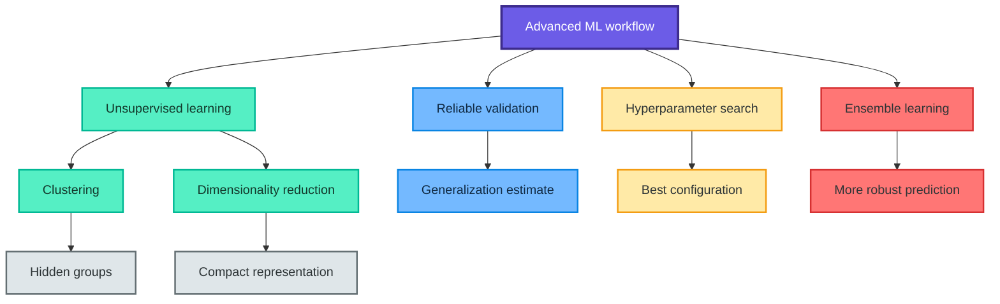
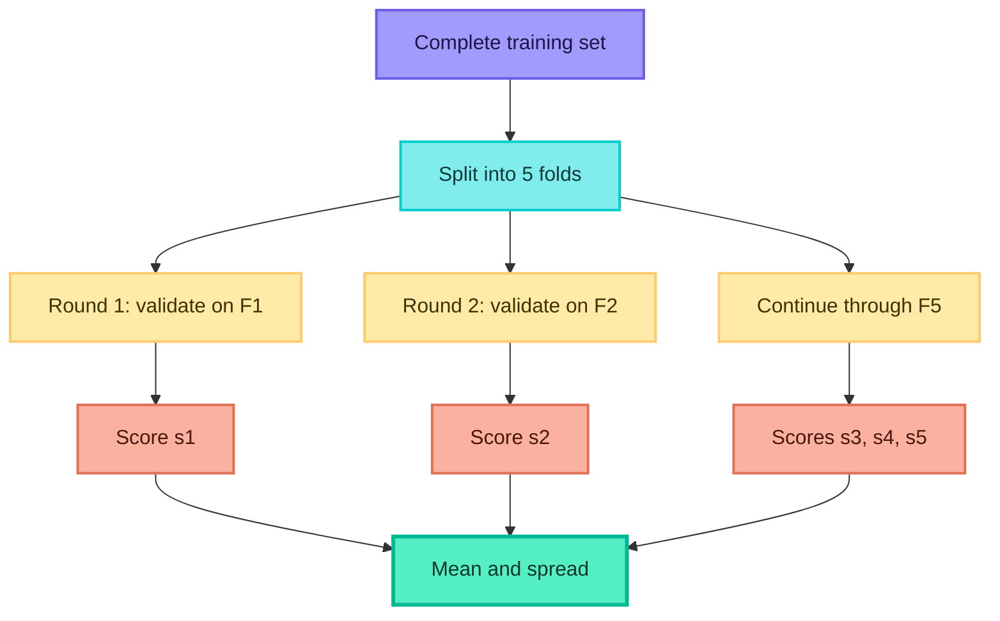
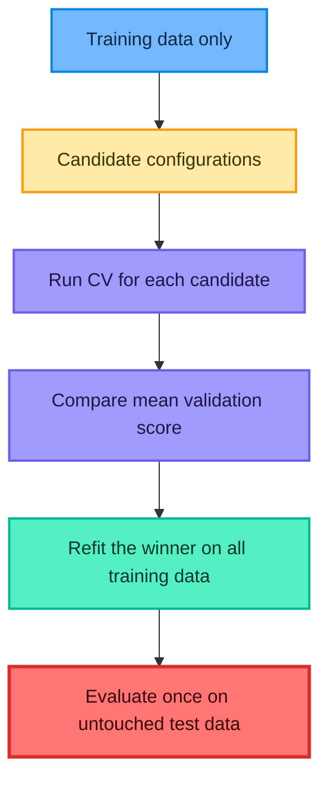
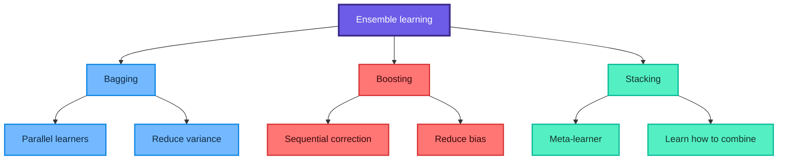
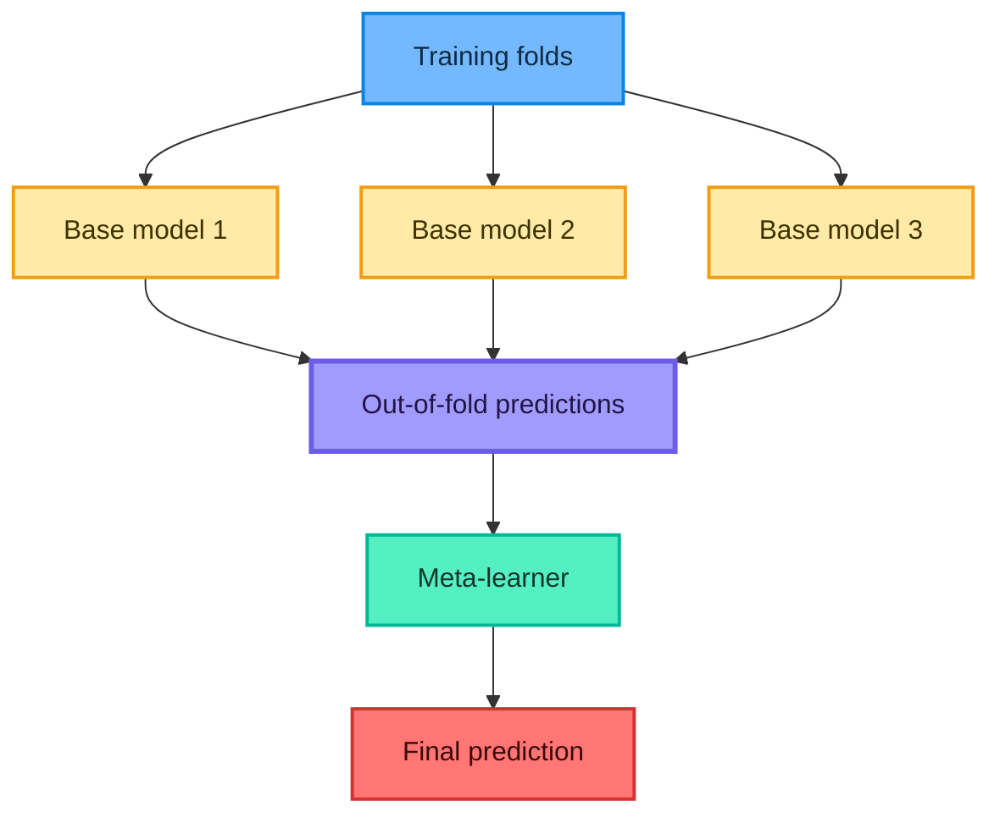
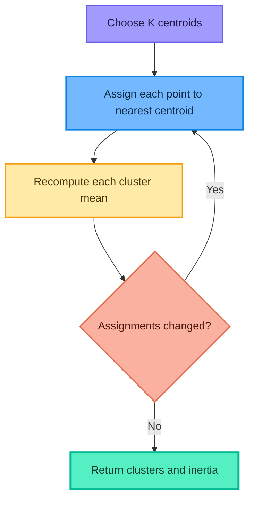
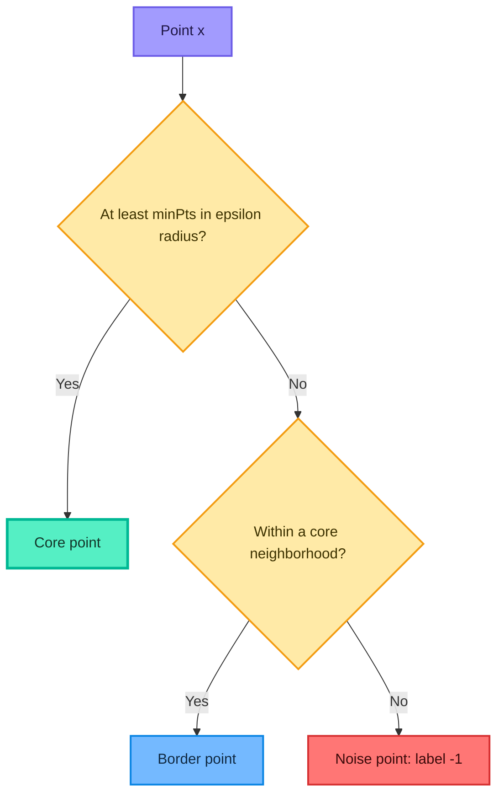
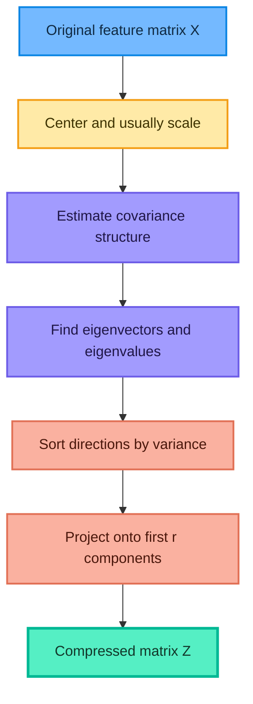

# Advanced Machine Learning Notes

## Model Tuning, Ensemble Learning, Clustering, and PCA

These notes turn the supplied YouTube transcript, handwritten PDF, and four notebooks into a structured reference. They explain **what** each idea means, **why** it matters, **how** it works, **when** to use it, common mistakes, mathematical intuition, and reproducible Python examples.

> The central lesson: building a model is only the beginning. A reliable machine-learning workflow must estimate unseen-data performance, tune without leakage, combine models when useful, discover structure in unlabeled data, and control high dimensionality.

## Learning map



## Contents

1. [Foundations and vocabulary](#1-foundations-and-vocabulary)
2. [Cross-validation](#2-cross-validation)
3. [Hyperparameter tuning](#3-hyperparameter-tuning)
4. [GridSearchCV and RandomizedSearchCV](#4-gridsearchcv-and-randomizedsearchcv)
5. [Ensemble learning](#5-ensemble-learning)
6. [Bagging and random forests](#6-bagging-and-random-forests)
7. [Boosting](#7-boosting)
8. [Stacking](#8-stacking)
9. [Unsupervised learning](#9-unsupervised-learning)
10. [K-means clustering](#10-k-means-clustering)
11. [DBSCAN](#11-dbscan)
12. [Curse of dimensionality](#12-curse-of-dimensionality)
13. [Dimensionality reduction and PCA](#13-dimensionality-reduction-and-pca)
14. [End-to-end examples](#14-end-to-end-examples)
15. [Decision guide](#15-decision-guide)
16. [Practice questions with solutions](#16-practice-questions-with-solutions)
17. [Quick revision sheet](#17-quick-revision-sheet)

## 1. Foundations and vocabulary

### 1.1 Parameters and hyperparameters

A **parameter** is learned from data during training. A **hyperparameter** is chosen before or around training and controls the learning process or model structure.

| Model | Learned parameters | Example hyperparameters |
|---|---|---|
| Linear regression | Coefficients and intercept | Regularization strength |
| K-nearest neighbors | No conventional fitted equation; training points are stored | `n_neighbors`, distance metric, weights |
| Decision tree | Split features, thresholds, leaf predictions | `max_depth`, `min_samples_split`, `max_features` |
| Support vector machine | Support vectors and separating surface | $C$, kernel, $\gamma$ |
| Random forest | All fitted trees | Number of trees, tree depth, number of sampled features |
| Gradient boosting | Sequence of fitted weak learners | Learning rate, number and depth of trees |
| K-means | Cluster centroids | Number of clusters $K$, initialization method |
| DBSCAN | Cluster assignments from density connectivity | $\varepsilon$, `min_samples`, distance metric |

### 1.2 Why the first model is rarely the final model

A model can fail in several ways:

- **Underfitting:** it is too simple to capture the signal; both training and validation performance are poor.
- **Overfitting:** it memorizes training details; training performance is strong but validation performance is weak.
- **Unstable evaluation:** one lucky train-test split makes the model look better than it usually is.
- **Wrong metric:** accuracy can hide poor minority-class behavior.
- **Data leakage:** information from validation or test data influences training.

For squared-error regression, the generalization error is often understood through the bias-variance-noise decomposition:

$$
\mathbb{E}\left[(Y-\hat{f}(X))^2\right]
= \operatorname{Bias}(\hat{f}(X))^2
+ \operatorname{Var}(\hat{f}(X))
+ \sigma^2
$$

Here $\sigma^2$ is irreducible noise. Tuning and ensembling try to improve the first two terms, but no method can eliminate the noise inherent in the data-generating process.

### 1.3 Generalization is the real goal

Training score answers, "How well did the model fit data it saw?" Validation and test scores answer, "How well might it perform on unseen data?" The second question matters in deployment.

A disciplined data split has three conceptual roles:

| Partition | Purpose | Used repeatedly? |
|---|---|---|
| Training data | Fit model parameters | Yes |
| Validation data or CV folds | Select model and hyperparameters | Yes |
| Test data | Final unbiased evaluation | No, ideally once |

## 2. Cross-validation

### 2.1 What is cross-validation?

Cross-validation repeatedly changes which observations are used for training and validation. It produces a more stable estimate than a single split because every observation can take a turn in validation.

In $K$-fold cross-validation, the data is divided into $K$ approximately equal folds. For iteration $i$:

- fold $i$ is the validation fold;
- the remaining $K-1$ folds form the training set;
- the process is repeated $K$ times.



The mean cross-validation score is

$$
\bar{s}_{CV}=\frac{1}{K}\sum_{i=1}^{K}s_i
$$

and its standard deviation is

$$
s_{CV}=\sqrt{\frac{1}{K-1}\sum_{i=1}^{K}(s_i-\bar{s}_{CV})^2}
$$

A high mean is good; a large spread warns that performance depends strongly on the split.

### 2.2 Why use it?

- It reduces dependence on a single lucky or unlucky split.
- It uses limited data efficiently.
- It supports fair hyperparameter comparison.
- It reveals model instability through fold-to-fold variation.

### 2.3 Which cross-validation strategy should be used?

| Situation | Appropriate splitter | Why |
|---|---|---|
| Ordinary regression | `KFold` | General-purpose folding |
| Classification | `StratifiedKFold` | Preserves class proportions |
| Repeated stability study | `RepeatedKFold` or `RepeatedStratifiedKFold` | Repeats different fold assignments |
| Several rows per person, device, or customer | `GroupKFold` | Keeps each group in only one side |
| Ordered time series | `TimeSeriesSplit` | Never trains on the future to predict the past |

**When not to shuffle:** time-dependent observations must retain temporal order. Random CV would leak future information into the past.

### 2.4 The leakage trap

This is unsafe:

```python
# Incorrect: the scaler learns the mean and standard deviation of all rows,
# including rows that will later act as validation data.
X_scaled = StandardScaler().fit_transform(X)
scores = cross_val_score(SVC(), X_scaled, y, cv=5)
```

Use a pipeline so preprocessing is fitted separately inside every training fold:

```python
from sklearn.model_selection import StratifiedKFold, cross_validate
from sklearn.pipeline import Pipeline
from sklearn.preprocessing import StandardScaler
from sklearn.svm import SVC

pipeline = Pipeline(
    steps=[
        ("scale", StandardScaler()),
        ("model", SVC()),
    ]
)

cv = StratifiedKFold(n_splits=5, shuffle=True, random_state=42)

cv_result = cross_validate(
    pipeline,
    X,
    y,
    cv=cv,
    scoring="accuracy",
    return_train_score=True,
)

print(cv_result["test_score"].mean())
print(cv_result["test_score"].std())
```

> Fun fact: `Pipeline` is not only convenient syntax. It defines the boundary of what may learn from each training fold and is therefore a statistical safety device.

## 3. Hyperparameter tuning

### 3.1 What is model tuning?

Model tuning searches for hyperparameter values that produce the best validation performance. The optimization problem can be written as

$$
\lambda^*=\arg\max_{\lambda\in\Lambda}
\operatorname{CVScore}(f_{\lambda})
$$

where $\lambda$ is a hyperparameter configuration and $\Lambda$ is the search space.

The goal is not to maximize training performance. It is to find a configuration that generalizes.

### 3.2 How hyperparameters change behavior

- A small `max_depth` can make a tree too rigid; a huge depth can memorize noise.
- In KNN, small $K$ creates a flexible, noisy boundary; large $K$ creates a smoother, higher-bias boundary.
- In an RBF SVM, large $C$ penalizes training errors more strongly, while $\gamma$ controls the radius of influence of each point.
- In boosting, a smaller learning rate usually requires more trees but can generalize better.
- In DBSCAN, a small $\varepsilon$ can label too many points as noise; a large $\varepsilon$ can merge distinct groups.

### 3.3 Manual, grid, and randomized search

| Method | How it explores | Strength | Weakness | Best use |
|---|---|---|---|---|
| Manual search | Human-selected trials | Fast for intuition and debugging | Incomplete and biased | Tiny spaces, early experiments |
| Grid search | Every listed combination | Deterministic and exhaustive | Expensive; wastes trials on unimportant dimensions | Small discrete spaces |
| Randomized search | Samples configurations | Covers large spaces efficiently | May miss a narrow optimum | Large or continuous spaces |

If parameter $j$ has $|G_j|$ candidates, grid search evaluates

$$
N_{\text{candidates}}=\prod_{j=1}^{p}|G_j|
$$

configurations. With $K$ folds, it performs roughly

$$
N_{\text{fits}}=K\prod_{j=1}^{p}|G_j|
$$

fits, plus a final refit when `refit=True`.

For example, six values of $K$, two KNN weighting schemes, two distance metrics, and five CV folds require

$$
6\times2\times2\times5=120
$$

CV fits.

## 4. GridSearchCV and RandomizedSearchCV

### 4.1 How search and cross-validation work together



The supplied notebook calls `classifier.fit(X, y)` after creating a test split. That allows search to use rows intended for final testing. The corrected workflow below fits the search on `X_train, y_train` only.

### 4.2 Leakage-safe SVM grid search

```python
from sklearn.datasets import load_iris
from sklearn.metrics import classification_report
from sklearn.model_selection import GridSearchCV, train_test_split
from sklearn.pipeline import Pipeline
from sklearn.preprocessing import StandardScaler
from sklearn.svm import SVC

# Load a local dataset bundled with scikit-learn.
iris = load_iris(as_frame=True)
X = iris.data
y = iris.target

# Reserve the test set before trying any hyperparameters.
X_train, X_test, y_train, y_test = train_test_split(
    X,
    y,
    test_size=0.20,
    stratify=y,
    random_state=42,
)

# Scaling is inside the pipeline, so each CV fold gets its own fitted scaler.
pipeline = Pipeline(
    steps=[
        ("scale", StandardScaler()),
        ("svc", SVC()),
    ]
)

# Pipeline parameters use the pattern step_name__parameter_name.
parameter_grid = [
    {
        "svc__kernel": ["linear"],
        "svc__C": [0.1, 1, 10, 100],
    },
    {
        "svc__kernel": ["rbf"],
        "svc__C": [0.1, 1, 10, 100],
        "svc__gamma": ["scale", 0.01, 0.1, 1],
    },
]

search = GridSearchCV(
    estimator=pipeline,
    param_grid=parameter_grid,
    scoring="accuracy",
    cv=5,
    n_jobs=-1,
    refit=True,
    return_train_score=True,
)

search.fit(X_train, y_train)

print("Best CV score:", search.best_score_)
print("Best parameters:", search.best_params_)
print("Test score:", search.score(X_test, y_test))
print(classification_report(y_test, search.predict(X_test)))
```

### 4.3 Reading `cv_results_`

```python
import pandas as pd

results = pd.DataFrame(search.cv_results_)

columns = [
    "rank_test_score",
    "mean_test_score",
    "std_test_score",
    "mean_train_score",
    "params",
]

print(results[columns].sort_values("rank_test_score").head(10))
```

Interpretation:

- `mean_test_score`: average validation score across folds;
- `std_test_score`: sensitivity to the fold assignment;
- `mean_train_score`: useful for diagnosing overfitting;
- `rank_test_score`: ordering under the chosen metric;
- `params`: exact candidate configuration.

Do not select a model only because its mean is larger by a tiny amount. If the difference is small relative to fold variation, prefer the simpler or faster candidate.

### 4.4 Randomized search

```python
from scipy.stats import loguniform
from sklearn.model_selection import RandomizedSearchCV

random_search = RandomizedSearchCV(
    estimator=pipeline,
    param_distributions={
        "svc__kernel": ["rbf"],
        # Log-uniform sampling explores orders of magnitude fairly.
        "svc__C": loguniform(1e-3, 1e3),
        "svc__gamma": loguniform(1e-4, 1e1),
    },
    n_iter=40,
    scoring="accuracy",
    cv=5,
    random_state=42,
    n_jobs=-1,
    refit=True,
)

random_search.fit(X_train, y_train)
print(random_search.best_params_)
print(random_search.score(X_test, y_test))
```

Why use logarithmic distributions? Values such as $0.001$, $0.01$, $0.1$, $1$, $10$, and $100$ differ by scale, not by a fixed additive step.

### 4.5 Nested cross-validation

If a dataset is too small to reserve a stable test set, ordinary CV used for both tuning and reporting is optimistic. **Nested CV** separates the roles:

- inner CV chooses hyperparameters;
- outer CV estimates the performance of the entire selection procedure.

If outer-fold scores are $s_1,\ldots,s_K$, report their mean and spread. The test object is not one fixed model; it is the complete algorithm "tune, refit, and predict."

## 5. Ensemble learning

### 5.1 What is an ensemble?

An ensemble combines several models so their collective prediction is more reliable than a typical individual prediction. The crowd helps only when members are reasonably competent and do not all make the same errors.

For $M$ regression models, a simple average is

$$
\hat{y}(x)=\frac{1}{M}\sum_{m=1}^{M}\hat{f}_m(x)
$$

For classification, hard voting selects the class with the most votes:

$$
\hat{y}(x)=\operatorname{mode}\left\{\hat{f}_1(x),\ldots,\hat{f}_M(x)\right\}
$$

Soft voting averages class probabilities and chooses the largest average probability:

$$
\hat{y}(x)=\arg\max_c\frac{1}{M}\sum_{m=1}^{M}P_m(Y=c\mid x)
$$

### 5.2 The three major families



| Family | Training relationship | Main intuition | Typical examples |
|---|---|---|---|
| Bagging | Models fit largely in parallel | Average unstable learners | Bagged trees, random forest |
| Boosting | Models fit sequentially | Each learner corrects earlier mistakes | AdaBoost, gradient boosting, XGBoost |
| Stacking | Base predictions feed another model | Learn which model to trust where | Stacking classifier or regressor |

### 5.3 Diversity is essential

Suppose each base model has prediction variance $\sigma^2$ and pairwise error correlation $\rho$. The approximate variance of their average is

$$
\operatorname{Var}(\bar{f})
=\rho\sigma^2+\frac{1-\rho}{M}\sigma^2
$$

Increasing $M$ reduces the second term, but highly correlated models leave the first term. This is why training identical models on identical data adds little; useful ensembles create diversity through resampling, random feature selection, different algorithms, or different hyperparameters.

> Fun fact: a crowd of one thousand perfectly correlated models behaves like one model. Number alone does not create wisdom.

## 6. Bagging and random forests

### 6.1 Bootstrap aggregation

**Bagging** means bootstrap aggregation:

1. Draw several training samples with replacement.
2. Fit one base learner to each sample.
3. Average predictions or use majority voting.

With $n$ draws from $n$ observations, the probability that a particular observation is never selected is

$$
\left(1-\frac{1}{n}\right)^n\approx e^{-1}\approx0.368
$$

Therefore, one bootstrap sample contains about $63.2\%$ unique observations. The unselected observations are called **out-of-bag** samples and can estimate performance.

### 6.2 Why random forests work

A random forest adds a second source of randomness to bagged decision trees: at each split, the tree considers only a random subset of features. This makes trees less correlated, so averaging reduces variance more effectively.

For classification, tree $b$ predicts $h_b(x)$ and the forest returns

$$
\hat{y}(x)=\operatorname{mode}\{h_1(x),h_2(x),\ldots,h_B(x)\}
$$

For regression,

$$
\hat{y}(x)=\frac{1}{B}\sum_{b=1}^{B}h_b(x)
$$

### 6.3 Important random-forest hyperparameters

| Hyperparameter | Effect | Common trade-off |
|---|---|---|
| `n_estimators` | Number of trees | More trees improve stability but cost time and memory |
| `max_depth` | Maximum tree depth | Smaller depth regularizes |
| `min_samples_leaf` | Minimum rows in each leaf | Larger values smooth predictions |
| `max_features` | Features considered per split | Smaller values increase diversity but may weaken trees |
| `class_weight` | Reweights classes | Useful for imbalanced classification |
| `max_samples` | Rows drawn per tree | Controls bootstrap sample size |

### 6.4 Example

```python
from sklearn.ensemble import RandomForestClassifier
from sklearn.metrics import accuracy_score

forest = RandomForestClassifier(
    n_estimators=300,
    max_features="sqrt",
    min_samples_leaf=2,
    class_weight=None,
    oob_score=True,
    n_jobs=-1,
    random_state=42,
)

forest.fit(X_train, y_train)
predictions = forest.predict(X_test)

print("OOB score:", forest.oob_score_)
print("Test accuracy:", accuracy_score(y_test, predictions))
```

**When to use:** tabular data, nonlinear interactions, mixed signal strengths, and a strong low-maintenance baseline.

**When to be cautious:** very sparse high-dimensional text, strict extrapolation tasks, or applications that demand a compact transparent equation.

## 7. Boosting

### 7.1 Core intuition

Boosting trains weak learners sequentially. Each learner focuses on what the current ensemble predicts poorly. Unlike bagging, later models depend on earlier ones.

### 7.2 AdaBoost

For binary classification, learner $t$ has weighted error $\epsilon_t$. Its influence is

$$
\alpha_t=\frac{1}{2}\ln\left(\frac{1-\epsilon_t}{\epsilon_t}\right)
$$

Misclassified observations receive more weight:

$$
w_i^{(t+1)}\propto
w_i^{(t)}\exp\left(-\alpha_t y_i h_t(x_i)\right)
$$

The final classifier is

$$
H(x)=\operatorname{sign}\left(\sum_{t=1}^{T}\alpha_t h_t(x)\right)
$$

AdaBoost is intuitive, but mislabeled points and outliers can attract excessive attention.

### 7.3 Gradient boosting

Gradient boosting treats model construction as optimization in function space. At stage $m$, a new learner approximates the negative gradient of the loss, often described as fitting residual-like errors:

$$
r_{im}=-\left[\frac{\partial L(y_i,F(x_i))}{\partial F(x_i)}\right]_{F=F_{m-1}}
$$

The ensemble updates as

$$
F_m(x)=F_{m-1}(x)+\eta\gamma_m h_m(x)
$$

where $\eta$ is the learning rate. A smaller $\eta$ usually needs more learners.

### 7.4 Gradient boosting and XGBoost

Both build additive trees, but XGBoost is an optimized regularized implementation with engineering features such as efficient split finding, missing-value handling, column subsampling, and parallelized operations where possible. Conceptually, do not reduce the distinction to "XGBoost is always better." Results depend on data, tuning, validation, and compute constraints.

```python
from sklearn.ensemble import AdaBoostClassifier, GradientBoostingClassifier

ada = AdaBoostClassifier(
    n_estimators=100,
    learning_rate=0.5,
    random_state=42,
)

gradient_boost = GradientBoostingClassifier(
    n_estimators=150,
    learning_rate=0.05,
    max_depth=2,
    random_state=42,
)

for model in (ada, gradient_boost):
    model.fit(X_train, y_train)
    print(type(model).__name__, model.score(X_test, y_test))
```

**Key controls:** tree depth, number of estimators, learning rate, row subsampling, column subsampling, and regularization.

## 8. Stacking

### 8.1 What stacking does

Stacking trains several base models and then trains a **meta-learner** on their predictions:

$$
\hat{y}(x)=g\left(\hat{f}_1(x),\hat{f}_2(x),\ldots,\hat{f}_M(x)\right)
$$

The meta-learner can discover that one base model is more reliable for one region of feature space and another model elsewhere.

### 8.2 Why out-of-fold predictions are mandatory

If base models predict the same rows they were trained on, the meta-learner sees overoptimistic inputs. Correct stacking uses out-of-fold base predictions for meta-training.



### 8.3 Example

```python
from sklearn.ensemble import StackingClassifier
from sklearn.linear_model import LogisticRegression
from sklearn.neighbors import KNeighborsClassifier
from sklearn.pipeline import make_pipeline
from sklearn.preprocessing import StandardScaler
from sklearn.svm import SVC
from sklearn.tree import DecisionTreeClassifier

base_learners = [
    ("tree", DecisionTreeClassifier(max_depth=4, random_state=42)),
    (
        "svm",
        make_pipeline(
            StandardScaler(),
            SVC(C=2, probability=True, random_state=42),
        ),
    ),
    (
        "knn",
        make_pipeline(StandardScaler(), KNeighborsClassifier(n_neighbors=7)),
    ),
]

stack = StackingClassifier(
    estimators=base_learners,
    final_estimator=LogisticRegression(max_iter=2000),
    stack_method="predict_proba",
    cv=5,
    n_jobs=-1,
)

stack.fit(X_train, y_train)
print(stack.score(X_test, y_test))
```

**When to use:** strong but genuinely different base models, sufficient data, and enough compute for out-of-fold training.

**When not to use:** when one well-tuned model already dominates, data is tiny, latency is strict, or interpretability is essential.

## 9. Unsupervised learning

### 9.1 What changes when labels disappear?

In supervised learning, examples contain input-output pairs $(x_i,y_i)$. In unsupervised learning, the algorithm receives only $x_i$ and looks for structure.

Typical goals include:

- grouping similar observations;
- compressing variables;
- visualizing high-dimensional data;
- finding unusual points;
- creating features for downstream models.

There is no universal "correct" clustering because similarity depends on representation, scale, distance, and business purpose.

### 9.2 Common applications

| Application | Possible unsupervised goal |
|---|---|
| Customer analytics | Behavioral segments |
| Image compression | Compact color or feature representation |
| Network security | Dense activity patterns and anomalies |
| Document analysis | Topic or embedding groups |
| Biology | Cell or gene-expression subgroups |
| Visualization | Project many features into 2D |

### 9.3 Evaluation without labels

Use several forms of evidence:

- internal measures such as silhouette score;
- stability under resampling or parameter variation;
- visualization when dimension permits;
- domain usefulness and interpretability;
- external labels only if genuinely available and not used to manufacture the clustering.

Unsupervised output is often a hypothesis generator, not automatic proof that meaningful natural groups exist.

## 10. K-means clustering

### 10.1 What is K-means?

K-means divides observations into $K$ clusters represented by centroids. It alternates between assigning points to the nearest centroid and recomputing centroids.

The objective is within-cluster sum of squares, also called inertia or WCSS:

$$
J=\sum_{k=1}^{K}\sum_{x_i\in C_k}\left\|x_i-\mu_k\right\|_2^2
$$

where $C_k$ is cluster $k$ and $\mu_k$ is its centroid.

### 10.2 Algorithm



Assignment step:

$$
c_i=\arg\min_k\left\|x_i-\mu_k\right\|_2^2
$$

Centroid update:

$$
\mu_k=\frac{1}{|C_k|}\sum_{x_i\in C_k}x_i
$$

Each iteration does not increase $J$, but the algorithm can reach a local minimum. Multiple initializations help.

### 10.3 Why scaling matters

Euclidean distance is sensitive to measurement units. Standardization gives feature $j$

$$
z_{ij}=\frac{x_{ij}-\bar{x}_j}{s_j}
$$

Without scaling, a variable measured in thousands can dominate one measured between 0 and 1.

### 10.4 Choosing $K$: elbow and silhouette

Inertia always decreases as $K$ grows and becomes zero when every unique point forms its own cluster. Therefore, "minimum inertia" alone does not choose $K.

The elbow method looks for the point after which additional clusters yield diminishing improvement.

For observation $i$, let $a(i)$ be its average distance to its own cluster and $b(i)$ the smallest average distance to another cluster. Its silhouette is

$$
s(i)=\frac{b(i)-a(i)}{\max\{a(i),b(i)\}}
$$

with $-1\le s(i)\le1$. Near 1 is well separated, near 0 lies on a boundary, and negative suggests a questionable assignment.

```python
import matplotlib.pyplot as plt
from sklearn.cluster import KMeans
from sklearn.datasets import make_blobs
from sklearn.metrics import silhouette_score
from sklearn.preprocessing import StandardScaler

X_blob, _ = make_blobs(
    n_samples=500,
    centers=3,
    cluster_std=1.5,
    random_state=42,
)

X_blob_scaled = StandardScaler().fit_transform(X_blob)
inertias = []
silhouettes = []
candidate_k = range(2, 9)

for k in candidate_k:
    model = KMeans(
        n_clusters=k,
        n_init=20,
        random_state=42,
    )
    labels = model.fit_predict(X_blob_scaled)
    inertias.append(model.inertia_)
    silhouettes.append(silhouette_score(X_blob_scaled, labels))

figure, axes = plt.subplots(1, 2, figsize=(11, 4))
axes[0].plot(list(candidate_k), inertias, marker="o")
axes[0].set(title="Elbow curve", xlabel="K", ylabel="Inertia")
axes[1].plot(list(candidate_k), silhouettes, marker="o", color="purple")
axes[1].set(title="Silhouette curve", xlabel="K", ylabel="Mean silhouette")
plt.tight_layout()
plt.show()
```

### 10.5 Assumptions and limitations

K-means works best when clusters are roughly compact, convex, similarly scaled, and reasonably separated. It struggles with:

- non-spherical shapes such as two moons;
- unequal cluster densities or sizes;
- severe outliers that pull centroids;
- categorical variables under ordinary Euclidean distance;
- an unknown $K$ with no clear diagnostic.

> Fun fact: although called K-"means," the algorithm is fundamentally a variance minimizer. Replacing squared Euclidean distance changes what representative is mathematically appropriate.

## 11. DBSCAN

### 11.1 What is DBSCAN?

DBSCAN stands for **Density-Based Spatial Clustering of Applications with Noise**. It finds connected dense regions and labels isolated observations as noise. Unlike K-means, it does not require $K$ beforehand and can recover irregular shapes.

For point $x$, its $\varepsilon$-neighborhood is

$$
N_{\varepsilon}(x)=\{z:\operatorname{dist}(x,z)\le\varepsilon\}
$$

A point is a core point when

$$
|N_{\varepsilon}(x)|\ge \text{minPts}
$$

### 11.2 Point types

- **Core point:** has enough neighbors within radius $\varepsilon$.
- **Border point:** is reachable from a core point but lacks enough neighbors to be core itself.
- **Noise point:** is not density-reachable from a core region; scikit-learn labels it `-1`.



### 11.3 Two-moons example

```python
import matplotlib.pyplot as plt
from sklearn.cluster import DBSCAN, KMeans
from sklearn.datasets import make_moons
from sklearn.preprocessing import StandardScaler

X_moons, _ = make_moons(n_samples=500, noise=0.05, random_state=42)
X_moons_scaled = StandardScaler().fit_transform(X_moons)

kmeans_labels = KMeans(
    n_clusters=2,
    n_init=20,
    random_state=42,
).fit_predict(X_moons_scaled)

dbscan_labels = DBSCAN(
    eps=0.25,
    min_samples=5,
).fit_predict(X_moons_scaled)

figure, axes = plt.subplots(1, 2, figsize=(10, 4))
axes[0].scatter(X_moons[:, 0], X_moons[:, 1], c=kmeans_labels, cmap="viridis")
axes[0].set_title("K-means cuts the curved shapes")
axes[1].scatter(X_moons[:, 0], X_moons[:, 1], c=dbscan_labels, cmap="viridis")
axes[1].set_title("DBSCAN follows dense connectivity")
plt.tight_layout()
plt.show()
```

### 11.4 Choosing $\varepsilon$ and `min_samples`

- Scale the features first.
- Start with `min_samples` at least the feature dimension plus one; larger values demand denser evidence.
- Plot the sorted distance to each point's $k$th nearest neighbor and inspect the bend as a candidate $\varepsilon$.
- Check stability and domain meaning, not only a pretty plot.

DBSCAN struggles when clusters have very different densities or when high-dimensional distances lose contrast. HDBSCAN or OPTICS may be better for variable density, but they are separate algorithms.

### 11.5 K-means versus DBSCAN

| Property | K-means | DBSCAN |
|---|---|---|
| Must choose number of clusters | Yes | No |
| Handles arbitrary shapes | Poorly | Often well |
| Explicit noise label | No | Yes |
| Handles varying density | Poorly | Also difficult |
| Main parameters | $K$ | $\varepsilon$, `min_samples` |
| Natural cluster representative | Centroid | Dense connected region |
| Prediction for a new point | Straightforward nearest centroid | Not natively defined by standard DBSCAN |

## 12. Curse of dimensionality

### 12.1 What is a dimension?

For a tabular dataset, each numerical feature is usually an axis. Two features can be drawn on a plane; three can be drawn in 3D; fifty features define a 50-dimensional space even though humans cannot visualize it directly.

### 12.2 Why high dimensions become difficult

- The volume of the space grows rapidly.
- Fixed data becomes sparse relative to that volume.
- Nearest and farthest distances become less distinguishable.
- Distance-based methods such as KNN, K-means, and DBSCAN may weaken.
- Storage and model-training cost rise.
- Visualization becomes difficult.
- Irrelevant variables create additional noise and overfitting opportunities.

If each dimension is divided into $m$ intervals, a full grid contains

$$
m^d
$$

cells in $d$ dimensions. With $m=10$ and $d=20$, that is $10^{20}$ cells. This exponential growth is one face of the curse.

### 12.3 High dimension is not automatically bad

High-dimensional representations can be useful when they contain signal and models are regularized appropriately. The problem is the combination of dimensionality, limited observations, noisy features, and the geometry assumed by the algorithm.

## 13. Dimensionality reduction and PCA

### 13.1 Feature selection versus feature extraction

| Idea | What it does | Output meaning | Example |
|---|---|---|---|
| Feature selection | Keeps some original features and drops others | Original semantics remain | Select 20 genes from 10,000 |
| Feature extraction | Creates new features from combinations of originals | New coordinates may be less interpretable | PCA components |

Use feature selection when original-variable interpretability matters. Use extraction when compression, denoising, visualization, or distance geometry matters more.

### 13.2 What is PCA?

Principal component analysis creates orthogonal directions that capture maximum variance in descending order. The first component captures the greatest possible variance; the second captures the greatest remaining variance subject to being orthogonal to the first.

PCA is unsupervised because it uses $X$, not target $y$.



### 13.3 Mathematics of PCA

Let $X\in\mathbb{R}^{n\times p}$. First center each column:

$$
X_c=X-\mathbf{1}\bar{x}^{\top}
$$

The sample covariance matrix is

$$
S=\frac{1}{n-1}X_c^{\top}X_c
$$

PCA solves the eigenvalue problem

$$
Sv_j=\lambda_jv_j
$$

where $v_j$ is a principal direction and $\lambda_j$ is variance captured along it. Sort

$$
\lambda_1\ge\lambda_2\ge\cdots\ge\lambda_p\ge0
$$

and collect the first $r$ eigenvectors in $V_r$. Component scores are

$$
Z=X_cV_r
$$

The explained variance ratio of component $j$ is

$$
\operatorname{EVR}_j=\frac{\lambda_j}{\sum_{k=1}^{p}\lambda_k}
$$

and the cumulative retained variance after $r$ components is

$$
\operatorname{CEVR}(r)=\sum_{j=1}^{r}\operatorname{EVR}_j
$$

An equivalent computational view uses singular value decomposition:

$$
X_c=U\Sigma V^{\top}
$$

The right singular vectors in $V$ are the principal directions.

### 13.4 Maximum-variance intuition

The first component solves

$$
v_1=\arg\max_{\|v\|_2=1}\operatorname{Var}(X_cv)
$$

This finds the line onto which projected points remain as spread out as possible. Projecting onto fewer than $p$ components loses some information, but the chosen subspace minimizes squared reconstruction error among linear subspaces of the same dimension.

Approximate reconstruction is

$$
\hat{X}_c=ZV_r^{\top}
$$

and its squared error is

$$
\|X_c-\hat{X}_c\|_F^2
$$

### 13.5 Why scaling is usually necessary

PCA maximizes variance. A feature measured in large units may dominate simply because of its scale. Standardize when units differ and no variable should dominate by design. Do not standardize automatically when raw variance itself has a meaningful scientific interpretation.

### 13.6 PCA example: five dimensions to two

```python
import matplotlib.pyplot as plt
from sklearn.datasets import make_blobs
from sklearn.decomposition import PCA
from sklearn.pipeline import make_pipeline
from sklearn.preprocessing import StandardScaler

X_five, y_five = make_blobs(
    n_samples=500,
    n_features=5,
    centers=3,
    cluster_std=1.5,
    random_state=42,
)

pca_pipeline = make_pipeline(
    StandardScaler(),
    PCA(n_components=2),
)

X_two = pca_pipeline.fit_transform(X_five)
pca = pca_pipeline.named_steps["pca"]

print("Original shape:", X_five.shape)
print("Reduced shape:", X_two.shape)
print("Variance retained:", pca.explained_variance_ratio_.sum())

plt.scatter(X_two[:, 0], X_two[:, 1], c=y_five, cmap="Set2", alpha=0.8)
plt.xlabel("Principal component 1")
plt.ylabel("Principal component 2")
plt.title("Five-dimensional blobs projected into two dimensions")
plt.show()
```

The labels are used only to color the final visualization. They do not participate in fitting PCA.

### 13.7 Choosing the number of components

Common methods:

- keep enough components for a chosen cumulative variance, such as $90\%$ or $95\%$;
- inspect a scree plot for diminishing eigenvalues;
- select the number that gives the best cross-validated downstream performance;
- choose two or three strictly for visualization.

```python
# Let PCA choose the smallest number of components that preserves
# at least 95 percent of the training variance.
pca_95 = make_pipeline(
    StandardScaler(),
    PCA(n_components=0.95),
)

X_compact = pca_95.fit_transform(X_five)
print(X_compact.shape)
```

### 13.8 Limitations of PCA

- It is linear and may miss curved manifolds.
- Components can be hard to explain.
- High variance is not always predictive of $y$.
- Outliers can strongly rotate components.
- Mixed categorical and numerical data requires careful representation.
- Fitting PCA before a train-test split leaks distribution information.
- Component signs are arbitrary: multiplying a component and its scores by $-1$ represents the same axis.

> Fun fact: PCA does not literally "choose the best original features." Each component is normally a weighted combination of many original features.

## 14. End-to-end examples

### 14.1 Tune a PCA plus SVM pipeline

This example lets cross-validation choose both the reduced dimension and classifier settings without leakage.

```python
from sklearn.datasets import load_breast_cancer
from sklearn.decomposition import PCA
from sklearn.metrics import classification_report
from sklearn.model_selection import GridSearchCV, train_test_split
from sklearn.pipeline import Pipeline
from sklearn.preprocessing import StandardScaler
from sklearn.svm import SVC

dataset = load_breast_cancer(as_frame=True)
X = dataset.data
y = dataset.target

X_train, X_test, y_train, y_test = train_test_split(
    X,
    y,
    test_size=0.20,
    stratify=y,
    random_state=42,
)

workflow = Pipeline(
    steps=[
        ("scale", StandardScaler()),
        ("pca", PCA()),
        ("model", SVC()),
    ]
)

grid = {
    "pca__n_components": [5, 10, 15, 20],
    "model__C": [0.1, 1, 10],
    "model__gamma": ["scale", 0.01, 0.1],
    "model__kernel": ["rbf"],
}

search = GridSearchCV(
    workflow,
    param_grid=grid,
    cv=5,
    scoring="balanced_accuracy",
    n_jobs=-1,
)

search.fit(X_train, y_train)
test_predictions = search.predict(X_test)

print(search.best_params_)
print("Best CV score:", search.best_score_)
print(classification_report(y_test, test_predictions))
```

### 14.2 Compare ensemble families fairly

```python
from sklearn.ensemble import (
    AdaBoostClassifier,
    GradientBoostingClassifier,
    RandomForestClassifier,
    StackingClassifier,
)
from sklearn.linear_model import LogisticRegression
from sklearn.model_selection import StratifiedKFold, cross_validate
from sklearn.svm import SVC
from sklearn.tree import DecisionTreeClassifier

models = {
    "random_forest": RandomForestClassifier(
        n_estimators=300,
        random_state=42,
        n_jobs=-1,
    ),
    "adaboost": AdaBoostClassifier(
        n_estimators=100,
        random_state=42,
    ),
    "gradient_boosting": GradientBoostingClassifier(
        n_estimators=100,
        learning_rate=0.05,
        random_state=42,
    ),
    "stacking": StackingClassifier(
        estimators=[
            ("tree", DecisionTreeClassifier(max_depth=4, random_state=42)),
            ("svm", SVC(probability=True, random_state=42)),
        ],
        final_estimator=LogisticRegression(max_iter=2000),
        cv=5,
    ),
}

cv = StratifiedKFold(n_splits=5, shuffle=True, random_state=42)

for name, model in models.items():
    scores = cross_validate(model, X_train, y_train, cv=cv, scoring="accuracy")
    mean_score = scores["test_score"].mean()
    score_spread = scores["test_score"].std()
    print(f"{name:18s} {mean_score:.3f} +/- {score_spread:.3f}")
```

Use the same folds and metric for every candidate. Then refit the selected approach on all training data and evaluate it once on the test set.

### 14.3 A practical clustering workflow

1. Define the business object to cluster: customer, session, product, or event.
2. Choose features that represent the intended notion of similarity.
3. Handle missing values and transform skewed variables.
4. Scale numerical features.
5. Try algorithms whose geometric assumptions match the problem.
6. Evaluate internal quality, stability, and domain usefulness.
7. Profile clusters using original variables, not only scaled coordinates.
8. Monitor whether cluster definitions drift over time.

```python
from sklearn.cluster import KMeans
from sklearn.metrics import silhouette_score
from sklearn.pipeline import make_pipeline
from sklearn.preprocessing import StandardScaler

cluster_workflow = make_pipeline(
    StandardScaler(),
    KMeans(n_clusters=3, n_init=20, random_state=42),
)

labels = cluster_workflow.fit_predict(X_blob)
scaled_data = cluster_workflow.named_steps["standardscaler"].transform(X_blob)

print("Silhouette:", silhouette_score(scaled_data, labels))
```

## 15. Decision guide

### 15.1 Which validation or search strategy?

| Question | Recommendation |
|---|---|
| Ordinary classification? | Stratified CV |
| Repeated entities? | Group-aware CV |
| Time order? | Time-series split |
| Tiny hyperparameter space? | Grid search |
| Large or continuous space? | Randomized search first |
| Final unbiased estimate after extensive tuning? | Untouched test set or nested CV |
| Preprocessing involved? | Put it inside a pipeline |

### 15.2 Which ensemble?

| Need | Starting point |
|---|---|
| Reduce variance of unstable trees | Random forest |
| Strong tabular nonlinear model | Gradient boosting |
| Combine different strong model families | Stacking |
| Simple probability combination | Soft voting |
| Fast, interpretable single baseline | Do not ensemble yet |

### 15.3 Which unsupervised method?

| Data pattern or goal | Starting point |
|---|---|
| Compact, centroid-like clusters and known $K$ | K-means |
| Irregular dense shapes with noise | DBSCAN |
| Visualize many correlated numerical features | PCA to 2D |
| Compress before a distance-based model | Scaled PCA, validated in a pipeline |
| Preserve original feature meanings | Feature selection |

### 15.4 Common mistakes and corrections

| Mistake | Why it is wrong | Correction |
|---|---|---|
| Scaling before CV | Validation information reaches training | Pipeline the scaler |
| Searching on all data after reserving a test set | Test set stops being independent | Fit search on training data only |
| Selecting by training accuracy | Rewards overfitting | Select by validation metric |
| Reporting best CV score as final test score | Tuning biases the estimate upward | Use held-out test or nested CV |
| Choosing $K$ from inertia minimum | Inertia decreases with $K$ | Use elbow, silhouette, stability, and domain value |
| Comparing cluster labels numerically | Labels are arbitrary identifiers | Compare partitions with suitable measures |
| Applying K-means to unscaled mixed units | Large-scale feature dominates | Transform and scale appropriately |
| Treating PCA components as selected columns | Components are linear combinations | Inspect loadings and explain the transformation |
| Assuming more ensemble members always help | Correlated errors remain correlated | Increase diversity and validate |
| Using accuracy for severe imbalance | Majority performance dominates | Use precision, recall, F1, PR AUC, or balanced accuracy |

## 16. Practice questions with solutions

### Question 1: CV arithmetic

A five-fold experiment produces accuracies $0.82$, $0.86$, $0.81$, $0.84$, and $0.87$. What is the mean CV accuracy?

<details>
<summary>Solution</summary>

$$
\bar{s}_{CV}=\frac{0.82+0.86+0.81+0.84+0.87}{5}=0.84
$$

The estimated accuracy is $84\%$. The fold spread should also be reported because the mean alone hides instability.

</details>

### Question 2: Search cost

A grid contains 4 values of $C$, 3 values of $\gamma$, 2 kernels, and uses 5-fold CV. How many CV fits are required if every combination is valid?

<details>
<summary>Solution</summary>

$$
4\times3\times2\times5=120
$$

There may also be one final refit of the winning configuration.

</details>

### Question 3: Detect leakage

Why is `StandardScaler().fit_transform(X)` before `cross_val_score` unsafe?

<details>
<summary>Solution</summary>

The scaler estimates column means and standard deviations from every row, including rows later treated as validation data. Put scaling and the estimator inside a `Pipeline`, so the scaler is fitted only on the training portion of each fold.

</details>

### Question 4: Random forest intuition

Why does a random forest sample both rows and features?

<details>
<summary>Solution</summary>

Row bootstrapping exposes trees to different observations. Random feature subsets prevent the same dominant predictor from forcing similar top splits in every tree. Both mechanisms lower error correlation, making averaging more effective.

</details>

### Question 5: Bagging versus boosting

State one key difference in the training relationship.

<details>
<summary>Solution</summary>

Bagging learners can be fitted largely in parallel because each uses an independent resample. Boosting learners are sequential because each new learner depends on errors or gradients from the current ensemble.

</details>

### Question 6: K-means objective

What happens to inertia when $K$ increases, and why does that not automatically identify the best $K$?

<details>
<summary>Solution</summary>

Inertia never increases because more centroids allow points to be represented at least as closely. It can reach zero when every unique point is its own cluster. Therefore, cluster usefulness requires an elbow, silhouette, stability, and domain interpretation rather than the smallest inertia.

</details>

### Question 7: K-means or DBSCAN?

You have two curved moon-shaped clusters plus scattered noise and do not know the number of clusters. Which method is the better starting point?

<details>
<summary>Solution</summary>

DBSCAN is the better starting point because it follows density connectivity, can identify irregular shapes, and labels noise. K-means partitions space around centroids and tends to cut the moons incorrectly.

</details>

### Question 8: PCA variance

Eigenvalues are $5$, $3$, $1$, and $1$. How much variance do the first two components explain?

<details>
<summary>Solution</summary>

Total variance is $5+3+1+1=10$. The first two components retain

$$
\frac{5+3}{10}=0.8=80\%
$$

</details>

### Question 9: PCA and labels

Does PCA use the target label to find directions? Why can that be a limitation?

<details>
<summary>Solution</summary>

No. PCA maximizes variance in $X$. A low-variance direction can still be highly predictive of $y$, so components that preserve maximum input variance do not necessarily maximize classification performance. Select component count using downstream CV when prediction is the goal.

</details>

### Question 10: Stacking leakage

Why must a meta-learner be trained on out-of-fold predictions?

<details>
<summary>Solution</summary>

Predictions made on rows used to fit each base model are too optimistic. Out-of-fold predictions mimic unseen-data behavior, so the meta-learner learns from realistic base-model strengths and errors.

</details>

### Question 11: Scenario design

You need to tune a classifier for data with several visits per patient. What split and workflow should you use?

<details>
<summary>Solution</summary>

Reserve or validate by patient groups so visits from one patient cannot appear on both sides. Use `GroupKFold` or a related group-aware splitter, pass group identifiers to the search, and place preprocessing plus the classifier in a pipeline.

</details>

### Question 12: Debug the workflow

The CV score is $0.98$, but test performance is $0.78$. Give four possible causes.

<details>
<summary>Solution</summary>

Possible causes include leakage, a nonrepresentative test set, distribution shift, overfitting to CV after extensive experimentation, inappropriate group or time splits, duplicate rows across partitions, or a metric mismatch. Audit the data boundary before attempting more tuning.

</details>

## 17. Quick revision sheet

### Core formulas

Cross-validation mean:

$$
\bar{s}_{CV}=\frac{1}{K}\sum_{i=1}^{K}s_i
$$

Grid-search candidates:

$$
N=\prod_j|G_j|
$$

Bagged regression prediction:

$$
\hat{y}(x)=\frac{1}{M}\sum_{m=1}^{M}\hat{f}_m(x)
$$

Gradient-boosting update:

$$
F_m(x)=F_{m-1}(x)+\eta\gamma_mh_m(x)
$$

K-means objective:

$$
J=\sum_{k=1}^{K}\sum_{x_i\in C_k}\|x_i-\mu_k\|_2^2
$$

Silhouette:

$$
s(i)=\frac{b(i)-a(i)}{\max\{a(i),b(i)\}}
$$

PCA covariance and projection:

$$
S=\frac{1}{n-1}X_c^{\top}X_c,
\qquad
Z=X_cV_r
$$

### One-sentence memory hooks

- **Cross-validation:** rotate the validation fold to estimate stability.
- **Grid search:** evaluate every listed combination.
- **Randomized search:** spend a fixed trial budget across a larger space.
- **Bagging:** average diverse parallel learners to reduce variance.
- **Boosting:** add sequential learners that correct the current model.
- **Stacking:** let a meta-model learn how to combine base predictions.
- **K-means:** minimize squared distance to $K$ centroids.
- **DBSCAN:** connect dense neighborhoods and mark isolated points as noise.
- **PCA:** rotate to orthogonal directions of decreasing variance, then keep a subset.

### Final workflow checklist

- [ ] Define the prediction or discovery objective.
- [ ] Select a metric before searching.
- [ ] Reserve the test set or design nested CV.
- [ ] Respect groups and time order.
- [ ] Put learned preprocessing inside a pipeline.
- [ ] Search only on training data.
- [ ] Compare mean score, spread, simplicity, and cost.
- [ ] Evaluate the selected workflow once on untouched test data.
- [ ] For clustering, verify stability and domain usefulness.
- [ ] For PCA, report retained variance and inspect downstream performance.
- [ ] Record random seeds, package versions, and final parameters.
- [ ] Monitor drift after deployment.

## Source alignment and corrections

This README is based on the supplied advanced-machine-learning transcript, `Advancestuff.pdf`, `GridSearchCV.ipynb`, `EnsembleLearning.ipynb`, `Clustring.ipynb`, and `PCADimensions.ipynb`.

The examples retain the sources' teaching themes while applying these corrections:

- hyperparameter search is fitted only on the training partition;
- scaling and PCA are placed inside pipelines during validation;
- K-means specifies multiple initializations explicitly;
- PCA reports explained variance rather than only plotting components;
- clustering is evaluated with more than inertia;
- the obsolete XGBoost `use_label_encoder` argument is omitted;
- a single test accuracy is not treated as proof that one ensemble is universally best.

The aim is not merely to reproduce notebook output, but to make the workflow statistically valid and reusable.
