# Deep Learning Foundations

## From the Perceptron to Backpropagation, Loss Functions, and Adam

> Detailed study notes reconstructed and expanded from the 18-page `Deeplearning.pdf` source.
> The source contains handwritten explanations and diagrams, so the examples below preserve
> its intended ideas while standardizing notation and correcting ambiguous arithmetic.

---

## Learning objectives

By the end of these notes, you should be able to:

1. explain how a perceptron and an artificial neuron transform inputs into an output;
2. distinguish a classic step-activation perceptron from a sigmoid neuron;
3. perform a complete forward pass through a small artificial neural network;
4. choose a suitable activation function for a hidden or output layer;
5. explain vanishing gradients using the chain rule;
6. choose an appropriate loss function for regression, binary classification, or multiclass classification;
7. derive the main backpropagation equations and update a weight manually;
8. compare batch, stochastic, and mini-batch gradient descent;
9. explain Momentum, AdaGrad, RMSProp, and Adam; and
10. interpret `loss`, `accuracy`, `val_loss`, and `val_accuracy` during training.

---

## Table of contents

1. [The deep-learning big picture](#1-the-deep-learning-big-picture)
2. [The perceptron](#2-the-perceptron)
3. [Artificial neural networks](#3-artificial-neural-networks)
4. [Forward propagation](#4-forward-propagation)
5. [Activation functions](#5-activation-functions)
6. [The vanishing-gradient problem](#6-the-vanishing-gradient-problem)
7. [Loss and cost functions](#7-loss-and-cost-functions)
8. [Backpropagation](#8-backpropagation)
9. [Gradient descent and optimizers](#9-gradient-descent-and-optimizers)
10. [Training and validation metrics](#10-training-and-validation-metrics)
11. [Complete commented code](#11-complete-commented-code)
12. [Model-diagnosis guide](#12-model-diagnosis-guide)
13. [Common mistakes and corrections](#13-common-mistakes-and-corrections)
14. [Quick-reference sheets](#14-quick-reference-sheets)
15. [Fun facts and deeper intuition](#15-fun-facts-and-deeper-intuition)
16. [Self-check questions](#16-self-check-questions)

---

## Concept roadmap

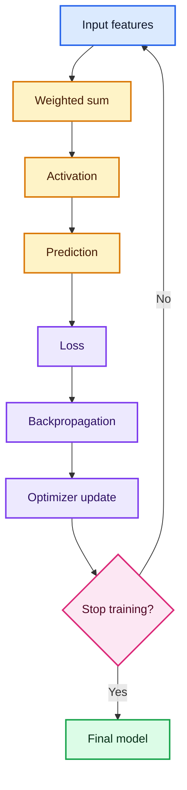

The complete training process is a repeated **predict → measure error → assign blame → update**
cycle. Forward propagation produces the prediction. The loss measures how wrong it is.
Backpropagation assigns portions of that error to individual parameters. The optimizer changes
those parameters.

---

# 1. The deep-learning big picture

## 1.1 What is deep learning?

Deep learning is a branch of machine learning that uses neural networks with multiple layers to
learn useful representations directly from data.

A traditional machine-learning workflow may require a human to design features such as:

- average pixel brightness;
- word frequency;
- number of transactions in the last week; or
- the ratio of income to debt.

A deep network can learn increasingly abstract features by itself:

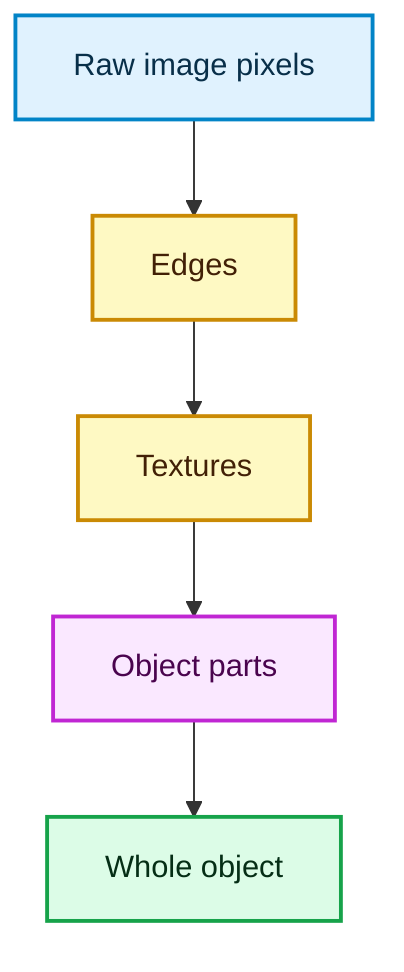

## 1.2 Why use neural networks?

Neural networks are useful when:

- the input-output relationship is highly nonlinear;
- the data is large enough to support many trainable parameters;
- useful features are difficult to write by hand;
- unstructured data such as images, audio, or text is involved; or
- predictive performance matters more than having a simple closed-form model.

They are not automatically the best choice. For small tabular datasets, linear models,
decision trees, random forests, or gradient-boosted trees may train faster and perform as well
or better.

## 1.3 White-box and black-box intuition

The source contrasts model interpretability:

| Model | Typical interpretability | Why |
|---|---:|---|
| Linear or logistic regression | High | Each coefficient has a direct mathematical meaning. |
| Small decision tree | High | A prediction follows visible if-then rules. |
| Large random forest | Medium to low | Hundreds of trees make the total decision difficult to trace. |
| Deep neural network | Low | Many distributed nonlinear transformations contribute to a prediction. |

This is a continuum, not a perfect binary division. Explainability tools such as feature
importance, permutation importance, partial dependence, SHAP, saliency maps, and integrated
gradients can help us investigate complex models.

---

# 2. The perceptron

## 2.1 What is a perceptron?

The perceptron is one of the simplest artificial neurons. Frank Rosenblatt introduced it in
1958. It accepts several inputs, assigns a weight to each input, adds a bias, and applies an
activation rule.

For inputs $x_1, x_2, \ldots, x_d$, weights $w_1, w_2, \ldots, w_d$, and bias $b$:

$$z = \sum_{j=1}^{d} w_jx_j+b = \mathbf{w}^{T}\mathbf{x}+b$$

The classic perceptron uses a step function:

$$
\hat{y} =
\begin{cases}
1, & z \ge 0,\\
0, & z < 0.
\end{cases}
$$

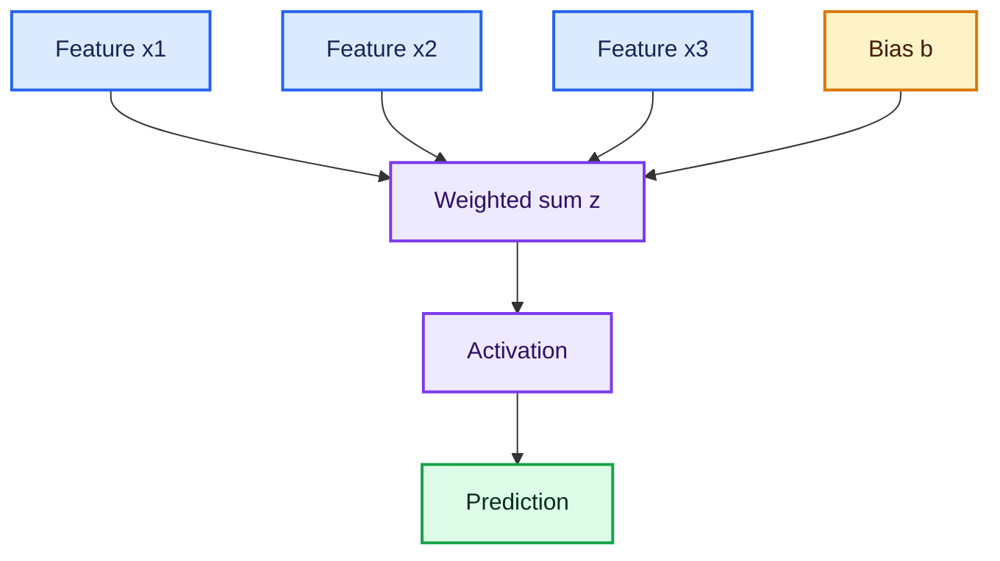

## 2.2 What do weights and bias mean?

- A **positive weight** makes a larger input push the neuron toward a larger $z$.
- A **negative weight** makes a larger input push $z$ downward.
- A weight with a large absolute value has a stronger influence.
- The **bias** moves the decision boundary without changing the input values.

The equation $\mathbf{w}^{T}\mathbf{x}+b=0$ describes the decision boundary.

In two dimensions it is a line; in three dimensions it is a plane; in higher dimensions it is
a hyperplane.

## 2.3 Health-risk example

Suppose a neuron predicts whether a person is at high heart-disease risk:

| Feature | Symbol | Standardized value | Weight |
|---|---:|---:|---:|
| Age | $x_1$ | 0.70 | 1.10 |
| Cholesterol | $x_2$ | 1.20 | 0.80 |
| Blood pressure | $x_3$ | 0.90 | 0.60 |
| Bias | $b$ | 1 | -1.50 |

Then:

$$
z=(1.10)(0.70)+(0.80)(1.20)+(0.60)(0.90)-1.50=0.77
$$

Because $z\ge0$, the step perceptron predicts class $1$.

> **Why standardize?** Raw age, cholesterol, and blood-pressure measurements have different
> units and ranges. Standardization prevents a large numerical scale from dominating merely
> because of its unit.

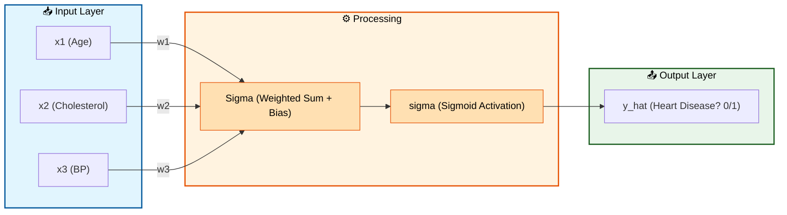
## 2.4 How does a perceptron learn?

For each training example, the classic perceptron rule is:

$$
\mathbf{w}\leftarrow\mathbf{w}+\eta(y-\hat{y})\mathbf{x}
$$

$$
b\leftarrow b+\eta(y-\hat{y})
$$

where:

- $y$ is the true class;
- $\hat{y}$ is the predicted class; and
- $\eta>0$ is the learning rate.

If the prediction is correct, \(y-\hat y=0\), so there is no update. If a positive example is
incorrectly predicted as \(0\), the update moves the decision boundary toward classifying that
example as positive.

### Commented NumPy implementation

```python
import numpy as np


class Perceptron:
    """A small binary perceptron for labels 0 and 1."""

    def __init__(self, learning_rate=0.01, epochs=20):
        # learning_rate controls the size of every correction.
        self.learning_rate = learning_rate

        # One epoch means one complete pass through the training set.
        self.epochs = epochs

    def fit(self, X, y):
        # Create one weight for each feature and initialize all weights to zero.
        self.weights = np.zeros(X.shape[1], dtype=float)

        # The bias is a separate trainable parameter.
        self.bias = 0.0

        for _ in range(self.epochs):
            for x_i, y_i in zip(X, y):
                # Compute z = w^T x + b.
                linear_score = np.dot(x_i, self.weights) + self.bias

                # Apply the classic step activation.
                prediction = 1 if linear_score >= 0 else 0

                # A correct prediction gives zero; an error gives +1 or -1.
                error = y_i - prediction

                # Move the decision boundary in the error-reducing direction.
                self.weights += self.learning_rate * error * x_i
                self.bias += self.learning_rate * error

        return self

    def predict(self, X):
        # Vectorized scores for all rows.
        scores = X @ self.weights + self.bias

        # Convert each score into class 0 or class 1.
        return (scores >= 0).astype(int)
```

## 2.5 Perceptron versus sigmoid neuron

The source proceeds from a weighted sum to a sigmoid. This is an important conceptual bridge,
but the two models should not be conflated:

| Property | Classic perceptron | Sigmoid neuron |
|---|---|---|
| Activation | Hard step | Smooth sigmoid |
| Output | Exactly 0 or 1 | A number between 0 and 1 |
| Differentiable | No at the threshold | Yes |
| Typical loss | Perceptron mistake rule | Binary cross-entropy |
| Training | Perceptron update | Gradient-based backpropagation |

## 2.6 Limitations of a single perceptron
0. Uses a step function (hard 0/1 output), making it impossible to learn incrementally.
1. It can learn only a **linear decision boundary**.
2. It can solve **linearly separable** problems but it cannot solve non-linearly separable problems such as XOR.
3. The hard step is not differentiable at its threshold.
4. A single neuron cannot learn hierarchical features.
5. This is why we moved to **Sigmoid + Multi-layer networks**.

The XOR truth table demonstrates the problem:

| $x_1$ | $x_2$ | XOR output |
|---:|---:|---:|
| 0 | 0 | 0 |
| 0 | 1 | 1 |
| 1 | 0 | 1 |
| 1 | 1 | 0 |

No single straight line can place both positive rows on one side and both negative rows on the
other. A hidden layer with nonlinear activations can transform the space and solve it.

---

# 3. Artificial neural networks

## 3.1 What is an ANN?

An **artificial neural network (ANN)** is a network of interconnected perceptrons organized in layers. When we stack perceptrons into layers and add non-linear activation functions, the network can learn complex, non-linear patterns. It connects many artificial neurons into layers:

- the **input layer** receives features;
- one or more **hidden layers** learn intermediate representations; and
- the **output layer** produces a task-specific prediction.

For layer $l$:

$$
\mathbf{z}^{(l)}=\mathbf{a}^{(l-1)}\mathbf{W}^{(l)}+\mathbf{b}^{(l)}
$$

$$
\mathbf{a}^{(l)}=f^{(l)}\left(\mathbf{z}^{(l)}\right)
$$

The input is conventionally written as $\mathbf{a}^{(0)}=\mathbf{x}$.

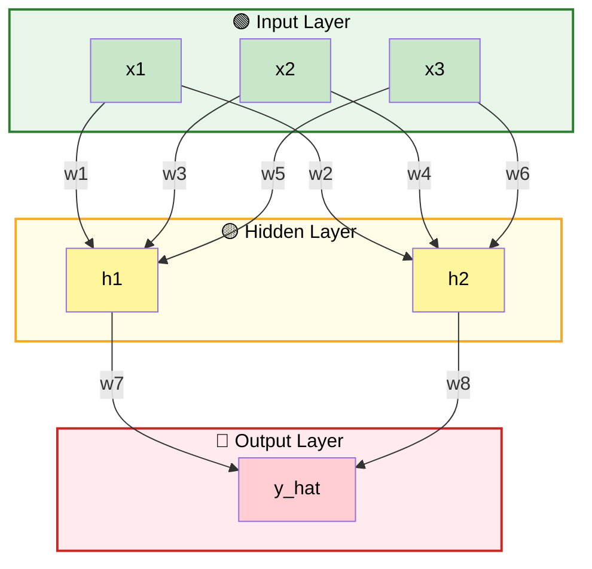

## 3.2 Parameters versus hyperparameters

| Type | Examples | Who chooses it? |
|---|---|---|
| Parameters | Weights and biases | Learned from the training data |
| Hyperparameters | Layer count, units, learning rate, batch size, epochs | Chosen by the practitioner or tuning process |

## 3.3 Why multiple layers?

If every layer uses only a linear activation, the entire network collapses into one linear
transformation:

$$
\mathbf{x}\mathbf{W}_1\mathbf{W}_2
=\mathbf{x}\left(\mathbf{W}_1\mathbf{W}_2\right)
=\mathbf{x}\mathbf{W}_{\text{equivalent}}
$$

Adding more linear layers therefore does **not** add nonlinear expressive power. Nonlinear
activation functions are what allow a network to approximate complex relationships.

## 3.4 Shape bookkeeping

Suppose:

- a batch contains $m$ examples;
- the input has $d$ features;
- hidden layer 1 has $h$ neurons; and
- the output has $k$ units.

Then:

| Quantity | Shape |
|---|---|
| $\mathbf{X}$ | $m\times d$ |
| $\mathbf{W}^{(1)}$ | $d\times h$ |
| $\mathbf{b}^{(1)}$ | $h$ |
| $\mathbf{A}^{(1)}$ | $m\times h$ |
| $\mathbf{W}^{(2)}$ | $h\times k$ |
| $\mathbf{b}^{(2)}$ | $k$ |
| $\hat{\mathbf{Y}}$ | $m\times k$ |

Tracking shapes is one of the fastest ways to debug neural-network mathematics and code.

---

# 4. Forward propagation

## 4.1 What is forward propagation?

Forward propagation moves information from the input layer to the output layer. At every
neuron:

1. multiply each input by its weight;
2. sum the products;
3. add the bias; and
4. apply the activation function.

## 4.2 Worked example from the source network

Use:

$$
\mathbf{x}=
\begin{bmatrix}
2.0 & 1.0 & 3.0
\end{bmatrix}
$$

The hidden layer has two neurons:

$$
\mathbf{W}^{(1)}=
\begin{bmatrix}
0.5 & 0.3\\
0.2 & 0.8\\
0.1 & 0.1
\end{bmatrix},
\qquad
\mathbf{b}^{(1)}=
\begin{bmatrix}
0.1 & -0.2
\end{bmatrix}
$$

### Step 1: hidden-layer weighted sums

$$
\mathbf{z}^{(1)}
=\mathbf{x}\mathbf{W}^{(1)}+\mathbf{b}^{(1)}
$$

For hidden neuron 1:

$$
z_1^{(1)}
=(2.0)(0.5)+(1.0)(0.2)+(3.0)(0.1)+0.1
=1.6
$$

For hidden neuron 2:

$$
z_2^{(1)}
=(2.0)(0.3)+(1.0)(0.8)+(3.0)(0.1)-0.2
=1.5
$$

### Step 2: hidden-layer activations

Using the sigmoid function:

$$
\sigma(z)=\frac{1}{1+e^{-z}}
$$

$$
\mathbf{a}^{(1)}
=
\begin{bmatrix}
\sigma(1.6) & \sigma(1.5)
\end{bmatrix}
\approx
\begin{bmatrix}
0.8320 & 0.8176
\end{bmatrix}
$$

### Step 3: output-layer weighted sum

Let:

$$
\mathbf{W}^{(2)}=
\begin{bmatrix}
1.2\\
-0.7
\end{bmatrix},
\qquad
b^{(2)}=0.05
$$

Then:

$$
z^{(2)}
=(0.8320)(1.2)+(0.8176)(-0.7)+0.05
\approx0.4761
$$

### Step 4: output prediction

$$
\hat y=\sigma(0.4761)\approx0.6168
$$

For binary classification, a threshold of \(0.5\) would produce class \(1\). The value \(0.6168\)
can also be interpreted as the model's estimated probability for the positive class, assuming
the model is reasonably calibrated.

## 4.3 The same calculation in NumPy

```python
import numpy as np


def sigmoid(z):
    """Convert any real-valued score into a value between 0 and 1."""
    return 1.0 / (1.0 + np.exp(-z))


# One row with three input features.
x = np.array([2.0, 1.0, 3.0])

# Each column contains the incoming weights for one hidden neuron.
W1 = np.array([
    [0.5, 0.3],
    [0.2, 0.8],
    [0.1, 0.1],
])
b1 = np.array([0.1, -0.2])

# Forward pass through the hidden layer.
z1 = x @ W1 + b1
a1 = sigmoid(z1)

# Two hidden activations feed one output neuron.
W2 = np.array([1.2, -0.7])
b2 = 0.05

# Forward pass through the output layer.
z2 = a1 @ W2 + b2
y_hat = sigmoid(z2)

print("Hidden scores:", z1)       # [1.6, 1.5]
print("Hidden activations:", a1) # approximately [0.8320, 0.8176]
print("Prediction:", y_hat)      # approximately 0.6168
```

---

# 5. Activation functions

## 5.1 What is an activation function?

Activation functions introduce **non-linearity** into the network. Without them, no matter how many layers you add, the network would still behave like a single linear model.

An activation function transforms a neuron's weighted sum:

$$
a=f(z)
$$

It determines:

- whether the neuron activates strongly or weakly;
- what output range is possible;
- whether the network can represent nonlinear patterns; and
- how easily gradients can flow backward.

## 5.2 Activation-selection flowchart

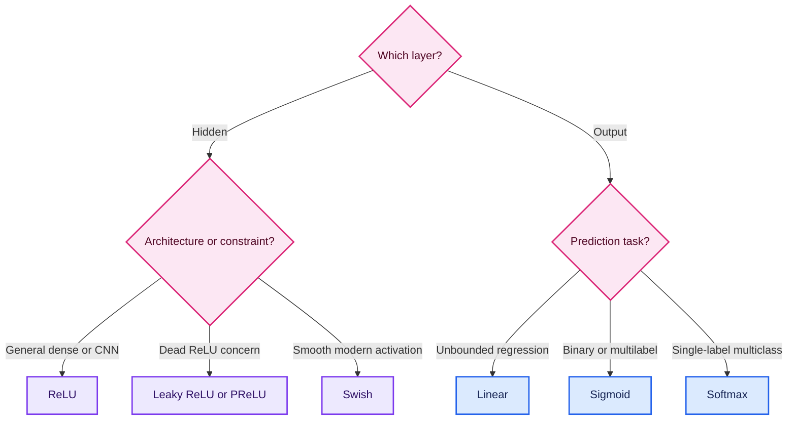

This is a starting guide, not an unbreakable law. The final choice should be validated
experimentally.

## 5.3 Linear activation

### Formula

$$
f(z)=z
$$

### Derivative

$$
f'(z)=1
$$

### What, where and why

- **What:** The output equals the input, no transformation.
- **Where:**  Output layer for **regression** tasks (house prices, temperature).
- **Why:** We do not want to squeeze continuous values between 0 and 1.

### When to use

- Output layer for an unbounded regression target such as temperature change or standardized price.

### Limitation

If used in all layers, the entire network collapses into a linear model.

---

## 5.4 Sigmoid activation

### Formula

$$
\sigma(z)=\frac{1}{1+e^{-z}}
$$

### Range

$$
0<\sigma(z)<1
$$

### Derivative

$$
\sigma'(z)=\sigma(z)\left(1-\sigma(z)\right)
$$

### When to use

- Binary-classification output layer (probability) with one unit.
- Multilabel output, where each label has an independent probability.
- Gates in recurrent architectures such as LSTMs.

### Example

If $\hat y=0.85$, the model assigns an estimated 85% probability to class $1$.

### Limitations

- For very positive or negative inputs ($z$), the derivative approaches zero, stopping learning in early layers.
- Outputs are not zero-centered.
- It is now uncommon as a default hidden-layer activation.

> **Numerical tip:** Training code often accepts raw logits and combines sigmoid with cross-entropy internally. This is more stable than manually computing a sigmoid and then taking a logarithm.

---

## 5.5 Tanh activation (Hyperbolic Tangent)

### Formula

$$
\tanh(z)=\frac{e^z-e^{-z}}{e^z+e^{-z}}
$$

### Range

$$
-1<\tanh(z)<1
$$

### Derivative

$$
\frac{d}{dz}\tanh(z)=1-\tanh^2(z)
$$

### Advantages
- Zero-centered output.
- Around $z=0$, its gradient can be stronger than sigmoid's.
- **Where:** Hidden layers when data has both positive and negative values.
- **Why:** Zero-centered outputs (better than sigmoid's 0.5 center). Stronger gradients in (-1, 1).

### Limitations

It still saturates for large $|z|$, so deep networks can suffer from vanishing gradients at extremes.

### When to use

Tanh remains useful in some recurrent-network states and whenever bounded, zero-centered
activations are desirable.

---

## 5.6 ReLU (Rectified Linear Unit)

ReLU means **Rectified Linear Unit**.
- **What:** 
    - If $x < 0 \rightarrow 0$  
    - If $x > 0 \rightarrow x$
- **Where:** Hidden layers of almost all modern deep networks (CNNs, NLP).

### Formula

$$
\operatorname{ReLU}(z)=\max(0,z)
$$

### Derivative

$$
\operatorname{ReLU}'(z)=
\begin{cases}
0, & z<0,\\
1, & z>0.
\end{cases}
$$

At $z=0$, the mathematical derivative is undefined. Software frameworks choose a convenient subgradient, usually $0$.

### Why it works well
  
- Very fast to compute (no exponentials).
- Avoids vanishing gradient for positive values.
- Makes training deep networks much faster.
- It is computationally cheap.
- Positive activations have gradient $1$\)$, which helps gradient flow.
- Zero outputs create sparse activations.
- It works well in deep dense networks and CNNs.

### Dying-ReLU problem

Neurons can get stuck at 0 forever if weights update badly. If a neuron's inputs remain negative, its output and gradient stay at zero. The neuron may stop learning permanently. A smaller learning rate, better initialization, normalization, or a
leaky variant can reduce this risk.

---

## 5.7 Leaky ReLU

### Formula

$$
f(z)=
\begin{cases}
z, & z>0,\\
\alpha z, & z\le0,
\end{cases}
\qquad \alpha \text{ is small, such as }0.01
$$

### What

Instead of killing negative values, gives them a tiny leak $\alpha$.

### Why

The negative side retains a small gradient $\alpha$, so a neuron is less likely to become permanently inactive. Hence, it fixes the "Dead Neuron" problem of ReLU.

### Advantages

- Cheap to compute.
- Better negative-side gradient flow than ReLU for negative inputs.
- Useful when many ReLU neurons die.

### Limitations

- The best value of $\alpha$ is problem-dependent.
- It is not guaranteed to outperform ReLU.

---

## 5.8 PReLU (Parametric ReLU)

PReLU means **Parametric Rectified Linear Unit**. It uses the same piecewise formula as Leaky ReLU, but the negative slope $\alpha$ is a trainable parameter.

### Why

Like Leaky ReLU, but the slope `alpha` is **learned** during training (not fixed), the model learns it from the data. More flexible and adaptive to the data.

### Advantages

- Adaptive negative slope.
- Can improve performance in some deep CNNs.

### Limitations

- Adds extra trainable parameters.
- Risk of overfitting on a small dataset.
- Learned negative slopes can behave differently across layers or channels.

---

## 5.9 Swish (Google)

Smooth, non-monotonic function. ReLU-like but smoother.

### Formula

The common $\beta=1$ form is:

$$
\operatorname{Swish}(z)=z\sigma(z)
$$

A generalized form is $z\sigma(\beta z)$.

### Derivative for $\beta=1$

$$
\frac{d}{dz}\left[z\sigma(z)\right]
=\sigma(z)+z\sigma(z)(1-\sigma(z))
$$

### Why 

- Smooth curve -> better gradient flow.
- Non-monotonic -> adapts better to complex patterns.
- Often improves accuracy over ReLU in deep networks.

### Intuition

- Large positive inputs pass through approximately unchanged.
- Large negative inputs approach zero.
- Small negative outputs are allowed.
- The curve is smooth and non-monotonic.

### Trade-off

Swish may improve optimization in some deep networks, but it requires sigmoid computation and is therefore more expensive than ReLU. 

---

## 5.10 Softmax for multiclass output

For $K$ mutually exclusive classes and logits $z_1,\ldots,z_K$:

$$
\operatorname{softmax}(z_i)
=\frac{e^{z_i}}{\sum_{j=1}^{K}e^{z_j}}
$$

The outputs are nonnegative and sum to \(1\).

For numerical stability, subtract the largest logit:

$$
\operatorname{softmax}(z_i)
=\frac{e^{z_i-\max(\mathbf z)}}{\sum_j e^{z_j-\max(\mathbf z)}}
$$

Subtracting the same constant from every logit does not change the probabilities, but it
prevents unnecessarily large exponentials.

## 5.11 Activation comparison

| Activation | Range | Main use | Main strength | Main weakness |
|---|---|---|---|---|
| Linear | $(-\infty,\infty)$ | Regression output | Unrestricted output | No nonlinearity |
| Sigmoid | $(0,1)$ | Binary/multilabel output | Probability-like output | Saturation |
| Tanh | $(-1,1)$ | Some hidden/recurrent states | Zero-centered | Saturation |
| ReLU | $[0,\infty)$ | Hidden layers | Fast and effective | Dead neurons |
| Leaky ReLU | $(-\infty,\infty)$ | Hidden layers | Negative gradient remains | Fixed slope |
| PReLU | $(-\infty,\infty)$ | Hidden layers | Learned slope | Extra parameters |
| Swish | About $(-0.28,\infty)$ | Deep hidden layers | Smooth gradient | More computation |
| Softmax | Each in $(0,1)$, total $1$ | Multiclass output | Class distribution | Not for independent labels |

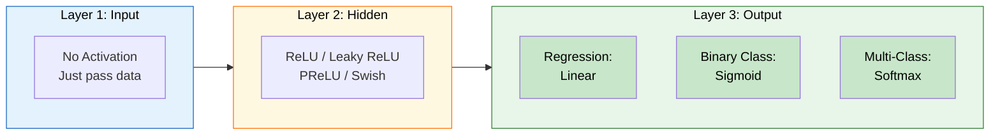
---

# 6. The vanishing-gradient problem

## 6.1 What happens?

During backpropagation, the chain rule multiplies many local derivatives. For a deep network:

$$
\frac{\partial L}{\partial \mathbf{W}^{(1)}}
=
\frac{\partial L}{\partial \mathbf{a}^{(L)}}
\frac{\partial \mathbf{a}^{(L)}}{\partial \mathbf{a}^{(L-1)}}
\cdots
\frac{\partial \mathbf{a}^{(2)}}{\partial \mathbf{a}^{(1)}}
\frac{\partial \mathbf{a}^{(1)}}{\partial \mathbf{W}^{(1)}}
$$

These are matrix products in a real network. If most factors have magnitudes below \(1\), the
product can shrink toward zero.

## 6.2 Why sigmoid is vulnerable

The largest possible sigmoid derivative is:

$$
\max_z \sigma'(z)=0.25
$$

Ignoring weights for a moment, multiplying ten such derivatives gives:

$$
0.25^{10}\approx9.54\times10^{-7}
$$

For twenty layers:

$$
0.25^{20}\approx9.09\times10^{-13}
$$

An early-layer gradient can therefore become too small to cause a meaningful update.

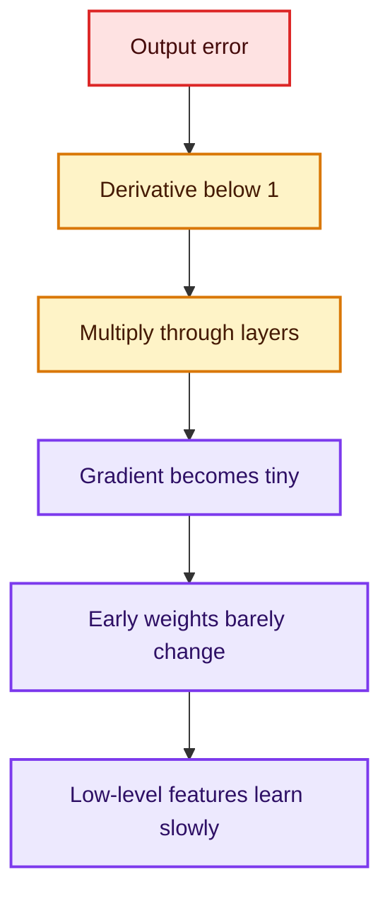

## 6.3 Symptoms

- The loss decreases extremely slowly.
- Gradients in early layers are almost zero.
- Later layers learn while earlier layers appear frozen.
- Increasing depth makes optimization worse.

## 6.4 Common remedies

1. **ReLU-family activations** maintain stronger positive-side gradients.
2. **He initialization** is designed for ReLU-like activations.
3. **Xavier/Glorot initialization** helps tanh or sigmoid networks maintain variance.
4. **Batch normalization or layer normalization** can stabilize internal scales.
5. **Residual connections** create shorter gradient paths.
6. **LSTM/GRU gates** help recurrent models preserve long-range information.
7. **Gradient monitoring** makes the failure visible.

## 6.5 Related problem: exploding gradients

If repeated factors are too large, the product can grow instead of shrink. This produces huge,
unstable updates. Gradient clipping, careful initialization, normalization, and a smaller
learning rate are common remedies.

---

# 7. Loss and cost functions

Loss functions measure how wrong the model's predictions are. The goal of training is to **minimize** this value.

## 7.1 Loss versus cost versus objective

The words are often used interchangeably, but a useful distinction is:

- **Loss:** error for one example.
- **Cost:** average loss over a batch or dataset.
- **Objective:** the complete quantity being optimized, possibly including regularization.

For $N$ examples:

$$
J(\theta)=\frac{1}{N}\sum_{i=1}^{N}L\left(y_i,\hat y_i\right)
+\lambda R(\theta)
$$

Here $R(\theta)$ may be an L1 or L2 regularization penalty.

## 7.2 Loss-selection flowchart

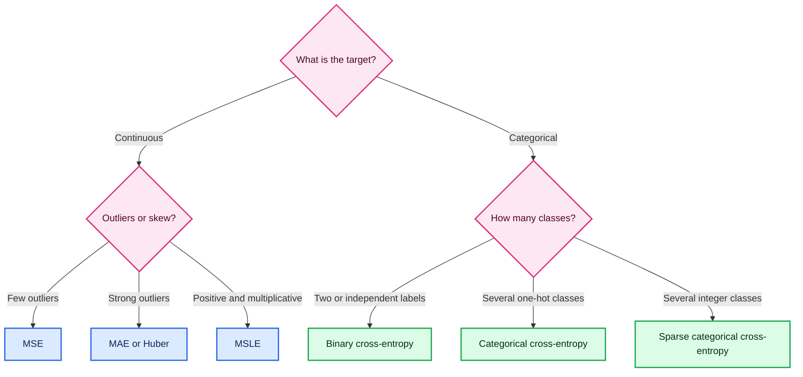

## 7.3 Mean squared error
- **What:** Average of squared differences.
- **Why:** Heavily penalizes large errors (outliers).
- **When:** Most common regression loss. Good when large errors are particularly bad.
### Formula

$$
\operatorname{MSE}
=\frac{1}{N}\sum_{i=1}^{N}(y_i-\hat y_i)^2
$$

Some derivations use:

$$
J=\frac{1}{2N}\sum_{i=1}^{N}(y_i-\hat y_i)^2
$$

The factor $1/2$ cancels the $2$ produced by differentiation and does not change the
location of the optimum.

### Why use it?

- Smooth and differentiable.
- Strongly penalizes large errors.
- Corresponds to maximum-likelihood estimation when residuals are independent Gaussian noise
  with constant variance.

### Limitation

Squaring makes MSE sensitive to outliers. An error of $100$ contributes $10{,}000$, whereas
an error of $10$ contributes only $100$.

## 7.4 Mean absolute error
- **What:** Average of absolute differences.
- **Why:** More robust to outliers. Every error contributes linearly.
- **When:** Use when outliers should not dominate the loss.

### Formula

$$
\operatorname{MAE}
=\frac{1}{N}\sum_{i=1}^{N}|y_i-\hat y_i|
$$

### Advantages

- More robust to outliers than MSE.
- Every unit of error contributes linearly.
- Easy to interpret in the target's units.

### Limitations

- Not differentiable at zero error; frameworks use a subgradient.
- Its constant-magnitude gradient may converge less smoothly near the optimum.

Under idealized conditions, minimizing squared error estimates a conditional mean, while
minimizing absolute error estimates a conditional median.

## 7.5 Huber loss

- **What:** Combines MSE for small errors and MAE for large errors.
- **Why:** Best of both worlds — smooth near zero, robust to outliers.

Huber loss combines MSE near zero with MAE for large errors. Let
$r=y-\hat y$:

$$
L_\delta(r)=
\begin{cases}
\frac{1}{2}r^2, & |r|\le\delta,\\
\delta\left(|r|-\frac{1}{2}\delta\right), & |r|>\delta.
\end{cases}
$$

### Why

- Small errors get the smooth quadratic treatment of MSE.
- Large errors grow linearly, reducing outlier influence.

### When

Use Huber loss for regression when most observations are reliable but occasional large
outliers exist. The threshold $\delta$ decides where the behavior changes.

## 7.6 Mean squared logarithmic error

- **When:** Target values have a huge range (e.g., house prices from 10L to 10Cr).

### Formula

$$
\operatorname{MSLE}
=\frac{1}{N}\sum_{i=1}^{N}
\left[
\log(1+y_i)-\log(1+\hat y_i)
\right]^2
$$

### When

MSLE is helpful when:

- targets are nonnegative;
- relative error matters more than absolute error; and
- the target is right-skewed across several orders of magnitude.

Predicting $20$ instead of $10$ and predicting $200$ instead of $100$ are treated more similarly than under MSE because both are roughly a factor-of-two error.

### Warning

Standard MSLE requires $y\ge0$ and $\hat y\ge0$. It is not appropriate for targets that can legitimately be negative.

## 7.7 Binary cross-entropy

- **What:** Measures performance when output is a probability (0 to 1).
- **When:** Binary classification with **Sigmoid** activation.
- **Example:** Spam detection, disease prediction.

For $y\in\{0,1\}$ and predicted probability $\hat y$:

$$
L_{\text{BCE}}
=-\left[
y\log(\hat y)+(1-y)\log(1-\hat y)
\right]
$$

### Intuition

- If $y=1$, the loss becomes $-\log(\hat y)$.
- If $y=0$, the loss becomes $-\log(1-\hat y)$.
- A confident correct prediction has low loss.
- A confident wrong prediction has very high loss.

Using the forward-pass example, $y=1$ and $\hat y=0.6168$:

$$
L=-\log(0.6168)\approx0.4832
$$

The probability is above the classification threshold, so the label is correct, but the loss is not zero because the model is not fully confident.

## 7.8 Categorical cross-entropy

- **What:** Generalization for multi-class problems.
- **When:** Multi-class with **Softmax** activation.
- **Requires:** One-hot encoded labels.

For one-hot target vector $\mathbf y$ and softmax probabilities $\hat{\mathbf y}$:

$$
L_{\text{CCE}}
=-\sum_{k=1}^{K}y_k\log(\hat y_k)
$$

If the true class is dog:

$$
\mathbf y=
\begin{bmatrix}
0 & 1 & 0
\end{bmatrix}
$$

and:

$$
\hat{\mathbf y}=
\begin{bmatrix}
0.10 & 0.75 & 0.15
\end{bmatrix},
$$

then:

$$
L=-\log(0.75)\approx0.2877
$$

## 7.9 Sparse categorical cross-entropy

Sparse categorical cross-entropy performs the same conceptual calculation as categorical
cross-entropy, but the target is stored as an integer:

- $cat =0$
- $dog =1$
- $horse =2$

Use:

- **categorical cross-entropy** with one-hot targets such as $[0,1,0]$;
- **sparse categorical cross-entropy** with integer targets such as $1$.

## 7.10 Match the output layer and loss

| Task | Output units | Output activation | Common loss |
|---|---:|---|---|
| Unbounded regression | Number of targets | Linear | MSE, MAE, Huber |
| Binary classification | 1 | Sigmoid | Binary cross-entropy |
| Multilabel classification | Number of labels | Sigmoid per label | Binary cross-entropy |
| Single-label multiclass | Number of classes | Softmax | Categorical or sparse categorical cross-entropy |

> **Critical distinction:** Multiclass classes are mutually exclusive. Multilabel outputs are
> independent; one example can have several positive labels. Softmax suits the former, while
> independent sigmoids suit the latter.

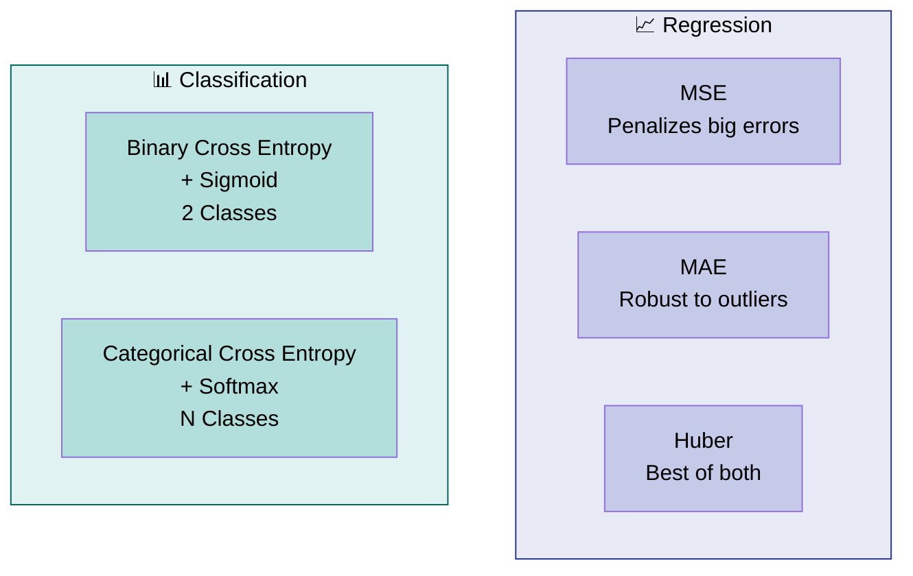
---

# 8. Backpropagation

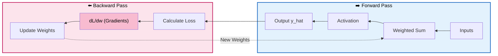
## 8.1 What is backpropagation?

Backpropagation is how the network **learns**. It calculates the error at the output and propagates it backward to update weights using the **chain rule of derivatives**.

Backpropagation efficiently computes the gradient of the loss with respect to every trainable
parameter. It applies the chain rule from the output layer backward toward the input layer.

Backpropagation does **not** itself update weights. It calculates gradients. An optimizer uses
those gradients to perform the update.

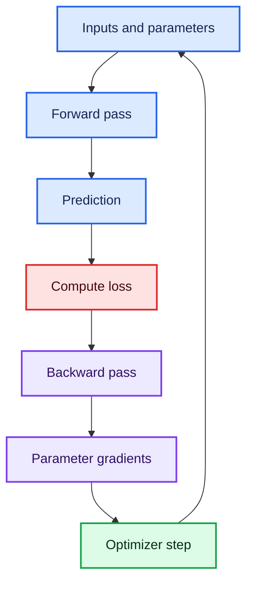

## 8.2 Gradient-descent update

For any parameter $theta$:

$$
\theta_{\text{new}}
=\theta_{\text{old}}-\eta\frac{\partial L}{\partial\theta}
$$

where $\eta$ is the learning rate

The gradient points in the direction of steepest increase, so subtracting it moves downhill.

## 8.3 Chain-rule example

Suppose:

$$
z=w x+b,\qquad \hat y=\sigma(z),\qquad L=L(y,\hat y)
$$

Then:

$$
\frac{\partial L}{\partial w}
=
\frac{\partial L}{\partial\hat y}
\frac{\partial\hat y}{\partial z}
\frac{\partial z}{\partial w}
$$

Since:

$$
\frac{\partial z}{\partial w}=x,
$$

where $\frac{\partial L}{\partial w}$ is gradient of loss with respect to weight 

The input scales the contribution of that weight to the error.

## 8.4 Useful sigmoid plus BCE simplification

For a sigmoid output and binary cross-entropy:

$$
\frac{\partial L}{\partial z^{(2)}}=\hat y-y
$$

This compact result is one reason sigmoid and BCE form a natural pair.

## 8.5 Full backward pass for the worked network

From the forward pass:

$$
\mathbf a^{(1)}=
\begin{bmatrix}
0.832018 & 0.817574
\end{bmatrix},
\qquad
\hat y=0.616831,
\qquad
y=1
$$

### Step 1: output error signal

$$
\delta^{(2)}
=\frac{\partial L}{\partial z^{(2)}}
=\hat y-y
=-0.383169
$$

### Step 2: output-weight gradients

$$
\frac{\partial L}{\partial\mathbf W^{(2)}}
=\mathbf a^{(1)}\delta^{(2)}
$$

$$
\frac{\partial L}{\partial\mathbf W^{(2)}}
\approx
\begin{bmatrix}
-0.318803\\
-0.313269
\end{bmatrix}
$$

The output-bias gradient is:

$$
\frac{\partial L}{\partial b^{(2)}}=\delta^{(2)}=-0.383169
$$

### Step 3: update the output parameters

With learning rate \(\eta=0.01\):

$$
\mathbf W_{\text{new}}^{(2)}
=
\begin{bmatrix}
1.2\\
-0.7
\end{bmatrix}
-0.01
\begin{bmatrix}
-0.318803\\
-0.313269
\end{bmatrix}
=
\begin{bmatrix}
1.203188\\
-0.696867
\end{bmatrix}
$$

$$
b_{\text{new}}^{(2)}
=0.05-0.01(-0.383169)
=0.053832
$$

The first output weight increases because its gradient is negative. Subtracting a negative
number increases the parameter.

### Step 4: propagate error into the hidden layer

For element-wise sigmoid:

$$
\boldsymbol\delta^{(1)}
=
\left(
\mathbf W^{(2)}\delta^{(2)}
\right)
\odot
\mathbf a^{(1)}
\odot
\left(1-\mathbf a^{(1)}\right)
$$

Using the old output weights:

$$
\boldsymbol\delta^{(1)}
\approx
\begin{bmatrix}
-0.064264 & 0.040004
\end{bmatrix}
$$

### Step 5: input-to-hidden gradients

$$
\frac{\partial L}{\partial\mathbf W^{(1)}}
=\mathbf x^T\boldsymbol\delta^{(1)}
$$

$$
\frac{\partial L}{\partial\mathbf W^{(1)}}
\approx
\begin{bmatrix}
-0.128527 & 0.080008\\
-0.064264 & 0.040004\\
-0.192791 & 0.120011
\end{bmatrix}
$$

The hidden-bias gradient equals \(\boldsymbol\delta^{(1)}\).

## 8.6 Commented forward and backward code

```python
import numpy as np


def sigmoid(z):
    return 1.0 / (1.0 + np.exp(-z))


# -------------------------
# 1. Data and parameters
# -------------------------
x = np.array([2.0, 1.0, 3.0])
y = 1.0

W1 = np.array([
    [0.5, 0.3],
    [0.2, 0.8],
    [0.1, 0.1],
])
b1 = np.array([0.1, -0.2])

W2 = np.array([1.2, -0.7])
b2 = 0.05
learning_rate = 0.01

# -------------------------
# 2. Forward propagation
# -------------------------
z1 = x @ W1 + b1          # Hidden-layer pre-activations
a1 = sigmoid(z1)          # Hidden-layer outputs
z2 = a1 @ W2 + b2         # Output pre-activation
y_hat = sigmoid(z2)       # Predicted positive-class probability

# Add a tiny constant inside logs in general code to avoid log(0).
loss = -(y * np.log(y_hat) + (1 - y) * np.log(1 - y_hat))

# -------------------------
# 3. Backpropagation
# -------------------------
# For sigmoid + binary cross-entropy, dL/dz2 simplifies to y_hat - y.
delta2 = y_hat - y

# Gradient of output weights and bias.
grad_W2 = a1 * delta2
grad_b2 = delta2

# Send the output error back through W2 and the hidden sigmoid derivative.
delta1 = (W2 * delta2) * a1 * (1 - a1)

# Outer product creates one gradient for each input-to-hidden connection.
grad_W1 = np.outer(x, delta1)
grad_b1 = delta1

# -------------------------
# 4. Gradient-descent update
# -------------------------
# Simultaneous updates should use gradients computed from the old parameters.
W2 -= learning_rate * grad_W2
b2 -= learning_rate * grad_b2
W1 -= learning_rate * grad_W1
b1 -= learning_rate * grad_b1

print(f"Loss before update: {loss:.6f}")
print("Updated output weights:", W2)
print("Updated output bias:", b2)
```

## 8.7 Why backpropagation is efficient

A naive method could perturb each parameter separately and measure how the loss changes. A
modern network may have millions or billions of parameters, making that approach unusable.
Backpropagation reuses intermediate computations and obtains all gradients in roughly the same
order of computational cost as a small number of forward passes.

---

# 9. Gradient descent and optimizers

## 9.1 What does an optimizer do?

An optimizer uses gradients to choose parameter updates. Plain gradient descent uses:

$$
\theta_{t+1}=\theta_t-\eta\nabla_\theta J(\theta_t)
$$

The learning rate $\eta$ controls step size:

- too small: learning is slow;
- too large: the loss may oscillate or diverge;
- suitable: the loss falls efficiently and stably.

## 9.2 Epoch, batch, and iteration

- **Epoch:** one complete pass through the training set.
- **Batch:** the subset processed before one update.
- **Iteration/step:** one optimizer update.

If $N$ is the number of training rows and $B$ is batch size:

$$
\text{updates per epoch}=\left\lceil\frac{N}{B}\right\rceil
$$

$$
\text{total updates}
=\text{epochs}\times
\left\lceil\frac{N}{B}\right\rceil
$$

## 9.3 Batch gradient descent

Batch gradient descent uses all **entire dataset** to compute graditent and updates weights once per epoch.

For $N=100{,}000$:

- batch size $=100{,}000$;
- updates per epoch $=1$; and
- 100 epochs produce 100 updates.

### Advantages

- Smooth, stable gradient estimate.
- Deterministic for a fixed dataset and parameters.

### Disadvantages

- Slow updates on large datasets.
- High memory demand.
- Less frequent feedback from the data.

## 9.4 Stochastic gradient descent

Pure SGD uses one row per update.

For $N=100{,}000$:

- batch size $=1$;
- updates per epoch $=100{,}000$; and
- 100 epochs produce $10{,}000{,}000$ updates.

### Advantages

- Starts updating immediately.
- Low memory per update.
- Noise may help escape shallow local structures or saddle regions.

### Disadvantages

- Very noisy trajectory.
- Inefficient on parallel hardware when processing one example at a time.
- Loss may fluctuate around a minimum.

## 9.5 Mini-batch gradient descent

Mini-batch training is the practical compromise used by most deep-learning frameworks.

For $N=100{,}000$, $B=100$:

$$
\frac{100{,}000}{100}=1{,}000
\text{ updates per epoch}
$$

Over 100 epochs, that gives $100{,}000$ updates.

Forward pass $\rightarrow$ Backward pass $\rightarrow$ Weight update per batch

### Why mini-batches work well

- Vectorized operations make GPUs efficient.
- The gradient is less noisy than a one-row estimate.
- Parameters are updated more often than in full-batch training.
- Batch size provides a useful speed-memory-noise trade-off.

## 9.6 Comparison of gradient estimates

| Method | Batch size | Update frequency | Gradient noise | Memory |
|---|---:|---:|---:|---:|
| Batch GD | \(N\) | Once per epoch | Low | High |
| Pure SGD | 1 | Once per row | High | Low |
| Mini-batch GD | Usually 16-1024 | Once per batch | Medium | Medium |

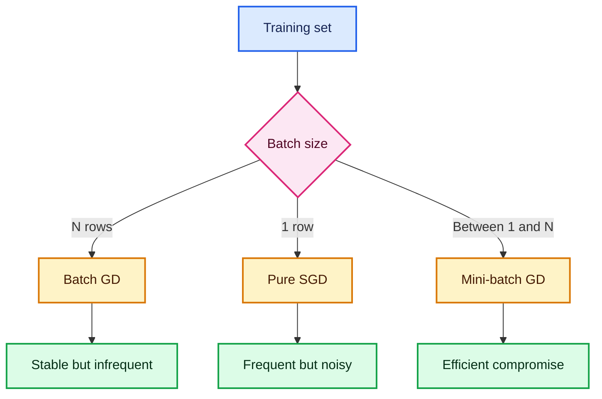

## 9.7 Momentum

Plain SGD can zigzag across a narrow valley. Momentum accumulates a moving direction:

$$
\mathbf v_t=\beta\mathbf v_{t-1}+\mathbf g_t
$$

$$
\theta_{t+1}=\theta_t-\eta\mathbf v_t
$$

where $\mathbf g_t=\nabla_\theta J(\theta_t)$ and a common value is $\beta=0.9$.

### Intuition

A ball rolling downhill gains speed in a consistent direction. Conflicting gradients partly cancel, reducing side-to-side oscillation.

> Some books place $(1-\beta)$ before $\mathbf g_t$. That is a different scaling convention;
> interpret $\eta$ together with the chosen convention.

## 9.8 AdaGrad (Adaptive Gradient)

Adapts learning rate per parameter. Frequently updated params get smaller LR. AdaGrad keeps a running sum of squared gradients for each parameter:

$$
\mathbf G_t=\mathbf G_{t-1}+\mathbf g_t^2
$$

$$
\theta_{t+1}
=\theta_t-
\frac{\eta}{\sqrt{\mathbf G_t}+\epsilon}\mathbf g_t
$$

All squares, roots, and divisions are element-wise.

### Why

Parameters with frequent large gradients receive smaller future steps; parameters with rare
gradients retain larger steps. This can help sparse features.

### Limitation

$\mathbf G_t$ only grows, so the effective learning rate can become extremely small and training may stop too early. Learning rate can shrink to near zero over time.

## 9.9 RMSProp as a bridge

RMSProp replaces AdaGrad's forever-growing sum with an exponential moving average:

$$
\mathbf v_t
=\beta_2\mathbf v_{t-1}
+(1-\beta_2)\mathbf g_t^2
$$

$$
\theta_{t+1}
=\theta_t-
\eta\frac{\mathbf g_t}{\sqrt{\mathbf v_t}+\epsilon}
$$

Old squared gradients gradually fade, so the learning rate does not necessarily shrink
forever.

## 9.10 Adam (Adaptive Moment Estimation)

Adam = Momentum + Adgrade

Adam combines:

- a moving average of gradients, similar to momentum; and
- a moving average of squared gradients, similar to RMSProp.

### First moment

$$
\mathbf m_t
=\beta_1\mathbf m_{t-1}
+(1-\beta_1)\mathbf g_t
$$

### Second moment

$$
\mathbf v_t
=\beta_2\mathbf v_{t-1}
+(1-\beta_2)\mathbf g_t^2
$$

### Bias correction

Because both moving averages start at zero:

$$
\hat{\mathbf m}_t=\frac{\mathbf m_t}{1-\beta_1^t},
\qquad
\hat{\mathbf v}_t=\frac{\mathbf v_t}{1-\beta_2^t}
$$

### Update

$$
\theta_{t+1}
=\theta_t
-\eta
\frac{\hat{\mathbf m}_t}
{\sqrt{\hat{\mathbf v}_t}+\epsilon}
$$

Typical starting values are:

$$
\eta=0.001,\quad
\beta_1=0.9,\quad
\beta_2=0.999,\quad
\epsilon=10^{-7}\text{ or }10^{-8}
$$

### Why Adam is popular

- Works well with noisy mini-batch gradients.
- Uses a separate effective step size for each parameter.
- Usually requires less initial tuning than plain SGD.
- Is a strong baseline across many applications.

Adam is not universally best. SGD with momentum can generalize better in some vision tasks, and AdamW is often preferred when decoupled weight decay is required.

## 9.11 Optimizer intuition

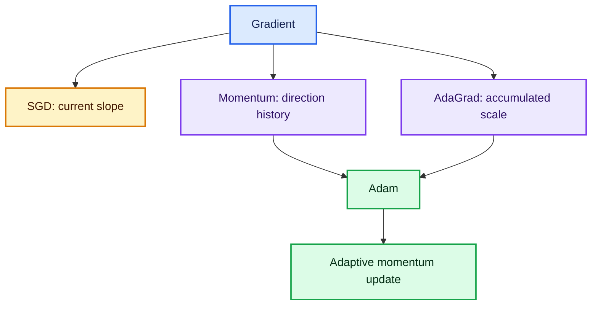

---

# 10. Training and validation metrics

## 10.1 `loss`

Training loss is the average objective value on the training batches. The optimizer directly tries to reduce it.

Lower is usually better, but compare values only when the dataset, preprocessing, and loss definition are the same.

## 10.2 `accuracy`

Training accuracy is:

$$
\operatorname{accuracy}
=
\frac{\text{number of correct training predictions}}
{\text{number of training examples}}
$$

Accuracy is a metric for human interpretation; it is usually not differentiated to train the
model.

## 10.3 `val_loss`

Validation loss is evaluated on held-out examples not used for gradient updates. It estimates
how well the learned probability function generalizes.

## 10.4 `val_accuracy`

Validation accuracy is the fraction of held-out examples correctly classified.

## 10.5 Why validation loss and accuracy can disagree

Accuracy considers only the final class. Cross-entropy also considers confidence.

For a positive example:

- prediction changes from 0.60 to 0.90: class stays correct, but loss improves;
- prediction changes from 0.90 to 0.51: class stays correct, but loss worsens;
- prediction changes from 0.51 to 0.49: accuracy changes abruptly even though probability
  changes only slightly.

Therefore, `val_loss` can rise before `val_accuracy` falls.

## 10.6 Common learning-curve patterns

| Pattern | Likely interpretation | Possible response |
|---|---|---|
| Training and validation loss both high | Underfitting | Larger model, better features, train longer, reduce excessive regularization |
| Both losses decrease and stay close | Healthy learning | Continue until validation improvement stops |
| Training loss falls; validation loss rises | Overfitting | Early stopping, regularization, dropout, augmentation, more data |
| Loss is unstable or becomes `nan` | Optimization failure | Lower learning rate, normalize data, clip gradients, check invalid values |
| Accuracy high but minority recall poor | Class imbalance | Inspect confusion matrix, macro metrics, balanced accuracy, class weights |

## 10.7 Accuracy warning

If $95%$ of examples belong to class A, predicting A for every row gives $95%$ accuracy but learns nothing about the minority class. Depending on the task, also inspect:

- per-class precision and recall;
- F1 score;
- confusion matrix;
- ROC-AUC or PR-AUC;
- macro-averaged metrics; and
- balanced accuracy.

For $K$ classes, balanced accuracy is the mean recall:

$$
\operatorname{BalancedAccuracy}
=\frac{1}{K}\sum_{k=1}^{K}
\frac{TP_k}{TP_k+FN_k}
$$

---

# 11. Complete commented code

The source refers to Keras/TensorFlow-style training metrics. The following binary-classification
example shows the complete workflow.

## 11.1 End-to-end binary classifier

```python
# Install separately if required:
# pip install tensorflow scikit-learn matplotlib

import random
import numpy as np
import tensorflow as tf
from sklearn.datasets import make_moons
from sklearn.metrics import classification_report, confusion_matrix
from sklearn.model_selection import train_test_split
from sklearn.preprocessing import StandardScaler


# ------------------------------------------------------------
# 1. Reproducibility
# ------------------------------------------------------------
SEED = 42
random.seed(SEED)
np.random.seed(SEED)
tf.random.set_seed(SEED)


# ------------------------------------------------------------
# 2. Create a nonlinear binary-classification dataset
# ------------------------------------------------------------
# make_moons is useful here because a straight-line classifier cannot
# perfectly separate its two curved classes.
X, y = make_moons(
    n_samples=4_000,
    noise=0.20,
    random_state=SEED,
)


# ------------------------------------------------------------
# 3. Split before fitting preprocessing
# ------------------------------------------------------------
# stratify=y keeps approximately the same class ratio in both splits.
X_train, X_val, y_train, y_val = train_test_split(
    X,
    y,
    test_size=0.20,
    random_state=SEED,
    stratify=y,
)


# ------------------------------------------------------------
# 4. Standardize without data leakage
# ------------------------------------------------------------
scaler = StandardScaler()

# Learn mean and standard deviation only from the training features.
X_train = scaler.fit_transform(X_train)

# Reuse the training statistics for validation data.
X_val = scaler.transform(X_val)


# ------------------------------------------------------------
# 5. Build the neural network
# ------------------------------------------------------------
model = tf.keras.Sequential([
    # State the expected number of input features explicitly.
    tf.keras.layers.Input(shape=(X_train.shape[1],)),

    # ReLU lets the network learn nonlinear boundaries.
    # He initialization is designed for ReLU-family activations.
    tf.keras.layers.Dense(
        units=16,
        activation="relu",
        kernel_initializer="he_normal",
    ),

    # A second hidden layer can build on features learned by the first.
    tf.keras.layers.Dense(
        units=8,
        activation="swish",
    ),

    # One sigmoid unit represents P(y=1 | x).
    tf.keras.layers.Dense(
        units=1,
        activation="sigmoid",
    ),
])


# ------------------------------------------------------------
# 6. Configure optimization, loss, and metrics
# ------------------------------------------------------------
model.compile(
    # Adam is a strong general-purpose starting optimizer.
    optimizer=tf.keras.optimizers.Adam(learning_rate=1e-3),

    # Binary cross-entropy matches a one-unit sigmoid output.
    loss=tf.keras.losses.BinaryCrossentropy(),

    # Accuracy is reported in addition to the optimized loss.
    metrics=[
        tf.keras.metrics.BinaryAccuracy(
            name="accuracy",
            threshold=0.5,
        )
    ],
)


# ------------------------------------------------------------
# 7. Define training safeguards
# ------------------------------------------------------------
early_stopping = tf.keras.callbacks.EarlyStopping(
    # Validation loss detects worsening generalization.
    monitor="val_loss",

    # Stop after 15 epochs without a meaningful improvement.
    patience=15,

    # Return to the parameters from the best validation epoch.
    restore_best_weights=True,
)

reduce_lr = tf.keras.callbacks.ReduceLROnPlateau(
    monitor="val_loss",
    factor=0.5,       # Halve the learning rate on a plateau.
    patience=5,
    min_lr=1e-6,
)


# ------------------------------------------------------------
# 8. Train with mini-batch gradient descent
# ------------------------------------------------------------
history = model.fit(
    X_train,
    y_train,
    validation_data=(X_val, y_val),
    epochs=200,
    batch_size=32,
    callbacks=[early_stopping, reduce_lr],
    verbose=1,
)


# ------------------------------------------------------------
# 9. Evaluate on held-out validation data
# ------------------------------------------------------------
val_loss, val_accuracy = model.evaluate(
    X_val,
    y_val,
    verbose=0,
)

print(f"Validation loss: {val_loss:.4f}")
print(f"Validation accuracy: {val_accuracy:.4f}")


# ------------------------------------------------------------
# 10. Convert probabilities into class predictions
# ------------------------------------------------------------
val_probabilities = model.predict(X_val, verbose=0).ravel()
val_predictions = (val_probabilities >= 0.5).astype(int)

print("Confusion matrix:")
print(confusion_matrix(y_val, val_predictions))

print("Classification report:")
print(classification_report(y_val, val_predictions, digits=4))
```

## 11.2 Plot the learning curves

```python
import matplotlib.pyplot as plt


# Keras stores one value per epoch in history.history.
train_loss = history.history["loss"]
val_loss = history.history["val_loss"]
train_accuracy = history.history["accuracy"]
val_accuracy = history.history["val_accuracy"]

epochs_ran = range(1, len(train_loss) + 1)

fig, axes = plt.subplots(1, 2, figsize=(12, 4))

# Loss plot: watch for validation loss turning upward.
axes[0].plot(epochs_ran, train_loss, label="Training loss")
axes[0].plot(epochs_ran, val_loss, label="Validation loss")
axes[0].set_title("Loss by epoch")
axes[0].set_xlabel("Epoch")
axes[0].set_ylabel("Binary cross-entropy")
axes[0].legend()
axes[0].grid(alpha=0.3)

# Accuracy plot: compare learning and generalization.
axes[1].plot(epochs_ran, train_accuracy, label="Training accuracy")
axes[1].plot(epochs_ran, val_accuracy, label="Validation accuracy")
axes[1].set_title("Accuracy by epoch")
axes[1].set_xlabel("Epoch")
axes[1].set_ylabel("Accuracy")
axes[1].legend()
axes[1].grid(alpha=0.3)

plt.tight_layout()
plt.show()
```

## 11.3 Changes for multiclass classification

If labels are integer class IDs such as `0`, `1`, and `2`:

```python
number_of_classes = 3

model = tf.keras.Sequential([
    tf.keras.layers.Input(shape=(number_of_features,)),
    tf.keras.layers.Dense(64, activation="relu"),
    tf.keras.layers.Dense(32, activation="relu"),

    # One probability per mutually exclusive class.
    tf.keras.layers.Dense(number_of_classes, activation="softmax"),
])

model.compile(
    optimizer=tf.keras.optimizers.Adam(learning_rate=1e-3),

    # Use the sparse version because targets are integer class IDs.
    loss=tf.keras.losses.SparseCategoricalCrossentropy(),

    metrics=["accuracy"],
)
```

If the same targets are one-hot vectors, replace the loss with
`CategoricalCrossentropy()`.

## 11.4 Changes for regression

```python
model = tf.keras.Sequential([
    tf.keras.layers.Input(shape=(number_of_features,)),
    tf.keras.layers.Dense(64, activation="relu"),
    tf.keras.layers.Dense(32, activation="relu"),

    # A linear output does not squeeze the predicted numeric value.
    tf.keras.layers.Dense(1, activation="linear"),
])

model.compile(
    optimizer=tf.keras.optimizers.Adam(learning_rate=1e-3),

    # Huber is a robust compromise when some targets are outliers.
    loss=tf.keras.losses.Huber(delta=1.0),

    # MAE is reported in the original target units.
    metrics=[tf.keras.metrics.MeanAbsoluteError(name="mae")],
)
```

## 11.5 What Keras performs inside one mini-batch

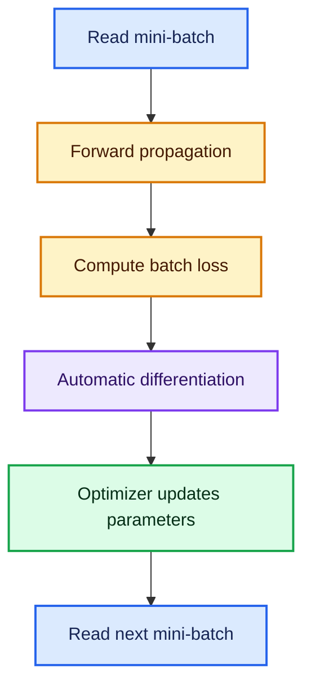

---

# 12. Model-diagnosis guide

## 12.1 If the model underfits

Symptoms:

- training loss remains high;
- training accuracy is low;
- training and validation scores are both poor.

Try:

1. train for more epochs;
2. increase network capacity;
3. improve features or data quality;
4. reduce excessive dropout or regularization;
5. check whether the learning rate is too small; and
6. verify that output activation and loss match the target.

## 12.2 If the model overfits

Symptoms:

- training loss keeps falling;
- validation loss reaches a minimum and rises;
- the training-validation performance gap widens.

Try:

1. early stopping;
2. more data or data augmentation;
3. L2 weight decay;
4. dropout;
5. a smaller model;
6. cross-validation for tabular data; and
7. checking for data leakage.

## 12.3 If training is unstable

Symptoms:

- loss oscillates strongly;
- loss suddenly explodes;
- values become `nan`;
- gradients are extremely large.

Try:

1. reduce the learning rate;
2. standardize numeric features;
3. inspect missing and infinite values;
4. use gradient clipping;
5. use suitable initialization;
6. reduce batch noise by increasing batch size; and
7. verify the loss is receiving valid values.

## 12.4 If learning is extremely slow

Check:

- saturated sigmoid or tanh hidden units;
- vanishing gradients;
- learning rate that is too small;
- unscaled inputs;
- too much regularization;
- inactive ReLU neurons; and
- a bottleneck in data loading rather than model computation.

---

# 13. Common mistakes and corrections

## Mistake 1: calling every sigmoid neuron a perceptron

A classic perceptron uses a hard step and the perceptron update rule. A sigmoid neuron is
differentiable and is normally trained with gradient-based backpropagation.

## Mistake 2: thinking backpropagation and gradient descent are the same

- Backpropagation computes gradients.
- Gradient descent or Adam uses those gradients to update parameters.

## Mistake 3: using only linear activations in hidden layers

Several linear layers collapse into one linear transformation. Hidden-layer nonlinearity is
essential.

## Mistake 4: pairing softmax with binary cross-entropy by default

Use one sigmoid with BCE for ordinary binary classification. Use softmax with categorical
cross-entropy for mutually exclusive multiclass classification.

## Mistake 5: using softmax for multilabel data

Softmax forces all outputs to sum to one. Use independent sigmoid outputs when several labels
can be true simultaneously.

## Mistake 6: interpreting high training accuracy as success

Training performance can reflect memorization. Validation or test performance estimates
generalization.

## Mistake 7: fitting preprocessing on all data

Fitting a scaler before the train-validation split leaks information. Fit it on training data
only and transform validation/test data with the stored training statistics.

## Mistake 8: assuming lower loss always means higher accuracy

Cross-entropy measures probability quality; accuracy measures thresholded classes. They can move
differently.

## Mistake 9: counting epochs as weight updates

With mini-batches, one epoch contains many updates:

$$
\left\lceil N/B\right\rceil
$$

## Mistake 10: treating neural networks as automatically superior

Always compare against a simple baseline. A logistic regression or boosted tree can be faster,
more interpretable, and stronger on some tabular problems.

---

# 14. Quick-reference sheets

## 14.1 One-neuron formula sheet

$$
z=\mathbf w^T\mathbf x+b
$$

$$
a=f(z)
$$

$$
\theta_{\text{new}}
=\theta_{\text{old}}
-\eta\frac{\partial L}{\partial\theta}
$$

## 14.2 Core derivatives

| Function | Derivative |
|---|---|
| $z$ | $1$ |
| $\sigma(z)$ | $\sigma(z)(1-\sigma(z$ |
| $\tanh(z)$ | $1-\tanh^2(z)$ |
| ReLU for $z<0$ | $0$ |
| ReLU for $z>0$ | $1$ |
| Leaky ReLU for $z<0$ | $\alpha$ |
| BCE + sigmoid logit | $\hat y-y$ |

## 14.3 Task setup sheet

| Problem | Final layer | Loss | Useful metrics |
|---|---|---|---|
| Regression | Linear | MSE, MAE, Huber | MAE, RMSE, $R^2$ |
| Binary | 1 sigmoid | BCE | Accuracy, precision, recall, F1, ROC-AUC |
| Multiclass | $K$ softmax | CCE or sparse CCE | Accuracy, macro F1, balanced accuracy |
| Multilabel | $K$ sigmoids | BCE | Per-label F1, micro/macro F1, PR-AUC |

## 14.4 Training vocabulary

| Term | Meaning |
|---|---|
| Forward pass | Compute predictions from inputs |
| Loss | Quantify prediction error |
| Backward pass | Compute gradients |
| Optimizer step | Update parameters |
| Batch | Examples used for one step |
| Epoch | One pass through all training examples |
| Learning rate | Base update size |
| Validation set | Held-out data used for model selection |

## 14.5 Practical default starting point

For a basic tabular binary-classification ANN:

- standardize numeric inputs;
- begin with 1-3 hidden layers;
- use ReLU or Swish in hidden layers;
- use one sigmoid output;
- use binary cross-entropy;
- use Adam with learning rate $10^{-3}$;
- try batch size 32, 64, or 128;
- monitor validation loss;
- use early stopping; and
- compare against logistic regression and a tree-based baseline.

These are starting points, not guarantees.

---

# 15. Fun facts and deeper intuition

## 15.1 The perceptron is older than the modern internet

Rosenblatt's perceptron dates to 1958. Neural networks are not a recent invention; modern
progress came from larger datasets, GPUs/accelerators, better optimization, improved
architectures, and scalable software.

## 15.2 Bias is like an intercept

The bias in a neuron plays the same geometric role as an intercept in linear regression. Without
it, the decision boundary is forced through the origin.

## 15.3 Depth means repeated representation learning

A hidden layer does not merely hold extra numbers. It creates a new coordinate system in which
the next layer may find the problem easier.

## 15.4 ReLU is simple but powerful

ReLU is only a piecewise-linear function. Yet stacking many ReLU layers creates a large number
of linear regions, allowing the overall network to represent highly complex nonlinear
functions.

## 15.5 Cross-entropy cares about confidence

Two models can have identical accuracy but different cross-entropy. The model that assigns
better probabilities receives lower loss.

## 15.6 Mini-batch noise can be useful

The goal is not always to obtain the most exact gradient at every step. Moderate mini-batch
noise can act as a form of regularization and help exploration of the loss landscape.

## 15.7 Automatic differentiation still uses the chain rule

Frameworks such as TensorFlow and PyTorch construct a computation graph and apply the same chain
rule derived in these notes. Automation removes bookkeeping; it does not replace the
mathematics.

---

# 16. Self-check questions

1. What is the difference between a weight and a bias?
2. Why can a single perceptron not solve XOR?
3. Why do several linear layers collapse into one linear transformation?
4. For $\mathbf x=[2,1,3]$, $\mathbf w=[0.5,0.2,0.1]$, and $b=0.1$, calculate $z$.
5. What is $\sigma(0)$?
6. Why is sigmoid suitable for a binary output but often unsuitable for deep hidden layers?
7. How does Leaky ReLU reduce the dying-ReLU problem?
8. What makes PReLU different from Leaky ReLU?
9. Which output activation and loss would you choose for three mutually exclusive classes
   stored as integer IDs?
10. Why is MSE more sensitive to outliers than MAE?
11. When is MSLE inappropriate?
12. What is the simplified output gradient for sigmoid plus BCE?
13. If $N=48{,}000$ and batch size is 64, how many updates occur per epoch?
14. What separate roles do backpropagation and Adam play?
15. What does it mean when training loss falls but validation loss rises?
16. Why can validation loss worsen while validation accuracy stays constant?
17. What causes vanishing gradients?
18. What two moving averages does Adam maintain?

<details>
<summary><strong>Answers</strong></summary>

1. A weight controls an input's influence; a bias shifts the weighted sum independently of the
   inputs.
2. XOR is not linearly separable, while one perceptron creates one linear boundary.
3. The product of linear transformations is another linear transformation.
4. $z=(2)(0.5)+(1)(0.2)+(3)(0.1)+0.1=1.6$.
5. $\sigma(0)=0.5$.
6. It produces a number in $(0,1)$, but its derivatives become tiny in saturated hidden
   units.
7. It keeps a small nonzero slope for negative inputs.
8. PReLU learns its negative slope; Leaky ReLU uses a fixed slope.
9. Three-unit softmax with sparse categorical cross-entropy.
10. Squared errors grow quadratically; absolute errors grow linearly.
11. When valid targets or predictions can be negative.
12. $\partial L/\partial z=\hat y-y$.
13. $48{,}000/64=750$ updates.
14. Backpropagation computes gradients; Adam turns them into adaptive parameter updates.
15. The model is probably overfitting.
16. Loss reacts to confidence even when thresholded class predictions do not change.
17. Repeated multiplication by small local derivatives or poorly scaled weights.
18. A moving average of gradients and a moving average of squared gradients.

</details>

---

## Final mental model

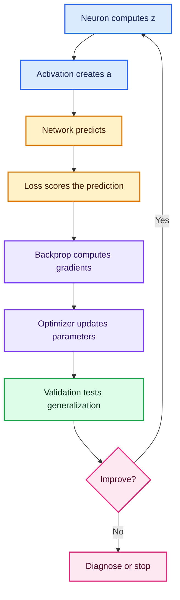

The shortest accurate description of neural-network training is:

> A neural network repeatedly transforms inputs into predictions, measures the prediction
> error, propagates responsibility backward through differentiable operations, and updates its
> parameters to reduce future error.

