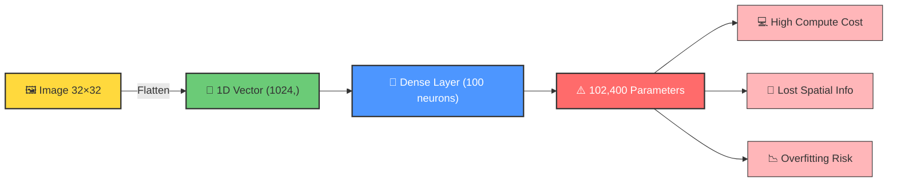
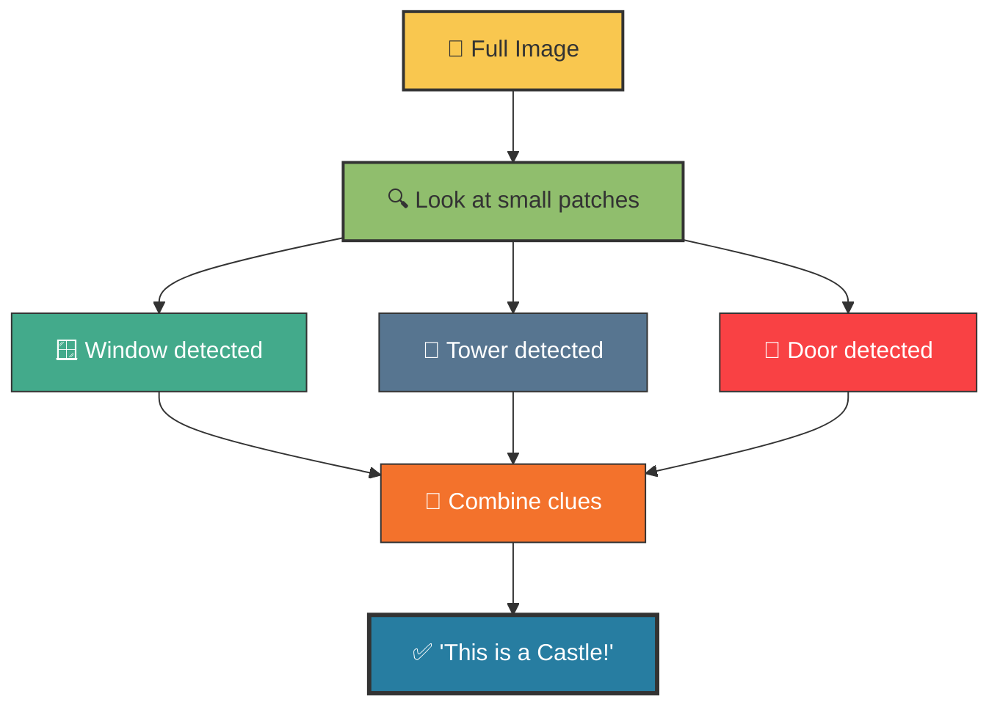
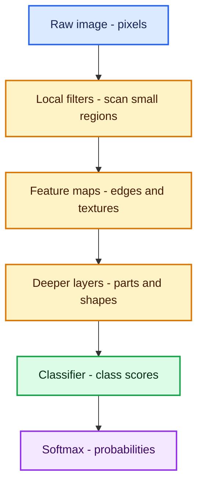
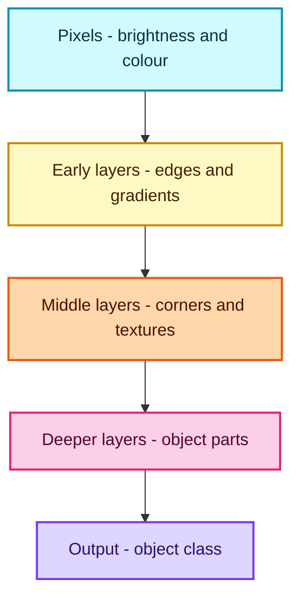
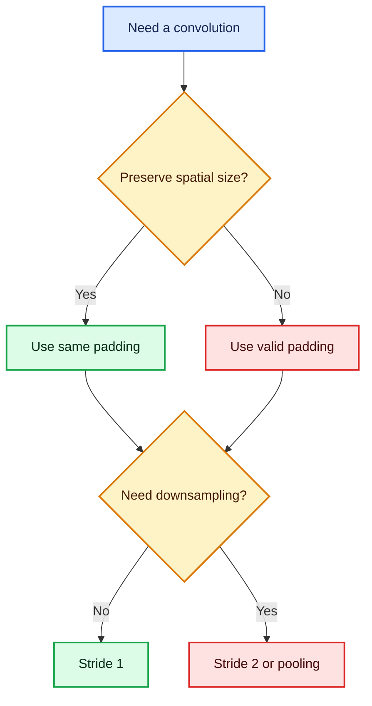
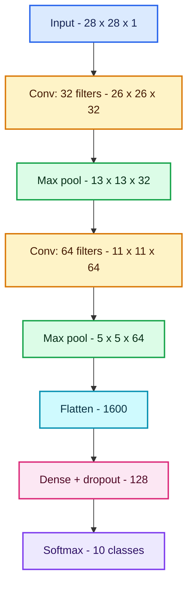
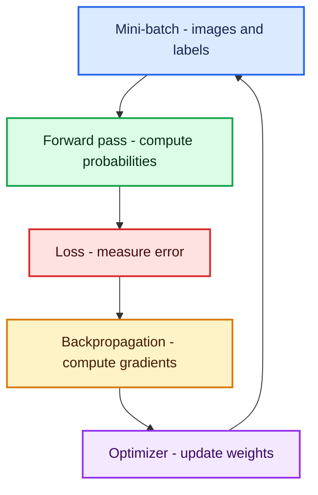
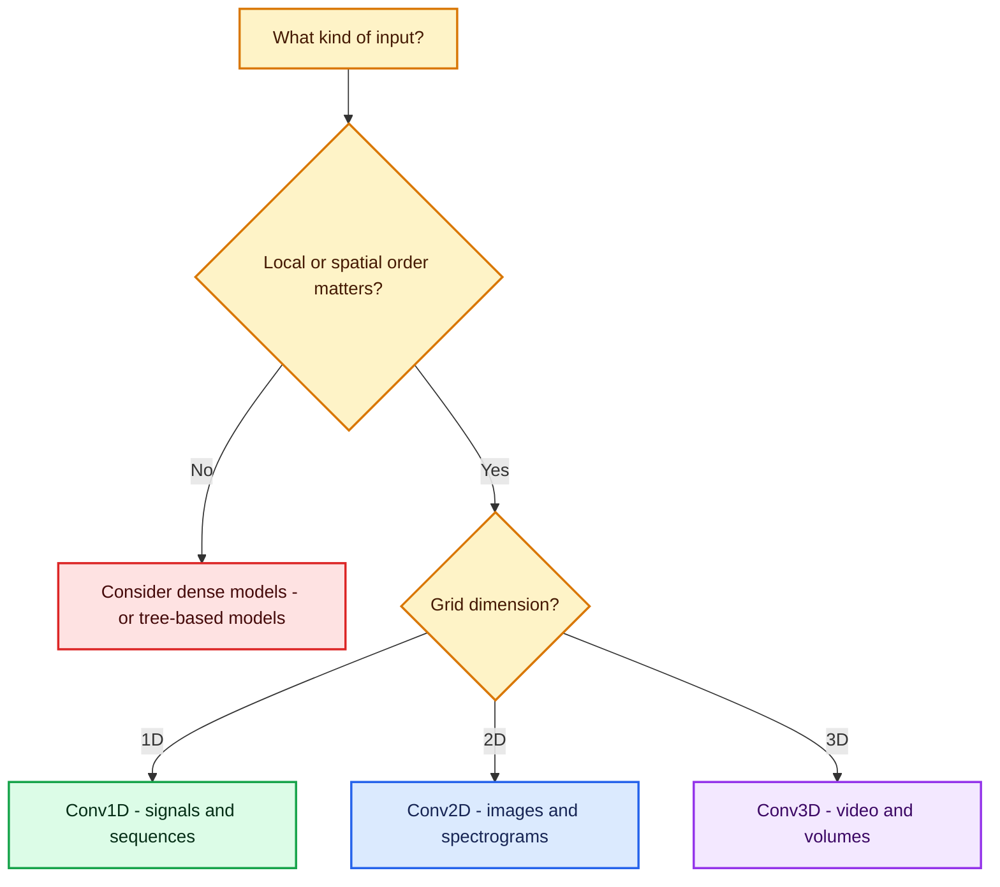

# Convolutional Neural Networks: From Pixels to Predictions

## Table of contents

1. [Learning objectives](#1-learning-objectives)
2. [The big picture](#2-the-big-picture)
3. [How a computer represents an image](#3-how-a-computer-represents-an-image)
4. [Why not use only a fully connected ANN for images?](#4-why-not-use-only-a-fully-connected-ann-for-images)
5. [CNN intuition: learn locally, understand globally](#5-cnn-intuition-learn-locally-understand-globally)
6. [Convolution: the central operation](#6-convolution-the-central-operation)
7. [Padding, stride, and output size](#7-padding-stride-and-output-size)
8. [Activation functions](#8-activation-functions)
9. [Pooling](#9-pooling)
10. [From feature maps to a prediction](#10-from-feature-maps-to-a-prediction)
11. [The supplied CNN architecture, layer by layer](#11-the-supplied-cnn-architecture-layer-by-layer)
12. [How a CNN learns](#12-how-a-cnn-learns)
13. [Perceptron vs ANN vs CNN](#13-perceptron-vs-ann-vs-cnn)
14. [Walkthrough of the supplied notebook](#14-walkthrough-of-the-supplied-notebook)
15. [Complete corrected and commented implementation](#15-complete-corrected-and-commented-implementation)
16. [Reading training curves and evaluation metrics](#16-reading-training-curves-and-evaluation-metrics)
17. [Common mistakes and fixes](#17-common-mistakes-and-fixes)
18. [Improvements and extensions](#18-improvements-and-extensions)
19. [When should you use a CNN?](#19-when-should-you-use-a-cnn)
20. [Fun facts](#20-fun-facts)
21. [Quick revision sheet](#21-quick-revision-sheet)
22. [Practice questions](#22-practice-questions)
23. [Glossary](#23-glossary)

---

## Why Not Just Use ANN for Images?

### 🤔 What
A plain **Artificial Neural Network (ANN)** takes a *flattened 1D vector* as input. To feed an image into an ANN, you must flatten a 2D image into a long 1D array.

### 🖼️ The Example (from notes)
A tiny `32 × 32` image (say, a pixel-art bird 🐦):

```
32 × 32 = 1024 inputs
```

If this feeds into a hidden layer of only **100 neurons**:

```
Total weights = 1024 × 100 = 102,400 parameters  (just for ONE hidden layer!)
```

### ❗ Why This Breaks Down — The 3 Big Problems

| # | Problem | Explanation |
|---|---------|-------------|
| 1️⃣ | **High computational power** | Millions of parameters even for small images → real-world images (e.g. 224×224×3) would need *billions* of weights. |
| 2️⃣ | **Spatial arrangement is missing** | Flattening destroys the 2D structure — a pixel's neighborhood (what's next to it, above it, below it) is lost. A cat's eye next to its ear matters; ANN doesn't "know" that. |
| 3️⃣ | **Overfitting** | Too many parameters relative to training data → the model memorizes instead of generalizing. |



> 💡 **This is exactly why CNNs exist** — to preserve spatial structure and drastically cut down parameters using *shared weights* (filters).


## 2. The big picture

A **Convolutional Neural Network**, or **CNN**, is a neural network designed to learn patterns that have a spatial arrangement. It is especially effective for images, but the same idea can be applied to audio, time series, video, medical scans, and other grid-like data.

### 🧩 The LEGO Castle Analogy 
If someone asks *"What's in this picture?"* of a LEGO castle, you don't process every LEGO piece simultaneously. Instead:

1. You look at **small patches** — a window here, a tower there, a door somewhere else.
2. You **mentally assemble** these clues: *"Oh, I see windows!" → "That looks like a tower!"*
3. You **conclude**: *"Yes, this is a castle!"*

That is **exactly** how a CNN works — it doesn't look at the whole image at once. It scans small patches, extracts local features, and progressively builds up a full understanding.



### 🎯 Why This Matters
This "patch-by-patch" approach gives CNNs two superpowers over ANNs:
- **Parameter sharing** — the same small filter (e.g. 3×3) slides across the *whole* image, so we don't need a unique weight per pixel.
- **Local connectivity** — a neuron only looks at a small neighborhood, preserving spatial relationships.


### What?

A CNN learns small filters that scan local regions of an input. Different filters learn to respond to different visual patterns such as:

- vertical or horizontal edges;
- corners and curves;
- textures;
- object parts;
- complete objects.

### Why?

Pixels next to each other are usually related. A CNN preserves this local relationship, shares the same filter across the image, and therefore uses far fewer parameters than a dense network of similar capacity.

### How?

A typical image-classification CNN repeatedly applies:

1. **convolution** to extract features;
2. **non-linearity**, usually ReLU, to model complex patterns;
3. **pooling** or strided convolution to reduce spatial size;
4. **classification layers** to turn the learned features into class probabilities.

### When?

Use a CNN when the location and local arrangement of values matter. Common examples include:

- handwritten digit recognition;
- object, face, and defect detection;
- medical-image classification;
- satellite-image analysis;
- document and OCR systems;
- audio spectrogram classification;
- one-dimensional sensor or time-series pattern recognition.



---

## 3. How a computer represents an image

### 3.1 A grayscale image

A grayscale image is a two-dimensional matrix:

$$
X \in \mathbb{R}^{H \times W}
$$

where:

- $H$ is the height;
- $W$ is the width;
- each entry is a pixel intensity.

For an 8-bit image, a pixel normally lies in:

$$
x_{i,j} \in \{0,1,\ldots,255\}
$$

Here, $0$ is black, $255$ is white, and the values between them are shades of gray.

The MNIST images in the supplied notebook are $28 \times 28$ grayscale images. Each image therefore contains:

$$
28 \times 28 = 784 \text{ pixel values}
$$

### 3.2 An RGB image

An RGB image has three channels:

$$
X \in \mathbb{R}^{H \times W \times 3}
$$

The channels hold red, green, and blue intensities. A $32 \times 32$ RGB image has:

$$
32 \times 32 \times 3 = 3{,}072
$$

input values.

> **Important:** Channels are not separate training examples. They are different measurements at the same spatial position.

### 3.3 Batch shape

Deep-learning libraries train on batches. TensorFlow/Keras normally uses the **channels-last** format:

$$
(N,H,W,C)
$$

For 60,000 MNIST images:

$$
(60{,}000,28,28,1)
$$

where $N$ is the number of images and $C=1$ because MNIST is grayscale.

### 3.4 Normalization

The notebook divides every pixel by 255:

$$
x'=\frac{x}{255}
$$

This transforms the range from $[0,255]$ to $[0,1]$.

Why normalize?

- gradients become better behaved;
- optimization usually becomes faster and more stable;
- one feature cannot dominate merely because its numeric scale is larger;
- neural-network initializations and learning rates are usually designed for small input magnitudes.

```python
# Convert integers to float32 so division retains decimal values.
# Scale every pixel from [0, 255] to [0, 1].
X_train = X_train.astype("float32") / 255.0
X_test = X_test.astype("float32") / 255.0
```

---

## 4. Why not use only a fully connected ANN for images?

An ANN **can** process an image. The problem is not impossibility; it is that a standard dense network does not naturally exploit image structure.

### 4.1 Too many parameters

Suppose a $32 \times 32$ grayscale image is flattened and connected to 100 hidden neurons.

The image has:

$$
32 \times 32 = 1{,}024
$$

inputs. The dense layer needs:

$$
(1{,}024 \times 100)+100=102{,}500
$$

parameters, including one bias per hidden unit.

For a $224 \times 224$ RGB image connected to 1,000 hidden units:

$$
(224 \times 224 \times 3)\times1{,}000+1{,}000
=150{,}529{,}000
1{,}000
$$

That is more than 150 million parameters in just the first dense layer.

### 4.2 Flattening discards explicit spatial arrangement

Consider two nearby pixels in an image. After flattening, the network receives a one-dimensional vector and must learn from data that certain positions are neighbors.

A CNN builds this assumption directly into its architecture:

- nearby pixels interact first;
- the same detector is reused at every location;
- deeper layers gradually combine nearby patterns into larger ones.

This design choice is called an **inductive bias**: the architecture assumes that local patterns and translation matter.

### 4.3 Higher risk of overfitting

Many independently connected weights give a dense network more freedom to memorize training examples. A CNN reduces this risk through:

- **local connectivity**: a neuron sees only a small local region;
- **parameter sharing**: one kernel is used across the whole image;
- **pooling/downsampling**: later layers operate on smaller representations.

### Dense layer versus convolutional layer

| Property | Dense layer | Convolutional layer |
|---|---|---|
| Connectivity | Every input to every neuron | Local receptive field |
| Spatial structure | Lost after flattening | Preserved |
| Parameter sharing | No | Yes |
| Position behavior | Learns locations separately | Reuses a detector everywhere |
| Typical role | Final reasoning/classification | Feature extraction |

---

## 5. CNN intuition: learn locally, understand globally

The supplied notes use a helpful castle/LEGO analogy. A person does not inspect every piece at once. They notice windows, doors, walls, and towers, then combine those clues into the concept of a castle.

A CNN behaves similarly:

- **early layers** detect edges and simple color changes;
- **middle layers** combine them into curves, corners, textures, and parts;
- **deep layers** combine parts into class-specific object representations.



### Three ideas make this possible

1. **Sparse interaction**  
   A feature-map value depends on only a small patch of the previous layer.

2. **Parameter sharing**  
   The same kernel weights scan all spatial positions.

3. **Hierarchical composition**  
   Deeper layers combine simple features into increasingly complex features.

---

## 6. Convolution: the central operation

### 6.1 What is a kernel?

A **kernel** is a small matrix of learnable weights, commonly $3 \times 3$ or $5 \times 5$. It slides across an image. At each position:

1. place the kernel over a local patch;
2. multiply corresponding values;
3. add the products;
4. add a bias;
5. usually apply an activation function.

The collection of outputs is called a **feature map**.

The words **kernel** and **filter** are often used interchangeably. More precisely, in a multi-channel input, one output filter contains one kernel slice per input channel.

### 6.2 The convolution equation

For a single-channel input $X$ and kernel $K$, a CNN computes:

$$
Z_{i,j}
=
\sum_{u=0}^{K_h-1}
\sum_{v=0}^{K_w-1}
X_{iS_h+u-P_h,\;jS_w+v-P_w}
K_{u,v}
+b
$$

The activated output is:

$$
A_{i,j}=g(Z_{i,j})
$$

where:

- $K_h,K_w$ are kernel height and width;
- $S_h,S_w$ are vertical and horizontal stride;
- $P_h,P_w$ are padding;
- $b$ is a bias;
- $g$ is an activation function such as ReLU.

### 6.3 A worked vertical-edge example

The supplied PDF shows a $6 \times 6$ image with a sharp change from black to white:

$$
X=
\begin{bmatrix}
0&0&0&255&255&255\\
0&0&0&255&255&255\\
0&0&0&255&255&255\\
0&0&0&255&255&255\\
0&0&0&255&255&255\\
0&0&0&255&255&255
\end{bmatrix}
$$

Use the vertical-edge kernel:

$$
K=
\begin{bmatrix}
-1&0&1\\
-1&0&1\\
-1&0&1
\end{bmatrix}
$$

For the first patch, every value is 0:

$$
\sum X_{\text{patch}}\odot K=0
$$

For a patch crossing the boundary:

$$
\begin{aligned}
\text{response}
&=(-1\cdot0+0\cdot0+1\cdot255)\\
&\quad+(-1\cdot0+0\cdot0+1\cdot255)\\
&\quad+(-1\cdot0+0\cdot0+1\cdot255)\\
&=765
\end{aligned}
$$

With stride 1 and no padding, the $6 \times 6$ input and $3 \times 3$ kernel produce:

$$
\begin{bmatrix}
0&765&765&0\\
0&765&765&0\\
0&765&765&0\\
0&765&765&0
\end{bmatrix}
$$

The large values mark the vertical intensity transition. That is why a filter behaves like a pattern detector.

> The absolute response depends on the exact kernel and its orientation. Reversing the signs reverses the sign of the detected edge.

### 6.4 Cross-correlation versus mathematical convolution

In strict signal processing, convolution flips the kernel before sliding it. Most deep-learning libraries do **not** flip the kernel; they calculate **cross-correlation**.

Why is it still called convolution? Because the kernel is learned. If a flipped pattern is useful, training can learn that flipped pattern directly.

### 6.5 Multi-channel convolution

For an input with $C_{\text{in}}$ channels:

$$
Z_{i,j,f}
=
\sum_{c=1}^{C_{\text{in}}}
\sum_{u=0}^{K_h-1}
\sum_{v=0}^{K_w-1}
X_{i+u,j+v,c}
W_{u,v,c,f}
+b_f
$$

One output filter spans **all input channels**. Therefore:

- a $6 \times 6 \times 3$ RGB input;
- a $3 \times 3 \times 3$ filter;
- stride 1, no padding;

produces one $4 \times 4$ feature map.

Using 32 different filters produces:

$$
4 \times 4 \times 32
$$

Each filter can learn a different pattern.

### 6.6 Number of convolution parameters

For:

- kernel size $K_h \times K_w$;
- $C_{\text{in}}$ input channels;
- $C_{\text{out}}$ filters;
- one bias per filter;

the trainable-parameter count is:

$$
\boxed{
(K_hK_wC_{\text{in}}+1)C_{\text{out}}
}
$$

Notice that image height and width are absent from this formula. The same weights are reused at every position.

Example: 32 filters of size $3 \times 3$ on a grayscale image:

$$
(3\cdot3\cdot1+1)\cdot32=320
$$

Only 320 parameters are needed, even though the filters are applied hundreds of times.

---

## 7. Padding, stride, and output size

### 7.1 General output formula

For one spatial dimension:

$$
\boxed{
N_{\text{out}}
=
\left\lfloor
\frac{N_{\text{in}}+2P-D(K-1)-1}{S}
\right\rfloor
+1
}
$$

where:

- $N_{\text{in}}$ = input size;
- $K$ = kernel size;
- $P$ = padding on each side;
- $S$ = stride;
- $D$ = dilation;
- $\lfloor\cdot\rfloor$ = floor operation.

For the common case $D=1$:

$$
\boxed{
N_{\text{out}}
=
\left\lfloor
\frac{N_{\text{in}}+2P-K}{S}
\right\rfloor
+1
}
$$

Apply the formula separately to height and width.

### 7.2 Valid padding

`padding="valid"` means no zero padding:

$$
P=0
$$

For a $7 \times 7$ input, $3 \times 3$ kernel, and stride 1:

$$
\frac{7-3}{1}+1=5
$$

so the output is $5 \times 5$.

This is the default used in the supplied notebook.

### 7.3 Same padding

For an odd kernel, stride 1, and dilation 1, padding:

$$
P=\frac{K-1}{2}
$$

preserves spatial size.

For a $3 \times 3$ kernel:

$$
P=1
$$

Thus:

$$
28 \times 28 \longrightarrow 28 \times 28
$$

Benefits of padding:

- prevents rapid spatial shrinkage;
- allows border pixels to influence more output positions;
- supports deeper networks.

Padding does not create new information. It controls how boundaries are handled.

### 7.4 Stride

Stride is the number of positions the kernel moves at a time.

- $S=1$: inspect every neighboring position;
- $S=2$: skip every other position and downsample;
- larger stride: smaller output and less computation, but more lost detail.

Example: $5 \times 5$ input, $3 \times 3$ kernel, $P=0$, $S=2$:

$$
\left\lfloor\frac{5-3}{2}\right\rfloor+1=2
$$

The output is $2 \times 2$.

### 7.5 A decision guide



---

## 8. Activation functions

Without an activation function, stacked convolutional layers would still be equivalent to one linear transformation. A non-linearity allows the model to learn complex decision boundaries.

### 8.1 ReLU

The supplied CNN uses the **Rectified Linear Unit**:

$$
\operatorname{ReLU}(z)=\max(0,z)
$$

Its derivative is:

$$
\operatorname{ReLU}'(z)=
\begin{cases}
1,&z>0\\
0,&z<0
\end{cases}
$$

Why ReLU is popular:

- it is computationally simple;
- it helps gradients flow for positive activations;
- it creates sparse activations because negative values become zero.

A drawback is the **dying ReLU** problem: a unit that stays in the negative region has zero gradient. Leaky ReLU and GELU are possible alternatives.

```python
Conv2D(
    filters=32,           # Learn 32 different feature detectors.
    kernel_size=(3, 3),   # Each detector examines a 3x3 local patch.
    activation="relu"     # Set negative pre-activations to zero.
)
```

---

## 9. Pooling

Pooling summarizes a small neighborhood of each feature map. It has no trainable weights.

### 9.1 Why pool?

- reduce height and width;
- lower computation and memory use;
- enlarge the effective receptive field of later units;
- retain dominant information;
- provide limited robustness to small shifts.

Pooling gives **approximate local translation invariance**, not complete position invariance. A large movement, rotation, or scale change can still alter the prediction.

### 9.2 Max pooling

Max pooling retains the largest activation:

$$
y_{i,j,c}
=
\max_{(u,v)\in\mathcal{R}_{i,j}}
x_{u,v,c}
$$

Use it when a strong activation means “this feature is present somewhere in this region.” It is the most common pooling method in classic CNNs.

Using the matrix from the supplied notes:

$$
X=
\begin{bmatrix}
7&3&5&2\\
8&7&1&6\\
4&9&3&9\\
0&8&4&5
\end{bmatrix}
$$

A $2 \times 2$ max pool with stride 2 produces:

$$
\begin{bmatrix}
\max(7,3,8,7)&\max(5,2,1,6)\\
\max(4,9,0,8)&\max(3,9,4,5)
\end{bmatrix}
=
\begin{bmatrix}
8&6\\
9&9
\end{bmatrix}
$$

### 9.3 Average pooling

Average pooling retains the mean:

$$
y_{i,j,c}
=
\frac{1}{|\mathcal{R}_{i,j}|}
\sum_{(u,v)\in\mathcal{R}_{i,j}}x_{u,v,c}
$$

For the same input:

$$
\begin{bmatrix}
6.25&3.50\\
5.25&5.25
\end{bmatrix}
$$

It produces smoother summaries and preserves general activation strength.

### 9.4 Min pooling

Min pooling retains the minimum:

$$
\begin{bmatrix}
3&1\\
0&3
\end{bmatrix}
$$

It can emphasize dark features, but it is rare in modern general-purpose CNNs.

### 9.5 Global average pooling

Global average pooling averages each complete feature map:

$$
y_c=\frac{1}{HW}\sum_{i=1}^{H}\sum_{j=1}^{W}x_{i,j,c}
$$

An $H \times W \times C$ tensor becomes a vector of length $C$. It often replaces a large `Flatten` + `Dense` block and greatly reduces parameters.

| Pooling method | Keeps | Common use |
|---|---|---|
| Max pooling | Strongest activation | Dominant edges, textures, or parts |
| Average pooling | Mean activation | Smooth summaries |
| Min pooling | Smallest activation | Rare, dark-feature/anomaly emphasis |
| Global average pooling | One mean per channel | Compact modern classifier head |

---

## 10. From feature maps to a prediction

### 10.1 Flatten

`Flatten()` converts a spatial tensor into a one-dimensional feature vector.

For the supplied network:

$$
5 \times 5 \times 64=1{,}600
$$

so:

$$
(5,5,64)\longrightarrow(1{,}600)
$$

Flattening does not learn anything; it only changes shape.

### 10.2 Dense layer

A dense layer computes:

$$
\mathbf{z}=W\mathbf{x}+\mathbf{b}
$$

followed by an activation:

$$
\mathbf{a}=g(\mathbf{z})
$$

The supplied CNN uses 128 ReLU units before the output layer.

### 10.3 Dropout

The notebook applies `Dropout(0.5)`. During training, each activation is independently dropped with probability $p=0.5$:

$$
\tilde{h}_i=
\frac{m_i h_i}{1-p},
\qquad
m_i\sim\operatorname{Bernoulli}(1-p)
$$

The scale factor keeps the expected activation unchanged:

$$
\mathbb{E}[\tilde h_i]=h_i
$$

Why dropout helps:

- discourages units from relying too heavily on one another;
- behaves roughly like training many thinned subnetworks;
- can reduce overfitting.

Dropout is active during training and automatically disabled during validation and inference.

### 10.4 Softmax

The final layer has 10 units, one for each digit. Softmax converts logits into probabilities:

$$
p_k=
\frac{e^{z_k}}
{\sum_{j=1}^{10}e^{z_j}}
$$

Properties:

$$
0\le p_k\le1,
\qquad
\sum_{k=1}^{10}p_k=1
$$

The predicted class is:

$$
\hat y=\arg\max_k p_k
$$

### 10.5 Categorical cross-entropy

Because the supplied notebook one-hot encodes labels, it uses categorical cross-entropy:

$$
\mathcal{L}
=
-\frac{1}{N}
\sum_{i=1}^{N}
\sum_{k=1}^{K}
y_{i,k}\log p_{i,k}
$$

For a one-hot target, only the correct class remains:

$$
\mathcal{L}_i=-\log p_{i,\text{correct}}
$$

If the model gives the correct class probability 0.9:

$$
-\log(0.9)\approx0.105
$$

If it gives the correct class probability 0.01:

$$
-\log(0.01)\approx4.605
$$

Cross-entropy strongly penalizes confident incorrect predictions.

---

## 11. The supplied CNN architecture, layer by layer

The notebook defines:

```python
cnn = Sequential([
    Conv2D(32, kernel_size=(3, 3), activation="relu",
           input_shape=(28, 28, 1)),
    MaxPooling2D(pool_size=(2, 2)),
    Conv2D(64, kernel_size=(3, 3), activation="relu"),
    MaxPooling2D(pool_size=(2, 2)),
    Flatten(),
    Dense(128, activation="relu"),
    Dropout(0.5),
    Dense(10, activation="softmax")
])
```

Because no padding or stride is specified:

- each convolution uses `padding="valid"` and stride 1;
- each max-pooling layer uses stride 2 by default.

### 11.1 Shape and parameter calculation

| Layer | Calculation | Output shape | Trainable parameters |
|---|---:|---:|---:|
| Input | MNIST grayscale image | $28\times28\times1$ | 0 |
| Conv2D, 32 filters | $28-3+1$ | $26\times26\times32$ | $(3\cdot3\cdot1+1)\cdot32=320$ |
| MaxPool $2\times2$ | $\lfloor(26-2)/2\rfloor+1$ | $13\times13\times32$ | 0 |
| Conv2D, 64 filters | $13-3+1$ | $11\times11\times64$ | $(3\cdot3\cdot32+1)\cdot64=18{,}496$ |
| MaxPool $2\times2$ | $\lfloor(11-2)/2\rfloor+1$ | $5\times5\times64$ | 0 |
| Flatten | $5\cdot5\cdot64$ | $1{,}600$ | 0 |
| Dense, 128 | $1{,}600\rightarrow128$ | 128 | $(1{,}600+1)\cdot128=204{,}928$ |
| Dropout, 0.5 | Shape unchanged | 128 | 0 |
| Dense, 10 | $128\rightarrow10$ | 10 | $(128+1)\cdot10=1{,}290$ |
| **Total** |  |  | **225,034** |

The dense 128-unit layer contains about:

$$
\frac{204{,}928}{225{,}034}\times100\%\approx91.1\%
$$

of all trainable parameters. This is one reason global average pooling is attractive in larger CNNs.



### 11.2 Effective receptive field

The **receptive field** is the region of the original input that can affect one later activation.

For layer $l$:

$$
j_l=j_{l-1}s_l
$$

$$
r_l=r_{l-1}+(k_l-1)j_{l-1}
$$

where:

- $j_l$ is the spacing, or jump, between neighboring receptive fields;
- $r_l$ is receptive-field size;
- $k_l$ is kernel size;
- $s_l$ is stride.

Starting with $r_0=1$ and $j_0=1$:

| Operation | Kernel/stride | Receptive field |
|---|---:|---:|
| Conv1 | $3/1$ | 3 |
| Pool1 | $2/2$ | 4 |
| Conv2 | $3/1$ | 8 |
| Pool2 | $2/2$ | 10 |

One value after the second pooling layer summarizes a $10 \times 10$ region of the original image.

---

## 12. How a CNN learns

The edge kernels shown in textbooks are useful for intuition, but the filters in a trained CNN are normally **not manually supplied**. They are initialized, then learned from labeled examples.

### 12.1 The training loop



1. **Forward pass**  
   Images move through convolution, ReLU, pooling, and dense layers.

2. **Loss calculation**  
   Cross-entropy measures disagreement between predicted probabilities and labels.

3. **Backpropagation**  
   The chain rule calculates how each parameter affected the loss:

   $$
   \frac{\partial\mathcal{L}}{\partial w}
   $$

4. **Optimization**  
   Parameters move in a loss-reducing direction.

### 12.2 Gradient descent

The basic update is:

$$
w_{t+1}
=
w_t-\eta
\frac{\partial\mathcal{L}}{\partial w_t}
$$

where $\eta$ is the learning rate.

### 12.3 Adam

The notebook uses Adam, which maintains moving estimates of the gradient's first and second moments:

$$
m_t=\beta_1m_{t-1}+(1-\beta_1)g_t
$$

$$
v_t=\beta_2v_{t-1}+(1-\beta_2)g_t^2
$$

After bias correction:

$$
\hat m_t=\frac{m_t}{1-\beta_1^t},
\qquad
\hat v_t=\frac{v_t}{1-\beta_2^t}
$$

the update is:

$$
w_{t+1}
=
w_t-\eta
\frac{\hat m_t}{\sqrt{\hat v_t}+\epsilon}
$$

Adam adapts the update magnitude per parameter and is a strong default for many CNN tasks.

### 12.4 Epoch, batch, and step

- **Sample:** one image-label pair.
- **Batch:** a small group processed together.
- **Step:** one parameter update from one batch.
- **Epoch:** one pass through the training set.

With 60,000 training images and batch size 32:

$$
\left\lceil\frac{60{,}000}{32}\right\rceil=1{,}875
$$

training steps per epoch, which matches the notebook log.

---

## 13. Perceptron vs ANN vs CNN

The notebook compares three models.

### 13.1 Linear softmax classifier

The object is named `perceptron`, but its actual architecture is:

```python
Flatten(input_shape=(28, 28)),
Dense(10, activation="softmax")
```

This is better described as a **multiclass linear softmax classifier**. It has no hidden layer.

Its parameter count is:

$$
(784+1)\cdot10=7{,}850
$$

> The imported `sklearn.linear_model.Perceptron` is never used.

### 13.2 Fully connected ANN

The ANN uses:

$$
784\rightarrow128\rightarrow64\rightarrow10
$$

Its parameters are:

$$
(784+1)\cdot128=100{,}480
$$

$$
(128+1)\cdot64=8{,}256
$$

$$
(64+1)\cdot10=650
$$

Total:

$$
109{,}386
$$

### 13.3 CNN

The CNN preserves two-dimensional structure and learns local feature detectors before classification. Its parameter count is 225,034.

### 13.4 Reported notebook results

| Model | Reported test accuracy | Interpretation |
|---|---:|---|
| Linear softmax classifier | 88.08% | Linear pixel-to-class boundary |
| ANN | 95.97% | Non-linear global pixel combinations |
| CNN | 98.76% | Local, shared, hierarchical image features |

The CNN improved on the ANN by:

$$
98.76-95.97=2.79
$$

percentage points.

It reduced the error rate from:

$$
100-95.97=4.03\%
$$

to:

$$
100-98.76=1.24\%
$$

The relative error reduction is therefore:

$$
\frac{4.03-1.24}{4.03}\times100\%
\approx69.2\%
$$

This is a better view of the improvement than accuracy alone.

### 13.5 Fairness caveat

The notebook passes the official test set as `validation_data` during every epoch and evaluates on that same set afterward. That means training decisions can indirectly be influenced by test performance.

The reported values are useful for illustrating model differences, but a stricter experiment should:

1. split the original training data into training and validation subsets;
2. use validation data for model selection and early stopping;
3. evaluate the official test set exactly once at the end.

---

## 14. Walkthrough of the supplied notebook

### 14.1 Imports

The notebook imports NumPy, pandas, plotting tools, scikit-learn metrics, and Keras layers.

Several imports are unnecessary for the executed workflow:

- `LabelEncoder`;
- `StandardScaler`;
- `train_test_split` in the original version;
- scikit-learn `Perceptron`;
- `accuracy_score`;
- `classification_report`.

Unused imports do not change results, but removing them makes the workflow clearer.

### 14.2 Loading data

```python
df = pd.read_csv("mnist_train.csv")
df_test = pd.read_csv("mnist_test.csv")
```

The training DataFrame has:

- 60,000 rows;
- 785 columns;
- one `label` column;
- 784 pixel columns named by position.

The notebook verifies:

- the first rows;
- shape and column names;
- integer dtypes;
- no missing values.

### 14.3 Separating inputs and labels

```python
X_train = df.drop("label", axis=1).values
y_train = df["label"].values
```

- `X_train` contains pixels;
- `y_train` contains digits 0 through 9.

### 14.4 Reshaping

For the linear model and ANN:

```python
X_train_img = X_train.reshape(-1, 28, 28)
```

`Flatten` inside the model converts each image to 784 values.

For the CNN:

```python
X_train_cnn = X_train.reshape(-1, 28, 28, 1)
```

The final dimension explicitly identifies the grayscale channel.

### 14.5 One-hot encoding

```python
y_train_cat = to_categorical(y_train, 10)
```

For digit 4:

$$
4
\longrightarrow
[0,0,0,0,1,0,0,0,0,0]
$$

This representation matches `categorical_crossentropy`.

### 14.6 Compiling

```python
cnn.compile(
    optimizer="adam",
    loss="categorical_crossentropy",
    metrics=["accuracy"]
)
```

Compilation chooses:

- how parameters are updated;
- what objective is minimized;
- what metrics are reported.

### 14.7 Fitting

```python
history_cnn = cnn.fit(
    X_train_cnn,
    y_train_cat,
    epochs=5,
    batch_size=32,
    validation_data=(X_test_cnn, y_test_cat),
    verbose=1
)
```

The returned `History` object stores:

- `accuracy`;
- `val_accuracy`;
- `loss`;
- `val_loss`.

### 14.8 Plotting histories

The helper plots training and validation accuracy on one panel and loss on another. This is useful for diagnosing:

- underfitting;
- overfitting;
- unstable learning;
- whether more epochs might help.

### 14.9 Confusion matrix

```python
cm = confusion_matrix(y_test, y_pred_cnn)
```

The entry:

$$
C_{i,j}
$$

counts examples whose true class is $i$ but predicted class is $j$.

- diagonal cells = correct predictions;
- off-diagonal cells = mistakes;
- a large pair of opposite off-diagonal cells shows two classes that are often confused.

### 14.10 Important notebook integrity observation

The saved linear-classifier training output reports cross-entropy losses in the hundreds, even though the visible preprocessing scales inputs and softmax cross-entropy normally has a much smaller range in this setup.

The most likely explanation is **stale or out-of-order notebook output**: Jupyter stores cell outputs independently of the current visible execution order.

Best practice before reporting an experiment:

1. restart the kernel/runtime;
2. run all cells from top to bottom;
3. verify the preprocessing range;
4. save the freshly executed notebook.

Useful checks:

```python
print(X_train.min(), X_train.max())  # Expected: 0.0 1.0
print(np.isfinite(X_train).all())    # Expected: True
```

---

## 15. Complete corrected and commented implementation

The following version preserves the three-model comparison while improving experimental discipline:

- deterministic seeds;
- explicit validation split from the training set;
- official test data untouched until final evaluation;
- input and label validation;
- reusable model builders;
- early stopping;
- batched predictions;
- classification report and confusion matrix.

> Expected file format: both CSV files contain a `label` column and 784 pixel columns.

### 15.1 Imports and reproducibility

```python
# Numerical and tabular operations
import random
from pathlib import Path

import numpy as np
import pandas as pd

# Visualisation
import matplotlib.pyplot as plt
import seaborn as sns

# Data splitting and evaluation
from sklearn.model_selection import train_test_split
from sklearn.metrics import (
    accuracy_score,
    classification_report,
    confusion_matrix,
)

# TensorFlow / Keras
import tensorflow as tf
from tensorflow.keras import Sequential
from tensorflow.keras.callbacks import EarlyStopping, ReduceLROnPlateau
from tensorflow.keras.layers import (
    Input,
    Flatten,
    Dense,
    Conv2D,
    MaxPooling2D,
    Dropout,
)
from tensorflow.keras.utils import to_categorical


# Use one seed everywhere so that the split, initialization, and sampling
# are as reproducible as the execution environment allows.
SEED = 42
random.seed(SEED)
np.random.seed(SEED)
tf.random.set_seed(SEED)

# Update these paths if the CSV files are stored elsewhere.
TRAIN_PATH = Path("mnist_train.csv")
TEST_PATH = Path("mnist_test.csv")

NUM_CLASSES = 10
IMAGE_HEIGHT = 28
IMAGE_WIDTH = 28
CHANNELS = 1
```

### 15.2 Load and validate data

```python
# Fail early with a clear message if a file is missing.
if not TRAIN_PATH.exists():
    raise FileNotFoundError(f"Training file not found: {TRAIN_PATH.resolve()}")

if not TEST_PATH.exists():
    raise FileNotFoundError(f"Test file not found: {TEST_PATH.resolve()}")

# Read the CSV files into DataFrames.
train_df = pd.read_csv(TRAIN_PATH)
test_df = pd.read_csv(TEST_PATH)

# Both files must contain labels for this comparison/evaluation workflow.
required_column = "label"
for name, frame in {"train": train_df, "test": test_df}.items():
    if required_column not in frame.columns:
        raise ValueError(f"{name} data has no '{required_column}' column.")

    # MNIST should contain 1 label + 784 pixel columns.
    if frame.shape[1] != 785:
        raise ValueError(
            f"{name} data has {frame.shape[1]} columns; expected 785."
        )

    if frame.isna().any().any():
        raise ValueError(f"{name} data contains missing values.")

print("Training shape:", train_df.shape)
print("Test shape:", test_df.shape)
print("\nClass counts:\n", train_df["label"].value_counts().sort_index())
```

### 15.3 Prepare images and labels

```python
# Separate training pixels and integer labels.
X_full = train_df.drop(columns="label").to_numpy(dtype=np.float32)
y_full = train_df["label"].to_numpy(dtype=np.int64)

# Keep the official test data separate until final model evaluation.
X_test = test_df.drop(columns="label").to_numpy(dtype=np.float32)
y_test = test_df["label"].to_numpy(dtype=np.int64)

# Pixel intensities should be within the standard 8-bit range.
if X_full.min() < 0 or X_full.max() > 255:
    raise ValueError("Training pixels are outside the expected [0, 255] range.")

if X_test.min() < 0 or X_test.max() > 255:
    raise ValueError("Test pixels are outside the expected [0, 255] range.")

# Normalize pixels to [0, 1].
X_full /= 255.0
X_test /= 255.0

# Convert flat 784-value rows to image tensors in channels-last format.
X_full = X_full.reshape(-1, IMAGE_HEIGHT, IMAGE_WIDTH, CHANNELS)
X_test = X_test.reshape(-1, IMAGE_HEIGHT, IMAGE_WIDTH, CHANNELS)

# Create a validation set from the original training data.
# Stratification approximately preserves the digit proportions.
X_train, X_val, y_train, y_val = train_test_split(
    X_full,
    y_full,
    test_size=0.10,
    random_state=SEED,
    stratify=y_full,
)

# One-hot encoding matches categorical_crossentropy.
y_train_cat = to_categorical(y_train, NUM_CLASSES)
y_val_cat = to_categorical(y_val, NUM_CLASSES)
y_test_cat = to_categorical(y_test, NUM_CLASSES)

print("Train:", X_train.shape, y_train_cat.shape)
print("Validation:", X_val.shape, y_val_cat.shape)
print("Test:", X_test.shape, y_test_cat.shape)
print("Pixel range:", X_train.min(), "to", X_train.max())
```

### 15.4 Inspect sample images

```python
# Always inspect examples before fitting.
# This catches reshaping, label, and orientation problems.
rng = np.random.default_rng(SEED)
sample_indices = rng.choice(len(X_train), size=10, replace=False)

plt.figure(figsize=(12, 5))
for plot_number, index in enumerate(sample_indices, start=1):
    plt.subplot(2, 5, plot_number)
    plt.imshow(X_train[index].squeeze(), cmap="gray")
    plt.title(f"Label: {y_train[index]}")
    plt.axis("off")

plt.tight_layout()
plt.show()
```

### 15.5 Build the three models

```python
def build_linear_classifier():
    """Return a linear multiclass softmax classifier."""
    model = Sequential(
        [
            Input(shape=(IMAGE_HEIGHT, IMAGE_WIDTH, CHANNELS)),
            # Turn 28x28x1 into a vector of length 784.
            Flatten(),
            # No hidden layer: each class is a linear function of the pixels.
            Dense(NUM_CLASSES, activation="softmax"),
        ],
        name="linear_softmax",
    )

    model.compile(
        optimizer=tf.keras.optimizers.SGD(learning_rate=0.01),
        loss="categorical_crossentropy",
        metrics=["accuracy"],
    )
    return model


def build_ann():
    """Return a fully connected artificial neural network."""
    model = Sequential(
        [
            Input(shape=(IMAGE_HEIGHT, IMAGE_WIDTH, CHANNELS)),
            # ANN discards explicit 2D layout before learning features.
            Flatten(),
            Dense(128, activation="relu"),
            Dense(64, activation="relu"),
            Dense(NUM_CLASSES, activation="softmax"),
        ],
        name="ann",
    )

    model.compile(
        optimizer="adam",
        loss="categorical_crossentropy",
        metrics=["accuracy"],
    )
    return model


def build_cnn():
    """Return the CNN architecture used in the supplied notebook."""
    model = Sequential(
        [
            Input(shape=(IMAGE_HEIGHT, IMAGE_WIDTH, CHANNELS)),

            # 32 learnable 3x3 filters produce 32 feature maps.
            # Valid padding changes 28x28 to 26x26.
            Conv2D(
                filters=32,
                kernel_size=(3, 3),
                activation="relu",
                padding="valid",
            ),

            # Retain the strongest value in each non-overlapping 2x2 region.
            # 26x26 becomes 13x13.
            MaxPooling2D(pool_size=(2, 2)),

            # Combine earlier features into 64 richer feature maps.
            # 13x13 becomes 11x11.
            Conv2D(
                filters=64,
                kernel_size=(3, 3),
                activation="relu",
                padding="valid",
            ),

            # 11x11 becomes 5x5 because the incomplete boundary is discarded.
            MaxPooling2D(pool_size=(2, 2)),

            # 5x5x64 becomes a vector of 1,600 learned features.
            Flatten(),

            # Learn non-linear combinations useful for digit classification.
            Dense(128, activation="relu"),

            # During training, randomly drop 50% of these activations.
            Dropout(0.5),

            # Return a probability distribution over digits 0 to 9.
            Dense(NUM_CLASSES, activation="softmax"),
        ],
        name="cnn",
    )

    model.compile(
        optimizer="adam",
        loss="categorical_crossentropy",
        metrics=["accuracy"],
    )
    return model


models = {
    "Linear": build_linear_classifier(),
    "ANN": build_ann(),
    "CNN": build_cnn(),
}

# Confirm the CNN shapes and parameter counts derived in these notes.
models["CNN"].summary()
```

### 15.6 Train without consulting the test set

```python
def make_callbacks():
    """Create fresh callbacks for one model's training run."""
    return [
        # Stop when validation loss has not improved for three epochs.
        # Restore the weights from the best validation epoch.
        EarlyStopping(
            monitor="val_loss",
            patience=3,
            restore_best_weights=True,
            verbose=1,
        ),

        # If validation loss stalls, lower the learning rate.
        ReduceLROnPlateau(
            monitor="val_loss",
            factor=0.5,
            patience=1,
            min_lr=1e-6,
            verbose=1,
        ),
    ]


histories = {}

for model_name, model in models.items():
    print(f"\n{'=' * 20} Training {model_name} {'=' * 20}")

    histories[model_name] = model.fit(
        X_train,
        y_train_cat,
        validation_data=(X_val, y_val_cat),
        epochs=20,          # Early stopping can finish before epoch 20.
        batch_size=32,
        callbacks=make_callbacks(),
        verbose=1,
    )
```

### 15.7 Plot learning curves

```python
def plot_training(history, title):
    """Plot training/validation accuracy and loss."""
    history_values = history.history
    epochs = range(1, len(history_values["loss"]) + 1)

    plt.figure(figsize=(12, 4))

    # Accuracy panel
    plt.subplot(1, 2, 1)
    plt.plot(epochs, history_values["accuracy"], marker="o", label="Train")
    plt.plot(epochs, history_values["val_accuracy"], marker="o", label="Validation")
    plt.title(f"{title}: accuracy")
    plt.xlabel("Epoch")
    plt.ylabel("Accuracy")
    plt.legend()
    plt.grid(alpha=0.25)

    # Loss panel
    plt.subplot(1, 2, 2)
    plt.plot(epochs, history_values["loss"], marker="o", label="Train")
    plt.plot(epochs, history_values["val_loss"], marker="o", label="Validation")
    plt.title(f"{title}: loss")
    plt.xlabel("Epoch")
    plt.ylabel("Categorical cross-entropy")
    plt.legend()
    plt.grid(alpha=0.25)

    plt.tight_layout()
    plt.show()


for model_name, history in histories.items():
    plot_training(history, model_name)
```

### 15.8 Final test evaluation

```python
results = []
predictions = {}

for model_name, model in models.items():
    # Evaluate each model on the untouched test set once training is complete.
    test_loss, test_accuracy = model.evaluate(
        X_test,
        y_test_cat,
        verbose=0,
    )

    # Predict the entire test set in batches.
    probabilities = model.predict(X_test, batch_size=256, verbose=0)
    predicted_labels = np.argmax(probabilities, axis=1)
    predictions[model_name] = predicted_labels

    results.append(
        {
            "model": model_name,
            "test_loss": test_loss,
            "test_accuracy": test_accuracy,
            "parameters": model.count_params(),
        }
    )

results_df = (
    pd.DataFrame(results)
    .sort_values("test_accuracy", ascending=False)
    .reset_index(drop=True)
)

print(results_df)
```

### 15.9 Confusion matrix and per-class metrics

```python
cnn_predictions = predictions["CNN"]

print(
    classification_report(
        y_test,
        cnn_predictions,
        digits=4,
        target_names=[str(digit) for digit in range(NUM_CLASSES)],
    )
)

cm = confusion_matrix(y_test, cnn_predictions)

plt.figure(figsize=(9, 7))
sns.heatmap(
    cm,
    annot=True,
    fmt="d",
    cmap="Blues",
    square=True,
    cbar=False,
)
plt.title("CNN confusion matrix")
plt.xlabel("Predicted digit")
plt.ylabel("True digit")
plt.tight_layout()
plt.show()
```

### 15.10 Compare predictions efficiently

```python
def show_model_predictions(
    models,
    model_predictions,
    images,
    true_labels,
    n=5,
    seed=42,
):
    """Show images and precomputed predictions from every model."""
    rng = np.random.default_rng(seed)
    indices = rng.choice(len(images), size=n, replace=False)

    plt.figure(figsize=(3 * n, 6))

    for column, index in enumerate(indices):
        # Top row: image and true label
        plt.subplot(2, n, column + 1)
        plt.imshow(images[index].squeeze(), cmap="gray")
        plt.title(f"True: {true_labels[index]}")
        plt.axis("off")

        # Bottom row: all model predictions
        plt.subplot(2, n, n + column + 1)
        lines = [
            f"{name}: {model_predictions[name][index]}"
            for name in models
        ]
        plt.text(
            0.5,
            0.5,
            "\n".join(lines),
            ha="center",
            va="center",
            fontsize=12,
        )
        plt.axis("off")

    plt.tight_layout()
    plt.show()


show_model_predictions(
    models=models,
    model_predictions=predictions,
    images=X_test,
    true_labels=y_test,
    n=5,
    seed=SEED,
)
```

### 15.11 Visualize learned filters

```python
# The first Conv2D layer stores weights with shape:
# (kernel_height, kernel_width, input_channels, number_of_filters)
first_conv_layer = next(
    layer for layer in models["CNN"].layers
    if isinstance(layer, Conv2D)
)

kernel_weights, kernel_biases = first_conv_layer.get_weights()

print("Kernel tensor shape:", kernel_weights.shape)
print("Bias vector shape:", kernel_biases.shape)

# Display the 32 learned 3x3 grayscale kernels.
plt.figure(figsize=(10, 8))
for filter_index in range(kernel_weights.shape[-1]):
    plt.subplot(4, 8, filter_index + 1)
    plt.imshow(
        kernel_weights[:, :, 0, filter_index],
        cmap="coolwarm",
    )
    plt.axis("off")
    plt.title(str(filter_index), fontsize=8)

plt.suptitle("Learned filters in the first convolutional layer")
plt.tight_layout()
plt.show()
```

---

## 16. Reading training curves and evaluation metrics

### 16.1 Healthy learning

Typical healthy pattern:

- training loss falls;
- validation loss falls and then stabilizes;
- training and validation accuracy rise;
- the gap remains modest.

### 16.2 Underfitting

Symptoms:

- both training and validation accuracy are low;
- both losses remain high.

Possible fixes:

- train longer;
- increase model capacity;
- improve features or preprocessing;
- reduce excessive regularization;
- tune learning rate.

### 16.3 Overfitting

Symptoms:

- training accuracy continues rising;
- training loss continues falling;
- validation loss begins rising;
- the train-validation gap widens.

Possible fixes:

- early stopping;
- data augmentation;
- dropout;
- weight decay/L2 regularization;
- reduce model size;
- collect more varied data.

### 16.4 Accuracy

$$
\operatorname{Accuracy}
=
\frac{\text{number of correct predictions}}
{\text{total predictions}}
$$

Accuracy is appropriate for balanced MNIST-like classes, but it may conceal weak minority-class performance in imbalanced data.

### 16.5 Precision, recall, and F1

For one class:

$$
\operatorname{Precision}
=
\frac{TP}{TP+FP}
$$

$$
\operatorname{Recall}
=
\frac{TP}{TP+FN}
$$

$$
F_1
=
2\cdot
\frac{\operatorname{Precision}\cdot\operatorname{Recall}}
{\operatorname{Precision}+\operatorname{Recall}}
$$

Use:

- **precision** when false positives are costly;
- **recall** when false negatives are costly;
- **F1** when both matter and classes are uneven.

### 16.6 Loss is not accuracy

Two models may have identical accuracy but different loss. Loss also reflects confidence:

- confidently correct → low loss;
- barely correct → higher loss;
- confidently wrong → very high loss.

---

## 17. Common mistakes and fixes

| Problem | Why it happens | Fix |
|---|---|---|
| `ValueError` about Conv2D input rank | Data shape is $(N,784)$ or $(N,28,28)$ | Reshape to $(N,28,28,1)$ |
| Loss does not fall | Bad scale, learning rate, labels, or stale state | Normalize; verify labels; restart and run all |
| `categorical_crossentropy` shape error | Integer labels were not one-hot encoded | Use `to_categorical`, or use sparse loss |
| Test accuracy looks suspiciously tuned | Test set was used for validation/model selection | Create validation split from training data |
| Output shape becomes zero/negative | Too many valid convolutions/pools | Add padding, reduce depth, or inspect shapes |
| Model overfits | Too many parameters or too little data | Augmentation, dropout, weight decay, early stopping |
| Training is slow | CPU execution or oversized model | Use GPU, batches, mixed precision, or a smaller model |
| Out-of-memory error | Batch/activation tensors are too large | Reduce batch size or image/model size |
| Repeated prediction progress bars | Predict called once per sample/model | Predict full arrays once, then index results |
| Notebook results do not match visible code | Cells were executed out of order | Restart kernel and run all cells sequentially |

### 17.1 Sparse labels as an alternative

One-hot encoding is not required. Keep labels as integers and compile with:

```python
model.compile(
    optimizer="adam",
    loss="sparse_categorical_crossentropy",
    metrics=["accuracy"],
)
```

Then pass `y_train`, `y_val`, and `y_test` directly. This is memory-efficient and often simpler.

### 17.2 Do not blindly suppress warnings

The original notebook uses:

```python
warnings.filterwarnings("ignore")
```

This can hide useful messages about deprecated arguments, shape mismatches, and numerical problems. Suppress only a specific understood warning, or fix its cause.

---

## 18. Improvements and extensions

### 18.1 Use same padding

```python
Conv2D(32, 3, padding="same", activation="relu")
```

This preserves spatial dimensions before pooling and gives border pixels more opportunities to contribute.

### 18.2 Add batch normalization

Batch normalization standardizes intermediate activations using batch statistics:

$$
\hat x=
\frac{x-\mu_B}{\sqrt{\sigma_B^2+\epsilon}}
$$

then learns scale and shift:

$$
y=\gamma\hat x+\beta
$$

It can stabilize and speed training. A common block is:

```python
Conv2D(32, 3, padding="same", use_bias=False),
BatchNormalization(),
Activation("relu"),
```

### 18.3 Data augmentation

For handwritten digits, realistic transformations might include:

- small rotations;
- small translations;
- mild zoom;

but not arbitrary flips, because a flipped digit may no longer preserve its label.

```python
from tensorflow.keras.layers import RandomRotation, RandomTranslation

augmentation = Sequential([
    RandomRotation(0.05),
    RandomTranslation(height_factor=0.05, width_factor=0.05),
])
```

Augmentation encodes valid invariances and creates new training variants on the fly.

### 18.4 Global average pooling

Replace:

```python
Flatten(),
Dense(128, activation="relu"),
```

with:

```python
GlobalAveragePooling2D(),
```

This can dramatically reduce parameter count, though a very small MNIST model may or may not gain accuracy.

### 18.5 Weight decay

L2 regularization adds:

$$
\mathcal{L}_{\text{total}}
=
\mathcal{L}_{\text{data}}
+\lambda\sum_iw_i^2
$$

This discourages unnecessarily large weights.

### 18.6 Transfer learning

For small real-world image datasets, training a CNN from scratch may be wasteful. A pretrained network such as EfficientNet or ResNet can serve as a feature extractor, then be fine-tuned.

Transfer learning is less useful for $28 \times 28$ grayscale MNIST because common pretrained networks expect larger three-channel natural images.

### 18.7 Replace pooling with strided convolution?

Modern architectures sometimes use stride-2 convolutions instead of pooling. Unlike pooling, the downsampling operation is learned. The trade-off is additional parameters and computation.

### 18.8 Use residual connections in deep networks

Very deep CNNs can be difficult to optimize. A residual block learns:

$$
\mathbf{y}=F(\mathbf{x})+\mathbf{x}
$$

The skip connection provides a direct path for information and gradients.

---

## 19. When should you use a CNN?



### Choose a CNN when

- local patterns repeat at different positions;
- spatial neighborhood is meaningful;
- translation robustness is useful;
- sufficient labeled data or transfer learning is available.

### Do not automatically choose a CNN when

- the data is ordinary tabular rows with unrelated column positions;
- long-range relationships dominate and local neighborhoods are artificial;
- a small tree-based model already solves the problem well;
- strict rotation/scale invariance is needed but not addressed through design or augmentation.

---

## 20. Fun facts

1. **CNNs are older than modern deep-learning hype.**  
   The ideas of local receptive fields and shared weights developed over decades; LeNet-5 popularized CNNs for handwritten-document recognition in the 1990s.

2. **Classic filters resemble early learned features.**  
   First-layer CNN filters often become edge or color-gradient detectors similar to Sobel- or Gabor-like filters.

3. **A learned filter is reused everywhere.**  
   A kernel does not need separate weights to detect the same stroke in the top-left and bottom-right.

4. **More channels do not mean a larger image.**  
   Height and width describe position; channels describe different features at each position.

5. **Pooling is not mandatory.**  
   Strided convolutions and global pooling are common alternatives.

6. **CNN confidence is not guaranteed to be calibrated.**  
   A softmax probability of 0.99 can still be overconfident. Calibration must be evaluated separately.

7. **Adversarial changes can fool CNNs.**  
   Carefully designed pixel perturbations that look negligible to humans can change model predictions.

8. **Convolution links vision and signal processing.**  
   Edge detection, blurring, sharpening, and denoising all use related filtering operations.

---

## 21. Quick revision sheet

### Essential definitions

- **Kernel/filter:** small learned weight tensor that scans local regions.
- **Feature map:** output produced by one filter.
- **Stride:** number of positions moved per operation.
- **Padding:** boundary values added around the input.
- **Pooling:** local summarization/downsampling.
- **Channel:** one measurement or learned feature plane.
- **Receptive field:** input region influencing an activation.
- **Flatten:** reshape spatial features to a vector.
- **Softmax:** convert logits to class probabilities.
- **Dropout:** randomly remove activations during training.

### Essential formulas

Convolution output size:

$$
N_{\text{out}}
=
\left\lfloor
\frac{N_{\text{in}}+2P-K}{S}
\right\rfloor+1
$$

Convolution parameters:

$$
(K_hK_wC_{\text{in}}+1)C_{\text{out}}
$$

Dense parameters:

$$
(N_{\text{in}}+1)N_{\text{out}}
$$

ReLU:

$$
\max(0,z)
$$

Softmax:

$$
p_k=\frac{e^{z_k}}{\sum_je^{z_j}}
$$

Categorical cross-entropy:

$$
\mathcal L=-\sum_ky_k\log p_k
$$

Gradient-descent update:

$$
w\leftarrow w-\eta\nabla_w\mathcal L
$$

### Supplied CNN shape sequence

$$
28\times28\times1
\rightarrow
26\times26\times32
\rightarrow
13\times13\times32
\rightarrow
11\times11\times64
\rightarrow
5\times5\times64
\rightarrow
1600
\rightarrow
128
\rightarrow
10
$$

---

## 22. Practice questions

### Concept questions

1. Why does parameter sharing make a CNN more efficient than a dense network?
2. Why is flattening an image before feature extraction usually undesirable?
3. What is the difference between a kernel, a feature map, and a channel?
4. Why can deeper CNN layers detect more complex patterns?
5. What is the difference between valid and same padding?
6. Why does max pooling provide only approximate translation invariance?
7. Why is softmax appropriate for mutually exclusive digit classes?
8. Why is test-set reuse as validation a methodological problem?
9. Why is the notebook's “perceptron” more precisely a linear softmax classifier?
10. When might average pooling be preferred to max pooling?

### Calculation questions

1. An input is $32\times32\times3$. A layer uses 16 filters of size $5\times5$, stride 1, no padding. Find the output shape and parameter count.

2. An input is $28\times28\times1$. A $3\times3$ convolution uses stride 2 and padding 1. Find the spatial output size.

3. A tensor has shape $7\times7\times64$. How many values result from `Flatten()`?

4. A dense layer receives 1,600 inputs and has 128 units. How many parameters does it have?

5. Apply a $2\times2$ max pool with stride 2:

   $$
   \begin{bmatrix}
   1&5&2&0\\
   4&3&8&7\\
   9&2&6&1\\
   0&3&5&4
   \end{bmatrix}
   $$

### Answers

1. Output:

   $$
   (32-5)+1=28
   $$

   so $28\times28\times16$. Parameters:

   $$
   (5\cdot5\cdot3+1)\cdot16=1{,}216
   $$

2. Output:

   $$
   \left\lfloor\frac{28+2-3}{2}\right\rfloor+1
   =14
   $$

   so $14\times14$.

3.

   $$
   7\cdot7\cdot64=3{,}136
   $$

4.

   $$
   (1{,}600+1)\cdot128=204{,}928
   $$

5.

   $$
   \begin{bmatrix}
   5&8\\
   9&6
   \end{bmatrix}
   $$

---

## 23. Glossary

| Term | Meaning |
|---|---|
| Activation | Output of a neuron after applying its activation function |
| Backpropagation | Chain-rule procedure that computes parameter gradients |
| Batch | Group of samples processed before one weight update |
| Channel | Input measurement plane or learned feature plane |
| Convolution | Sliding local weighted-sum operation used for feature extraction |
| Cross-entropy | Classification loss based on predicted probability of the true class |
| Epoch | One pass through the training data |
| Feature map | Spatial output generated by a filter |
| Filter/kernel | Small learned tensor applied across local regions |
| Flatten | Reshape a multi-dimensional tensor into a vector |
| Inductive bias | Assumption built into a model's design |
| Logit | Raw score before softmax |
| Padding | Values added around boundaries |
| Parameter sharing | Reusing the same kernel weights at every position |
| Pooling | Parameter-free local aggregation/downsampling |
| Receptive field | Input region that can affect an activation |
| ReLU | $\max(0,z)$ activation |
| Softmax | Transformation from logits to a probability distribution |
| Stride | Spatial step taken by a kernel or pooling window |

---

## Final takeaway

A CNN succeeds because it does not treat an image as an arbitrary bag of pixel values. It encodes three useful ideas: **nearby pixels interact, useful patterns repeat across locations, and complex objects can be built from simpler local features**.

In the supplied MNIST experiment, this inductive bias raised the reported accuracy from **95.97% for the ANN to 98.76% for the CNN**. The corrected workflow retains that comparison while protecting the test set, checking data integrity, and making every architecture and evaluation decision explicit.

---
