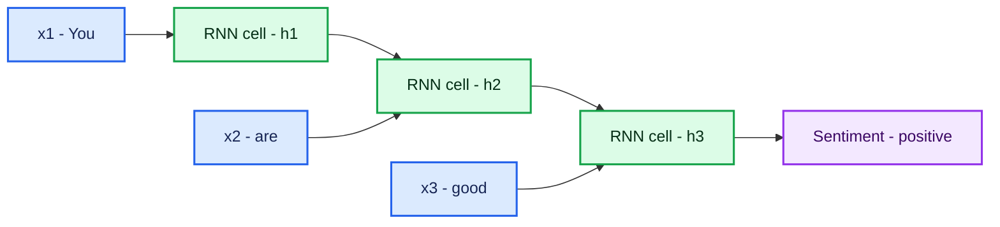
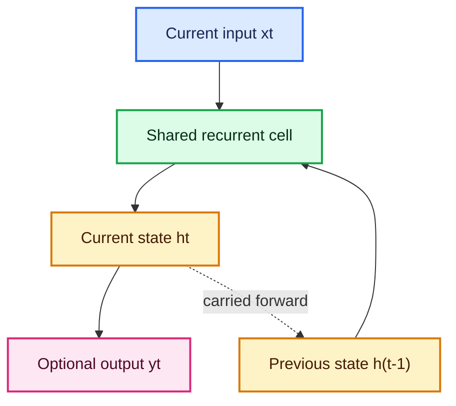
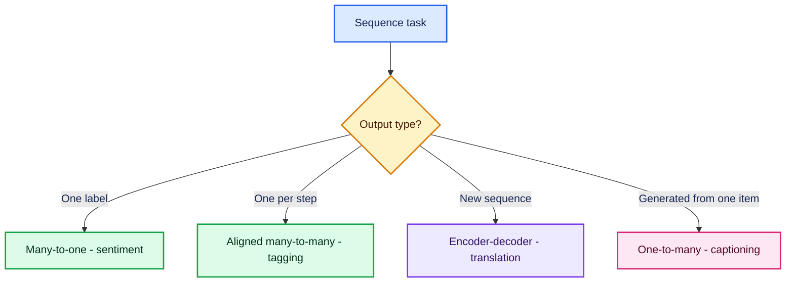
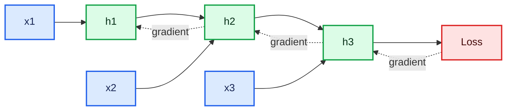
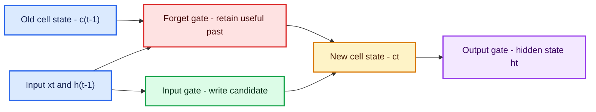

# Recurrent Neural Networks: RNN, LSTM, and GRU

> Detailed standalone notes based on the supplied **RNN.pdf**.
>
> Covers sequential tensors, embeddings, recurrent equations, parameter counts, BPTT, vanishing/exploding gradients, LSTM and GRU gates, worked examples, colourful Mermaid diagrams, and commented Keras code.

## Table of contents

1. [RNN overview](#1-rnn-overview)
2. [Sequential data and why order matters](#2-sequential-data-and-why-order-matters)
3. [Representing text and sequence tensors](#3-representing-text-and-sequence-tensors)
4. [Vanilla RNN architecture and forward equations](#4-vanilla-rnn-architecture-and-forward-equations)
5. [RNN shapes, parameters, and worked example](#5-rnn-shapes-parameters-and-worked-example)
6. [Sequence input-output patterns](#6-sequence-input-output-patterns)
7. [Backpropagation through time](#7-backpropagation-through-time)
8. [Why vanilla RNNs struggle](#8-why-vanilla-rnns-struggle)
9. [LSTM: long short-term memory](#9-lstm-long-short-term-memory)
10. [GRU: gated recurrent unit](#10-gru-gated-recurrent-unit)
11. [Simple RNN vs LSTM vs GRU](#11-simple-rnn-vs-lstm-vs-gru)
12. [Complete commented RNN classification code](#12-complete-commented-rnn-classification-code)
13. [RNN revision, fun facts, and practice](#13-rnn-revision-fun-facts-and-practice)

---

## 1. RNN overview

A **Recurrent Neural Network (RNN)** is designed for ordered data. Unlike a feed-forward network, it passes a hidden state from one time step to the next. This hidden state acts as a compact memory of what the network has processed so far.

### What?

At time $t$, an RNN combines:

- the current input $\mathbf{x}_t$;
- the previous hidden state $\mathbf{h}_{t-1}$;

to produce:

- the current hidden state $\mathbf{h}_t$;
- optionally, an output $\hat{\mathbf{y}}_t$.

### Why?

In a sequence, the meaning of an element often depends on earlier elements.

Compare:

- “You are **good**.”
- “You are **not good**.”

A bag of isolated words contains `you`, `are`, `not`, and `good`, but order determines the final meaning.

### How?

The same recurrent cell is reused at every time step:

$$
\mathbf{h}_t
=
\phi
\left(
\mathbf{x}_tW_{xh}
+
\mathbf{h}_{t-1}W_{hh}
+
\mathbf{b}_h
\right)
$$

This weight sharing lets one model handle sequences of different lengths.

### When?

RNN-family models are useful for:

- text classification;
- language modeling;
- time-series forecasting;
- speech and audio sequences;
- sensor streams;
- sequence labeling;
- sequence-to-sequence transformation.

Modern NLP usually favors Transformers, but RNNs, LSTMs, and GRUs remain valuable when:

- data is naturally streamed one step at a time;
- sequences are moderate in length;
- the model must be small;
- latency or memory constraints matter;
- the goal is to understand recurrent ideas that lead to attention and Transformers.



The three boxes above are an **unrolled view** of one recurrent cell with shared parameters, not three independently trained networks.

---

## 2. Sequential data and why order matters

### 2.1 Sequential versus non-sequential data

In ordinary tabular data, columns such as age, location, and salary have named roles. Reordering the rows of a training table normally does not change a row's meaning.

In sequential data, position carries information:

- words in a sentence;
- daily temperature readings;
- audio samples;
- frames in a video;
- transactions ordered by time.

For a sequence:

$$
\mathbf{x}_1,\mathbf{x}_2,\ldots,\mathbf{x}_T
$$

$T$ is the number of time steps.

### 2.2 Why a fixed ANN is awkward for text

Suppose every word is represented by a vocabulary-sized one-hot vector.

An ANN that concatenates three word vectors:

$$
[\mathbf{x}_1;\mathbf{x}_2;\mathbf{x}_3]
$$

has several problems:

1. **Variable length**  
   “Good” and “I really enjoyed this film” do not have the same number of tokens.

2. **Large input dimension**  
   With vocabulary size $V$ and maximum length $T$, the flattened input has $TV$ values.

3. **Position-specific weights**  
   A word in position 1 and the same word in position 8 are processed by different ANN weights.

4. **Weak sequence semantics**  
   Flattening does not explicitly preserve a step-by-step memory.

An RNN reuses the same transition at every step and carries the hidden state forward.

### 2.3 Sequence length is still managed in batches

Different sentences may have different lengths, but tensors in one batch must normally have a rectangular shape. We therefore:

- pad shorter sequences;
- truncate very long sequences;
- use a mask so the model ignores padding.

This is an engineering constraint, not a claim that the true sentences are equally long.

---

## 3. Representing text and sequence tensors

### 3.1 Tokenization

Tokenization converts raw text into units such as words, subwords, or characters:

```text
"you are not good"
        ↓
["you", "are", "not", "good"]
```

A vocabulary assigns each token an integer ID:

```text
you  → 1
are  → 2
good → 3
bad  → 4
not  → 5
```

### 3.2 One-hot encoding

With vocabulary size $V=5$:

$$
\text{you}=
[1,0,0,0,0]
$$

$$
\text{are}=
[0,1,0,0,0]
$$

$$
\text{good}=
[0,0,1,0,0]
$$

One-hot vectors are easy to understand but:

- are high-dimensional;
- are mostly zeros;
- encode no similarity between words.

### 3.3 Embeddings

An embedding matrix:

$$
E\in\mathbb{R}^{V\times d}
$$

maps each token ID to a dense vector of length $d$:

$$
\mathbf{e}_t=E[\text{token}_t]
$$

The vectors are learned so useful linguistic similarities can emerge.

```text
token ID → embedding lookup → dense vector
```

An embedding is a trainable lookup table, not a one-hot vector passed through a mysterious black box. Looking up row $i$ is equivalent to multiplying a one-hot row vector by $E$.

### 3.4 Keras sequence shape

The supplied RNN notes use:

$$
(\text{batch size},\text{time steps},\text{input features})
$$

For:

- 3 sentences;
- 4 time steps;
- 6 one-hot features;

the tensor has shape:

$$
(3,4,6)
$$

With embeddings of dimension 32, the same batch becomes:

$$
(3,4,32)
$$

### 3.5 Padding and masking

```python
Embedding(
    input_dim=vocabulary_size,
    output_dim=embedding_dim,
    mask_zero=True,  # Token ID 0 is padding and should be ignored.
)
```

Masking prevents padded positions from being interpreted as real words.

---

## 4. Vanilla RNN architecture and forward equations

### 4.1 Hidden-state update

Let:

- $\mathbf{x}_t\in\mathbb{R}^{d}$ be the current input;
- $\mathbf{h}_{t-1}\in\mathbb{R}^{h}$ be previous memory;
- $W_{xh}\in\mathbb{R}^{d\times h}$ be input-to-hidden weights;
- $W_{hh}\in\mathbb{R}^{h\times h}$ be recurrent weights;
- $\mathbf{b}_h\in\mathbb{R}^{h}$ be hidden bias.

Then:

$$
\boxed{
\mathbf{h}_t
=
\tanh
\left(
\mathbf{x}_tW_{xh}
+
\mathbf{h}_{t-1}W_{hh}
+
\mathbf{b}_h
\right)
}
$$

Usually:

$$
\mathbf{h}_0=\mathbf{0}
$$

unless an initial state is supplied.

### 4.2 Output equation

For $m$ output units:

$$
\mathbf{o}_t
=
\mathbf{h}_tW_{hy}
+
\mathbf{b}_y
$$

where:

$$
W_{hy}\in\mathbb{R}^{h\times m}
$$

For binary classification:

$$
\hat y=\sigma(o_T)
$$

For multiclass classification:

$$
\hat{\mathbf{y}}
=
\operatorname{softmax}(\mathbf{o}_T)
$$

For sequence labeling, an output may be produced at every step rather than only at $T$.

### 4.3 Why `tanh`?

The classic Simple RNN uses:

$$
\tanh(z)=\frac{e^z-e^{-z}}{e^z+e^{-z}}
$$

with range:

$$
[-1,1]
$$

It allows positive and negative memory values and keeps state bounded. Its saturation also contributes to vanishing gradients.

### 4.4 Recurrence is feedback

A feed-forward network has no state loop. An RNN feeds its previous hidden state back into the cell:



---

## 5. RNN shapes, parameters, and worked example

### 5.1 Parameter count

For input dimension $d$ and hidden size $h$, a Simple RNN core has:

$$
dh+h^2+h
$$

parameters:

- $dh$ in $W_{xh}$;
- $h^2$ in $W_{hh}$;
- $h$ hidden biases.

With an output dimension $m$, add:

$$
hm+m
$$

Therefore:

$$
\boxed{
N_{\text{total}}
=
dh+h^2+h+hm+m
}
$$

### 5.2 Source example

The supplied notes use:

- vocabulary/input features $d=5$;
- hidden units $h=3$;
- output units $m=1$.

Weight matrices:

$$
W_{xh}:5\times3\Rightarrow15
$$

$$
W_{hh}:3\times3\Rightarrow9
$$

$$
W_{hy}:3\times1\Rightarrow3
$$

Thus the source's **weight-only** count is:

$$
15+9+3=27
$$

Including biases:

$$
27+3+1=31
$$

### 5.3 Why parameter sharing matters

The same:

$$
W_{xh},W_{hh},W_{hy}
$$

are reused for every token. Increasing sequence length does not create a new set of recurrent weights.

This is analogous to CNN parameter sharing:

- CNN: same kernel across spatial locations;
- RNN: same transition across time steps.

### 5.4 Forward pass through “you are good”

With one-hot inputs $\mathbf{x}_1,\mathbf{x}_2,\mathbf{x}_3$:

$$
\mathbf{h}_1
=
\tanh(\mathbf{x}_1W_{xh}+\mathbf{h}_0W_{hh}+\mathbf{b}_h)
$$

$$
\mathbf{h}_2
=
\tanh(\mathbf{x}_2W_{xh}+\mathbf{h}_1W_{hh}+\mathbf{b}_h)
$$

$$
\mathbf{h}_3
=
\tanh(\mathbf{x}_3W_{xh}+\mathbf{h}_2W_{hh}+\mathbf{b}_h)
$$

Final sentiment probability:

$$
\hat y
=
\sigma(\mathbf{h}_3W_{hy}+b_y)
$$

The word `good` is interpreted using a state that already contains information from `you are`.

---

## 6. Sequence input-output patterns

| Pattern | Inputs | Outputs | Example |
|---|---|---|---|
| One-to-one | One | One | Ordinary image classification |
| One-to-many | One | Sequence | Image caption generation |
| Many-to-one | Sequence | One | Sentiment classification |
| Many-to-many, aligned | Sequence | One output per step | Part-of-speech tagging |
| Many-to-many, unaligned | Input sequence | Different-length sequence | Translation or summarization |



In Keras:

- `return_sequences=False` returns only the final recurrent output;
- `return_sequences=True` returns an output at every time step;
- `return_state=True` additionally returns final state tensors.

---

## 7. Backpropagation through time

Training an RNN uses **Backpropagation Through Time (BPTT)**.

### 7.1 Idea

1. Unroll the recurrent computation across $T$ steps.
2. Perform the forward pass.
3. Calculate loss.
4. Backpropagate from later steps through earlier hidden states.
5. Sum gradient contributions for the shared parameters.



### 7.2 Binary cross-entropy

For binary sentiment:

$$
\mathcal{L}
=
-\left[
y\log\hat y
+(1-y)\log(1-\hat y)
\right]
$$

### 7.3 Shared-weight gradient

Because $W_{hh}$ affects every time step:

$$
\frac{\partial\mathcal{L}}{\partial W_{hh}}
=
\sum_{t=1}^{T}
\left.
\frac{\partial\mathcal{L}}
{\partial W_{hh}}
\right|_t
$$

The optimizer then updates:

$$
W_{hh}
\leftarrow
W_{hh}
-\eta
\frac{\partial\mathcal{L}}{\partial W_{hh}}
$$

### 7.4 Truncated BPTT

For very long streams, backpropagating through the complete history is expensive. **Truncated BPTT** backpropagates through a limited window, then detaches older history.

This reduces memory and computation but limits how far gradients can directly assign credit.

---

## 8. Why vanilla RNNs struggle

The supplied notes identify:

1. weak long-term memory;
2. vanishing gradients;
3. exploding gradients;
4. poor long-range dependency capture;
5. slow sequential processing.

### 8.1 Gradient products

The gradient from a late state to an early state contains a product of Jacobians:

$$
\frac{\partial\mathbf{h}_T}
{\partial\mathbf{h}_t}
=
\prod_{k=t+1}^{T}
\frac{\partial\mathbf{h}_k}
{\partial\mathbf{h}_{k-1}}
$$

For a tanh RNN:

$$
\frac{\partial\mathbf{h}_k}
{\partial\mathbf{h}_{k-1}}
=
\operatorname{diag}
\left(1-\mathbf{h}_k^2\right)
W_{hh}
$$

### 8.2 Vanishing gradients

If repeated factors have magnitudes below 1:

$$
0.8^{50}\approx1.43\times10^{-5}
$$

The early-step gradient becomes tiny. The network cannot learn that an early word matters much later.

### 8.3 Exploding gradients

If repeated factors have magnitudes above 1:

$$
1.2^{50}\approx9{,}100
$$

Gradients grow rapidly, causing unstable updates or NaNs.

### 8.4 Practical remedies

- LSTM or GRU gates;
- gradient clipping;
- careful initialization;
- normalization;
- shorter BPTT windows;
- residual paths;
- attention or Transformers.

```python
optimizer = tf.keras.optimizers.Adam(
    learning_rate=1e-3,
    clipnorm=1.0,  # Rescale a gradient when its norm exceeds 1.
)
```

### 8.5 Sequential computation

An RNN needs $\mathbf{h}_{t-1}$ before computing $\mathbf{h}_t$. Time steps cannot be fully parallelized during training. This is a major reason Transformers became dominant for large-scale language modeling.

---

## 9. LSTM: long short-term memory

An **LSTM** adds a separate cell state $\mathbf{c}_t$ and gates that regulate information flow.

### 9.1 State meanings

- $\mathbf{c}_{t-1}$: previous cell state, often described as long-term memory;
- $\mathbf{h}_{t-1}$: previous hidden state, or short-term/output memory;
- $\mathbf{x}_t$: current input;
- $\mathbf{c}_t$: updated cell state;
- $\mathbf{h}_t$: current hidden state.

The memory language is intuitive, but both states are numerical vectors learned for the task.

### 9.2 Gate values

The sigmoid function:

$$
\sigma(z)=\frac{1}{1+e^{-z}}
$$

returns values in $[0,1]$:

- near 0 → block most information;
- near 1 → pass most information.

All gate operations are element-wise.

### 9.3 Forget gate

$$
\boxed{
\mathbf{f}_t
=
\sigma
\left(
W_f[\mathbf{h}_{t-1},\mathbf{x}_t]
+\mathbf{b}_f
\right)
}
$$

It decides how much previous cell memory survives:

$$
\mathbf{f}_t\odot\mathbf{c}_{t-1}
$$

### 9.4 Input gate and candidate memory

Input gate:

$$
\boxed{
\mathbf{i}_t
=
\sigma
\left(
W_i[\mathbf{h}_{t-1},\mathbf{x}_t]
+\mathbf{b}_i
\right)
}
$$

Candidate:

$$
\boxed{
\tilde{\mathbf{c}}_t
=
\tanh
\left(
W_c[\mathbf{h}_{t-1},\mathbf{x}_t]
+\mathbf{b}_c
\right)
}
$$

The input gate decides how much candidate information is written.

### 9.5 Cell-state update

$$
\boxed{
\mathbf{c}_t
=
\mathbf{f}_t\odot\mathbf{c}_{t-1}
+
\mathbf{i}_t\odot\tilde{\mathbf{c}}_t
}
$$

This additive path makes it easier for gradients to travel across many steps than through repeated pure matrix multiplication.

### 9.6 Output gate

$$
\boxed{
\mathbf{o}_t
=
\sigma
\left(
W_o[\mathbf{h}_{t-1},\mathbf{x}_t]
+\mathbf{b}_o
\right)
}
$$

$$
\boxed{
\mathbf{h}_t
=
\mathbf{o}_t\odot\tanh(\mathbf{c}_t)
}
$$

### 9.7 Intuition from the supplied example

Text:

> Riya is a doctor. She lives in Delhi. She works at a hospital. Last year, Riya moved to London. Now she works at a research lab.

When the model reads “moved to London,” useful behavior might be:

- retain information related to Riya;
- retain profession-related information;
- forget the outdated location Delhi;
- write the new location London;
- adjust employment-context features from hospital toward research lab.

The model does not literally contain human-readable slots named “gender” and “city.” Gate vectors distribute these learned features across dimensions.



### 9.8 LSTM parameter count

An LSTM contains four affine transformations: forget, input, candidate, and output.

For input size $d$ and hidden size $h$:

$$
\boxed{
N_{\text{LSTM}}
=
4h(d+h+1)
}
$$

An LSTM is more expressive than a Simple RNN but has more parameters and computation.

---

## 10. GRU: gated recurrent unit

A **GRU** simplifies LSTM by:

- using one hidden state rather than separate hidden and cell states;
- using two named gates: update and reset;
- combining memory retention and output more directly.

### 10.1 Update gate

$$
\boxed{
\mathbf{z}_t
=
\sigma
\left(
W_z\mathbf{x}_t
+
U_z\mathbf{h}_{t-1}
+
\mathbf{b}_z
\right)
}
$$

### 10.2 Reset gate

$$
\boxed{
\mathbf{r}_t
=
\sigma
\left(
W_r\mathbf{x}_t
+
U_r\mathbf{h}_{t-1}
+
\mathbf{b}_r
\right)
}
$$

The reset gate decides how strongly old memory influences the new candidate.

### 10.3 Candidate hidden state

$$
\boxed{
\tilde{\mathbf{h}}_t
=
\tanh
\left(
W_h\mathbf{x}_t
+
U_h
\left(
\mathbf{r}_t\odot\mathbf{h}_{t-1}
\right)
+
\mathbf{b}_h
\right)
}
$$

### 10.4 Final hidden state

Using the convention displayed in the supplied GRU diagram:

$$
\boxed{
\mathbf{h}_t
=
(1-\mathbf{z}_t)\odot\mathbf{h}_{t-1}
+
\mathbf{z}_t\odot\tilde{\mathbf{h}}_t
}
$$

Under this equation:

- $\mathbf{z}_t\approx0$ → keep old state;
- $\mathbf{z}_t\approx1$ → use new candidate.

> **Convention warning:** Some books define the update gate in the complementary direction. Under their equation, a high gate keeps the old state. Always interpret the gate together with the equation. The supplied handwritten high/low annotation conflicts with its displayed equation; the equations above are internally consistent.

### 10.5 Delhi-to-London intuition

When “Riya moved to London” arrives:

1. the reset gate controls how much the old Delhi-related context influences the candidate;
2. the candidate creates new location information from the current token and selected history;
3. the update gate mixes the old memory with the new candidate.

### 10.6 GRU parameter count

Ignoring implementation-specific bias conventions:

$$
\boxed{
N_{\text{GRU}}
\approx
3h(d+h+1)
}
$$

Keras can use separate input and recurrent bias vectors (`reset_after=True`), so an exact framework count may include additional biases. Always confirm with `model.summary()`.

---

## 11. Simple RNN vs LSTM vs GRU

| Property | Simple RNN | LSTM | GRU |
|---|---|---|---|
| State | Hidden state | Hidden + cell state | Hidden state |
| Main controls | None | Forget, input, output | Update, reset |
| Parameter scale | $h(d+h+1)$ | $4h(d+h+1)$ | About $3h(d+h+1)$ |
| Long dependencies | Weak | Stronger | Stronger |
| Training cost | Lowest | Highest | Between |
| Small-data simplicity | Good baseline | May be excessive | Strong compromise |
| Typical choice | Short/simple sequences | Complex long dependencies | Efficient gated baseline |

### Practical selection

1. Start with a GRU for a compact gated recurrent baseline.
2. Try LSTM when long or nuanced memory appears important.
3. Use Simple RNN mainly for short sequences, teaching, or a minimal baseline.
4. Compare on validation performance, latency, memory, and stability.
5. For long text and large-scale training, compare against a Transformer.

No architecture is universally best.

---

## 12. Complete commented RNN classification code

This example expects a CSV with:

- `text`: review or sentence;
- `sentiment`: binary label, 0 or 1.

It makes the cell type configurable so Simple RNN, LSTM, and GRU can be compared under the same pipeline.

### 12.1 Imports and data

```python
from pathlib import Path
import random

import numpy as np
import pandas as pd
import tensorflow as tf

from sklearn.model_selection import train_test_split
from sklearn.metrics import classification_report, confusion_matrix

from tensorflow.keras import Sequential
from tensorflow.keras.callbacks import EarlyStopping
from tensorflow.keras.layers import (
    TextVectorization,
    Embedding,
    SimpleRNN,
    LSTM,
    GRU,
    Dense,
    Dropout,
)


SEED = 42
random.seed(SEED)
np.random.seed(SEED)
tf.random.set_seed(SEED)

DATA_PATH = Path("sentiment.csv")
TEXT_COLUMN = "text"
TARGET_COLUMN = "sentiment"

if not DATA_PATH.exists():
    raise FileNotFoundError(f"Dataset not found: {DATA_PATH.resolve()}")

df = pd.read_csv(DATA_PATH)

# Keep only required columns and remove unusable rows.
df = df[[TEXT_COLUMN, TARGET_COLUMN]].dropna().copy()
df[TEXT_COLUMN] = df[TEXT_COLUMN].astype(str)
df[TARGET_COLUMN] = df[TARGET_COLUMN].astype("int32")

# Binary cross-entropy requires labels 0 and 1.
if not set(df[TARGET_COLUMN].unique()).issubset({0, 1}):
    raise ValueError("The sentiment column must contain only 0 and 1.")

# Split into train, validation, and final test sets.
train_df, test_df = train_test_split(
    df,
    test_size=0.20,
    random_state=SEED,
    stratify=df[TARGET_COLUMN],
)

train_df, val_df = train_test_split(
    train_df,
    test_size=0.125,  # 0.125 of 80% = 10% of the original data.
    random_state=SEED,
    stratify=train_df[TARGET_COLUMN],
)
```

### 12.2 Vectorize text

```python
MAX_TOKENS = 20_000
SEQUENCE_LENGTH = 200
EMBEDDING_DIM = 128

# Learn a vocabulary only from training text.
# Validation and test information must not influence preprocessing.
vectorizer = TextVectorization(
    max_tokens=MAX_TOKENS,
    output_mode="int",
    output_sequence_length=SEQUENCE_LENGTH,
    standardize="lower_and_strip_punctuation",
)

vectorizer.adapt(
    tf.data.Dataset.from_tensor_slices(
        train_df[TEXT_COLUMN].to_numpy()
    ).batch(256)
)


def make_dataset(frame, shuffle=False):
    """Convert a DataFrame to a batched tf.data pipeline."""
    features = frame[TEXT_COLUMN].to_numpy()
    labels = frame[TARGET_COLUMN].to_numpy(dtype=np.float32)

    dataset = tf.data.Dataset.from_tensor_slices((features, labels))

    if shuffle:
        dataset = dataset.shuffle(
            buffer_size=len(frame),
            seed=SEED,
            reshuffle_each_iteration=True,
        )

    # Vectorize batches, then prefetch the next batch during model execution.
    return (
        dataset
        .batch(64)
        .map(
            lambda text, label: (vectorizer(text), label),
            num_parallel_calls=tf.data.AUTOTUNE,
        )
        .prefetch(tf.data.AUTOTUNE)
    )


train_ds = make_dataset(train_df, shuffle=True)
val_ds = make_dataset(val_df)
test_ds = make_dataset(test_df)
```

### 12.3 Build a selectable recurrent model

```python
def build_recurrent_classifier(cell_type="gru", units=64):
    """Build a Simple RNN, LSTM, or GRU sentiment classifier."""
    cell_type = cell_type.lower()

    recurrent_layers = {
        "rnn": SimpleRNN(units),
        "lstm": LSTM(units),
        "gru": GRU(units),
    }

    if cell_type not in recurrent_layers:
        raise ValueError("cell_type must be 'rnn', 'lstm', or 'gru'.")

    vocabulary_size = len(vectorizer.get_vocabulary())

    model = Sequential(
        [
            # Convert token IDs to trainable dense vectors.
            # mask_zero=True prevents padding ID 0 from affecting recurrence.
            Embedding(
                input_dim=vocabulary_size,
                output_dim=EMBEDDING_DIM,
                mask_zero=True,
            ),

            # return_sequences=False gives one final vector for many-to-one
            # sentiment classification.
            recurrent_layers[cell_type],

            Dropout(0.30),

            # Sigmoid returns the probability of positive sentiment.
            Dense(1, activation="sigmoid"),
        ],
        name=f"{cell_type}_sentiment",
    )

    model.compile(
        optimizer=tf.keras.optimizers.Adam(
            learning_rate=1e-3,
            clipnorm=1.0,  # Protect against exploding gradients.
        ),
        loss="binary_crossentropy",
        metrics=[
            "accuracy",
            tf.keras.metrics.Precision(name="precision"),
            tf.keras.metrics.Recall(name="recall"),
            tf.keras.metrics.AUC(name="auc"),
        ],
    )

    return model


model = build_recurrent_classifier(cell_type="gru", units=64)
model.summary()
```

### 12.4 Train and evaluate

```python
history = model.fit(
    train_ds,
    validation_data=val_ds,
    epochs=20,
    callbacks=[
        EarlyStopping(
            monitor="val_loss",
            patience=3,
            restore_best_weights=True,
        )
    ],
    verbose=1,
)

# Evaluate once on the untouched test split.
test_metrics = model.evaluate(test_ds, return_dict=True, verbose=0)
print(test_metrics)

# Convert probabilities to labels using the default 0.5 threshold.
test_probabilities = model.predict(test_ds, verbose=0).ravel()
test_predictions = (test_probabilities >= 0.5).astype("int32")
test_labels = test_df[TARGET_COLUMN].to_numpy()

print(classification_report(test_labels, test_predictions, digits=4))
print(confusion_matrix(test_labels, test_predictions))
```

### 12.5 Compare cells fairly

```python
comparison = []

for cell_type in ["rnn", "lstm", "gru"]:
    tf.keras.backend.clear_session()
    tf.random.set_seed(SEED)

    candidate = build_recurrent_classifier(cell_type=cell_type, units=64)

    candidate.fit(
        train_ds,
        validation_data=val_ds,
        epochs=20,
        callbacks=[
            EarlyStopping(
                monitor="val_loss",
                patience=3,
                restore_best_weights=True,
            )
        ],
        verbose=0,
    )

    metrics = candidate.evaluate(test_ds, return_dict=True, verbose=0)
    comparison.append(
        {
            "cell": cell_type.upper(),
            "parameters": candidate.count_params(),
            **metrics,
        }
    )

comparison_df = pd.DataFrame(comparison).sort_values(
    "auc",
    ascending=False,
)
print(comparison_df)
```

The fairest comparison keeps preprocessing, splits, hidden size, training budget, and evaluation metric fixed.

---

## 13. RNN revision, fun facts, and practice

### Quick formulas

Simple RNN:

$$
\mathbf{h}_t
=
\tanh(\mathbf{x}_tW_{xh}+\mathbf{h}_{t-1}W_{hh}+\mathbf{b}_h)
$$

LSTM memory:

$$
\mathbf{c}_t
=
\mathbf{f}_t\odot\mathbf{c}_{t-1}
+
\mathbf{i}_t\odot\tilde{\mathbf{c}}_t
$$

GRU state, using this guide's convention:

$$
\mathbf{h}_t
=
(1-\mathbf{z}_t)\odot\mathbf{h}_{t-1}
+
\mathbf{z}_t\odot\tilde{\mathbf{h}}_t
$$

### Fun facts

- RNN parameter count does not grow with sequence length because weights are shared.
- LSTM means **Long Short-Term Memory**: a memory mechanism designed to preserve useful information across long intervals.
- GRU was introduced later than LSTM and often achieves similar performance with fewer parameters.
- A bidirectional RNN reads both left-to-right and right-to-left, but it cannot be used unchanged for causal streaming because the future is unavailable.
- Speech recognition, translation, and language modeling were dominated by recurrent systems before Transformers.

### Practice

1. A Simple RNN has $d=20$, $h=32$, and $m=4$. Find its total parameters including biases.
2. Why does `return_sequences=True` matter for token-level tagging?
3. Under the GRU equation in this guide, what happens when $\mathbf{z}_t=0$?
4. Why can gradient clipping help exploding gradients but not fully solve vanishing gradients?
5. Why is `mask_zero=True` important when sentences are padded?

### Answers

1.

   $$
   20\cdot32+32^2+32+32\cdot4+4
   =1{,}828
   $$

2. It returns one recurrent output per time step, allowing one tag per token.
3. The previous hidden state is retained.
4. Clipping limits excessive magnitude; it does not create a strong signal when gradients have already shrunk toward zero.
5. Otherwise the model treats padding as a real repeated token and can learn misleading sequence endings.

---
