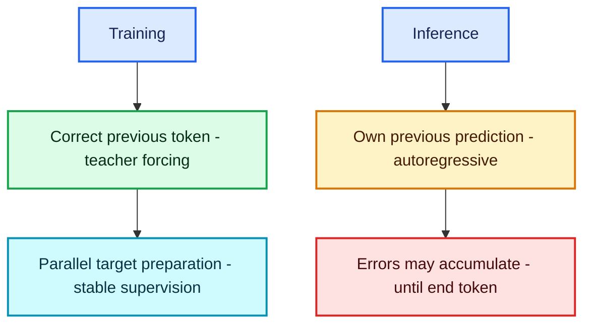
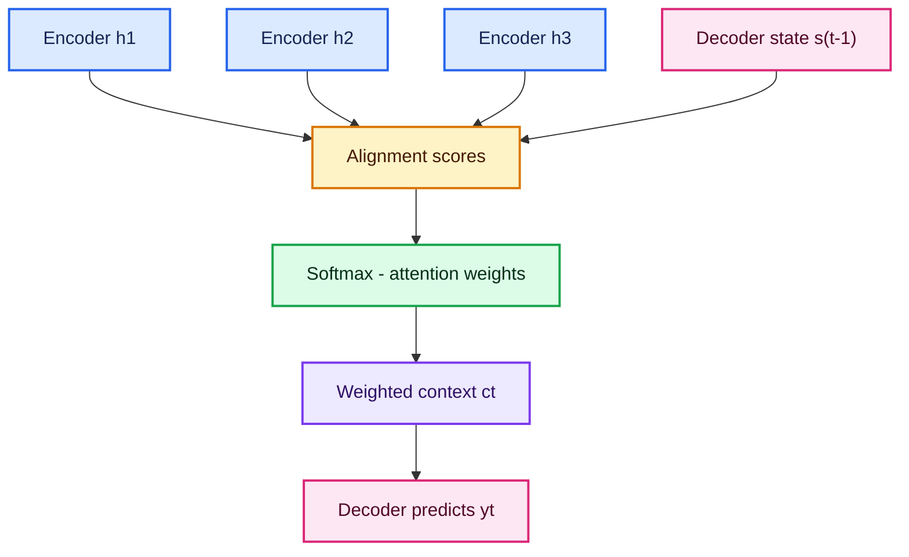
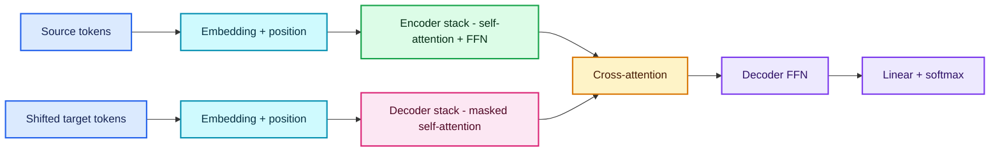
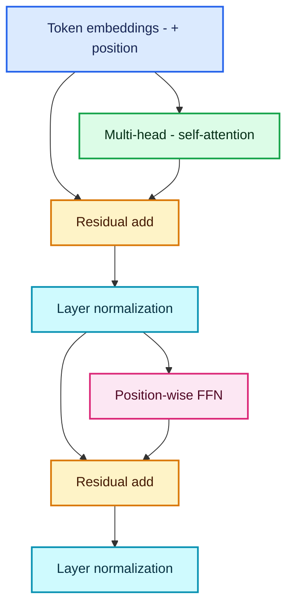
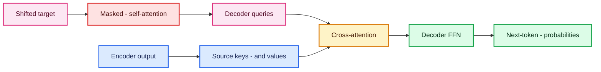
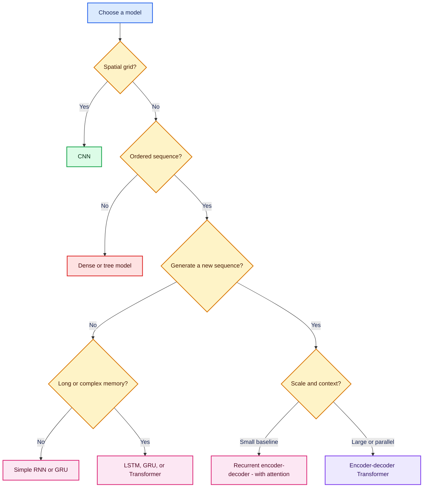

# Sequence-to-Sequence Models, Attention, and Transformers

> Detailed standalone notes based on the supplied **seq-seq.pdf**.
>
> Covers encoder-decoder models, teacher forcing, exposure bias, recurrent attention, self-attention, multi-head attention, positional encoding, causal masking, cross-attention, decoding, evaluation, colourful Mermaid diagrams, and commented Keras implementations.

## Table of contents

1. [Sequence-to-sequence overview](#1-sequence-to-sequence-overview)
2. [Encoder-decoder training and inference](#2-encoder-decoder-training-and-inference)
3. [The context bottleneck and recurrent attention](#3-the-context-bottleneck-and-recurrent-attention)
4. [Why Transformers replaced recurrence](#4-why-transformers-replaced-recurrence)
5. [Self-attention: queries, keys, and values](#5-self-attention-queries-keys-and-values)
6. [Multi-head attention and the encoder block](#6-multi-head-attention-and-the-encoder-block)
7. [Transformer decoder: masking and cross-attention](#7-transformer-decoder-masking-and-cross-attention)
8. [Complete commented LSTM encoder-decoder code](#8-complete-commented-lstm-encoder-decoder-code)
9. [Compact commented Transformer building blocks](#9-compact-commented-transformer-building-blocks)
10. [Evaluation, decoding, and common problems](#10-evaluation-decoding-and-common-problems)
11. [Choosing the right architecture](#11-choosing-the-right-architecture)
12. [Final revision sheet and takeaway](#12-final-revision-sheet-and-takeaway)

---

## 1. Sequence-to-sequence overview

A **sequence-to-sequence (Seq2Seq)** model reads an input sequence and generates a new output sequence, possibly of a different length.

Examples:

- English sentence → Hindi sentence;
- question → answer;
- long document → summary;
- speech frames → transcript;
- source code → documentation.

### 1.1 What problem does it solve?

Ordinary classification maps:

$$
\text{input}\longrightarrow\text{one label}
$$

Sequence-to-sequence maps:

$$
(x_1,x_2,\ldots,x_{T_x})
\longrightarrow
(y_1,y_2,\ldots,y_{T_y})
$$

$T_x$ and $T_y$ need not be equal.

### 1.2 The encoder-decoder idea

The supplied notes summarize it well:

> An encoder-decoder model first understands the input sequence and then generates a new output sequence based on that understanding.

```mermaid
flowchart LR
    X["Input sequence - English"] --> E["Encoder - build representation"]
    E --> C["Context - meaning"]
    C --> D["Decoder - generate step by step"]
    D --> Y["Output sequence - Hindi"]

    classDef input fill:#dbeafe,stroke:#2563eb,color:#172554,stroke-width:2px;
    classDef encoder fill:#dcfce7,stroke:#16a34a,color:#052e16,stroke-width:2px;
    classDef context fill:#fef3c7,stroke:#d97706,color:#451a03,stroke-width:2px;
    classDef decoder fill:#fce7f3,stroke:#db2777,color:#500724,stroke-width:2px;
    classDef output fill:#ede9fe,stroke:#7c3aed,color:#2e1065,stroke-width:2px;

    class X input;
    class E encoder;
    class C context;
    class D decoder;
    class Y output;
```



### 1.3 Classical recurrent encoder

An RNN, LSTM, or GRU reads from left to right:

$$
\mathbf{h}_t
=
f_{\text{enc}}(\mathbf{x}_t,\mathbf{h}_{t-1})
$$

The simplest design uses the final state as a fixed context:

$$
\mathbf{c}=\mathbf{h}_{T_x}
$$

For an LSTM, both final states are passed:

$$
(\mathbf{h}_{T_x},\mathbf{c}_{T_x})
$$

### 1.4 Classical recurrent decoder

At step $t$:

$$
\mathbf{s}_t
=
f_{\text{dec}}
\left(
E_y[y_{t-1}],
\mathbf{s}_{t-1},
\mathbf{c}
\right)
$$

Vocabulary probability:

$$
P(y_t\mid y_{<t},\mathbf{x})
=
\operatorname{softmax}
(W_o\mathbf{s}_t+\mathbf{b}_o)
$$

The complete sequence probability factorizes autoregressively:

$$
\boxed{
P(\mathbf{y}\mid\mathbf{x})
=
\prod_{t=1}^{T_y}
P(y_t\mid y_{<t},\mathbf{x})
}
$$

---

## 2. Encoder-decoder training and inference

The decoder behaves differently during training and prediction.

### 2.1 Special tokens

- `<start>` tells the decoder to begin;
- `<end>` tells it to stop;
- `<pad>` fills unused batch positions;
- `<unk>` represents out-of-vocabulary text.

If the target is:

```text
I love data <end>
```

decoder training input is:

```text
<start> I love data
```

and the expected output is:

```text
I love data <end>
```

This is called **shifting the target right**.

### 2.2 Teacher forcing

During training, the decoder receives the correct previous token:

$$
\mathbf{s}_t
=
f_{\text{dec}}
(E_y[y_{t-1}],\mathbf{s}_{t-1},\mathbf{c})
$$

Benefits:

- easier optimization;
- faster learning;
- errors do not cascade inside one training sequence.

### 2.3 Autoregressive inference

At prediction time, the true output is unknown. The decoder feeds back its own prediction:

$$
\hat y_{t-1}
\longrightarrow
\text{next decoder step}
$$

It repeats until:

- `<end>` is generated; or
- a maximum length is reached.



### 2.4 Exposure bias

Training sees correct histories; inference sees model-generated histories. This mismatch is called **exposure bias**.

Possible responses:

- scheduled sampling;
- sequence-level training;
- stronger decoding strategies;
- data augmentation;
- architectures and objectives that are robust to imperfect context.

Scheduled sampling must be used carefully because it introduces its own optimization mismatch.

### 2.5 Sequence loss

For target token $y_t$:

$$
\mathcal{L}
=
-\sum_{t=1}^{T_y}
\log P(y_t\mid y_{<t},\mathbf{x})
$$

Padding must be masked:

$$
\mathcal{L}_{\text{masked}}
=
-\frac{
\sum_tm_t\log P(y_t\mid y_{<t},\mathbf{x})
}{
\sum_tm_t
}
$$

where $m_t=0$ for padding and $1$ for a real target token.

---

## 3. The context bottleneck and recurrent attention

### 3.1 Problems with fixed-context Seq2Seq

The supplied notes identify:

1. **information bottleneck**: one fixed vector must carry the whole source;
2. **no explicit word-to-word alignment**;
3. **exposure bias**;
4. **long-sentence failure**.

Compressing a paragraph into one vector is like reading a long document, discarding every page, and answering only from one short memory.

### 3.2 Attention changes the context

Instead of giving the decoder only the final encoder state, retain all encoder states:

$$
\mathbf{h}_1,\mathbf{h}_2,\ldots,\mathbf{h}_{T_x}
$$

At decoder step $t$, calculate how relevant each source state is.

Alignment score:

$$
e_{t,j}
=
a(\mathbf{s}_{t-1},\mathbf{h}_j)
$$

For additive/Bahdanau attention:

$$
e_{t,j}
=
\mathbf{v}_a^\top
\tanh
\left(
W_s\mathbf{s}_{t-1}
+
W_h\mathbf{h}_j
+
\mathbf{b}_a
\right)
$$

Normalize across source positions:

$$
\boxed{
\alpha_{t,j}
=
\frac{\exp(e_{t,j})}
{\sum_{k=1}^{T_x}\exp(e_{t,k})}
}
$$

Build a step-specific context:

$$
\boxed{
\mathbf{c}_t
=
\sum_{j=1}^{T_x}
\alpha_{t,j}\mathbf{h}_j
}
$$

The decoder now receives a different context at every output step.



### 3.3 Why attention helped but did not fully solve the problem

Attention created alignment and shortened the path from a source word to a decoder step. However, the encoder and decoder were still recurrent:

- hidden states were computed sequentially;
- long paths still existed inside the RNN;
- training could not fully parallelize.

This motivated the Transformer.

---

## 4. Why Transformers replaced recurrence

A **Transformer** uses attention as its primary interaction mechanism and removes recurrent state transitions.

### 4.1 RNN attention versus Transformer attention

| Property | Recurrent Seq2Seq + attention | Transformer |
|---|---|---|
| Source processing | Sequential | Parallel across positions |
| Long-range path | Through recurrent states | Direct attention connection |
| Training parallelism | Limited | High |
| Position knowledge | Implicit in recurrence | Added explicitly |
| Core operation | RNN/LSTM/GRU | Multi-head attention + FFN |
| Long-context cost | Sequential time | Self-attention usually $O(T^2)$ |

### 4.2 Encoder-decoder Transformer

The original architecture contains:

- a stack of encoder blocks;
- a stack of decoder blocks;
- token embeddings;
- positional information;
- output projection and softmax.



### 4.3 Transformer families

- **Encoder-only:** contextual understanding, classification, retrieval embeddings.
- **Decoder-only:** autoregressive generation.
- **Encoder-decoder:** conditional generation such as translation and summarization.

The supplied sequence-to-sequence notes focus on the full encoder-decoder form.

---

## 5. Self-attention: queries, keys, and values

### 5.1 Intuition

For every token:

- **Query:** what information am I looking for?
- **Key:** what information do I contain?
- **Value:** what content should I contribute if selected?

Given input matrix:

$$
X\in\mathbb{R}^{T\times d_{\text{model}}}
$$

learn:

$$
Q=XW^Q,\qquad K=XW^K,\qquad V=XW^V
$$

### 5.2 Scaled dot-product attention

$$
\boxed{
\operatorname{Attention}(Q,K,V)
=
\operatorname{softmax}
\left(
\frac{QK^\top}{\sqrt{d_k}}
\right)V
}
$$

Shapes:

$$
Q\in\mathbb{R}^{T_q\times d_k}
$$

$$
K\in\mathbb{R}^{T_k\times d_k}
$$

$$
V\in\mathbb{R}^{T_k\times d_v}
$$

$$
QK^\top\in\mathbb{R}^{T_q\times T_k}
$$

Every row becomes a probability distribution over key positions.

### 5.3 Why divide by $\sqrt{d_k}$?

If query and key components have variance near 1, their dot product variance grows roughly with $d_k$. Large scores push softmax into saturation and produce tiny gradients.

Scaling keeps scores in a more trainable range.

### 5.4 Worked example from the supplied notes

Tokens:

$$
\text{Please}=[1,0],\quad
\text{Study}=[0,2],\quad
\text{Man}=[1,1]
$$

Using the source's illustrative projections:

$$
Q=
\begin{bmatrix}
1&0\\
0&2\\
1&1
\end{bmatrix},
\quad
K=
\begin{bmatrix}
1&1\\
0&2\\
1&2
\end{bmatrix},
\quad
V=
\begin{bmatrix}
1&0\\
2&2\\
2&1
\end{bmatrix}
$$

Raw scores:

$$
QK^\top
=
\begin{bmatrix}
1&0&1\\
2&4&4\\
2&2&3
\end{bmatrix}
$$

Standard scaled scores use $d_k=2$:

$$
\frac{QK^\top}{\sqrt2}
$$

For the `Study` query:

$$
\frac{[2,4,4]}{\sqrt2}
\approx
[1.414,2.828,2.828]
$$

Softmax:

$$
\boldsymbol{\alpha}_{\text{Study}}
\approx
[0.108,0.446,0.446]
$$

Context:

$$
\begin{aligned}
\mathbf{c}_{\text{Study}}
&=
0.108[1,0]
+0.446[2,2]
+0.446[2,1]\\
&\approx[1.892,1.338]
\end{aligned}
$$

The new Study representation contains information blended from all three tokens.

> The supplied handwritten walkthrough first applies softmax to unscaled scores, producing slightly different weights. Modern scaled dot-product attention includes division by $\sqrt{d_k}$ before softmax.

### 5.5 Self-attention complexity

The score matrix has $T^2$ entries:

$$
O(T^2d)
$$

This allows direct global interaction but becomes expensive for very long sequences.

---

## 6. Multi-head attention and the encoder block

### 6.1 Why multiple heads?

One attention distribution may focus on one relationship. Multiple heads can learn different subspaces:

- syntax;
- pronoun reference;
- local phrase structure;
- long-range semantic dependency;
- negation;
- entity relationships.

For head $i$:

$$
\operatorname{head}_i
=
\operatorname{Attention}
(QW_i^Q,KW_i^K,VW_i^V)
$$

Combine:

$$
\boxed{
\operatorname{MHA}(Q,K,V)
=
\operatorname{Concat}
(\operatorname{head}_1,\ldots,\operatorname{head}_H)
W^O
}
$$

If:

$$
d_{\text{model}}=512,\qquad H=8
$$

then a common head size is:

$$
d_k=512/8=64
$$

Concatenating eight 64-dimensional heads returns 512 dimensions.

### 6.2 Residual connection and layer normalization

A classic post-normalization form is:

$$
\mathbf{z}
=
\operatorname{LayerNorm}
\left(
\mathbf{x}
+
\operatorname{Sublayer}(\mathbf{x})
\right)
$$

Residual paths preserve original information and provide short gradient routes.

Layer normalization computes statistics across a token's feature dimension:

$$
\hat x_i
=
\frac{x_i-\mu}
{\sqrt{\sigma^2+\epsilon}}
$$

then learns:

$$
y_i=\gamma_i\hat x_i+\beta_i
$$

Many modern models use **pre-normalization**:

$$
\mathbf{z}
=
\mathbf{x}
+
\operatorname{Sublayer}
(\operatorname{LayerNorm}(\mathbf{x}))
$$

Both are valid architectural choices; do not mix them accidentally.

### 6.3 Position-wise feed-forward network

After attention:

$$
\boxed{
\operatorname{FFN}(\mathbf{x})
=
\phi(\mathbf{x}W_1+\mathbf{b}_1)W_2+\mathbf{b}_2
}
$$

It is applied independently to every token with shared weights.

Typical dimensions:

$$
d_{\text{model}}=512
\rightarrow
d_{\text{ff}}=2048
\rightarrow
512
$$

Attention communicates across tokens; the FFN transforms each token's features.

### 6.4 Positional encoding

Self-attention alone is permutation-equivariant: without position information, it does not know whether a token is first or fifth.

The original sinusoidal encoding is:

$$
PE_{(pos,2i)}
=
\sin
\left(
\frac{pos}{10000^{2i/d_{\text{model}}}}
\right)
$$

$$
PE_{(pos,2i+1)}
=
\cos
\left(
\frac{pos}{10000^{2i/d_{\text{model}}}}
\right)
$$

Other systems use learned, relative, or rotary positional representations.

### 6.5 One encoder block



Stacking blocks lets later layers refine increasingly contextual and abstract features, much as deep CNN layers refine visual features.

---

## 7. Transformer decoder: masking and cross-attention

One decoder block contains:

1. masked multi-head self-attention;
2. encoder-decoder cross-attention;
3. position-wise FFN;
4. residual and normalization paths around each sublayer.

### 7.1 Why causal masking?

During training, the full shifted target sequence is available in one tensor. Without a mask, the position predicting token $y_t$ could look at future target tokens and cheat.

Define:

$$
M_{i,j}
=
\begin{cases}
0,&j\le i\\
-\infty,&j>i
\end{cases}
$$

Then:

$$
\operatorname{MaskedAttention}
=
\operatorname{softmax}
\left(
\frac{QK^\top}{\sqrt{d_k}}
+M
\right)V
$$

Because:

$$
e^{-\infty}=0
$$

future attention weights become zero.

For three target positions:

$$
M=
\begin{bmatrix}
0&-\infty&-\infty\\
0&0&-\infty\\
0&0&0
\end{bmatrix}
$$

Thus:

- position 1 sees itself;
- position 2 sees positions 1 and 2;
- position 3 sees positions 1, 2, and 3.

### 7.2 Training is parallel; generation is autoregressive

The causal mask lets every target position be trained in parallel without future leakage. At inference, tokens still have to be generated one after another because future output tokens do not yet exist.

### 7.3 Cross-attention

In encoder-decoder attention:

- queries come from decoder states;
- keys come from encoder outputs;
- values come from encoder outputs.

$$
Q=H_{\text{dec}}W^Q
$$

$$
K=H_{\text{enc}}W^K
$$

$$
V=H_{\text{enc}}W^V
$$

The attention matrix has shape:

$$
T_{\text{target}}\times T_{\text{source}}
$$

It learns which source tokens each target position should consult.



---

## 8. Complete commented LSTM encoder-decoder code

This compact translation example expects a CSV with:

- `source_text`;
- `target_text`.

It implements teacher forcing and separate inference models. It is intentionally a classical no-attention baseline so the fixed-context architecture remains visible.

### 8.1 Prepare parallel text

```python
from pathlib import Path
import random

import numpy as np
import pandas as pd
import tensorflow as tf

from sklearn.model_selection import train_test_split

from tensorflow.keras import Model
from tensorflow.keras.callbacks import EarlyStopping
from tensorflow.keras.layers import Input, TextVectorization, Embedding, LSTM, Dense


SEED = 42
random.seed(SEED)
np.random.seed(SEED)
tf.random.set_seed(SEED)

DATA_PATH = Path("parallel_text.csv")
SOURCE_COLUMN = "source_text"
TARGET_COLUMN = "target_text"

MAX_SOURCE_TOKENS = 20_000
MAX_TARGET_TOKENS = 20_000
MAX_SOURCE_LENGTH = 40
MAX_TARGET_LENGTH = 42  # Includes startseq and endseq.
EMBEDDING_DIM = 128
LATENT_DIM = 256
BATCH_SIZE = 64

df = pd.read_csv(DATA_PATH)[[SOURCE_COLUMN, TARGET_COLUMN]].dropna()
df[SOURCE_COLUMN] = df[SOURCE_COLUMN].astype(str)

# Use alphabetic special tokens because the default standardizer strips
# punctuation characters such as angle brackets.
df[TARGET_COLUMN] = (
    "startseq "
    + df[TARGET_COLUMN].astype(str)
    + " endseq"
)

train_df, val_df = train_test_split(
    df,
    test_size=0.10,
    random_state=SEED,
)

# Learn source and target vocabularies from training data only.
source_vectorizer = TextVectorization(
    max_tokens=MAX_SOURCE_TOKENS,
    output_mode="int",
    output_sequence_length=MAX_SOURCE_LENGTH,
)

target_vectorizer = TextVectorization(
    max_tokens=MAX_TARGET_TOKENS,
    output_mode="int",
    output_sequence_length=MAX_TARGET_LENGTH,
)

source_vectorizer.adapt(train_df[SOURCE_COLUMN].to_numpy())
target_vectorizer.adapt(train_df[TARGET_COLUMN].to_numpy())

source_vocab_size = len(source_vectorizer.get_vocabulary())
target_vocab_size = len(target_vectorizer.get_vocabulary())
```

### 8.2 Build teacher-forcing datasets

```python
def make_seq2seq_dataset(frame, shuffle=False):
    """Return ((encoder_input, decoder_input), target, padding_mask)."""
    source_text = frame[SOURCE_COLUMN].to_numpy()
    target_text = frame[TARGET_COLUMN].to_numpy()

    source_tokens = source_vectorizer(source_text)
    full_target_tokens = target_vectorizer(target_text)

    # Teacher-forcing input: startseq token through the penultimate token.
    decoder_input = full_target_tokens[:, :-1]

    # Expected output: first real target token through endseq.
    decoder_target = full_target_tokens[:, 1:]

    # Ignore padding ID 0 in the sequence loss.
    sample_weight = tf.cast(decoder_target != 0, tf.float32)

    dataset = tf.data.Dataset.from_tensor_slices(
        (
            (source_tokens, decoder_input),
            decoder_target,
            sample_weight,
        )
    )

    if shuffle:
        dataset = dataset.shuffle(
            len(frame),
            seed=SEED,
            reshuffle_each_iteration=True,
        )

    return dataset.batch(BATCH_SIZE).prefetch(tf.data.AUTOTUNE)


train_ds = make_seq2seq_dataset(train_df, shuffle=True)
val_ds = make_seq2seq_dataset(val_df)
```

### 8.3 Define the training model

```python
# ---------- Encoder ----------
encoder_inputs = Input(
    shape=(None,),
    dtype="int32",
    name="encoder_tokens",
)

encoder_embedding_layer = Embedding(
    input_dim=source_vocab_size,
    output_dim=EMBEDDING_DIM,
    mask_zero=True,
    name="encoder_embedding",
)
encoder_embedded = encoder_embedding_layer(encoder_inputs)

encoder_lstm_layer = LSTM(
    LATENT_DIM,
    return_state=True,
    name="encoder_lstm",
)

# The final output itself is not needed; final h and c summarize the source.
_, encoder_state_h, encoder_state_c = encoder_lstm_layer(encoder_embedded)


# ---------- Decoder ----------
decoder_inputs = Input(
    shape=(None,),
    dtype="int32",
    name="decoder_tokens",
)

decoder_embedding_layer = Embedding(
    input_dim=target_vocab_size,
    output_dim=EMBEDDING_DIM,
    mask_zero=True,
    name="decoder_embedding",
)
decoder_embedded = decoder_embedding_layer(decoder_inputs)

decoder_lstm_layer = LSTM(
    LATENT_DIM,
    return_sequences=True,
    return_state=True,
    name="decoder_lstm",
)

decoder_sequence, _, _ = decoder_lstm_layer(
    decoder_embedded,
    initial_state=[encoder_state_h, encoder_state_c],
)

output_layer = Dense(
    target_vocab_size,
    activation="softmax",
    name="token_probabilities",
)
decoder_probabilities = output_layer(decoder_sequence)

training_model = Model(
    inputs=[encoder_inputs, decoder_inputs],
    outputs=decoder_probabilities,
    name="lstm_seq2seq",
)

training_model.compile(
    optimizer=tf.keras.optimizers.Adam(clipnorm=1.0),
    loss="sparse_categorical_crossentropy",
    # weighted_metrics respects the padding sample weights supplied by dataset.
    weighted_metrics=["sparse_categorical_accuracy"],
)

training_model.summary()
```

### 8.4 Train

```python
history = training_model.fit(
    train_ds,
    validation_data=val_ds,
    epochs=30,
    callbacks=[
        EarlyStopping(
            monitor="val_loss",
            patience=4,
            restore_best_weights=True,
        )
    ],
)
```

### 8.5 Build inference models

```python
# Encoder inference model returns the source's final LSTM states.
encoder_model = Model(
    encoder_inputs,
    [encoder_state_h, encoder_state_c],
    name="encoder_inference",
)

# Decoder inference model consumes one token plus previous states.
step_token_input = Input(shape=(1,), dtype="int32", name="step_token")
step_state_h_input = Input(shape=(LATENT_DIM,), name="step_h")
step_state_c_input = Input(shape=(LATENT_DIM,), name="step_c")

step_embedding = decoder_embedding_layer(step_token_input)

step_sequence, step_state_h, step_state_c = decoder_lstm_layer(
    step_embedding,
    initial_state=[step_state_h_input, step_state_c_input],
)

step_probabilities = output_layer(step_sequence)

decoder_step_model = Model(
    inputs=[step_token_input, step_state_h_input, step_state_c_input],
    outputs=[step_probabilities, step_state_h, step_state_c],
    name="decoder_step",
)
```

### 8.6 Greedy decoding

```python
target_vocabulary = target_vectorizer.get_vocabulary()
target_to_id = {
    token: index
    for index, token in enumerate(target_vocabulary)
}

START_ID = target_to_id["startseq"]
END_ID = target_to_id["endseq"]


def translate(sentence, max_length=MAX_TARGET_LENGTH - 1):
    """Generate one target sequence using greedy decoding."""
    # Vectorize one source sentence.
    source_tokens = source_vectorizer([sentence])

    # Encode source into initial decoder states.
    state_h, state_c = encoder_model.predict(
        source_tokens,
        verbose=0,
    )

    # First decoder input is the start token.
    current_token = np.array([[START_ID]], dtype=np.int32)
    generated_tokens = []

    for _ in range(max_length):
        probabilities, state_h, state_c = decoder_step_model.predict(
            [current_token, state_h, state_c],
            verbose=0,
        )

        next_id = int(np.argmax(probabilities[0, -1]))

        # Stop at padding or the explicit end token.
        if next_id == 0 or next_id == END_ID:
            break

        generated_tokens.append(target_vocabulary[next_id])
        current_token = np.array([[next_id]], dtype=np.int32)

    return " ".join(generated_tokens)


print(translate("Please study."))
```

This baseline forces the entire source through the final LSTM state. Add recurrent attention or use a Transformer when long-input bottlenecks matter.

---

## 9. Compact commented Transformer building blocks

The following blocks show how the formulas map to Keras. They are educational components rather than a task-specific pretrained language model.

### 9.1 Positional token embedding

```python
from tensorflow.keras.layers import Layer, Embedding


class PositionalEmbedding(Layer):
    """Add learned position vectors to token embeddings."""

    def __init__(self, vocabulary_size, d_model, max_length):
        super().__init__()
        self.token_embedding = Embedding(
            vocabulary_size,
            d_model,
            mask_zero=True,
        )
        self.position_embedding = Embedding(
            max_length,
            d_model,
        )

    def call(self, token_ids):
        sequence_length = tf.shape(token_ids)[1]
        positions = tf.range(sequence_length)

        # Broadcasting adds one position vector to every item in the batch.
        return (
            self.token_embedding(token_ids)
            + self.position_embedding(positions)
        )

    def compute_mask(self, token_ids, mask=None):
        # Padding token 0 should remain masked in later layers.
        return tf.not_equal(token_ids, 0)
```

### 9.2 Encoder block

```python
from tensorflow.keras.layers import (
    MultiHeadAttention,
    LayerNormalization,
    Dense,
    Dropout,
)


class TransformerEncoderBlock(Layer):
    """Post-normalization Transformer encoder block."""

    def __init__(self, d_model, num_heads, d_ff, dropout=0.1):
        super().__init__()

        self.self_attention = MultiHeadAttention(
            num_heads=num_heads,
            key_dim=d_model // num_heads,
            dropout=dropout,
        )

        self.ffn = tf.keras.Sequential(
            [
                Dense(d_ff, activation=tf.nn.gelu),
                Dense(d_model),
            ]
        )

        self.dropout1 = Dropout(dropout)
        self.dropout2 = Dropout(dropout)
        self.norm1 = LayerNormalization(epsilon=1e-6)
        self.norm2 = LayerNormalization(epsilon=1e-6)

    def call(self, x, training=False, mask=None):
        attention_mask = None

        if mask is not None:
            # Shape (batch, 1, source_length) broadcasts over query positions.
            attention_mask = mask[:, tf.newaxis, :]

        attention_output = self.self_attention(
            query=x,
            key=x,
            value=x,
            attention_mask=attention_mask,
            training=training,
        )

        # Residual connection followed by layer normalization.
        x = self.norm1(
            x + self.dropout1(attention_output, training=training)
        )

        ffn_output = self.ffn(x, training=training)

        return self.norm2(
            x + self.dropout2(ffn_output, training=training)
        )

    def compute_mask(self, inputs, mask=None):
        return mask
```

### 9.3 Decoder block

```python
class TransformerDecoderBlock(Layer):
    """Masked self-attention + cross-attention + FFN."""

    def __init__(self, d_model, num_heads, d_ff, dropout=0.1):
        super().__init__()

        self.causal_attention = MultiHeadAttention(
            num_heads=num_heads,
            key_dim=d_model // num_heads,
            dropout=dropout,
        )

        self.cross_attention = MultiHeadAttention(
            num_heads=num_heads,
            key_dim=d_model // num_heads,
            dropout=dropout,
        )

        self.ffn = tf.keras.Sequential(
            [
                Dense(d_ff, activation=tf.nn.gelu),
                Dense(d_model),
            ]
        )

        self.norm1 = LayerNormalization(epsilon=1e-6)
        self.norm2 = LayerNormalization(epsilon=1e-6)
        self.norm3 = LayerNormalization(epsilon=1e-6)

        self.dropout1 = Dropout(dropout)
        self.dropout2 = Dropout(dropout)
        self.dropout3 = Dropout(dropout)

    def call(
        self,
        target,
        encoder_output,
        training=False,
        target_mask=None,
        encoder_mask=None,
    ):
        target_attention_mask = None
        if target_mask is not None:
            # Mask padded target keys; the causal mask separately blocks future.
            target_attention_mask = target_mask[:, tf.newaxis, :]

        # use_causal_mask=True blocks target positions from seeing the future.
        self_attention_output = self.causal_attention(
            query=target,
            key=target,
            value=target,
            attention_mask=target_attention_mask,
            use_causal_mask=True,
            training=training,
        )

        target = self.norm1(
            target
            + self.dropout1(self_attention_output, training=training)
        )

        cross_mask = None
        if encoder_mask is not None:
            cross_mask = encoder_mask[:, tf.newaxis, :]

        # Queries come from the decoder; keys and values come from encoder.
        cross_attention_output = self.cross_attention(
            query=target,
            key=encoder_output,
            value=encoder_output,
            attention_mask=cross_mask,
            training=training,
        )

        target = self.norm2(
            target
            + self.dropout2(cross_attention_output, training=training)
        )

        ffn_output = self.ffn(target, training=training)

        return self.norm3(
            target + self.dropout3(ffn_output, training=training)
        )
```

In a complete model:

1. vectorize source and shifted target;
2. add positional embeddings;
3. pass source through encoder blocks;
4. pass target through decoder blocks with encoder output;
5. project each decoder position to target-vocabulary logits;
6. train with masked sparse cross-entropy.

---

## 10. Evaluation, decoding, and common problems

### 10.1 Greedy decoding

At every step:

$$
\hat y_t
=
\arg\max_y
P(y\mid\hat y_{<t},\mathbf{x})
$$

It is fast but may miss a better complete sequence.

### 10.2 Beam search

Beam search keeps the best $B$ partial sequences.

Sequence log-probability:

$$
\log P(\mathbf{y}\mid\mathbf{x})
=
\sum_t\log P(y_t\mid y_{<t},\mathbf{x})
$$

A length penalty may be required because raw sums tend to prefer short sequences.

Beam search is not guaranteed to find the global optimum, and a larger beam does not always improve human quality.

### 10.3 Sampling

For creative generation:

- temperature;
- top-$k$ sampling;
- nucleus/top-$p$ sampling.

Translation and deterministic summarization often use greedy or beam decoding; open-ended generation often benefits from sampling.

### 10.4 Metrics

| Task | Useful metrics | Caution |
|---|---|---|
| Translation | BLEU, chrF, COMET, human review | Multiple valid translations |
| Summarization | ROUGE, factuality, human review | Lexical overlap is not truth |
| QA | Exact match, token F1 | Alternative valid wording |
| Generation | Perplexity, task metrics, human review | Fluency can hide errors |

Per-token perplexity:

$$
\operatorname{PPL}
=
\exp
\left(
-\frac{1}{N}
\sum_{i=1}^{N}
\log P(y_i)
\right)
$$

Lower perplexity means the model assigns higher probability to the observed tokens, but it does not guarantee factual or useful output.

### 10.5 Common problems

| Problem | Cause | Fix |
|---|---|---|
| Decoder outputs only padding | Padding dominates loss or masks are wrong | Mask padding and inspect target shift |
| Output never stops | End token absent or poorly learned | Add/verify end token and maximum length |
| First token is skipped | Decoder input/target shift is wrong | Input starts with start token; target starts with first real token |
| Repeated words | Weak model, greedy loop, exposure bias | Better training, coverage, beam controls, repetition penalties |
| Future-token leakage | Causal mask missing | Apply triangular decoder self-attention mask |
| Attention attends to padding | Padding mask missing | Mask source and target padding |
| Loss looks low but output is poor | Padding included or teacher-forced metric only | Mask properly and decode validation examples |
| Long input fails | Fixed recurrent context or context limit | Add attention, use Transformer, chunk, or retrieve |
| Transformer runs out of memory | $T^2$ attention matrix | Shorter batches, efficient attention, chunking |

### 10.6 Always inspect decoded examples

Token-level accuracy under teacher forcing can look strong while autoregressive generation is poor. Evaluate actual decoded sequences from an untouched validation/test set.

---

## 11. Choosing the right architecture

| Data/task | Strong starting point | Why |
|---|---|---|
| Image classification | CNN or vision Transformer | Spatial patterns |
| Small tabular dataset | Tree ensemble | Column relationships, limited data |
| Short sequence baseline | Simple RNN or GRU | Lightweight recurrence |
| Moderate sequence with memory | GRU or LSTM | Gated long-range state |
| Streaming causal sensor data | GRU/LSTM/causal temporal model | Online state update |
| Translation/summarization baseline | Encoder-decoder + attention | Explicit conditional generation |
| Large-scale language task | Transformer | Parallel training and global context |
| Very long context | Efficient Transformer or hybrid | Standard attention is quadratic |



Architecture choice should be validated against:

- task metric;
- data volume;
- sequence length;
- compute budget;
- latency;
- memory;
- deployment environment;
- interpretability and maintenance needs.

---

## 12. Final revision sheet and takeaway

### The progression

| Model | Key idea | Main limitation that motivates the next step |
|---|---|---|
| ANN | Learn global non-linear mapping | Ignores spatial/sequential inductive bias |
| CNN | Share local filters over space | Designed mainly around spatial locality |
| Simple RNN | Share a state transition over time | Vanishing/exploding gradients |
| LSTM/GRU | Gate memory flow | Sequential computation remains |
| RNN Seq2Seq | Encode then decode sequences | Fixed context and exposure bias |
| Attention Seq2Seq | Dynamic source context per output | Recurrence still limits parallelism |
| Transformer | Direct attention and parallel training | Quadratic attention and high compute |

### Essential formulas

CNN output size:

$$
N_{\text{out}}
=
\left\lfloor
\frac{N_{\text{in}}+2P-K}{S}
\right\rfloor+1
$$

Simple RNN:

$$
\mathbf{h}_t
=
\tanh
(\mathbf{x}_tW_{xh}+\mathbf{h}_{t-1}W_{hh}+\mathbf{b}_h)
$$

LSTM cell:

$$
\mathbf{c}_t
=
\mathbf{f}_t\odot\mathbf{c}_{t-1}
+
\mathbf{i}_t\odot\tilde{\mathbf{c}}_t
$$

Recurrent attention context:

$$
\mathbf{c}_t
=
\sum_j\alpha_{t,j}\mathbf{h}_j
$$

Scaled dot-product attention:

$$
\operatorname{Attention}(Q,K,V)
=
\operatorname{softmax}
\left(
\frac{QK^\top}{\sqrt{d_k}}
\right)V
$$

Autoregressive factorization:

$$
P(\mathbf{y}\mid\mathbf{x})
=
\prod_tP(y_t\mid y_{<t},\mathbf{x})
$$

### Sequence and attention glossary

| Term | Meaning |
|---|---|
| Autoregressive | Generates a value conditioned on earlier generated values |
| BPTT | Backpropagation through an unrolled recurrent computation |
| Causal mask | Prevents a target position from attending to future targets |
| Cell state | LSTM's gated memory path |
| Cross-attention | Decoder queries attend to encoder keys and values |
| Decoder | Generates a target sequence from encoded/contextual information |
| Embedding | Dense learned vector for a discrete token |
| Encoder | Converts an input sequence into contextual representations |
| Exposure bias | Train-inference mismatch caused by teacher forcing |
| Gate | Sigmoid-controlled element-wise information filter |
| Hidden state | Recurrent summary passed between time steps |
| Key | Attention vector describing what information a token offers |
| Masking | Blocks padding or forbidden future positions |
| Multi-head attention | Several attention projections operating in parallel |
| Positional encoding | Adds order/location information to Transformer inputs |
| Query | Attention vector describing what information a token seeks |
| Teacher forcing | Supplies the correct previous target during training |
| Value | Content blended according to attention weights |

### Seq2Seq and Transformer fun facts

- The Transformer architecture was introduced in the 2017 paper *Attention Is All You Need*.
- Transformer decoder **training** can process all shifted target positions in parallel, but ordinary decoder **inference** remains token-by-token.
- Self-attention has no built-in sense of word order; positional information is essential.
- Attention weights are useful diagnostics but are not automatically faithful explanations of every model decision.
- An encoder-decoder Transformer can support text-to-text tasks, while related attention architectures can connect image, audio, and text representations.
- Multi-head attention does not guarantee that each head learns a neat human-named role; specialization emerges only if useful to the objective.

### Final practice check

1. Why does a recurrent encoder's final fixed vector become a bottleneck?
2. What is shifted right during teacher forcing?
3. Why is $\sqrt{d_k}$ used in scaled dot-product attention?
4. In cross-attention, where do queries, keys, and values come from?
5. Why can a Transformer train target positions in parallel without leaking future words?

Answers:

1. It must compress every source detail into one finite vector, which becomes difficult for long inputs.
2. The target sequence: the decoder input begins with the start token, while expected labels begin with the first real target token.
3. It prevents dot-product variance from growing with key dimension and saturating softmax.
4. Queries come from the decoder; keys and values come from encoder output.
5. A causal mask sets attention logits for future positions to $-\infty$, giving them zero probability.

### Final takeaway

The unifying question is: **what structure should the model preserve?**

- A CNN preserves **local spatial structure**.
- An RNN preserves **ordered history through state**.
- LSTM and GRU preserve **selected history through gates**.
- Recurrent attention preserves **access to all source states**.
- A Transformer creates **direct contextual relationships between all permitted token pairs**.

The best architecture is not the newest one by default. It is the model whose inductive bias, capacity, data requirements, and computational cost best match the problem—and whose performance is confirmed with a clean validation and test workflow.
