# 🧠 Convolutional Neural Networks (CNN) & Image Classification

This comprehensive guide explores Convolutional Neural Networks (CNNs), their architectural advantages over standard Artificial Neural Networks (ANNs), and their practical implementation for image classification tasks.

---

## 🔍 What is a CNN?

A Convolutional Neural Network (CNN) is a specialized deep learning algorithm designed to process structured grid data, such as images. Rather than attempting to process an entire image at once, CNNs scan small patches of the image to gradually build up a complete understanding. This process mimics a detective looking closely at small areas—like a window or a tower—and putting those clues together to recognize a castle.

## ⚖️ Why Not Use ANNs for Images?

Standard Artificial Neural Networks (ANNs) struggle with image data for several critical reasons:

* **High Computational Power:** Flattening a tiny 32x32 image yields 1024 inputs, and connecting them to a hidden layer of just 100 neurons requires calculating 102,400 weights, causing massive computational overhead.


* **Loss of Spatial Arrangement:** Converting a 2D image matrix into a 1D vector completely strips away the spatial relationships between neighboring pixels.


* **Severe Overfitting:** The enormous number of parameters in a dense network makes it highly prone to memorizing training data rather than generalizing it.


---

## 🏗️ CNN Architecture Explained

```mermaid
graph LR
    A[Input Image] --> B[Conv2D Layer 1]
    B --> C[Max Pooling 1]
    C --> D[Conv2D Layer 2]
    D --> E[Max Pooling 2]
    E --> F[Flatten]
    F --> G[Fully Connected / Dense]
    G --> H[Output Predictions]
    
    style A fill:#ffb3b3,stroke:#333,stroke-width:2px
    style B fill:#ffd9b3,stroke:#333,stroke-width:2px
    style C fill:#ffffb3,stroke:#333,stroke-width:2px
    style D fill:#ffd9b3,stroke:#333,stroke-width:2px
    style E fill:#ffffb3,stroke:#333,stroke-width:2px
    style F fill:#b3ffb3,stroke:#333,stroke-width:2px
    style G fill:#b3d9ff,stroke:#333,stroke-width:2px
    style H fill:#d9b3ff,stroke:#333,stroke-width:2px

```



### 1. Convolution Layer (The Detective's Magnifying Glass)

This foundational layer slides a small filter (such as a 3x3 matrix) across the image to extract features. One filter might learn to detect straight lines, while another learns to identify round shapes.

* **Formula:** If you apply an $m\times m$ filter over an $n\times n$ input matrix, the resulting output dimension is $(n-m+1)\times(n-m+1)$.


### 2. Pooling Layer (The Shortcut)

Once the convolution layer detects important features, the pooling layer acts as a shortcut to retain only the most critical information while ignoring noise. This reduces the dimensions of the feature maps, speeds up computation, and makes the model translation-invariant (meaning the object's position in the frame matters less).

| Pooling Type | Mechanism & Best Use Case |
| --- | --- |
| **Max Pooling** | Extracts the maximum value from the region. It is the most common technique and is used to detect strong, dominant features like edges or object parts.

 |
| **Average Pooling** | Calculates the average value of the region. It creates smoother representations and is useful for preserving background information.

 |
| **Min Pooling** | Extracts the minimum value from the region. It is rarely used but helps in highlighting dark features or suppressing backgrounds.

 |

### 3. Fully Connected Layer (The Decision Maker)

After passing through multiple convolution and pooling layers, the network flattens the extracted features into a 1D array. This array feeds into a standard Dense (ANN) layer that acts as the decision-maker, outputting a probabilistic distribution (e.g., 70% chance of a cat, 20% dog, 10% rabbit).

> **Fun Fact:** As a CNN goes deeper, it builds hierarchical understanding! Early layers only detect basic edges (vertical or horizontal), middle layers identify shapes (eyes, noses), and the deepest layers recognize full objects (a cat or a castle).
> 
> 

---

## 📊 Model Performance Comparison

The performance difference between standard networks and CNNs is clearly demonstrated on the MNIST handwritten digit dataset:

| Model Architecture | Final Validation Accuracy | Key Structural Characteristic |
| --- | --- | --- |
| **Simple Perceptron** | 88.08%

 | Directly flattens input into 10 output nodes.

 |
| **Deep ANN** | 95.96%

 | Flattens input and passes through dense layers of 128 and 64 nodes.

 |
| **CNN** | 98.76%

 | Utilizes Conv2D and MaxPooling2D to preserve and extract spatial features.

 |

---

## 💻 Code Implementation Walkthrough

Below is the annotated Python implementation using `tensorflow.keras` and `scikit-learn` to process the MNIST dataset and build the highly accurate CNN model. The dimension calculations in the comments perfectly reflect the mathematical tracking of the image spatial degradation.

```python
import numpy as np
import pandas as pd
import matplotlib.pyplot as plt
import warnings
warnings.filterwarnings('ignore')

from tensorflow.keras.models import Sequential
from tensorflow.keras.layers import Dense, Conv2D, Flatten, MaxPooling2D, Dropout
from tensorflow.keras.utils import to_categorical

# ---------------------------------------------------------
# 1. DATA PREPROCESSING
# ---------------------------------------------------------
# Load training and testing data[cite: 1]
df = pd.read_csv("mnist_train.csv")
df_test = pd.read_csv("mnist_test.csv")

# Separate features (pixels) and labels[cite: 1]
X_train = df.drop("label", axis=1).values
y_train = df["label"].values
X_test = df_test.drop("label", axis=1).values
y_test = df_test["label"].values

# Scale pixel values down to 0-1 range for stable training[cite: 1]
X_train = X_train.astype("float32") / 255.0
X_test = X_test.astype("float32") / 255.0

# Reshape data specifically for CNN input: (Samples, Height, Width, Channels)[cite: 1]
# Standard RGB images have 3 channels (0-255 for Red, Green, Blue)[cite: 2]
# MNIST images are grayscale, so they only have 1 channel[cite: 2]
X_train_cnn = X_train.reshape(-1, 28, 28, 1)
X_test_cnn = X_test.reshape(-1, 28, 28, 1)

# Convert numeric labels to one-hot encoded format[cite: 1]
y_train_cat = to_categorical(y_train, 10)
y_test_cat = to_categorical(y_test, 10)

# ---------------------------------------------------------
# 2. BUILDING THE CNN ARCHITECTURE
# ---------------------------------------------------------
cnn = Sequential([
    # STEP 1 & 2: Input Layer (28x28x1) -> Conv2D (3x3 filter, 32 feature maps)[cite: 2]
    # Math: (28 - 3 + 1) = 26. The new shape is 26x26x32[cite: 2]
    Conv2D(32, kernel_size=(3,3), activation="relu", input_shape=(28,28,1)),
    
    # STEP 3: MaxPooling2D with a 2x2 window[cite: 2]
    # Cuts the spatial dimensions in half. New shape is 13x13x32[cite: 2]
    MaxPooling2D(pool_size=(2,2)),
    
    # STEP 4: Second Conv2D layer (3x3 filter, 64 feature maps)[cite: 2]
    # Math: (13 - 3 + 1) = 11. New shape is 11x11x64[cite: 2]
    Conv2D(64, kernel_size=(3,3), activation="relu"),
    
    # STEP 5: Second MaxPooling2D (2x2 window)[cite: 2]
    # Cuts spatial dimensions in half again. New shape is 5x5x64[cite: 2]
    MaxPooling2D(pool_size=(2,2)),
    
    # STEP 6: Flattening[cite: 2]
    # Converts the 3D feature maps into a 1D vector. Math: 5 * 5 * 64 = 1600 inputs[cite: 2]
    Flatten(),
    
    # Fully Connected (Dense) Layers act as the Decision Maker[cite: 2]
    Dense(128, activation="relu"),
    
    # Dropout prevents overfitting by randomly disabling neurons during training[cite: 1]
    Dropout(0.5),
    
    # Output layer uses softmax to return probabilistic distribution across the 10 classes[cite: 1, 2]
    Dense(10, activation="softmax")
])

# ---------------------------------------------------------
# 3. COMPILATION AND TRAINING
# ---------------------------------------------------------
# Compile using categorical crossentropy for multi-class classification[cite: 1]
cnn.compile(optimizer="adam", loss="categorical_crossentropy", metrics=["accuracy"])

# Train the model over 5 epochs[cite: 1]
history_cnn = cnn.fit(
    X_train_cnn, 
    y_train_cat, 
    epochs=5, 
    batch_size=32, 
    validation_data=(X_test_cnn, y_test_cat), 
    verbose=1
)

# Evaluate final test accuracy (Reaches ~98.76%)[cite: 1]
acc_cnn = cnn.evaluate(X_test_cnn, y_test_cat, verbose=0)[1]

```