# Deep Learning Foundations: Perceptrons, ANNs, and Keras Projects

These notes convert the supplied YouTube transcript, the 18-page `Deeplearning(1).pdf`, and the `Basic.ipynb` and `Iris_prediction.ipynb` notebooks into a corrected, self-contained study guide. The guide explains **what**, **why**, **how**, and **when**, develops the mathematics step by step, comments the code, identifies source issues, and ends with practice questions and solutions.

> Central intuition: a neural network repeatedly performs a weighted transformation, applies a nonlinear activation, measures error, and adjusts its parameters so that future predictions become less wrong.

## Learning roadmap

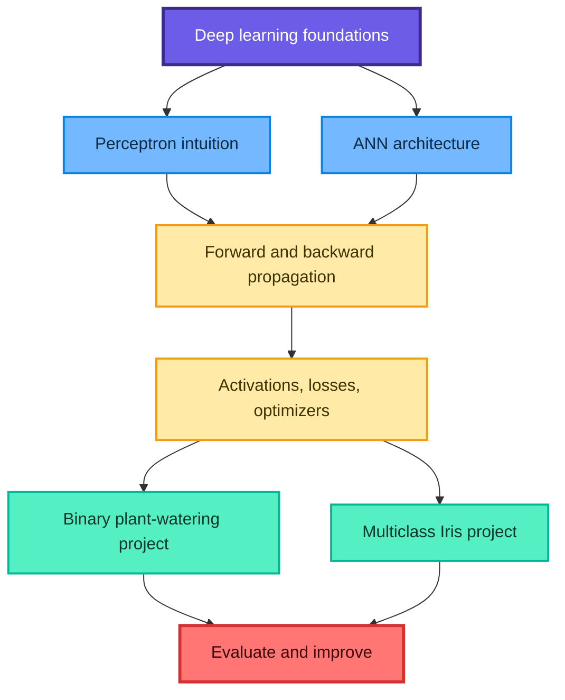

## Contents

1. [What is deep learning?](#1-what-is-deep-learning)
2. [Why use deep learning?](#2-why-use-deep-learning)
3. [From a biological analogy to an artificial neuron](#3-from-a-biological-analogy-to-an-artificial-neuron)
4. [The perceptron](#4-the-perceptron)
5. [Why one perceptron is not enough](#5-why-one-perceptron-is-not-enough)
6. [Artificial neural network architecture](#6-artificial-neural-network-architecture)
7. [Forward propagation](#7-forward-propagation)
8. [Backpropagation](#8-backpropagation)
9. [Activation functions](#9-activation-functions)
10. [Loss functions](#10-loss-functions)
11. [Gradient descent and optimizers](#11-gradient-descent-and-optimizers)
12. [Epochs, batches, and iterations](#12-epochs-batches-and-iterations)
13. [Training and validation diagnostics](#13-training-and-validation-diagnostics)
14. [Keras workflow](#14-keras-workflow)
15. [Corrected plant-watering project](#15-corrected-plant-watering-project)
16. [Corrected Iris classification project](#16-corrected-iris-classification-project)
17. [Evaluation metrics](#17-evaluation-metrics)
18. [Notebook corrections and common mistakes](#18-notebook-corrections-and-common-mistakes)
19. [When deep learning is the wrong tool](#19-when-deep-learning-is-the-wrong-tool)
20. [Practice questions with solutions](#20-practice-questions-with-solutions)
21. [Quick revision sheet](#21-quick-revision-sheet)

## 1. What is deep learning?

**Deep learning** is a part of machine learning that uses neural networks with multiple representation-learning layers. Instead of requiring a human to design every feature, the model can learn useful internal features from data while it learns the final prediction task.

For a tabular dataset, a traditional workflow may ask a human to build ratios, thresholds, and interaction features. A neural network instead learns successive transformations:

$$
x \longrightarrow a^{(1)} \longrightarrow a^{(2)} \longrightarrow \cdots \longrightarrow \hat{y}
$$

Here:

- $x$ is the input;
- $a^{(l)}$ is the representation learned at layer $l$;
- $\hat{y}$ is the model prediction.

### 1.1 AI, machine learning, and deep learning

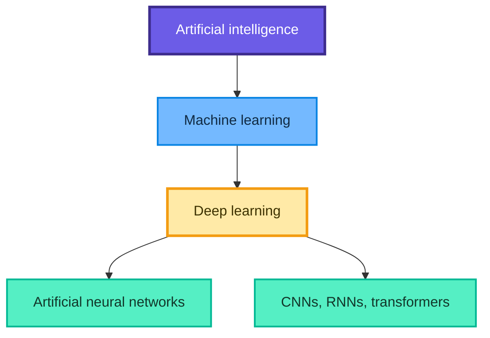

Deep learning is not automatically "ten times more powerful" than conventional machine learning. Performance depends on data quantity and quality, task structure, compute, evaluation design, and the strength of the baseline.

### 1.2 What makes a network "deep"?

There is no magical universal cutoff. In practice, "deep" means that the model has multiple trainable layers between its input and output, allowing a hierarchy of representations.

For an image model, early layers may respond to edges, intermediate layers to textures or shapes, and later layers to task-specific patterns. For tabular data, the learned hierarchy is less visually obvious but still represents nonlinear feature interactions.

### 1.3 Prerequisites

- Python and array operations
- supervised-learning basics
- train, validation, and test splits
- vectors and matrices
- derivatives and the chain rule
- probability and basic statistics

## 2. Why use deep learning?

### 2.1 Main advantages

- **Representation learning:** useful features can be learned jointly with the task.
- **Nonlinear modeling:** hidden layers approximate complicated relationships.
- **Scalability:** model capacity can grow with data and compute.
- **Unstructured data:** images, audio, text, and video are natural deep-learning domains.
- **End-to-end learning:** a single differentiable system can replace several hand-built stages.

### 2.2 When it is especially useful

Use deep learning when:

- the dataset is large enough for the problem complexity;
- inputs are high-dimensional or unstructured;
- feature interactions are complex;
- a strong conventional baseline has reached a ceiling;
- you have enough compute and a realistic validation process.

### 2.3 Costs and limitations

- training can be expensive;
- hyperparameters and random initialization affect results;
- large models can overfit, encode bias, or fail under distribution shift;
- internal reasoning is harder to summarize than a short linear equation;
- debugging data and evaluation often matters more than adding layers.

> Fun fact: deep learning is a modern name, but many central ideas are decades old. The recent acceleration came from larger datasets, faster hardware, improved optimization, and better architectures.

## 3. From a biological analogy to an artificial neuron

A biological neuron receives signals, combines them, and may transmit a new signal. An artificial neuron borrows this broad idea but is a mathematical function, not a realistic simulation of a brain cell.

An artificial neuron receives features $x_1,\ldots,x_d$, multiplies them by weights $w_1,\ldots,w_d$, adds a bias $b$, and applies an activation $\phi$:

$$
z=\sum_{j=1}^{d}w_jx_j+b=w^{\top}x+b
$$

$$
a=\phi(z)
$$

### 3.1 Vocabulary

| Term | Meaning | Intuition |
|---|---|---|
| Feature $x_j$ | One measured input | Soil moisture, temperature, petal width |
| Weight $w_j$ | Learned importance and direction | Positive supports the response; negative opposes it |
| Bias $b$ | Learned offset | Moves the decision boundary |
| Pre-activation $z$ | Weighted sum before activation | Raw evidence collected by the neuron |
| Activation $a$ | Transformed neuron output | Signal passed to the next layer |
| Parameter | A learned weight or bias | Values changed by the optimizer |
| Hyperparameter | A setting chosen outside training | Learning rate, layer width, batch size |

### 3.2 Why the bias is necessary

Without $b$, a linear decision boundary must pass through the origin. The bias allows the network to shift its threshold.

For one feature:

$$
z=wx+b=0
\quad\Longrightarrow\quad
x=-\frac{b}{w}
$$

Changing $b$ changes where the neuron switches behavior.

## 4. The perceptron

Frank Rosenblatt introduced the perceptron in 1958. It is a linear binary classifier and one of the clearest starting points for neural-network intuition.

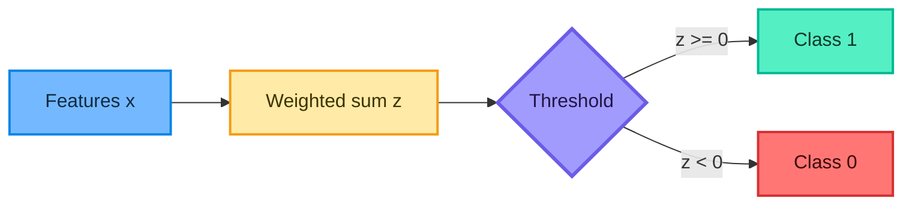

### 4.1 Prediction rule

For labels $y\in\{0,1\}$, the hard step function is

$$
\hat{y}=H(z)=
\begin{cases}
1, & z\ge 0\\
0, & z<0
\end{cases}
$$

The decision boundary is

$$
w^{\top}x+b=0
$$

In two dimensions, this is a line; in three dimensions, it is a plane; in higher dimensions, it is a hyperplane.

### 4.2 Learning rule

For one observation $(x_i,y_i)$:

$$
w\leftarrow w+\eta(y_i-\hat{y}_i)x_i
$$

$$
b\leftarrow b+\eta(y_i-\hat{y}_i)
$$

The learning rate $\eta>0$ controls the size of each correction.

- Correct prediction: $y_i-\hat{y}_i=0$, so no update.
- False negative: the update pushes the score upward.
- False positive: the update pushes the score downward.

### 4.3 Worked neuron example

Suppose

$$
x=
\begin{bmatrix}
2\\1\\3
\end{bmatrix},
\quad
w=
\begin{bmatrix}
0.5\\-0.2\\0.1
\end{bmatrix},
\quad b=0.1
$$

Then

$$
z=(0.5)(2)+(-0.2)(1)+(0.1)(3)+0.1=1.2
$$

With a hard threshold at zero, $\hat{y}=1$. With a sigmoid output,

$$
\hat{p}=\sigma(1.2)=\frac{1}{1+e^{-1.2}}\approx0.7685
$$

The hard perceptron gives a class, while the sigmoid neuron gives a score between 0 and 1 that is often interpreted as a probability after suitable training and calibration.

### 4.4 A minimal NumPy perceptron

```python
import numpy as np


class BinaryPerceptron:
    """Small educational perceptron for labels 0 and 1."""

    def __init__(self, learning_rate: float = 0.1, epochs: int = 20):
        self.learning_rate = learning_rate
        self.epochs = epochs

    def fit(self, X: np.ndarray, y: np.ndarray):
        # One weight per feature and one independent bias.
        self.weights_ = np.zeros(X.shape[1], dtype=float)
        self.bias_ = 0.0

        for _ in range(self.epochs):
            for row, target in zip(X, y):
                score = row @ self.weights_ + self.bias_
                prediction = int(score >= 0.0)
                error = target - prediction

                # A nonzero error moves the boundary toward a correction.
                self.weights_ += self.learning_rate * error * row
                self.bias_ += self.learning_rate * error

        return self

    def predict(self, X: np.ndarray) -> np.ndarray:
        scores = X @ self.weights_ + self.bias_
        return (scores >= 0.0).astype(int)
```

**When:** use a perceptron to learn linear-separability, weight updates, and decision boundaries. For production, compare it against regularized logistic regression and other strong baselines.

## 5. Why one perceptron is not enough

### 5.1 Linear-separability limitation

A single perceptron can learn only one linear boundary. It cannot solve XOR:

| $x_1$ | $x_2$ | XOR |
|---:|---:|---:|
| 0 | 0 | 0 |
| 0 | 1 | 1 |
| 1 | 0 | 1 |
| 1 | 1 | 0 |

No one straight line separates both positive corners from both negative corners.

### 5.2 Why hidden layers help

Different hidden neurons can learn different boundaries. A later neuron combines those intermediate regions into a nonlinear final decision.

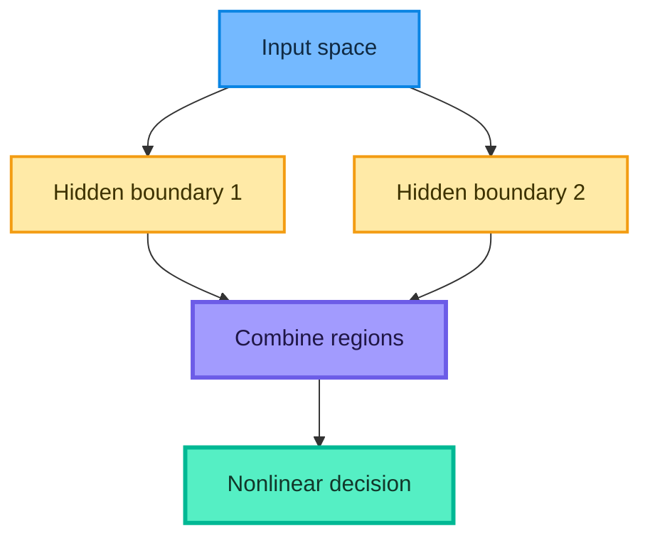

Nonlinearity is essential. Stacking only linear layers still produces one linear function:

$$
W_2(W_1x+b_1)+b_2=(W_2W_1)x+(W_2b_1+b_2)
$$

Therefore, depth without nonlinear activation does not create a nonlinear classifier.

## 6. Artificial neural network architecture

An **artificial neural network (ANN)** connects many artificial neurons in layers.

- **Input layer:** receives features but usually performs no trainable transformation.
- **Hidden layer:** learns an intermediate representation.
- **Output layer:** produces a task-specific prediction.

### 6.1 Dense layer

Using column-vector notation, a dense layer computes

$$
z^{(l)}=W^{(l)}a^{(l-1)}+b^{(l)}
$$

$$
a^{(l)}=\phi^{(l)}\left(z^{(l)}\right)
$$

If the previous layer has $n_{l-1}$ units and the current layer has $n_l$ units:

$$
W^{(l)}\in\mathbb{R}^{n_l\times n_{l-1}},
\qquad
b^{(l)}\in\mathbb{R}^{n_l}
$$

Frameworks usually store a mini-batch as rows. With this convention, the equivalent vectorized computation is

$$
Z_{\mathrm{batch}}^{(l)}
=A_{\mathrm{batch}}^{(l-1)}\left(W^{(l)}\right)^{\top}+b^{(l)}
$$

### 6.2 Parameter count

A dense layer contains

$$
\text{parameters}=n_{l-1}n_l+n_l=(n_{l-1}+1)n_l
$$

Example: a network with 4 inputs, hidden layers of 16 and 8 units, and 3 outputs has

$$
(4+1)(16)+(16+1)(8)+(8+1)(3)
=80+136+27=243
$$

trainable parameters.

### 6.3 Architecture notation

The Iris network from the source can be summarized as

$$
4\rightarrow16\rightarrow8\rightarrow3
$$

The hidden layers use ReLU; the three-class output uses softmax.

### 6.4 Width versus depth

- More **width** gives a layer more parallel features.
- More **depth** allows repeated composition.
- More capacity can reduce underfitting but increase overfitting, compute, and optimization difficulty.

There is no rule that more layers always produce a better model.

## 7. Forward propagation

Forward propagation computes predictions from input to output using the current parameters.

For layer $l$:

$$
z^{(l)}=W^{(l)}a^{(l-1)}+b^{(l)}
$$

$$
a^{(l)}=\phi^{(l)}\left(z^{(l)}\right)
$$

with $a^{(0)}=x$.

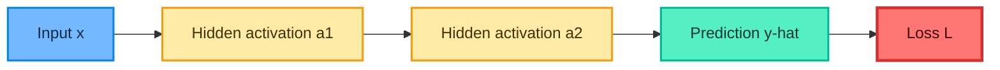

### 7.1 One-neuron NumPy calculation

```python
import numpy as np

x = np.array([2.0, 1.0, 3.0])
w = np.array([0.5, -0.2, 0.1])
b = 0.1

z = x @ w + b
probability = 1.0 / (1.0 + np.exp(-z))

print(f"z={z:.1f}")                 # z=1.2
print(f"sigmoid(z)={probability:.4f}")  # sigmoid(z)=0.7685
```

### 7.2 Why vectorization matters

Matrix multiplication evaluates many neurons and examples together. Optimized numerical libraries and accelerators can execute these operations far more efficiently than deeply nested Python loops.

## 8. Backpropagation

**Backpropagation** efficiently computes how the loss changes with every parameter. It applies the chain rule from the output layer toward the input layer.

Backpropagation calculates gradients; an optimizer uses those gradients to update parameters. These are related but distinct jobs.

### 8.1 Chain-rule intuition

If loss $L$ depends on activation $a$, which depends on pre-activation $z$, which depends on weight $w$, then

$$
\frac{\partial L}{\partial w}
=\frac{\partial L}{\partial a}
\frac{\partial a}{\partial z}
\frac{\partial z}{\partial w}
$$

Each factor answers a local question. Their product measures the total influence of $w$ on the loss.

### 8.2 Layer-wise equations

For the output layer $L$:

$$
\delta^{(L)}=
\nabla_{a^{(L)}}\mathcal{L}
\odot
\phi'\left(z^{(L)}\right)
$$

For hidden layer $l$:

$$
\delta^{(l)}=
\left(W^{(l+1)}\right)^{\top}\delta^{(l+1)}
\odot
\phi'\left(z^{(l)}\right)
$$

The gradients are

$$
\frac{\partial\mathcal{L}}{\partial W^{(l)}}
=\delta^{(l)}\left(a^{(l-1)}\right)^{\top}
$$

$$
\frac{\partial\mathcal{L}}{\partial b^{(l)}}=\delta^{(l)}
$$

and gradient descent updates

$$
W^{(l)}\leftarrow W^{(l)}-\eta
\frac{\partial\mathcal{L}}{\partial W^{(l)}}
$$

### 8.3 Sigmoid plus binary cross-entropy simplification

For $p=\sigma(z)$ and binary cross-entropy, the derivative with respect to the output logit simplifies to

$$
\frac{\partial L}{\partial z}=p-y
$$

This elegant cancellation is one reason activation-loss pairings matter.

### 8.4 Training loop intuition

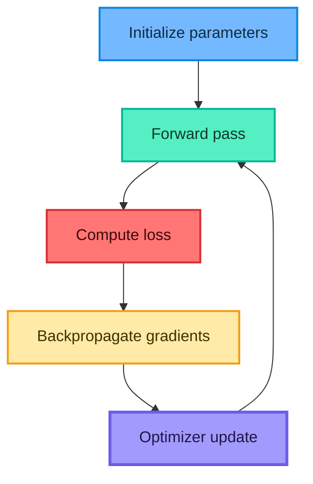

**When:** backpropagation is used during training. Inference normally performs only the forward pass.

## 9. Activation functions

An activation function transforms a neuron's pre-activation $z$. Hidden-layer nonlinearities let the network learn relationships that cannot be expressed by one linear boundary.

### 9.1 Choosing an activation

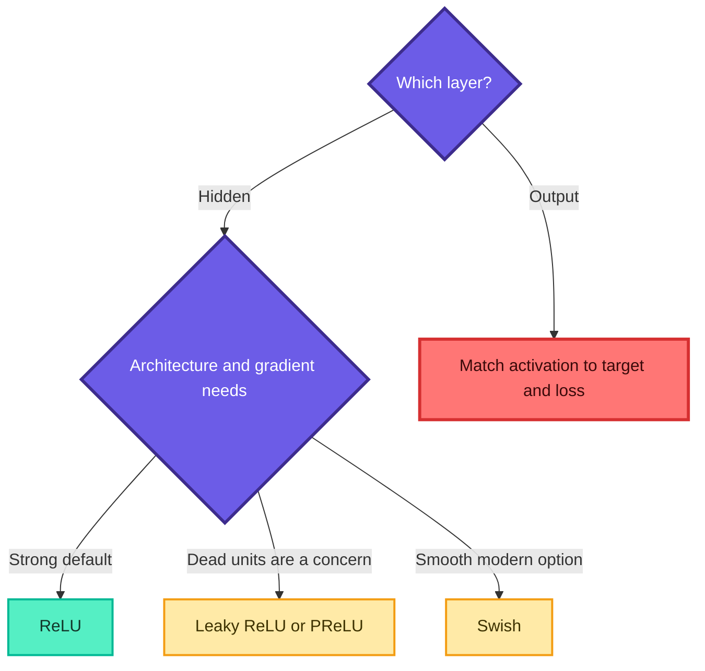

### 9.2 Linear activation

$$
\phi(z)=z,
\qquad
\phi'(z)=1
$$

**What:** it returns the weighted sum unchanged.

**When:** commonly used in the output layer for unconstrained regression.

**Why not in every hidden layer:** a stack of linear transformations collapses into a single linear transformation.

### 9.3 Sigmoid

$$
\sigma(z)=\frac{1}{1+e^{-z}}
$$

Range:

$$
0<\sigma(z)<1
$$

Derivative:

$$
\sigma'(z)=\sigma(z)(1-\sigma(z))
$$

**When:** one output unit for binary classification, or one sigmoid per label for multi-label classification.

**Advantages:** bounded, smooth, and naturally maps a score into $(0,1)$.

**Limitations:** not zero-centered and saturates for large $|z|$. Because

$$
0<\sigma'(z)\le\frac{1}{4},
$$

repeated multiplication can shrink gradients in deep networks.

### 9.4 Hyperbolic tangent

$$
\tanh(z)=\frac{e^z-e^{-z}}{e^z+e^{-z}}
$$

$$
-1<\tanh(z)<1
$$

$$
\frac{d}{dz}\tanh(z)=1-\tanh^2(z)
$$

**Why:** it is zero-centered, unlike sigmoid.

**When:** historically common in recurrent or shallow hidden layers.

**Limitation:** it still saturates and can suffer from vanishing gradients.

### 9.5 ReLU

$$
\operatorname{ReLU}(z)=\max(0,z)
$$

$$
\operatorname{ReLU}'(z)=
\begin{cases}
0, & z<0\\
1, & z>0
\end{cases}
$$

At $z=0$, software uses a chosen subgradient convention.

**Why:** it is cheap and preserves a strong positive-side gradient.

**When:** the default hidden activation for many dense and convolutional networks.

**Limitation:** if a unit remains in the negative region, its gradient is zero and it may become a "dead ReLU."

### 9.6 Leaky ReLU

$$
\operatorname{LeakyReLU}_{\alpha}(z)=
\begin{cases}
z, & z\ge 0\\
\alpha z, & z<0
\end{cases}
$$

where $\alpha$ is a small fixed positive slope such as $0.01$.

**Why:** negative inputs retain a small gradient.

**When:** try it when ordinary ReLU units die or negative activations may be informative.

### 9.7 PReLU

PReLU has the same piecewise form as Leaky ReLU, but $\alpha$ is learned:

$$
\operatorname{PReLU}(z)=\max(0,z)+\alpha\min(0,z)
$$

**Benefit:** the model learns its negative slope.

**Cost:** additional parameters and an increased chance of overfitting on very small datasets.

### 9.8 Swish or SiLU

$$
\operatorname{Swish}(z)=z\sigma(z)
$$

**Why:** it is smooth and mildly non-monotonic. Large positive inputs behave approximately linearly, while negative inputs are softly suppressed rather than always set to zero.

**When:** useful as a modern alternative in deeper networks, although it is more expensive than ReLU and is not guaranteed to win on every dataset.

### 9.9 Vanishing and exploding gradients

In a deep composition, the chain rule multiplies many derivatives:

$$
\frac{\partial L}{\partial W^{(1)}}
=
\frac{\partial L}{\partial a^{(L)}}
\prod_{l=2}^{L}
\frac{\partial a^{(l)}}{\partial a^{(l-1)}}
\frac{\partial a^{(1)}}{\partial W^{(1)}}
$$

- If typical derivative magnitudes are below 1, the product may approach 0: **vanishing gradient**.
- If they are consistently above 1, the product may become extremely large: **exploding gradient**.

Common remedies include ReLU-family activations, suitable initialization, normalization layers, residual connections, gated recurrent units, and gradient clipping for exploding gradients.

### 9.10 Activation summary

| Function | Range | Hidden layer? | Output layer? | Main caution |
|---|---|---|---|---|
| Linear | $(-\infty,\infty)$ | Usually no | Regression | Cannot add nonlinearity |
| Sigmoid | $(0,1)$ | Rare in deep dense networks | Binary or multi-label | Saturation |
| Tanh | $(-1,1)$ | Sometimes | Specialized bounded output | Saturation |
| ReLU | $[0,\infty)$ | Strong default | Rare | Dead units |
| Leaky ReLU | $(-\infty,\infty)$ | Yes | Rare | Fixed negative slope |
| PReLU | $(-\infty,\infty)$ | Yes | Rare | Adds parameters |
| Swish | Approximately $(-0.278,\infty)$ | Yes | Rare | More computation |

> Fun fact: ReLU looks simpler than sigmoid, yet this simplicity is one reason it trains deep networks effectively.

## 10. Loss functions

A **loss function** assigns a numerical penalty to a prediction. Training searches for parameters that reduce average loss.

Metrics such as accuracy summarize performance for humans. They often are not suitable training objectives because they are discontinuous or do not describe confidence.

### 10.1 Output, loss, and target must agree

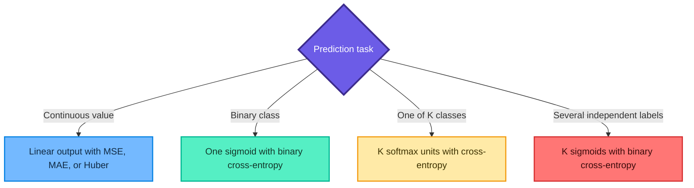

### 10.2 Mean squared error

For $N$ observations:

$$
\operatorname{MSE}=\frac{1}{N}\sum_{i=1}^{N}(y_i-\hat{y}_i)^2
$$

**Why:** squaring makes the loss differentiable and heavily penalizes large errors.

**When:** standard regression when large errors deserve extra cost.

**Caution:** outliers can dominate because errors are squared.

### 10.3 Mean absolute error

$$
\operatorname{MAE}=\frac{1}{N}\sum_{i=1}^{N}|y_i-\hat{y}_i|
$$

**Why:** every unit of error contributes linearly.

**When:** regression where robustness to large outliers matters.

**Caution:** it is not differentiable at zero, though optimizers can use subgradients.

### 10.4 Huber loss

Let residual $r=y-\hat{y}$ and threshold $\delta>0$:

$$
L_{\delta}(r)=
\begin{cases}
\frac{1}{2}r^2, & |r|\le\delta\\
\delta\left(|r|-\frac{1}{2}\delta\right), & |r|>\delta
\end{cases}
$$

**Why:** it behaves like MSE for small errors and MAE for large errors.

**When:** regression requiring smooth optimization with some outlier resistance.

### 10.5 Mean squared logarithmic error

For nonnegative targets and predictions:

$$
\operatorname{MSLE}
=\frac{1}{N}\sum_{i=1}^{N}
\left[\log(1+y_i)-\log(1+\hat{y}_i)\right]^2
$$

**When:** relative or multiplicative differences matter more than absolute differences.

**Caution:** do not use it with negative targets. The PDF shorthand that resembles "MSQE" should be understood as MSLE in this context.

### 10.6 Binary cross-entropy

For target $y\in\{0,1\}$ and predicted probability $p$:

$$
L_{\mathrm{BCE}}
=-\left[y\log(p)+(1-y)\log(1-p)\right]
$$

For $N$ examples:

$$
\operatorname{BCE}
=-\frac{1}{N}\sum_{i=1}^{N}
\left[y_i\log(p_i)+(1-y_i)\log(1-p_i)\right]
$$

Confident wrong predictions receive a large penalty. In practice, framework implementations use numerically stable operations and clip or combine logits internally.

### 10.7 Softmax

For class logits $z_1,\ldots,z_K$:

$$
p_k=\frac{e^{z_k}}{\sum_{j=1}^{K}e^{z_j}}
$$

The outputs satisfy

$$
0<p_k<1,
\qquad
\sum_{k=1}^{K}p_k=1
$$

To avoid overflow, implementations use a shifted but equivalent form:

$$
p_k=
\frac{e^{z_k-z_{\max}}}
{\sum_j e^{z_j-z_{\max}}}
$$

### 10.8 Categorical cross-entropy

For one-hot target vector $y$:

$$
L_{\mathrm{CCE}}=-\sum_{k=1}^{K}y_k\log(p_k)
$$

Only the true-class term remains nonzero. With integer labels, use sparse categorical cross-entropy; with one-hot labels, use categorical cross-entropy.

### 10.9 Loss summary

| Task | Output | Target format | Typical loss |
|---|---|---|---|
| Regression | 1 or more linear units | Continuous | MSE, MAE, Huber |
| Binary classification | 1 sigmoid | 0 or 1 | Binary cross-entropy |
| Multiclass classification | $K$ softmax units | Integer | Sparse categorical cross-entropy |
| Multiclass classification | $K$ softmax units | One-hot | Categorical cross-entropy |
| Multi-label classification | $K$ sigmoids | $K$ binary indicators | Binary cross-entropy |

## 11. Gradient descent and optimizers

An optimizer converts gradients into parameter updates. The simplest rule is

$$
\theta_{t+1}=\theta_t-\eta\nabla_{\theta}L(\theta_t)
$$

where $\eta$ is the learning rate.

### 11.1 Learning-rate intuition

- Too small: learning is slow and may stop before reaching a good region.
- Too large: updates overshoot, oscillate, or diverge.
- Appropriate: the loss decreases reliably while training remains efficient.

### 11.2 Batch gradient descent

$$
g_t=\frac{1}{N}\sum_{i=1}^{N}\nabla_{\theta}L_i(\theta_t)
$$

It performs one update per epoch using all $N$ rows.

**Pros:** smooth, deterministic gradient for a fixed parameter state.

**Cons:** expensive in memory and waiting time for large datasets.

### 11.3 Stochastic gradient descent

$$
g_t=\nabla_{\theta}L_i(\theta_t)
$$

It updates after one sampled row.

**Pros:** starts learning immediately, low per-step memory, noise may help exploration.

**Cons:** noisy trajectory and inefficient hardware utilization when implemented one row at a time.

### 11.4 Mini-batch gradient descent

For batch $\mathcal{B}_t$ of size $B$:

$$
g_t=\frac{1}{B}\sum_{i\in\mathcal{B}_t}
\nabla_{\theta}L_i(\theta_t)
$$

This is the usual practical choice because vectorized hardware processes batches efficiently while updates occur more frequently than in full-batch training.

### 11.5 Momentum

$$
v_t=\beta v_{t-1}+(1-\beta)g_t
$$

$$
\theta_t=\theta_{t-1}-\eta v_t
$$

**Intuition:** a rolling velocity smooths noisy directions and carries movement through shallow regions.

### 11.6 AdaGrad

$$
G_t=G_{t-1}+g_t\odot g_t
$$

$$
\theta_t=\theta_{t-1}
-\eta\frac{g_t}{\sqrt{G_t}+\epsilon}
$$

AdaGrad gives smaller effective steps to coordinates that repeatedly receive large gradients.

**Strength:** useful for sparse features.

**Weakness:** $G_t$ only grows, so the effective learning rate may become too small.

### 11.7 RMSProp

$$
s_t=\rho s_{t-1}+(1-\rho)g_t\odot g_t
$$

$$
\theta_t=\theta_{t-1}
-\eta\frac{g_t}{\sqrt{s_t}+\epsilon}
$$

RMSProp replaces AdaGrad's unbounded accumulation with an exponential moving average.

### 11.8 Adam

Adam combines first-moment momentum with an adaptive second moment:

$$
m_t=\beta_1m_{t-1}+(1-\beta_1)g_t
$$

$$
v_t=\beta_2v_{t-1}+(1-\beta_2)g_t^2
$$

Bias corrections are

$$
\hat{m}_t=\frac{m_t}{1-\beta_1^t},
\qquad
\hat{v}_t=\frac{v_t}{1-\beta_2^t}
$$

and the update is

$$
\theta_t=\theta_{t-1}
-\eta\frac{\hat{m}_t}{\sqrt{\hat{v}_t}+\epsilon}
$$

**When:** a strong general starting optimizer for many neural-network problems.

**Caution:** Adam is not universally best. SGD with momentum can generalize very well after careful tuning.

### 11.9 Optimizer map

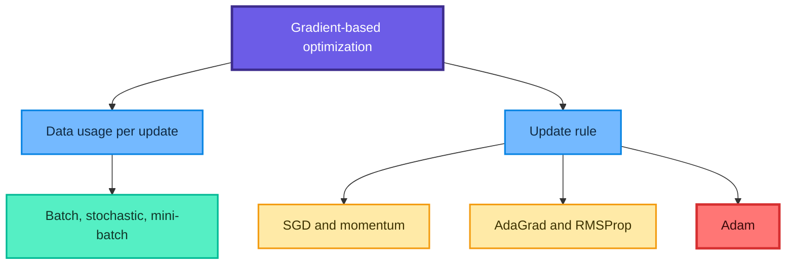

> Fun fact: Adam's name refers to adaptive moment estimation, not a person's name.

## 12. Epochs, batches, and iterations

### 12.1 Definitions

- **Sample:** one training observation.
- **Batch:** the samples used for one gradient update.
- **Iteration or step:** one optimizer update.
- **Epoch:** one pass through the training dataset.

For $N$ samples and batch size $B$:

$$
\text{steps per epoch}=\left\lceil\frac{N}{B}\right\rceil
$$

Across $E$ epochs:

$$
\text{total steps}=E\left\lceil\frac{N}{B}\right\rceil
$$

Example: $N=100{,}000$, $B=100$, and $E=20$ gives

$$
20\left\lceil\frac{100000}{100}\right\rceil
=20{,}000
$$

updates.

### 12.2 Comparison

| Strategy | Batch size | Updates per epoch | Gradient noise | Memory |
|---|---:|---:|---|---|
| Full batch | $N$ | 1 | Low | High |
| Pure SGD | 1 | $N$ | High | Low |
| Mini-batch | $1<B<N$ | $\lceil N/B\rceil$ | Moderate | Moderate |

### 12.3 Important correction for the plant notebook

The training partition has only 12 rows. A requested batch size of 100 is therefore not a 100-row mini-batch; it becomes an effective full batch of 12 rows. Also, fitting the same model repeatedly for different batch sizes continues training from its previous weights. A fair comparison requires a fresh, identically initialized model for each strategy.

## 13. Training and validation diagnostics

During training, Keras commonly records:

- `loss`: loss on training data;
- `accuracy`: training accuracy;
- `val_loss`: loss on held-out validation data;
- `val_accuracy`: validation accuracy.

### 13.1 How to read the curves

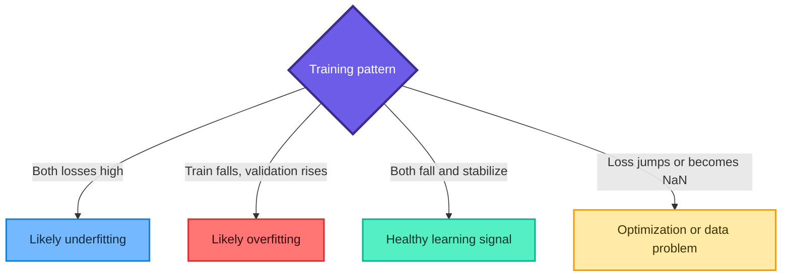

### 13.2 What to do

| Symptom | Possible response |
|---|---|
| Underfitting | Better features, more capacity, longer training, lower regularization |
| Overfitting | More data, smaller model, early stopping, dropout, weight decay |
| Oscillating loss | Lower learning rate, larger batch, normalize inputs |
| NaN loss | Check invalid values, extreme logits, learning rate, numerical stability |
| Large train-validation gap | Audit split, leakage, drift, imbalance, and model capacity |

Validation performance estimates generalization only when validation data represent future use. A biased or repeatedly tuned validation set can still mislead.

### 13.3 Early stopping

Early stopping monitors a validation quantity and stops after it fails to improve for a chosen patience period. Restoring the best weights avoids returning the last, possibly overfit epoch.

## 14. Keras workflow

Keras organizes an ANN project into a small number of operations:

1. prepare data;
2. define architecture;
3. compile loss, optimizer, and metrics;
4. fit on training data;
5. evaluate once on untouched test data;
6. predict new examples;
7. save preprocessing and model artifacts.

### 14.1 Minimal binary model

```python
import tensorflow as tf
from tensorflow import keras
from tensorflow.keras import layers

# Reproducibility improves comparison, although hardware may still vary.
tf.keras.utils.set_random_seed(42)

model = keras.Sequential(
    [
        # Input shape must be a one-element tuple for three features.
        keras.Input(shape=(3,)),
        layers.Dense(8, activation="relu"),
        layers.Dense(1, activation="sigmoid"),
    ],
    name="binary_ann",
)

optimizer = keras.optimizers.SGD(
    learning_rate=0.01,
    momentum=0.9,
)

model.compile(
    optimizer=optimizer,             # Pass the object, not "opt" as a string.
    loss="binary_crossentropy",
    metrics=["accuracy"],
)
```

### 14.2 Why `Sequential` fits these projects

Both supplied models are plain stacks: one tensor flows through each layer to one output tensor. A sequential model is appropriate for this topology. Multi-input, shared-layer, residual, or multi-output networks need the functional API or subclassing.

### 14.3 Model summary

```python
# Displays each layer's output shape and parameter count.
model.summary()
```

For the $3\rightarrow8\rightarrow1$ model:

$$
(3+1)(8)+(8+1)(1)=32+9=41
$$

trainable parameters.

### 14.4 Learning curves

```python
import matplotlib.pyplot as plt


def plot_learning_curves(history) -> None:
    """Plot training and validation loss from a Keras History."""
    history_frame = history.history

    plt.figure(figsize=(8, 4))
    plt.plot(history_frame["loss"], label="training loss")
    plt.plot(history_frame["val_loss"], label="validation loss")
    plt.xlabel("Epoch")
    plt.ylabel("Loss")
    plt.title("Learning curves")
    plt.legend()
    plt.tight_layout()
    plt.show()
```

## 15. Corrected plant-watering project

The `Basic.ipynb` notebook predicts `needs_water` from soil moisture, temperature, and sunlight. It is a binary classification problem:

$$
x=(\text{moisture},\text{temperature},\text{sunlight})
\longrightarrow
y\in\{0,1\}
$$

The dataset has only 16 rows, so this is a code demonstration rather than evidence of real agronomic performance.

### 15.1 Create the toy data

```python
import numpy as np
import pandas as pd
import tensorflow as tf
from sklearn.model_selection import train_test_split
from sklearn.preprocessing import MinMaxScaler
from tensorflow import keras
from tensorflow.keras import layers

SEED = 42
tf.keras.utils.set_random_seed(SEED)

plants = pd.DataFrame(
    {
        "soil_moisture": [
            0.10, 0.15, 0.20, 0.25, 0.40, 0.60, 0.35, 0.18,
            0.45, 0.05, 0.80, 0.27, 0.55, 0.70, 0.12, 0.30,
        ],
        "temperature_c": [
            34, 30, 26, 22, 28, 30, 19, 22,
            35, 24, 33, 33, 21, 25, 20, 29,
        ],
        "sunlight_hours": [
            9, 8, 7, 4, 8, 10, 3, 10,
            12, 5, 9, 11, 2, 6, 1, 9,
        ],
        "needs_water": [
            1, 1, 1, 0, 0, 0, 0, 1,
            0, 1, 0, 1, 0, 0, 1, 1,
        ],
    }
)

feature_names = ["soil_moisture", "temperature_c", "sunlight_hours"]
X = plants[feature_names]
y = plants["needs_water"]
```

### 15.2 Split before scaling

```python
# First isolate the final test set.
X_build, X_test, y_build, y_test = train_test_split(
    X,
    y,
    test_size=0.25,
    random_state=SEED,
    stratify=y,
)

# Then create a validation set only from the remaining build data.
X_train, X_val, y_train, y_val = train_test_split(
    X_build,
    y_build,
    test_size=0.25,
    random_state=SEED,
    stratify=y_build,
)

# Learn minimum and maximum values only from training rows.
scaler = MinMaxScaler()
X_train_scaled = scaler.fit_transform(X_train)
X_val_scaled = scaler.transform(X_val)
X_test_scaled = scaler.transform(X_test)
```

Min-max scaling for training feature $j$ is

$$
x'_{ij}=
\frac{x_{ij}-x_{j,\min}^{\mathrm{train}}}
{x_{j,\max}^{\mathrm{train}}-x_{j,\min}^{\mathrm{train}}}
$$

The test set is transformed using the training-set minimum and maximum. It is never fitted separately.

### 15.3 Build and train the binary ANN

```python
def build_binary_ann(number_of_features: int) -> keras.Model:
    """Return a freshly initialized binary classifier."""
    model = keras.Sequential(
        [
            keras.Input(shape=(number_of_features,)),
            layers.Dense(8, activation="relu"),
            layers.Dense(1, activation="sigmoid"),
        ],
        name="plant_watering_ann",
    )

    optimizer = keras.optimizers.SGD(
        learning_rate=0.01,
        momentum=0.9,
    )

    model.compile(
        optimizer=optimizer,
        loss="binary_crossentropy",
        metrics=["accuracy"],
    )
    return model


plant_model = build_binary_ann(X_train_scaled.shape[1])

early_stopping = keras.callbacks.EarlyStopping(
    monitor="val_loss",
    patience=20,
    restore_best_weights=True,
)

plant_history = plant_model.fit(
    X_train_scaled,
    y_train.to_numpy(),
    validation_data=(X_val_scaled, y_val.to_numpy()),
    epochs=300,
    batch_size=4,
    callbacks=[early_stopping],
    verbose=0,
)

test_loss, test_accuracy = plant_model.evaluate(
    X_test_scaled,
    y_test.to_numpy(),
    verbose=0,
)

print(f"test_loss={test_loss:.4f}")
print(f"test_accuracy={test_accuracy:.4f}")
```

Because the test set contains only four rows, one changed prediction moves accuracy by $25$ percentage points. Do not treat this estimate as stable.

### 15.4 Predict a new plant

```python
new_plant = pd.DataFrame(
    [[0.16, 31.0, 8.0]],
    columns=feature_names,
)

# Reuse the fitted training scaler.
new_plant_scaled = scaler.transform(new_plant)
water_probability = float(plant_model.predict(new_plant_scaled, verbose=0)[0, 0])
predicted_class = int(water_probability >= 0.5)

print(f"P(needs water)={water_probability:.3f}")
print(f"predicted class={predicted_class}")
```

The $0.5$ threshold is a default, not a law. Choose a threshold using validation data and the relative cost of over-watering versus under-watering.

### 15.5 Compare batch strategies fairly

```python
batch_sizes = {
    "stochastic": 1,
    "mini_batch": 4,
    "full_batch": len(X_train_scaled),
}

histories = {}

for strategy, batch_size in batch_sizes.items():
    # Reset the seed and create a new model for a fairer comparison.
    tf.keras.utils.set_random_seed(SEED)
    candidate = build_binary_ann(X_train_scaled.shape[1])

    histories[strategy] = candidate.fit(
        X_train_scaled,
        y_train.to_numpy(),
        validation_data=(X_val_scaled, y_val.to_numpy()),
        epochs=100,
        batch_size=batch_size,
        shuffle=True,
        verbose=0,
    )
```

Even this comparison is too small for strong conclusions. Repeat runs across several seeds and use a larger dataset.

### 15.6 Save the complete inference artifacts

```python
import joblib

# Keras stores the network architecture and learned parameters.
plant_model.save("plant_watering_model.keras")

# The scaler and feature order are also required at inference time.
joblib.dump(
    {
        "scaler": scaler,
        "feature_names": feature_names,
        "threshold": 0.5,
    },
    "plant_watering_preprocessing.joblib",
)
```

## 16. Corrected Iris classification project

The Iris dataset has 150 flowers, four numeric measurements, and three balanced species classes:

- setosa;
- versicolor;
- virginica.

This is mutually exclusive multiclass classification, so the output needs three softmax units.

### 16.1 Self-contained data loading and splitting

```python
import numpy as np
import tensorflow as tf
from sklearn.datasets import load_iris
from sklearn.model_selection import train_test_split
from sklearn.preprocessing import StandardScaler
from tensorflow import keras
from tensorflow.keras import layers

SEED = 42
tf.keras.utils.set_random_seed(SEED)

# load_iris avoids depending on a separately downloaded Iris.csv file.
iris = load_iris(as_frame=True)
X = iris.data
y = iris.target
class_names = iris.target_names

# 60% train, 20% validation, and 20% test.
X_train, X_temp, y_train, y_temp = train_test_split(
    X,
    y,
    test_size=0.40,
    random_state=SEED,
    stratify=y,
)

X_val, X_test, y_val, y_test = train_test_split(
    X_temp,
    y_temp,
    test_size=0.50,
    random_state=SEED,
    stratify=y_temp,
)

# Fit only on the training partition.
scaler = StandardScaler()
X_train_scaled = scaler.fit_transform(X_train)
X_val_scaled = scaler.transform(X_val)
X_test_scaled = scaler.transform(X_test)
```

Standardization is

$$
x'_{ij}=\frac{x_{ij}-\mu_j^{\mathrm{train}}}{s_j^{\mathrm{train}}}
$$

The same training mean $\mu_j^{\mathrm{train}}$ and scale $s_j^{\mathrm{train}}$ must transform validation, test, and future observations.

### 16.2 Perceptron baseline

```python
from sklearn.linear_model import Perceptron
from sklearn.metrics import accuracy_score

perceptron = Perceptron(
    max_iter=1_000,
    tol=1e-3,
    random_state=SEED,
)
perceptron.fit(X_train_scaled, y_train)

baseline_prediction = perceptron.predict(X_test_scaled)
baseline_accuracy = accuracy_score(y_test, baseline_prediction)
print(f"Perceptron test accuracy: {baseline_accuracy:.3f}")
```

Scikit-learn extends its perceptron to multiclass tasks using multiple linear classifiers. Therefore, describing the library class as binary-only is incomplete.

### 16.3 Build the ANN

```python
iris_model = keras.Sequential(
    [
        keras.Input(shape=(4,)),
        layers.Dense(16, activation="relu"),
        layers.Dropout(0.10),
        layers.Dense(8, activation="relu"),
        layers.Dense(3, activation="softmax"),
    ],
    name="iris_ann",
)

iris_model.compile(
    optimizer=keras.optimizers.Adam(learning_rate=0.001),
    # Integer labels 0, 1, and 2 make the sparse loss convenient.
    loss="sparse_categorical_crossentropy",
    metrics=["accuracy"],
)

iris_model.summary()
```

The dense layers contain 243 parameters. Dropout has no trainable parameters.

### 16.4 Train with validation data

```python
early_stopping = keras.callbacks.EarlyStopping(
    monitor="val_loss",
    patience=25,
    restore_best_weights=True,
)

iris_history = iris_model.fit(
    X_train_scaled,
    y_train.to_numpy(),
    validation_data=(X_val_scaled, y_val.to_numpy()),
    epochs=500,
    batch_size=16,
    callbacks=[early_stopping],
    verbose=0,
)
```

Dropout is active during training and disabled during ordinary evaluation and prediction. It randomly masks activations and rescales the remaining signal, discouraging brittle co-adaptation.

### 16.5 Evaluate once on the test set

```python
from sklearn.metrics import classification_report, confusion_matrix

test_loss, test_accuracy = iris_model.evaluate(
    X_test_scaled,
    y_test.to_numpy(),
    verbose=0,
)

class_probabilities = iris_model.predict(X_test_scaled, verbose=0)
ann_prediction = np.argmax(class_probabilities, axis=1)

print(f"ANN test loss: {test_loss:.4f}")
print(f"ANN test accuracy: {test_accuracy:.4f}")
print(confusion_matrix(y_test, ann_prediction))
print(
    classification_report(
        y_test,
        ann_prediction,
        target_names=class_names,
        digits=3,
    )
)
```

The source notebook displayed approximately $0.9333$ test accuracy for one run. Because its TensorFlow seed was not fixed and its test set was independently refitted by `StandardScaler`, that number should be treated as a notebook observation, not a guaranteed corrected result.

### 16.6 Predict a new flower

```python
new_flower = np.array([[5.9, 3.0, 5.1, 1.8]])
new_flower_scaled = scaler.transform(new_flower)

probabilities = iris_model.predict(new_flower_scaled, verbose=0)[0]
predicted_index = int(np.argmax(probabilities))

print("Probabilities:", dict(zip(class_names, probabilities.round(3))))
print("Predicted species:", class_names[predicted_index])
```

### 16.7 Project workflow

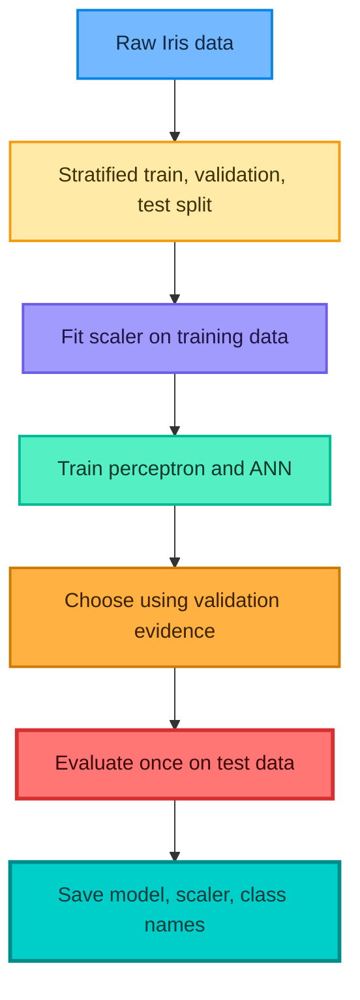

## 17. Evaluation metrics

### 17.1 Accuracy

$$
\operatorname{accuracy}=
\frac{\text{number of correct predictions}}
{\text{number of predictions}}
$$

Accuracy is intuitive but can hide minority-class failure.

### 17.2 Precision and recall

For one class:

$$
\operatorname{precision}=\frac{TP}{TP+FP}
$$

$$
\operatorname{recall}=\frac{TP}{TP+FN}
$$

- Precision asks: when the model predicted this class, how often was it right?
- Recall asks: among all real examples of this class, how many did it find?

### 17.3 F1 score

$$
F_1=2\frac{\operatorname{precision}\cdot\operatorname{recall}}
{\operatorname{precision}+\operatorname{recall}}
$$

Macro-F1 averages class F1 scores equally:

$$
F_{1,\mathrm{macro}}=\frac{1}{K}\sum_{k=1}^{K}F_{1,k}
$$

### 17.4 Confusion matrix

For multiclass classification:

$$
C_{ij}=\#\{\text{examples with true class }i
\text{ and predicted class }j\}
$$

The matrix reveals which species or classes are confused. On Iris, setosa is usually easy to separate, while versicolor and virginica overlap more.

### 17.5 Loss versus metric

| Quantity | Used for gradient training? | Main role |
|---|---|---|
| Cross-entropy | Yes | Penalizes probability quality |
| Accuracy | Usually no | Counts correct classes |
| Precision or recall | Usually no | Measures error type for a class |
| F1 | Usually no | Balances precision and recall |

## 18. Notebook corrections and common mistakes

| Source pattern | Why it is a problem | Correct approach |
|---|---|---|
| Scale the complete plant dataset before splitting | Test statistics influence preprocessing | Split first; fit scaler only on training data |
| `X_test_scaled = scaler.fit_transform(X_test)` | Learns a different test coordinate system | Use `scaler.transform(X_test)` |
| `Input(shape=(X_train.shape[1]))` | Parentheses around one integer do not make a tuple | Use `Input(shape=(X_train.shape[1],))` |
| `optimizer="opt"` | `"opt"` is not a built-in optimizer identifier | Pass `optimizer=opt` or a valid name such as `"adam"` |
| Define `opt` after compiling | The object is unavailable when needed | Create optimizer before `compile()` |
| Fit the same model three times to compare batches | Later fits start from already trained weights | Build a fresh, seeded model per strategy |
| Batch size 100 on 12 training rows | It becomes effective full-batch training | Compare 1, a true intermediate size, and the train size |
| Use test data as validation during iterative tuning | Test performance influences choices | Keep separate validation and final test sets |
| No TensorFlow random seed | Results vary unnecessarily between runs | Set seeds and report variability across runs |
| `Dense(..., input_dim=4)` in a modern sequential model | Less explicit and may raise a warning | Start with `keras.Input(shape=(4,))` |
| Claim validation always represents reality | Validation can be unrepresentative | Match the deployment population and time period |
| Call every neural network decision inexplicable | ANN interpretation is difficult but not impossible | Use ablation, gradients, SHAP-style methods, and error analysis carefully |

### 18.1 Data leakage rule

Any transformation that learns state must fit only on training data. This includes scaling, imputation, feature selection, PCA, vocabulary construction, and target encoding.

$$
\text{fit on train}
\quad\longrightarrow\quad
\text{transform train, validation, test, future}
$$

### 18.2 Small-data warning

With only 16 plant rows and 150 Iris rows, model rankings are unstable. Good practice includes:

- repeated stratified cross-validation for conventional baselines;
- several neural-network seeds;
- confidence intervals where practical;
- honest reporting of split sizes;
- no repeated optimization against the final test set.

## 19. When deep learning is the wrong tool

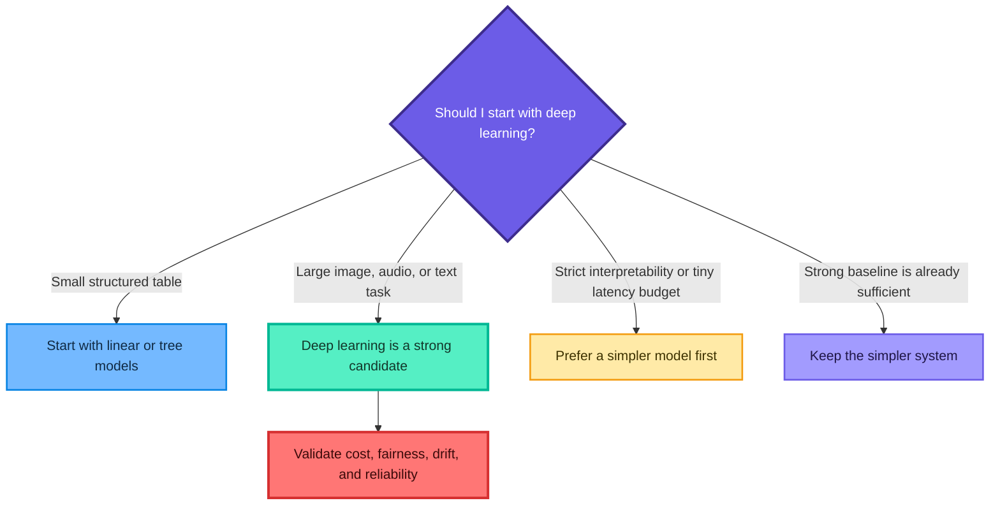

For small tabular problems, logistic regression, random forests, gradient boosting, and support vector machines are often faster, easier to tune, and competitive. Deep learning should earn its additional complexity through evidence.

The perceptron and Iris examples are still valuable because they expose the mechanics of neural networks in a setting that is easy to understand.

## 20. Practice questions with solutions

### Question 1: Weighted sum

A neuron receives $x=(2,1,3)$, $w=(0.5,-0.2,0.1)$, and $b=0.1$. Calculate $z$.

<details>
<summary>Solution</summary>

$$
z=w^{\top}x+b
$$

$$
z=(0.5)(2)+(-0.2)(1)+(0.1)(3)+0.1=1.2
$$

The pre-activation is $1.2$.

</details>

### Question 2: Sigmoid output

Using the $z=1.2$ from Question 1, calculate the sigmoid output.

<details>
<summary>Solution</summary>

$$
\sigma(1.2)=\frac{1}{1+e^{-1.2}}\approx0.7685
$$

The neuron assigns a score of approximately $0.7685$ to class 1.

</details>

### Question 3: Perceptron update

A perceptron predicts $\hat{y}=0$ for a row whose target is $y=1$. If $x=(2,-1)$, $\eta=0.1$, $w=(0.3,0.4)$, and $b=-0.2$, perform one update.

<details>
<summary>Solution</summary>

The error is

$$
y-\hat{y}=1-0=1
$$

Therefore,

$$
w_{\mathrm{new}}
=w+\eta(y-\hat{y})x
$$

$$
w_{\mathrm{new}}
=(0.3,0.4)+0.1(1)(2,-1)
=(0.5,0.3)
$$

and

$$
b_{\mathrm{new}}=-0.2+0.1(1)=-0.1
$$

</details>

### Question 4: XOR

Why can one perceptron not solve the XOR problem?

<details>
<summary>Solution</summary>

One perceptron creates only one linear decision boundary. XOR places the positive points at opposite corners and the negative points at the other two corners, so no one line separates the classes. Hidden nonlinear units can create and combine multiple boundaries.

</details>

### Question 5: Why hidden activations matter

What happens if every layer in a deep network uses a linear activation?

<details>
<summary>Solution</summary>

The complete network collapses into one linear transformation. For two layers:

$$
W_2(W_1x+b_1)+b_2
=(W_2W_1)x+(W_2b_1+b_2)
$$

Adding more linear layers does not let the model learn nonlinear boundaries.

</details>

### Question 6: Dense-layer parameters

How many trainable parameters are in a dense layer with 5 inputs and 12 output neurons?

<details>
<summary>Solution</summary>

There are $5\times12$ weights and 12 biases:

$$
(5+1)(12)=72
$$

</details>

### Question 7: Complete network parameters

Calculate the parameters in a $4\rightarrow16\rightarrow8\rightarrow3$ dense network.

<details>
<summary>Solution</summary>

$$
(4+1)(16)=80
$$

$$
(16+1)(8)=136
$$

$$
(8+1)(3)=27
$$

Thus,

$$
80+136+27=243
$$

Dropout would add no trainable parameters.

</details>

### Question 8: Activation selection

Choose an output activation for each task: house-price regression, binary disease detection, and one-of-five image classes.

<details>
<summary>Solution</summary>

- House price: one linear output, assuming no explicit output constraint.
- Binary disease detection: one sigmoid output.
- One-of-five classes: five softmax outputs.

The output architecture follows the target structure.

</details>

### Question 9: Binary cross-entropy

For a positive example $y=1$, compare the binary cross-entropy when $p=0.9$ and when $p=0.1$.

<details>
<summary>Solution</summary>

For $y=1$:

$$
L=-\log(p)
$$

Thus,

$$
L(p=0.9)=-\log(0.9)\approx0.1054
$$

$$
L(p=0.1)=-\log(0.1)\approx2.3026
$$

The confidently wrong prediction receives a much larger penalty.

</details>

### Question 10: MSE versus MAE

Two predictions have absolute errors 2 and 10. Compare their contributions to MSE and MAE before averaging.

<details>
<summary>Solution</summary>

For MAE, the contributions are 2 and 10. The larger error is 5 times larger.

For MSE, the squared contributions are

$$
2^2=4,
\qquad
10^2=100
$$

The larger error contributes 25 times as much, showing why MSE is more sensitive to outliers.

</details>

### Question 11: Huber loss intuition

Why is Huber loss called a compromise between MSE and MAE?

<details>
<summary>Solution</summary>

Huber loss is quadratic for residuals near zero, giving smooth MSE-like optimization. Beyond threshold $\delta$, it grows linearly, reducing the influence of extreme errors like MAE.

</details>

### Question 12: Steps per epoch

A dataset contains 10,000 training rows. If batch size is 128, how many optimizer steps occur per epoch?

<details>
<summary>Solution</summary>

$$
\left\lceil\frac{10000}{128}\right\rceil
=\lceil78.125\rceil=79
$$

The final batch contains the remaining rows unless incomplete batches are explicitly dropped.

</details>

### Question 13: Batch-size interpretation

A dataset has 12 training rows and the requested batch size is 100. Is this mini-batch training with 100 rows?

<details>
<summary>Solution</summary>

No. A batch cannot contain 100 distinct training rows when only 12 exist. The framework uses an effective batch of 12 rows, so the configuration behaves like full-batch training with one update per epoch.

</details>

### Question 14: Backpropagation versus optimizer

What is the difference between backpropagation and an optimizer?

<details>
<summary>Solution</summary>

Backpropagation applies the chain rule to compute gradients such as $\partial L/\partial W$. The optimizer decides how to use those gradients, for example with SGD, momentum, RMSProp, or Adam, to update the parameters.

</details>

### Question 15: Vanishing gradient

If a gradient passes through 20 layers and each local derivative has magnitude $0.2$, what is the approximate multiplicative factor?

<details>
<summary>Solution</summary>

$$
0.2^{20}\approx1.0486\times10^{-14}
$$

The signal becomes extremely small, illustrating the vanishing-gradient problem.

</details>

### Question 16: Diagnose learning curves

Training loss continues to fall, while validation loss starts rising after epoch 30. What is the likely diagnosis and what can you do?

<details>
<summary>Solution</summary>

This is a classic overfitting signal. Possible actions include early stopping near the best validation epoch, a smaller model, dropout, weight decay, more data, data augmentation where appropriate, and a review of split representativeness.

</details>

### Question 17: Scaling mistake

Why is the following wrong?

```python
X_train_scaled = scaler.fit_transform(X_train)
X_test_scaled = scaler.fit_transform(X_test)
```

<details>
<summary>Solution</summary>

The second line fits a different scaler using test statistics. The model then receives test features in a coordinate system different from training, and the evaluation procedure uses information from the held-out set. The correct line is:

```python
X_test_scaled = scaler.transform(X_test)
```

</details>

### Question 18: Sparse versus one-hot labels

When should you use `sparse_categorical_crossentropy` instead of `categorical_crossentropy`?

<details>
<summary>Solution</summary>

Use sparse categorical cross-entropy when targets are integer class indices such as 0, 1, and 2. Use categorical cross-entropy when each target is one-hot encoded, such as $[0,1,0]$. Both normally pair with a softmax output for mutually exclusive classes.

</details>

### Question 19: Threshold choice

Must every sigmoid classifier use a $0.5$ decision threshold?

<details>
<summary>Solution</summary>

No. The threshold should reflect validation evidence and decision costs. If missing a plant that needs water is much more harmful than unnecessary watering, a lower threshold may increase recall. The threshold must be selected without using the final test set.

</details>

### Question 20: Model choice

You have 150 rows and four numeric features. Should your first model be a deep ANN?

<details>
<summary>Solution</summary>

Usually no. Start with transparent and strong conventional baselines such as logistic regression, linear discriminant analysis, support vector machines, random forests, or gradient boosting. A small ANN remains useful for learning or comparison, but its extra complexity must demonstrate a real validation benefit.

</details>

## 21. Quick revision sheet

### 21.1 Core equations

Neuron:

$$
z=w^{\top}x+b,
\qquad
a=\phi(z)
$$

Dense layer using column-vector notation:

$$
z^{(l)}=W^{(l)}a^{(l-1)}+b^{(l)},
\qquad
a^{(l)}=\phi^{(l)}(z^{(l)})
$$

Sigmoid:

$$
\sigma(z)=\frac{1}{1+e^{-z}}
$$

ReLU:

$$
\operatorname{ReLU}(z)=\max(0,z)
$$

Binary cross-entropy:

$$
L=-\left[y\log(p)+(1-y)\log(1-p)\right]
$$

Softmax:

$$
p_k=\frac{e^{z_k}}{\sum_j e^{z_j}}
$$

Gradient update:

$$
\theta_{t+1}=\theta_t-\eta\nabla_{\theta}L
$$

Steps per epoch:

$$
\left\lceil\frac{N}{B}\right\rceil
$$

### 21.2 Memory hooks

- **Weight:** learned influence of a feature or previous unit.
- **Bias:** learned offset.
- **Activation:** nonlinear transformation of the weighted sum.
- **Forward pass:** calculate a prediction.
- **Loss:** quantify prediction error.
- **Backpropagation:** calculate parameter gradients.
- **Optimizer:** convert gradients into updates.
- **Batch:** rows used for one update.
- **Epoch:** one pass through training data.
- **Validation set:** guides model choices without touching the final test set.
- **Test set:** estimates final generalization after choices are finished.
- **Data leakage:** using unavailable validation or test information during model building.

### 21.3 Final checklist

- [ ] Define target type before choosing output activation and loss.
- [ ] Split before fitting stateful preprocessing.
- [ ] Use `fit_transform` only on training data and `transform` elsewhere.
- [ ] Start with a simple baseline.
- [ ] Specify input shape as a tuple such as `(4,)`.
- [ ] Use nonlinear hidden activations.
- [ ] Pass a valid optimizer name or optimizer object.
- [ ] Track training and validation curves.
- [ ] Use a fresh model for each experimental condition.
- [ ] Repeat neural experiments across seeds when results matter.
- [ ] Tune with validation data, then evaluate once on test data.
- [ ] Save preprocessing, feature order, label mapping, and model together.
- [ ] Check drift, bias, calibration, latency, and failure costs before deployment.

## Source alignment and corrections

This README follows the source progression from deep-learning intuition to perceptrons, ANNs, forward propagation, backpropagation, activation functions, losses, optimizers, the plant-watering demonstration, and Iris classification. It also corrects or qualifies the following points:

- deep learning is not universally a fixed multiple more powerful than machine learning;
- artificial neurons are mathematical abstractions, not faithful brain simulations;
- one linear perceptron cannot solve nonlinearly separable tasks such as XOR;
- a deep stack without nonlinear activations still represents a linear mapping;
- backpropagation computes gradients, while the optimizer performs updates;
- sigmoid and tanh can contribute to vanishing gradients;
- MSLE is the standard logarithmic regression loss intended by the PDF's shorthand;
- batch size is limited by the number of available training rows;
- validation quality depends on how representative and repeatedly reused it is;
- all preprocessing state is learned from training data only;
- the optimizer object must exist before compilation and must be passed correctly;
- fair batch comparisons require separately initialized models;
- the supplied $0.9333$ Iris accuracy is one recorded run, not a universal result;
- deep networks are harder to interpret, but the phrase "black box" should not imply that analysis is impossible.

## Official references

- [Keras Sequential model guide](https://keras.io/guides/sequential_model/)
- [Keras Adam optimizer](https://keras.io/api/optimizers/adam/)
- [Keras EarlyStopping callback](https://keras.io/api/callbacks/early_stopping/)
- [Scikit-learn common pitfalls and data leakage](https://scikit-learn.org/stable/common_pitfalls.html)

The result is a reusable deep-learning foundation guide rather than a literal copy of the transcript or notebooks.
