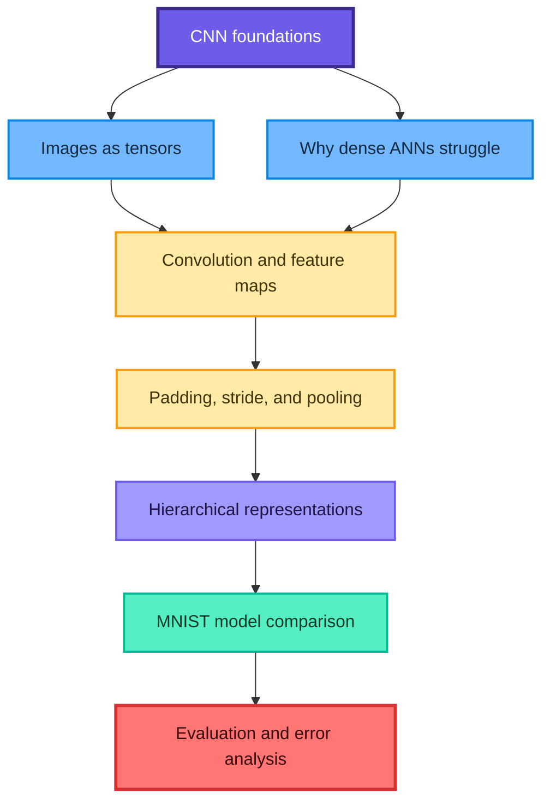
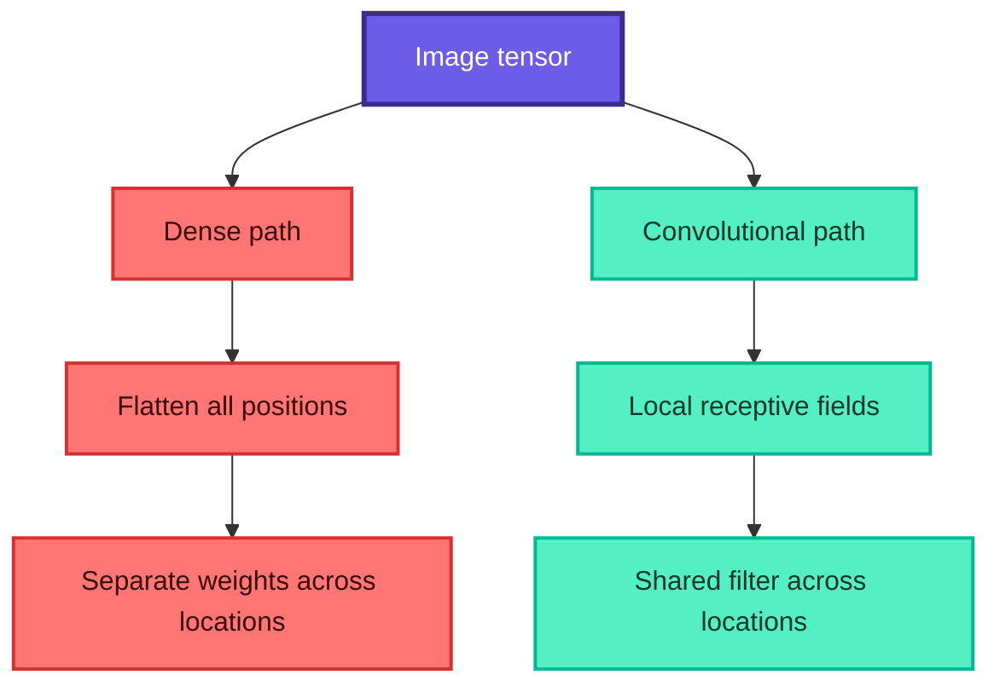
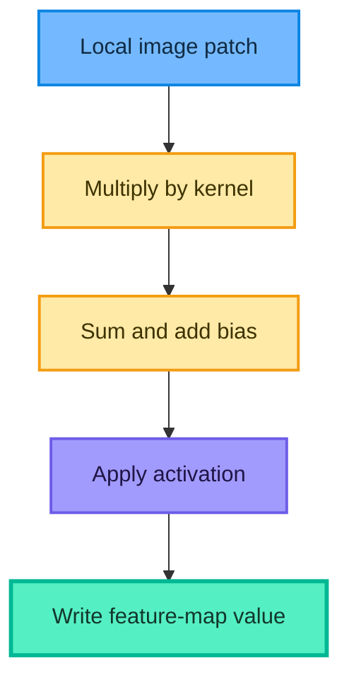
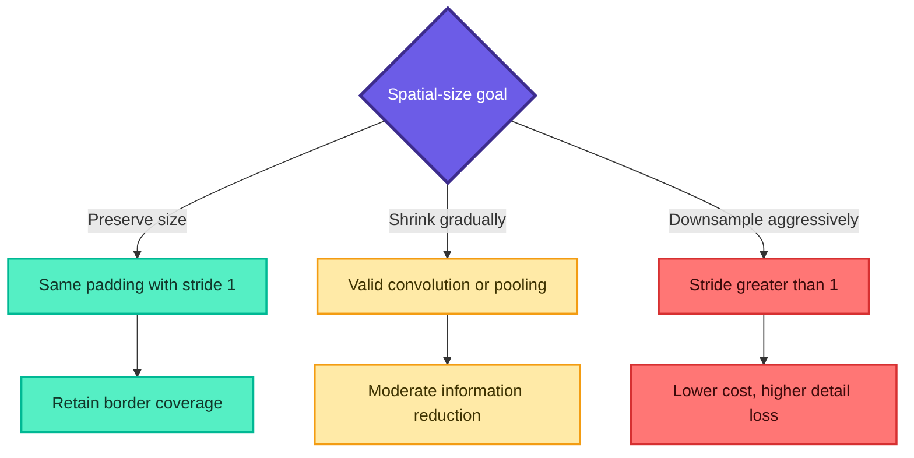
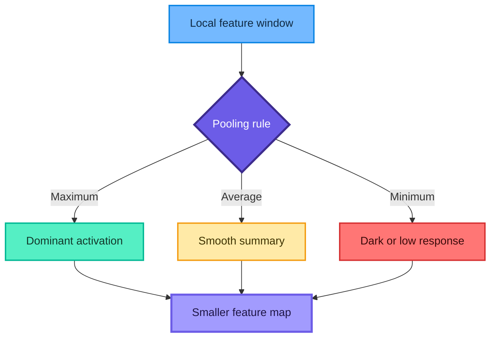
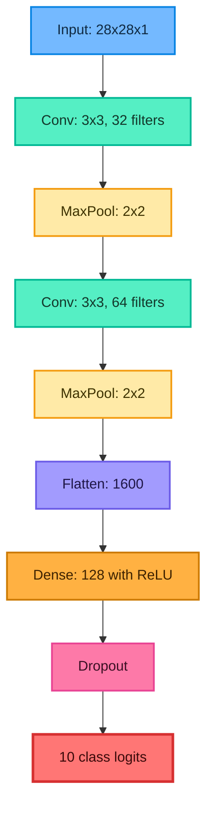
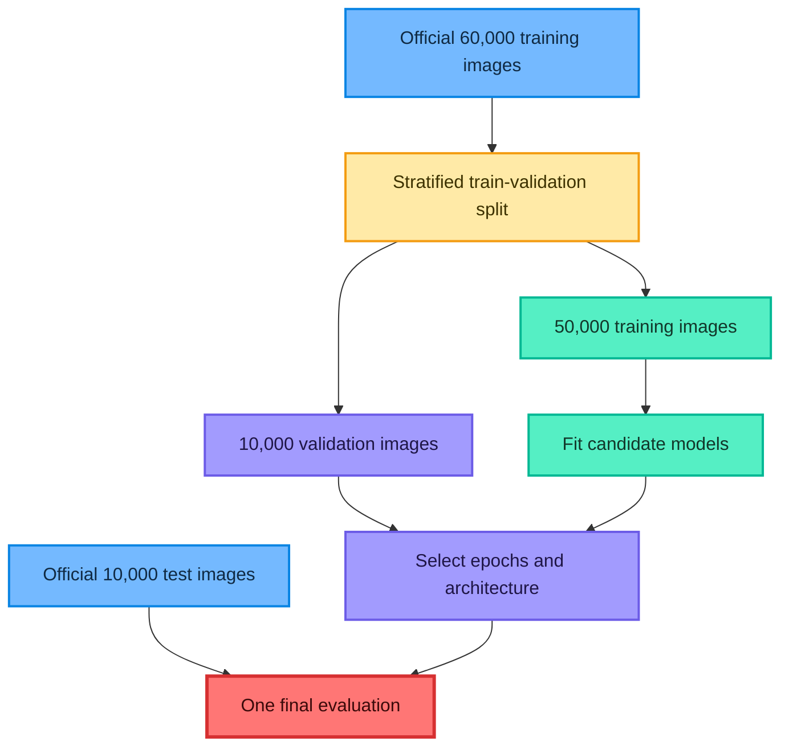
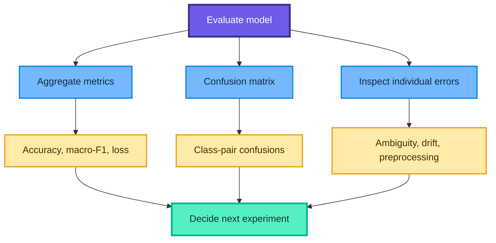
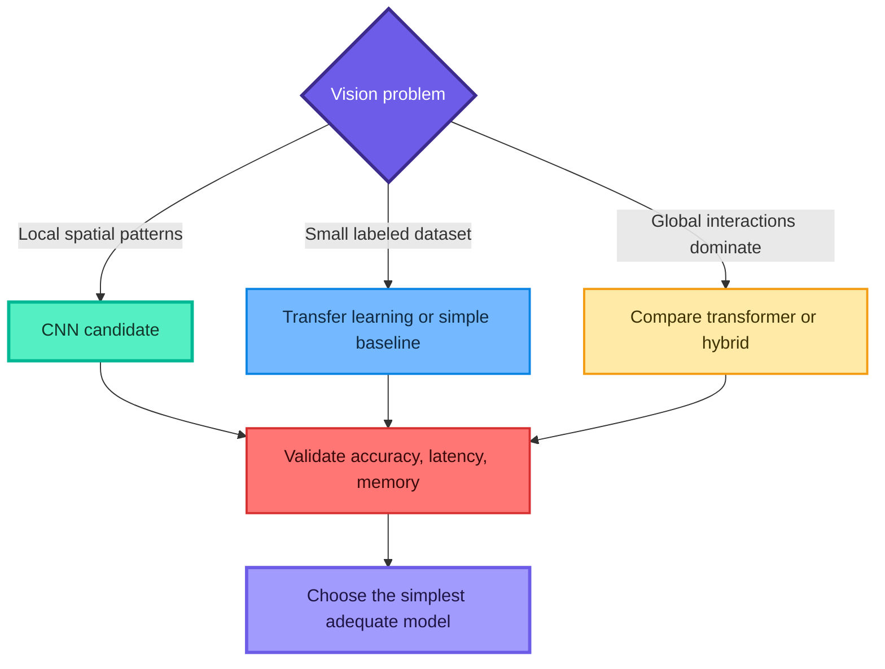

# Convolutional Neural Networks: From Pixels to MNIST Classification

These notes transform the supplied CNN YouTube transcript, all 11 pages of `CNN notes(1).pdf`, and `CNN(1).ipynb` into a corrected, detailed, self-contained guide. They explain **what**, **why**, **how**, and **when**, derive the important formulas, comment the code, identify source issues, and include solved practice questions.

> Central intuition: a CNN learns small reusable filters, applies them across an image, builds increasingly abstract feature maps, and uses those learned features to make a prediction.

## Learning roadmap



## Contents

1. [What is a CNN?](#1-what-is-a-cnn)
2. [Images as numerical tensors](#2-images-as-numerical-tensors)
3. [Why not flatten every image into a dense ANN?](#3-why-not-flatten-every-image-into-a-dense-ann)
4. [The CNN feature hierarchy](#4-the-cnn-feature-hierarchy)
5. [The convolution operation](#5-the-convolution-operation)
6. [Filters, channels, and feature maps](#6-filters-channels-and-feature-maps)
7. [Padding](#7-padding)
8. [Stride and output shape](#8-stride-and-output-shape)
9. [Pooling](#9-pooling)
10. [Receptive fields](#10-receptive-fields)
11. [Complete CNN architecture](#11-complete-cnn-architecture)
12. [Parameter counts and computation](#12-parameter-counts-and-computation)
13. [Activations, logits, and loss](#13-activations-logits-and-loss)
14. [Understanding MNIST](#14-understanding-mnist)
15. [Correct experimental design](#15-correct-experimental-design)
16. [Linear, ANN, and CNN implementations](#16-linear-ann-and-cnn-implementations)
17. [Training and evaluation](#17-training-and-evaluation)
18. [Regularization and augmentation](#18-regularization-and-augmentation)
19. [Error analysis and interpretation](#19-error-analysis-and-interpretation)
20. [Notebook corrections and common mistakes](#20-notebook-corrections-and-common-mistakes)
21. [Applications and model-choice guidance](#21-applications-and-model-choice-guidance)
22. [Practice questions with solutions](#22-practice-questions-with-solutions)
23. [Quick revision sheet](#23-quick-revision-sheet)

## 1. What is a CNN?

A **convolutional neural network (CNN)** is a neural network designed to learn from grid-like data, especially images. It uses local connections and shared filters so the same visual pattern can be detected at many positions.

A common image-classification pipeline is

$$
\text{image}
\longrightarrow
\text{convolutional features}
\longrightarrow
\text{downsampled representations}
\longrightarrow
\text{class scores}
$$

### 1.1 What problem does it solve?

Suppose the task is handwritten-digit recognition. A useful system must recognize a 4 even when it is written slightly higher, lower, thicker, thinner, or with a different stroke style.

A CNN builds an architectural preference for:

- nearby pixels interacting first;
- the same detector being useful across locations;
- simple patterns combining into complex patterns;
- moderate tolerance to small spatial changes.

### 1.2 CNN versus computer vision

Computer vision is the broad field of making machines work with visual data. CNNs are one family of models used in that field. Other vision architectures include vision transformers and hybrid systems.

### 1.3 Typical tasks

| Task | Output |
|---|---|
| Image classification | One label for the full image |
| Object detection | Classes and bounding boxes |
| Semantic segmentation | A class for every pixel |
| Instance segmentation | Separate masks for individual objects |
| OCR | Characters or text sequences |
| Image restoration | Denoised or reconstructed image |

## 2. Images as numerical tensors

A digital image is an array of pixel values.

### 2.1 Grayscale image

A grayscale image with height $H$ and width $W$ can be stored as

$$
X\in\mathbb{R}^{H\times W\times1}
$$

The final dimension is the single intensity channel.

### 2.2 RGB image

An RGB image has red, green, and blue channels:

$$
X\in\mathbb{R}^{H\times W\times3}
$$

One pixel is a vector such as

$$
x_{ij}=(R_{ij},G_{ij},B_{ij})
$$

For 8-bit channels, each component is usually an integer from 0 through 255.

### 2.3 Batch shape

Keras commonly uses channels-last format:

$$
(N,H,W,C)
$$

where $N$ is batch size and $C$ is channel count. MNIST therefore enters a CNN as

$$
(N,28,28,1)
$$

### 2.4 Pixel normalization

The source divides 8-bit pixels by 255:

$$
x'_{ijc}=\frac{x_{ijc}}{255}
$$

This maps $[0,255]$ into $[0,1]$, reduces numerical scale, and usually makes optimization easier.

```python
import numpy as np

# Convert integer pixels to float before division.
images = np.array([[0, 128, 255]], dtype="float32")
normalized_images = images / 255.0

print(normalized_images)  # [[0.        0.5019608 1.       ]]
```

> Fun fact: an image that looks continuous to us is a finite grid of sampled intensity values.

## 3. Why not flatten every image into a dense ANN?

A dense ANN can classify images, and the source notebook demonstrates that it can perform well on MNIST. The issue is not impossibility; it is that dense layers do not encode the most useful image structure efficiently.

### 3.1 Parameter growth

A $32\times32$ grayscale image contains

$$
32\cdot32=1024
$$

inputs. Connecting it to 100 dense neurons requires

$$
1024\cdot100+100=102{,}500
$$

parameters, including biases.

For a $224\times224\times3$ color image connected to 1,000 neurons:

$$
(224\cdot224\cdot3)(1000)+1000
=150{,}529{,}000
$$

parameters in just one layer.

### 3.2 Local structure

Flattening preserves each pixel value and its fixed index, so spatial information is not literally deleted. However, a dense layer has no built-in preference for neighboring pixels or reusable local patterns. It must learn related detectors separately at different locations.

### 3.3 Translation behavior

If an edge moves by one pixel, its flattened coordinates change. A dense network may need different weights for the shifted pattern. A convolution applies the same filter at every position.

### 3.4 Overfitting risk

Large parameter counts increase capacity and can overfit when data are limited. The actual risk depends on regularization, augmentation, architecture, and dataset size.



## 4. The CNN feature hierarchy

CNNs inspect local patches and combine them progressively.

- Early layers often respond to edges, corners, and simple textures.
- Intermediate layers can combine them into strokes, curves, or object parts.
- Deeper layers can represent task-specific configurations.
- A classification head converts the final features into class scores.


This description is an intuition, not a guarantee that every filter has one simple human-readable meaning.

## 5. The convolution operation

A convolutional layer slides a small learnable kernel across the input. At each location, it multiplies the local patch and kernel element by element, sums the products, adds a bias, and usually applies an activation.

### 5.1 Single-channel formula

For input $X$, kernel $K$ of size $K_h\times K_w$, stride 1, and no padding:

$$
Y_{i,j}=b+
\sum_{u=0}^{K_h-1}
\sum_{v=0}^{K_w-1}
K_{u,v}X_{i+u,j+v}
$$

Deep-learning libraries typically compute **cross-correlation**, because the kernel is not flipped. The layer is still conventionally called convolution, and learned kernels make the distinction less important in practice.

### 5.2 Patch calculation

For

$$
P=
\begin{bmatrix}
0&0&255\\
0&0&255\\
0&0&255
\end{bmatrix},
\qquad
K=
\begin{bmatrix}
-1&0&1\\
-1&0&1\\
-1&0&1
\end{bmatrix},
$$

the response is

$$
\langle P,K\rangle
=3(255)=765
$$

This large positive value signals a dark-to-bright vertical transition. Reversing the edge direction gives a negative response.

### 5.3 NumPy implementation

```python
import numpy as np


def cross_correlate_2d(image: np.ndarray, kernel: np.ndarray) -> np.ndarray:
    """Educational valid cross-correlation for one grayscale channel."""
    image_height, image_width = image.shape
    kernel_height, kernel_width = kernel.shape

    output_height = image_height - kernel_height + 1
    output_width = image_width - kernel_width + 1
    output = np.zeros((output_height, output_width), dtype=float)

    for row in range(output_height):
        for column in range(output_width):
            patch = image[
                row : row + kernel_height,
                column : column + kernel_width,
            ]
            output[row, column] = np.sum(patch * kernel)

    return output


vertical_edge_image = np.array(
    [
        [0, 0, 0, 255, 255, 255],
        [0, 0, 0, 255, 255, 255],
        [0, 0, 0, 255, 255, 255],
        [0, 0, 0, 255, 255, 255],
        [0, 0, 0, 255, 255, 255],
        [0, 0, 0, 255, 255, 255],
    ],
    dtype=float,
)

vertical_edge_kernel = np.array(
    [
        [-1, 0, 1],
        [-1, 0, 1],
        [-1, 0, 1],
    ],
    dtype=float,
)

feature_map = cross_correlate_2d(
    vertical_edge_image,
    vertical_edge_kernel,
)
print(feature_map)
```

### 5.4 Learned rather than hand-written

Edge kernels are useful for intuition. In a trained CNN, filter values are normally initialized and learned through backpropagation.



## 6. Filters, channels, and feature maps

### 6.1 Multi-channel convolution

For input channels $c=1,\ldots,C_{\mathrm{in}}$ and output filter $f$:

$$
Y_{i,j,f}=b_f+
\sum_{u=0}^{K_h-1}
\sum_{v=0}^{K_w-1}
\sum_{c=1}^{C_{\mathrm{in}}}
K_{u,v,c,f}
X_{iS_h+u-P_h,\,jS_w+v-P_w,\,c}
$$

Each filter spans all input channels. One filter produces one output feature map. Therefore,

$$
C_{\mathrm{out}}=\text{number of filters}
$$

### 6.2 Example shapes

An RGB input and 32 filters of size $3\times3$ use a kernel tensor of shape

$$
3\times3\times3\times32
$$

The output depth is 32, not 3.

### 6.3 Weight sharing

The same kernel values are reused at every spatial location. This produces:

- fewer parameters;
- a detector that can fire anywhere;
- translation **equivariance** before later aggregation.

If the input shifts, the feature map tends to shift correspondingly. This is equivariance, not complete invariance.

### 6.4 Convolutional parameter count

With a bias for each output channel:

$$
\text{Conv2D parameters}
=\left(K_hK_wC_{\mathrm{in}}+1\right)C_{\mathrm{out}}
$$

The count does not depend on image height or width.

Example: $3\times3$, 3 input channels, and 32 filters:

$$
(3\cdot3\cdot3+1)(32)=896
$$

## 7. Padding

Padding surrounds an image or feature map with extra values, commonly zeros.

### 7.1 Valid padding

`padding="valid"` means no padding. A $7\times7$ input convolved with a $3\times3$ kernel at stride 1 becomes

$$
(7-3+1)\times(7-3+1)=5\times5
$$

### 7.2 Same padding

For odd kernel size $K$ and stride 1, symmetric padding

$$
P=\frac{K-1}{2}
$$

preserves spatial size. A $7\times7$ input with $K=3$ uses $P=1$ and remains $7\times7$.

### 7.3 Why padding matters

- prevents rapid shrinking;
- allows border pixels to influence more outputs;
- makes deeper architectures easier to size;
- supports same-sized residual paths.

Zero padding is a design convention, not missing real image content. Other padding modes can be useful when boundary assumptions matter.

## 8. Stride and output shape

Stride controls how far the kernel moves after each evaluation.

For dilation 1, input height $H$, kernel height $K_h$, padding $P_h$, and stride $S_h$:

$$
H_{\mathrm{out}}
=\left\lfloor
\frac{H+2P_h-K_h}{S_h}
\right\rfloor+1
$$

Similarly,

$$
W_{\mathrm{out}}
=\left\lfloor
\frac{W+2P_w-K_w}{S_w}
\right\rfloor+1
$$

### 8.1 Worked examples

For $H=W=28$, $K=3$, $P=0$, and $S=1$:

$$
H_{\mathrm{out}}=W_{\mathrm{out}}
=\left\lfloor\frac{28-3}{1}\right\rfloor+1=26
$$

For a $5\times5$ input, $3\times3$ kernel, no padding, and stride 2:

$$
\left\lfloor\frac{5-3}{2}\right\rfloor+1=2
$$

so the output is $2\times2$.

### 8.2 Stride trade-off

- Larger stride reduces spatial size and computation.
- Larger stride also skips locations and can discard detail.



### 8.3 Shape helper

```python
from math import floor


def conv_output_size(
    input_size: int,
    kernel_size: int,
    padding: int = 0,
    stride: int = 1,
) -> int:
    """Return one spatial Conv2D output dimension for dilation 1."""
    return floor(
        (input_size + 2 * padding - kernel_size) / stride
    ) + 1


print(conv_output_size(28, 3))               # 26
print(conv_output_size(7, 3, padding=1))     # 7
print(conv_output_size(5, 3, stride=2))      # 2
```

## 9. Pooling

Pooling summarizes a local region independently in each channel. It has no trainable kernel weights.

### 9.1 Max pooling

For pooling window $\mathcal{R}_{i,j}$:

$$
Y_{i,j,c}=\max_{(u,v)\in\mathcal{R}_{i,j}}X_{u,v,c}
$$

Example with a $2\times2$ window and stride 2:

$$
X=
\begin{bmatrix}
7&3&5&2\\
8&7&1&6\\
4&9&3&9\\
0&8&4&5
\end{bmatrix}
\longrightarrow
Y=
\begin{bmatrix}
8&6\\
9&9
\end{bmatrix}
$$

### 9.2 Average pooling

$$
Y_{i,j,c}=
\frac{1}{|\mathcal{R}_{i,j}|}
\sum_{(u,v)\in\mathcal{R}_{i,j}}X_{u,v,c}
$$

It creates a smoother summary and preserves average activation rather than the strongest response.

### 9.3 Min pooling

Min pooling selects the minimum. It may highlight dark responses in a chosen representation but is rare in standard CNN architectures.

### 9.4 Why pool?

- reduce height and width;
- lower later computation and memory;
- enlarge the effective receptive field;
- provide some tolerance to small local translations;
- retain dominant responses with max pooling.

Pooling does not make a model perfectly translation-invariant, and it can discard useful location information.



### 9.5 NumPy max-pooling example

```python
import numpy as np


def max_pool_2d(
    feature_map: np.ndarray,
    pool_size: int = 2,
    stride: int = 2,
) -> np.ndarray:
    """Educational max pooling for a single 2D feature map."""
    height, width = feature_map.shape
    output_height = (height - pool_size) // stride + 1
    output_width = (width - pool_size) // stride + 1
    output = np.empty((output_height, output_width))

    for row in range(output_height):
        for column in range(output_width):
            window = feature_map[
                row * stride : row * stride + pool_size,
                column * stride : column * stride + pool_size,
            ]
            output[row, column] = np.max(window)

    return output
```

## 10. Receptive fields

The **receptive field** of a unit is the input region that can influence it. A unit in the first $3\times3$ convolution sees a $3\times3$ patch. After additional convolution and pooling, later units indirectly see larger input regions.

Let:

- $r_l$ be receptive-field size after layer $l$;
- $j_l$ be the distance, measured in input pixels, between adjacent outputs;
- $k_l$ be kernel or pool size;
- $s_l$ be stride.

Starting with $r_0=1$ and $j_0=1$:

$$
r_l=r_{l-1}+(k_l-1)j_{l-1}
$$

$$
j_l=j_{l-1}s_l
$$

### 10.1 Source architecture example

| Layer | $k$ | $s$ | Receptive field $r$ | Jump $j$ |
|---|---:|---:|---:|---:|
| Input | - | - | 1 | 1 |
| Conv $3\times3$ | 3 | 1 | 3 | 1 |
| Pool $2\times2$ | 2 | 2 | 4 | 2 |
| Conv $3\times3$ | 3 | 1 | 8 | 2 |
| Pool $2\times2$ | 2 | 2 | 10 | 4 |

Each final $5\times5\times64$ spatial unit depends on a $10\times10$ input region, and adjacent units are centered 4 input pixels apart.


### 10.2 Why receptive fields matter

- A receptive field that is too small cannot integrate global evidence.
- Aggressive downsampling may lose fine details.
- Deep stacks, dilation, larger kernels, and pooling enlarge context in different ways.

The **theoretical** receptive field is not the same as the **effective** influence distribution; trained networks often weight central regions more strongly.

## 11. Complete CNN architecture

The source project uses the following MNIST network:



### 11.1 Shape trace

| Stage | Configuration | Output shape, excluding batch |
|---|---|---|
| Input | Grayscale MNIST | $28\times28\times1$ |
| Conv 1 | 32 filters, $3\times3$, valid, stride 1 | $26\times26\times32$ |
| Pool 1 | $2\times2$, stride 2 | $13\times13\times32$ |
| Conv 2 | 64 filters, $3\times3$, valid, stride 1 | $11\times11\times64$ |
| Pool 2 | $2\times2$, stride 2 | $5\times5\times64$ |
| Flatten | $5\cdot5\cdot64$ | $1600$ |
| Dense | 128 units | $128$ |
| Output | 10 logits | $10$ |

Keras uses floor behavior for a valid $2\times2$ pooling window on $11\times11$, producing $5\times5$.

### 11.2 Feature extractor and classifier head

- Conv and pooling layers form the **feature extractor**.
- Flatten and dense layers form the **classifier head**.

Modern architectures sometimes replace `Flatten` with global average pooling to reduce parameters:

$$
\operatorname{GAP}(X)_c
=\frac{1}{HW}\sum_{i=1}^{H}\sum_{j=1}^{W}X_{i,j,c}
$$

For $5\times5\times64$, global average pooling returns 64 values instead of 1,600.

## 12. Parameter counts and computation

### 12.1 CNN parameter count

Conv 1:

$$
(3\cdot3\cdot1+1)(32)=320
$$

Conv 2:

$$
(3\cdot3\cdot32+1)(64)=18{,}496
$$

Dense 1:

$$
(1600+1)(128)=204{,}928
$$

Output:

$$
(128+1)(10)=1{,}290
$$

Total:

$$
320+18{,}496+204{,}928+1{,}290
=225{,}034
$$

Pooling, flattening, ReLU, and dropout add no trainable weights.

### 12.2 Comparison model counts

Linear 784-to-10 model:

$$
(784+1)(10)=7{,}850
$$

Dense ANN $784\rightarrow128\rightarrow64\rightarrow10$:

$$
(784+1)(128)+(128+1)(64)+(64+1)(10)
=109{,}386
$$

The CNN has more parameters than this particular ANN because the 1,600-to-128 dense head dominates. Convolution itself is parameter-efficient, but a large flattened classifier head can erase some of that benefit.

### 12.3 Approximate multiplications per example

For one standard convolution:

$$
\text{multiplications}
\approx H_{\mathrm{out}}W_{\mathrm{out}}C_{\mathrm{out}}
K_hK_wC_{\mathrm{in}}
$$

The source CNN uses approximately:

- Conv 1: $26\cdot26\cdot32\cdot3\cdot3\cdot1=194{,}688$;
- Conv 2: $11\cdot11\cdot64\cdot3\cdot3\cdot32=2{,}230{,}272$;
- Dense 1: $1600\cdot128=204{,}800$;
- Output: $128\cdot10=1{,}280$.

This is a simplified count. Hardware kernels, additions, activations, memory movement, batching, and implementation details also affect runtime.

## 13. Activations, logits, and loss

### 13.1 Hidden ReLU

$$
\operatorname{ReLU}(z)=\max(0,z)
$$

ReLU introduces nonlinearity and keeps a simple positive-side gradient.

### 13.2 Output logits

The corrected implementation returns 10 unrestricted logits:

$$
z=(z_0,z_1,\ldots,z_9)
$$

Softmax probabilities are

$$
p_k=\frac{e^{z_k}}{\sum_{j=0}^{9}e^{z_j}}
$$

### 13.3 Sparse categorical cross-entropy

For integer label $y$:

$$
L=-\log(p_y)
$$

The corrected code combines logits with

```python
loss = tf.keras.losses.SparseCategoricalCrossentropy(
    from_logits=True
)
```

This avoids one-hot encoding and permits a numerically stable logits-based calculation.

### 13.4 One-hot alternative

The source notebook uses one-hot labels and softmax outputs. That pairing is valid:

$$
L=-\sum_{k=0}^{9}y_k\log(p_k)
$$

However, do not combine one-hot targets with sparse cross-entropy or integer targets with ordinary categorical cross-entropy.

## 14. Understanding MNIST

MNIST contains grayscale handwritten digits from 0 through 9:

- 60,000 official training images;
- 10,000 official test images;
- image shape $28\times28$;
- 10 mutually exclusive classes.

### 14.1 Correct tensor shapes

Dense models:

$$
(N,28,28)
$$

CNN:

$$
(N,28,28,1)
$$

### 14.2 Data audit

```python
import numpy as np
import tensorflow as tf

(X_build, y_build), (X_test, y_test) = (
    tf.keras.datasets.mnist.load_data()
)

print(X_build.shape, y_build.shape)  # (60000, 28, 28), (60000,)
print(X_test.shape, y_test.shape)    # (10000, 28, 28), (10000,)
print(X_build.dtype)                 # uint8
print(np.unique(y_build, return_counts=True))
```

### 14.3 Visual inspection

```python
import matplotlib.pyplot as plt

figure, axes = plt.subplots(2, 5, figsize=(10, 4))

for index, axis in enumerate(axes.ravel()):
    axis.imshow(X_build[index], cmap="gray")
    axis.set_title(f"Label: {y_build[index]}")
    axis.axis("off")

figure.tight_layout()
plt.show()
```

Always inspect examples. A correct shape does not prove that labels, orientation, pixel scale, and channel order are correct.

## 15. Correct experimental design

The official test set should remain untouched until architecture and training choices are complete.



### 15.1 Prepare train, validation, and test sets

```python
import numpy as np
import tensorflow as tf
from sklearn.model_selection import train_test_split

SEED = 42
tf.keras.utils.set_random_seed(SEED)

(X_build, y_build), (X_test, y_test) = (
    tf.keras.datasets.mnist.load_data()
)

X_train, X_val, y_train, y_val = train_test_split(
    X_build,
    y_build,
    test_size=10_000,
    random_state=SEED,
    stratify=y_build,
)

# Scale all partitions with the known pixel range.
X_train = X_train.astype("float32") / 255.0
X_val = X_val.astype("float32") / 255.0
X_test = X_test.astype("float32") / 255.0

# CNN inputs need an explicit grayscale channel.
X_train_cnn = X_train[..., np.newaxis]
X_val_cnn = X_val[..., np.newaxis]
X_test_cnn = X_test[..., np.newaxis]

print(X_train.shape)      # (50000, 28, 28)
print(X_val.shape)        # (10000, 28, 28)
print(X_test.shape)       # (10000, 28, 28)
print(X_train_cnn.shape)  # (50000, 28, 28, 1)
```

Dividing by the fixed physical maximum 255 does not estimate state from the test set. Data-dependent normalization, imputation, or feature learning must fit only on training data.

### 15.2 Fair-comparison principles

- keep the same data partitions;
- use integer labels and the same loss definition;
- compare several seeds or report run variability;
- give models reasonable optimization settings;
- track training time and parameter count, not only accuracy;
- select with validation data;
- evaluate the final choices once on test data.

## 16. Linear, ANN, and CNN implementations

### 16.1 Shared compile helper

```python
from tensorflow import keras
from tensorflow.keras import layers


def compile_classifier(model: keras.Model) -> keras.Model:
    """Compile a ten-class logits model with a common setup."""
    model.compile(
        optimizer=keras.optimizers.Adam(learning_rate=0.001),
        loss=keras.losses.SparseCategoricalCrossentropy(
            from_logits=True
        ),
        metrics=["accuracy"],
    )
    return model
```

### 16.2 Linear softmax baseline

The notebook calls this model a perceptron, but a 10-logit dense layer trained with cross-entropy is more accurately a multiclass linear softmax classifier.

```python
def build_linear_model() -> keras.Model:
    model = keras.Sequential(
        [
            keras.Input(shape=(28, 28)),
            layers.Flatten(),
            layers.Dense(10),  # Ten unrestricted class logits.
        ],
        name="linear_softmax_baseline",
    )
    return compile_classifier(model)
```

### 16.3 Dense ANN

```python
def build_ann_model() -> keras.Model:
    model = keras.Sequential(
        [
            keras.Input(shape=(28, 28)),
            layers.Flatten(),
            layers.Dense(128, activation="relu"),
            layers.Dense(64, activation="relu"),
            layers.Dense(10),
        ],
        name="dense_ann",
    )
    return compile_classifier(model)
```

### 16.4 CNN

```python
def build_cnn_model() -> keras.Model:
    model = keras.Sequential(
        [
            keras.Input(shape=(28, 28, 1)),
            layers.Conv2D(32, kernel_size=3, activation="relu"),
            layers.MaxPooling2D(pool_size=2),
            layers.Conv2D(64, kernel_size=3, activation="relu"),
            layers.MaxPooling2D(pool_size=2),
            layers.Flatten(),
            layers.Dense(128, activation="relu"),
            layers.Dropout(0.5),
            layers.Dense(10),
        ],
        name="mnist_cnn",
    )
    return compile_classifier(model)
```

### 16.5 Verify architecture before training

```python
linear_model = build_linear_model()
ann_model = build_ann_model()
cnn_model = build_cnn_model()

linear_model.summary()  # 7,850 parameters
ann_model.summary()     # 109,386 parameters
cnn_model.summary()     # 225,034 parameters
```

## 17. Training and evaluation

### 17.1 Train with early stopping

```python
def train_model(
    model: keras.Model,
    X_train,
    y_train,
    X_val,
    y_val,
):
    """Train while restoring the best validation-loss weights."""
    callback = keras.callbacks.EarlyStopping(
        monitor="val_loss",
        patience=3,
        restore_best_weights=True,
    )

    return model.fit(
        X_train,
        y_train,
        validation_data=(X_val, y_val),
        epochs=20,
        batch_size=32,
        callbacks=[callback],
        verbose=1,
    )


linear_history = train_model(
    linear_model, X_train, y_train, X_val, y_val
)

ann_history = train_model(
    ann_model, X_train, y_train, X_val, y_val
)

cnn_history = train_model(
    cnn_model, X_train_cnn, y_train, X_val_cnn, y_val
)
```

Training these models sequentially is fair because they are separate objects. Repeatedly calling `fit()` on the same model would continue from its existing weights.

### 17.2 Plot learning curves

```python
import matplotlib.pyplot as plt


def plot_training(history, title: str) -> None:
    """Plot accuracy and loss without hiding the scale."""
    figure, axes = plt.subplots(1, 2, figsize=(12, 4))

    axes[0].plot(history.history["accuracy"], label="train")
    axes[0].plot(history.history["val_accuracy"], label="validation")
    axes[0].set_title(f"{title}: accuracy")
    axes[0].set_xlabel("Epoch")
    axes[0].legend()

    axes[1].plot(history.history["loss"], label="train")
    axes[1].plot(history.history["val_loss"], label="validation")
    axes[1].set_title(f"{title}: loss")
    axes[1].set_xlabel("Epoch")
    axes[1].legend()

    figure.tight_layout()
    plt.show()
```

### 17.3 Final test evaluation

```python
test_results = {
    "Linear": linear_model.evaluate(X_test, y_test, verbose=0),
    "ANN": ann_model.evaluate(X_test, y_test, verbose=0),
    "CNN": cnn_model.evaluate(X_test_cnn, y_test, verbose=0),
}

for model_name, (loss_value, accuracy_value) in test_results.items():
    print(
        f"{model_name:6s} "
        f"loss={loss_value:.4f} "
        f"accuracy={accuracy_value:.4f}"
    )
```

### 17.4 Notebook-recorded results

The supplied notebook records the following values after five epochs:

| Notebook model label | Recorded test accuracy |
|---|---:|
| `Perceptron` | $0.8808$ |
| `ANN` | $0.9597$ |
| `CNN` | $0.9876$ |

These values illustrate the source's intended comparison, but they are not clean benchmark results because:

- the official test set was used as validation data every epoch;
- notebook outputs appear to come from a different execution state than the displayed normalization code;
- the first model is a linear softmax classifier, not a classic perceptron;
- no repeated seeds or uncertainty are reported.

The corrected code should produce its own results rather than claiming the recorded values in advance.

## 18. Regularization and augmentation

### 18.1 Dropout

During training, dropout independently masks activations with probability $q$. With inverted dropout, retained activations are rescaled:

$$
\tilde{a}_i=\frac{m_i}{1-q}a_i,
\qquad
m_i\sim\operatorname{Bernoulli}(1-q)
$$

At ordinary inference, dropout is disabled.

**Why:** it discourages units from relying too heavily on exact co-adaptations.

**Caution:** a dropout rate of $0.5$ is substantial. Tune it using validation evidence rather than assuming that more dropout is better.

### 18.2 Weight decay

L2-style regularization adds a penalty:

$$
L_{\mathrm{total}}
=L_{\mathrm{data}}+\lambda\sum_l\|W^{(l)}\|_2^2
$$

It discourages unnecessarily large weights. In modern optimizers, decoupled weight decay such as AdamW is not identical to adding an L2 penalty to the loss in every implementation.

### 18.3 Data augmentation

Augmentation creates label-preserving variations:

- small translations;
- small rotations;
- mild zoom or cropping;
- contrast variation;
- horizontal flips only when the label remains valid.

Do not horizontally flip MNIST blindly. A transformed digit must still represent the same class.

```python
from tensorflow import keras
from tensorflow.keras import layers

augmentation = keras.Sequential(
    [
        # Modest transformations are safer for handwritten digits.
        layers.RandomTranslation(height_factor=0.08, width_factor=0.08),
        layers.RandomRotation(factor=0.05),
        layers.RandomZoom(height_factor=0.08, width_factor=0.08),
    ],
    name="mnist_augmentation",
)
```

Place augmentation after the input and before convolution. It runs during training and is normally inactive during evaluation.

### 18.4 Batch normalization

Batch normalization standardizes intermediate activations using mini-batch statistics during training and moving statistics during inference. It can improve optimization but introduces train-inference state and should be used deliberately.

### 18.5 Early stopping

If training loss falls while validation loss rises, stop near the best validation epoch and restore its weights. The final test set must not decide the stopping time.

## 19. Error analysis and interpretation

### 19.1 Confusion matrix

For ten classes:

$$
C_{ij}=\#\{\text{true digit }i\text{ predicted as digit }j\}
$$

```python
import matplotlib.pyplot as plt
import seaborn as sns
from sklearn.metrics import classification_report, confusion_matrix

test_logits = cnn_model.predict(X_test_cnn, verbose=0)
test_prediction = np.argmax(test_logits, axis=1)

matrix = confusion_matrix(y_test, test_prediction)

plt.figure(figsize=(8, 6))
sns.heatmap(matrix, annot=True, fmt="d", cmap="Blues")
plt.xlabel("Predicted digit")
plt.ylabel("True digit")
plt.title("CNN confusion matrix")
plt.tight_layout()
plt.show()

print(
    classification_report(
        y_test,
        test_prediction,
        digits=3,
    )
)
```

### 19.2 Inspect mistakes

```python
def show_misclassifications(
    images,
    true_labels,
    predicted_labels,
    maximum_images: int = 16,
) -> None:
    """Display a reproducible subset of incorrectly classified images."""
    wrong_indices = np.flatnonzero(true_labels != predicted_labels)
    selected = wrong_indices[:maximum_images]

    columns = 4
    rows = int(np.ceil(len(selected) / columns))
    figure, axes = plt.subplots(rows, columns, figsize=(10, 2.5 * rows))
    axes = np.atleast_1d(axes).ravel()

    for axis, index in zip(axes, selected):
        axis.imshow(images[index], cmap="gray")
        axis.set_title(
            f"true={true_labels[index]}, pred={predicted_labels[index]}"
        )
        axis.axis("off")

    for axis in axes[len(selected) :]:
        axis.axis("off")

    figure.tight_layout()
    plt.show()
```

Look for:

- ambiguous handwriting;
- cropped or faint strokes;
- systematic confusion pairs;
- preprocessing or orientation problems;
- high-confidence wrong predictions.

### 19.3 Feature maps

Intermediate activations can show where filters respond. A feature map is evidence, not a full causal explanation.

### 19.4 Saliency and attribution

Gradient-based saliency, integrated gradients, occlusion tests, and class-activation maps can estimate which pixels influence a prediction. Interpret these methods cautiously: visual appeal does not prove faithfulness.

### 19.5 Calibration

Softmax values sum to one, but they are not automatically calibrated probabilities. Calibration asks whether predictions assigned confidence $0.8$ are correct approximately $80\%$ of the time.



## 20. Notebook corrections and common mistakes

| Source pattern | Why it needs correction | Better approach |
|---|---|---|
| Use `mnist_test.csv` as `validation_data` | Test performance is exposed every epoch and may guide choices | Split validation from official training data; test once |
| Call `Flatten -> Dense(10, softmax)` a perceptron | Cross-entropy softmax training is a multiclass linear model | Name it linear softmax classifier |
| Stored linear-model loss is in the hundreds after displayed normalization | Proper normalized softmax cross-entropy should not normally show this scale | Restart, run cells in order, and verify pixel range |
| Pass `input_shape` directly to `Flatten` or `Conv2D` | Current Keras guidance favors an explicit input object | Begin with `keras.Input(shape=...)` |
| One-hot encode when integer labels already exist | Valid but adds unnecessary transformation | Use sparse categorical cross-entropy |
| Softmax inside the model with ordinary CCE | Valid but less numerically direct than a logits loss | Return logits and use `from_logits=True` |
| Compare only one seed | Neural initialization and batch order vary | Repeat or report variability |
| Interpret a higher single test score as universal superiority | Split use, optimization, and dataset bias affect rankings | Compare under a clean protocol and report cost |
| Say flattening removes spatial arrangement | Flattening preserves index order but dense layers lack locality and sharing | Explain the missing architectural bias precisely |
| Say pooling gives translation invariance | Pooling gives limited local tolerance | Test robustness to realistic transformations |
| Count $1024\cdot100=102{,}400$ as all dense parameters | This omits 100 biases | Report $102{,}500$ total parameters |
| Read filters as guaranteed semantic detectors | Filters may be distributed and difficult to name | Use visualization as partial evidence only |

### 20.1 Execution-state hygiene

Notebook outputs can become stale when cells are edited without rerunning downstream cells. Before reporting results:

1. restart the runtime;
2. run all cells in order;
3. print library versions and seed settings;
4. assert input ranges and shapes;
5. save the executed notebook or a reproducible script.

```python
assert X_train.dtype == np.float32
assert 0.0 <= X_train.min() <= X_train.max() <= 1.0
assert X_train_cnn.shape[1:] == (28, 28, 1)
assert set(np.unique(y_train)) == set(range(10))
```

### 20.2 Metric reproducibility

The same architecture can produce slightly different metrics across random seeds, hardware, and low-level kernels. Report the code, data split, versions, and a distribution across runs when small differences matter.

## 21. Applications and model-choice guidance

### 21.1 CNN applications

- manufacturing defect detection;
- medical-image classification and segmentation;
- document and handwriting recognition;
- remote-sensing analysis;
- face and object detection;
- microscopy;
- traffic-sign recognition;
- audio models using spectrograms;
- time-series models using one-dimensional convolution.

### 21.2 When a CNN is a good choice

Use a CNN when:

- the input has meaningful local structure;
- the same pattern may appear in different positions;
- labeled data and compute are sufficient;
- parameter sharing is useful;
- latency and model size meet deployment constraints.

### 21.3 When another method may be better

- Small tabular dataset: start with linear or tree-based models.
- Very limited image data: consider transfer learning rather than training from scratch.
- Long-range global relationships: compare transformer or hybrid architectures.
- Strict edge-device budget: use a small CNN, quantization, pruning, or a classical method.
- High-stakes use: prioritize data quality, subgroup evaluation, calibration, and human oversight.



> Fun fact: CNN-style convolutions are useful beyond photographs. Any signal with useful local structure, including waveforms and spectrograms, can benefit from convolution.

## 22. Practice questions with solutions

### Question 1: Image tensor shape

What is the channels-last batch shape for 64 RGB images of size $128\times128$?

<details>
<summary>Solution</summary>

RGB has 3 channels, so the shape is

$$
(64,128,128,3)
$$

The dimensions are batch, height, width, and channels.

</details>

### Question 2: Pixel normalization

A grayscale pixel has value 192. What is its value after division by 255?

<details>
<summary>Solution</summary>

$$
\frac{192}{255}\approx0.7529
$$

</details>

### Question 3: Dense parameter count

A $32\times32$ grayscale image is flattened and connected to 100 dense units. How many weights, biases, and total parameters are required?

<details>
<summary>Solution</summary>

The input has

$$
32\cdot32=1024
$$

values. Therefore:

$$
\text{weights}=1024\cdot100=102{,}400
$$

$$
\text{biases}=100
$$

$$
\text{total}=102{,}500
$$

</details>

### Question 4: Valid convolution output

A $28\times28$ input receives a $5\times5$ valid convolution with stride 1. What is the spatial output size?

<details>
<summary>Solution</summary>

$$
H_{\mathrm{out}}
=\left\lfloor\frac{28-5}{1}\right\rfloor+1=24
$$

The output is $24\times24$.

</details>

### Question 5: Same padding

How much symmetric padding is required to preserve a $15\times15$ input under a $5\times5$ kernel with stride 1?

<details>
<summary>Solution</summary>

For an odd kernel:

$$
P=\frac{K-1}{2}=\frac{5-1}{2}=2
$$

Pad two pixels on each side.

</details>

### Question 6: Strided output

A $10\times10$ input uses a $3\times3$ kernel, padding 1, and stride 2. Calculate one output dimension.

<details>
<summary>Solution</summary>

$$
H_{\mathrm{out}}
=\left\lfloor\frac{10+2(1)-3}{2}\right\rfloor+1
=\lfloor4.5\rfloor+1=5
$$

The spatial output is $5\times5$.

</details>

### Question 7: Edge response

Using the vertical kernel

$$
K=
\begin{bmatrix}
-1&0&1\\
-1&0&1\\
-1&0&1
\end{bmatrix},
$$

calculate the response to a patch whose left two columns are 0 and right column is 255.

<details>
<summary>Solution</summary>

All values multiplied by $-1$ or 0 are zero. The three right-column values contribute

$$
255+255+255=765
$$

A strong positive response indicates the corresponding edge direction.

</details>

### Question 8: Convolutional parameters

A Conv2D layer has 64 filters of size $3\times3$ and receives 32 input channels. Include one bias per filter. How many parameters does it contain?

<details>
<summary>Solution</summary>

$$
(3\cdot3\cdot32+1)(64)
=(288+1)(64)=18{,}496
$$

The count does not depend on input height and width.

</details>

### Question 9: Output channels

An RGB image passes through a Conv2D layer with 20 filters. How many output channels are produced?

<details>
<summary>Solution</summary>

The output channel count equals the number of filters, so the answer is 20. Each filter spans all three RGB input channels.

</details>

### Question 10: Max pooling

Apply $2\times2$ max pooling with stride 2 to

$$
\begin{bmatrix}
1&4&2&3\\
5&0&7&6\\
9&8&1&2\\
3&4&6&5
\end{bmatrix}
$$

<details>
<summary>Solution</summary>

The four windows have maxima 5, 7, 9, and 6:

$$
\begin{bmatrix}
5&7\\
9&6
\end{bmatrix}
$$

</details>

### Question 11: Pooling parameters

How many trainable parameters does an ordinary $2\times2$ max-pooling layer have?

<details>
<summary>Solution</summary>

Zero. Max pooling applies a fixed maximum operation. It changes activation shape but learns no weights or biases.

</details>

### Question 12: Source architecture shape

Trace the spatial shapes for $28\times28\times1$ through valid Conv $3\times3$, Pool $2\times2$, valid Conv $3\times3$, and Pool $2\times2$.

<details>
<summary>Solution</summary>

With 32 filters in the first convolution and 64 in the second:

$$
28\times28\times1
\rightarrow26\times26\times32
$$

$$
\rightarrow13\times13\times32
\rightarrow11\times11\times64
\rightarrow5\times5\times64
$$

Flattening produces

$$
5\cdot5\cdot64=1600
$$

values.

</details>

### Question 13: CNN parameter total

Using the source architecture, verify the total parameter count.

<details>
<summary>Solution</summary>

$$
\text{Conv 1}=320
$$

$$
\text{Conv 2}=18{,}496
$$

$$
\text{Dense 1600 to 128}=204{,}928
$$

$$
\text{Dense 128 to 10}=1{,}290
$$

Thus,

$$
320+18{,}496+204{,}928+1{,}290
=225{,}034
$$

</details>

### Question 14: Weight sharing

What does weight sharing mean in a convolutional layer, and why is it useful?

<details>
<summary>Solution</summary>

The same kernel values are applied at every spatial position. The layer can detect the same pattern in different locations without learning separate weights for each location, reducing parameters and creating translation equivariance.

</details>

### Question 15: Equivariance versus invariance

Explain the difference between translation equivariance and translation invariance.

<details>
<summary>Solution</summary>

Equivariance means a shifted input tends to produce a correspondingly shifted feature map. Invariance means the final output remains unchanged under the shift. Convolution is naturally equivariant; pooling and global aggregation may provide limited tolerance, not guaranteed perfect invariance.

</details>

### Question 16: Receptive field

For Conv $3\times3$, Pool $2\times2$, Conv $3\times3$, Pool $2\times2$, all with the source strides, what is the final theoretical receptive field?

<details>
<summary>Solution</summary>

Starting with $r=1$ and jump $j=1$:

- after Conv: $r=3$, $j=1$;
- after Pool: $r=4$, $j=2$;
- after Conv: $r=8$, $j=2$;
- after Pool: $r=10$, $j=4$.

The final receptive field is $10\times10$.

</details>

### Question 17: Output-loss pairing

A model returns 10 logits and targets are integer digits 0 through 9. Which loss configuration should be used?

<details>
<summary>Solution</summary>

Use sparse categorical cross-entropy from logits:

```python
keras.losses.SparseCategoricalCrossentropy(from_logits=True)
```

Integer labels avoid one-hot encoding, and the logits flag enables a stable combined calculation.

</details>

### Question 18: Test leakage

Why should the official MNIST test set not be passed as validation data every epoch?

<details>
<summary>Solution</summary>

Repeatedly observing test performance can influence epoch count, architecture, dropout, and other decisions. The test set then stops representing untouched final evidence. Create validation data from the 60,000 official training images and evaluate on the 10,000 test images only after choices are complete.

</details>

### Question 19: Suspicious loss

The displayed code scales pixels into $[0,1]$, but a linear softmax model reports cross-entropy loss above 400. What should you do before interpreting the result?

<details>
<summary>Solution</summary>

Treat the output as an execution-state warning. Restart the runtime, run all cells in order, assert the pixel range and dtype, verify the loss-output pairing, and regenerate the results. Notebook outputs may be stale after code edits.

</details>

### Question 20: Flatten versus global average pooling

A feature tensor has shape $5\times5\times64$. Compare its size after flattening and after global average pooling.

<details>
<summary>Solution</summary>

Flattening produces

$$
5\cdot5\cdot64=1600
$$

values. Global average pooling averages each channel across its $5\times5$ grid and produces 64 values. A following dense layer can therefore use far fewer parameters.

</details>

## 23. Quick revision sheet

### 23.1 Formula recap

Convolutional feature value:

$$
Y_{i,j,f}=b_f+
\sum_{u,v,c}K_{u,v,c,f}X_{iS_h+u-P_h,\,jS_w+v-P_w,\,c}
$$

Output size for dilation 1:

$$
H_{\mathrm{out}}
=\left\lfloor\frac{H+2P_h-K_h}{S_h}\right\rfloor+1
$$

Conv2D parameters:

$$
\left(K_hK_wC_{\mathrm{in}}+1\right)C_{\mathrm{out}}
$$

Max pooling:

$$
Y_{i,j,c}=\max_{(u,v)\in\mathcal{R}_{i,j}}X_{u,v,c}
$$

Receptive field:

$$
r_l=r_{l-1}+(k_l-1)j_{l-1},
\qquad
j_l=j_{l-1}s_l
$$

Softmax:

$$
p_k=\frac{e^{z_k}}{\sum_j e^{z_j}}
$$

Sparse cross-entropy:

$$
L=-\log(p_y)
$$

### 23.2 Memory hooks

- **Pixel:** one sampled image location.
- **Channel:** one component such as grayscale, red, green, or blue.
- **Kernel or filter:** small shared trainable weight grid.
- **Feature map:** spatial response produced by one filter.
- **Local connectivity:** nearby pixels interact first.
- **Weight sharing:** one filter is reused across positions.
- **Padding:** adds a boundary around the input.
- **Stride:** kernel movement per step.
- **Pooling:** fixed local summary and downsampling.
- **Receptive field:** input region influencing a unit.
- **Flatten:** converts a spatial tensor into a vector.
- **Logit:** unrestricted class score before softmax.
- **Dropout:** stochastic training-time masking.

### 23.3 Final checklist

- [ ] Inspect example images, labels, orientation, dtype, and pixel range.
- [ ] Preserve the channel dimension for CNN inputs.
- [ ] Keep validation separate from the final test set.
- [ ] Verify every layer's output shape.
- [ ] Calculate parameter counts before training.
- [ ] Match label format, logits or softmax, and loss.
- [ ] Use an explicit `keras.Input` layer.
- [ ] Compare against linear and dense baselines.
- [ ] Use separate model objects and controlled seeds.
- [ ] Track loss, accuracy, runtime, memory, and model size.
- [ ] Inspect confusion matrices and individual mistakes.
- [ ] Use augmentation only when it preserves labels.
- [ ] Re-run notebooks from a clean runtime before reporting metrics.
- [ ] Save preprocessing assumptions, class mapping, and the model.
- [ ] Validate robustness, calibration, fairness, and drift before deployment.

## Source alignment and corrections

This README preserves the source progression from pixels and ANN limitations to convolution, filters, feature maps, padding, stride, pooling, CNN architecture, and MNIST comparison. It also corrects or qualifies these points:

- dense flattening does not erase pixel indices, but it lacks convolution's local and shared architectural bias;
- the source's 102,400 dense connections exclude 100 bias parameters;
- deep-learning `Conv2D` normally performs cross-correlation despite the conventional name;
- output depth equals the number of filters;
- pooling gives limited local translation tolerance, not guaranteed invariance;
- the second convolution uses 64 filters, consistent with the $5\times5\times64=1600$ flatten size;
- the notebook's `Perceptron` model is a multiclass linear softmax classifier;
- the displayed loss values and normalization code appear to come from inconsistent execution states;
- the official test set should not be used as validation data;
- integer targets make sparse categorical cross-entropy sufficient;
- a logits output with `from_logits=True` gives a clean stable implementation;
- one recorded run is not a universal model ranking;
- a large flattened dense head can dominate CNN parameter count;
- feature-map visualizations provide partial evidence, not complete explanations.

## Official references

- [Keras Conv2D layer](https://keras.io/api/layers/convolution_layers/convolution2d/)
- [Keras MaxPooling2D layer](https://keras.io/api/layers/pooling_layers/max_pooling2d/)
- [Keras MNIST dataset](https://keras.io/api/datasets/mnist/)
- [TensorFlow CNN tutorial](https://www.tensorflow.org/tutorials/images/cnn)

The result is a reusable CNN study guide rather than a literal transcript or notebook copy.
