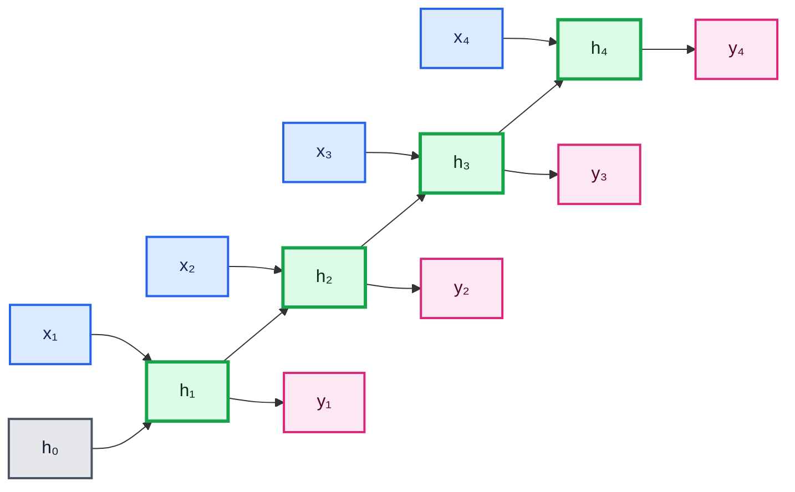
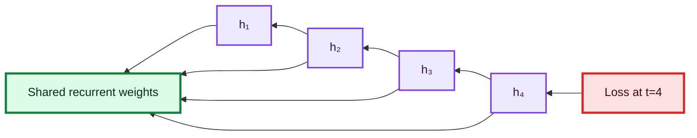
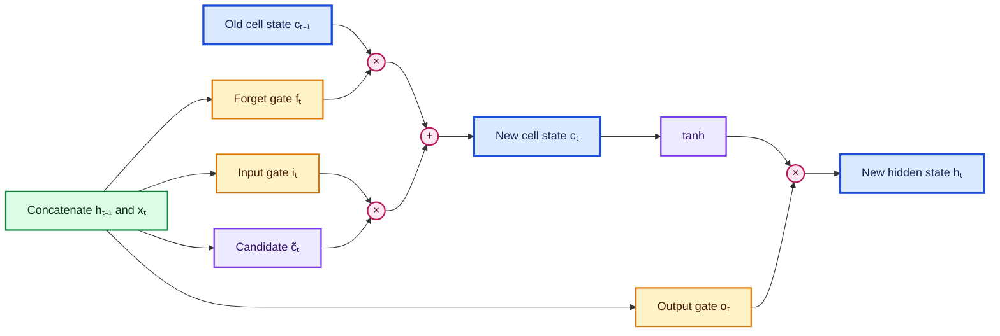
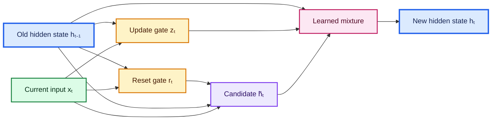
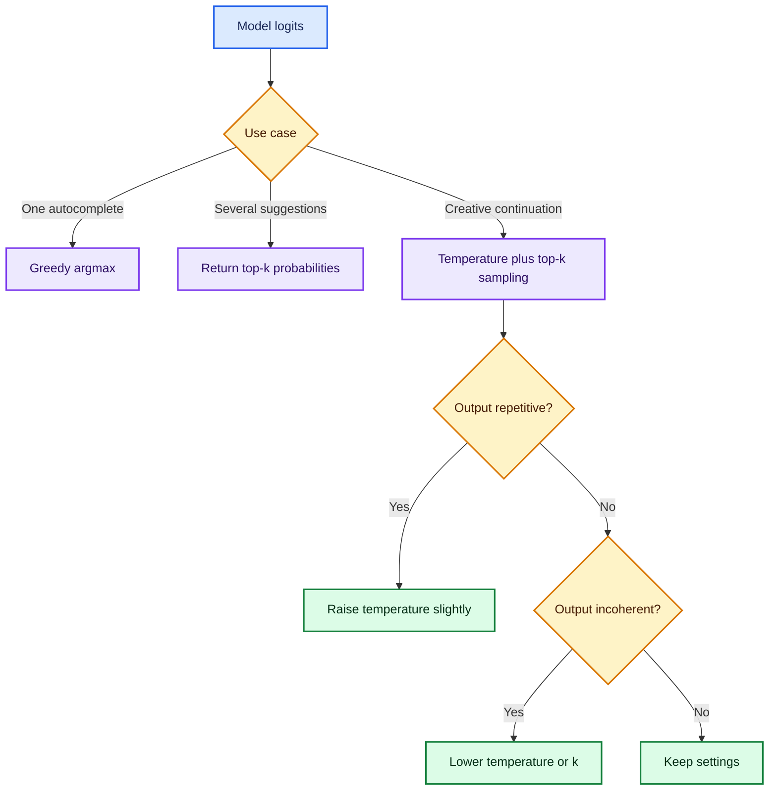
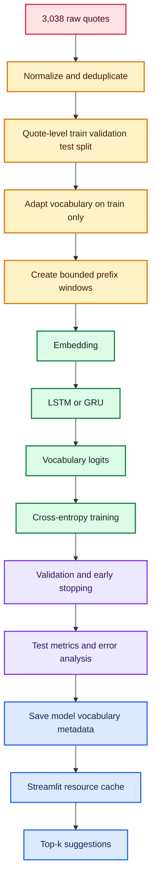

# Recurrent Neural Networks, LSTM, GRU, and Next-Word Prediction

> A detailed, source-aligned study guide built from the supplied YouTube transcript, the 13-page RNN PDF, both notebooks, the quote dataset, the saved LSTM model, and the Streamlit application.

## Learning goals

By the end of these notes, you should be able to:

- explain **what** sequential data is and **why** order changes meaning;
- derive the forward equations of a vanilla RNN, LSTM, and GRU;
- understand **how** backpropagation through time works and **why** gradients vanish or explode;
- choose between `SimpleRNN`, `LSTM`, and `GRU` for a practical problem;
- build a leakage-resistant next-word prediction pipeline;
- evaluate a language model with cross-entropy, perplexity, and top-$k$ accuracy;
- generate text with greedy, temperature, and top-$k$ decoding;
- diagnose the supplied notebooks, model, and Streamlit app; and
- deploy a corrected, reproducible next-word predictor.

## Source map

| Source | What it contributes |
|---|---|
| `Pasted text(20260806-223633).txt` | Approximately 4 hours 3 minutes of lecture material: sequential data, RNN mechanics, a sentiment example, BPTT, LSTM, GRU, quote-based language modelling, prediction, and Streamlit deployment |
| `RNN(1).pdf` | 13 visual pages covering RNN motivation, sequence representation, recurrence, BPTT, limitations, LSTM gates, and GRU gates |
| `RNNimplementation.ipynb` | A 30-sentence positive/negative classification example using `Embedding` and `SimpleRNN`, plus hidden-state inspection |
| `codefile.ipynb` | A quote-based next-word pipeline using `Tokenizer`, prefix examples, an LSTM, greedy generation, and saved preprocessing objects |
| `qoute_dataset.csv` | 3,038 quotes and their authors; note that the source filename misspells “quote” |
| `lstm_model.h5` | The trained source model: `Embedding(10000, 50)` $\rightarrow$ `LSTM(128)` $\rightarrow$ `Dense(10000)` |
| `app.py` | A Streamlit interface for one-word greedy prediction |

The transcript's original video link is [Deep Learning Complete Course, Part 3: RNN implementation](https://www.youtube.com/watch?v=0Q4yhrkwn7c).

## Concept roadmap


---

## 1. Sequential data: order is part of the information

### What is sequential data?

Sequential data consists of observations whose **position or time order matters**. Examples include:

- words in a sentence;
- daily stock prices;
- ECG measurements;
- audio samples;
- frames in a video;
- weather observations; and
- user actions in a session.

A tabular row such as `(age, salary)` contains named features. Reordering the columns does not change the underlying person if the column labels move with the values. In contrast, reordering words can completely change a sentence:

- “dog bites man”
- “man bites dog”

The vocabulary is identical, but the relationships are not.

### Why does a normal dense network struggle?

A fixed dense layer expects a fixed-size vector and does not naturally share information from one timestep to the next. Flattening a sequence creates three problems:

1. **Variable length:** sentences do not all contain the same number of words.
2. **Lost locality/order:** flattening does not explicitly model “what came before.”
3. **Parameter growth:** a separate weight for every position does not share the same language pattern across time.

An RNN addresses these issues by applying the **same recurrent cell** at every timestep and carrying a hidden state forward.

### When is recurrence useful?

Recurrence is useful when the current prediction depends on a compact summary of earlier events. It is less attractive when sequences are extremely long and highly parallel training is essential; attention-based models are often better in that setting.

> **Fun fact:** The word *recurrent* refers to a feedback connection. The previous hidden state returns as an input to the same cell at the next timestep.

---

## 2. Turning text into numbers

A neural network cannot multiply words such as “world” or “thinking” by weights. Text therefore passes through a representation pipeline.

```mermaid
flowchart LR
    A[Raw quote] --> B[Normalize Unicode and case]
    B --> C[Split into tokens]
    C --> D[Map tokens to integer IDs]
    D --> E[Pad or truncate context]
    E --> F[Embedding lookup]
    F --> G[Sequence tensor]

    classDef raw fill:#FFE4E6,stroke:#E11D48,color:#4C0519,stroke-width:2px;
    classDef clean fill:#FEF3C7,stroke:#CA8A04,color:#422006,stroke-width:2px;
    classDef ids fill:#EDE9FE,stroke:#7C3AED,color:#2E1065,stroke-width:2px;
    classDef tensor fill:#DBEAFE,stroke:#2563EB,color:#172554,stroke-width:2px;
    class A raw;
    class B,C clean;
    class D,E ids;
    class F,G tensor;
```



### 2.1 Vocabulary and token IDs

Let the vocabulary contain $V$ entries. A lookup table maps each known token $w$ to an integer:

$$
\operatorname{id}: w \mapsto \{0,1,\ldots,V-1\}
$$

Common conventions are:

- ID $0$: padding token;
- ID $1$: out-of-vocabulary token; and
- IDs $2$ onward: learned vocabulary items.

Token IDs are **identifiers**, not measurements. ID 100 is not “twice” ID 50.

### 2.2 One-hot vectors

A one-hot vector for token $i$ is

$$
x_i = [0,\ldots,0,1,0,\ldots,0]^\top \in \mathbb{R}^{V}.
$$

This avoids imposing a numeric order, but it is sparse and high-dimensional. With $V=10{,}000$, every token would require a length-10,000 vector.

### 2.3 Learned embeddings

An embedding matrix is

$$
E \in \mathbb{R}^{V\times D},
$$

where $D$ is the embedding dimension. For token ID $i$, the embedding lookup returns row $E_i\in\mathbb{R}^{D}$.

The embedding layer has

$$
P_{\text{embedding}} = VD
$$

trainable parameters. In the supplied sentiment notebook, $V=2{,}000$ and $D=16$, giving

$$
P_{\text{embedding}}=2{,}000\times16=32{,}000.
$$

### 2.4 The RNN input shape

Recurrent layers consume a rank-3 tensor:

$$
X\in\mathbb{R}^{B\times T\times D},
$$

where:

- $B$ is batch size;
- $T$ is the number of timesteps; and
- $D$ is the number of input features per timestep.

For text, $D$ is usually the embedding dimension. For a sensor stream, $D$ may be the number of sensors.

### Padding and masking

Sequences in one dense batch must normally share a length. Short sequences receive padding, while very long sequences may be truncated. If ID $0$ means padding, `Embedding(mask_zero=True)` tells compatible recurrent layers not to treat padding as real content.

**Important:** padding is a batching device, not language. A model should not learn that zeros are words.

---

## 3. Vanilla RNN: a shared cell with memory

### 3.1 What happens at one timestep?

At timestep $t$, the cell combines the current input $x_t$ with the previous hidden state $h_{t-1}$:

$$
a_t = W_{xh}x_t + W_{hh}h_{t-1}+b_h,
$$

$$
h_t = \phi(a_t).
$$

For a vanilla RNN, $\phi$ is often $\tanh$:

$$
\tanh(z)=\frac{e^z-e^{-z}}{e^z+e^{-z}}.
$$

The output may be calculated at every timestep or only at the end:

$$
z_t=W_{hy}h_t+b_y,
$$

$$
p_t=\operatorname{softmax}(z_t).
$$

### 3.2 Shape bookkeeping

Let input size be $D$, hidden size be $H$, and output size be $C$:

| Quantity | Shape |
|---|---:|
| $x_t$ | $D\times1$ |
| $h_{t-1},h_t$ | $H\times1$ |
| $W_{xh}$ | $H\times D$ |
| $W_{hh}$ | $H\times H$ |
| $b_h$ | $H\times1$ |
| $W_{hy}$ | $C\times H$ |
| $b_y$ | $C\times1$ |

The recurrent cell parameter count is

$$
P_{\text{SimpleRNN}}=DH+H^2+H.
$$

For the supplied sentiment model, $D=16$ and $H=8$:

$$
P=16(8)+8^2+8=128+64+8=200,
$$

exactly matching the notebook summary.

### 3.3 Unrolling through time

The loop-shaped RNN and its unrolled form are the same model. All timesteps share the same $W_{xh}$, $W_{hh}$, and $b_h$.



### Why share weights?

Parameter sharing allows a pattern learned at position 2 to also work at position 20. The number of recurrent parameters does **not** grow with sequence length $T$.

### What is the hidden state really?

The hidden state is not a perfect recording of every earlier token. It is a learned, fixed-length summary optimized for the task. What it remembers depends on the data, loss, model capacity, and gradient flow.

---

## 4. Sequence-to-output patterns

RNNs can be arranged according to how many inputs and outputs a task requires.


| Pattern | Example | Typical Keras setting |
|---|---|---|
| One-to-one | Standard classification | No recurrent sequence is necessary |
| Many-to-one | Sentence $\rightarrow$ sentiment | `return_sequences=False` |
| One-to-many | Seed/image $\rightarrow$ generated sequence | Decoder emits repeatedly |
| Many-to-many, aligned | Token $\rightarrow$ part-of-speech tag | `return_sequences=True` |
| Many-to-many, unaligned | Translation | Encoder-decoder architecture |

For next-word prediction from one context, we need a many-to-one mapping: many context tokens produce one distribution over the vocabulary.

---

## 5. How an RNN learns: backpropagation through time

### 5.1 Forward pass

For $t=1,\ldots,T$, compute $h_t$ from $x_t$ and $h_{t-1}$. The loss may be at the final timestep or summed over several timesteps:

$$
\mathcal{L}=\sum_{t=1}^{T}\mathcal{L}_t.
$$

For next-token prediction with target token $y$, categorical cross-entropy is

$$
\mathcal{L}=-\log p(y\mid x_{1:T}).
$$

Equivalently, using a one-hot target $y_k$,

$$
\mathcal{L}=-\sum_{k=1}^{V}y_k\log p_k.
$$

### 5.2 Backward pass

Backpropagation through time (BPTT) treats the unrolled RNN as a deep network whose depth is the number of timesteps. Gradients from later losses flow backward through earlier states.



A distant dependency contains a product of Jacobians:

$$
\frac{\partial h_t}{\partial h_k}
=
\prod_{j=k+1}^{t}
\frac{\partial h_j}{\partial h_{j-1}}.
$$

For a tanh RNN,

$$
\frac{\partial h_j}{\partial h_{j-1}}
=
\operatorname{diag}\!\left(1-h_j^2\right)W_{hh}.
$$

The repeated product is the source of both vanishing and exploding gradients.

### 5.3 Full versus truncated BPTT

- **Full BPTT** propagates through the complete sequence. It is exact but can be slow and memory-intensive.
- **Truncated BPTT** breaks a long stream into shorter chunks. It is cheaper but limits how far a single update can assign credit.

Use truncated BPTT for long continuous streams when full unrolling is impractical.

---

## 6. Why vanilla RNNs forget: vanishing and exploding gradients

Suppose the typical Jacobian norm is approximately $\rho$. Across $n$ steps, the gradient scale behaves roughly like

$$
\left\|\frac{\partial h_t}{\partial h_{t-n}}\right\|\approx \rho^n.
$$

- If $0<\rho<1$, then $\rho^n\rightarrow0$: **vanishing gradient**.
- If $\rho>1$, then $\rho^n\rightarrow\infty$: **exploding gradient**.

For example:

$$
0.8^{50}\approx1.43\times10^{-5},
$$

while

$$
1.2^{50}\approx9.10\times10^3.
$$

### Consequences

- Early tokens receive little learning signal.
- Long-range relationships are difficult to learn.
- Training may become unstable or produce `NaN` values.
- A fixed hidden state can become a short-term bottleneck.

### Remedies

| Problem | Practical remedy | What it does |
|---|---|---|
| Exploding gradients | Gradient clipping | Caps the update magnitude |
| Vanishing gradients | LSTM or GRU gates | Creates easier information and gradient paths |
| Unstable recurrence | Orthogonal initialization | Helps preserve norms early in training |
| Overlong context | Truncated windows | Reduces effective depth and computation |
| Overfitting | Validation, dropout, early stopping | Controls memorization |

Global-norm clipping is

$$
g' = g\cdot\min\left(1,\frac{\tau}{\|g\|_2}\right),
$$

where $\tau$ is the clipping threshold.

**Nuance:** LSTM and GRU **mitigate** vanishing gradients; they do not mathematically guarantee perfect memory over arbitrary lengths.

---

## 7. LSTM: a gated memory highway

Long Short-Term Memory introduces a cell state $c_t$ in addition to hidden state $h_t$. Gates learn what to forget, write, and reveal.

Let $[h_{t-1};x_t]$ denote concatenation. The standard equations are:

### 7.1 Forget gate

$$
f_t=\sigma\left(W_f[h_{t-1};x_t]+b_f\right).
$$

Each component of $f_t\in(0,1)^H$ controls how much old cell information survives:

- near $0$: forget it;
- near $1$: preserve it.

### 7.2 Input gate and candidate memory

$$
i_t=\sigma\left(W_i[h_{t-1};x_t]+b_i\right),
$$

$$
\widetilde{c}_t=\tanh\left(W_c[h_{t-1};x_t]+b_c\right).
$$

The input gate decides how much of the candidate should be written.

### 7.3 Cell-state update

$$
c_t=f_t\odot c_{t-1}+i_t\odot\widetilde{c}_t.
$$

The additive path through $c_t$ is crucial. It gives gradients a route that is less dominated by repeated matrix multiplication.

### 7.4 Output gate and hidden state

$$
o_t=\sigma\left(W_o[h_{t-1};x_t]+b_o\right),
$$

$$
h_t=o_t\odot\tanh(c_t).
$$

The output gate determines which part of the internal memory becomes externally visible.



### 7.5 LSTM parameter count

An LSTM contains four affine transformations: forget, input, candidate, and output. With input size $D$ and hidden size $H$:

$$
P_{\text{LSTM}}=4(DH+H^2+H).
$$

For the supplied model, $D=50$ and $H=128$:

$$
P_{\text{LSTM}}
=4(50\cdot128+128^2+128)
=91{,}648.
$$

### When should you use LSTM?

Use an LSTM when:

- earlier events may matter many steps later;
- a vanilla RNN underfits long dependencies;
- sequence lengths are moderate;
- recurrence is acceptable at inference time; and
- the dataset is not large enough to justify a much larger attention model.

> **Fun fact:** The Keras documentation identifies LSTM with Hochreiter's 1997 architecture. Modern implementations retain the same core gated-memory idea while optimizing kernels for current hardware.

---

## 8. GRU: a simpler gated recurrent unit

A GRU merges LSTM's separate cell and hidden states into one hidden state. It usually uses two gates.

One common convention is:

### 8.1 Update gate

$$
z_t=\sigma(W_zx_t+U_zh_{t-1}+b_z).
$$

### 8.2 Reset gate

$$
r_t=\sigma(W_rx_t+U_rh_{t-1}+b_r).
$$

### 8.3 Candidate state

$$
\widetilde{h}_t
=\tanh\left(W_hx_t+U_h(r_t\odot h_{t-1})+b_h\right).
$$

### 8.4 New hidden state

$$
h_t=(1-z_t)\odot h_{t-1}+z_t\odot\widetilde{h}_t.
$$

Under this convention, a larger $z_t$ writes more candidate information. Some references reverse the two mixture coefficients. The network is equivalent if the gate definition is changed consistently; always check the implementation's convention.



For the three main transformations, a simplified parameter count is

$$
P_{\text{GRU}}\approx3(DH+H^2+H).
$$

Exact bias counting depends on the GRU variant. Keras documents both the original and reset-after variants.

### LSTM versus GRU

| Property | LSTM | GRU |
|---|---|---|
| Recurrent states | Hidden $h_t$ and cell $c_t$ | Hidden $h_t$ only |
| Main gates | Forget, input, output | Update, reset |
| Parameter count | Higher | Usually lower |
| Training speed | Often slower | Often faster |
| Expressive memory control | More explicit | More compact |
| Guaranteed winner? | No | No |

Choose by validation performance, latency, memory, and maintainability rather than by a universal rule.

---

## 9. `SimpleRNN`, `LSTM`, and `GRU` in Keras

The core call pattern is similar:

```python
import keras
from keras import layers

# Input shape excludes the batch dimension: (timesteps, features).
inputs = keras.Input(shape=(None, 64), name="embedded_sequence")

# Choose exactly one recurrent layer for an experiment.
x = layers.LSTM(
    units=128,
    return_sequences=False,  # Return only the last output.
    return_state=False,      # Do not separately return h_T and c_T.
)(inputs)

outputs = layers.Dense(2, activation="softmax")(x)
model = keras.Model(inputs, outputs)
```

### Critical arguments

- `units`: hidden-state size $H$.
- `return_sequences=False`: output shape $(B,H)$.
- `return_sequences=True`: output shape $(B,T,H)$.
- `return_state=True`: additionally returns the final state.
- `go_backwards=True`: processes the sequence in reverse.
- `stateful=True`: carries batch states between calls; this requires strict batch ordering.
- `dropout`: drops input transformations during training.
- `recurrent_dropout`: drops recurrent transformations but can prevent the fastest fused GPU path.

The current Keras LSTM and GRU documentation notes that right-padded masked inputs are required for the optimized cuDNN path. That is one practical reason to prefer **post-padding** when GPU speed matters.

---

## 10. Worked example: the supplied sentiment RNN

The first notebook creates 30 short sentences:

- 15 positive examples with label $1$;
- 15 negative examples with label $0$.

The pipeline is:

$$
\text{sentence}
\rightarrow\text{token IDs}
\rightarrow\text{padding}
\rightarrow\text{embedding}
\rightarrow\text{SimpleRNN}
\rightarrow\sigma
\rightarrow\text{sentiment probability}.
$$

### 10.1 Model parameter audit

| Layer | Calculation | Parameters |
|---|---:|---:|
| Embedding | $2{,}000\times16$ | 32,000 |
| SimpleRNN | $16\times8+8\times8+8$ | 200 |
| Dense | $8\times1+1$ | 9 |
| **Total** | | **32,209** |

The notebook reaches 100% accuracy on its **training data**. This is not evidence of generalization because:

- there are only 30 hand-written examples;
- no validation or test split is used;
- the embedding table alone has more than 1,000 times as many parameters as examples; and
- the sentences contain obvious class-specific words.

### 10.2 Why the hidden state repeats at the padding step

For “I love this product,” the padded sequence is `[3, 26, 2, 7, 0]`. Because `mask_zero=True`, the final zero is masked. The inspected hidden state at timestep 5 therefore repeats the state from timestep 4 instead of processing padding as a token.

This is a useful sanity check: masking is doing its job.

### 10.3 A better experiment

For a real sentiment system:

1. collect many independently labelled examples;
2. split by original example before learning vocabulary;
3. adapt preprocessing only on training text;
4. monitor validation loss and F1/ROC-AUC where appropriate;
5. compare against a bag-of-words logistic-regression baseline; and
6. inspect failure cases, not only aggregate accuracy.

---

## 11. Next-word prediction as language modelling

Given previous tokens $w_1,\ldots,w_t$, a language model estimates

$$
P(w_{t+1}\mid w_1,\ldots,w_t).
$$

The chain rule factorizes a whole sequence:

$$
P(w_1,\ldots,w_T)
=\prod_{t=1}^{T}P(w_t\mid w_1,\ldots,w_{t-1}).
$$

### Turning one quote into examples

For the tokenized quote

```text
we learn from mistakes
```

prefix training examples are:

| Context $X$ | Target $y$ |
|---|---|
| `we` | `learn` |
| `we learn` | `from` |
| `we learn from` | `mistakes` |

If the context limit is $L=3$, each input is pre-padded or truncated to length 3:

```text
[PAD, PAD, we]       -> learn
[PAD, we, learn]     -> from
[we, learn, from]    -> mistakes
```

### Teacher forcing

During training, the model receives the **true previous tokens**. During free generation, it receives its **own earlier predictions**. Errors can therefore compound. This train/inference mismatch is often called exposure bias.

---

## 12. Audit of `qoute_dataset.csv`

The spreadsheet audit was read-only; no source data was modified.

| Property | Observed value |
|---|---:|
| Rows | 3,038 |
| Columns | `quote`, `Author` |
| Missing values | 0 |
| Duplicate rows | 0 |
| Duplicate quote texts | 1 |
| Unique author strings | 1,005 |
| Mean quote length | 29.44 words |
| Median quote length | 18 words |
| 95th percentile | 89 words |
| 99th percentile | 202.52 words |
| Maximum | 749 words |
| Maximum character count | 3,903 |

### Important data-quality observations

1. **Extreme length outliers:** one quote contains 749 words, while the median contains 18. The notebook's prefix construction therefore sets `max_len=745`, forcing nearly every example to carry hundreds of zeros.
2. **Inconsistent author labels:** for example, `Oscar Wilde` and `Oscar Wilde,` become different authors.
3. **Unicode punctuation:** 116 quotes contain a left curly quote and 100 contain a right curly quote. Python's `string.punctuation` removes ASCII punctuation but not curly Unicode marks, so the notebook can create tokens such as `“the` separately from `the`.
4. **Long passages and poems:** several rows are closer to essays or poems than short quotations. Decide whether they belong in the intended product.
5. **Very short rows:** one quote contains only `Ah,`, providing almost no next-word training signal.

### Why split before creating prefixes?

If prefixes from the same quote appear in both training and validation sets, they are near-duplicates:

```text
train:      we learn from
validation: we learn from mistakes
```

Validation then measures memorization of the same quote rather than transfer to unseen quotes. Split complete rows first, then create windows separately inside each split.

### Context length should be a design choice

The maximum observed length is not automatically the best context length. For this dataset, a context such as $L=40$ or $L=64$ is a sensible starting experiment because it:

- covers most short quotes;
- limits memory and recurrence depth;
- prevents one long row from defining every tensor shape; and
- makes deployment latency predictable.

Select $L$ with validation results and product constraints.

---

## 13. Audit of the supplied next-word notebook

The notebook produces 85,271 prefix/target examples and a vocabulary limit of 10,000.

### 13.1 One-hot target memory

It executes:

```python
y_one_hot = to_categorical(y, num_classes=10000)
```

This materializes

$$
85{,}271\times10{,}000=852{,}710{,}000
$$

floating-point values. At 4 bytes per `float32`, that is

$$
3.41084\text{ GB}\approx3.177\text{ GiB}.
$$

Integer labels require only about $0.325$ MiB. Use sparse categorical cross-entropy and do not create `y_one_hot`.

### 13.2 Padded input memory

The integer matrix has shape $(85{,}271,745)$. At 4 bytes per `int32`, it consumes approximately

$$
242.34\text{ MiB}.
$$

A context length of 40 would be about $18.4$ times shorter.

### 13.3 Other implementation issues

- No train/validation/test split is created.
- Vocabulary is fitted on all quotes, leaking validation/test vocabulary statistics.
- `Tokenizer` is stored in a variable named `tokinizer`, increasing maintenance risk.
- ASCII-only punctuation deletion leaves Unicode punctuation artifacts.
- `input_length` is deprecated in the shown Keras warning.
- The initial summaries display zero parameters because the Sequential models are unbuilt when `summary()` is called.
- The LSTM loads a previously saved file, so the visible notebook does not document the actual training history.
- Greedy `argmax` generation is deterministic and repetitive.
- The final cell contains only `z`, which raises `NameError` if run.

---

## 14. Corrected training pipeline

This example uses a fixed context, sparse labels, quote-level splitting, Unicode-aware normalization, reproducible shuffling, masking, validation, and modern `.keras` saving.

### 14.1 Imports and deterministic setup

```python
from __future__ import annotations

import json
import random
import re
import unicodedata
from pathlib import Path

import keras
import numpy as np
import pandas as pd
import tensorflow as tf
from keras import layers

SEED = 42
MAX_TOKENS = 10_000
CONTEXT_LEN = 40
BATCH_SIZE = 128

# Sets Python, NumPy, and TensorFlow seeds together.
keras.utils.set_random_seed(SEED)
```

### 14.2 Normalize text consistently

```python
def normalize_text(text: str) -> str:
    """Return a stable, lowercase, whitespace-tokenized representation."""
    # NFKC normalizes compatible Unicode forms.
    text = unicodedata.normalize("NFKC", str(text)).lower()

    # Replace all Unicode punctuation and symbols with spaces.
    text = "".join(
        " " if unicodedata.category(char)[0] in {"P", "S"} else char
        for char in text
    )

    # Collapse tabs, newlines, and repeated spaces.
    return re.sub(r"\s+", " ", text).strip()


data_path = Path("qoute_dataset.csv")
frame = pd.read_csv(data_path)
frame["clean_quote"] = frame["quote"].map(normalize_text)

# Remove empty text and exact duplicate normalized quotes.
frame = frame.loc[frame["clean_quote"].ne("")]
frame = frame.drop_duplicates(subset="clean_quote").reset_index(drop=True)
```

If apostrophes should be retained, modify the punctuation rule deliberately. The same normalization function must be used during both training and inference.

### 14.3 Split complete quotes first

```python
rng = np.random.default_rng(SEED)
indices = rng.permutation(len(frame))

n_train = int(0.80 * len(indices))
n_val = int(0.10 * len(indices))

train_idx = indices[:n_train]
val_idx = indices[n_train : n_train + n_val]
test_idx = indices[n_train + n_val :]

train_text = frame.loc[train_idx, "clean_quote"].tolist()
val_text = frame.loc[val_idx, "clean_quote"].tolist()
test_text = frame.loc[test_idx, "clean_quote"].tolist()
```

For author-sensitive evaluation, consider grouping by normalized author so the same author's style does not appear across all splits.

### 14.4 Learn vocabulary from training text only

```python
vectorizer = layers.TextVectorization(
    max_tokens=MAX_TOKENS,
    standardize=None,       # Text is already normalized.
    split="whitespace",
    output_mode="int",
)
vectorizer.adapt(tf.data.Dataset.from_tensor_slices(train_text).batch(128))

vocabulary = vectorizer.get_vocabulary()
VOCAB_SIZE = len(vocabulary)
```

The learned vocabulary contains padding and out-of-vocabulary entries. Learning it only from training data preserves a fair evaluation.

### 14.5 Create bounded prefix windows

```python
def make_examples(texts: list[str]) -> tuple[np.ndarray, np.ndarray]:
    """Create fixed-length contexts and integer next-token labels."""
    contexts: list[list[int]] = []
    targets: list[int] = []

    # Vectorize in one batch, then remove zero padding per quote.
    encoded_batch = vectorizer(tf.constant(texts)).numpy()

    for encoded in encoded_batch:
        token_ids = encoded[encoded != 0].tolist()

        # Each position after the first supplies one next-token example.
        for target_pos in range(1, len(token_ids)):
            left = max(0, target_pos - CONTEXT_LEN)
            context = token_ids[left:target_pos]

            # Pre-pad so the newest token is at the right edge.
            padded = [0] * (CONTEXT_LEN - len(context)) + context
            contexts.append(padded)
            targets.append(token_ids[target_pos])

    return (
        np.asarray(contexts, dtype=np.int32),
        np.asarray(targets, dtype=np.int32),
    )


X_train, y_train = make_examples(train_text)
X_val, y_val = make_examples(val_text)
X_test, y_test = make_examples(test_text)
```

For a larger corpus, generate windows lazily with `tf.data` instead of holding every context in RAM.

### 14.6 Build the model

```python
inputs = keras.Input(shape=(CONTEXT_LEN,), dtype="int32", name="token_ids")

x = layers.Embedding(
    input_dim=VOCAB_SIZE,
    output_dim=64,
    mask_zero=True,
    name="embedding",
)(inputs)
x = layers.LSTM(128, name="lstm")(x)
x = layers.Dropout(0.2)(x)

# Return logits. The loss applies the numerically stable softmax internally.
logits = layers.Dense(VOCAB_SIZE, name="next_token_logits")(x)
model = keras.Model(inputs, logits, name="quote_next_word_lstm")

model.compile(
    optimizer=keras.optimizers.Adam(learning_rate=1e-3, clipnorm=1.0),
    loss=keras.losses.SparseCategoricalCrossentropy(from_logits=True),
    metrics=[
        keras.metrics.SparseCategoricalAccuracy(name="top1_accuracy"),
        keras.metrics.SparseTopKCategoricalAccuracy(k=5, name="top5_accuracy"),
    ],
)

model.summary()
```

### 14.7 Train and evaluate

```python
callbacks = [
    keras.callbacks.EarlyStopping(
        monitor="val_loss",
        patience=3,
        restore_best_weights=True,
    ),
    keras.callbacks.ModelCheckpoint(
        "best_quote_lstm.keras",
        monitor="val_loss",
        save_best_only=True,
    ),
]

history = model.fit(
    X_train,
    y_train,
    validation_data=(X_val, y_val),
    epochs=30,
    batch_size=BATCH_SIZE,
    callbacks=callbacks,
)

test_metrics = model.evaluate(X_test, y_test, return_dict=True)
print(test_metrics)
```

Test data should be evaluated once after model and hyperparameter decisions are complete.

### 14.8 Save the complete preprocessing contract

```python
artifact_dir = Path("artifacts")
artifact_dir.mkdir(exist_ok=True)

model.save(artifact_dir / "quote_lstm.keras")

# JSON is transparent and avoids executing code during deserialization.
(artifact_dir / "vocabulary.json").write_text(
    json.dumps(vocabulary, ensure_ascii=False, indent=2),
    encoding="utf-8",
)
(artifact_dir / "metadata.json").write_text(
    json.dumps(
        {
            "context_len": CONTEXT_LEN,
            "normalization": "NFKC; lowercase; Unicode P/S to spaces; collapse whitespace",
            "seed": SEED,
        },
        indent=2,
    ),
    encoding="utf-8",
)
```

The model, vocabulary, context length, and normalization rule are one logical artifact. Changing only one can silently corrupt inference.

---

## 15. Evaluation: accuracy is not enough

### 15.1 Cross-entropy

Average test cross-entropy over $N$ target tokens is

$$
H=-\frac{1}{N}\sum_{i=1}^{N}\log p\left(y_i\mid x_i\right).
$$

Lower is better. Cross-entropy rewards calibrated probability assigned to the correct word, not only the highest-ranked word.

### 15.2 Perplexity

Perplexity is

$$
\operatorname{PPL}=e^H.
$$

If $H=2.30$, then

$$
\operatorname{PPL}\approx e^{2.30}\approx9.97.
$$

The model is, informally, as uncertain as choosing among roughly 10 plausible options on average. Compare perplexities only when tokenization, vocabulary, and evaluation data are compatible.

### 15.3 Top-$k$ accuracy

Top-$k$ accuracy counts a target as correct if it appears among the $k$ highest-scoring tokens:

$$
\operatorname{Acc@k}
=\frac{1}{N}\sum_{i=1}^{N}
\mathbf{1}\left[y_i\in\operatorname{TopK}(z_i)
\right].
$$

Top-5 accuracy is useful for an autocomplete interface that presents several suggestions.

### 15.4 Qualitative evaluation

Inspect predictions for:

- short and long contexts;
- unseen words;
- author names and rare terms;
- repetitive loops;
- punctuation and casing differences;
- memorized training quotes; and
- harmful or inappropriate output.

---

## 16. Decoding: choosing the next word

The model emits logits $z_i$. Convert them to probabilities with softmax:

$$
p_i=\frac{e^{z_i}}{\sum_j e^{z_j}}.
$$

### 16.1 Greedy decoding

$$
\hat{w}=\arg\max_i p_i.
$$

Greedy decoding is reproducible and good for single autocomplete suggestions, but repeated use can produce dull or looping text.

### 16.2 Temperature

$$
p_i^{(\tau)}
=\frac{\exp(z_i/\tau)}{\sum_j\exp(z_j/\tau)}.
$$

- $\tau<1$: sharper, safer, less diverse;
- $\tau=1$: original distribution;
- $\tau>1$: flatter, more varied, more errors.

Temperature changes confidence but does not add knowledge.

### 16.3 Top-$k$ sampling

Keep only the $k$ largest logits, renormalize, and sample. This prevents extremely low-probability words from being selected.



### 16.4 Stable prediction helpers

```python
def encode_context(
    text: str,
    token_to_id: dict[str, int],
    context_len: int,
) -> np.ndarray:
    """Normalize text and return one pre-padded model input."""
    tokens = normalize_text(text).split()
    oov_id = 1
    ids = [token_to_id.get(token, oov_id) for token in tokens]
    ids = ids[-context_len:]
    ids = [0] * (context_len - len(ids)) + ids
    return np.asarray([ids], dtype=np.int32)


def top_k_predictions(
    model: keras.Model,
    text: str,
    vocabulary: list[str],
    context_len: int,
    k: int = 5,
) -> list[tuple[str, float]]:
    """Return the k highest-probability non-special tokens."""
    token_to_id = {word: idx for idx, word in enumerate(vocabulary)}
    model_input = encode_context(text, token_to_id, context_len)
    logits = model.predict(model_input, verbose=0)[0]
    probabilities = keras.ops.convert_to_numpy(keras.ops.softmax(logits))

    # Do not suggest padding or OOV tokens.
    probabilities[:2] = 0.0
    probabilities /= probabilities.sum()

    k = min(k, len(probabilities) - 2)
    candidate_ids = np.argpartition(probabilities, -k)[-k:]
    candidate_ids = candidate_ids[np.argsort(probabilities[candidate_ids])[::-1]]

    return [
        (vocabulary[token_id], float(probabilities[token_id]))
        for token_id in candidate_ids
    ]
```

The source app scans the entire `word_index` dictionary after every prediction. A vocabulary list provides constant-time ID-to-word lookup.

---

## 17. Forensic audit of `lstm_model.h5`

The supplied file is a 7,551,776-byte legacy HDF5 Keras model. Its embedded configuration reports:

```text
Input:      (None, 745)
Embedding:  input_dim=10000, output_dim=50, mask_zero=False
LSTM:       128 units, tanh activation, sigmoid recurrent activation
Dense:      10000 units, softmax activation
Loss:       categorical_crossentropy
Optimizer:  Adam, learning rate about 0.001
```

### Parameter count

| Component | Formula | Parameters |
|---|---:|---:|
| Embedding | $10{,}000\times50$ | 500,000 |
| LSTM | $4(50\times128+128^2+128)$ | 91,648 |
| Dense | $128\times10{,}000+10{,}000$ | 1,290,000 |
| **Total** | | **1,881,648** |

At four bytes per `float32`, the weights alone require 7,526,592 bytes, which explains nearly all of the file size.

### Architectural observations

- Most parameters are in the 10,000-way output layer.
- `mask_zero=False` means the LSTM processes all leading zeros as repeated padding timesteps.
- The input length 745 comes from a length outlier, not a demonstrated product need.
- Softmax is embedded in the final layer, while a logits output plus `from_logits=True` is often numerically cleaner.
- HDF5 is treated as legacy by modern Keras; `.keras` is the native whole-model format.

---

## 18. Audit and correction of the Streamlit app

### Source defects

| Source behavior | Why it matters | Correction |
|---|---|---|
| Loads `lstm_model (1).h5` | Attached file is named `lstm_model.h5` | Use one exact, versioned artifact path |
| Requires `tokenizer.pkl` and `max_len.pkl` | Neither was supplied | Package preprocessing metadata with the model |
| Pads to `max_len - 1` | Model configuration expects 745 positions, but app creates 744 | Use the exact saved input length |
| Performs a linear dictionary scan | $O(V)$ reverse lookup per request | Use `vocabulary[predicted_id]` |
| Uses plain `argmax` | Only one deterministic result | Offer top-$k$ suggestions and probabilities |
| Uses `pickle.load` | Unpickling untrusted files can execute code | Prefer transparent JSON and trust only controlled artifacts |
| No artifact checks | Failures appear as obscure stack traces | Validate paths and metadata at startup |
| No OOV feedback | Empty or unknown inputs can be misleading | Handle empty/unknown contexts explicitly |

### Corrected Streamlit application

```python
from __future__ import annotations

import json
import re
import unicodedata
from pathlib import Path

import keras
import numpy as np
import streamlit as st

ARTIFACT_DIR = Path(__file__).parent / "artifacts"
MODEL_PATH = ARTIFACT_DIR / "quote_lstm.keras"
VOCAB_PATH = ARTIFACT_DIR / "vocabulary.json"
METADATA_PATH = ARTIFACT_DIR / "metadata.json"


def normalize_text(text: str) -> str:
    """Apply the exact training-time normalization contract."""
    text = unicodedata.normalize("NFKC", str(text)).lower()
    text = "".join(
        " " if unicodedata.category(char)[0] in {"P", "S"} else char
        for char in text
    )
    return re.sub(r"\s+", " ", text).strip()


@st.cache_resource
def load_resources():
    """Load the model once and reuse it across Streamlit reruns."""
    required = [MODEL_PATH, VOCAB_PATH, METADATA_PATH]
    missing = [str(path) for path in required if not path.is_file()]
    if missing:
        raise FileNotFoundError(f"Missing artifacts: {missing}")

    model = keras.models.load_model(MODEL_PATH, compile=False)
    vocabulary = json.loads(VOCAB_PATH.read_text(encoding="utf-8"))
    metadata = json.loads(METADATA_PATH.read_text(encoding="utf-8"))

    context_len = int(metadata["context_len"])
    if model.input_shape[-1] != context_len:
        raise ValueError(
            f"Model expects {model.input_shape[-1]} tokens, "
            f"but metadata says {context_len}."
        )

    token_to_id = {word: idx for idx, word in enumerate(vocabulary)}
    return model, vocabulary, token_to_id, context_len


def prepare_input(text: str, token_to_id: dict[str, int], length: int):
    tokens = normalize_text(text).split()
    ids = [token_to_id.get(token, 1) for token in tokens][-length:]
    ids = [0] * (length - len(ids)) + ids
    return np.asarray([ids], dtype=np.int32), tokens


def predict_top_k(text: str, k: int = 5):
    model, vocabulary, token_to_id, context_len = load_resources()
    model_input, tokens = prepare_input(text, token_to_id, context_len)
    if not tokens:
        return []

    logits = model.predict(model_input, verbose=0)[0]
    probabilities = np.asarray(keras.ops.softmax(logits))
    probabilities[:2] = 0.0
    probabilities /= probabilities.sum()

    k = min(k, len(probabilities) - 2)
    ids = np.argpartition(probabilities, -k)[-k:]
    ids = ids[np.argsort(probabilities[ids])[::-1]]
    return [(vocabulary[i], float(probabilities[i])) for i in ids]


st.set_page_config(page_title="Next-Word Suggestions", page_icon="🧠")
st.title("🧠 LSTM Next-Word Suggestions")
st.caption("Educational model trained on a small quote collection")

user_text = st.text_input(
    "Context",
    placeholder="For example: the world is",
)
k = st.slider("Number of suggestions", min_value=1, max_value=10, value=5)

if st.button("Predict", type="primary"):
    if not user_text.strip():
        st.warning("Enter at least one word.")
    else:
        try:
            suggestions = predict_top_k(user_text, k=k)
            if not suggestions:
                st.warning("No usable tokens were found.")
            else:
                for word, probability in suggestions:
                    st.write(f"**{word}** - {probability:.2%}")
        except (FileNotFoundError, ValueError) as error:
            st.error(str(error))
```

Run it with:

```bash
streamlit run app.py
```

Do not present the output as a factual answer engine. It predicts stylistically likely continuations from a small quote corpus.

---

## 19. End-to-end project architecture



### Reproducibility checklist

- [ ] Fix random seeds and record library versions.
- [ ] Split raw quotes before creating windows.
- [ ] Fit vocabulary only on training text.
- [ ] Store the exact normalization contract.
- [ ] Use sparse integer targets.
- [ ] Bound context length deliberately.
- [ ] Mask padding.
- [ ] Monitor validation loss and top-$k$ accuracy.
- [ ] Save the best model, not merely the last epoch.
- [ ] Evaluate once on untouched test quotes.
- [ ] Package model, vocabulary, and metadata together.
- [ ] Test artifact loading in a clean environment.

---

## 20. When to use RNNs in the age of Transformers

Transformers use attention to connect positions more directly and parallelize training across tokens. RNNs process positions sequentially. That does not make RNNs obsolete.

| Prefer an RNN/LSTM/GRU when... | Prefer a Transformer when... |
|---|---|
| The model must be small | Large-scale pretraining is available |
| Streaming state should update one step at a time | Long-range context is central |
| Sequences are moderate | Training parallelism matters greatly |
| The device has tight memory/compute limits | Hardware can support attention cost |
| A recurrent inductive bias fits the signal | Transfer learning from pretrained language models is important |
| You need a strong educational baseline | State-of-the-art NLP quality is the goal |

For this 3,038-quote teaching dataset, an LSTM is valuable because the full pipeline is transparent. For a production autocomplete system, compare it with n-grams, GRUs, compact Transformers, and pretrained models under the same latency and quality constraints.

---

## 21. Common misconceptions and corrections

| Misconception | Correction |
|---|---|
| “RNNs accept any length without preparation.” | A layer can be defined with variable $T$, but dense batches still need compatible shapes, padding, masking, ragged handling, or bucketing. |
| “The hidden state stores every earlier word.” | It is a lossy, task-optimized summary of fixed dimension. |
| “LSTM solves vanishing gradients completely.” | It improves gradient flow but can still forget or fail on very long/noisy sequences. |
| “GRU is always better because it is newer.” | GRU is smaller; LSTM may perform better on some tasks. Validate both. |
| “Training accuracy of 100% means the model works.” | It may only mean the model memorized training examples. |
| “The longest sample should define `max_len`.” | One outlier can waste almost all memory and computation. Choose context length deliberately. |
| “One-hot labels are required for softmax.” | Integer labels work with sparse categorical cross-entropy and are far smaller. |
| “Argmax generation is the model's only answer.” | It is one decoding policy. Top-$k$ and temperature expose alternatives. |
| “A model file alone is enough for deployment.” | Token mapping, normalization, context length, and versions are part of the model contract. |
| “Pickle is a neutral data format.” | Loading an untrusted pickle can execute code. Use controlled artifacts or safer transparent formats. |

---

## 22. Practice questions

### Questions

1. What makes data sequential?
2. Why are token IDs not suitable as numeric features by themselves?
3. What is the shape of an embedded batch with $B=32$, $T=40$, and $D=64$?
4. Write the vanilla RNN hidden-state equation.
5. Why does an RNN share parameters across timesteps?
6. Calculate the parameter count of a `SimpleRNN` with $D=10$ and $H=20$.
7. What does `return_sequences=True` change?
8. What is BPTT?
9. Why can gradients vanish across many timesteps?
10. How does gradient clipping address exploding gradients?
11. Name the three LSTM gates and their roles.
12. Why is the LSTM cell-state update helpful for gradient flow?
13. How does a GRU differ structurally from an LSTM?
14. Why should complete quotes be split before prefixes are generated?
15. Why is sparse categorical cross-entropy preferable in the supplied project?
16. What is perplexity if average cross-entropy is $\ln 20$?
17. What happens when temperature approaches zero?
18. Why is `max_len=745` questionable for this dataset?
19. Identify three deployment defects in the supplied `app.py`.
20. When might a small GRU be preferable to a Transformer?

### Answers

1. Order or time changes the interpretation or prediction.
2. IDs are arbitrary categories; their numeric distances have no semantic meaning.
3. $(32,40,64)$.
4. $h_t=\phi(W_{xh}x_t+W_{hh}h_{t-1}+b_h)$.
5. Sharing learns one transition rule usable at every position and keeps parameters independent of $T$.
6. $10(20)+20^2+20=620$.
7. The layer returns all timestep outputs with shape $(B,T,H)$ rather than only $(B,H)$.
8. It is backpropagation through the time-unrolled recurrent computation graph.
9. Gradients contain repeated Jacobian products; factors with norms below one shrink exponentially.
10. It rescales gradients whose norm exceeds a threshold, limiting unstable updates.
11. Forget retains/removes old memory; input writes candidates; output exposes cell memory as hidden state.
12. Its additive update creates a more direct information and gradient path.
13. A GRU usually has update and reset gates and only one recurrent state; an LSTM has three gates plus separate hidden and cell states.
14. Otherwise overlapping prefixes from one quote can leak across splits and inflate validation results.
15. It stores one integer target per example instead of a length-10,000 one-hot vector, reducing target storage from about 3.177 GiB to about 0.325 MiB.
16. $e^{\ln20}=20$.
17. The distribution becomes sharply concentrated around the largest logit, approaching greedy decoding.
18. It is caused by an extreme outlier while the median quote is only 18 words; it wastes padding and recurrence.
19. Examples: wrong model filename, missing tokenizer/max-length files, padding length 744 versus model input 745, linear vocabulary scan, single greedy result, and pickle risk.
20. When streaming state, compact size, limited compute, moderate sequences, and low latency are more important than large-scale transfer learning.

---

## 23. Quick interview sheet

### Explain an RNN in one sentence

An RNN repeatedly applies one learned transition function to a sequence while carrying a hidden state that summarizes earlier inputs.

### Explain LSTM in one sentence

An LSTM augments recurrence with gated, additive cell memory so the model can retain, update, and expose information more selectively.

### Explain GRU in one sentence

A GRU is a compact gated RNN that combines memory and output into one hidden state controlled mainly by update and reset gates.

### The most important formulas

$$
h_t=\tanh(W_{xh}x_t+W_{hh}h_{t-1}+b_h)
$$

$$
c_t=f_t\odot c_{t-1}+i_t\odot\widetilde{c}_t
$$

$$
h_t=o_t\odot\tanh(c_t)
$$

$$
\mathcal{L}=-\log P(w_{t+1}\mid w_{1:t})
$$

$$
\operatorname{PPL}=e^{\mathcal{L}_{\text{average}}}
$$

---

## 24. Fun facts and deeper intuitions

- **Time depth:** a 100-token vanilla RNN is mathematically similar to a 100-layer weight-shared network when unrolled.
- **Parameters versus compute:** recurrent parameter count does not grow with $T$, but compute latency generally does because $h_t$ depends on $h_{t-1}$.
- **The output layer dominates:** in the supplied LSTM, 1,290,000 of 1,881,648 parameters are in the vocabulary projection.
- **Padding can dominate work:** using 745 steps for a median 18-word quote means the typical sequence is mostly padding.
- **Top-5 matches the product:** the transcript's interface discussion mentions five predictions, but the supplied app returns only one. Top-$k$ metrics and UI suggestions align training evaluation with that intended experience.
- **Memory names are metaphors:** neither $h_t$ nor $c_t$ is a human-like memory. They are numeric vectors shaped by optimization.
- **Generation is repeated classification:** every generated word is one classification among $V$ vocabulary entries, then the chosen word becomes part of the next input.

---

## 25. Official references

- [Keras recurrent layers overview](https://keras.io/api/layers/recurrent_layers/)
- [Keras `SimpleRNN` layer](https://keras.io/api/layers/recurrent_layers/simple_rnn/)
- [Keras `LSTM` layer](https://keras.io/api/layers/recurrent_layers/lstm/)
- [Keras `GRU` layer](https://keras.io/api/layers/recurrent_layers/gru/)
- [Keras `TextVectorization` layer](https://keras.io/api/layers/preprocessing_layers/text/text_vectorization/)
- [Keras probabilistic losses](https://keras.io/api/losses/probabilistic_losses/)
- [Keras model saving and serialization](https://keras.io/guides/serialization_and_saving/)
- [Keras `EarlyStopping`](https://keras.io/api/callbacks/early_stopping/)
- [Keras LSTM text-generation example](https://keras.io/examples/generative/lstm_character_level_text_generation/)
- [TensorFlow random-seed utility](https://www.tensorflow.org/api_docs/python/tf/keras/utils/set_random_seed)
- [Streamlit `st.cache_resource`](https://docs.streamlit.io/develop/api-reference/caching-and-state/st.cache_resource)
- [Python `pickle` security warning](https://docs.python.org/3/library/pickle.html)

---

## Final takeaway

The progression is not merely “RNN, then LSTM, then GRU.” It is a sequence of engineering responses:

1. Sequential data requires order-aware computation.
2. A vanilla RNN adds shared recurrence and a hidden state.
3. BPTT exposes unstable long products of gradients.
4. LSTM and GRU add gates that control information flow.
5. A language model turns every prefix into a next-token classification problem.
6. A trustworthy project must also control leakage, outliers, memory, evaluation, serialization, and deployment consistency.

Understanding the equations explains the model. Auditing the data and artifacts makes the model usable.
