# Sequence-to-Sequence Models, Attention, and Transformers

> Detailed English notes based on the supplied YouTube transcript and the 21-page `seq-seq(1).pdf`, expanded with mathematically precise derivations, implementation examples, corrections, practice questions, and colourful Mermaid diagrams.

## Learning objectives

After completing these notes, you should be able to:

- explain **what** a sequence-to-sequence model is and **why** ordinary classifiers are insufficient;
- distinguish an encoder, decoder, context vector, hidden state, and generated token;
- explain **how** teacher forcing differs from autoregressive inference;
- derive additive attention and scaled dot-product attention;
- calculate Query, Key, Value, attention weights, and contextual vectors;
- explain every major Transformer encoder and decoder component;
- distinguish padding masks, causal masks, self-attention, and cross-attention;
- build a small recurrent encoder-decoder and Transformer with Keras;
- evaluate generated sequences using loss, perplexity, and BLEU; and
- identify and correct common misconceptions in the lecture material.

## Source map

| Source | Material used |
|---|---|
| `Pasted text(20260806-230852).txt` | The lecture progression from RNN sequence models through recurrent encoder-decoder models, attention, self-attention, Transformer encoders and decoders, masking, and autoregressive inference |
| `seq-seq(1).pdf` | 21 visual pages covering the fixed context bottleneck, teacher forcing, additive attention, Transformer architecture, Q/K/V calculations, multi-head attention, layer normalization, feed-forward networks, causal masking, and cross-attention |

The transcript is predominantly Hindi with English technical vocabulary. These notes preserve its intuition while presenting the concepts and formulas in precise English.

## Complete roadmap

```mermaid
flowchart LR
    A[Sequence input] --> B[Recurrent encoder-decoder]
    B --> C{Fixed context sufficient?}
    C -- Short sequence --> D[Single context vector]
    C -- Long sequence --> E[Attention over encoder states]
    E --> F[Alignment per output step]
    F --> G[Transformer]
    G --> H[Self-attention]
    H --> I[Multi-head attention]
    I --> J[Encoder-decoder stack]
    J --> K[Autoregressive generation]

    classDef source fill:#DBEAFE,stroke:#1D4ED8,color:#172554,stroke-width:2px;
    classDef recurrent fill:#DCFCE7,stroke:#15803D,color:#052E16,stroke-width:2px;
    classDef decision fill:#FEF3C7,stroke:#D97706,color:#451A03,stroke-width:2px;
    classDef attention fill:#EDE9FE,stroke:#7C3AED,color:#2E1065,stroke-width:2px;
    classDef transformer fill:#FCE7F3,stroke:#BE185D,color:#500724,stroke-width:2px;
    class A source;
    class B,D recurrent;
    class C decision;
    class E,F,H,I attention;
    class G,J,K transformer;
```

---

## 1. What is a sequence-to-sequence model?

A sequence-to-sequence model, often abbreviated **Seq2Seq**, maps one variable-length sequence to another variable-length sequence:

$$
f:(x_1,x_2,\ldots,x_S)\mapsto(y_1,y_2,\ldots,y_T).
$$

The source length $S$ and target length $T$ do not need to be equal.

### Examples

| Input sequence | Output sequence | Task |
|---|---|---|
| English sentence | German sentence | Machine translation |
| Long article | Short summary | Abstractive summarization |
| Spoken audio frames | Text tokens | Speech recognition |
| User question | Answer tokens | Question answering |
| Source code | Documentation | Code-to-text generation |
| Historical signal | Future values | Multi-step forecasting |

### Why not use an ordinary classifier?

A classifier normally maps an input to one fixed-size label:

$$
x\mapsto y.
$$

Sentiment classification may map a whole sentence to `positive`, while translation must produce an unknown number of ordered output tokens. Seq2Seq therefore needs a mechanism that can:

1. understand the entire source sequence;
2. generate output one token at a time;
3. decide when the output is complete; and
4. model dependencies among output tokens.

### Sequence task families

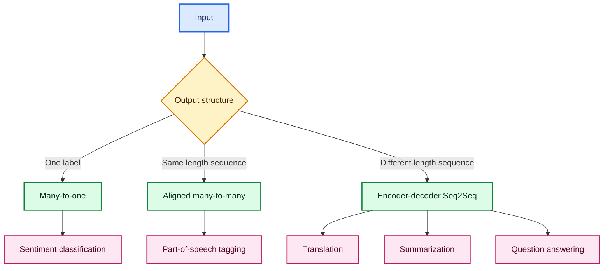

> **Fun fact:** The influential 2014 Seq2Seq work used one deep LSTM to encode a source sentence and another to decode it. Reversing the source word order improved optimization by shortening important dependency paths.

---

## 2. The encoder-decoder idea

An encoder-decoder model first builds a representation of the source and then uses that representation to generate the target.

$$
\text{source}\rightarrow\text{encoder}\rightarrow\text{representation}
\rightarrow\text{decoder}\rightarrow\text{target}.
$$

### One-line definition

> An encoder-decoder model understands an input sequence and generates a new output sequence conditioned on that representation.

### Why separate the two components?

- The **encoder** specializes in source understanding.
- The **decoder** specializes in target generation.
- Source and target vocabularies may be different.
- Their lengths and grammatical structures may differ.

For translation, the encoder may read English while the decoder generates German. The two parts do not need to share tokenizers or embeddings.

---

## 3. Recurrent encoder

Let the embedded source tokens be $x_1,\ldots,x_S$. An RNN encoder updates a hidden state:

$$
h_s=\operatorname{RNN}_{\text{enc}}(x_s,h_{s-1}),
\qquad s=1,\ldots,S.
$$

For a basic encoder-decoder without attention, the final state becomes the context vector:

$$
c=h_S.
$$

If an LSTM is used, both final hidden and cell states may initialize the decoder:

$$
(h_0^{\text{dec}},c_0^{\text{dec}})
=(h_S^{\text{enc}},c_S^{\text{enc}}).
$$

### Encoder characteristics

- It can use `SimpleRNN`, LSTM, or GRU cells.
- It reads the complete source sequence.
- It usually does not generate target words.
- Without attention, it compresses the source into fixed-size final state(s).
- Bidirectional encoders may combine left-to-right and right-to-left context when the full source is available.

---

## 4. Recurrent decoder

The decoder generates target tokens one step at a time. At target timestep $t$, it consumes the previous target token and its previous state:

$$
s_t=\operatorname{RNN}_{\text{dec}}
\left([E_y(y_{t-1});c],s_{t-1}\right),
$$

where $E_y$ is the target embedding and $[\cdot;\cdot]$ denotes concatenation.

Vocabulary logits and probabilities are:

$$
z_t=W_os_t+b_o,
$$

$$
P(y_t=k\mid y_{<t},x)=
\frac{e^{z_{t,k}}}{\sum_{j=1}^{V_y}e^{z_{t,j}}}.
$$

Generation starts with a special token such as `[START]` and stops when `[END]` is predicted or a maximum length is reached.

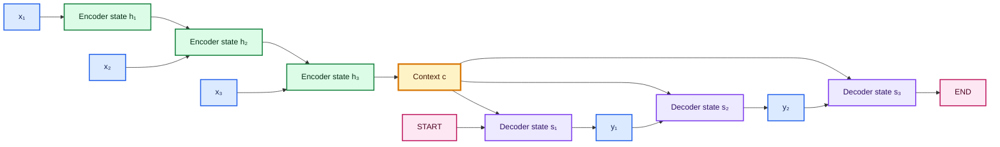

---

## 5. Teacher forcing

### What is teacher forcing?

During training, teacher forcing supplies the **correct previous target token** to the decoder instead of its own previous prediction.

For target sequence

```text
[START] ich lerne deutsch [END]
```

the shifted training pair is:

```text
decoder input: [START] ich    lerne   deutsch
target label:  ich     lerne  deutsch [END]
```

The teacher-forced loss is

$$
\mathcal{L}
=-\sum_{t=1}^{T}
\log P_\theta
\left(y_t^*\mid y_{<t}^*,x_{1:S}\right),
$$

where $y_t^*$ denotes the ground-truth token.

### Why use it?

- Every training timestep receives a correct history.
- Optimization is faster and more stable.
- Errors at one position do not corrupt all later training inputs.
- In a Transformer, all shifted target positions can be trained in parallel under a causal mask.

### Training versus inference

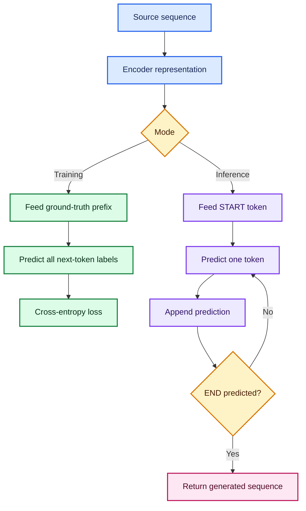

### Exposure bias

The decoder trains on clean ground-truth prefixes but encounters its own possibly incorrect prefixes at inference. This mismatch is called **exposure bias**.

Possible mitigations include:

- scheduled sampling;
- sequence-level objectives;
- stronger regularization and better data;
- beam search or constrained decoding; and
- non-autoregressive or iterative refinement architectures.

Scheduled sampling must be evaluated carefully because changing the training distribution can introduce other inconsistencies.

---

## 6. Problems with a fixed context vector

The simplest recurrent Seq2Seq model asks one fixed-size vector $c$ to represent the complete source, regardless of length.

### 6.1 Information bottleneck

If $c\in\mathbb{R}^H$, then a 5-token sentence and a 500-token document must both pass through the same $H$ values.

### 6.2 No explicit alignment

When generating a target word, the decoder cannot directly choose which source token is most relevant.

### 6.3 Long dependency path

Information from early source tokens must travel through many recurrent transitions before reaching the decoder.

### 6.4 Exposure bias

Teacher forcing creates a training/inference mismatch.

### 6.5 Limited parallelism

The recurrence

$$
h_t=f(x_t,h_{t-1})
$$

requires $h_{t-1}$ before $h_t$, so timesteps cannot all be computed simultaneously.

These limitations motivated attention.

---

## 7. Attention: let the decoder look back

Instead of keeping only $h_S$, an attentive model retains all encoder states:

$$
H=(h_1,h_2,\ldots,h_S).
$$

At decoder step $t$, it computes a new context vector $c_t$ from the entire source.

### 7.1 Alignment score

For Bahdanau-style additive attention:

$$
e_{t,s}
=v_a^\top\tanh
\left(W_hh_s+W_ss_{t-1}+b_a\right).
$$

$e_{t,s}$ measures how relevant source position $s$ is for the next decoder step $t$.

### 7.2 Attention weights

Normalize scores over source positions:

$$
\alpha_{t,s}
=\frac{\exp(e_{t,s})}
{\sum_{j=1}^{S}\exp(e_{t,j})}.
$$

Therefore:

$$
\alpha_{t,s}\ge0,
\qquad
\sum_{s=1}^{S}\alpha_{t,s}=1.
$$

### 7.3 Dynamic context vector

$$
c_t=\sum_{s=1}^{S}\alpha_{t,s}h_s.
$$

The context can now change for every generated word.

### 7.4 Decoder update

$$
s_t=\operatorname{RNN}_{\text{dec}}
\left([E_y(y_{t-1});c_t],s_{t-1}\right).
$$

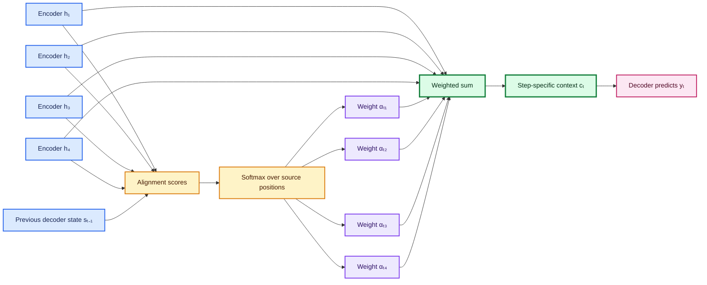

### Why is attention better?

- It provides a shorter path to every source state.
- It creates interpretable soft alignments.
- It reduces pressure on one final context vector.
- It handles long sources better than fixed-context Seq2Seq.

Attention weights can be inspected, but they should not automatically be treated as a complete causal explanation of the model.

> **Fun fact:** Bahdanau attention was described as learning to align and translate jointly. The alignment does not require manually labelled word pairs.

---

## 8. Why move from attention-enhanced RNNs to Transformers?

RNN attention still uses a sequential recurrent backbone. The Transformer removes recurrence and uses attention as the central operation.

| Property | RNN encoder-decoder | RNN plus attention | Transformer |
|---|---|---|---|
| Source summary | Final state | All encoder states | All contextual token states |
| Word alignment | Implicit | Explicit soft alignment | Direct attention relations |
| Training across positions | Sequential | Still largely sequential | Highly parallelizable |
| Long dependency path | Long | Shorter at decoder | Direct pairwise path |
| Main bottleneck | Memory and recurrence | Recurrence | Quadratic full attention for long sequences |

The Transformer was introduced in the 2017 paper *Attention Is All You Need*.

---

## 9. Transformer families

Not every Transformer contains both an encoder and a decoder.

| Family | Attention pattern | Typical use | Familiar example |
|---|---|---|---|
| Encoder-only | Bidirectional self-attention | Classification, retrieval, token labelling | BERT-style models |
| Decoder-only | Causal self-attention | Autoregressive generation | GPT-style models |
| Encoder-decoder | Encoder self-attention, decoder causal attention, cross-attention | Translation, summarization, conditional generation | Original Transformer, T5-style models |

The supplied lecture and PDF focus mainly on the original encoder-decoder architecture.

---

## 10. Transformer input representation

Attention has no recurrence, so token order must be supplied explicitly.

### 10.1 Token embeddings

For vocabulary size $V$ and model dimension $d_{\text{model}}$:

$$
E\in\mathbb{R}^{V\times d_{\text{model}}}.
$$

The token at position $p$ receives embedding $e_p$.

### 10.2 Positional encoding

The original Transformer uses sinusoidal positions:

$$
PE_{(p,2i)}
=\sin\left(\frac{p}{10000^{2i/d_{\text{model}}}}\right),
$$

$$
PE_{(p,2i+1)}
=\cos\left(\frac{p}{10000^{2i/d_{\text{model}}}}\right).
$$

The input is

$$
X_p=\sqrt{d_{\text{model}}}\,e_p+PE_p
$$

in the original paper.

Many modern models use learned position embeddings, rotary position embeddings, or relative position biases. Their purpose is still to make order or relative distance available to the model.

### Critical correction

Positional encoding and residual connections are separate ideas:

- **Positional encoding** adds order information to token representations.
- **Residual connections** create shortcut paths around sublayers, helping information and gradients flow.

Residual connections are not added “because of positional encoding.”

---

## 11. Query, Key, and Value intuition

For each token representation, attention creates three learned projections.

### Query

The Query represents what the current position is looking for.

### Key

The Key describes what information a position can be matched on.

### Value

The Value contains the information that will be blended if the Query and Key are compatible.

A search-engine analogy is helpful:

- Query: the search request;
- Key: an index label used for matching;
- Value: the content returned from relevant entries.

The analogy is intuition only. In the network, all three are learned vectors.

### Projection formulas

For input matrix

$$
X\in\mathbb{R}^{n\times d_{\text{model}}},
$$

calculate

$$
Q=XW^Q,
\qquad
K=XW^K,
\qquad
V=XW^V,
$$

where typically

$$
W^Q,W^K\in\mathbb{R}^{d_{\text{model}}\times d_k},
\qquad
W^V\in\mathbb{R}^{d_{\text{model}}\times d_v}.
$$

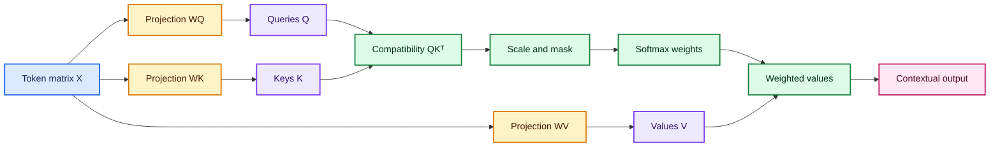

---

## 12. Scaled dot-product attention

The central Transformer formula is

$$
\operatorname{Attention}(Q,K,V)
=\operatorname{softmax}\left(
\frac{QK^\top}{\sqrt{d_k}}+M
\right)V.
$$

### Step 1: raw scores

$$
S=QK^\top.
$$

The entry $S_{ij}=q_i\cdot k_j$ measures compatibility between query position $i$ and key position $j$.

### Step 2: scaling

$$
\widetilde{S}=\frac{S}{\sqrt{d_k}}.
$$

Why divide by $\sqrt{d_k}$? If independent query and key components have variance near 1, their dot product has variance near $d_k$. Large logits can saturate softmax and create tiny gradients. Scaling keeps score magnitudes manageable.

### Step 3: masking

Add mask $M$:

$$
M_{ij}=
\begin{cases}
0, & \text{if attention is allowed},\\
-\infty, & \text{if attention is forbidden}.
\end{cases}
$$

### Step 4: softmax

$$
A_{ij}
=\frac{\exp(\widetilde{S}_{ij}+M_{ij})}
{\sum_{r}\exp(\widetilde{S}_{ir}+M_{ir})}.
$$

Each row of $A$ sums to 1.

### Step 5: weighted Values

$$
O=AV.
$$

Each output row is a weighted mixture of Value vectors.

---

## 13. Worked self-attention example

Consider three simple two-dimensional token vectors:

$$
X=
\begin{bmatrix}
1&0\\
0&1\\
1&1
\end{bmatrix}
$$

for the tokens `please`, `study`, and `carefully`. For illustration, let

$$
W^Q=W^K=W^V=I.
$$

Therefore:

$$
Q=K=V=X.
$$

For the query `study`, $q=[0,1]$. Its unscaled scores are

$$
qK^\top=[0,1,1].
$$

Since $d_k=2$:

$$
\frac{qK^\top}{\sqrt{2}}
\approx[0,0.7071,0.7071].
$$

After softmax:

$$
\alpha\approx[0.1978,0.4011,0.4011].
$$

The contextual output is

$$
o_{\text{study}}
=0.1978[1,0]
+0.4011[0,1]
+0.4011[1,1]
\approx[0.5989,0.8022].
$$

The new representation for `study` is influenced by all three Values. Real models learn the projections instead of using identity matrices.

### NumPy verification

```python
import numpy as np


def softmax(values: np.ndarray) -> np.ndarray:
    """Compute a numerically stable softmax over one vector."""
    shifted = values - np.max(values)
    exponentials = np.exp(shifted)
    return exponentials / exponentials.sum()


# Rows represent: please, study, carefully.
x = np.array(
    [
        [1.0, 0.0],
        [0.0, 1.0],
        [1.0, 1.0],
    ]
)

# Identity projections make Q = K = V = X for this demonstration.
q = x[1]
k = x
v = x

scaled_scores = (q @ k.T) / np.sqrt(k.shape[-1])
weights = softmax(scaled_scores)
context = weights @ v

print(np.round(scaled_scores, 4))  # [0.     0.7071 0.7071]
print(np.round(weights, 4))        # [0.1978 0.4011 0.4011]
print(np.round(context, 4))        # [0.5989 0.8022]
```

---

## 14. Self-attention, cross-attention, and causal attention

The same attention formula performs different jobs depending on where $Q$, $K$, and $V$ originate.

| Attention type | Query | Key | Value | Purpose |
|---|---|---|---|---|
| Encoder self-attention | Encoder states | Encoder states | Encoder states | Contextualize each source token using the full source |
| Decoder masked self-attention | Decoder states | Decoder states | Decoder states | Use only the generated target prefix |
| Encoder-decoder cross-attention | Decoder states | Encoder output | Encoder output | Let each target position retrieve source information |

### Cross-attention correction

In standard encoder-decoder cross-attention:

$$
Q=H_{\text{decoder}}W^Q,
$$

$$
K=H_{\text{encoder}}W^K,
\qquad
V=H_{\text{encoder}}W^V.
$$

Queries come from the decoder; Keys and Values come from the encoder.

---

## 15. Multi-head attention

One attention operation may learn one dominant relationship. Multi-head attention creates $h$ independently projected attention heads:

$$
\operatorname{head}_i
=\operatorname{Attention}
\left(QW_i^Q,KW_i^K,VW_i^V\right).
$$

Concatenate and project them:

$$
\operatorname{MHA}(Q,K,V)
=\operatorname{Concat}
(\operatorname{head}_1,\ldots,\operatorname{head}_h)W^O.
$$

Usually:

$$
d_k=d_v=\frac{d_{\text{model}}}{h}.
$$

For $d_{\text{model}}=512$ and $h=8$:

$$
d_k=d_v=64.
$$

Each head returns 64 features per position, concatenation restores 512 features, and $W^O$ mixes the heads.

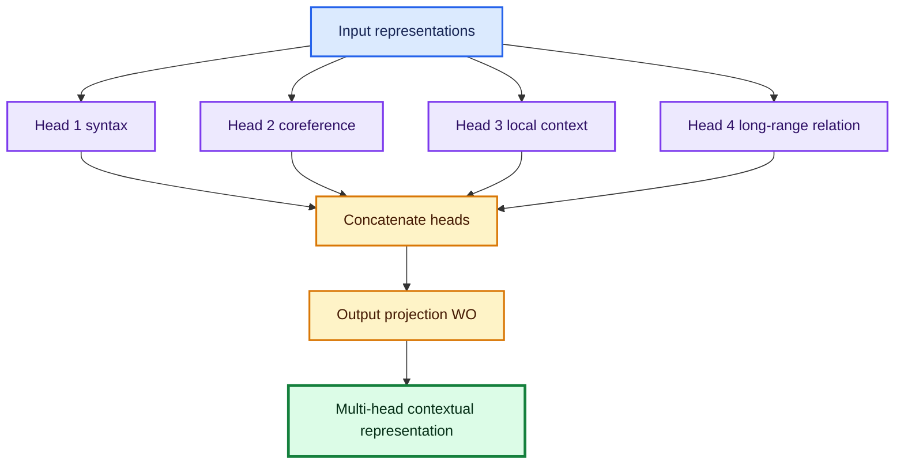

The head labels in the diagram are intuition, not hard-coded roles. Heads learn whatever relationships help minimize the training loss.

### Parameter count intuition

Ignoring biases, four $d_{\text{model}}\times d_{\text{model}}$ projections give

$$
P_{\text{MHA}}\approx4d_{\text{model}}^2.
$$

For $d_{\text{model}}=512$:

$$
P\approx4(512)^2=1{,}048{,}576.
$$

Increasing the number of heads does not necessarily multiply the total projection parameters if the total model dimension stays fixed.

---

## 16. Masks

### 16.1 Padding mask

Padding tokens are not content. A padding mask prevents real queries from attending to padding Keys.

### 16.2 Causal or look-ahead mask

When predicting target position $i$, the decoder must not inspect later targets $j>i$.

For a target of length 4:

$$
M=
\begin{bmatrix}
0&-\infty&-\infty&-\infty\\
0&0&-\infty&-\infty\\
0&0&0&-\infty\\
0&0&0&0
\end{bmatrix}.
$$

After adding $M$ and applying softmax, forbidden probabilities become zero.

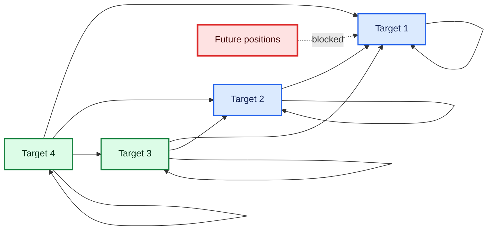

### Why masking is essential during parallel training

The full shifted target is present in one tensor. Without a causal mask, position $t$ could directly read the correct future token $y_{t+1}$, causing label leakage.

---

## 17. Position-wise feed-forward network

After attention, every position independently passes through the same two-layer network:

$$
\operatorname{FFN}(x)
=\sigma(xW_1+b_1)W_2+b_2.
$$

In the original Transformer, $\sigma$ is ReLU:

$$
\operatorname{ReLU}(z)=\max(0,z).
$$

Modern models may use GELU, SwiGLU, or related activations.

For $d_{\text{model}}=512$ and $d_{\text{ff}}=2048$, ignoring biases:

$$
P_{\text{FFN}}
=512\cdot2048+2048\cdot512
=2{,}097{,}152.
$$

### Why use an FFN after attention?

- Attention mixes information **across positions**.
- The FFN transforms features **within each position**.
- Its nonlinear expansion increases representational capacity.

The same FFN weights are applied to all positions in a layer, but different Transformer layers have different parameters.

---

## 18. Residual connections and layer normalization

For sublayer $F$, a common post-norm form is

$$
y=\operatorname{LayerNorm}(x+F(x)).
$$

Many modern Transformers use pre-norm:

$$
y=x+F(\operatorname{LayerNorm}(x)).
$$

### Residual connection

The addition $x+F(x)$:

- preserves the original representation;
- provides a short gradient path;
- makes deep stacks easier to optimize; and
- requires matching dimensions.

### Layer normalization

For one token vector $x\in\mathbb{R}^d$:

$$
\mu=\frac{1}{d}\sum_{i=1}^{d}x_i,
$$

$$
\sigma^2=\frac{1}{d}\sum_{i=1}^{d}(x_i-\mu)^2,
$$

$$
\operatorname{LN}(x)_i
=\gamma_i\frac{x_i-\mu}{\sqrt{\sigma^2+\epsilon}}+\beta_i.
$$

Layer normalization is not the same as softmax:

- softmax turns attention scores into a probability distribution;
- layer normalization stabilizes feature activations.

---

## 19. Transformer encoder block

A standard encoder layer contains:

1. multi-head bidirectional self-attention;
2. residual connection and layer normalization;
3. position-wise feed-forward network; and
4. another residual connection and layer normalization.

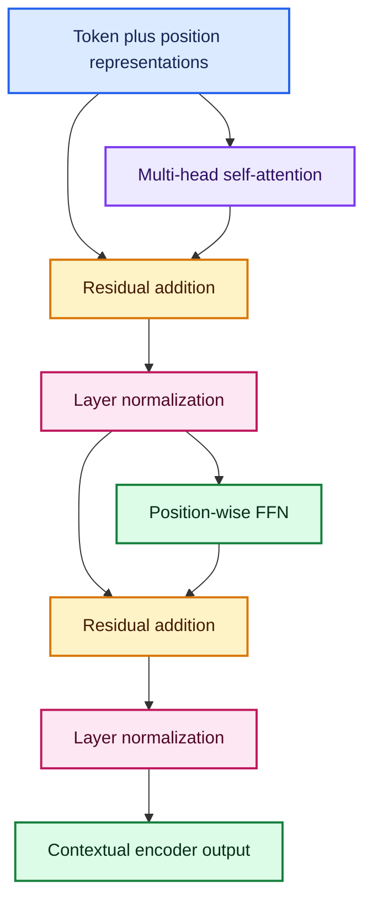

Stacking encoder blocks allows later layers to build increasingly contextual and abstract features, although there is no guaranteed rule that a specific layer always represents syntax or semantics.

---

## 20. Transformer decoder block

A standard decoder layer contains three major sublayers:

1. masked multi-head self-attention over the target prefix;
2. cross-attention to encoder output; and
3. position-wise feed-forward network.

Each sublayer is wrapped with residual addition and normalization.

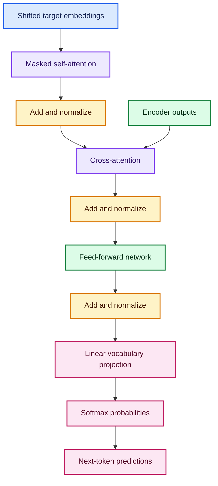

### Vocabulary projection

For decoder output $u_t\in\mathbb{R}^{d_{\text{model}}}$:

$$
z_t=W_{\text{vocab}}u_t+b,
$$

where

$$
W_{\text{vocab}}in
\mathbb{R}^{V_y\times d_{\text{model}}}.
$$

Softmax converts the $V_y$ logits to a next-token distribution.

---

## 21. Parallel training versus autoregressive inference

This distinction is often explained imprecisely.

### Training

Teacher forcing gives all shifted target inputs at once. Causal masking prevents future leakage, so the losses for all positions can be computed in parallel.

### Inference

The model begins with `[START]`, predicts one token, appends it, and repeats. Standard decoding is therefore sequential.

### Important correction

Parallel teacher-forced training does **not** change the model into a non-autoregressive probability model. A standard Transformer decoder still factorizes:

$$
P(y\mid x)
=\prod_{t=1}^{T}P(y_t\mid y_{<t},x).
$$

It has an autoregressive objective, even though all conditional terms can be trained simultaneously using the known target and causal mask.

A genuinely non-autoregressive model uses a different conditional structure and attempts to predict several or all target tokens without depending on previously generated targets.

---

## 22. End-to-end Transformer data flow

```mermaid
flowchart LR
    SRC[Source text] --> STOK[Source tokenizer]
    STOK --> SE[Source embeddings plus positions]
    SE --> ENC[Encoder stack]
    TGT[Target text] --> SHIFT[Shift target right]
    SHIFT --> TTOK[Target tokenizer]
    TTOK --> TE[Target embeddings plus positions]
    TE --> DEC[Masked decoder stack]
    ENC --> CROSS[Cross-attention memory]
    CROSS --> DEC
    DEC --> LOGITS[Vocabulary logits]
    LOGITS --> LOSS[Masked cross-entropy]
    LOGITS --> DECODE[Greedy or beam decoding]

    classDef raw fill:#FFE4E6,stroke:#E11D48,color:#4C0519,stroke-width:2px;
    classDef prep fill:#FEF3C7,stroke:#D97706,color:#451A03,stroke-width:2px;
    classDef encoder fill:#DCFCE7,stroke:#15803D,color:#052E16,stroke-width:2px;
    classDef decoder fill:#EDE9FE,stroke:#7C3AED,color:#2E1065,stroke-width:2px;
    classDef result fill:#DBEAFE,stroke:#2563EB,color:#172554,stroke-width:2px;
    class SRC,TGT raw;
    class STOK,SHIFT,TTOK,SE,TE prep;
    class ENC,CROSS encoder;
    class DEC decoder;
    class LOGITS,LOSS,DECODE result;
```

---

## 23. Recurrent Seq2Seq with Keras additive attention

The following Functional API example shows the architectural idea. A real project also needs tokenization, padding masks, validation data, checkpoints, and inference models.

```python
import keras
from keras import layers

SOURCE_VOCAB_SIZE = 12_000
TARGET_VOCAB_SIZE = 14_000
EMBED_DIM = 128
LATENT_DIM = 256

# Integer source and target token sequences.
encoder_tokens = keras.Input(shape=(None,), dtype="int32", name="encoder_tokens")
decoder_tokens = keras.Input(shape=(None,), dtype="int32", name="decoder_tokens")

# Separate embeddings are useful when source and target languages differ.
source_embedding = layers.Embedding(
    SOURCE_VOCAB_SIZE,
    EMBED_DIM,
    mask_zero=True,
    name="source_embedding",
)(encoder_tokens)
target_embedding = layers.Embedding(
    TARGET_VOCAB_SIZE,
    EMBED_DIM,
    mask_zero=True,
    name="target_embedding",
)(decoder_tokens)

# Keep every encoder state for attention and the final states for initialization.
encoder_sequence, encoder_h, encoder_c = layers.LSTM(
    LATENT_DIM,
    return_sequences=True,
    return_state=True,
    name="encoder_lstm",
)(source_embedding)

# Teacher-forced target prefix is processed by the decoder.
decoder_sequence = layers.LSTM(
    LATENT_DIM,
    return_sequences=True,
    name="decoder_lstm",
)(target_embedding, initial_state=[encoder_h, encoder_c])

# Every decoder position attends to all encoder positions.
context = layers.AdditiveAttention(name="bahdanau_attention")(
    [decoder_sequence, encoder_sequence]
)

# Combine decoder state with source context before vocabulary prediction.
decoder_context = layers.Concatenate(name="decoder_plus_context")(
    [decoder_sequence, context]
)
logits = layers.Dense(TARGET_VOCAB_SIZE, name="target_logits")(decoder_context)

model = keras.Model(
    inputs={
        "encoder_tokens": encoder_tokens,
        "decoder_tokens": decoder_tokens,
    },
    outputs=logits,
    name="recurrent_seq2seq_with_attention",
)

model.compile(
    optimizer="adam",
    # Label 0 is padding and must not contribute to the objective.
    loss=keras.losses.SparseCategoricalCrossentropy(
        from_logits=True,
        ignore_class=0,
    ),
)
```

### What enters `decoder_tokens`?

If the full target is

```text
[START] wie geht es dir [END]
```

then:

```text
decoder_tokens = [START] wie geht es dir
labels         = wie     geht es  dir [END]
```

---

## 24. Transformer blocks in Keras

### 24.1 Positional embedding

```python
import keras
from keras import layers
from keras import ops


class TokenAndPositionEmbedding(layers.Layer):
    """Add learned token and position embeddings."""

    def __init__(self, vocab_size: int, max_length: int, model_dim: int):
        super().__init__()
        self.token_embedding = layers.Embedding(
            vocab_size,
            model_dim,
            mask_zero=True,
        )
        self.position_embedding = layers.Embedding(max_length, model_dim)
        self.supports_masking = True

    def call(self, token_ids):
        length = ops.shape(token_ids)[-1]
        positions = ops.arange(length)
        return self.token_embedding(token_ids) + self.position_embedding(positions)

    def compute_mask(self, token_ids, mask=None):
        # ID 0 is reserved for padding.
        return ops.not_equal(token_ids, 0)
```

### 24.2 Encoder block

```python
class TransformerEncoder(layers.Layer):
    """Post-normalized Transformer encoder block."""

    def __init__(
        self,
        model_dim: int,
        num_heads: int,
        feedforward_dim: int,
        dropout: float = 0.1,
    ):
        super().__init__()
        self.self_attention = layers.MultiHeadAttention(
            num_heads=num_heads,
            key_dim=model_dim // num_heads,
            dropout=dropout,
        )
        self.feedforward = keras.Sequential(
            [
                layers.Dense(feedforward_dim, activation="relu"),
                layers.Dense(model_dim),
            ]
        )
        self.dropout_1 = layers.Dropout(dropout)
        self.dropout_2 = layers.Dropout(dropout)
        self.norm_1 = layers.LayerNormalization(epsilon=1e-6)
        self.norm_2 = layers.LayerNormalization(epsilon=1e-6)

    def call(self, x, attention_mask=None, training=False):
        attended = self.self_attention(
            query=x,
            key=x,
            value=x,
            attention_mask=attention_mask,
            training=training,
        )
        x = self.norm_1(x + self.dropout_1(attended, training=training))

        transformed = self.feedforward(x, training=training)
        return self.norm_2(x + self.dropout_2(transformed, training=training))
```

### 24.3 Decoder block

```python
class TransformerDecoder(layers.Layer):
    """Decoder block with causal self-attention and cross-attention."""

    def __init__(
        self,
        model_dim: int,
        num_heads: int,
        feedforward_dim: int,
        dropout: float = 0.1,
    ):
        super().__init__()
        head_dim = model_dim // num_heads
        self.masked_self_attention = layers.MultiHeadAttention(
            num_heads=num_heads,
            key_dim=head_dim,
            dropout=dropout,
        )
        self.cross_attention = layers.MultiHeadAttention(
            num_heads=num_heads,
            key_dim=head_dim,
            dropout=dropout,
        )
        self.feedforward = keras.Sequential(
            [
                layers.Dense(feedforward_dim, activation="relu"),
                layers.Dense(model_dim),
            ]
        )
        self.dropout_1 = layers.Dropout(dropout)
        self.dropout_2 = layers.Dropout(dropout)
        self.dropout_3 = layers.Dropout(dropout)
        self.norm_1 = layers.LayerNormalization(epsilon=1e-6)
        self.norm_2 = layers.LayerNormalization(epsilon=1e-6)
        self.norm_3 = layers.LayerNormalization(epsilon=1e-6)

    def call(
        self,
        target,
        encoder_output,
        target_padding_mask=None,
        source_padding_mask=None,
        training=False,
    ):
        # Causal masking prevents a target position from seeing future targets.
        self_attended = self.masked_self_attention(
            query=target,
            key=target,
            value=target,
            attention_mask=target_padding_mask,
            use_causal_mask=True,
            training=training,
        )
        x = self.norm_1(
            target + self.dropout_1(self_attended, training=training)
        )

        # Queries come from the decoder; Keys and Values come from the encoder.
        cross_attended = self.cross_attention(
            query=x,
            key=encoder_output,
            value=encoder_output,
            attention_mask=source_padding_mask,
            training=training,
        )
        x = self.norm_2(x + self.dropout_2(cross_attended, training=training))

        transformed = self.feedforward(x, training=training)
        return self.norm_3(x + self.dropout_3(transformed, training=training))
```

Mask shapes must be checked carefully. Keras attention masks are broadcastable boolean tensors shaped like $(B,T,S)$, where $T$ is query length and $S$ is key/value length.

---

## 25. Preparing shifted training data

```python
import tensorflow as tf


def format_translation_batch(source_text, target_text, source_vectorizer, target_vectorizer):
    """Create encoder input, shifted decoder input, and next-token labels."""
    source_ids = source_vectorizer(source_text)
    full_target_ids = target_vectorizer(target_text)

    model_inputs = {
        "encoder_tokens": source_ids,
        # Everything except the final target token.
        "decoder_tokens": full_target_ids[:, :-1],
    }
    # Everything except the first [START] token.
    labels = full_target_ids[:, 1:]
    return model_inputs, labels
```

### Masked sparse cross-entropy

Padding should not contribute to the loss:

```python
import keras
from keras import ops

token_loss = keras.losses.SparseCategoricalCrossentropy(
    from_logits=True,
    reduction="none",
)


def masked_sequence_loss(labels, logits):
    """Average token loss over non-padding labels only."""
    per_token_loss = token_loss(labels, logits)
    valid = ops.cast(ops.not_equal(labels, 0), per_token_loss.dtype)
    return ops.sum(per_token_loss * valid) / ops.maximum(ops.sum(valid), 1.0)
```

### Data leakage warning

Split sentence pairs into training, validation, and test sets **before** adapting tokenizers or vocabulary layers. Duplicate or near-duplicate translations should not cross splits.

---

## 26. Autoregressive decoding

### Greedy decoding

At each step:

$$
\hat{y}_t=\arg\max_k P(y_t=k\mid\hat{y}_{<t},x).
$$

Greedy decoding is fast but may miss a better complete sequence.

### Beam search

Beam search keeps the $B$ most promising partial sequences. A length-normalized score can be written as

$$
\operatorname{score}(y)
=\frac{1}{T^\alpha}
\sum_{t=1}^{T}
\log P(y_t\mid y_{<t},x).
$$

Without normalization, short sequences may be preferred because every additional log probability is non-positive.

### Sampling

Temperature modifies logits:

$$
P_\tau(y_t=k)
=\frac{\exp(z_{t,k}/\tau)}
{\sum_j\exp(z_{t,j}/\tau)}.
$$

Sampling is useful for creative generation but usually less appropriate for deterministic translation.

### Greedy decoding skeleton

```python
import tensorflow as tf


def greedy_decode(
    model,
    source_ids,
    start_id: int,
    end_id: int,
    max_length: int,
):
    """Generate one target sequence from a trained encoder-decoder model."""
    generated = [start_id]

    for _ in range(max_length):
        decoder_ids = tf.constant([generated], dtype=tf.int32)
        logits = model(
            {
                "encoder_tokens": source_ids,
                "decoder_tokens": decoder_ids,
            },
            training=False,
        )

        # Only the final decoder position predicts the next token.
        next_id = int(tf.argmax(logits[0, -1], axis=-1))
        generated.append(next_id)

        if next_id == end_id:
            break

    return generated
```

For efficient production inference, cache encoder output and the decoder's past Key/Value states instead of recomputing the full prefix at every step.

---

## 27. Evaluation

### 27.1 Token cross-entropy

For $N$ non-padding target tokens:

$$
H=-\frac{1}{N}\sum_{i=1}^{N}
\log P(y_i^*\mid y_{<i}^*,x).
$$

### 27.2 Perplexity

$$
\operatorname{PPL}=e^H.
$$

Perplexity evaluates next-token uncertainty under teacher forcing. It does not directly measure translation adequacy.

### 27.3 BLEU

BLEU combines modified $n$-gram precisions with a brevity penalty:

$$
\operatorname{BLEU}
=BP\cdot
\exp\left(\sum_{n=1}^{N}w_n\log p_n\right),
$$

where

$$
BP=
\begin{cases}
1, & c>r,\\
\exp(1-r/c), & c\le r.
\end{cases}
$$

Here $c$ is candidate length and $r$ is effective reference length.

BLEU is useful for corpus-level comparison but may underrate valid paraphrases. Combine automatic metrics with human evaluation of adequacy, fluency, factuality, and safety.

### 27.4 Error analysis

Inspect:

- short versus long sources;
- named entities and numbers;
- rare or unknown subwords;
- repeated or missing phrases;
- premature `[END]`;
- hallucinated details;
- gender, formality, and domain terminology; and
- attention and mask correctness.

---

## 28. Computational complexity and when to use each architecture

Let sequence length be $n$ and representation width be $d$.

| Layer | Per-layer complexity | Sequential operations | Maximum path length |
|---|---:|---:|---:|
| Recurrent | $O(nd^2)$ | $O(n)$ | $O(n)$ |
| Full self-attention | $O(n^2d)$ | $O(1)$ during training | $O(1)$ |

### Prefer recurrent Seq2Seq when

- sequences are moderate;
- streaming state is important;
- the device is very constrained;
- the dataset is small; or
- you need a transparent baseline.

### Prefer a Transformer when

- long-range relationships matter;
- parallel training is valuable;
- pretrained Transformer components are available;
- quality on complex text is the priority; or
- multimodal attention is needed.

### Full attention limitation

The $n\times n$ attention matrix can be expensive for very long sequences. Modern systems may use local windows, sparse attention, recurrence, state-space models, compression, or efficient attention kernels.

---

## 29. Corrections and clarifications from the supplied sources

| Lecture or PDF simplification | Precise correction |
|---|---|
| Residual addition is because of positional encoding | Residual connections and positional encodings solve different problems. |
| Transformer training is non-autoregressive | Standard teacher-forced training is parallel, but the decoder objective remains autoregressive. |
| Cross-attention can take Q, K, and V from the output context | Queries come from decoder states; Keys and Values come from encoder output. |
| Softmax and normalization are one process | Softmax normalizes attention scores into probabilities; LayerNorm normalizes feature activations. |
| A Transformer is always an encoder-decoder | Encoder-only and decoder-only Transformers are also common. |
| Attention removes all long-sequence problems | It shortens dependency paths but full attention has quadratic memory and compute in sequence length. |
| Attention weights prove why a model decided | They show routing weights, not necessarily a complete causal explanation. |
| RNNs always fail on long sentences | They often struggle, but results depend on gates, data, optimization, sequence length, and task. |
| More heads always means more model capacity | If total $d_{\text{model}}$ stays fixed, each head becomes narrower; performance must be validated. |
| Parallel training means parallel generation | Standard autoregressive generation still emits tokens sequentially unless a different decoding architecture is used. |

---

## 30. Practical project checklist

- [ ] Define source and target languages or modalities.
- [ ] Normalize text without destroying meaningful punctuation.
- [ ] Add `[START]`, `[END]`, `[PAD]`, and `[UNK]` consistently.
- [ ] Split paired examples before vocabulary adaptation.
- [ ] Fit source and target tokenizers on training data only.
- [ ] Shift decoder inputs and targets by one position.
- [ ] Apply source and target padding masks.
- [ ] Apply a causal mask to decoder self-attention.
- [ ] Verify cross-attention uses decoder Queries and encoder Keys/Values.
- [ ] Exclude padding from loss and accuracy.
- [ ] Monitor validation loss and sequence-level metrics.
- [ ] Save model, tokenizers, special-token IDs, and maximum lengths together.
- [ ] Test inference in a clean environment.
- [ ] Perform qualitative error and safety analysis.
- [ ] Compare greedy decoding with beam search under the same test data.

---

## 31. Practice questions

### Questions

1. What does sequence-to-sequence learning map?
2. Why may source and target lengths differ?
3. What does a recurrent encoder's final state represent in the simplest model?
4. What token normally begins decoder generation?
5. Define teacher forcing.
6. What is exposure bias?
7. Why is a single context vector a bottleneck?
8. Write the additive attention context equation.
9. Why do attention weights sum to 1?
10. What are Query, Key, and Value intuitively?
11. Write the scaled dot-product attention formula.
12. Why divide raw dot products by $\sqrt{d_k}$?
13. What is self-attention?
14. Where do Q, K, and V come from in cross-attention?
15. What does a causal mask prevent?
16. What does a padding mask prevent?
17. If $d_{\text{model}}=768$ and there are 12 equal heads, what is $d_k$?
18. Why use multiple attention heads?
19. What does the position-wise FFN do?
20. What is the difference between residual addition and positional encoding?
21. Is standard parallel Transformer training non-autoregressive? Explain.
22. Why is standard inference slower than one parallel training pass?
23. What is the shifted target input for `[START] ich lerne [END]`?
24. Why should padding be excluded from cross-entropy?
25. When might an RNN encoder-decoder still be preferable?

### Answers

1. It maps an ordered source sequence to an ordered target sequence, possibly of a different length.
2. Translation, summarization, and generation do not require one output token for every input token.
3. It is a fixed-dimensional learned summary used to condition the decoder.
4. A special `[START]` or beginning-of-sequence token.
5. Supplying the correct previous target token to the decoder during training.
6. The mismatch between clean ground-truth histories in training and self-generated histories during inference.
7. Every source, regardless of length, must be compressed into the same fixed number of values.
8. $c_t=\sum_{s=1}^{S}\alpha_{t,s}h_s$.
9. A softmax is applied over source positions.
10. Query asks what is needed, Key advertises matchable information, and Value carries the information to be blended.
11. $\operatorname{softmax}((QK^\top/\sqrt{d_k})+M)V$.
12. It controls score variance and reduces softmax saturation as the head dimension grows.
13. Attention where Query, Key, and Value are projections of the same sequence.
14. Query comes from decoder states; Key and Value come from encoder output.
15. It prevents a target position from reading future target tokens.
16. It prevents padded positions from contributing as real content.
17. $768/12=64$.
18. Different projected subspaces can model different relations simultaneously.
19. It independently applies the same nonlinear feature transformation to every position.
20. Positional encoding supplies order; residual addition creates a shortcut around a sublayer.
21. No. Its autoregressive conditional factors are evaluated in parallel under teacher forcing and causal masking.
22. Each new target token depends on previously generated tokens, so generation normally proceeds step by step.
23. Decoder input: `[START] ich lerne`; labels: `ich lerne [END]`.
24. Padding is not a real prediction target and would distort both optimization and reported metrics.
25. For small data, streaming signals, moderate sequences, strict device limits, or a lightweight baseline.

---

## 32. Interview quick sheet

### Seq2Seq in one sentence

A Seq2Seq model encodes a variable-length source and conditionally generates a variable-length target.

### Attention in one sentence

Attention computes a query-dependent weighted mixture of available Value vectors using Query-Key compatibility.

### Transformer in one sentence

A Transformer models sequence relationships using stacked attention and feed-forward blocks with positional information, residual paths, normalization, and masking.

### Five formulas to remember

$$
c_t=\sum_s\alpha_{t,s}h_s
$$

$$
\alpha_{t,s}=\operatorname{softmax}_s(e_{t,s})
$$

$$
\operatorname{Attention}(Q,K,V)
=\operatorname{softmax}\left(
\frac{QK^\top}{\sqrt{d_k}}+M
\right)V
$$

$$
\operatorname{MHA}(Q,K,V)
=\operatorname{Concat}(\operatorname{head}_1,\ldots,\operatorname{head}_h)W^O
$$

$$
P(y\mid x)=\prod_tP(y_t\mid y_{<t},x)
$$

---

## 33. Fun facts

- The original Transformer had no recurrence or convolution in its central sequence-processing blocks.
- Self-attention makes the path between any two tokens only one attention operation long.
- A Transformer can process all training target positions together while still obeying an autoregressive causal factorization.
- In cross-attention, the target “asks questions” through Queries while the source supplies Keys and Values.
- Multi-head attention does not literally assign linguistic roles to heads; any role emerges from training.
- The FFN can contain more parameters than the attention sublayer.
- `[START]` and `[END]` convert unknown output length into a learnable token-generation process.
- Positional signals are essential because pure self-attention without them is permutation-equivariant.
- Decoder Key/Value caching makes autoregressive inference much faster by avoiding repeated projection of the entire prefix.

---

## 34. Official references

- [Sequence to Sequence Learning with Neural Networks](https://arxiv.org/abs/1409.3215)
- [Neural Machine Translation by Jointly Learning to Align and Translate](https://arxiv.org/abs/1409.0473)
- [Attention Is All You Need](https://arxiv.org/abs/1706.03762)
- [Keras English-to-Spanish Seq2Seq Transformer example](https://keras.io/examples/nlp/neural_machine_translation_with_transformer/)
- [KerasHub English-to-Spanish translation example](https://keras.io/examples/nlp/neural_machine_translation_with_keras_hub/)
- [Keras `MultiHeadAttention`](https://keras.io/api/layers/attention_layers/multi_head_attention/)
- [Keras `AdditiveAttention`](https://keras.io/api/layers/attention_layers/additive_attention/)
- [Keras `LayerNormalization`](https://keras.io/api/layers/normalization_layers/layer_normalization/)
- [Keras `Embedding`](https://keras.io/api/layers/core_layers/embedding/)

---

## Final takeaway

The evolution is easiest to remember as a series of bottlenecks and solutions:

1. A classifier cannot naturally generate a variable-length sequence.
2. An encoder-decoder creates a conditional generation process.
3. One fixed context vector becomes an information bottleneck.
4. Attention gives each output step direct access to all encoder states.
5. Recurrence still limits parallel training.
6. The Transformer replaces recurrence with multi-head attention.
7. Positional information restores order, masks prevent leakage, cross-attention connects target to source, FFNs transform features, and residual normalization stabilizes deep stacks.

The core intuition is simple: **encode what is available, attend to what is relevant, and generate only what is allowed at the current step.**
