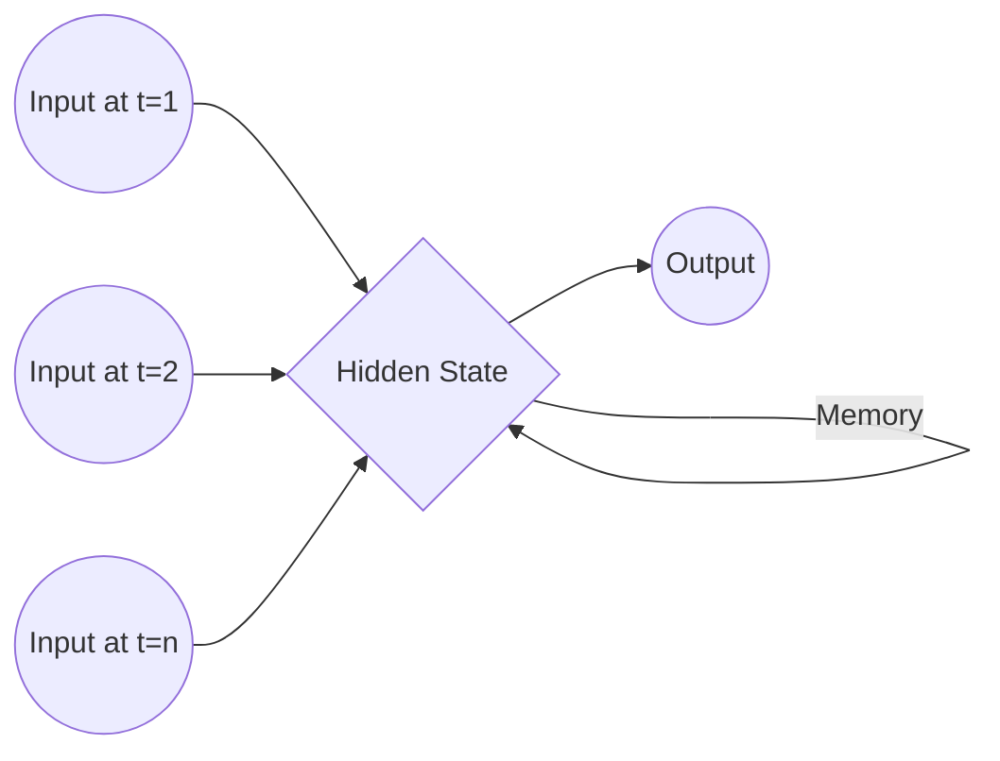

# 🧠 Recurrent Neural Networks (RNN) Explained!

Recurrent Neural Networks (RNNs) are a class of neural networks powerful for modeling sequence data such as time series or natural language. Unlike standard feedforward neural networks, RNNs process data sequentially and retain a "memory" of past inputs, making them ideal for tasks where context matters.

---

## What is an RNN?

An RNN is a deep learning architecture designed to work with **sequential data**.

* **Sequential Data:** Data where the order of elements is crucial (e.g., text, speech, stock prices, weather data). For example, the sentence "hello subscribe to SAS" is sequential; the meaning changes if the words are rearranged.

* **Non-Sequential Data:** Data where order doesn't dictate meaning in the same way (e.g., age, salary, location).

RNNs are the go-to model when dealing with textual data or any data where temporal dynamics are important.

### Why use RNNs instead of standard ANNs?

Standard Artificial Neural Networks (ANNs) struggle with sequential data for several reasons:

1. **Varying Input Sizes:** ANNs require a fixed input size. Text inputs, however, vary greatly in length (e.g., "you are good" vs. "you are not good").

2. **Lack of Semantic Meaning:** ANNs don't inherently understand the relationships between words in a sequence.

3. **Loss of Sequence Information:** ANNs process all inputs simultaneously, failing to retain the order or sequence of the data, which is vital for understanding context.

4. **High Computational Power:** For tasks like text processing, a standard ANN would require a massive number of inputs (e.g., one for every word in a large vocabulary), leading to an explosion of weights and high computational cost.

### Data Representation for RNNs

Before feeding text into an RNN, it must be converted into a numerical format.

* **Vocabulary:** A unique set of all words in the dataset.

* **One-Hot Encoding (OHE):** A common method where each word is represented by a vector of zeros, with a single '1' at the index corresponding to that word in the vocabulary. For example, if the vocabulary is `[you, are, good, bad, not]`, the word "good" might be represented as `[0, 0, 1, 0, 0]`.

* **Timestamp:** The position of a word in a sequence (e.g., $T_1$, $T_2$, $T_3$).

---

## 🏗️ RNN Architecture

An RNN processes input sequences one element (timestamp) at a time. Let's examine a simplified architecture:

### The "Hidden" State (Short-Term Memory)

The defining feature of an RNN is its hidden state, which acts as a short-term memory. The network takes the current input and the hidden state from the *previous* time step to calculate the *current* hidden state.

The standard RNN uses a `tanh` activation function in its hidden layer.

#### The Mathematical Engine

Let's break down the calculations for a simple sequence:

1. **At $T_1$:** The input $X_1$ is multiplied by input weights ($W_i$). Since there is no previous hidden state, the initial hidden state $O_0$ (usually initialized to zero) is multiplied by the hidden weights ($W_h$). A bias term ($b$) is added, and the result is passed through an activation function ($f$).

* $$O_1 = f(X_{t1} \times W_i + O_0 \times W_h) + b$$

2. **At $T_2$:** The same process repeats, but this time, the hidden state from $T_1$ ($O_1$) is used.

* $$O_2 = f(X_{t2} \times W_i + O_1 \times W_h) + b$$

3. **At $T_3$ (Final Output):** The final hidden state $O_3$ is calculated. This state encapsulates information from the entire sequence. To get the final prediction ($\hat{y}$), $O_3$ is multiplied by output weights ($W_o$), and a final activation function (like sigmoid or softmax) is applied.

* $$O_3 = f(X_{t3} \times W_i + O_2 \times W_h) + b$$

* $$\hat{y} = \sigma(O_3 \times W_o)$$

### Training the RNN: Backpropagation Through Time (BPTT)

The goal of training is to minimize a loss function (e.g., categorical cross-entropy for classification tasks) by adjusting the weights ($W_i$, $W_h$, $W_o$).

$$Loss = -y_i \log(\hat{y}_i) - (1-y_i) \log(1-\hat{y}_i)$$

RNNs use an algorithm called **Backpropagation Through Time (BPTT)**. It calculates gradients by unrolling the RNN across all time steps and applying the chain rule of calculus.

The weights are updated using gradient descent:

* $$W_{new} = W_{old} - \eta \left( \frac{\partial Loss}{\partial W_{old}} \right)$$

To find the gradient with respect to the initial weights, the chain rule is applied backwards through the sequence:

* $$\frac{\partial Loss}{\partial W_{old}} = \frac{\partial Loss}{\partial O_3} \times \frac{\partial O_3}{\partial O_2} \times \frac{\partial O_2}{\partial O_1} \times \frac{\partial O_1}{\partial W_{old}}$$

---

## ⚠️ Problems with Simple RNNs

While powerful, simple RNNs suffer from significant limitations, primarily when dealing with long sequences:

1. **Weak Long-Term Memory:** Simple RNNs struggle to retain information from early in a sequence as the sequence gets longer.

2. **Vanishing Gradients:** During BPTT, gradients can become vanishingly small, preventing the network from learning long-range dependencies.

3. **Exploding Gradients:** Conversely, gradients can also explode, leading to unstable training.

4. **Slow Sequential Processing:** The sequential nature of RNNs makes them difficult to parallelize, resulting in slower training times compared to architectures like CNNs or Transformers.

Because of these issues, simple RNNs are rarely used in practice today. Instead, we use advanced architectures like LSTM and GRU.

---

## 🧠 Advanced Architectures: LSTM and GRU

To solve the vanishing/exploding gradient problems and capture long-term dependencies, researchers introduced Long Short-Term Memory (LSTM) networks and Gated Recurrent Units (GRUs).

These architectures introduce **"gates"**—mechanisms that carefully regulate the flow of information, deciding what to keep and what to discard.

### LSTM (Long Short-Term Memory)

LSTMs maintain two distinct states: a hidden state ($h_t$) for short-term memory and a **cell state ($C_t$)** that acts as a conveyor belt for long-term memory.

LSTMs use three gates:

1. **Forget Gate ($f_t$):** Decides what information from the previous cell state should be discarded. It uses a sigmoid activation function to output a value between 0 and 1.

* $$f_t = \sigma(W_f \cdot [h_{t-1}, x_t] + b_f)$$

2. **Input Gate ($i_t$):** Decides what new information should be added to the cell state. It uses a sigmoid function to determine *how much* to update, and a tanh function creates a vector of new candidate values ($\tilde{C}_t$).

* $$i_t = \sigma(W_i \cdot [h_{t-1}, x_t] + b_i)$$

* $$\tilde{C}_t = \tanh(W_c \cdot [h_{t-1}, x_t] + b_c)$$

* The new cell state is then calculated: $C_t = f_t * C_{t-1} + i_t * \tilde{C}_t$

3. **Output Gate ($o_t$):** Determines what the next hidden state should be, based on the updated cell state.

* $$o_t = \sigma(W_o \cdot [h_{t-1}, x_t] + b_o)$$

* $$h_t = o_t * \tanh(C_t)$$

### GRU (Gated Recurrent Unit)

GRUs are a simplified variation of LSTMs. They combine the forget and input gates into a single **update gate** and merge the cell state and hidden state.

GRUs have two gates:

1. **Update Gate ($z_t$):** Decides how much of the past information needs to be kept (or updated). A high value means keep more of the past.

* $$z_t = \sigma(W_z \cdot [h_{t-1}, x_t])$$

2. **Reset Gate ($r_t$):** Determines how much of the past information should influence the new candidate information.

* $$r_t = \sigma(W_r \cdot [h_{t-1}, x_t])$$

The candidate hidden state and final hidden state are calculated as:

* $$\tilde{h}_t = \tanh(W \cdot [r_t * h_{t-1}, x_t])$$

* $$h_t = (1 - z_t) * h_{t-1} + z_t * \tilde{h}_t$$

**Key Differences:**

* GRUs are less complex than LSTMs, having fewer parameters to train.

* GRUs only have 2 gates, while LSTMs have 3.

* GRUs can be faster to train due to lower time complexity.