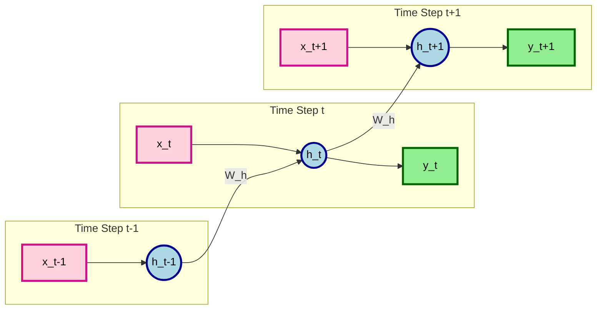
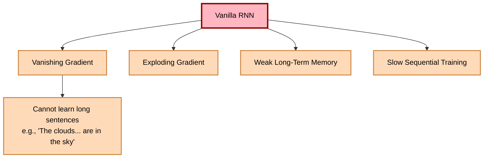
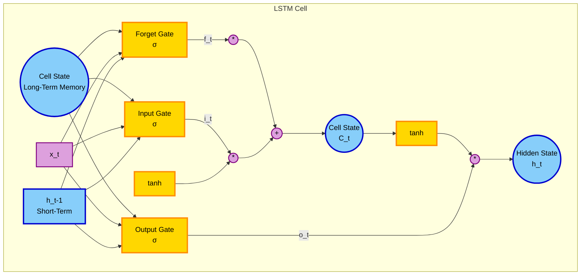
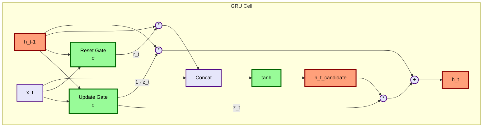

# 🧠 Mastering Sequential Data: RNNs, LSTMs, and GRUs

Welcome to the comprehensive guide on **Recurrent Neural Networks (RNN)** and its advanced variants, **LSTM** and **GRU**! Based on deep-dive lecture notes, this README breaks down the *What, Why, How, and When* of sequence modeling, complete with mathematical formulas, colorful diagrams, and fully commented code.

---

## 📖 1. What is Sequential Data & Why RNNs?

### 📊 The Nature of Sequential Data
Unlike images (where pixels are spatial), sequential data depends on **time or order**. 
* **Examples**: Text sentences, Time-series (Stock prices), Audio, or even tabular sequences like `[Age -> Location -> Salary]`.
* **The Problem with Text**: Input sizes vary! *"Hello"* (1 word) vs *"This is a long sentence"* (5 words). 

### 🆚 Why not ANN or CNN?
| Model | Limitation on Sequential Data |
| :--- | :--- |
| **ANN (Dense)** | ❌ **No Semantic Meaning**: Treats words independently. Fails to retain sequence order. |
| **CNN** | ❌ **Fixed Input Size**: Struggles with varying text lengths. Cannot capture long-term context easily. |
| **RNN** | ✅ **Memory**: Has a "feedback loop" allowing it to remember past inputs to influence current predictions. |

### 🎬 Intuition: The "Riya" Example
Imagine reading these sentences one by one:
1. *Riya lives in Delhi.*
2. *She works at a hospital.*
3. *Last year, Riya moved to London.*
4. *Now she works at a research lab.*

If an ANN processes sentence 4, it forgets sentence 1. An **RNN** carries the "memory" of Riya moving to London to correctly predict her current workplace!

---

## 🔄 2. The Vanilla RNN: Architecture & Math

### 🏗️ How it Works
An RNN takes the current input ($x_t$) **AND** the previous hidden state ($h_{t-1}$) to compute the new hidden state ($h_t$). 



### 🧮 The Mathematics
The core formula for a Vanilla RNN hidden state is:
$$ h_t = \tanh(W_{xh} \cdot x_t + W_{hh} \cdot h_{t-1} + b_h) $$
$$ y_t = \text{Softmax}(W_{hy} \cdot h_t + b_y) $$

* **$W_{xh}$**: Weights for the current input.
* **$W_{hh}$**: Recurrent weights (the "memory" from the past).
* **$\tanh$**: Default activation function (squashes values between -1 and 1).

### 📏 The 3D Tensor Shape
In Keras/TensorFlow, RNNs expect a 3D input shape:
👉 **`(batch_size, timestamps, input_features)`**
*Example*: 3 sentences, 5 words each, vocabulary size 100 $\rightarrow$ `(3, 5, 100)`

---

## ⚠️ 3. The Flaws of Vanilla RNN

Despite the feedback loop, Vanilla RNNs have a fatal flaw: **They forget too fast.**



**Backpropagation Through Time (BPTT)**: When we calculate gradients over many timestamps, multiplying fractions ($<1$) causes gradients to shrink to zero (**Vanishing**). Multiplying large numbers ($>1$) causes them to blow up (**Exploding**).

---

## 🦸‍♂️ 4. LSTM: Long Short-Term Memory

To solve the memory issue, LSTM introduces a **Cell State** (Long-term memory) and **Gates** (filters that decide what to keep/forget).

### 🚪 The 3 Gates of LSTM
1. **Forget Gate ($f_t$)**: What information should we throw away from the cell state?
2. **Input Gate ($i_t$)**: What new information should we store?
3. **Output Gate ($o_t$)**: What part of the cell state should be the current hidden state?



### 🧮 LSTM Formulas
* **Forget**: $f_t = \sigma(W_f \cdot [h_{t-1}, x_t] + b_f)$
* **Input**: $i_t = \sigma(W_i \cdot [h_{t-1}, x_t] + b_i)$
* **Candidate**: $\tilde{C}_t = \tanh(W_C \cdot [h_{t-1}, x_t] + b_C)$
* **Update Cell**: $C_t = f_t * C_{t-1} + i_t * \tilde{C}_t$
* **Output**: $o_t = \sigma(W_o \cdot [h_{t-1}, x_t] + b_o)$
* **Hidden State**: $h_t = o_t * \tanh(C_t)$

*(Note: $\sigma$ is Sigmoid $[0,1]$, $\tanh$ is $[-1,1]$, $*$ is element-wise multiplication)*

---

## 🏃‍♂️ 5. GRU: Gated Recurrent Unit

LSTMs are powerful but **computationally heavy** (too many parameters). **GRU** simplifies this by merging the Cell State and Hidden State, and reducing the gates from 3 to 2!

### 🚪 The 2 Gates of GRU
1. **Update Gate ($z_t$)**: Decides how much of the past memory to keep vs. how much to update with new info.
2. **Reset Gate ($r_t$)**: Decides how much of the past to *forget* when computing the new candidate memory.



### 🧮 GRU Formulas
* **Update**: $z_t = \sigma(W_z \cdot [h_{t-1}, x_t] + b_z)$
* **Reset**: $r_t = \sigma(W_r \cdot [h_{t-1}, x_t] + b_r)$
* **Candidate**: $\tilde{h}_t = \tanh(W_h \cdot [r_t * h_{t-1}, x_t] + b_h)$
* **Final Hidden**: $h_t = (1 - z_t) * h_{t-1} + z_t * \tilde{h}_t$

---

## 💻 6. Code Implementation (Keras / TensorFlow)

Here is how you implement these architectures in Python using Keras. Notice the **3D input shape** requirement!

```python
import tensorflow as tf
from tensorflow.keras.models import Sequential
from tensorflow.keras.layers import SimpleRNN, LSTM, GRU, Dense, Embedding

# Let's assume we are building a Sentiment Analysis model
# Vocabulary size = 10000, Max sentence length (timestamps) = 100
vocab_size = 10000
max_length = 100 

model = Sequential([
    # 1. Embedding Layer: Converts word indices to dense vectors
    # Input shape: (batch_size, timestamps) -> Output: (batch_size, timestamps, embedding_dim)
    Embedding(input_dim=vocab_size, output_dim=64, input_length=max_length),
    
    # 2. Choose your Sequence Model:
    
    # OPTION A: Vanilla RNN (Prone to vanishing gradients, rarely used for long text)
    # SimpleRNN(units=32, activation='tanh'), 
    
    # OPTION B: LSTM (Best for long-term dependencies, e.g., complex reviews)
    LSTM(units=64, return_sequences=False), # return_sequences=False means we only want the final output
    
    # OPTION C: GRU (Faster training, slightly less parameters than LSTM)
    # GRU(units=64, return_sequences=False),
    
    # 3. Output Layer: Dense layer for binary classification (Positive/Negative)
    Dense(units=1, activation='sigmoid')
])

model.compile(optimizer='adam', loss='binary_crossentropy', metrics=['accuracy'])
model.summary()
```

---

## 🎉 7. Fun Facts & Analogies from the Lecture

* 🌤️ **The "Clouds" Analogy (Context Tracking)**: 
  * *"The clouds are in the sky."* 
  * If the sentence is *"The clouds [many words later] are in the sky"*, a Vanilla RNN will forget "clouds" (plural) and might predict the wrong verb. LSTM/GRU remembers the plural context!
* 🏢 **Riya's Life (Long-Term Memory)**: 
  * If you tell the model *Riya moved to London* at step 10, and ask *Where does she work?* at step 50, only LSTM/GRU will correctly link London to her current job, bypassing the noise in between.
* 🚪 **Gate Values as "Attenuators"**: 
  * Sigmoid outputs $[0, 1]$. If the Forget Gate outputs `0.99`, it means "Keep 99% of this memory!". If it outputs `0.10`, it means "Delete this, it's irrelevant!"
* 🏎️ **GRU vs LSTM**: 
  * GRU is like LSTM's "budget" sibling. It does almost the same job but with fewer parameters, meaning it trains faster and is less prone to overfitting on smaller datasets!

---

## 📝 Summary Cheat Sheet

| Feature | Vanilla RNN | LSTM | GRU |
| :--- | :--- | :--- | :--- |
| **Memory** | Short-term only | Long & Short-term | Long & Short-term |
| **Gates** | None | 3 (Forget, Input, Output) | 2 (Update, Reset) |
| **Parameters** | Low | High | Medium |
| **Training Speed**| Fast | Slow | Medium |
| **Best Used When**| Very short sequences | Complex, long sequences | Long sequences, need faster training |