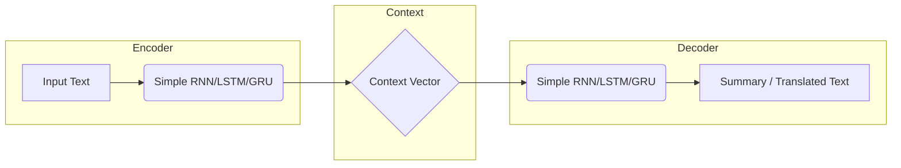
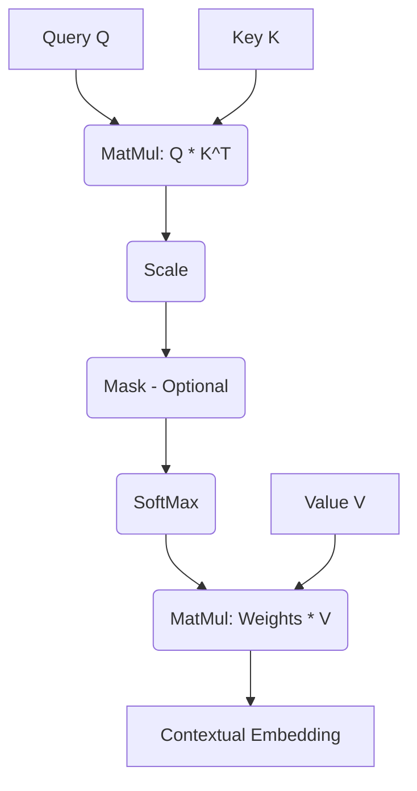

# 🔄 Sequence-to-Sequence (Seq2Seq) Models

The realm of machine learning involves various types of models to handle different data structures. While Artificial Neural Networks (ANNs) process fixed-size data and Convolutional Neural Networks (CNNs) are ideal for images, Recurrent Neural Networks (RNNs) manage sequential text data. Sequence-to-Sequence (Seq2Seq) models, a critical evolution of RNNs, are designed for tasks where an input sequence must be transformed into an output sequence, such as language translation (e.g., English to French) or Question-Answering.

---

## 🛠️ The Encoder-Decoder Architecture

A foundational Seq2Seq model follows an **Encoder-Decoder** architecture.

> **One-line Definition:** An Encoder-Decoder model first understands the input sequence and then generates a new output sequence based on that understanding.
> 
> 

The architecture comprises two main components:

1. **Encoder:** Reads the input sequence step-by-step and compresses the information into a single representation known as the **Context Vector**.

2. **Decoder:** Takes the Context Vector and generates the output sequence, one element at a time.

### Deep Dive: The Context Vector

The Encoder processes the input sequence (e.g., words in a sentence) through its hidden states ($h_1, h_2, h_3...$). The final hidden state, often denoted as $h_n$ or $(h_t, c_t)$ in LSTMs, becomes the Context Vector. This vector acts as an "information bottleneck" as it must encapsulate the entire meaning of the input sequence into a fixed-size array.

### Characteristics of the Decoder

* **Probability-Based:** The Decoder is fundamentally a probability-based model.

* **Softmax Layer:** It always utilizes a Softmax layer at the end to predict the probability distribution over the vocabulary for the next word.

* **Sequential Generation:** It depends on the previously generated word to predict the next word. The generation process starts with a special token, often `<START>`, and concludes when it generates an `<END>` token.

* **Behavioral Difference:** The Decoder behaves differently during the training phase compared to the prediction (inference) phase.

### Training vs. Prediction in the Decoder

* **Training Phase (Teacher Forcing):** During training, the Decoder knows the correct target sequence. Even if it predicts an incorrect word at step $t$, the *actual correct word* is provided as input for step $t+1$. This technique, called Teacher Forcing, helps the model learn faster and more stably.

* **Prediction Phase (Inference):** During prediction, the Decoder does not have access to the true output. It must use its *own prediction* from step $t$ as the input for step $t+1$.

---

## ⚠️ Challenges with Basic Encoder-Decoder Models

While powerful, basic Encoder-Decoder architectures face significant limitations:

1. **Information Bottleneck:** The fixed-size context vector struggles to compress long sentences effectively, leading to a loss of information.

2. **No Word-to-Word Alignment:** The model doesn't explicitly link specific input words to specific output words (e.g., matching the English subject to the French subject).

3. **Exposure Bias:** Due to Teacher Forcing during training, the model expects perfect inputs at each step. During prediction, when it must rely on its own potentially flawed outputs, errors can compound quickly.

4. **Long Sentence Failure:** Performance degrades rapidly on long sequences because the early parts of the sentence are forgotten by the time the final context vector is formed.

---

## 🎯 The Attention Mechanism: A Solution

The Attention Mechanism was introduced to overcome the limitations of the fixed-size context vector.

**Core Concept:** Instead of relying on a single context vector for the entire output sequence, the Attention Mechanism allows the Decoder to look at *all* the hidden states of the Encoder at each step of the decoding process.

This creates a dynamic Context Vector ($C_i$) for each output step $i$, calculated as a weighted sum of all Encoder hidden states ($h_j$):

$$C_i = \sum \alpha_{ij} \cdot h_j$$

The weights ($\alpha_{ij}$) represent the "attention scores"—how much focus the Decoder should place on the $j$-th input word when predicting the $i$-th output word. This added explicit alignment between input and output words, making it easier to focus on distant words. However, because it still relied on RNNs, training speed only saw slight improvements and it remained difficult to parallelize.

---

## 🚀 The Transformer Revolution

The Transformer architecture fundamentally changed Natural Language Processing (NLP). It completely eliminated RNNs, opting for a clean stack design that enabled **Full Parallel Training**. All Large Language Models (LLMs) are based on Transformers.

Transformers handle various tasks:

* Text to Text
* Image to Text
* Text to Image

### Core Component: Multi-Head Self-Attention

The heart of the Transformer is the Self-Attention layer. This mechanism allows a model to look at all words in a sentence simultaneously from multiple perspectives to understand context and relationships deeply.

> **Example:** "The food at the restaurant was terrible... but the dessert was amazing."
> Older RNN models struggle to connect "amazing" with "dessert" because they are far apart. Self-attention allows every word to directly interact with every other word, rendering distance irrelevant.
> 
> 

#### The Query, Key, and Value (QKV) Framework

Self-attention uses three vectors for each word:

* **Query (Q):** What the word is searching for in the rest of the sentence. "Which other words are important for my meaning?"

* **Key (K):** A label describing what information a word contains. Keys are checked against Queries to measure compatibility. "Do I have the information you are looking for?"

* **Value (V):** The actual information shared if there is a strong Query-Key match.

**The Process (Step-by-Step):**

1. **Create Q, K, V Vectors:** Generate Query, Key, and Value vectors for each word using learned weight matrices ($W_q, W_k, W_v$).

2. **Raw Attention Score:** Calculate the dot product between the Query of the target word and the Keys of all other words. $Score = Q \cdot K^T$.

3. **Apply Softmax:** Convert the raw scores into a probability distribution (Attention Weights) using the Softmax function.

4. **Weighted Sum:** Multiply the Attention Weights by the corresponding Value vectors to create the final Contextual Vector for the word.

### The Transformer Encoder Layer

A single Encoder block consists of:

1. **Multi-Head Self-Attention:** Multiple attention mechanisms running in parallel (e.g., 8 heads) to capture different relationships (grammar, structure, meaning). The results are concatenated and linearly projected.

2. **Add & Normalize:** Adds the original input to the output (Residual connection) to keep original information and normalizes the result to stabilize values. $Z = LayerNorm(Output + Original Input)$.

3. **Feed Forward Neural Network (FFN):** A two-layer network (Linear -> Activation -> Linear) applied separately to every token. It expands the embedding size (e.g., 512 to 2048) to learn complex features and compresses it back.

4. **Add & Normalize:** Another residual and normalization step.

Multiple encoder layers are stacked to gradually deepen understanding, moving from basic relationships in lower layers to abstract meaning in higher layers.

### The Transformer Decoder Layer

The Decoder block is similar but includes:

1. **Masked Multi-Head Self-Attention:** Prevents a word from seeing "future" words in the output sequence during training. It forces the model to predict the next word using only past words. This masking process replaces future attention scores with negative infinity ($-\infty$), which Softmax turns to 0. This solves the Non-Auto Regressive (NAR) data leakage problem, making training fast and safe.

2. **Cross-Attention (Encoder-Decoder Attention):** This layer aligns the output with the input. The **Queries (Q)** come from the Decoder's previous layer (the output contextual embeddings), while the **Keys (K)** and **Values (V)** come from the Encoder's final output.

3. **Feed Forward Network:** Same as in the Encoder.