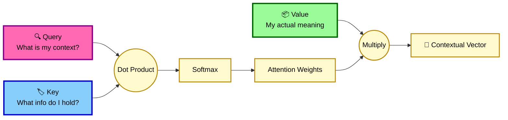

https://chat.deepseek.com/share/5p3rd7yon7masp3iw0

# 🚀 Mastering Seq2Seq, Attention, and Transformers

Welcome to the ultimate guide on **Sequence-to-Sequence (Seq2Seq) Models**, the **Attention Mechanism**, and the revolutionary **Transformer** architecture! Based on deep-dive lecture notes, this README breaks down the *What, Why, How, and When* of modern NLP, complete with mathematical formulas, colorful diagrams, and annotated code.

---

## 📖 1. The Evolution: Why Seq2Seq?

Before Transformers, we relied on RNNs/LSTMs for sequential data. However, they had major flaws:
1. **Sequential Processing**: They process words one by one (slow, no parallelization).
2. **Long-term Memory Failure**: They forget the beginning of a long sentence by the time they reach the end.

### 🔄 The Encoder-Decoder Solution
To solve tasks like **Machine Translation** (English ➡️ French) or **Question-Answering**, we introduced the **Seq2Seq** architecture:
* **Encoder**: Reads the input sequence (left-to-right) and compresses it into a single **Context Vector** (a summary of the sentence).
* **Decoder**: Takes the Context Vector and generates the output sequence one word at a time.

```mermaid
graph TD
    classDef input fill:#FFD1DC,stroke:#C71585,stroke-width:3px,color:#000;
    classDef enc fill:#ADD8E6,stroke:#00008B,stroke-width:3px,color:#000;
    classDef ctx fill:#FFA500,stroke:#8B0000,stroke-width:4px,color:#000;
    classDef dec fill:#90EE90,stroke:#006400,stroke-width:3px,color:#000;
    classDef out fill:#E6E6FA,stroke:#4B0082,stroke-width:3px,color:#000;

    subgraph 🧠 Encoder (Understands)
    I1[How]:::input --> E1((RNN/LSTM)):::enc
    I2[are]:::input --> E2((RNN/LSTM)):::enc
    I3[you?]:::input --> E3((RNN/LSTM)):::enc
    E1 --> E2 --> E3
    end

    E3 --> CV((📦 Context Vector)):::ctx

    subgraph 🗣️ Decoder (Generates)
    CV --> D1((RNN/LSTM)):::dec
    D1 --> D2((RNN/LSTM)):::dec
    D2 --> D3((RNN/LSTM)):::dec
    end

    D1 --> O1[Comment]:::out
    D2 --> O2[allez]:::out
    D3 --> O3[vous?]:::out
```

### ⚠️ The Fatal Flaw: Information Bottleneck
The Encoder must cram an entire sentence's meaning into a **single, fixed-size vector**. If the sentence is long, information is lost. The Decoder struggles to reconstruct it accurately.

---

## 💡 2. The Game Changer: Attention Mechanism

**"Why rely on one Context Vector when the Decoder can look at ALL Encoder states?"**

Instead of a single bottleneck, the Attention mechanism allows the Decoder to dynamically focus on the most relevant parts of the input sentence *at every step of generation*.

### 🧮 The Math of Attention
1. **Alignment Score ($e_{ij}$)**: How much does Decoder step $i$ care about Encoder step $j$?
2. **Attention Weight ($\alpha_{ij}$)**: Normalize scores using Softmax (sums to 1).
   $$ \alpha_{ij} = \text{Softmax}(e_{ij}) $$
3. **Context Vector ($C_i$)**: Weighted sum of all Encoder hidden states ($h_j$).
   $$ C_i = \sum_{j} \alpha_{ij} h_j $$

---

## 🤖 3. Transformers: "Attention is All You Need"

Transformers completely **removed RNNs**. They rely purely on **Self-Attention**, allowing every word to "talk" to every other word simultaneously, regardless of distance.

### 🔑 Query, Key, Value (Q, K, V) Intuition
Inspired by database retrieval systems:
* **Query (Q)**: What am I looking for? (The "search term")
* **Key (K)**: What do I contain? (The "label")
* **Value (V)**: What information do I actually share if matched? (The "content")



### 🧮 The 4 Steps of Self-Attention (Example: "Please study man")
1. **Create Q, K, V Vectors**: Multiply input embeddings ($X$) by weight matrices ($W_q, W_k, W_v$).
   $$ Q = X \cdot W_q, \quad K = X \cdot W_k, \quad V = X \cdot W_v $$
2. **Raw Attention Scores**: Dot product of $Q$ and $K^T$.
   $$ \text{Score} = Q \cdot K^T $$
3. **Apply Softmax**: Convert raw scores into probabilities (Attention Weights).
   $$ \text{Weights} = \text{Softmax}(\text{Score}) $$
4. **Context Vector**: Multiply Weights by $V$.
   $$ \text{Output} = \text{Weights} \cdot V $$

---

## 🏗️ 4. Transformer Architecture Deep Dive

A Transformer is built by stacking **Encoder Blocks** and **Decoder Blocks**.

```mermaid
graph TD
    classDef enc fill:#ADD8E6,stroke:#00008B,stroke-width:3px,color:#000;
    classDef dec fill:#90EE90,stroke:#006400,stroke-width:3px,color:#000;
    classDef attn fill:#DDA0DD,stroke:#800080,stroke-width:2px,color:#000;
    classDef ffn fill:#FFFACD,stroke:#B8860B,stroke-width:2px,color:#000;
    classDef norm fill:#FFDAB9,stroke:#CD853F,stroke-width:2px,color:#000;

    subgraph 🧠 Encoder Block (x N)
    E_In[Input Embedding + Positional Encoding]:::enc --> E_MHSA[Multi-Head Self-Attention]:::attn
    E_MHSA --> E_Add1((+)):::norm
    E_In --> E_Add1
    E_Add1 --> E_Norm1[Layer Norm]:::norm
    E_Norm1 --> E_FFN[Feed Forward Network]:::ffn
    E_FFN --> E_Add2((+)):::norm
    E_Norm1 --> E_Add2
    E_Add2 --> E_Norm2[Layer Norm]:::norm
    end

    subgraph 🗣️ Decoder Block (x N)
    D_In[Output Embedding + Positional Encoding]:::dec --> D_MHSA1[Masked Multi-Head Self-Attention]:::attn
    D_MHSA1 --> D_Add1((+)):::norm
    D_In --> D_Add1
    D_Add1 --> D_Norm1[Layer Norm]:::norm
    D_Norm1 --> D_Cross[Cross-Attention<br/>Q from Decoder, K/V from Encoder]:::attn
    D_Cross --> D_Add2((+)):::norm
    D_Norm1 --> D_Add2
    D_Add2 --> D_Norm2[Layer Norm]:::norm
    D_Norm2 --> D_FFN[Feed Forward Network]:::ffn
    D_FFN --> D_Add3((+)):::norm
    D_Norm2 --> D_Add3
    D_Add3 --> D_Norm3[Layer Norm]:::norm
    end

    E_Norm2 -.->|Keys & Values| D_Cross
```

### 🔍 Key Components Explained
1. **Positional Encoding**: Since Transformers process all words at once (no RNN loop), they don't know word order. We inject sine/cosine waves to tell the model "word 1 comes before word 2".
2. **Masked Attention (Decoder)**: During training, we prevent the Decoder from "cheating" by looking at future words. We mask future positions with $-\infty$ so Softmax turns them into $0$.
3. **Cross-Attention**: The Decoder uses its own **Queries**, but fetches **Keys** and **Values** from the Encoder. This is how the translation model "looks" at the English sentence while generating the French word.
4. **Feed Forward Network (FFN)**: A 2-layer neural network (`Linear -> ReLU -> Linear`) applied to *each word independently* to deepen the understanding after Attention.
5. **Layer Norm & Residual Connections**: `Output = LayerNorm(x + Sublayer(x))`. Prevents vanishing gradients and stabilizes training.

---

## 💻 5. Code Walkthrough: Self-Attention in PyTorch

Here is how the 4 steps of Self-Attention translate into actual code, complete with comments mapping to the theory.

```python
import torch
import torch.nn as nn
import torch.nn.functional as F
import math

class SelfAttention(nn.Module):
    def __init__(self, embed_size, heads):
        super(SelfAttention, self).__init__()
        self.embed_size = embed_size
        self.heads = heads
        self.head_dim = embed_size // heads

        # 1. Creating Q, K, V Weight Matrices
        # We multiply the input by these to get Queries, Keys, and Values
        self.W_q = nn.Linear(embed_size, embed_size)
        self.W_k = nn.Linear(embed_size, embed_size)
        self.W_v = nn.Linear(embed_size, embed_size)
        
        self.fc_out = nn.Linear(embed_size, embed_size)

    def forward(self, x):
        N, seq_len, embed_size = x.shape
        
        # Step 1: Create Q, K, V vectors
        Q = self.W_q(x)  # (N, seq_len, embed_size)
        K = self.W_k(x)
        V = self.W_v(x)

        # Step 2: Raw Attention Score (Dot Product of Q and K^T)
        # Shape: (N, seq_len, seq_len)
        scores = torch.matmul(Q, K.transpose(-2, -1))
        
        # Scale by sqrt(d_k) to prevent Softmax from saturating (vanishing gradients)
        scores = scores / math.sqrt(self.head_dim)

        # Step 3: Apply Softmax to get Attention Weights (Probabilities)
        attention_weights = F.softmax(scores, dim=-1)

        # Step 4: Create Context Vector (Weights multiplied by V)
        # Shape: (N, seq_len, embed_size)
        context_vector = torch.matmul(attention_weights, V)

        # Final Linear Projection (as per Multi-Head Attention rules)
        out = self.fc_out(context_vector)
        
        return out
```

---

## 🎉 6. Fun Facts & Analogies

* 🗄️ **Database Analogy**: The Q, K, V concept comes directly from relational databases. You send a **Query**, the database matches it against the **Keys** (indexes), and returns the **Values** (rows).
* 🎭 **Teacher Forcing vs. Auto-Regressive**: 
  * *Training*: The Decoder is given the correct previous word (like a student with a hint).
  * *Prediction*: The Decoder must rely on its own previous prediction (like taking a test without hints). This mismatch is called **Exposure Bias**.
* 🚀 **Parallelization**: Because RNNs process sequentially, a 100-word sentence takes 100 steps. Transformers process all 100 words *at the exact same time*, making GPU utilization skyrocket and training drastically faster.
* 🧩 **Multi-Head Attention**: Instead of one "search", the model runs 8 (or more) parallel searches. One head might focus on **grammar**, another on **pronoun resolution**, and another on **semantic meaning**.

---

## 📝 Summary Cheat Sheet

| Concept | Purpose | Key Feature |
| :--- | :--- | :--- |
| **Encoder** | Understands Input | Compresses sequence into Context / Hidden States. |
| **Decoder** | Generates Output | Predicts next word using Context + previous words. |
| **Attention** | Solves Bottleneck | Allows Decoder to look at *all* Encoder states dynamically. |
| **Transformer** | Modern Standard | Pure Attention, No RNNs, Fully Parallel. |
| **Masking** | Prevents Cheating | Blocks future words during Decoder's self-attention. |
| **FFN** | Deepens Meaning | Processes each word individually after Attention. |