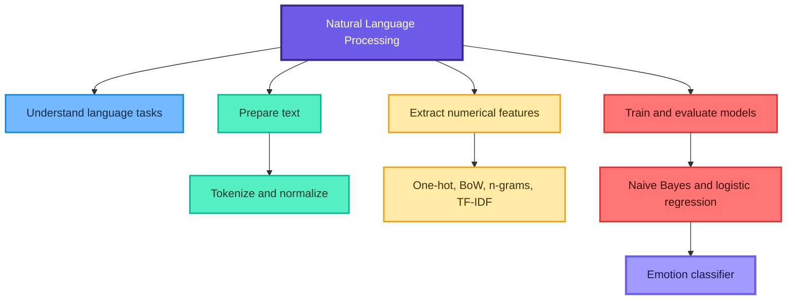
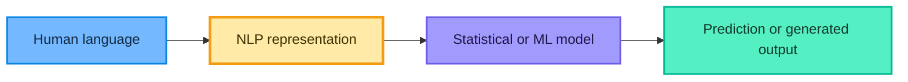
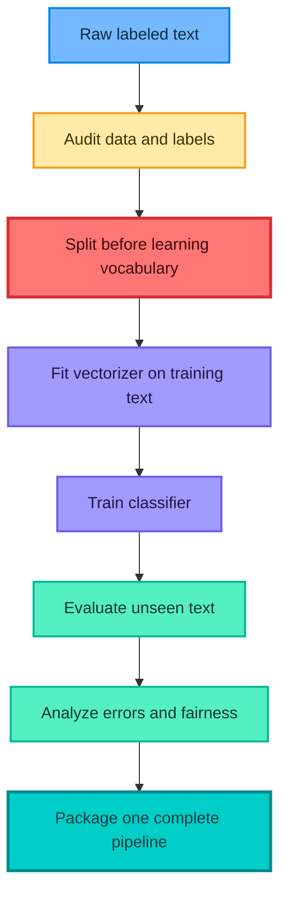
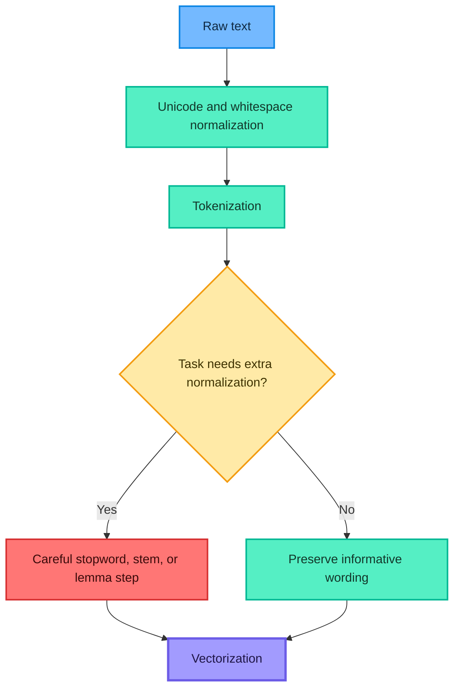
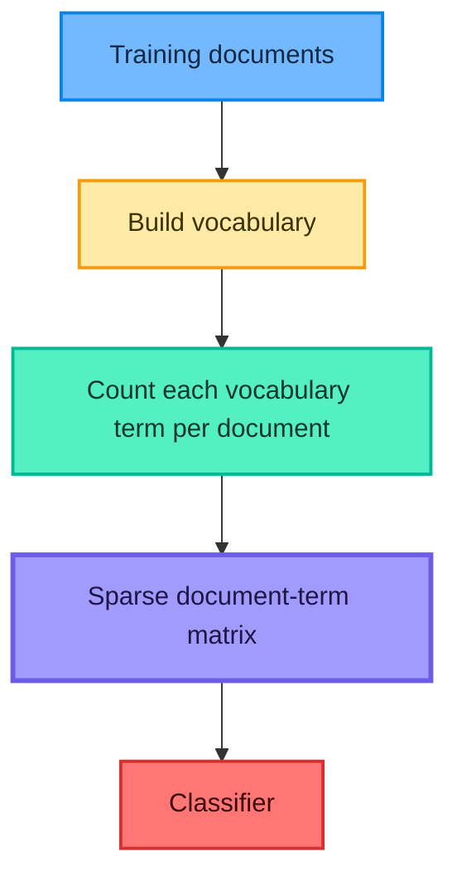
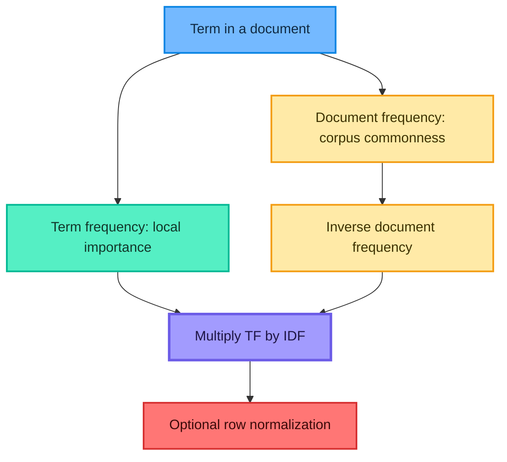
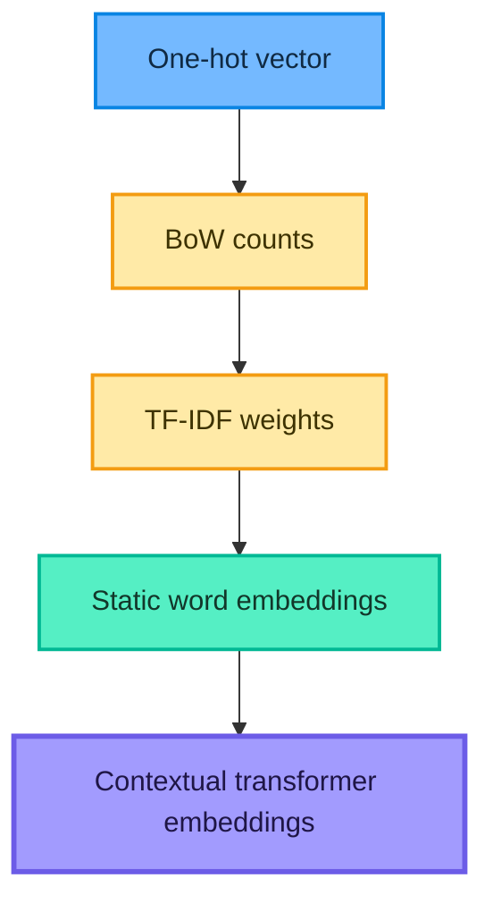
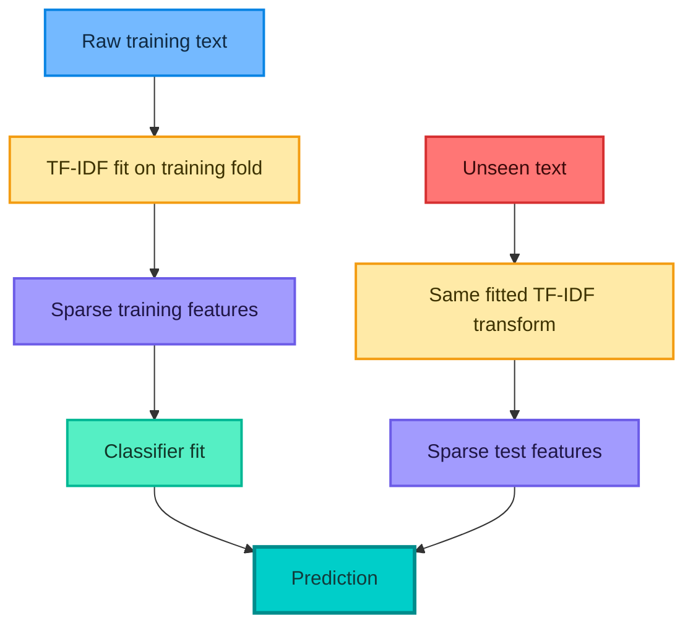

# Natural Language Processing with Machine Learning

## Classical NLP, Text Vectorization, and Emotion Classification

These notes transform the supplied YouTube transcript, six-page visual PDF, and `train.txt` emotion dataset into a detailed learning guide. They explain **what**, **why**, **how**, and **when**, include mathematical intuition, corrected implementation patterns, commented code, common mistakes, fun facts, and practice questions with solutions.

> Central idea: text must be represented numerically before a classical machine-learning model can learn from it, but every representation preserves some information and discards some information.

## Learning roadmap



## Contents

1. [What is NLP?](#1-what-is-nlp)
2. [Why NLP is difficult](#2-why-nlp-is-difficult)
3. [Real-world applications](#3-real-world-applications)
4. [Major NLP approaches](#4-major-nlp-approaches)
5. [The machine-learning NLP workflow](#5-the-machine-learning-nlp-workflow)
6. [Corpus, document, token, and vocabulary](#6-corpus-document-token-and-vocabulary)
7. [Text preprocessing](#7-text-preprocessing)
8. [One-hot encoding](#8-one-hot-encoding)
9. [Bag of Words](#9-bag-of-words)
10. [N-grams](#10-n-grams)
11. [TF-IDF](#11-tf-idf)
12. [Sparse features and similarity](#12-sparse-features-and-similarity)
13. [Embeddings and transformers](#13-embeddings-and-transformers)
14. [Classical text classifiers](#14-classical-text-classifiers)
15. [Understanding the supplied dataset](#15-understanding-the-supplied-dataset)
16. [End-to-end emotion classification](#16-end-to-end-emotion-classification)
17. [Evaluation and observed results](#17-evaluation-and-observed-results)
18. [Error analysis and improvement](#18-error-analysis-and-improvement)
19. [Saving and serving the model](#19-saving-and-serving-the-model)
20. [Practice questions with solutions](#20-practice-questions-with-solutions)
21. [Quick revision sheet](#21-quick-revision-sheet)

## 1. What is NLP?

Natural Language Processing, or **NLP**, is the area of artificial intelligence concerned with computational processing of human language. It helps machines work with text or speech in languages such as English, Hindi, Tamil, German, or French.

NLP systems may:

- read or classify text;
- extract entities and facts;
- compare document meaning;
- detect sentiment, emotion, spam, or intent;
- translate between languages;
- answer questions or generate responses;
- convert speech to text or text to speech.



### 1.1 Natural language versus programming language

| Natural language | Programming language |
|---|---|
| Developed for human communication | Designed to instruct computers precisely |
| Ambiguous and context dependent | Has formal grammar and defined semantics |
| Changes across communities and time | Changes through controlled language versions |
| Meaning depends on tone and shared knowledge | Meaning is intended to be deterministic |

NLP does not make a computer literally experience meaning or emotion. It learns useful patterns that support language tasks.

### 1.2 NLP, NLU, and NLG

- **NLP** is the broad field.
- **Natural Language Understanding (NLU)** focuses on interpreting inputs: intent, entities, sentiment, or meaning.
- **Natural Language Generation (NLG)** focuses on producing human-readable language.

The boundaries overlap, especially in modern end-to-end systems.

## 2. Why NLP is difficult

Human language is full of ambiguity and unstated knowledge.

### 2.1 Lexical ambiguity

The same word can have different meanings:

- "I deposited money in the **bank**."
- "We sat on the river **bank**."

A Bag-of-Words model treats the surface token as the same feature unless context features help separate the cases.

### 2.2 Syntactic ambiguity

"I saw the person with the telescope" may mean that I used a telescope or that the person had one.

### 2.3 Negation and word order

- "good"
- "not good"
- "not at all good"

The presence of `good` alone is insufficient. Word order and negation can reverse meaning.

### 2.4 Sarcasm and pragmatics

"Great, another two-hour delay" contains a positive word but usually expresses frustration. Correct interpretation depends on situation and tone.

### 2.5 Morphology and language variation

Words appear in related forms such as `connect`, `connected`, and `connecting`. Languages also differ in scripts, compound words, inflection, word order, and token boundaries.

### 2.6 Noisy user text

Real inputs contain spelling mistakes, repeated letters, emojis, hashtags, URLs, HTML, code switching, abbreviations, and missing punctuation.

### 2.7 Domain shift

The word `positive` has different implications in a movie review and a medical test. A model trained on personal blog emotions may not transfer reliably to customer support messages.

> Fun fact: changing a single punctuation mark can change intent: "Let's eat, Grandma" and "Let's eat Grandma" are not the same request.

## 3. Real-world applications

| Application | Typical input | Possible NLP task |
|---|---|---|
| Chatbot or virtual assistant | User message or speech | Intent detection, retrieval, generation |
| Spam filtering | Email or SMS | Binary classification |
| Sentiment analysis | Review or social post | Positive, neutral, negative classification |
| Emotion detection | Sentence or document | Joy, sadness, anger, fear, love, surprise |
| Search engine | Query and documents | Retrieval and ranking |
| Machine translation | Source-language text | Sequence transformation |
| Autocomplete | Partial sequence | Next-token prediction |
| Resume screening | Resume and job description | Extraction and similarity |
| Named entity recognition | Text | Person, place, organization spans |
| Text summarization | Long document | Shorter faithful representation |

High-stakes domains need special care. Language models can inherit bias, miss context, expose private data, or make confidently wrong predictions.

## 4. Major NLP approaches

### 4.1 Rule-based NLP

Human-written patterns and dictionaries drive the decision.

```python
def simple_spam_rule(message: str) -> bool:
    """Return True when a tiny demonstration keyword rule fires."""
    normalized = message.casefold()
    suspicious_phrases = ("won a lottery", "claim your prize", "free money")
    return any(phrase in normalized for phrase in suspicious_phrases)
```

**Advantages:** transparent, fast, deterministic, and useful when rules are stable.

**Limitations:** brittle wording, growing maintenance cost, weak context handling, and many false positives or negatives.

### 4.2 Statistical NLP

Statistical methods estimate probabilities from language data. Examples include n-gram language models and probabilistic taggers.

### 4.3 Classical machine-learning NLP

The workflow is:

1. convert text into engineered numeric features;
2. fit a classifier or regressor;
3. evaluate on unseen text.

Common feature methods are Bag of Words and TF-IDF. Common models include naive Bayes, logistic regression, and linear support vector machines.

### 4.4 Deep-learning NLP

Neural models learn dense representations and often model sequence or context more directly. Examples include recurrent networks, convolutional text models, Word2Vec-style embeddings, and transformers.

| Approach | Strength | Limitation | Good starting case |
|---|---|---|---|
| Rules | Exact control | Hard to scale | Compliance phrase pattern |
| BoW or TF-IDF plus linear model | Fast, strong baseline | Limited semantics and context | Classification with labeled text |
| Embeddings plus neural model | Better semantic representation | More data and compute | Complex language patterns |
| Pretrained transformer | Strong contextual transfer | Cost, latency, governance | High-value task with careful evaluation |

Start with the simplest approach that satisfies the task. A strong sparse baseline is valuable even when a transformer is planned.

## 5. The machine-learning NLP workflow



### 5.1 Why split before vectorization?

The vocabulary, document frequencies, and feature-selection decisions are learned from data. If the vectorizer is fitted on all text before the split, test information leaks into training.

Unsafe:

```python
# Incorrect: test-document vocabulary and frequencies influence features.
X_all = vectorizer.fit_transform(all_text)
X_train, X_test, y_train, y_test = train_test_split(X_all, labels)
```

Safe:

```python
# The pipeline learns the vocabulary only from the training partition.
X_train, X_test, y_train, y_test = train_test_split(
    text,
    labels,
    stratify=labels,
    random_state=42,
)

pipeline.fit(X_train, y_train)
predictions = pipeline.predict(X_test)
```

## 6. Corpus, document, token, and vocabulary

Let the corpus be

$$
\mathcal{D}=\{d_1,d_2,\ldots,d_N\}
$$

where each $d_i$ is one document.

| Term | Meaning | Emotion-project example |
|---|---|---|
| Corpus | Entire text collection | All 16,000 lines |
| Document | One text sample | One personal statement |
| Token | A processing unit | A word or punctuation symbol |
| Type | A unique token form | `happy` |
| Vocabulary | Set of known feature terms | Terms learned from training text |
| Label | Target class | `joy` |

If the training vocabulary is

$$
\mathcal{V}=\{t_1,t_2,\ldots,t_M\},
$$

then a vectorizer maps each document into a vector in $\mathbb{R}^M$.

### 6.1 Out-of-vocabulary terms

An **OOV** term is absent from the fitted vocabulary. `CountVectorizer` and `TfidfVectorizer` ignore unknown terms during `transform`. Character n-grams and subword-based neural methods can reduce, but not eliminate, OOV-related information loss.

## 7. Text preprocessing

Preprocessing should remove accidental variation without destroying task-relevant meaning.



### 7.1 Lowercasing and case folding

Lowercasing merges `Happy` and `happy`, reducing vocabulary size. Python's `casefold()` is a stronger Unicode-aware normalization for caseless matching.

Do not lowercase automatically when capitalization carries information, such as named entities, acronyms, or emphasis.

### 7.2 Punctuation

Punctuation may be noise for topic classification, but it may express emotion, sentence boundaries, contractions, or negation. Removing apostrophes carelessly can turn `don't` into pieces that lose the negation relationship.

### 7.3 Tokenization

Tokenization splits text into units. Word tokenization is language dependent; whitespace alone is not universal.

```python
import re

def simple_english_tokens(text: str) -> list[str]:
    """A transparent English-only demonstration tokenizer."""
    return re.findall(r"[a-z]+(?:'[a-z]+)?", text.casefold())

print(simple_english_tokens("I don't feel happy."))
# ['i', "don't", 'feel', 'happy']
```

For production multilingual work, select a tokenizer designed for the target languages.

### 7.4 Stopwords

Stopwords are frequent function words such as `the`, `is`, and `of`. Removing them can shrink sparse features, but it is not always beneficial.

For sentiment or emotion, words such as `not`, `no`, and `never` can be crucial. Blind stopword removal can make `not happy` resemble `happy`.

**Rule:** treat stopword removal as a hyperparameter and validate it rather than assuming it helps.

### 7.5 Stemming

Stemming applies mechanical rules to remove word endings:

- `playing` $\rightarrow$ `play`
- `studies` may become a non-dictionary stem

It is fast but can over-stem unrelated words or produce unnatural forms.

### 7.6 Lemmatization

Lemmatization maps an inflected word to a dictionary lemma using linguistic information:

- `running` $\rightarrow$ `run`
- `better` $\rightarrow$ `good` when the correct part of speech is known

It is usually more linguistically meaningful but needs language resources and part-of-speech context.

### 7.7 Preprocessing decision table

| Step | Potential benefit | Potential damage |
|---|---|---|
| Lowercase | Smaller vocabulary | Loses capitalization signal |
| Remove punctuation | Less noise | Loses tone, contractions, boundaries |
| Remove stopwords | Fewer dimensions | Removes negation or grammatical cues |
| Stem | Merges variants cheaply | Creates crude or incorrect stems |
| Lemmatize | Merges forms meaningfully | Slower and language dependent |
| Remove emojis | Simplifies input | Deletes strong emotion signal |

The supplied emotion data is already lowercase and mostly punctuation-free. More aggressive cleaning is not automatically an improvement.

## 8. One-hot encoding

### 8.1 Word-level one-hot vectors

For vocabulary size $M$, term $t_j$ is represented by basis vector $e_j$:

$$
e_j=(0,\ldots,0,1,0,\ldots,0)^{\top}\in\{0,1\}^M
$$

Exactly one position is 1.

If the vocabulary is `[time, success, failed]`:

| Word | Vector |
|---|---|
| `time` | $[1,0,0]$ |
| `success` | $[0,1,0]$ |
| `failed` | $[0,0,1]$ |

### 8.2 Important distinction

A word can be one-hot encoded. A complete document containing several words is usually represented as:

- a sequence of one-hot vectors;
- a **multi-hot** vector indicating presence;
- a count vector, which is Bag of Words.

Calling a document count matrix "one-hot" is imprecise when a row can contain several 1s or values greater than 1.

### 8.3 Advantages and limitations

**Advantages:** intuitive and easy to implement.

**Limitations:** high dimensionality, extreme sparsity, no semantic similarity, fixed vocabulary, and awkward variable-length document representation.

Two distinct one-hot word vectors are orthogonal even when their words are semantically related:

$$
e_i^{\top}e_j=0\qquad\text{for }i\ne j
$$

## 9. Bag of Words

### 9.1 What is BoW?

Bag of Words represents document $d_i$ using term counts. For vocabulary term $t_j$:

$$
x_{ij}=\operatorname{count}(t_j,d_i)
$$

The corpus becomes a document-term matrix

$$
X\in\mathbb{R}^{N\times M}
$$

with $N$ documents and $M$ vocabulary features.



### 9.2 Worked example

Documents:

- $d_1$: `cricket is very good`
- $d_2$: `cricket is not good`

Vocabulary order: `[cricket, is, very, good, not]`

$$
d_1=[1,1,1,1,0]
$$

$$
d_2=[1,1,0,1,1]
$$

The model can see `very` versus `not`, but ordinary unigram BoW does not directly bind `not` to `good`.

### 9.3 Binary BoW

Presence rather than count can be represented as

$$
x_{ij}=\mathbb{1}[t_j\in d_i]
$$

This can help when repetition should not increase influence.

### 9.4 `CountVectorizer`

```python
from sklearn.feature_extraction.text import CountVectorizer

documents = [
    "cricket is very good",
    "cricket is not good",
]

vectorizer = CountVectorizer()
matrix = vectorizer.fit_transform(documents)

print(vectorizer.get_feature_names_out())
print(matrix.toarray())  # Dense conversion is safe only for this tiny demo.
```

Never call `.toarray()` on a large text matrix merely to inspect it; the dense matrix can exhaust memory.

### 9.5 Pros and cons

**Pros:** simple, fast, fixed-size output, interpretable features, and strong with linear models.

**Cons:** sparse, high dimensional, fixed vocabulary, weak semantics, and mostly ignores word order.

## 10. N-grams

An n-gram is a consecutive sequence of $n$ tokens.

- unigram: `not`
- bigram: `not good`
- trigram: `not very good`

For a document of $L$ tokens, the number of contiguous token n-grams is

$$
\max(0,L-n+1)
$$

### 10.1 Why n-grams help

Unigrams for `cricket is very good` and `cricket is not good` overlap heavily. Bigrams create `very good` and `not good`, preserving a small amount of local order.

```python
from sklearn.feature_extraction.text import CountVectorizer

ngram_vectorizer = CountVectorizer(ngram_range=(1, 2))
matrix = ngram_vectorizer.fit_transform(
    ["cricket is very good", "cricket is not good"]
)

print(ngram_vectorizer.get_feature_names_out())
```

### 10.2 The dimensionality trade-off

Increasing $n$ creates more specific features but also:

- increases vocabulary size and memory;
- makes features rarer;
- worsens OOV behavior;
- requires more data.

Use `min_df`, `max_df`, and `max_features` to control vocabulary growth. Tune n-gram range inside cross-validation.

> Fun fact: character n-grams can handle misspellings, suffixes, and unseen word forms surprisingly well because they do not require whole-word matches.

## 11. TF-IDF

### 11.1 Intuition

Bag of Words treats every occurrence equally. TF-IDF gives a high weight to a term when it is frequent in one document but uncommon across the corpus.



### 11.2 Textbook formula

Let $c(t,d)$ be the count of term $t$ in document $d$, and let $|d|$ be the number of terms in that document:

$$
\operatorname{tf}(t,d)=\frac{c(t,d)}{|d|}
$$

If $N$ is the number of documents and $\operatorname{df}(t)$ is the number containing $t$:

$$
\operatorname{idf}(t)=\log\left(\frac{N}{\operatorname{df}(t)}\right)
$$

Then

$$
\operatorname{tfidf}(t,d)
=\operatorname{tf}(t,d)\operatorname{idf}(t)
$$

A term in every document has textbook IDF $\log(1)=0$.

### 11.3 scikit-learn's default formula

Implementations differ. With `smooth_idf=True`, scikit-learn uses

$$
\operatorname{idf}_{\text{sklearn}}(t)
=\log\left(\frac{1+N}{1+\operatorname{df}(t)}\right)+1
$$

It uses raw term count by default and L2-normalizes each document vector. With `sublinear_tf=True`, positive count $c$ becomes

$$
\operatorname{tf}_{\text{sublinear}}=1+\log(c)
$$

This distinction explains why hand calculations may not exactly match `TfidfVectorizer` output.

### 11.4 Example

```python
from sklearn.feature_extraction.text import TfidfVectorizer

tfidf = TfidfVectorizer(
    ngram_range=(1, 2),
    min_df=2,
    max_df=0.98,
    sublinear_tf=True,
)

# Fit only on training documents in a real workflow.
train_matrix = tfidf.fit_transform(training_text)
test_matrix = tfidf.transform(test_text)
```

### 11.5 Advantages and limitations

**Advantages:** reduces dominance of corpus-wide common words, works well for retrieval and classification, remains interpretable, and is efficient with sparse matrices.

**Limitations:** still sparse, vocabulary-bound, mostly lexical, and weak at deep context or semantic relationships.

TF-IDF is not automatically superior to counts for every classifier. Validate representation and model together.

## 12. Sparse features and similarity

### 12.1 Why text matrices are sparse

A document uses only a small portion of a large vocabulary. If matrix $X$ has $N\times M$ positions, sparsity is

$$
\operatorname{sparsity}(X)
=\frac{\#\{x_{ij}=0\}}{NM}
$$

Sparse matrix formats store nonzero values and their indices rather than every zero. This is why tens of thousands of text features can remain practical.

### 12.2 Cosine similarity

Cosine similarity compares vector direction:

$$
\operatorname{cosine}(x,y)
=\frac{x^{\top}y}{\|x\|_2\|y\|_2}
$$

For nonnegative BoW or TF-IDF vectors, values near 1 indicate similar term patterns and values near 0 indicate little overlap.

```python
from sklearn.metrics.pairwise import cosine_similarity

documents = [
    "I feel happy and excited",
    "I am joyful and excited",
    "I am frightened by the storm",
]

demo_tfidf = TfidfVectorizer()
vectors = demo_tfidf.fit_transform(documents)
similarities = cosine_similarity(vectors)
print(similarities)
```

Lexical similarity is not guaranteed semantic equivalence. Two paraphrases with different words can have low sparse-vector similarity.

## 13. Embeddings and transformers

Sparse methods give each vocabulary term its own dimension. **Embeddings** map terms or text into lower-dimensional dense vectors.

### 13.1 Representation progression



### 13.2 Static word embeddings

Word2Vec, GloVe, and FastText place related words near one another. One word normally receives one vector regardless of sentence context, although FastText also uses subword information.

### 13.3 Contextual embeddings

Transformer models can give `bank` different representations in `river bank` and `bank account`. They are more context aware but require more compute, memory, latency, and governance.

### 13.4 When classical NLP still wins

- small or medium labeled datasets;
- low-latency CPU inference;
- transparent feature inspection;
- inexpensive retraining;
- strong domain-specific lexical signals;
- a baseline for measuring whether a complex model adds value.

## 14. Classical text classifiers

### 14.1 Multinomial naive Bayes

Bayes' rule is

$$
P(c\mid x)=\frac{P(x\mid c)P(c)}{P(x)}
$$

For classification, the denominator is common across classes:

$$
\hat{c}=\arg\max_c P(c)P(x\mid c)
$$

Multinomial naive Bayes assumes features are conditionally independent given the class:

$$
P(x\mid c)=\prod_{j=1}^{M}P(t_j\mid c)^{x_j}
$$

In log space:

$$
\log P(c\mid x)\propto
\log P(c)+\sum_{j=1}^{M}x_j\log P(t_j\mid c)
$$

With additive smoothing $\alpha$:

$$
\hat{P}(t_j\mid c)
=\frac{N_{cj}+\alpha}{N_c+\alpha M}
$$

Smoothing prevents an unseen class-term combination from making the entire class probability zero.

**When:** fast count-based baseline, discrete nonnegative features, and modest training data.

### 14.2 Complement naive Bayes

ComplementNB estimates weights using statistics from the complement of each class. It is often useful for imbalanced text classification and is worth comparing with MultinomialNB.

### 14.3 Logistic regression

For multiclass softmax logistic regression:

$$
P(y=k\mid x)
=\frac{\exp(w_k^{\top}x+b_k)}
{\sum_{r=1}^{K}\exp(w_r^{\top}x+b_r)}
$$

The predicted class is the largest probability. L2 regularization adds a weight penalty such as

$$
\lambda\sum_{k=1}^{K}\|w_k\|_2^2
$$

to discourage excessively large coefficients.

**When:** strong interpretable sparse baseline, probability estimates, and linear class boundaries.

### 14.4 Linear support vector classifier

LinearSVC learns separating hyperplanes with a margin-based objective. It is often extremely strong for high-dimensional sparse text, but does not provide probabilities by default.

### 14.5 Model comparison

| Model | Strength | Caution |
|---|---|---|
| MultinomialNB | Very fast, excellent baseline | Naive independence assumption |
| ComplementNB | Handles imbalance well | Still a naive Bayes model |
| LogisticRegression | Probabilities and inspectable coefficients | Tune regularization and convergence |
| LinearSVC | Often highest sparse-text accuracy | No native probability output |

## 15. Understanding the supplied dataset

The attached `train.txt` has one sample per line:

```text
text;emotion_label
```

It contains six labels.

### 15.1 Observed audit

| Label | Rows | Percentage |
|---|---:|---:|
| `joy` | 5,362 | $33.51\%$ |
| `sadness` | 4,666 | $29.16\%$ |
| `anger` | 2,159 | $13.49\%$ |
| `fear` | 1,937 | $12.11\%$ |
| `love` | 1,304 | $8.15\%$ |
| `surprise` | 572 | $3.58\%$ |
| **Total** | **16,000** | **$100\%$** |

Additional observations:

- no malformed lines were found when splitting at the final semicolon;
- no empty texts or missing labels were found;
- mean document length is about $19.17$ whitespace-separated words;
- lengths range from 2 to 66 words;
- 31 text rows repeat an earlier text;
- 30 unique repeated texts have conflicting labels.

The conflicts matter. The same input cannot be deterministically assigned two different labels without extra context. They can also leak across a random split.

### 15.2 Class imbalance

If a classifier predicted only `joy`, its accuracy would already be

$$
\frac{5362}{16000}\approx0.3351
$$

This is why accuracy alone is insufficient. Report macro-F1 and per-class recall, particularly for `surprise` and `love`.

### 15.3 Robust loader

```python
from pathlib import Path
import pandas as pd

DATA_PATH = Path("train.txt")

records: list[tuple[str, str]] = []

for line_number, raw_line in enumerate(
    DATA_PATH.read_text(encoding="utf-8").splitlines(),
    start=1,
):
    # Split only at the final semicolon so a semicolon inside text is preserved.
    if ";" not in raw_line:
        raise ValueError(f"Malformed line {line_number}: missing label separator")

    message, label = raw_line.rsplit(";", maxsplit=1)
    message = message.strip()
    label = label.strip()

    if not message or not label:
        raise ValueError(f"Malformed line {line_number}: empty text or label")

    records.append((message, label))

data = pd.DataFrame(records, columns=["text", "label"])
print(data.shape)
print(data["label"].value_counts())
```

### 15.4 Resolve label conflicts deliberately

For this teaching project, all text strings associated with multiple labels are removed. A real project should investigate annotation history rather than silently discard disagreements.

```python
label_counts_per_text = data.groupby("text")["label"].nunique()
ambiguous_texts = label_counts_per_text[label_counts_per_text > 1].index

clean_data = (
    data.loc[~data["text"].isin(ambiguous_texts)]
    .drop_duplicates(subset=["text", "label"])
    .reset_index(drop=True)
)

print("Original rows:", len(data))
print("Clean rows:", len(clean_data))  # 15,939 for the supplied file.
```

## 16. End-to-end emotion classification

### 16.1 Leakage-safe TF-IDF pipeline

```python
from sklearn.feature_extraction.text import TfidfVectorizer
from sklearn.linear_model import LogisticRegression
from sklearn.metrics import classification_report, confusion_matrix
from sklearn.model_selection import train_test_split
from sklearn.pipeline import Pipeline

X = clean_data["text"]
y = clean_data["label"]

# Stratification approximately preserves every class proportion.
X_train, X_test, y_train, y_test = train_test_split(
    X,
    y,
    test_size=0.20,
    stratify=y,
    random_state=42,
)

emotion_pipeline = Pipeline(
    steps=[
        (
            "vectorizer",
            TfidfVectorizer(
                ngram_range=(1, 2),
                min_df=2,
                max_df=0.98,
                max_features=50_000,
                sublinear_tf=True,
                # Keep stopwords because negation matters for emotion.
                stop_words=None,
            ),
        ),
        (
            "classifier",
            LogisticRegression(
                max_iter=2_000,
                class_weight="balanced",
            ),
        ),
    ]
)

# fit() learns both the vocabulary and classifier only from training rows.
emotion_pipeline.fit(X_train, y_train)
y_pred = emotion_pipeline.predict(X_test)

print(classification_report(y_test, y_pred, digits=3))
print(confusion_matrix(y_test, y_pred, labels=emotion_pipeline.classes_))
```

### 16.2 Why a pipeline matters



The saved object also contains the exact vocabulary, IDF weights, and class order. This prevents training-serving mismatch.

### 16.3 Compare source-aligned models fairly

```python
from sklearn.feature_extraction.text import CountVectorizer
from sklearn.metrics import accuracy_score, f1_score
from sklearn.naive_bayes import ComplementNB, MultinomialNB
from sklearn.svm import LinearSVC

candidate_models = {
    "BoW + MultinomialNB": Pipeline(
        [
            (
                "vectorizer",
                CountVectorizer(
                    ngram_range=(1, 1),
                    min_df=2,
                    max_features=30_000,
                ),
            ),
            ("classifier", MultinomialNB(alpha=0.5)),
        ]
    ),
    "TF-IDF + LogisticRegression": emotion_pipeline,
    "TF-IDF + ComplementNB": Pipeline(
        [
            (
                "vectorizer",
                TfidfVectorizer(
                    ngram_range=(1, 2),
                    min_df=2,
                    max_df=0.98,
                    max_features=50_000,
                    sublinear_tf=True,
                ),
            ),
            ("classifier", ComplementNB(alpha=0.5)),
        ]
    ),
    "TF-IDF + LinearSVC": Pipeline(
        [
            (
                "vectorizer",
                TfidfVectorizer(
                    ngram_range=(1, 2),
                    min_df=2,
                    max_df=0.98,
                    max_features=50_000,
                    sublinear_tf=True,
                ),
            ),
            ("classifier", LinearSVC(class_weight="balanced")),
        ]
    ),
}

for model_name, candidate in candidate_models.items():
    candidate.fit(X_train, y_train)
    candidate_predictions = candidate.predict(X_test)

    accuracy = accuracy_score(y_test, candidate_predictions)
    macro_f1 = f1_score(y_test, candidate_predictions, average="macro")

    print(f"{model_name:32s} accuracy={accuracy:.4f} macro_f1={macro_f1:.4f}")
```

### 16.4 Cross-validated model selection

Repeatedly choosing based on the test set turns it into training feedback. Use cross-validation on the training partition, then evaluate the selected pipeline once on the untouched test partition.

```python
from sklearn.model_selection import StratifiedKFold, cross_validate

cv = StratifiedKFold(n_splits=5, shuffle=True, random_state=42)

cv_result = cross_validate(
    emotion_pipeline,
    X_train,
    y_train,
    cv=cv,
    scoring={
        "accuracy": "accuracy",
        "macro_f1": "f1_macro",
    },
    n_jobs=-1,
)

print("CV accuracy:", cv_result["test_accuracy"].mean())
print("CV macro-F1:", cv_result["test_macro_f1"].mean())
```

### 16.5 Predict new text

```python
examples = [
    "I feel extremely happy and excited today",
    "I am terrified that something bad will happen",
    "I miss them and feel completely heartbroken",
]

predicted_emotions = emotion_pipeline.predict(examples)
predicted_probabilities = emotion_pipeline.predict_proba(examples)

for message, emotion, probabilities in zip(
    examples,
    predicted_emotions,
    predicted_probabilities,
):
    confidence = probabilities.max()
    print(f"{emotion:8s} confidence={confidence:.3f} text={message}")
```

Confidence is not guaranteed calibration. Check calibration before treating probabilities as reliable risk estimates.

## 17. Evaluation and observed results

### 17.1 Metrics

For one class:

$$
\operatorname{precision}=\frac{TP}{TP+FP}
$$

$$
\operatorname{recall}=\frac{TP}{TP+FN}
$$

$$
F_1=2\frac{\operatorname{precision}\cdot\operatorname{recall}}
{\operatorname{precision}+\operatorname{recall}}
$$

Accuracy is

$$
\operatorname{accuracy}=\frac{\text{correct predictions}}{\text{all predictions}}
$$

Macro-F1 gives each class equal weight:

$$
F_{1,\text{macro}}=\frac{1}{K}\sum_{k=1}^{K}F_{1,k}
$$

Weighted-F1 weights classes by support. Macro-F1 is more sensitive to minority-class failure.

### 17.2 Reproduced baseline results

Using the supplied file after removing 61 rows involved in conflicting or exact duplicate records, an 80:20 stratified split, and `random_state=42` produced:

| Pipeline | Accuracy | Macro-F1 |
|---|---:|---:|
| Unigram BoW + MultinomialNB | $0.8253$ | $0.7592$ |
| Unigram-bigram TF-IDF + balanced logistic regression | $0.8610$ | $0.8381$ |
| Unigram-bigram TF-IDF + ComplementNB | $0.8739$ | $0.8372$ |
| Unigram-bigram TF-IDF + balanced LinearSVC | $0.8959$ | $0.8700$ |

These are reproducibility checks, not universal rankings. A different split, cleanup policy, or tuned hyperparameters will change the numbers. The untouched test set should not be used repeatedly for model selection.

### 17.3 Confusion matrix

A confusion matrix $C$ records

$$
C_{ij}=\#\{\text{true class }i\text{ predicted as class }j\}
$$

Inspect it to answer questions such as:

- Is `love` confused with `joy`?
- Is `surprise` confused with `fear`?
- Does the model overpredict the majority classes?

### 17.4 Accuracy is not enough

A model can improve accuracy while becoming worse for a rare class. Report:

- macro-F1;
- per-class precision and recall;
- confusion matrix;
- support per class;
- evaluation on realistic domain and time slices.

## 18. Error analysis and improvement

### 18.1 Structured error table

```python
error_analysis = pd.DataFrame(
    {
        "text": X_test,
        "true_label": y_test,
        "predicted_label": y_pred,
    }
)

errors = error_analysis.loc[
    error_analysis["true_label"] != error_analysis["predicted_label"]
]

print(errors.sample(min(20, len(errors)), random_state=42))
```

Classify error causes:

- ambiguous or multilabel sentence;
- questionable annotation;
- rare vocabulary;
- negation or long-range dependency;
- sarcasm;
- two emotions in one text;
- domain-specific expression;
- text too short to infer emotion.

### 18.2 Improvements to test

| Change | Why it may help | Risk |
|---|---|---|
| Tune `ngram_range` | Preserve local phrases | Larger vocabulary |
| Character n-grams | Robust to spelling and morphology | Less interpretable features |
| Adjust `min_df` | Remove very rare noise | Delete useful minority cues |
| `class_weight='balanced'` | Protect minority recall | May reduce majority precision |
| ComplementNB | Often strong with imbalance | May not beat a linear margin model |
| Tune regularization | Control bias and variance | Must occur inside CV |
| Better labels | Reduce irreducible annotation noise | Requires human review |
| Transformer baseline | Better context | Higher cost and complexity |

### 18.3 Character n-gram experiment

```python
character_pipeline = Pipeline(
    [
        (
            "vectorizer",
            TfidfVectorizer(
                analyzer="char_wb",
                ngram_range=(3, 5),
                min_df=2,
                max_features=80_000,
                sublinear_tf=True,
            ),
        ),
        ("classifier", LinearSVC(class_weight="balanced")),
    ]
)
```

Combine word and character features with `FeatureUnion` only after validating the added memory and latency.

### 18.4 Ethical limitations

Emotion classification is an inference, not a diagnosis. Do not use it alone for mental-health decisions, employee surveillance, discipline, policing, credit, or other consequential actions. Obtain consent, minimize stored text, audit demographic and language performance, provide human review, and allow uncertainty or abstention.

## 19. Saving and serving the model

### 19.1 Save the complete pipeline

```python
from joblib import dump, load

# Refit the chosen configuration on all approved training data before saving.
final_pipeline = emotion_pipeline.fit(clean_data["text"], clean_data["label"])
dump(final_pipeline, "emotion_pipeline.joblib")

loaded_pipeline = load("emotion_pipeline.joblib")
print(loaded_pipeline.predict(["I feel wonderful today"]))
```

Never load an untrusted pickle or joblib file because deserialization can execute code.

### 19.2 Minimal Streamlit interface

```python
import streamlit as st
from joblib import load

@st.cache_resource
def load_emotion_model():
    """Load the fitted vectorizer and classifier together."""
    return load("emotion_pipeline.joblib")

model = load_emotion_model()

st.title("Emotion Classification Demo")
message = st.text_area("Enter an English sentence")

if st.button("Predict"):
    if not message.strip():
        st.warning("Please enter some text.")
    else:
        probabilities = model.predict_proba([message])[0]
        best_index = probabilities.argmax()
        label = model.classes_[best_index]
        confidence = probabilities[best_index]

        st.write(f"Predicted emotion: **{label}**")
        st.write(f"Model score: {confidence:.3f}")
        st.caption("This is a statistical prediction, not a psychological diagnosis.")
```

### 19.3 Production checklist

- store the model version, data version, and code version;
- validate input language and size;
- never log sensitive raw text by default;
- monitor label frequencies and vocabulary drift;
- set latency and memory limits;
- define an abstention or low-confidence path;
- collect corrections only with consent;
- retrain and reevaluate under a controlled process.

## 20. Practice questions with solutions

### Question 1: Core vocabulary

What is the difference between a corpus and a document?

<details>
<summary>Solution</summary>

A corpus is the complete text collection used for a task. A document is one sample inside it, such as one review, email, or emotion statement.

</details>

### Question 2: Vocabulary dimension

A training vocabulary contains 8,000 terms. What is the dimensionality of a unigram BoW vector?

<details>
<summary>Solution</summary>

Each term corresponds to one feature, so every document vector has 8,000 dimensions, even though most positions are zero.

</details>

### Question 3: One-hot distinction

Why is `[1, 0, 1, 0]` not a one-hot vector?

<details>
<summary>Solution</summary>

A one-hot vector has exactly one active position. This vector has two active positions and is a multi-hot presence vector.

</details>

### Question 4: BoW calculation

Vocabulary order is `[happy, very, not]`. Represent `happy happy not` as a count vector.

<details>
<summary>Solution</summary>

`happy` occurs twice, `very` zero times, and `not` once:

$$
[2,0,1]
$$

</details>

### Question 5: N-gram count

A sentence has 7 tokens. How many contiguous trigrams does it contain?

<details>
<summary>Solution</summary>

$$
L-n+1=7-3+1=5
$$

</details>

### Question 6: Negation

Why can removing the word `not` damage an emotion or sentiment classifier?

<details>
<summary>Solution</summary>

Negation can reverse meaning. Removing `not` from `not happy` leaves the positive-looking term `happy`, which may cause the opposite prediction.

</details>

### Question 7: Textbook TF

The term `happy` appears 3 times in a 12-token document. Calculate normalized term frequency.

<details>
<summary>Solution</summary>

$$
\operatorname{tf}(\text{happy},d)=\frac{3}{12}=0.25
$$

</details>

### Question 8: Textbook IDF

A corpus has 100 documents and `lottery` occurs in 5. Using natural logarithm, write its IDF.

<details>
<summary>Solution</summary>

$$
\operatorname{idf}(\text{lottery})
=\log\left(\frac{100}{5}\right)=\log(20)
$$

The exact decimal depends on the logarithm base, but rankings are often unchanged by a constant base change.

</details>

### Question 9: Common term

Under the unsmoothed textbook formula, what is the IDF of a term appearing in every document?

<details>
<summary>Solution</summary>

If $\operatorname{df}(t)=N$:

$$
\operatorname{idf}(t)=\log\left(\frac{N}{N}\right)=\log(1)=0
$$

</details>

### Question 10: Leakage

Why must TF-IDF be fitted only on training text?

<details>
<summary>Solution</summary>

Fitting learns the vocabulary and document frequencies. Including test documents gives the representation information that would not be available when predicting truly unseen text, producing optimistic evaluation.

</details>

### Question 11: Naive Bayes smoothing

Why is additive smoothing necessary?

<details>
<summary>Solution</summary>

Without smoothing, a term never observed with a class receives probability zero. Multiplying feature probabilities would then make the entire class likelihood zero. Smoothing assigns a small nonzero probability.

</details>

### Question 12: Imbalance baseline

What accuracy results from predicting `joy` for all 16,000 attached samples?

<details>
<summary>Solution</summary>

$$
\frac{5362}{16000}=0.335125\approx33.51\%
$$

This weak baseline demonstrates why a model should beat the majority class and why per-class metrics matter.

</details>

### Question 13: Precision and recall

A class has $TP=80$, $FP=20$, and $FN=40$. Calculate precision and recall.

<details>
<summary>Solution</summary>

$$
\operatorname{precision}=\frac{80}{80+20}=0.8
$$

$$
\operatorname{recall}=\frac{80}{80+40}=\frac{2}{3}\approx0.667
$$

</details>

### Question 14: Macro-F1

Why is macro-F1 useful for the supplied dataset?

<details>
<summary>Solution</summary>

It averages class F1 values with equal weight, so strong performance on frequent `joy` and `sadness` samples cannot completely hide failure on rare `surprise` samples.

</details>

### Question 15: Model choice

You need probabilities for a user interface. Would the demonstrated `LinearSVC` or logistic regression be the easier direct choice?

<details>
<summary>Solution</summary>

Logistic regression directly provides `predict_proba`. `LinearSVC` is a strong classifier but needs an additional calibration procedure for probability-like outputs.

</details>

### Question 16: Conflicting labels

Why are identical texts with two labels a problem?

<details>
<summary>Solution</summary>

The mapping is inconsistent without additional context. Such rows impose irreducible ambiguity, complicate evaluation, and may leak nearly identical inputs across partitions. Investigate the annotation process.

</details>

### Question 17: Character n-grams

When might character n-grams outperform word n-grams?

<details>
<summary>Solution</summary>

They can help with misspellings, word endings, hashtags, informal spelling, and unseen word forms because overlapping character pieces remain familiar.

</details>

### Question 18: Ethical deployment

Why should an emotion classifier not be presented as a psychological diagnosis?

<details>
<summary>Solution</summary>

It predicts patterns learned from limited labels and text, not a person's internal state or clinical condition. Context, culture, language, annotation bias, and model errors make high-stakes interpretation unsafe without qualified human judgment.

</details>

## 21. Quick revision sheet

### 21.1 Formula recap

Bag-of-Words count:

$$
x_{ij}=\operatorname{count}(t_j,d_i)
$$

Textbook TF-IDF:

$$
\operatorname{tfidf}(t,d)
=\frac{c(t,d)}{|d|}
\log\left(\frac{N}{\operatorname{df}(t)}\right)
$$

Cosine similarity:

$$
\operatorname{cosine}(x,y)
=\frac{x^{\top}y}{\|x\|_2\|y\|_2}
$$

Naive Bayes decision:

$$
\hat{c}=\arg\max_c
\left[\log P(c)+\sum_jx_j\log P(t_j\mid c)\right]
$$

F1 score:

$$
F_1=2\frac{PR}{P+R}
$$

### 21.2 Memory hooks

- **Corpus:** all documents.
- **Vocabulary:** feature terms learned from training text.
- **Tokenization:** split text into processing units.
- **BoW:** count vocabulary terms and ignore most order.
- **N-gram:** preserve a short consecutive sequence.
- **TF-IDF:** emphasize locally frequent but globally uncommon terms.
- **Sparse matrix:** store nonzero text features efficiently.
- **Naive Bayes:** probabilistic classifier with conditional-independence assumptions.
- **Logistic regression:** regularized linear probability classifier.
- **Macro-F1:** give each class equal metric weight.
- **Pipeline:** keep vectorization and prediction together without leakage.

### 21.3 Final workflow checklist

- [ ] Define the language task and decision cost.
- [ ] Audit missing, duplicate, conflicting, and imbalanced labels.
- [ ] Split before fitting any vocabulary or IDF.
- [ ] Preserve negation and other task-relevant tokens.
- [ ] Start with BoW or TF-IDF plus a linear baseline.
- [ ] Put vectorizer and classifier in one pipeline.
- [ ] Tune only inside training-set cross-validation.
- [ ] Report accuracy, macro-F1, per-class metrics, and confusion matrix.
- [ ] Read real errors rather than only chasing a score.
- [ ] Compare word and character n-grams when appropriate.
- [ ] Save the complete fitted pipeline.
- [ ] Validate domain shift, fairness, privacy, and latency.
- [ ] Monitor input and prediction drift after deployment.

## Source alignment and corrections

This README is based on the supplied NLP transcript, `NLP.pdf`, and `train.txt`. It retains the source's one-hot, Bag-of-Words, n-gram, TF-IDF, naive Bayes, logistic regression, and emotion-classification flow while applying these corrections:

- one-hot word vectors are distinguished from multi-hot or count document vectors;
- TF-IDF textbook notation is separated from scikit-learn's smoothed implementation;
- vocabulary and IDF are fitted only on training data;
- stopword removal is not assumed beneficial for negation-sensitive tasks;
- sparse matrices are not densified in real workflows;
- dataset duplicates and label conflicts are audited before splitting;
- stratification and macro-F1 address class imbalance;
- model selection occurs inside CV rather than through repeated test-set checking;
- the saved artifact contains preprocessing and the classifier together;
- model output is not presented as a psychological diagnosis.

## Official scikit-learn references

- [`CountVectorizer`](https://scikit-learn.org/stable/modules/generated/sklearn.feature_extraction.text.CountVectorizer.html)
- [`TfidfVectorizer`](https://scikit-learn.org/stable/modules/generated/sklearn.feature_extraction.text.TfidfVectorizer.html)
- [Text feature extraction](https://scikit-learn.org/stable/modules/feature_extraction.html)
- [`Pipeline`](https://scikit-learn.org/stable/modules/generated/sklearn.pipeline.Pipeline.html)
- [Common pitfalls and data leakage](https://scikit-learn.org/stable/common_pitfalls.html)
- [`MultinomialNB`](https://scikit-learn.org/stable/modules/generated/sklearn.naive_bayes.MultinomialNB.html)
- [`LogisticRegression`](https://scikit-learn.org/stable/modules/generated/sklearn.linear_model.LogisticRegression.html)

The result is a reusable classical-NLP study guide rather than a literal transcript copy.
