# Design & Implement Database Objects with SQL


## 📋 Table of Contents

1. [Introduction to DP-800 Certification](#introduction-to-dp-800-certification)
2. [SQL Platform Choices](#sql-platform-choices)
3. [Database Object Design Fundamentals](#database-object-design-fundamentals)
4. [Tables and Data Types](#tables-and-data-types)
5. [Indexes: Rowstore and Columnstore](#indexes-rowstore-and-columnstore)
6. [Specialized Table Types](#specialized-table-types)
7. [Data Integrity with Constraints](#data-integrity-with-constraints)
8. [Sequence Objects](#sequence-objects)
9. [JSON Columns and Indexes](#json-columns-and-indexes)
10. [Table Partitioning Strategies](#table-partitioning-strategies)
11. [50+ Practice Questions](#50-practice-questions)

---

## Introduction to DP-800 Certification

### What is DP-800?

The **Microsoft Certified: SQL AI Developer Associate (DP-800)** certification validates expertise in designing and developing AI-enabled database solutions across Microsoft SQL platforms [[1]].

### Why Take DP-800?

**Target Audience:**
- SQL Developers
- Database Professionals
- Data Engineers
- AI-focused Application Developers
- Database Solutions Architects

**Key Skills Validated:**
- Design and develop intelligent SQL database solutions
- Build applications using structured and semi-structured data
- Implement AI-powered capabilities (vector search, embeddings)
- Secure and optimize enterprise SQL environments
- Deploy scalable database applications using CI/CD pipelines
- Integrate SQL solutions with modern AI workflows (RAG, semantic search)

### Exam Domains Breakdown

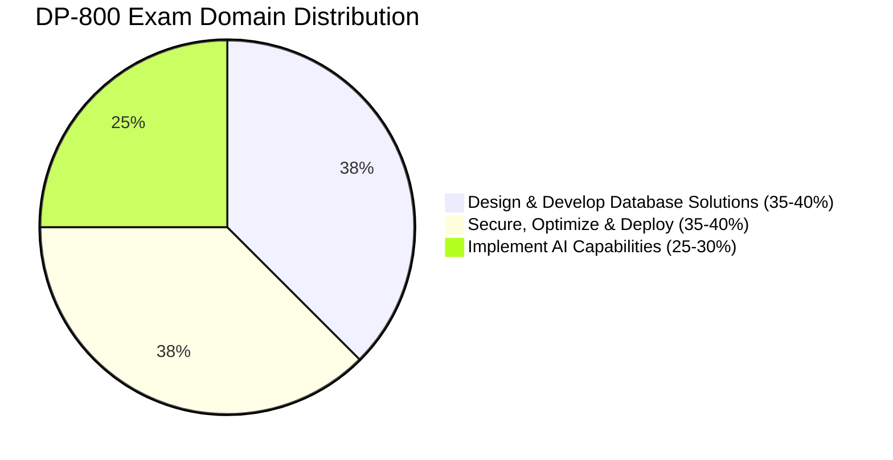

---

## SQL Platform Choices

### Understanding Platform Management Responsibilities

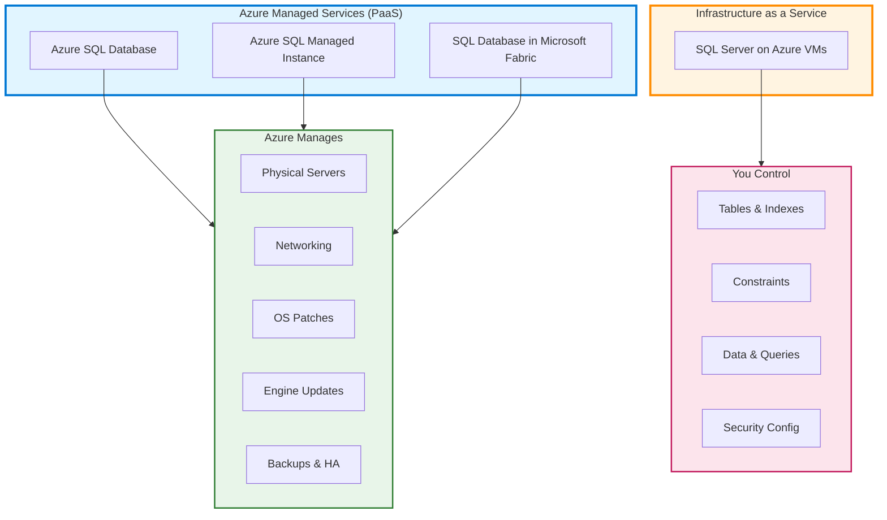

### Platform Comparison Matrix

| Feature | Azure SQL Database | Azure SQL Managed Instance | SQL Server on Azure VMs | SQL Database in Microsoft Fabric |
|---------|-------------------|---------------------------|------------------------|----------------------------------|
| **Management Model** | PaaS | PaaS | IaaS | PaaS |
| **Compatibility** | Latest SQL Engine | ~100% SQL Server EE | Full Control | Azure SQL-based |
| **Max Size** | Hyperscale: Unlimited | 8 TB | Limited by VM | Based on capacity |
| **SLA** | 99.99% | 99.99% | Depends on config | Built-in |
| **VNet Integration** | Limited | Native | Full | Automatic |
| **Analytics Integration** | Separate | Separate | Separate | **Automatic to OneLake** |
| **Best For** | Cloud-native apps | Lift & shift migrations | Full customization | Unified analytics |

### When to Choose Each Platform

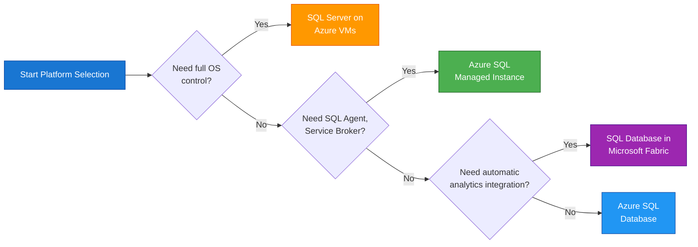

---

## Database Object Design Fundamentals

### Why Database Design Matters

**Key Insight:** Database object design decisions are **far more permanent** than application code. While you can refactor a C# class easily, changing a table from rowstore to columnstore or retrofitting temporal history tracking requires migrations that can lock tables for hours.

### Impact of Design Decisions

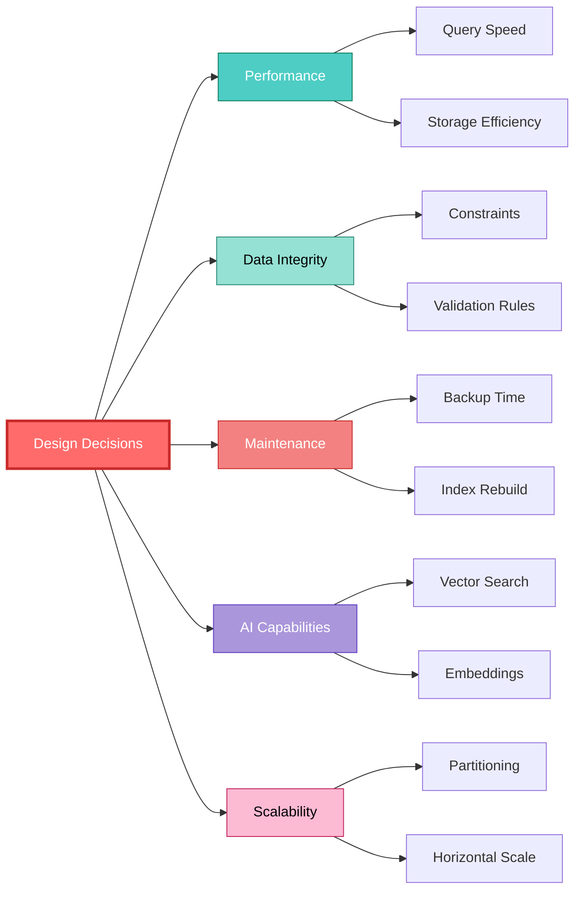

---

## Tables and Data Types

### What are Tables?

Tables are the **fundamental building blocks** of relational databases, organizing data into rows and columns that represent entities and their attributes.

### Choosing Appropriate Data Types

**Why It Matters:** The wrong data type choice can lead to:
- Wasted storage
- Poor performance
- Data loss
- Application errors

**Example:** Using `FLOAT` for financial data instead of `DECIMAL` introduces rounding errors that can't be fixed without recalculating every dependent value.

### Common Data Types Reference

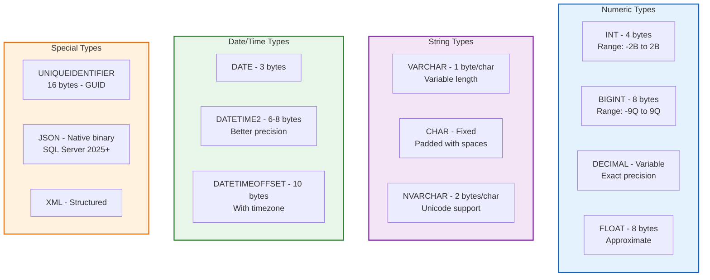

### Practical Example: Well-Designed Product Table

```sql
-- ============================================
-- Product Table Design with Best Practices
-- ============================================
CREATE TABLE Product (
    -- Surrogate primary key: Auto-incrementing, efficient (4 bytes vs 16 for GUID)
    ProductID INT PRIMARY KEY IDENTITY(1,1),
    
    -- Unicode support with appropriate length
    -- NVARCHAR(100) balances flexibility and storage
    ProductName NVARCHAR(100) NOT NULL,
    
    -- Smaller than ProductName as categorization needs less space
    Category NVARCHAR(50) NOT NULL,
    
    -- DECIMAL for exact financial precision (never use FLOAT for money!)
    Price DECIMAL(10,2) NOT NULL,
    
    -- Integer sufficient for inventory counts
    -- DEFAULT prevents NULL and reduces application code
    StockQuantity INT NOT NULL DEFAULT 0,
    
    -- DATETIME2 provides better precision than legacy DATETIME
    -- GETUTCDATE() ensures consistent timezone handling
    LastRestocked DATETIME2 DEFAULT GETUTCDATE()
);

-- ============================================
-- Storage Calculation Example
-- ============================================
-- Row size estimation:
-- ProductID:        4 bytes
-- ProductName:     ~60 bytes (avg 30 chars × 2 bytes for NVARCHAR)
-- Category:        ~40 bytes (avg 20 chars × 2 bytes)
-- Price:            5 bytes
-- StockQuantity:    4 bytes
-- LastRestocked:    8 bytes
-- Row overhead:     7 bytes
-- ---------------------------
-- Total:          ~128 bytes per row
--
-- 1 million rows ≈ 122 MB
-- 10 million rows ≈ 1.2 GB
```

### 💡 Fun Fact: Storage Savings

Using `VARCHAR` instead of `NVARCHAR` for ASCII-only data **cuts string storage in half**! 

**Example:** A `ProductName VARCHAR(100)` uses ~30 bytes vs ~60 bytes for `NVARCHAR(100)` on a 30-character name. On 10 million rows, this saves approximately **300 MB**.

---

## Indexes: Rowstore and Columnstore

### What are Indexes?

Indexes are data structures that **accelerate data retrieval** by creating optimized lookup paths to table rows. Without indexes, the database must perform a full table scan, reading every row.

**Analogy:** An index works like a book's index—instead of reading every page, you consult the index to jump directly to relevant pages.

### Rowstore vs Columnstore Architecture

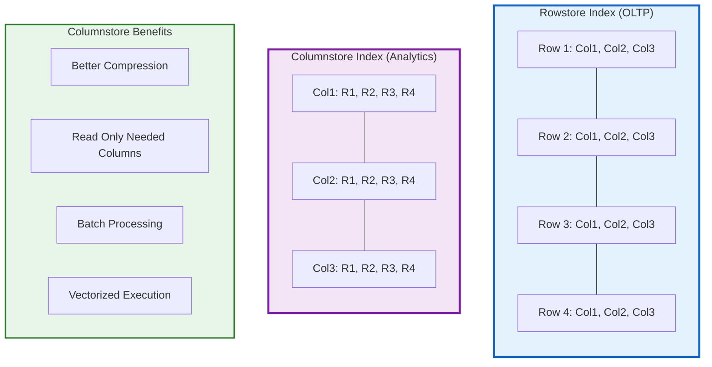

### Rowstore Indexes

#### Clustered Index
- **What:** Sorts and stores data rows based on key values
- **Limitation:** Only ONE per table (data can be stored in only one order)
- **Best For:** Range queries, stable keys, natural sort order

#### Nonclustered Index
- **What:** Separate structure with pointers to data rows
- **Limitation:** Multiple allowed per table
- **Best For:** Fast lookups, joins, covering queries

```sql
-- ============================================
-- Clustered Index Example
-- ============================================
-- Defines physical row order - best for range queries
CREATE CLUSTERED INDEX IX_Product_ProductID 
ON Product(ProductID);

-- ============================================
-- Nonclustered Index with INCLUDE
-- ============================================
-- INCLUDE adds non-key columns to avoid key lookups
CREATE NONCLUSTERED INDEX IX_Product_Category 
ON Product(Category) 
INCLUDE (ProductName, Price);  -- Covering index

-- ============================================
-- When to Use Each
-- ============================================
/*
Clustered Index:
✓ Primary access path
✓ Range queries (BETWEEN, >, <)
✓ ORDER BY on clustered key
✓ Data naturally sorted (dates, identity)

Nonclustered Index:
✓ Alternate access paths
✓ Highly selective predicates
✓ JOIN operations
✓ Covering queries (INCLUDE columns)
*/
```

### Columnstore Indexes

#### Architecture Deep Dive

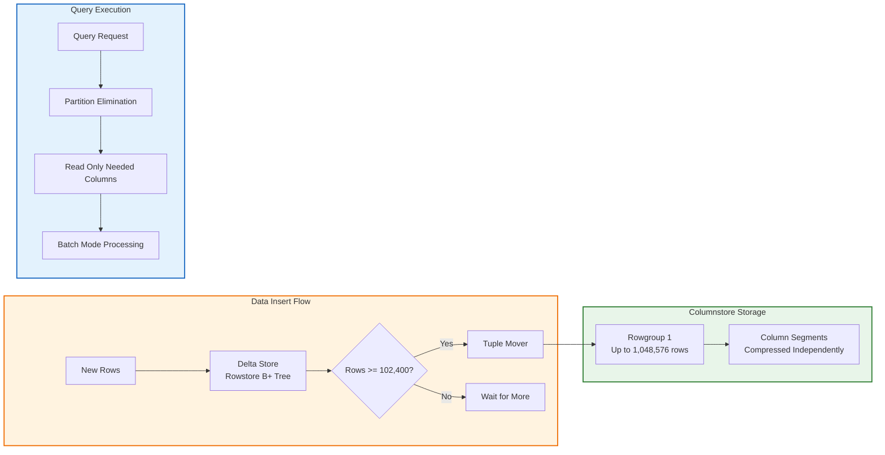

#### Clustered Columnstore Index (CCI)
- **What:** Replaces rowstore entirely; stores ALL data in columnar format
- **Use When:** Analytics is primary workload
- **Trade-off:** No traditional row-level transactional access

#### Nonclustered Columnstore Index (NCCI)
- **What:** Creates columnar copy alongside rowstore table
- **Use When:** Hybrid workload (OLTP + analytics)
- **Benefit:** Query optimizer chooses best structure automatically

```sql
-- ============================================
-- Clustered Columnstore Index (CCI)
-- ============================================
-- Replaces existing clustered rowstore index
-- All data stored in columnar format
CREATE CLUSTERED COLUMNSTORE INDEX CCI_SalesHistory
ON SalesHistory;

-- Rebuild to improve compression
ALTER INDEX CCI_SalesHistory ON SalesHistory REBUILD;

-- ============================================
-- Nonclustered Columnstore Index (NCCI)
-- ============================================
-- Creates columnar copy of selected columns
-- Original rowstore table remains intact
CREATE NONCLUSTERED COLUMNSTORE INDEX NCCI_Product_Analytics
ON Product(Price, StockQuantity, Category, ProductName);

-- ============================================
-- Monitoring Columnstore Health
-- ============================================
-- Check rowgroup statistics and fragmentation
SELECT 
    object_name(object_id) AS TableName,
    state_desc,                    -- OPEN, CLOSED, COMPRESSED
    total_rows,
    deleted_rows,                  -- High = fragmentation
    size_in_bytes / 1024 / 1024 AS SizeMB
FROM sys.dm_db_column_store_row_group_physical_stats
WHERE object_id = OBJECT_ID('SalesHistory')
ORDER BY state_desc;

-- ============================================
-- Columnstore Decision Matrix
-- ============================================
/*
Use Columnstore When:
✓ Data warehouse fact tables (millions+ rows)
✓ Reporting databases (read-heavy)
✓ Historical/archived data
✓ Aggregation queries (SUM, AVG, COUNT)

Avoid Columnstore When:
✗ Small tables (< 1 million rows)
✗ High-frequency updates/deletes
✗ Single-row lookups
✗ OLTP workloads requiring row-level access
*/
```

### 💡 Fun Fact: Compression Ratios

Columnstore indexes typically achieve **10x compression** compared to rowstore! A 100 GB table might compress to just 10 GB with columnstore, dramatically reducing I/O and storage costs.

---

## Specialized Table Types

### Overview of Specialized Tables

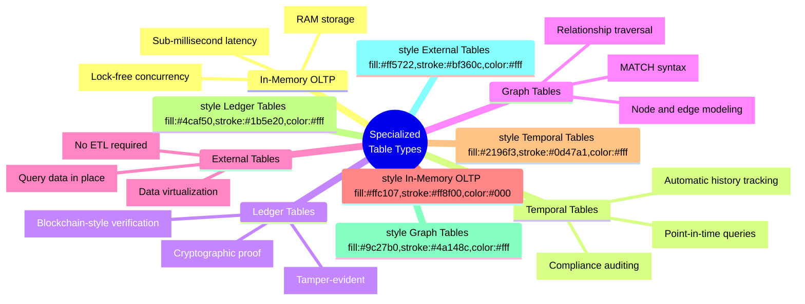

### 1. In-Memory Optimized Tables

**What:** Tables stored entirely in RAM with lock-free, optimistic concurrency

**Why:** Eliminate disk I/O latency for high-throughput scenarios

**When to Use:**
- Session state storage (millions of concurrent sessions)
- Real-time analytics (microsecond latency)
- High-frequency OLTP (10,000+ transactions/second)
- Caching layer (product catalogs, configurations)

```sql
-- ============================================
-- In-Memory Optimized Table Example
-- ============================================
CREATE TABLE dbo.OrderCache (
    OrderID INT PRIMARY KEY NONCLUSTERED,
    CustomerID INT,
    OrderDate DATETIME2,
    Amount DECIMAL(10,2),
    
    -- Index required for in-memory tables
    INDEX IX_CustomerID NONCLUSTERED (CustomerID)
) 
WITH (
    MEMORY_OPTIMIZED = ON,           -- Store in RAM
    DURABILITY = SCHEMA_AND_DATA     -- Persist to transaction log
);

-- ============================================
-- Trade-offs to Consider
-- ============================================
/*
Advantages:
✓ 10-20x faster than disk-based tables
✓ Lock-free concurrency (no blocking)
✓ Sub-millisecond response times

Limitations:
✗ Limited by available RAM
✗ No VARCHAR(MAX), NVARCHAR(MAX), VARBINARY(MAX)
✗ Transaction log still written to disk
✗ Higher cost (RAM vs disk storage)

Real-World Impact:
E-commerce site handling 50,000 concurrent shopping carts
achieved 80% reduction in checkout latency using in-memory tables.
*/
```

### 2. Temporal Tables

**What:** Automatically track complete history of data changes with system-managed versioning

**Why:** Compliance, auditing, troubleshooting, and trend analysis without custom code

**When to Use:**
- Financial records requiring complete change history
- Troubleshooting (account balances at specific times)
- Trend analysis (price changes over quarters)
- Data recovery (reverting accidental updates)

```sql
-- ============================================
-- Temporal Table Creation
-- ============================================
CREATE TABLE Employee (
    EmployeeID INT PRIMARY KEY,
    EmployeeName NVARCHAR(100),
    Department NVARCHAR(50),
    Salary DECIMAL(10,2),
    
    -- System-managed period columns (hidden)
    SysStartTime DATETIME2 GENERATED ALWAYS AS ROW START HIDDEN,
    SysEndTime DATETIME2 GENERATED ALWAYS AS ROW END HIDDEN,
    
    -- Define system-time period
    PERIOD FOR SYSTEM_TIME (SysStartTime, SysEndTime)
) 
WITH (
    SYSTEM_VERSIONING = ON           -- Auto-create history table
    -- Can specify history table name:
    -- (HISTORY_TABLE = dbo.EmployeeHistory)
);

-- ============================================
-- Temporal Table Queries
-- ============================================
-- 1. Current data (normal query)
SELECT * FROM Employee WHERE EmployeeID = 1;

-- 2. Point-in-time query (AS OF)
-- "What was this employee's salary on Jan 1, 2026?"
SELECT * FROM Employee
FOR SYSTEM_TIME AS OF '2026-01-01'
WHERE EmployeeID = 1;

-- 3. Time range query (FROM...TO)
-- "Show all versions between two dates"
SELECT * FROM Employee
FOR SYSTEM_TIME FROM '2025-01-01' TO '2025-12-31'
WHERE EmployeeID = 1;

-- 4. All history (ALL)
-- "Show current and all historical versions"
SELECT * FROM Employee
FOR SYSTEM_TIME ALL
WHERE EmployeeID = 1
ORDER BY SysStartTime;

-- 5. Contained in (CONTAINED IN)
-- "Show versions that existed entirely within period"
SELECT * FROM Employee
FOR SYSTEM_TIME CONTAINED IN ('2025-01-01', '2025-12-31')
WHERE EmployeeID = 1;

-- ============================================
-- Update creates history automatically
-- ============================================
UPDATE Employee 
SET Salary = 75000 
WHERE EmployeeID = 1;
-- Previous version automatically moved to history table!

-- ============================================
-- Trade-offs
-- ============================================
/*
Advantages:
✓ Zero application code changes
✓ Transparent history tracking
✓ Simple point-in-time query syntax
✓ Automatic cleanup of old history

Limitations:
✗ ~2x storage requirements (current + history)
✗ Slight write performance overhead
✗ Cannot drop history table independently
*/
```

### 3. Ledger Tables

**What:** Blockchain-inspired tables with cryptographic verification for tamper-evident records

**Why:** Prove data hasn't been tampered with in regulated industries

**When to Use:**
- Financial transactions (banking, payments)
- Supply chain (product origin, custody)
- Legal records (contracts, agreements)
- Healthcare (prescription records)
- Government (voting records, land registries)

```sql
-- ============================================
-- Updatable Ledger Table
-- ============================================
-- Allows INSERT, UPDATE, DELETE with cryptographic tracking
CREATE TABLE dbo.FinancialTransaction (
    TransactionID INT PRIMARY KEY IDENTITY,
    AccountNumber NVARCHAR(20),
    Amount DECIMAL(15,2),
    TransactionType NVARCHAR(20),
    TransactionDate DATETIME2 DEFAULT GETUTCDATE()
) 
WITH (
    LEDGER = ON                    -- Enable ledger functionality
);

-- ============================================
-- Append-Only Ledger Table
-- ============================================
-- Truly immutable - only INSERT allowed
CREATE TABLE dbo.AuditLog (
    LogID INT PRIMARY KEY IDENTITY,
    EventDescription NVARCHAR(500),
    EventTimestamp DATETIME2 DEFAULT GETUTCDATE()
) 
WITH (
    LEDGER = ON,
    APPEND_ONLY = ON               -- Prevent all updates/deletes
);

-- ============================================
-- Combining Temporal + Ledger
-- ============================================
-- Best of both worlds: history tracking + tamper-proof
CREATE TABLE dbo.Contract (
    ContractID INT PRIMARY KEY IDENTITY,
    ContractNumber NVARCHAR(50),
    Terms NVARCHAR(MAX),
    SignedDate DATETIME2,
    
    SysStartTime DATETIME2 GENERATED ALWAYS AS ROW START HIDDEN,
    SysEndTime DATETIME2 GENERATED ALWAYS AS ROW END HIDDEN,
    PERIOD FOR SYSTEM_TIME (SysStartTime, SysEndTime)
)
WITH (
    LEDGER = ON,
    SYSTEM_VERSIONING = ON
);

-- ============================================
-- Verify Data Integrity
-- ============================================
-- Check if ledger chain is unbroken
EXEC sp_verify_database_ledger;

-- View ledger transactions
SELECT * FROM sys.database_ledger_transactions
ORDER BY commit_time DESC;

-- ============================================
-- Real-World Use Case
-- ============================================
/*
Pharmaceutical Company Scenario:
- Store clinical trial data in append-only ledger
- Independent auditors verify cryptographic proof
- Prove test results weren't altered after submission
- Meet FDA 21 CFR Part 11 compliance requirements
*/
```

### 4. Graph Tables

**What:** Native modeling of nodes (entities) and edges (relationships)

**Why:** Simplify complex relationship queries that require many joins in relational model

**When to Use:**
- Social networks (friends, followers)
- Organizational hierarchies
- Recommendation engines
- Knowledge graphs
- Fraud detection (relationship patterns)

```sql
-- ============================================
-- Graph Table Creation
-- ============================================
-- Node table (entities)
CREATE TABLE Person AS NODE;
CREATE TABLE Company AS NODE;

-- Edge table (relationships)
CREATE TABLE WorksFor AS EDGE;
CREATE TABLE Knows AS EDGE;

-- ============================================
-- Insert Data
-- ============================================
-- Insert nodes
INSERT INTO Person VALUES 
    (1, 'Alice', 'Engineer'),
    (2, 'Bob', 'Manager'),
    (3, 'Charlie', 'Analyst');

INSERT INTO Company VALUES 
    (1, 'Contoso'),
    (2, 'Fabrikam');

-- Insert edges (relationships)
INSERT INTO WorksFor VALUES 
    (1, 1),   -- Alice works for Contoso
    (2, 1),   -- Bob works for Contoso
    (3, 2);   -- Charlie works for Fabrikam

INSERT INTO Knows VALUES 
    (1, 2),   -- Alice knows Bob
    (2, 3);   -- Bob knows Charlie

-- ============================================
-- Graph Queries with MATCH
-- ============================================
-- 1. Simple relationship query
-- "Find who works for Contoso"
SELECT Person.Name, Company.Name AS CompanyName
FROM Person, WorksFor, Company
WHERE MATCH(Person-(WorksFor)->Company)
AND Company.Name = 'Contoso';

-- 2. Multi-hop query
-- "Find friends of friends"
SELECT P1.Name AS Person, P3.Name AS FriendOfFriend
FROM Person P1, Knows K1, Person P2, Knows K2, Person P3
WHERE MATCH(P1-(Knows)->P2-(Knows)->P3)
AND P1.Name = 'Alice';

-- 3. Shortest path
-- "Find connection path between two people"
SELECT P1.Name, P2.Name, STRING_AGG(P.Name, ' -> ') WITHIN GROUP (GRAPH PATH) AS Path
FROM Person P1, Person P2, Person FOR PATH P, Knows FOR PATH K
WHERE MATCH(SHORTEST_PATH(P1(-(Knows)->P)+))
AND P1.Name = 'Alice'
AND P2.Name = 'Charlie';

-- ============================================
-- When NOT to Use Graph Tables
-- ============================================
/*
Avoid Graph Tables For:
✗ Simple parent-child relationships (use FK)
✗ Primarily transactional data
✗ Highly structured, stable schemas
✗ Single-table lookups

Best For:
✓ Multi-degree relationship traversal
✓ Pattern matching in connections
✓ Evolving relationship schemas
✓ Network analysis
*/
```

### 5. External Tables

**What:** Query data where it lives (data lakes, blob storage) without moving it

**Why:** Data virtualization saves storage costs and ETL complexity

**When to Use:**
- Data lake integration (Parquet/CSV in Azure Data Lake)
- Data exploration before importing
- Cost optimization (avoid duplication)
- Federated queries (join DB tables with external files)

```sql
-- ============================================
-- External Table Setup
-- ============================================
-- 1. Create database scoped credential
CREATE DATABASE SCOPED CREDENTIAL AzureStorageCredential
WITH IDENTITY = 'SHARED ACCESS SIGNATURE',
SECRET = '?sv=2021-06-08&ss=...';  -- Your SAS token

-- 2. Create external data source
CREATE EXTERNAL DATA SOURCE DataLakeSource
WITH (
    TYPE = HADOOP,
    LOCATION = 'wasbs://container@account.blob.core.windows.net',
    CREDENTIAL = AzureStorageCredential
);

-- 3. Create file format
CREATE EXTERNAL FILE FORMAT ParquetFormat
WITH (
    FORMAT_TYPE = PARQUET,
    DATA_COMPRESSION = 'org.apache.hadoop.io.compress.SnappyCodec'
);

-- 4. Create external table
CREATE EXTERNAL TABLE dbo.ExternalSalesData (
    OrderID INT,
    CustomerID INT,
    OrderAmount DECIMAL(10,2),
    OrderDate DATE,
    Region NVARCHAR(50)
)
WITH (
    LOCATION = '/raw/sales/',          -- Folder path
    DATA_SOURCE = DataLakeSource,
    FILE_FORMAT = ParquetFormat
);

-- ============================================
-- Query External Data
-- ============================================
-- Join internal and external tables
SELECT 
    c.CustomerName,
    e.OrderAmount,
    e.OrderDate
FROM Customer c
INNER JOIN dbo.ExternalSalesData e 
    ON c.CustomerID = e.CustomerID
WHERE e.OrderDate >= '2025-01-01';

-- ============================================
-- Trade-offs
-- ============================================
/*
Advantages:
✓ No data movement or duplication
✓ Query data in place
✓ Cost savings on storage
✓ Faster time-to-insight

Limitations:
✗ Slower than native tables (network latency)
✗ Read-only (can't UPDATE/DELETE)
✗ Limited indexing
✗ File parsing overhead
*/
```

### 💡 Fun Fact: Temporal + Ledger Combo

You can combine temporal tables with ledger tables to get **both** point-in-time queries **and** cryptographic tamper-proofing! This is perfect for financial systems requiring both audit trails and regulatory compliance.

---

## Data Integrity with Constraints

### Why Constraints Matter

**Critical Insight:** Application code can validate data, but users can bypass it through:
- Bulk imports
- Direct queries
- New applications that skip validation
- Ad-hoc scripts

**Solution:** Database constraints enforce rules at the **engine level**, so they **always apply** regardless of how data enters the system.

### Constraint Types Overview

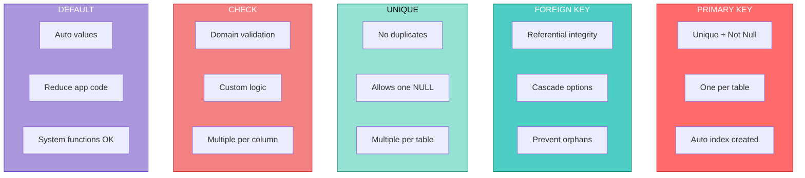

### Comprehensive Constraint Examples

```sql
-- ============================================
-- 1. PRIMARY KEY Constraint
-- ============================================
-- Guarantees unique data and entity integrity
-- Automatically creates unique index
CREATE TABLE Customer (
    CustomerID INT PRIMARY KEY IDENTITY(1,1),  -- Surrogate key
    EmailAddress NVARCHAR(100) NOT NULL
    -- Can also define at table level:
    -- CONSTRAINT PK_Customer PRIMARY KEY (CustomerID)
);

-- ============================================
-- 2. FOREIGN KEY Constraint
-- ============================================
-- Enforces referential integrity
CREATE TABLE [Order] (
    OrderID INT PRIMARY KEY IDENTITY,
    CustomerID INT NOT NULL,
    OrderDate DATETIME2,
    TotalAmount DECIMAL(10,2),
    
    -- Foreign key with cascading options
    CONSTRAINT FK_Order_Customer
        FOREIGN KEY (CustomerID) 
        REFERENCES Customer(CustomerID)
        ON DELETE CASCADE          -- Delete orders when customer deleted
        ON UPDATE NO ACTION        -- Prevent customer ID changes
    -- Other options:
    -- ON DELETE SET NULL          -- Set to NULL when parent deleted
    -- ON DELETE SET DEFAULT       -- Set to default value
);

-- ============================================
-- 3. UNIQUE Constraint
-- ============================================
-- Prevents duplicate values (allows one NULL)
CREATE TABLE Product (
    ProductID INT PRIMARY KEY,
    SKU NVARCHAR(50) UNIQUE,       -- No duplicate SKUs
    ProductName NVARCHAR(100),
    Email NVARCHAR(100),
    
    -- Named constraint (best practice)
    CONSTRAINT UQ_Product_Email UNIQUE (Email)
);

-- ============================================
-- 4. CHECK Constraint
-- ============================================
-- Enforces domain integrity with custom logic
CREATE TABLE Employee (
    EmployeeID INT PRIMARY KEY,
    HireDate DATE,
    Salary DECIMAL(10,2),
    Age INT,
    Department NVARCHAR(50),
    
    -- Single column check
    CONSTRAINT CK_Employee_Salary 
        CHECK (Salary >= 20000),   -- Minimum salary
    
    -- Date validation
    CONSTRAINT CK_Employee_HireDate 
        CHECK (HireDate <= GETDATE()),  -- Can't be future
    
    -- Age range
    CONSTRAINT CK_Employee_Age 
        CHECK (Age >= 18 AND Age <= 70),
    
    -- Multiple columns
    CONSTRAINT CK_Employee_Department
        CHECK (Department IN ('HR', 'IT', 'Sales', 'Marketing')),
    
    -- Complex logic
    CONSTRAINT CK_Employee_Compensation
        CHECK (
            (Department = 'IT' AND Salary >= 50000) OR
            (Department != 'IT' AND Salary >= 20000)
        )
);

-- ============================================
-- 5. DEFAULT Constraint
-- ============================================
-- Provides automatic values
CREATE TABLE Activity (
    ActivityID INT PRIMARY KEY IDENTITY,
    Description NVARCHAR(200),
    
    -- Named default constraint (best practice)
    CreatedDate DATETIME2 
        CONSTRAINT DF_Activity_CreatedDate 
        DEFAULT GETUTCDATE(),      -- Auto timestamp
    
    IsActive BIT 
        CONSTRAINT DF_Activity_IsActive 
        DEFAULT 1,                 -- Active by default
    
    Status NVARCHAR(20) 
        CONSTRAINT DF_Activity_Status 
        DEFAULT 'Pending',         -- Default status
    
    Priority INT 
        CONSTRAINT DF_Activity_Priority 
        DEFAULT 5                  -- Medium priority
);

-- ============================================
-- Real-World Constraint Scenario
-- ============================================
/*
E-Commerce Problem:
A retail company didn't define UNIQUE constraint on customer email.
Result: Same customers registered multiple times with identical emails.
Marketing sent 3 copies of same email → increased costs, damaged trust.

Solution:
ALTER TABLE Customer ADD CONSTRAINT UQ_Customer_Email UNIQUE (EmailAddress);

Prevention: Define constraints during design, not after problems occur!
*/

-- ============================================
-- Constraint Best Practices
-- ============================================
/*
✓ Always name constraints explicitly (don't rely on system names)
✓ Use CHECK constraints for business rules
✓ Implement FOREIGN KEYs to prevent orphaned records
✓ Add UNIQUE constraints to natural keys (email, SKU)
✓ Use DEFAULT to reduce application code complexity
✓ Document constraint purposes in comments

✗ Avoid: Over-constraining (performance impact)
✗ Avoid: Complex CHECK logic (use triggers instead)
✗ Avoid: System-generated names (hard to manage across environments)
*/
```

---

## Sequence Objects

### What are Sequences?

A **sequence object** is a user-defined schema-bound object that generates a sequence of numeric values according to specification. Unlike IDENTITY columns, sequences **aren't associated with specific tables**.

### Sequence vs IDENTITY

```mermaid
comparison
    title "SEQUENCE vs IDENTITY Comparison"
    
    SEQUENCE
        "Not tied to table"
        "Shared across tables"
        "Get value BEFORE insert"
        "Custom min/max/cycle"
        "Retrieve multiple at once"
        "Can change increment"
        "Sort by another field"
    
    IDENTITY
        "Tied to specific table"
        "Table-only numbering"
        "Get value DURING insert"
        "Limited customization"
        "One at a time"
        "Fixed increment"
        "Insert order only"
    
    style SEQUENCE fill:#e8f5e9,stroke:#2e7d32,stroke-width:3px
    style IDENTITY fill:#ffebee,stroke:#c62828,stroke-width:3px
```

### When to Use Sequences

Use sequences instead of IDENTITY when you need:

1. **Shared number series** across multiple tables
2. **Cycling numbers** (restart after reaching max)
3. **Pre-insert values** (get number before INSERT)
4. **Batch reservations** (get multiple numbers at once)
5. **Changeable specifications** (modify increment after creation)
6. **Sorted sequences** (order by different field)

### Practical Sequence Examples

```sql
-- ============================================
-- Basic Sequence Creation
-- ============================================
CREATE SEQUENCE OrderNumber 
    START WITH 1000              -- First value
    INCREMENT BY 1               -- Increment
    MINVALUE 1000                -- Minimum value
    MAXVALUE 999999              -- Maximum value
    NO CYCLE;                    -- Don't restart (or use CYCLE)

-- ============================================
-- Using Sequence in INSERT
-- ============================================
-- Method 1: Inline during INSERT
INSERT INTO [Order] (OrderID, CustomerID, OrderNumber, OrderDate)
VALUES (
    1, 
    100, 
    NEXT VALUE FOR OrderNumber,  -- Get next sequence value
    GETDATE()
);

-- Method 2: Get value BEFORE INSERT
DECLARE @NextOrderNum INT = NEXT VALUE FOR OrderNumber;
SELECT @NextOrderNum AS NextOrderNumber;

INSERT INTO [Order] (OrderID, CustomerID, OrderNumber, OrderDate)
VALUES (1, 100, @NextOrderNum, GETDATE());

-- ============================================
-- Shared Sequence Across Tables
-- ============================================
-- One sequence for multiple tables
CREATE SEQUENCE GlobalID 
    START WITH 1
    INCREMENT BY 1;

-- Use in Customer table
INSERT INTO Customer (CustomerID, Name)
VALUES (NEXT VALUE FOR GlobalID, 'Alice');

-- Use in Product table
INSERT INTO Product (ProductID, Name)
VALUES (NEXT VALUE FOR GlobalID, 'Widget');

-- Both share the same number series!

-- ============================================
-- Reserve Multiple Numbers (Batch Processing)
-- ============================================
DECLARE @FirstSeq INT, @LastSeq INT;

-- Reserve 100 sequential numbers at once
EXEC sp_sequence_get_range 
    @sequence_name = N'OrderNumber',
    @range_size = 100,
    @range_first_value = @FirstSeq OUTPUT,
    @range_last_value = @LastSeq OUTPUT;

SELECT @FirstSeq AS FirstValue, @LastSeq AS LastValue;
-- Result: FirstValue=1000, LastValue=1099

-- Use for batch insert without gaps
INSERT INTO OrderDetail (OrderLineID, OrderID, ProductID)
SELECT 
    seq.Number,
    1,
    ProductID
FROM Products p
CROSS JOIN (
    SELECT TOP (100) ROW_NUMBER() OVER (ORDER BY (SELECT NULL)) + @FirstSeq - 1 AS Number
    FROM sys.objects
) seq;

-- ============================================
-- Cycling Sequence
-- ============================================
-- Restart after reaching maximum
CREATE SEQUENCE MonthlyCounter
    START WITH 1
    INCREMENT BY 1
    MINVALUE 1
    MAXVALUE 9999
    CYCLE;                       -- Restart from 1 after 9999

-- ============================================
-- Sorted Sequence (ORDER BY)
-- ============================================
-- Generate sequence values in specific order
SELECT 
    CustomerID,
    CustomerName,
    NEXT VALUE FOR OrderNumber OVER (ORDER BY CustomerName) AS SortedSeq
FROM Customer
ORDER BY CustomerName;

-- ============================================
-- Reset/Alter Sequence
-- ============================================
-- Restart sequence from specific value
ALTER SEQUENCE OrderNumber RESTART WITH 1000;

-- Change increment value
ALTER SEQUENCE OrderNumber INCREMENT BY 10;

-- Change maximum value
ALTER SEQUENCE OrderNumber MAXVALUE 9999999;

-- ============================================
-- Real-World Use Case: Invoice Numbering
-- ============================================
/*
Scenario: Multi-tenant SaaS application
Requirement: Each tenant needs sequential invoice numbers
             starting from 1, but globally unique

Solution:
CREATE SEQUENCE Tenant1_Invoices START WITH 1 INCREMENT BY 1;
CREATE SEQUENCE Tenant2_Invoices START WITH 1 INCREMENT BY 1;

-- Or use single sequence with tenant prefix:
CREATE SEQUENCE GlobalInvoice START WITH 1 INCREMENT BY 1;

INSERT INTO Invoice (InvoiceNumber, TenantID)
VALUES (
    'TNT-' + CAST(NEXT VALUE FOR GlobalInvoice AS NVARCHAR),
    @TenantID
);
*/

-- ============================================
-- Sequence Limitations
-- ============================================
/*
⚠️ Important Notes:

1. Uniqueness NOT automatic
   - Must create UNIQUE constraint on column
   - Sequence just generates numbers, doesn't enforce uniqueness

2. Values consumed even on rollback
   - Sequence values generated outside transaction scope
   - If transaction rolls back, sequence number is lost
   - Creates gaps in numbering (acceptable for most scenarios)

3. No automatic protection
   - Unlike IDENTITY, sequence values can be updated
   - Must implement constraints to prevent changes

Example of gap creation:
BEGIN TRANSACTION
    DECLARE @Seq INT = NEXT VALUE FOR OrderNumber;  -- Gets 1000
    INSERT INTO [Order] VALUES (@Seq, ...);
ROLLBACK TRANSACTION
-- Sequence is now at 1001, but no order with 1000 exists!
*/
```

### 💡 Fun Fact: Sequence Performance

Sequences can generate numbers **10x faster** than IDENTITY columns in high-concurrency scenarios because they don't require table locks. SQL Server caches sequence values in memory for ultra-fast retrieval.

---

## JSON Columns and Indexes

### What are JSON Columns?

JSON columns let you store and query **semi-structured data** using familiar SQL syntax. SQL Server 2025 introduces a **native `JSON` data type** that stores documents in binary format optimized for querying.

### Why Use JSON?

**Traditional Relational Problem:** Every row must have the same columns. But what if:
- Product attributes vary by category (shirts need size/color, laptops need CPU/RAM)
- User preferences change as you add features
- API responses have nested structures that change

**JSON Solution:** Store variable parts as JSON while keeping predictable parts in regular columns.

### JSON Data Type Evolution

```mermaid
timeline
    title JSON Support in SQL Server
    
    section SQL Server 2016+
        NVARCHAR(MAX)<br/>Store JSON as text
        : JSON functions:<br/>JSON_VALUE, JSON_QUERY<br/>JSON_MODIFY, OPENJSON
    
    section SQL Server 2025
        Native JSON type<br/>Binary storage
        : Better performance<br/>Native validation<br/>JSON indexes<br/>JSON_CONTAINS function
    
    style section fill:#1976d2,stroke:#0d47a1,color:#fff
```

### When to Use JSON Columns

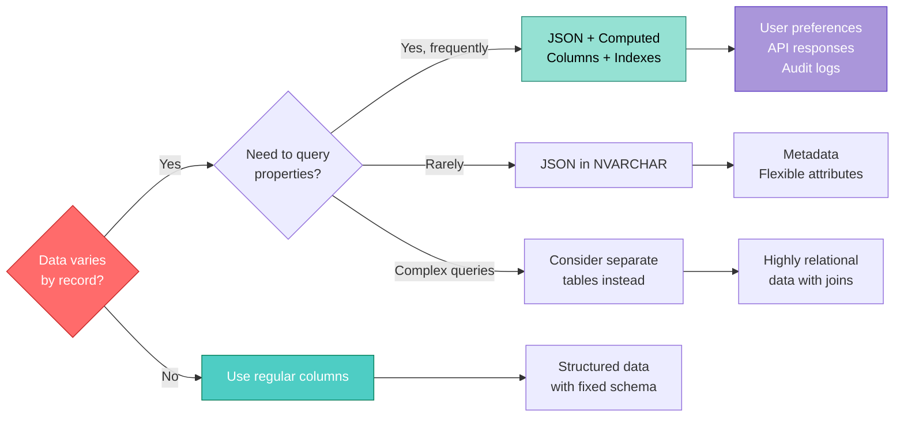

### JSON Implementation Examples

```sql
-- ============================================
-- Native JSON Type (SQL Server 2025+)
-- ============================================
CREATE TABLE ConfigurationData (
    ConfigID INT PRIMARY KEY,
    
    -- Native JSON type (binary format)
    ConfigSettings JSON NOT NULL,
    
    -- Alternative for older versions:
    -- ConfigSettings NVARCHAR(MAX) NOT NULL
);

-- ============================================
-- Insert JSON Documents
-- ============================================
INSERT INTO ConfigurationData (ConfigID, ConfigSettings) 
VALUES (
    1, 
    '{"theme":"dark","language":"en","notifications":true}'
);

INSERT INTO ConfigurationData (ConfigID, ConfigSettings) 
VALUES (
    2, 
    '{"theme":"light","language":"fr","notifications":false}'
);

-- ============================================
-- Query JSON Properties
-- ============================================
-- Extract scalar values (strings, numbers, booleans)
SELECT 
    ConfigID,
    JSON_VALUE(ConfigSettings, '$.theme') AS Theme,
    JSON_VALUE(ConfigSettings, '$.language') AS Language,
    JSON_VALUE(ConfigSettings, '$.notifications') AS Notifications
FROM ConfigurationData;

-- Extract objects or arrays
SELECT 
    ConfigID,
    JSON_QUERY(ConfigSettings, '$') AS FullConfig,
    JSON_QUERY(ConfigSettings, '$.advanced') AS AdvancedSettings
FROM ConfigurationData;

-- ============================================
-- Update JSON Values
-- ============================================
-- Method 1: Using .modify() (SQL Server 2025+ preview)
UPDATE ConfigurationData
SET ConfigSettings.modify('$.theme', 'light')
WHERE ConfigID = 1;

-- Method 2: Using JSON_MODIFY (works with both JSON and NVARCHAR)
UPDATE ConfigurationData
SET ConfigSettings = JSON_MODIFY(
    CAST(ConfigSettings AS NVARCHAR(MAX)),  -- Cast if native JSON
    '$.notifications',
    CAST(0 AS BIT)                          -- New value
)
WHERE ConfigID = 1;

-- Add new property
UPDATE ConfigurationData
SET ConfigSettings = JSON_MODIFY(
    ConfigSettings,
    '$.fontSize',
    14
)
WHERE ConfigID = 1;

-- Delete property
UPDATE ConfigurationData
SET ConfigSettings = JSON_MODIFY(
    ConfigSettings,
    '$.theme',
    NULL                                    -- NULL removes property
)
WHERE ConfigID = 1;

-- ============================================
-- Indexing JSON Properties
-- ============================================
-- JSON columns can't be indexed directly
-- Solution: Create computed column + index

-- Add computed column
ALTER TABLE ConfigurationData
ADD ThemeValue AS JSON_VALUE(ConfigSettings, '$.theme');

-- Create index on computed column
CREATE INDEX IX_Configuration_Theme 
ON ConfigurationData(ThemeValue);

-- Now queries on theme are fast!
SELECT * FROM ConfigurationData
WHERE JSON_VALUE(ConfigSettings, '$.theme') = 'dark';

-- ============================================
-- Complex JSON with Nested Objects
-- ============================================
CREATE TABLE ProductMetadata (
    ProductID INT PRIMARY KEY,
    AdditionalAttributes JSON NOT NULL,
    
    -- Validate required properties exist
    CONSTRAINT CK_ProductMetadata_RequiredFields
        CHECK (JSON_PATH_EXISTS(AdditionalAttributes, '$.weight') = 1)
);

-- Insert nested JSON
INSERT INTO ProductMetadata (ProductID, AdditionalAttributes) 
VALUES (
    1, 
    '{
        "dimensions": {
            "length": 10,
            "width": 5,
            "height": 8
        },
        "weight": 2.5,
        "color": "blue",
        "tags": ["electronics", "wireless", "portable"]
    }'
);

-- Query nested properties
SELECT 
    ProductID,
    JSON_VALUE(AdditionalAttributes, '$.weight') AS Weight,
    JSON_VALUE(AdditionalAttributes, '$.dimensions.length') AS Length,
    JSON_VALUE(AdditionalAttributes, '$.dimensions.width') AS Width,
    JSON_QUERY(AdditionalAttributes, '$.tags') AS Tags
FROM ProductMetadata;

-- ============================================
-- JSON Array Functions (SQL Server 2025+)
-- ============================================
-- JSON_ARRAY: Create array from values
SELECT JSON_ARRAY('apple', 'banana', 'cherry') AS FruitArray;
-- Result: ["apple","banana","cherry"]

-- JSON_OBJECT: Create object from key-value pairs
SELECT JSON_OBJECT('name': 'Alice', 'age': 30) AS PersonObject;
-- Result: {"name":"Alice","age":30}

-- JSON_ARRAYAGG: Aggregate rows into array
SELECT 
    CategoryID,
    JSON_ARRAYAGG(ProductName) AS ProductsInCategory
FROM Product
GROUP BY CategoryID;

-- JSON_CONTAINS: Check if array contains value (SQL Server 2025+)
SELECT * FROM ProductMetadata
WHERE JSON_CONTAINS(
    AdditionalAttributes,
    '"electronics"',
    '$.tags'
) = 1;

-- ============================================
-- OPENJSON: Parse JSON to Relational
-- ============================================
DECLARE @JsonData NVARCHAR(MAX) = N'
[
    {"ProductID": 1, "ProductName": "Mouse", "Price": 29.99},
    {"ProductID": 2, "ProductName": "Keyboard", "Price": 79.99}
]';

-- Convert JSON array to table
SELECT *
FROM OPENJSON(@JsonData, '$')
WITH (
    ProductID INT '$.ProductID',
    ProductName NVARCHAR(100) '$.ProductName',
    Price DECIMAL(10,2) '$.Price'
);

-- ============================================
-- FOR JSON: Convert Relational to JSON
-- ============================================
-- AUTO: Automatic JSON structure
SELECT ProductID, ProductName, Price
FROM Product
FOR JSON AUTO;

-- PATH: Explicit control over structure
SELECT 
    ProductID,
    ProductName,
    Price,
    CategoryID
FROM Product
FOR JSON PATH, ROOT('Products');

-- INCLUDE_NULLS: Include NULL values
SELECT ProductID, ProductName, Description
FROM Product
FOR JSON PATH, INCLUDE_NULLS;

-- ============================================
-- JSON Design Best Practices
-- ============================================
/*
✓ DO:
  - Use JSON for semi-structured, variable data
  - Keep predictable data in regular columns
  - Index frequently queried JSON properties
  - Validate required fields with CHECK constraints
  - Use native JSON type (SQL Server 2025+) when available

✗ DON'T:
  - Store entire relational models in JSON
  - Use JSON for data with consistent schemas
  - Query JSON properties without indexes (performance!)
  - Store large JSON documents (> 2 MB)
  - Use JSON for data requiring complex joins

Real-World Example:
E-commerce product catalog:
- Regular columns: ProductID, ProductName, BasePrice, CategoryID
- JSON column: AdditionalAttributes (varies by product type)
  - Laptop: CPU, RAM, Storage, ScreenSize
  - Shirt: Size, Color, Material, Fit
  - Book: Author, ISBN, Pages, Publisher
*/
```

### 💡 Fun Fact: JSON Performance

The native JSON data type in SQL Server 2025 provides **3-5x faster reads** compared to NVARCHAR(MAX) because the document is already parsed and stored in binary format. No need to parse text on every query!

---

## Table Partitioning Strategies

### What is Table Partitioning?

Table partitioning divides large tables into **smaller, manageable pieces** (partitions) while keeping them as a **single logical table**. Your application sees one table, but the database manages multiple physical segments.

### Partitioning Architecture

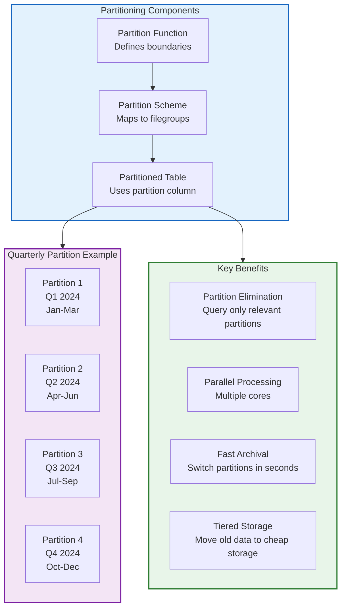

### When to Use Partitioning

```mermaid
decision
    title "Should You Partition?"
    
    "Queries filter on specific<br/>column 80%+ of time?"
    
    Yes1
        "Regular archival<br/>needed?"
    
    No1
        [Don't Partition<br/>Adds complexity<br/>without benefit]
    
    Yes1 --> Yes2
        "Large table<br/>> 10 GB?"
    
    Yes2 --> Yes3
        [Partition!<br/>Performance<br/>+ Maintenance<br/>benefits]
    
    No1 --> No2
        "Need to rebuild<br/>indexes on<br/>recent data only?"
    
    No2 --> No3
        [Don't Partition]
    
    style Yes3 fill:#4caf50,stroke:#1b5e20,color:#fff
    style No1 fill:#f44336,stroke:#b71c1c,color:#fff
    style No3 fill:#f44336,stroke:#b71c1c,color:#fff
```

### Partitioning Implementation

```sql
-- ============================================
-- Step 1: Create Partition Function
-- ============================================
-- Defines HOW data is divided (boundaries)
-- RANGE RIGHT: Boundary value goes to right partition

CREATE PARTITION FUNCTION PF_OrderDate (DATETIME2)
AS RANGE RIGHT FOR VALUES 
(
    '2024-01-01',   -- Partition 1: < 2024-01-01
    '2024-04-01',   -- Partition 2: Jan-Mar 2024
    '2024-07-01',   -- Partition 3: Apr-Jun 2024
    '2024-10-01'    -- Partition 4: Jul-Sep 2024
                    -- Partition 5: >= Oct 2024
);

-- RANGE LEFT alternative: Boundary value goes to left partition
CREATE PARTITION FUNCTION PF_InvoiceNumber (INT)
AS RANGE LEFT FOR VALUES 
(
    100000,   -- Partition 1: <= 100000
    200000,   -- Partition 2: 100001-200000
    300000,   -- Partition 3: 200001-300000
    400000    -- Partition 4: 300001-400000
              -- Partition 5: > 400000
);

-- ============================================
-- Step 2: Create Partition Scheme
-- ============================================
-- Maps partitions to filegroups
-- In Azure SQL Database: All partitions go to PRIMARY

CREATE PARTITION SCHEME PS_OrderDate
AS PARTITION PF_OrderDate 
ALL TO ([PRIMARY]);  -- All partitions on PRIMARY filegroup

-- For on-premises with multiple filegroups:
-- CREATE PARTITION SCHEME PS_OrderDate
-- AS PARTITION PF_OrderDate
-- TO (FG_2023, FG_Q1_2024, FG_Q2_2024, FG_Q3_2024, FG_Q4_2024);

-- ============================================
-- Step 3: Create Partitioned Table
-- ============================================
-- IMPORTANT: Partition column MUST be in primary key
-- for clustered index alignment

CREATE TABLE [Order] (
    OrderID BIGINT IDENTITY(1,1),
    OrderDate DATE NOT NULL,           -- Partition column
    CustomerName NVARCHAR(100) NOT NULL,
    TotalAmount DECIMAL(12,2) NOT NULL,
    OrderStatus NVARCHAR(20) DEFAULT 'Pending',
    
    CONSTRAINT PK_Order 
        PRIMARY KEY (OrderID, OrderDate)  -- Include partition column!
) 
ON PS_OrderDate(OrderDate);             -- Apply partition scheme

-- ============================================
-- Step 4: Create Partitioned Index
-- ============================================
-- Aligned index: Uses same partition scheme as table
-- Enables partition switching and independent maintenance

CREATE NONCLUSTERED INDEX IX_Order_Customer
ON [Order](CustomerName)
ON PS_OrderDate(OrderDate);             -- Align with table

-- Create partitioned columnstore index
CREATE NONCLUSTERED COLUMNSTORE INDEX IX_Order_Analytics
ON [Order](TotalAmount, OrderStatus, CustomerName)
ON PS_OrderDate(OrderDate);

-- ============================================
-- Insert Sample Data
-- ============================================
INSERT INTO [Order] (OrderDate, CustomerName, TotalAmount, OrderStatus) 
VALUES
    ('2024-01-15', 'John Smith', 299.97, 'Delivered'),    -- Partition 2
    ('2024-02-20', 'Jane Doe', 149.99, 'Shipped'),        -- Partition 2
    ('2024-06-10', 'Bob Johnson', 449.95, 'Processing'),  -- Partition 3
    ('2024-10-05', 'Alice Brown', 199.99, 'Pending');     -- Partition 4

-- ============================================
-- Query Partition Information
-- ============================================
-- View partition distribution
SELECT 
    $PARTITION.PF_OrderDate(OrderDate) AS PartitionNumber,
    MIN(OrderDate) AS MinDate,
    MAX(OrderDate) AS MaxDate,
    COUNT(*) AS RowCount
FROM [Order]
GROUP BY $PARTITION.PF_OrderDate(OrderDate)
ORDER BY PartitionNumber;

-- Result:
-- PartitionNumber | MinDate    | MaxDate    | RowCount
-- 2               | 2024-01-15 | 2024-02-20 | 2
-- 3               | 2024-06-10 | 2024-06-10 | 1
-- 4               | 2024-10-05 | 2024-10-05 | 1

-- ============================================
-- Partition Elimination in Action
-- ============================================
-- Query automatically accesses only relevant partition!

-- This query only scans Partition 2 (Q1 2024)
SELECT * FROM [Order]
WHERE OrderDate BETWEEN '2024-01-01' AND '2024-03-31';

-- Check execution plan for partition elimination
SET STATISTICS IO ON;
SELECT COUNT(*) FROM [Order]
WHERE OrderDate >= '2024-10-01';
-- Only reads Partition 4, not entire table!

-- ============================================
-- Add New Partition (Split)
-- ============================================
-- Add boundary for next quarter
ALTER PARTITION FUNCTION PF_OrderDate()
SPLIT RANGE ('2025-01-01');

-- Now you have a new partition for Q4 2024
-- Existing data automatically redistributed

-- ============================================
-- Archive Old Partition (Merge)
-- ============================================
-- Remove boundary to merge partitions
ALTER PARTITION FUNCTION PF_OrderDate()
MERGE RANGE ('2023-12-31');

-- Partitions before and after boundary merge into one
-- Data remains, just reorganized

-- ============================================
-- Partition Switching (Ultra-Fast Archival)
-- ============================================
-- Create archive table with same structure
CREATE TABLE [Order_Archive] (
    OrderID BIGINT,
    OrderDate DATE,
    CustomerName NVARCHAR(100),
    TotalAmount DECIMAL(12,2),
    OrderStatus NVARCHAR(20)
) 
ON PS_OrderDate(OrderDate);  -- Must use same partition scheme

-- Switch entire partition to archive (metadata operation!)
ALTER TABLE [Order] 
SWITCH PARTITION 2              -- Source partition
TO [Order_Archive] PARTITION 2; -- Target partition

-- Result: 
-- ✓ Instant operation (seconds, not hours)
-- ✓ No locks on remaining partitions
-- ✓ Zero data movement (metadata only)

-- ============================================
-- Partitioning Best Practices
-- ============================================
/*
✓ DO:
  - Choose partition key that appears in WHERE clause 80%+ of time
  - Use RANGE RIGHT for datetime columns
  - Include partition column in primary key
  - Align indexes with table partition scheme
  - Target millions of rows per partition (not thousands)
  - Automate partition management (add/split before boundaries)
  - Monitor partition distribution for balance

✗ DON'T:
  - Over-partition (too many partitions = overhead)
  - Partition on updateable columns
  - Choose partition key with uneven distribution
  - Ignore partition alignment for indexes
  - Forget to add new partitions before data arrives

Partition Count Guidelines:
- Small tables (< 1M rows): Don't partition
- Medium tables (1M-10M): 10-50 partitions
- Large tables (10M-100M): 50-200 partitions
- Very large tables (100M+): 200-1000 partitions
- Maximum: 15,000 partitions (SQL Server limit)
*/

-- ============================================
-- Real-World Impact Example
-- ============================================
/*
Financial Services Company Scenario:

Before Partitioning:
- 1.2 TB transactions table
- Date-filtered queries: 45 seconds
- Index rebuild: 6 hours
- Archive old data: 4-hour locks

After Monthly Partitioning:
- Same table partitioned by month (60 partitions)
- Date-filtered queries: 2-4 seconds (10-20x faster!)
- Index rebuild: 20 minutes per partition
- Archive: 2 seconds via partition switch
- Storage cost: 40% reduction (old partitions on cheap storage)

ROI: Paid for itself in 3 months through performance gains!
*/
```

### 💡 Fun Fact: Partition Switching Speed

Partition switching is a **metadata-only operation** that completes in **milliseconds** regardless of table size. Moving 100 million rows via partition switch takes the same time as moving 100 rows—essentially instant!

---

## 50+ Practice Questions

### Domain 1: Design and Develop Database Objects (35-40%)

#### Tables and Data Types

**Q1.** You are designing a table to store financial transactions. Which data type should you use for the Amount column to ensure precise decimal calculations?
- A) FLOAT
- B) REAL
- C) DECIMAL(18,2)
- D) MONEY

<details>
<summary><strong>Answer</strong></summary>
<strong>C) DECIMAL(18,2)</strong><br>
DECIMAL provides exact precision for financial calculations. FLOAT and REAL are approximate types that can introduce rounding errors. MONEY is legacy and less flexible than DECIMAL.
</details>

---

**Q2.** Your e-commerce application needs to store product metadata that varies by category (e.g., shirts need size/color, laptops need CPU/RAM). What is the best approach?
- A) Create separate tables for each product category
- B) Use NVARCHAR(MAX) columns for all variable attributes
- C) Use a JSON column for flexible metadata
- D) Create 100+ nullable columns for all possible attributes

<details>
<summary><strong>Answer</strong></summary>
<strong>C) Use a JSON column for flexible metadata</strong><br>
JSON columns provide schema flexibility for variable data while maintaining SQL query capabilities. This avoids the complexity of multiple tables or excessive nullable columns.
</details>

---

**Q3.** You need to estimate storage for a table with 10 million rows. Each row contains: INT (4 bytes), NVARCHAR(50) averaging 30 characters, DATE (3 bytes), and DECIMAL(10,2) (5 bytes). What is the approximate size?
- A) 500 MB
- B) 1.2 GB
- C) 2.4 GB
- D) 5 GB

<details>
<summary><strong>Answer</strong></summary>
<strong>B) 1.2 GB</strong><br>
Row size: 4 + (30×2) + 3 + 5 + 7 (overhead) = 79 bytes<br>
10M rows × 79 bytes = 790 MB + index overhead ≈ 1.2 GB
</details>

---

**Q4.** Which scenario is MOST appropriate for using NVARCHAR instead of VARCHAR?
- A) Storing US phone numbers only
- B) Storing product SKUs (alphanumeric, English only)
- C) Storing customer names from multiple countries
- D) Storing ISO country codes (2 characters)

<details>
<summary><strong>Answer</strong></summary>
<strong>C) Storing customer names from multiple countries</strong><br>
NVARCHAR provides Unicode support for international characters. Use VARCHAR for ASCII-only data to save storage space.
</details>

---

#### Indexes

**Q5.** You have a 50 million row Sales table used primarily for analytical queries with aggregations (SUM, AVG, COUNT). Which index type should you implement?
- A) Clustered rowstore index on SaleDate
- B) Nonclustered rowstore index on ProductID
- C) Clustered columnstore index
- D) Multiple nonclustered indexes on frequently filtered columns

<details>
<summary><strong>Answer</strong></summary>
<strong>C) Clustered columnstore index</strong><br>
Columnstore indexes are optimized for analytical workloads with large tables and aggregation queries, providing better compression and batch processing.
</details>

---

**Q6.** Your Orders table has a clustered index on OrderID. You frequently query by CustomerID and need to retrieve OrderDate and TotalAmount. What should you do?
- A) Create a clustered index on CustomerID
- B) Create a nonclustered index on CustomerID INCLUDE (OrderDate, TotalAmount)
- C) Drop the clustered index and recreate on CustomerID
- D) Create a columnstore index on CustomerID

<details>
<summary><strong>Answer</strong></summary>
<strong>B) Create a nonclustered index on CustomerID INCLUDE (OrderDate, TotalAmount)</strong><br>
This creates a covering index that includes all needed columns, avoiding key lookups. You can only have one clustered index, and it should remain on OrderID for efficient range queries.
</details>

---

**Q7.** What is the maximum number of clustered indexes you can create on a table?
- A) 1
- B) 100
- C) 999
- D) Unlimited

<details>
<summary><strong>Answer</strong></summary>
<strong>A) 1</strong><br>
A table can have only one clustered index because the data rows themselves can be stored in only one order.
</details>

---

**Q8.** You notice your columnstore index has many small rowgroups and high deleted_rows counts. What should you do?
- A) DROP and recreate the index
- B) ALTER INDEX ... REORGANIZE
- C) ALTER INDEX ... REBUILD
- D) Update statistics

<details>
<summary><strong>Answer</strong></summary>
<strong>B) ALTER INDEX ... REORGANIZE</strong><br>
REORGANIZE consolidates small rowgroups and removes deleted rows. REBUILD is more resource-intensive and typically used for severe fragmentation.
</details>

---

#### Specialized Tables

**Q9.** Your application requires automatic tracking of all data changes for compliance auditing without modifying application code. Which feature should you implement?
- A) Triggers
- B) Temporal tables
- C) Change Data Capture (CDC)
- D) Ledger tables

<details>
<summary><strong>Answer</strong></summary>
<strong>B) Temporal tables</strong><br>
Temporal tables automatically track complete history with zero application code changes. CDC requires configuration, triggers add complexity, and ledger focuses on tamper-proofing rather than history tracking.
</details>

---

**Q10.** You need to query historical data to find an employee's salary as of January 1, 2025. Which temporal query syntax should you use?
- A) FOR SYSTEM_TIME ALL
- B) FOR SYSTEM_TIME FROM '2025-01-01' TO '2025-01-02'
- C) FOR SYSTEM_TIME AS OF '2025-01-01'
- D) FOR SYSTEM_TIME CONTAINED IN ('2025-01-01', '2025-01-31')

<details>
<summary><strong>Answer</strong></summary>
<strong>C) FOR SYSTEM_TIME AS OF '2025-01-01'</strong><br>
AS OF retrieves data as it existed at a specific point in time.
</details>

---

**Q11.** Your financial application must provide cryptographic proof that transaction records haven't been tampered with. Which table type should you use?
- A) Temporal tables
- B) Ledger tables with APPEND_ONLY = ON
- C) In-memory tables
- D) Graph tables

<details>
<summary><strong>Answer</strong></summary>
<strong>B) Ledger tables with APPEND_ONLY = ON</strong><br>
Ledger tables provide blockchain-style cryptographic verification. APPEND_ONLY ensures true immutability for audit trails.
</details>

---

**Q12.** You need to model a social network with users and their relationships (friends, followers). Which table type is most appropriate?
- A) Standard relational tables with foreign keys
- B) Graph tables with MATCH syntax
- C) Temporal tables
- D) External tables

<details>
<summary><strong>Answer</strong></summary>
<strong>B) Graph tables with MATCH syntax</strong><br>
Graph tables natively model nodes (users) and edges (relationships), simplifying complex multi-hop queries like "friends of friends."
</details>

---

**Q13.** Your web application needs to store session data for 50,000 concurrent users with sub-millisecond response times. Which table type should you use?
- A) Standard disk-based tables
- B) In-memory optimized tables
- C) Temporal tables
- D) Partitioned tables

<details>
<summary><strong>Answer</strong></summary>
<strong>B) In-memory optimized tables</strong><br>
In-memory tables eliminate disk I/O latency and provide lock-free concurrency for high-throughput scenarios.
</details>

---

**Q14.** You need to query Parquet files in Azure Data Lake Storage without importing the data into your database. What should you use?
- A) OPENJSON
- B) External tables
- C) Linked servers
- D) PolyBase

<details>
<summary><strong>Answer</strong></summary>
<strong>B) External tables</strong><br>
External tables enable data virtualization to query data where it lives without ETL or data movement.
</details>

---

#### Constraints and Sequences

**Q15.** You want to ensure no duplicate email addresses are entered in the Customer table. Which constraint should you use?
- A) PRIMARY KEY
- B) FOREIGN KEY
- C) UNIQUE
- D) CHECK

<details>
<summary><strong>Answer</strong></summary>
<strong>C) UNIQUE</strong><br>
UNIQUE constraint prevents duplicate values while allowing NULL (one NULL allowed). PRIMARY KEY would also work but only one per table.
</details>

---

**Q16.** You need to prevent orders from being created with negative quantities. Which constraint should you use?
- A) NOT NULL
- B) UNIQUE
- C) CHECK
- D) DEFAULT

<details>
<summary><strong>Answer</strong></summary>
<strong>C) CHECK</strong><br>
CHECK constraint enforces domain integrity with custom logic: CHECK (Quantity > 0)
</details>

---

**Q17.** Your application requires sharing a single sequence of order numbers across multiple tables (Orders, Returns, Exchanges). What should you use?
- A) IDENTITY column in each table
- B) SEQUENCE object
- C) UNIQUEIDENTIFIER
- D) Computed column

<details>
<summary><strong>Answer</strong></summary>
<strong>B) SEQUENCE object</strong><br>
Sequences can be shared across multiple tables, unlike IDENTITY columns which are tied to a single table.
</details>

---

**Q18.** You need to reserve 100 sequential numbers at once for batch processing. Which stored procedure should you use?
- A) sp_get_next_sequence
- B) sp_sequence_get_range
- C) sp_reserve_identity
- D) sp_generate_numbers

<details>
<summary><strong>Answer</strong></summary>
<strong>B) sp_sequence_get_range</strong><br>
This procedure reserves multiple sequential numbers at once, preventing gaps in batch scenarios.
</details>

---

**Q19.** What happens to a sequence value if the transaction using it is rolled back?
- A) The value is returned to the sequence
- B) The value is lost (gap created)
- C) The value is cached for next transaction
- D) The sequence restarts

<details>
<summary><strong>Answer</strong></summary>
<strong>B) The value is lost (gap created)</strong><br>
Sequence values are generated outside transaction scope and consumed even on rollback.
</details>

---

#### JSON

**Q20.** In SQL Server 2025, what is the advantage of using the native JSON data type over NVARCHAR(MAX)?
- A) Smaller storage size
- B) Automatic indexing
- C) Binary format for faster parsing
- D) Built-in validation

<details>
<summary><strong>Answer</strong></summary>
<strong>C) Binary format for faster parsing</strong><br>
Native JSON type stores documents in binary format optimized for querying, providing 3-5x faster reads than parsing text.
</details>

---

**Q21.** You need to extract the "theme" property from a JSON column. Which function should you use?
- A) JSON_QUERY
- B) JSON_VALUE
- C) OPENJSON
- D) JSON_EXTRACT

<details>
<summary><strong>Answer</strong></summary>
<strong>B) JSON_VALUE</strong><br>
JSON_VALUE extracts scalar values (strings, numbers, booleans). JSON_QUERY returns objects or arrays.
</details>

---

**Q22.** You frequently query a JSON property "customerEmail". How can you optimize performance?
- A) Create an index directly on the JSON column
- B) Create a computed column with JSON_VALUE and index it
- C) Use JSON_QUERY instead of JSON_VALUE
- D) Convert JSON to XML

<details>
<summary><strong>Answer</strong></summary>
<strong>B) Create a computed column with JSON_VALUE and index it</strong><br>
JSON columns can't be indexed directly. Computed columns with indexes provide fast lookups.
</details>

---

**Q23.** Which function would you use to convert relational query results to JSON format?
- A) OPENJSON
- B) JSON_VALUE
- C) FOR JSON
- D) JSON_OBJECT

<details>
<summary><strong>Answer</strong></summary>
<strong>C) FOR JSON</strong><br>
FOR JSON clause converts relational results to JSON. OPENJSON does the opposite (JSON to relational).
</details>

---

#### Partitioning

**Q24.** You have a 2 TB Orders table with queries filtering by OrderDate 90% of the time. What strategy should you implement?
- A) Create multiple nonclustered indexes
- B) Partition the table by OrderDate
- C) Use in-memory tables
- D) Create a columnstore index only

<details>
<summary><strong>Answer</strong></summary>
<strong>B) Partition the table by OrderDate</strong><br>
Partitioning enables partition elimination, accessing only relevant partitions instead of scanning the entire 2 TB table.
</details>

---

**Q25.** For partitioning a table by date, which RANGE option should you use?
- A) RANGE LEFT
- B) RANGE RIGHT
- C) HASH
- D) LIST

<details>
<summary><strong>Answer</strong></summary>
<strong>B) RANGE RIGHT</strong><br>
RANGE RIGHT keeps same-day values together in the same partition, which is typically desired for date partitioning.
</details>

---

**Q26.** You need to archive old data by moving an entire partition to an archive table in seconds. What operation should you use?
- A) DELETE with INSERT
- B) ALTER TABLE ... SWITCH PARTITION
- C) BULK INSERT
- D) MERGE

<details>
<summary><strong>Answer</strong></summary>
<strong>B) ALTER TABLE ... SWITCH PARTITION</strong><br>
Partition switching is a metadata-only operation that completes in seconds regardless of data size.
</details>

---

**Q27.** What is the maximum number of partitions supported in SQL Server?
- A) 1,000
- B) 10,000
- C) 15,000
- D) Unlimited

<details>
<summary><strong>Answer</strong></summary>
<strong>C) 15,000</strong><br>
SQL Server supports up to 15,000 partitions per table.
</details>

---

**Q28.** Your partitioned table has a nonclustered index. What should you do to enable partition switching?
- A) Drop the index
- B) Align the index with the table's partition scheme
- C) Create the index as clustered
- D) Use a different filegroup

<details>
<summary><strong>Answer</strong></summary>
<strong>B) Align the index with the table's partition scheme</strong><br>
Aligned indexes use the same partition scheme as the table, enabling partition switching and independent maintenance.
</details>

---

### Domain 2: Secure, Optimize, and Deploy (35-40%)

#### Performance Optimization

**Q29.** Queries against your large table are slow. Execution plan shows a table scan. What should you check first?
- A) Increase server memory
- B) Add appropriate indexes on filtered/joined columns
- C) Partition the table
- D) Upgrade to faster storage

<details>
<summary><strong>Answer</strong></summary>
<strong>B) Add appropriate indexes on filtered/joined columns</strong><br>
Missing indexes are the most common cause of table scans. Always check indexing before hardware upgrades.
</details>

---

**Q30.** You need to identify blocking and deadlocks in your database. Which DMV should you query?
- A) sys.dm_exec_requests
- B) sys.dm_db_index_usage_stats
- C) sys.dm_os_wait_stats
- D) sys.dm_db_partition_stats

<details>
<summary><strong>Answer</strong></summary>
<strong>A) sys.dm_exec_requests</strong><br>
This DMV shows currently executing requests including blocking information (blocking_session_id column).
</details>

---

**Q31.** Which tool provides historical query performance data and can identify query regressions?
- A) SQL Server Profiler
- B) Query Store
- C) Extended Events
- D) Database Tuning Advisor

<details>
<summary><strong>Answer</strong></summary>
<strong>B) Query Store</strong><br>
Query Store captures query history, execution plans, and runtime statistics, enabling performance trend analysis and regression detection.
</details>

---

**Q32.** Your analytical queries are slow on a 100 million row table. The table has rowstore indexes. What should you recommend?
- A) Add more rowstore indexes
- B) Create a nonclustered columnstore index
- C) Increase MAXDOP
- D) Use table hints

<details>
<summary><strong>Answer</strong></summary>
<strong>B) Create a nonclustered columnstore index</strong><br>
Columnstore indexes dramatically improve analytical query performance on large tables through columnar storage and batch processing.
</details>

---

### Domain 3: Implement AI Capabilities (25-30%)

#### Vectors and Embeddings

**Q33.** You need to implement semantic search on product descriptions. Which feature should you use?
- A) Full-text search
- B) Vector search with embeddings
- C) LIKE operator with wildcards
- D) Regular expressions

<details>
<summary><strong>Answer</strong></summary>
<strong>B) Vector search with embeddings</strong><br>
Vector search with embeddings enables semantic search that understands meaning, not just keyword matching.
</details>

---

**Q34.** Which function calculates the distance between two vectors for similarity search?
- A) VECTOR_DISTANCE
- B) VECTOR_SIMILARITY
- C) COSINE_SIMILARITY
- D) EUCLIDEAN_DISTANCE

<details>
<summary><strong>Answer</strong></summary>
<strong>A) VECTOR_DISTANCE</strong><br>
VECTOR_DISTANCE calculates distance between vectors using specified metrics (cosine, Euclidean, etc.).
</details>

---

**Q35.** You need to normalize a vector before storing it. Which function should you use?
- A) VECTOR_NORMALIZE
- B) VECTOR_SCALE
- C) VECTOR_ADJUST
- D) VECTOR_STANDARDIZE

<details>
<summary><strong>Answer</strong></summary>
<strong>A) VECTOR_NORMALIZE</strong><br>
VECTOR_NORMALIZE converts a vector to unit length, required for cosine similarity calculations.
</details>

---

#### RAG (Retrieval-Augmented Generation)

**Q36.** In a RAG implementation, what is the purpose of the retrieval step?
- A) Generate the final response
- B) Find relevant documents from the knowledge base
- C) Convert text to embeddings
- D) Train the language model

<details>
<summary><strong>Answer</strong></summary>
<strong>B) Find relevant documents from the knowledge base</strong><br>
Retrieval finds relevant context from the database to augment the prompt sent to the language model.
</details>

---

**Q37.** Which stored procedure would you use to call an external REST endpoint (like an LLM API) from SQL Server?
- A) sp_execute_external_script
- B) sp_invoke_external_rest_endpoint
- C) sp_call_rest_api
- D) sp_http_request

<details>
<summary><strong>Answer</strong></summary>
<strong>B) sp_invoke_external_rest_endpoint</strong><br>
This procedure enables calling external REST APIs directly from T-SQL for RAG implementations.
</details>

---

**Q38.** When implementing RAG, why convert structured data to JSON before sending to the language model?
- A) JSON is smaller than other formats
- B) Language models process JSON naturally
- C) JSON is required by all APIs
- D) JSON provides better security

<details>
<summary><strong>Answer</strong></summary>
<strong>B) Language models process JSON naturally</strong><br>
LLMs are trained on JSON and understand its structure, making it ideal for providing context in prompts.
</details>

---

### Mixed Scenario Questions

**Q39.** You're designing a database for a healthcare application that must:
1. Track complete patient record history
2. Prove records haven't been tampered with
3. Support point-in-time queries

Which combination should you implement?
- A) Temporal tables only
- B) Ledger tables only
- C) Both temporal and ledger tables
- D) Triggers with audit tables

<details>
<summary><strong>Answer</strong></summary>
<strong>C) Both temporal and ledger tables</strong><br>
Combining both provides automatic history tracking (temporal) AND cryptographic tamper-proofing (ledger), meeting all requirements.
</details>

---

**Q40.** Your e-commerce platform has these requirements:
- 10 million products with varying attributes
- Queries filter by category 80% of the time
- Need fast full-text search on product names
- Store flexible metadata per product

What design should you implement?
- A) Single table with 200 nullable columns
- B) Partitioned table + JSON column + full-text index
- C) Separate table per category
- D) In-memory table for all products

<details>
<summary><strong>Answer</strong></summary>
<strong>B) Partitioned table + JSON column + full-text index</strong><br>
Partitioning by category enables partition elimination, JSON handles variable attributes, and full-text index provides fast search.
</details>

---

**Q41.** You need to generate unique order numbers that:
- Are shared across Orders, Returns, and Exchanges tables
- Can be retrieved before inserting the row
- Must cycle from 1-999999

What should you use?
- A) IDENTITY columns in each table
- B) SEQUENCE with CYCLE option
- C) UNIQUEIDENTIFIER
- D) Computed column with NEWID()

<details>
<summary><strong>Answer</strong></summary>
<strong>B) SEQUENCE with CYCLE option</strong><br>
Sequences can be shared across tables, retrieved before insert, and configured to cycle.
</details>

---

**Q42.** Your analytics team reports slow queries on a 500 GB fact table. The table has:
- Clustered rowstore index on DateKey
- 10 nonclustered indexes
- Queries perform aggregations (SUM, COUNT, AVG)

What should you recommend?
- A) Add more nonclustered indexes
- B) Create a clustered columnstore index
- C) Partition the table by DateKey
- D) Both B and C

<details>
<summary><strong>Answer</strong></summary>
<strong>D) Both B and C</strong><br>
Clustered columnstore optimizes analytical queries, and partitioning enables partition elimination and efficient maintenance.
</details>

---

**Q43.** You're building a multi-tenant SaaS application. Each tenant needs:
- Isolated data
- Custom fields that vary by tenant
- Audit trail of changes

What design approach should you use?
- A) Separate database per tenant
- B) Single database with TenantID + JSON for custom fields + temporal tables
- C) Separate schema per tenant
- D) Single database with nullable columns for all possible custom fields

<details>
<summary><strong>Answer</strong></summary>
<strong>B) Single database with TenantID + JSON for custom fields + temporal tables</strong><br>
This provides tenant isolation via TenantID, flexibility via JSON, and automatic auditing via temporal tables.
</details>

---

**Q44.** Your application experiences deadlocks on the Orders table during high concurrency. The table has:
- Clustered index on OrderID
- Multiple nonclustered indexes
- High-volume INSERT/UPDATE operations

What should you investigate?
- A) Index fragmentation
- B) Transaction isolation levels and access patterns
- C) Missing indexes
- D) Table partitioning

<details>
<summary><strong>Answer</strong></summary>
<strong>B) Transaction isolation levels and access patterns</strong><br>
Deadlocks are caused by conflicting lock requests. Review isolation levels, transaction ordering, and access patterns.
</details>

---

**Q45.** You need to implement row-level security so users can only see data for their department. Which feature should you use?
- A) Views with WHERE clauses
- B) Row-Level Security (RLS) predicates
- C) Stored procedures
- D) Application-level filtering

<details>
<summary><strong>Answer</strong></summary>
<strong>B) Row-Level Security (RLS) predicates</strong><br>
RLS enforces security at the database level using security predicates, preventing bypass through direct queries.
</details>

---

**Q46.** Your database backup is taking too long. The database is 2 TB with these tables:
- RecentData (current year, frequently accessed)
- HistoricalData (older data, rarely accessed)

What strategy should you implement?
- A) Compress the database
- B) Partition HistoricalData and use filegroup backups
- C) Delete old data
- D) Upgrade storage

<details>
<summary><strong>Answer</strong></summary>
<strong>B) Partition HistoricalData and use filegroup backups</strong><br>
Partitioning allows placing HistoricalData on separate filegroups, enabling piecemeal backup strategies.
</details>

---

**Q47.** You're implementing change data capture for a table. Which method provides the LEAST overhead?
- A) Triggers
- B) Change Tracking
- C) Temporal tables
- D) CDC (Change Data Capture)

<details>
<summary><strong>Answer</strong></summary>
<strong>B) Change Tracking</strong><br>
Change Tracking has the lowest overhead, only tracking which rows changed (not the values). CDC and temporal tables capture more data but with higher overhead.
</details>

---

**Q48.** Your application uses GitHub Copilot for SQL development. What security consideration is MOST important?
- A) Copilot might suggest inefficient queries
- B) Copilot might expose sensitive schema information
- C) Copilot requires internet connectivity
- D) Copilot might use outdated syntax

<details>
<summary><strong>Answer</strong></summary>
<strong>B) Copilot might expose sensitive schema information</strong><br>
AI-assisted tools can potentially leak sensitive information in prompts. Review security impact and configure appropriately.
</details>

---

**Q49.** You need to deploy database changes using CI/CD. Which tool should you use?
- A) SQL Server Management Studio (SSMS)
- B) SQL Database Projects with GitHub Actions
- C) Manual scripts
- D) Azure Data Studio

<details>
<summary><strong>Answer</strong></summary>
<strong>B) SQL Database Projects with GitHub Actions</strong><br>
SQL Database Projects enable source control, automated builds, and CI/CD pipelines for database deployments.
</details>

---

**Q50.** Your application needs to expose database tables via REST and GraphQL APIs. Which service should you configure?
- A) Azure Functions
- B) Data API Builder (DAB)
- C) Azure Logic Apps
- D) Azure API Management

<details>
<summary><strong>Answer</strong></summary>
<strong>B) Data API Builder (DAB)</strong><br>
Data API Builder automatically generates REST and GraphQL endpoints for database objects with minimal configuration.
</details>

---

**Q51.** You're designing embeddings for semantic search on product descriptions. Which columns should you include?
- A) Only ProductID
- B) ProductName, Description, Category
- C) Price, StockQuantity
- D) All columns in the table

<details>
<summary><strong>Answer</strong></summary>
<strong>B) ProductName, Description, Category</strong><br>
Include text columns that describe the product's meaning and characteristics for effective semantic search.
</details>

---

**Q52.** For vector search, when should you use Approximate Nearest Neighbor (ANN) vs Exact Nearest Neighbor (ENN)?
- A) ANN for accuracy, ENN for speed
- B) ANN for speed, ENN for accuracy
- C) Always use ANN
- D) Always use ENN

<details>
<summary><strong>Answer</strong></summary>
<strong>B) ANN for speed, ENN for accuracy</strong><br>
ANN provides faster search with approximate results. ENN is slower but returns exact nearest neighbors.
</details>

---

**Q53.** What is Reciprocal Rank Fusion (RRF) used for in hybrid search?
- A) Combining results from full-text and vector search
- B) Normalizing vectors
- C) Creating embeddings
- D) Compressing indexes

<details>
<summary><strong>Answer</strong></summary>
<strong>A) Combining results from full-text and vector search</strong><br>
RRF merges ranked results from multiple search methods (keyword + semantic) into a unified result set.
</details>

---

**Q54.** You need to maintain embeddings when source data changes. Which method has the LOWEST latency?
- A) Scheduled batch job
- B) Table trigger
- C) Azure Function with SQL trigger binding
- D) Manual update

<details>
<summary><strong>Answer</strong></summary>
<strong>B) Table trigger</strong><br>
Triggers execute immediately on data change, providing the lowest latency. Azure Functions add slight delay but offer better scalability.
</details>

---

**Q55.** In Microsoft Fabric, what happens when you insert data into a SQL database table?
- A) Data is only stored in the SQL database
- B) Data is automatically mirrored to OneLake as Delta Parquet
- C) You must manually run ETL to sync
- D) Data is stored in CSV format

<details>
<summary><strong>Answer</strong></summary>
<strong>B) Data is automatically mirrored to OneLake as Delta Parquet</strong><br>
Fabric automatically replicates changes to OneLake without ETL pipelines, enabling instant analytics.
</details>

---

### Bonus Questions

**Q56.** Which isolation level prevents dirty reads but allows non-repeatable reads?
- A) READ UNCOMMITTED
- B) READ COMMITTED
- C) REPEATABLE READ
- D) SERIALIZABLE

<details>
<summary><strong>Answer</strong></summary>
<strong>B) READ COMMITTED</strong><br>
READ COMMITTED prevents dirty reads (reading uncommitted data) but allows non-repeatable reads and phantom reads.
</details>

---

**Q57.** You need to implement passwordless authentication for your SQL Database. Which method should you use?
- A) SQL Authentication
- B) Azure Active Directory authentication
- C) Windows Authentication
- D) Connection string encryption

<details>
<summary><strong>Answer</strong></summary>
<strong>B) Azure Active Directory authentication</strong><br>
Azure AD authentication enables passwordless authentication using managed identities or service principals.
</details>

---

**Q58.** What is the purpose of the INCLUDE clause in a nonclustered index?
- A) Add columns to the index key
- B) Add non-key columns to avoid key lookups
- C) Include filtered rows only
- D) Compress the index

<details>
<summary><strong>Answer</strong></summary>
<strong>B) Add non-key columns to avoid key lookups</strong><br>
INCLUDE adds columns to the leaf level of the index, creating a covering index that satisfies queries without key lookups.
</details>

---

**Q59.** Which dynamic management view shows index usage statistics?
- A) sys.dm_exec_requests
- B) sys.dm_db_index_usage_stats
- C) sys.dm_os_wait_stats
- D) sys.dm_tran_locks

<details>
<summary><strong>Answer</strong></summary>
<strong>B) sys.dm_db_index_usage_stats</strong><br>
This DMV shows how often indexes are used for seeks, scans, and lookups, helping identify unused or missing indexes.
</details>

---

**Q60.** You're implementing CI/CD for database deployments. What is "schema drift"?
- A) When database schema changes outside source control
- B) When indexes become fragmented
- C) When statistics become outdated
- D) When data types change

<details>
<summary><strong>Answer</strong></summary>
<strong>A) When database schema changes outside source control</strong><br>
Schema drift occurs when the database is modified directly instead of through deployment scripts, causing divergence from source control.
</details>

---

## 📚 Additional Resources

- [Official DP-800 Study Guide](https://learn.microsoft.com/en-us/credentials/certifications/developing-ai-enabled-database-solutions/) [[1]]
- [SQL Server JSON Data Type](https://learn.microsoft.com/en-us/sql/t-sql/data-types/json-data-type) [[6]]
- [Temporal Tables Documentation](https://learn.microsoft.com/en-us/sql/relational-databases/tables/temporal-tables) [[21]]
- [Data Partitioning Guidance](https://learn.microsoft.com/en-us/azure/architecture/best-practices/data-partitioning) [[14]]

---

## 🎯 Exam Tips

1. **Understand the "Why"**: Don't just memorize syntax—understand when and why to use each feature
2. **Practice with Real Scenarios**: The exam focuses on practical application, not just theory
3. **Know Trade-offs**: Every feature has pros and cons—be ready to justify design decisions
4. **Time Management**: 35-40% of exam is Domain 1, allocate study time accordingly
5. **Hands-on Practice**: Use Azure SQL Database free tier or SQL Server Developer Edition

---

Below are **55 scenario‑based and knowledge‑based questions** covering the entire module. Answers are provided in [Section 10](#10-answer-key).

1. Which Azure SQL offering provides built‑in high availability with a 99.99% uptime SLA?  
2. You need full compatibility with SQL Server Agent, linked servers, and cross‑database queries. Which platform should you choose?  
3. Which SQL platform automatically mirrors operational tables into OneLake as Delta Parquet files, enabling analytics without ETL?  
4. A column is defined as `FLOAT`. What risk does this introduce for financial data?  
5. You need to store Unicode product names up to 100 characters. Which data type is most appropriate?  
6. Estimate the row size for a table with `BIGINT` (8 bytes), `DATE` (3 bytes), `DECIMAL(12,2)` (5 bytes), and `VARCHAR(50)` (average 30 bytes). Include 7 bytes overhead.  
7. When should you use `CHAR(10)` instead of `VARCHAR(10)`?  
8. What is the primary advantage of a clustered index over a nonclustered index?  
9. You have a table that is queried mostly for single‑row lookups by `CustomerID`. What index type and key column would you choose?  
10. A large fact table (2 TB) is used for analytical `SUM`, `AVG` queries scanning entire months. Which index type is best?  
11. Explain the difference between a clustered columnstore index (CCI) and a nonclustered columnstore index (NCCI).  
12. You query `sys.dm_db_column_store_row_group_physical_stats` and see many rowgroups with high `deleted_rows`. What does this indicate and how can you fix it?  
13. What does the tuple‑mover do in columnstore indexes?  
14. Name the two required datetime columns and the clause for creating a temporal table.  
15. How do you query a temporal table to see all historical versions of a row?  
16. A pharmaceutical company needs to store clinical trial data that can never be altered or deleted. Which table type should they use?  
17. What is the difference between updatable ledger tables and append‑only ledger tables?  
18. In a graph database, what two types of tables are used to model data?  
19. Write a `MATCH` query to find all employees that report to a manager named "Alice".  
20. When would you choose an in‑memory optimized table?  
21. Which constraint ensures that an `Email` column contains no duplicate values and also allows one NULL?  
22. You need to ensure that `HireDate` is never in the future. Which constraint do you implement?  
23. What cascading action can you define on a foreign key to automatically delete child rows when the parent is deleted?  
24. Why is it better to implement data validation with database constraints rather than application code?  
25. Which object would you use to share a single auto‑incrementing number across `Order` and `Invoice` tables?  
26. Write a statement to retrieve the next value from a sequence named `InvoiceSeq` before using it in an INSERT.  
27. How do you reserve a block of 50 numbers from a sequence?  
28. What is a key advantage of SEQUENCE over IDENTITY?  
29. You have a `Product` table where each product may have different attributes (e.g., size for shirts, processor for laptops). How can you store these variable attributes without changing the table schema?  
30. In SQL Server 2025, what is the benefit of the native `json` data type over `NVARCHAR(MAX)`?  
31. How can you speed up queries that frequently filter on `JSON_VALUE(column, '$.color')`?  
32. Write a CHECK constraint that ensures a JSON column contains a `weight` property.  
33. When should you avoid storing data as JSON?  
34. Describe the purpose of a partition function in SQL Server.  
35. What does `RANGE RIGHT` mean in a partition function?  
36. Why must the partition key be included in the clustered primary key of a partitioned table?  
37. You have a table partitioned by `OrderDate` with monthly boundaries. How do you add a new partition for the next month?  
38. How can you quickly move the oldest partition to an archive table?  
39. What is the risk of using partitioning when most queries do not filter on the partition key?  
40. A table has a clustered columnstore index and you need to rebuild only the most recent partition. Is this possible?  
41. What DMV provides columnstore rowgroup physical stats?  
42. You want to store session data for a high‑traffic web app with sub‑millisecond latency. Which table type?  
43. Which feature would you use to prove to auditors that financial records have not been tampered with?  
44. What are the hidden system columns added to a graph node table?  
45. Can you use `VARCHAR(MAX)` in an in‑memory optimized table?  
46. In Azure SQL Database Hyperscale, what storage benefit does partitioning provide?  
47. What is the main difference between `DATETIME2` and the old `DATETIME` type?  
48. Why is it recommended to explicitly name your constraints?  
49. You need to store historical inventory levels and query “stock on hand as of last Tuesday”. Which table type?  
50. Which Azure service allows you to run cross‑database queries across multiple Fabric warehouses and lakehouses?  
51. What is the purpose of the `INCLUDE` clause in a nonclustered index?  
52. When should you avoid columnstore indexes?  
53. How does Azure SQL Database serverless tier handle idle periods?  
54. What is the maximum number of clustered indexes per table?  
55. True or False: You can query an external table in Azure SQL Database and simultaneously update the underlying Parquet file.

---

## 10. Answer Key

1. **Azure SQL Database** (99.99% SLA).  
2. **Azure SQL Managed Instance** (full SQL Server Agent, linked servers, cross‑db queries).  
3. **SQL Database in Microsoft Fabric** (automatic mirroring to OneLake).  
4. FLOAT can cause **rounding errors** – use DECIMAL for exact precision.  
5. `NVARCHAR(100)` (Unicode, appropriate length).  
6. 8 + 3 + 5 + 30 + 7 = **53 bytes** per row (average).  
7. When the data is **always the same length** (e.g., state codes ‘CA’, ‘NY’) – CHAR avoids variable‑length overhead.  
8. Clustered index determines the **physical order of rows**, optimising range scans.  
9. **Nonclustered index** on `CustomerID` (and possibly INCLUDE other columns).  
10. **Clustered Columnstore Index (CCI)**.  
11. CCI replaces the rowstore entirely with columnar storage; NCCI adds a secondary columnar copy while retaining the rowstore for OLTP.  
12. **Fragmentation** – too many logically deleted rows. Reorganize or rebuild the index.  
13. The **tuple‑mover** compresses delta rowgroups into compressed column segments when they reach enough rows.  
14. `SysStartTime DATETIME2 GENERATED ALWAYS AS ROW START`, `SysEndTime DATETIME2 GENERATED ALWAYS AS ROW END`, and `PERIOD FOR SYSTEM_TIME (SysStartTime, SysEndTime)`.  
15. `SELECT * FROM Employee FOR SYSTEM_TIME ALL`.  
16. **Append‑only ledger table**.  
17. Updatable ledger allows INSERT, UPDATE, DELETE (tracks history cryptographically); append‑only only allows INSERT (immutable).  
18. **Node tables** and **edge tables**.  
19. `SELECT emp.name FROM Person AS emp, Manages, Person AS mgr WHERE MATCH (emp-(Manages)->mgr) AND mgr.name = 'Alice';`  
20. For high‑throughput OLTP (10k+ txns/sec), real‑time caching, session state.  
21. **UNIQUE** constraint.  
22. `CHECK (HireDate <= GETDATE())`.  
23. `ON DELETE CASCADE`.  
24. Database constraints are **always enforced** regardless of the access path; application validation can be bypassed.  
25. **SEQUENCE** object.  
26. `DECLARE @next INT = NEXT VALUE FOR InvoiceSeq;`  
27. `EXEC sp_sequence_get_range @sequence_name = 'InvoiceSeq', @range_size = 50;`  
28. SEQUENCE is not tied to a table, can be shared, can cycle, and you can obtain the next value before insert.  
29. Use a **JSON column** for the variable attributes.  
30. Native binary format is more efficient for reads/writes, supports partial updates, and compresses better.  
31. Create a **computed column** extracting `$.color` and put a nonclustered index on it.  
32. `CHECK (JSON_PATH_EXISTS(AdditionalAttributes, '$.weight') = 1)`.  
33. When the schema is consistent and well‑known; use regular columns for better validation and indexing.  
34. A partition function defines how data is divided into partitions based on boundary values.  
35. The boundary value belongs to the right partition; values equal to the boundary go to the new partition.  
36. To allow **aligned indexing** – the clustered index must be partitioned on the same scheme.  
37. `ALTER PARTITION FUNCTION PF_OrderDate() SPLIT RANGE ('2024-12-01');`  
38. Use **partition switching**: switch the partition to a staging table, then archive.  
39. The query engine scans all partitions, causing worse performance than an unpartitioned table.  
40. Yes, you can rebuild a single partition: `ALTER INDEX ... ON ... REBUILD PARTITION = n;`  
41. `sys.dm_db_column_store_row_group_physical_stats`.  
42. **In‑memory optimized table**.  
43. **Ledger tables** (cryptographic verification).  
44. `$node_id` (and for edges `$edge_id`, `$from_id`, `$to_id`).  
45. No, LOB types like `VARCHAR(MAX)` are not supported in memory‑optimized tables.  
46. Hyperscale storage is elastic; partitioning helps with maintenance but not storage limits – Hyperscale has no predefined max size.  
47. `DATETIME2` has larger date range, higher precision, and smaller storage than `DATETIME`.  
48. Explicit names make database projects and scripts deterministic across environments.  
49. **Temporal table**.  
50. **SQL analytics endpoint** in Fabric (cross‑database queries with three‑part naming).  
51. It adds non‑key columns to the leaf level of the index, making it a **covering index** to avoid key lookups.  
52. For small tables (<1 million rows), high‑frequency updates/deletes, or single‑row lookups.  
53. It auto‑pauses; you pay only for storage. On next connection, it resumes automatically (use retry logic).  
54. **One** – only one clustered index per table.  
55. **False** – external tables are read‑only; updates must be done in the source system.

---


**Good luck with your DP-800 exam preparation! 🚀**
