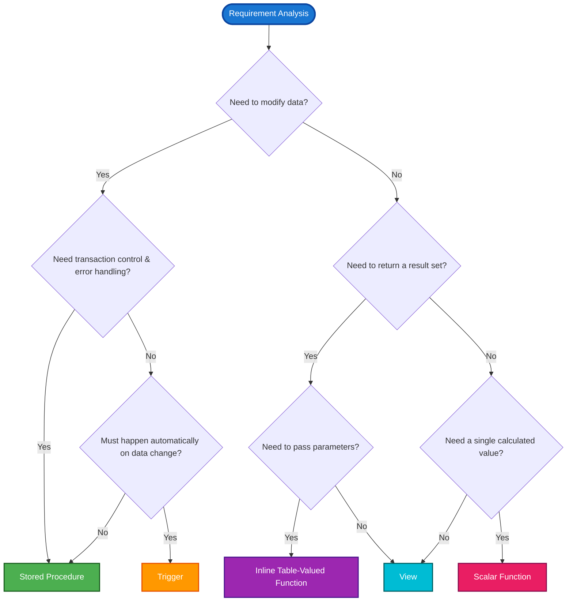

# Programmability Objects Study Guide

## 📋 Table of Contents
1. [Module Overview](#module-overview)
2. [Views](#1-views)
3. [Stored Procedures](#2-stored-procedures)
4. [Scalar Functions](#3-scalar-functions)
5. [Table-Valued Functions (TVFs)](#4-table-valued-functions-tvfs)
6. [Triggers](#5-triggers)
7. [Decision Framework: Choosing the Right Object](#6-decision-framework-choosing-the-right-object)
8. [Hands-On Lab Walkthrough](#7-hands-on-lab-walkthrough)
9. [60+ Practice Questions for DP-800](#8-60-practice-questions-for-dp-800)

---

## Module Overview

**What:** This module covers SQL Server programmability objects: Views, Stored Procedures, Scalar Functions, Table-Valued Functions (TVFs), and Triggers.  
**Why:** These objects encapsulate logic, improve code reusability, enforce business rules, and enhance security, moving logic from scattered application code into a centralized, maintainable database layer.  
**DP-800 Relevance:** Directly maps to **Domain 1.2: Implement programmability objects** (Create views, scalar functions, table-valued functions, stored procedures, triggers).

---

## 1. Views

### What is a View?
A view is a **virtual table** based on the result set of a `SELECT` statement. It does not store data physically (unless it's an indexed view) but retrieves data from underlying base tables dynamically.

### Why Use Views?
- **Simplification:** Hides complex `JOIN`s, calculations, and filters from application developers.
- **Security:** Acts as a security boundary. You can grant users access to a view (exposing only specific columns/rows) while denying access to the underlying tables.
- **Logical Independence:** Provides a stable interface even if the underlying table schema changes.

### How to Create a View
```sql
-- Best Practice: Use schema-qualified names and explicit columns (NO SELECT *)
CREATE OR ALTER VIEW Sales.vCustomerOrders
AS
SELECT 
    c.CustomerID,
    CONCAT(c.FirstName, ' ', c.LastName) AS CustomerName, -- Calculated column
    h.SalesOrderID,
    h.OrderDate
FROM SalesLT.Customer c
INNER JOIN SalesLT.SalesOrderHeader h ON c.CustomerID = h.CustomerID;
GO

-- Security/Validation: WITH CHECK OPTION prevents inserting/updating rows 
-- that would be invisible to the view's WHERE clause.
CREATE OR ALTER VIEW Sales.vHighValueOrders
AS
SELECT OrderID, CustomerID, TotalAmount
FROM Sales.Orders
WHERE TotalAmount > 1000
WITH CHECK OPTION; -- Prevents inserting an order with TotalAmount <= 1000 via this view
```

### When to Use Views
- When multiple applications need the same complex query.
- When you need to restrict row-level or column-level access without creating separate tables.

### 💡 Fun Fact
If you add a new column to a base table, a view created with `SELECT *` **will not** automatically show the new column until the view is refreshed (using `sp_refreshview`). This is why explicitly listing columns is a critical best practice!

---

## 2. Stored Procedures

### What is a Stored Procedure (SP)?
A precompiled collection of T-SQL statements stored in the database and executed as a single unit.

### Why Use Stored Procedures?
- **Performance:** Execution plans are cached after the first run, reducing compilation overhead.
- **Security:** Prevents SQL injection by parameterizing inputs and allows granting `EXECUTE` permission without granting direct table access.
- **Maintainability:** Centralizes complex business logic and transaction management.
- **Network Efficiency:** Reduces network traffic by sending only the procedure name and parameters, not the entire T-SQL script.

### How to Create a Stored Procedure
```sql
CREATE OR ALTER PROCEDURE dbo.AddOrderLineItem
    @SalesOrderID INT,
    @ProductID INT,
    @Quantity INT
AS
BEGIN
    -- Best Practice: Prevents "rows affected" messages from cluttering network traffic
    SET NOCOUNT ON; 

    BEGIN TRY
        BEGIN TRANSACTION;

        -- 1. Parameter Validation (Fail Fast)
        IF @Quantity <= 0
        BEGIN
            THROW 50001, 'Quantity must be greater than zero.', 1;
        END

        -- 2. Business Logic
        DECLARE @UnitPrice DECIMAL(18,2);
        SELECT @UnitPrice = ListPrice FROM SalesLT.Product WHERE ProductID = @ProductID;

        IF @UnitPrice IS NULL
            THROW 50010, 'Invalid ProductID specified.', 1;

        -- 3. Data Modification
        INSERT INTO SalesLT.SalesOrderDetail (SalesOrderID, OrderQty, ProductID, UnitPrice)
        VALUES (@SalesOrderID, @Quantity, @ProductID, @UnitPrice);

        COMMIT TRANSACTION;
    END TRY
    BEGIN CATCH
        -- 4. Error Handling & Rollback
        IF @@TRANCOUNT > 0
            ROLLBACK TRANSACTION;

        -- Capture and re-throw error details
        DECLARE @ErrMsg NVARCHAR(4000) = ERROR_MESSAGE();
        DECLARE @ErrSeverity INT = ERROR_SEVERITY();
        DECLARE @ErrState INT = ERROR_STATE();
        
        THROW 50000, @ErrMsg, @ErrState;
    END CATCH
END;
GO
```

### When to Use Stored Procedures
- When performing multi-step data modifications that require transaction control (`BEGIN TRAN` / `COMMIT` / `ROLLBACK`).
- When complex error handling is required.
- When you need to return multiple result sets or output parameters.

### 💡 Fun Fact
Never name your stored procedures with the `sp_` prefix (e.g., `sp_GetData`). SQL Server reserves this prefix for system procedures in the `master` database. Using it forces SQL Server to search the `master` database first, adding unnecessary overhead to every execution!

---

## 3. Scalar Functions

### What is a Scalar Function?
A user-defined function that accepts zero or more parameters and returns a **single scalar value** (e.g., `INT`, `VARCHAR`, `DECIMAL`).

### Why Use Scalar Functions?
- **Reusability:** Encapsulates calculations (e.g., tax calculation, date formatting) so the logic is written once and used everywhere.
- **Readability:** Makes `SELECT` statements cleaner by replacing complex inline expressions with a function call.

### How to Create a Scalar Function
```sql
CREATE OR ALTER FUNCTION dbo.CalculateSalesTax
(
    @Amount DECIMAL(10,2),
    @TaxRate DECIMAL(5,4)
)
RETURNS DECIMAL(10,2)
AS
BEGIN
    DECLARE @TaxAmount DECIMAL(10,2);
    
    -- Deterministic logic: Same input always yields same output
    SET @TaxAmount = ROUND(@Amount * @TaxRate, 2);
    
    RETURN @TaxAmount;
END;
GO

-- Usage in a query:
SELECT 
    ProductName, 
    ListPrice, 
    dbo.CalculateSalesTax(ListPrice, 0.0825) AS TaxAmount
FROM SalesLT.Product;
```

### When to Use Scalar Functions
- For simple, reusable calculations that return a single value.
- **WARNING:** Avoid using scalar functions in the `WHERE` clause of large tables. SQL Server may execute the function **row-by-row** (RBAR - Row By Agonizing Row), causing severe performance degradation.

### 💡 Fun Fact
Scalar functions that use non-deterministic elements (like `GETDATE()` or `NEWID()`) **cannot** be used in indexed views or as the basis for indexed computed columns. SQL Server requires determinism to guarantee index integrity!

---

## 4. Table-Valued Functions (TVFs)

### What is a TVF?
A function that returns a **table data type** (a result set) instead of a single scalar value. It can be used in the `FROM` clause of a query, just like a table or view.

### Why Use TVFs?
- Combines the parameterization of stored procedures with the usability of views/tables in `JOIN`s.
- **Inline TVFs** are highly optimized by the query engine (treated like parameterized views).

### Types of TVFs & How to Create Them

#### A. Inline Table-Valued Function (iTVF) - *Preferred for Performance*
```sql
-- Single SELECT statement, no BEGIN...END block. Highly optimized.
CREATE OR ALTER FUNCTION dbo.GetCustomerOrders
(
    @CustomerID INT
)
RETURNS TABLE
AS
RETURN
(
    SELECT SalesOrderID, OrderDate, TotalAmount
    FROM SalesLT.SalesOrderHeader
    WHERE CustomerID = @CustomerID
);
GO

-- Usage with CROSS APPLY (evaluates function per row)
SELECT c.FirstName, o.SalesOrderID, o.TotalAmount
FROM SalesLT.Customer c
CROSS APPLY dbo.GetCustomerOrders(c.CustomerID) o;
```

#### B. Multi-Statement Table-Valued Function (mTVF)
```sql
-- Explicit table variable definition, allows multiple statements. 
-- Note: Treated as a "black box" by the optimizer, which can lead to poor row estimates.
CREATE OR ALTER FUNCTION dbo.GetProductSalesSummary
(
    @StartDate DATE,
    @EndDate DATE
)
RETURNS @Summary TABLE
(
    ProductID INT,
    TotalRevenue DECIMAL(18,2)
)
AS
BEGIN
    INSERT INTO @Summary (ProductID, TotalRevenue)
    SELECT ProductID, SUM(LineTotal)
    FROM SalesLT.SalesOrderDetail
    WHERE OrderDate BETWEEN @StartDate AND @EndDate
    GROUP BY ProductID;

    RETURN;
END;
GO
```

### When to Use TVFs
- Use **Inline TVFs** when you need a parameterized result set to `JOIN` with other tables.
- Use **Multi-Statement TVFs** only when procedural logic (loops, complex conditional inserts) is absolutely necessary to build the result set.

### 💡 Fun Fact
Inline TVFs are often called "parameterized views." Because the SQL Server optimizer expands the iTVF's definition directly into the outer query, it can push predicates (like `WHERE` clauses) down into the function, resulting in blazing-fast execution plans compared to mTVFs!

---

## 5. Triggers

### What is a Trigger?
A special type of stored procedure that **automatically executes** (fires) in response to specific events, such as data modifications (`INSERT`, `UPDATE`, `DELETE`) or DDL events (`CREATE`, `ALTER`, `DROP`).

### Why Use Triggers?
- **Auditing:** Automatically log changes to sensitive data (e.g., salary changes).
- **Complex Integrity:** Enforce business rules that cannot be handled by standard `CHECK` or `FOREIGN KEY` constraints.
- **Cascading Actions:** Automatically update related tables (though `ON UPDATE CASCADE` is often preferred for simple relationships).

### How to Create a DML Trigger
```sql
-- Audit Table
CREATE TABLE dbo.OrderAudit (
    AuditID INT IDENTITY(1,1) PRIMARY KEY,
    OrderID INT NOT NULL,
    OldTotal DECIMAL(18,2) NULL,
    NewTotal DECIMAL(18,2) NULL,
    ChangedAt DATETIME2 DEFAULT SYSUTCDATETIME()
);
GO

-- AFTER Trigger: Fires AFTER the data modification is successful
CREATE OR ALTER TRIGGER SalesLT.trg_LogOrderTotalChange
ON SalesLT.SalesOrderDetail
AFTER INSERT, UPDATE
AS
BEGIN
    SET NOCOUNT ON;

    -- 'inserted' and 'deleted' are magic pseudo-tables holding the affected rows
    -- INSERT: only 'inserted' has data
    -- DELETE: only 'deleted' has data
    -- UPDATE: both have data (deleted = old, inserted = new)

    -- Check if the specific column was actually updated to save resources
    IF UPDATE(OrderQty) OR UPDATE(UnitPrice)
    BEGIN
        INSERT INTO dbo.OrderAudit (OrderID, OldTotal, NewTotal)
        SELECT 
            i.SalesOrderID,
            (SELECT SUM(OrderQty * UnitPrice) FROM deleted d WHERE d.SalesOrderID = i.SalesOrderID) AS OldTotal,
            (SELECT SUM(OrderQty * UnitPrice) FROM inserted i2 WHERE i2.SalesOrderID = i.SalesOrderID) AS NewTotal
        FROM inserted i
        -- Use DISTINCT to avoid duplicate audit rows for multi-row updates
        GROUP BY i.SalesOrderID;
    END
END;
GO
```

### When to Use Triggers
- When an action **must** happen automatically, regardless of which application or user modifies the data.
- **Avoid** using triggers for complex business logic that is better suited for stored procedures, as triggers are invisible to developers and hard to debug.

### 💡 Fun Fact
Triggers execute within the **same transaction** as the triggering statement. If your trigger code encounters an unhandled error, the **entire original `INSERT`/`UPDATE`/`DELETE` operation is rolled back**, not just the trigger!

---

## 6. Decision Framework: Choosing the Right Object



---

## 7. Hands-On Lab Walkthrough

The provided lab uses the `AdventureWorksLT` database. Here is the intuition behind the lab steps:

1. **View Creation:** `vCustomerOrders` hides the `INNER JOIN` logic. The app just queries `SELECT * FROM vCustomerOrders`, making frontend code cleaner.
2. **Stored Procedure:** `AddOrderLineItem` demonstrates **ACID** properties. It uses `BEGIN TRANSACTION`, validates inputs, inserts the detail, updates the header subtotal, and `COMMIT`s. If anything fails, the `CATCH` block ensures a `ROLLBACK`, preventing orphaned or inconsistent data.
3. **Scalar Function:** `fnOrderTotal` encapsulates the `SUM(LineTotal)` logic. *Note: In a real high-volume scenario, this is better as a computed column or iTVF to avoid RBAR performance hits.*
4. **Inline TVF:** `GetCustomerOrders` is the perfect use case for an iTVF. It's used with `CROSS APPLY` to efficiently fetch orders per customer row.
5. **Trigger:** `trg_LogOrderTotalChange` uses the `inserted` and `deleted` pseudo-tables to calculate the delta in order totals and write to an audit table, ensuring compliance without app-level code.

---

## 8. 60+ Practice Questions for DP-800

### Topic: Views
**Q1.** You need to provide a reporting team with access to customer data, but they must not see the `SSN` column. What is the most secure and maintainable approach?
- A) Create a view excluding the `SSN` column and grant `SELECT` on the view.
- B) Grant `SELECT` on the table and use Dynamic Data Masking.
- C) Create a stored procedure that returns the data.
- D) Create a scalar function for each column.
<details><summary><strong>Answer</strong></summary>A) Create a view excluding the `SSN` column and grant `SELECT` on the view. Views provide a clean security boundary for column-level restriction.</details>

**Q2.** What is the purpose of the `WITH CHECK OPTION` clause in a view definition?
- A) It encrypts the view definition.
- B) It ensures that `INSERT` or `UPDATE` statements executed against the view only affect rows that meet the view's `WHERE` clause.
- C) It forces the view to be materialized on disk.
- D) It validates the syntax of the view upon creation.
<details><summary><strong>Answer</strong></summary>B) It ensures that `INSERT` or `UPDATE` statements executed against the view only affect rows that meet the view's `WHERE` clause.</details>

**Q3.** Why is using `SELECT *` in a view definition considered a bad practice?
- A) It causes compilation errors.
- B) If a new column is added to the base table, the view will not automatically reflect it until refreshed, potentially causing mapping issues.
- C) It prevents the use of `JOIN` clauses.
- D) It automatically converts the view into a multi-statement TVF.
<details><summary><strong>Answer</strong></summary>B) If a new column is added, the view's metadata becomes stale. Explicit column listing ensures schema stability.</details>

**Q4.** Can a view accept input parameters like a stored procedure?
- A) Yes, using the `@Parameter` syntax in the `CREATE VIEW` statement.
- B) Yes, but only in Azure SQL Database.
- C) No, views cannot accept parameters. Use an Inline Table-Valued Function instead.
- D) No, unless it is an indexed view.
<details><summary><strong>Answer</strong></summary>C) No, views cannot accept parameters. Use an Inline Table-Valued Function instead.</details>

**Q5.** You have a view that joins 5 large tables. Queries against it are slow. What is a potential solution to improve performance without changing the base tables?
- A) Convert it to a scalar function.
- B) Create a unique clustered index on the view to make it an Indexed (Materialized) View.
- C) Add `WITH CHECK OPTION`.
- D) Change it to a multi-statement TVF.
<details><summary><strong>Answer</strong></summary>B) Creating a unique clustered index materializes the view, storing the result set physically for faster reads.</details>

**Q6.** Which of the following is true regarding data modification through a view?
- A) You can always update any column in the underlying tables.
- B) You can only modify data if the modification affects a single base table and doesn't violate constraints.
- C) Views are strictly read-only in SQL Server.
- D) Modifying a view automatically updates all joined tables.
<details><summary><strong>Answer</strong></summary>B) Modifications through a view are limited to a single base table (unless `INSTEAD OF` triggers are used).</details>

**Q7.** What happens if you drop a base table that a view depends on?
- A) The view is automatically dropped.
- B) The view remains, but querying it will result in an error.
- C) SQL Server prevents the table from being dropped.
- D) The view automatically converts to a stored procedure.
<details><summary><strong>Answer</strong></summary>B) The view remains in the catalog, but executing it will throw an "Invalid object name" error.</details>

**Q8.** To improve the maintainability of views, you should always:
- A) Use the `sp_` prefix.
- B) Use schema-qualified names (e.g., `Sales.vViewName`).
- C) Nest views inside other views up to 10 levels deep.
- D) Avoid using `WHERE` clauses.
<details><summary><strong>Answer</strong></summary>B) Schema-qualified names prevent resolution overhead and ambiguity.</details>

**Q9.** You need to present aggregated sales data by region, updated daily. Which object is best?
- A) Scalar Function
- B) Indexed View
- C) Trigger
- D) Default Constraint
<details><summary><strong>Answer</strong></summary>B) Indexed View (Materialized View) is ideal for pre-aggregating data for fast reporting.</details>

**Q10.** Which system view can you query to find dependencies of a specific view?
- A) `sys.views`
- B) `sys.sql_expression_dependencies`
- C) `sys.triggers`
- D) `sys.indexes`
<details><summary><strong>Answer</strong></summary>B) `sys.sql_expression_dependencies` tracks object dependencies.</details>

---

### Topic: Stored Procedures
**Q11.** What is the primary performance benefit of stored procedures over ad-hoc T-SQL queries?
- A) They compress the data.
- B) Their execution plans are cached and reused, reducing compilation overhead.
- C) They automatically create indexes.
- D) They run in a separate thread.
<details><summary><strong>Answer</strong></summary>B) Execution plan caching is a primary performance benefit of stored procedures.</details>

**Q12.** Which statement should be included at the beginning of a stored procedure to reduce network traffic?
- A) `SET ANSI_NULLS ON`
- B) `SET NOCOUNT ON`
- C) `SET XACT_ABORT ON`
- D) `SET QUOTED_IDENTIFIER ON`
<details><summary><strong>Answer</strong></summary>B) `SET NOCOUNT ON` prevents the "X rows affected" messages from being sent to the client.</details>

**Q13.** In a `TRY...CATCH` block, which function returns the text of the error message?
- A) `ERROR_STATE()`
- B) `ERROR_SEVERITY()`
- C) `ERROR_MESSAGE()`
- D) `ERROR_LINE()`
<details><summary><strong>Answer</strong></summary>C) `ERROR_MESSAGE()` returns the complete text of the error.</details>

**Q14.** Why should you avoid naming your stored procedures with the `sp_` prefix?
- A) It causes syntax errors.
- B) SQL Server searches the `master` database first, causing unnecessary performance overhead.
- C) It automatically grants public execution rights.
- D) It prevents the use of input parameters.
<details><summary><strong>Answer</strong></summary>B) The `sp_` prefix is reserved for system procedures, causing a lookup in `master` first.</details>

**Q15.** How do you return a value from a stored procedure to the calling application, in addition to result sets?
- A) Using a `RETURN` statement with a string.
- B) Using `OUTPUT` parameters.
- C) Using a scalar function inside the procedure.
- D) Using `PRINT`.
<details><summary><strong>Answer</strong></summary>B) `OUTPUT` parameters are designed to pass data back to the caller.</details>

**Q16.** What does `@@TRANCOUNT` indicate in a `CATCH` block?
- A) The number of rows affected.
- B) The number of active transactions for the current connection.
- C) The severity of the error.
- D) The number of compiled plans.
<details><summary><strong>Answer</strong></summary>B) `@@TRANCOUNT` shows the number of active `BEGIN TRANSACTION` statements. It's checked before calling `ROLLBACK`.</details>

**Q17.** You need to validate that an `@Email` parameter contains an '@' symbol at the start of a stored procedure. What is this practice called?
- A) Deferred validation
- B) Fail-fast parameter validation
- C) Schema binding
- D) Plan forcing
<details><summary><strong>Answer</strong></summary>B) Fail-fast validation prevents processing bad data and wastes fewer resources.</details>

**Q18.** Which of the following is true about stored procedures and SQL injection?
- A) Stored procedures are immune to SQL injection regardless of how they are written.
- B) Stored procedures prevent SQL injection only if they use parameterized inputs, not dynamic SQL concatenation.
- C) Stored procedures increase the risk of SQL injection.
- D) SQL injection only applies to views.
<details><summary><strong>Answer</strong></summary>B) If a stored procedure uses dynamic SQL with concatenated strings, it is still vulnerable. Parameters are required for safety.</details>

**Q19.** You want to execute a stored procedure named `dbo.CalculateTotals`. What is the correct T-SQL syntax?
- A) `RUN dbo.CalculateTotals`
- B) `CALL dbo.CalculateTotals`
- C) `EXEC dbo.CalculateTotals` or `EXECUTE dbo.CalculateTotals`
- D) `SELECT dbo.CalculateTotals`
<details><summary><strong>Answer</strong></summary>C) `EXEC` or `EXECUTE` is the correct T-SQL command.</details>

**Q20.** Can a stored procedure call another stored procedure?
- A) No, it causes a circular dependency error.
- B) Yes, up to 32 levels of nesting.
- C) Yes, but only if they are in the same schema.
- D) Yes, but the inner procedure cannot use transactions.
<details><summary><strong>Answer</strong></summary>B) Yes, SQL Server supports up to 32 levels of nested procedure calls.</details>

---

### Topic: Scalar Functions
**Q21.** What is the defining characteristic of a scalar function?
- A) It returns a table.
- B) It returns a single value.
- C) It automatically logs changes.
- D) It can modify base table data.
<details><summary><strong>Answer</strong></summary>B) Scalar functions return exactly one single value.</details>

**Q22.** Why is using a scalar function in a `WHERE` clause on a table with 10 million rows considered a performance anti-pattern?
- A) It causes a syntax error.
- B) It forces Row-By-Agonizing-Row (RBAR) execution, evaluating the function for every single row.
- C) It automatically converts the table to a heap.
- D) It disables the primary key.
<details><summary><strong>Answer</strong></summary>B) RBAR execution prevents index seeks and causes massive CPU overhead.</details>

**Q23.** A function that always returns the same result for the same input parameters is called:
- A) Non-deterministic
- B) Deterministic
- C) Volatile
- D) Recursive
<details><summary><strong>Answer</strong></summary>B) Deterministic functions are predictable and can be used in indexed views/computed columns.</details>

**Q24.** Which of the following makes a scalar function non-deterministic?
- A) Using basic math operators (`+`, `-`).
- B) Using the `GETDATE()` or `NEWID()` functions.
- C) Using `UPPER()` on a string.
- D) Using `ISNULL()`.
<details><summary><strong>Answer</strong></summary>B) `GETDATE()` and `NEWID()` depend on the current state/time, making the output vary for the same input.</details>

**Q25.** How do you modify an existing scalar function without dropping it and losing permissions?
- A) `UPDATE FUNCTION`
- B) `ALTER FUNCTION`
- C) `MODIFY FUNCTION`
- D) `RECREATE FUNCTION`
<details><summary><strong>Answer</strong></summary>B) `ALTER FUNCTION` preserves existing permissions and dependencies.</details>

**Q26.** Can a scalar function modify database state (e.g., `INSERT` into a table)?
- A) Yes, if it has `WITH EXECUTE AS OWNER`.
- B) No, scalar functions cannot have side effects that modify database state.
- C) Yes, but only temporary tables.
- D) Yes, but only on Fridays.
<details><summary><strong>Answer</strong></summary>B) Functions in SQL Server are not allowed to modify database state (no side effects).</details>

**Q27.** What is the purpose of the `RETURNS` clause in a scalar function?
- A) To specify the input parameters.
- B) To define the data type of the single value the function will output.
- C) To return a result set.
- D) To specify the schema.
<details><summary><strong>Answer</strong></summary>B) It explicitly defines the data type of the output value.</details>

**Q28.** You need to format a phone number consistently across 20 different reports. What is the best approach?
- A) Write the formatting logic in the frontend application.
- B) Create a scalar function and use it in the `SELECT` list of the reports.
- C) Store the formatted phone number as a separate column.
- D) Use a trigger to format it on insert.
<details><summary><strong>Answer</strong></summary>B) A scalar function centralizes the formatting logic, ensuring consistency across all reports.</details>

**Q29.** Which system function can you use to check if a function exists before dropping it?
- A) `OBJECT_ID()` or `IF EXISTS`
- B) `CHECK_EXISTS()`
- C) `SYS.FUNCTIONS`
- D) `VALIDATE_OBJECT()`
<details><summary><strong>Answer</strong></summary>A) `DROP FUNCTION IF EXISTS dbo.MyFunc` or checking `OBJECT_ID('dbo.MyFunc', 'FN')`.</details>

**Q30.** If a scalar function encounters a `NULL` input, what is the typical expected behavior (unless explicitly handled)?
- A) It throws a division by zero error.
- B) It returns `NULL`.
- C) It returns `0`.
- D) It crashes the SQL Server service.
<details><summary><strong>Answer</strong></summary>B) In SQL Server, most operations involving `NULL` yield `NULL` (ANSI NULL handling).</details>

---

### Topic: Table-Valued Functions (TVFs)
**Q31.** What is the main difference between an Inline TVF (iTVF) and a Multi-Statement TVF (mTVF)?
- A) iTVF returns a single value; mTVF returns a table.
- B) iTVF consists of a single `SELECT` statement and is highly optimized; mTVF uses a table variable and `BEGIN...END`, acting as a "black box" to the optimizer.
- C) mTVF is faster than iTVF in all scenarios.
- D) iTVF can modify data; mTVF cannot.
<details><summary><strong>Answer</strong></summary>B) iTVFs are expanded into the outer query by the optimizer, while mTVFs are executed sequentially and lack accurate row estimates.</details>

**Q32.** Which operator is commonly used to apply an Inline TVF to each row of an outer query?
- A) `INNER JOIN`
- B) `CROSS APPLY` or `OUTER APPLY`
- C) `UNION`
- D) `MERGE`
<details><summary><strong>Answer</strong></summary>B) `CROSS APPLY` (or `OUTER APPLY`) is designed to invoke a TVF for each row of the outer table.</details>

**Q33.** You need a reusable query that returns all orders for a specific `@CustomerID` and you want to `JOIN` it with the `Customers` table. Which object is best?
- A) Stored Procedure
- B) Scalar Function
- C) Inline Table-Valued Function
- D) Trigger
<details><summary><strong>Answer</strong></summary>C) An Inline TVF acts like a parameterized view and can be seamlessly `JOIN`ed.</details>

**Q34.** In a Multi-Statement TVF, how do you define the structure of the returned data?
- A) It is inferred from the `SELECT` statement.
- B) You must explicitly declare a table variable (e.g., `RETURNS @MyTable TABLE (...)`).
- C) You use the `AS NODE` syntax.
- D) You cannot define the structure; it is always dynamic.
<details><summary><strong>Answer</strong></summary>B) mTVFs require an explicit table variable definition in the `RETURNS` clause.</details>

**Q35.** Why might an Inline TVF perform better than a Multi-Statement TVF?
- A) iTVFs use less memory.
- B) The SQL Server query optimizer can merge the iTVF's logic into the main query plan, allowing for index seeks and predicate pushdown.
- C) mTVFs do not support `WHERE` clauses.
- D) iTVFs are pre-compiled into machine code.
<details><summary><strong>Answer</strong></summary>B) Predicate pushdown and plan merging make iTVFs significantly more efficient.</details>

**Q36.** Can a TVF be used in the `FROM` clause of a `SELECT` statement?
- A) No, only tables and views can be used.
- B) Yes, TVFs are specifically designed to be used in the `FROM` clause.
- C) Only if the TVF is wrapped in a stored procedure.
- D) Only in Azure SQL Database.
<details><summary><strong>Answer</strong></summary>B) Yes, TVFs return a table data type and are used in the `FROM` clause.</details>

**Q37.** You have a complex TVF that is running slowly. The execution plan shows a "Table Valued Function" operator with an estimated row count of 1, but the actual is 1,000,000. What type of TVF is this likely to be?
- A) Inline TVF
- B) Multi-Statement TVF
- C) Scalar Function
- D) System Function
<details><summary><strong>Answer</strong></summary>B) mTVFs are treated as black boxes, often resulting in a default, inaccurate estimate of 1 row (or 100 in newer versions), leading to poor plan choices.</details>

**Q38.** How do you return the result set in an Inline TVF?
- A) Using `RETURN @TableVariable`
- B) Using `RETURN (SELECT ...)`
- C) Using `OUTPUT`
- D) Using `PRINT`
<details><summary><strong>Answer</strong></summary>B) An iTVF uses a single `RETURN` followed directly by a `SELECT` statement in parentheses.</details>

**Q39.** Can a TVF accept multiple parameters?
- A) No, only one.
- B) Yes, separated by commas, just like a stored procedure.
- C) Yes, but only if they are all of the same data type.
- D) No, TVFs cannot accept parameters.
<details><summary><strong>Answer</strong></summary>B) TVFs can accept multiple parameters of varying data types.</details>

**Q40.** If you need to perform an `INSERT` into a logging table as part of returning a result set, which function type must you use?
- A) Inline TVF
- B) Multi-Statement TVF
- C) Scalar Function
- D) None, functions cannot modify database state. Use a Stored Procedure instead.
<details><summary><strong>Answer</strong></summary>D) Functions (both scalar and TVF) cannot have side effects like modifying base tables. Use a Stored Procedure.</details>

---

### Topic: Triggers
**Q41.** What are the two special pseudo-tables available inside a DML trigger?
- A) `old` and `new`
- B) `inserted` and `deleted`
- C) `before` and `after`
- D) `source` and `target`
<details><summary><strong>Answer</strong></summary>B) `inserted` (contains new/added rows) and `deleted` (contains old/removed rows).</details>

**Q42.** Which type of trigger fires *after* the data modification has successfully occurred?
- A) `INSTEAD OF`
- B) `AFTER` (or `FOR`)
- C) `DDL`
- D) `LOGON`
<details><summary><strong>Answer</strong></summary>B) `AFTER` triggers fire after the operation is completed.</details>

**Q43.** When is an `INSTEAD OF` trigger most useful?
- A) For logging changes to a history table.
- B) For making a complex view (e.g., one with `JOIN`s or aggregates) updatable.
- C) For preventing all `DELETE` operations on a table.
- D) For automatically creating indexes.
<details><summary><strong>Answer</strong></summary>B) `INSTEAD OF` triggers intercept the operation and allow you to define custom logic to make non-updatable views behave as if they are.</details>

**Q44.** What does the `UPDATE(ColumnName)` function do inside a trigger?
- A) It updates the column to a new value.
- B) It returns a boolean indicating whether an `INSERT` or `UPDATE` attempt was made on that specific column.
- C) It checks if the column exists in the table.
- D) It rolls back the transaction if the column is null.
<details><summary><strong>Answer</strong></summary>B) `UPDATE(ColumnName)` is an efficient way to check if a specific column was part of the `INSERT` or `UPDATE` statement, avoiding unnecessary processing.</details>

**Q45.** Why should you keep trigger logic as minimal as possible?
- A) Because triggers run in a separate, slow process.
- B) Because triggers execute within the same transaction as the triggering statement, and complex logic can cause blocking, deadlocks, or transaction timeouts.
- C) Because SQL Server limits triggers to 10 lines of code.
- D) Because triggers cannot use variables.
<details><summary><strong>Answer</strong></summary>B) Triggers extend the transaction. Heavy logic holds locks longer, degrading overall system concurrency.</details>

**Q46.** What happens if an unhandled error occurs inside an `AFTER` trigger?
- A) The trigger fails, but the original `INSERT`/`UPDATE` succeeds.
- B) The entire transaction (both the trigger and the original statement) is rolled back.
- C) SQL Server ignores the error and continues.
- D) The database is marked as suspect.
<details><summary><strong>Answer</strong></summary>B) Because the trigger is part of the same transaction, an unhandled error aborts the whole transaction.</details>

**Q47.** Which of the following is a valid event for a DML trigger?
- A) `CREATE_TABLE`
- B) `INSERT, UPDATE, DELETE`
- C) `ALTER_DATABASE`
- D) `DROP_LOGIN`
<details><summary><strong>Answer</strong></summary>B) `INSERT`, `UPDATE`, and `DELETE` are DML events. The others are DDL events.</details>

**Q48.** You want to prevent anyone from dropping a table in your database. Which trigger should you use?
- A) DML `AFTER` trigger
- B) DDL trigger on the database for `DROP_TABLE`
- C) Logon trigger
- D) `INSTEAD OF` trigger on a view
<details><summary><strong>Answer</strong></summary>B) A DDL trigger can intercept and rollback schema modification events like `DROP_TABLE`.</details>

**Q49.** In an `UPDATE` operation, which pseudo-tables contain data?
- A) Only `inserted`
- B) Only `deleted`
- C) Both `inserted` (new values) and `deleted` (old values)
- D) Neither
<details><summary><strong>Answer</strong></summary>C) An `UPDATE` is logically a `DELETE` of the old row followed by an `INSERT` of the new row, so both tables are populated.</details>

**Q50.** How can you prevent a trigger from firing recursively (e.g., Trigger A updates Table B, which fires Trigger B, which updates Table A)?
- A) It is impossible to prevent.
- B) Use the `DISABLE TRIGGER` command permanently.
- C) Set the database option `RECURSIVE_TRIGGERS` to `OFF`, and design logic to avoid circular updates.
- D) Use a scalar function instead.
<details><summary><strong>Answer</strong></summary>C) Disabling `RECURSIVE_TRIGGERS` at the database level prevents direct recursion, and careful design prevents indirect recursion.</details>

---

### Topic: Mixed Scenarios & Best Practices (DP-800 Focus)
**Q51.** You need to calculate a complex shipping cost based on weight, destination, and current fuel surcharge, and use this calculation in a `WHERE` clause to filter orders. What is the best approach to avoid performance issues?
- A) Use a scalar function.
- B) Hardcode the logic in every query.
- C) Use an Inline Table-Valued Function or compute it in a derived table/CTE to allow set-based optimization.
- D) Use a trigger to pre-calculate and store it.
<details><summary><strong>Answer</strong></summary>C) Set-based operations (iTVF, CTE) allow the optimizer to evaluate the logic efficiently, unlike RBAR scalar functions in `WHERE` clauses.</details>

**Q52.** A developer complains that their `INSERT` statement is failing, but they don't know why. You discover an `AFTER INSERT` trigger is throwing an error. What is the impact on the developer's `INSERT`?
- A) The `INSERT` succeeds, but the trigger fails silently.
- B) The `INSERT` is rolled back along with the trigger.
- C) The `INSERT` succeeds, and the error is logged in the Windows Event Viewer only.
- D) The trigger is automatically disabled.
<details><summary><strong>Answer</strong></summary>B) Unhandled errors in triggers roll back the entire transaction, including the original DML statement.</details>

**Q53.** Which programmability object is most appropriate for enforcing a business rule that "an order total cannot exceed $10,000 without manager approval", where the approval status is in a different table?
- A) `CHECK` constraint
- B) Foreign Key
- C) Stored Procedure or Trigger
- D) Default constraint
<details><summary><strong>Answer</strong></summary>C) `CHECK` constraints cannot reference other tables. A Stored Procedure (preferred) or Trigger is needed for cross-table validation.</details>

**Q54.** You are designing a CI/CD pipeline for your database. Why is it important to use `CREATE OR ALTER` instead of just `CREATE` in your deployment scripts?
- A) `CREATE OR ALTER` is faster.
- B) It makes the script idempotent, allowing it to run successfully whether the object already exists or not, preventing deployment failures.
- C) `CREATE OR ALTER` automatically grants permissions.
- D) It is required by GitHub Copilot.
<details><summary><strong>Answer</strong></summary>B) Idempotency is a core CI/CD best practice, ensuring scripts can be re-run safely without "object already exists" errors.</details>

**Q55.** When using `CROSS APPLY` with an Inline TVF, what happens if the TVF returns no rows for a specific outer row?
- A) The outer row is still returned with NULLs (like a LEFT JOIN).
- B) The outer row is filtered out of the final result set (like an INNER JOIN).
- C) An error is thrown.
- D) The query stops executing.
<details><summary><strong>Answer</strong></summary>B) `CROSS APPLY` acts like an `INNER JOIN`. To keep the outer row with NULLs, you must use `OUTER APPLY`.</details>

**Q56.** You need to expose a database table via a REST API with minimal coding. Which modern SQL/Azure feature should you configure alongside your tables?
- A) Scalar Functions
- B) Data API Builder (DAB)
- C) DDL Triggers
- D) Indexed Views
<details><summary><strong>Answer</strong></summary>B) Data API Builder (DAB) is explicitly mentioned in the DP-800 syllabus for creating REST/GraphQL endpoints from database objects.</details>

**Q57.** Which of the following is a valid reason to choose a Multi-Statement TVF over an Inline TVF?
- A) You need better query optimizer performance.
- B) You need to perform multiple steps, such as inserting into a table variable, updating it, and then returning it.
- C) You want to use it in an indexed view.
- D) You need to return a single scalar value.
<details><summary><strong>Answer</strong></summary>B) mTVFs are necessary when procedural, multi-step logic is required to build the result set, despite the performance trade-off.</details>

**Q58.** What is the primary security advantage of using a Stored Procedure over granting direct `SELECT`/`INSERT` permissions on a table?
- A) Stored procedures are encrypted by default.
- B) It allows for "Ownership Chaining," where users can execute the procedure and modify underlying tables without having direct permissions on those tables.
- C) Stored procedures hide the table names from the network.
- D) Stored procedures automatically mask data.
<details><summary><strong>Answer</strong></summary>B) Ownership chaining allows granular control: users get `EXECUTE` on the SP, but no direct DML rights on the tables, enforcing business logic.</details>

**Q59.** You notice a view is performing poorly. Upon inspection, it contains `SELECT *`, nested views 4 levels deep, and a scalar function in the `WHERE` clause. What is the best refactoring strategy?
- A) Add more indexes to the base tables.
- B) Flatten the view by explicitly listing columns, removing nested views, and replacing the scalar function with an inline expression or JOIN.
- C) Convert the view to a trigger.
- D) Increase the database DTUs.
<details><summary><strong>Answer</strong></summary>B) Deeply nested views and scalar functions in `WHERE` clauses are major anti-patterns. Flattening and explicit column selection is the correct architectural fix.</details>

**Q60.** In the context of DP-800 and AI-enabled databases, how might a Table-Valued Function be useful for a Retrieval-Augmented Generation (RAG) pipeline?
- A) TVFs can directly train machine learning models.
- B) A TVF can be used to efficiently retrieve and format structured context (e.g., top 5 relevant documents based on a parameter) to be passed to an LLM via `sp_invoke_external_rest_endpoint`.
- C) TVFs automatically generate vector embeddings.
- D) TVFs replace the need for a vector index.
<details><summary><strong>Answer</strong></summary>B) TVFs are excellent for parameterized retrieval of structured context, which can then be formatted as JSON and sent to an LLM in a RAG workflow.</details>

---

## 🎯 Final Exam Tips for DP-800 Programmability
1. **Performance is Key:** Always prefer **Inline TVFs** over Multi-Statement TVFs, and avoid **Scalar Functions** in `WHERE` clauses on large tables.
2. **Security First:** Use **Views** for column/row-level security and **Stored Procedures** with `EXECUTE` permissions to prevent direct table access.
3. **Transaction Integrity:** Always pair `BEGIN TRY...CATCH` with `@@TRANCOUNT` checks in Stored Procedures to ensure clean rollbacks.
4. **Trigger Caution:** Remember that triggers run in the *same transaction*. Heavy logic = blocked tables. Use them sparingly, primarily for auditing or strict cross-table integrity.
5. **Syntax Matters:** Know the difference between `AFTER` and `INSTEAD OF`, and remember the `inserted`/`deleted` pseudo-tables.

*Good luck with your DP-800 certification! You've got this!* 🚀
