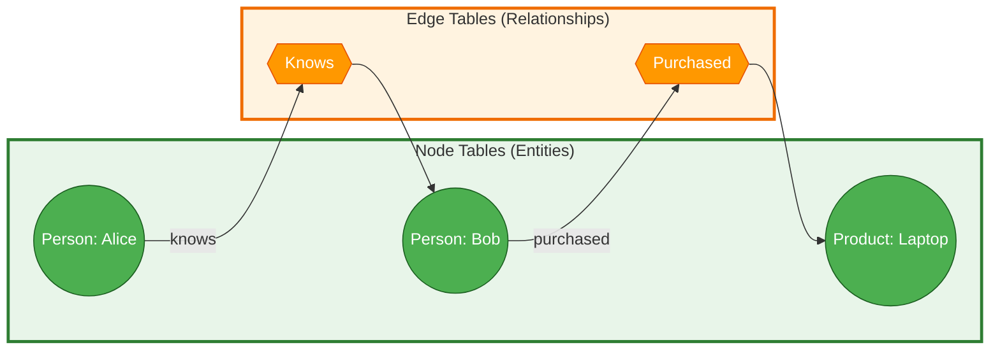

# Microsoft Certified: SQL AI Developer Associate (DP-800) - Advanced T-SQL Study Guide

## 📋 Table of Contents
1. [Common Table Expressions (CTEs)](#1-common-table-expressions-ctes)
2. [Window Functions](#2-window-functions)
3. [JSON Processing](#3-json-processing)
4. [Regular Expressions](#4-regular-expressions)
5. [Fuzzy String Matching](#5-fuzzy-string-matching)
6. [Graph Queries](#6-graph-queries)
7. [Correlated Subqueries](#7-correlated-subqueries)
8. [Error Handling (TRY...CATCH)](#8-error-handling-trycatch)
9. [55+ DP-800 Practice Questions](#9-55-dp-800-practice-questions)

---

## 1. Common Table Expressions (CTEs)

### What is a CTE?
A Common Table Expression (CTE) is a **temporary, named result set** that exists only for the duration of a single `SELECT`, `INSERT`, `UPDATE`, or `DELETE` statement.

### Why Use CTEs?
- **Readability:** Breaks complex, multi-step logic into named, understandable chunks.
- **Modularity:** Allows you to reference the same subquery multiple times without rewriting it.
- **Recursion:** The *only* way to traverse hierarchical data (like org charts or bill-of-materials) in T-SQL.

### How to Use CTEs
```sql
-- Non-Recursive CTE: Simplifies complex aggregations
WITH SalesSummary AS (
    SELECT 
        ProductID,
        SUM(OrderQty) AS TotalQty,
        SUM(LineTotal) AS TotalRevenue
    FROM SalesLT.SalesOrderDetail
    GROUP BY ProductID
)
-- Main query references the CTE by name
SELECT p.Name, ss.TotalRevenue
FROM SalesLT.Product AS p
INNER JOIN SalesSummary AS ss ON p.ProductID = ss.ProductID
ORDER BY ss.TotalRevenue DESC;

-- Recursive CTE: Traversing Hierarchies
WITH EmployeeHierarchy AS (
    -- 1. Anchor Member: The starting point (e.g., top-level managers)
    SELECT EmployeeID, ManagerID, 0 AS Level
    FROM HumanResources.Employee
    WHERE ManagerID IS NULL

    UNION ALL

    -- 2. Recursive Member: References the CTE itself to find the next level
    SELECT e.EmployeeID, e.ManagerID, eh.Level + 1
    FROM HumanResources.Employee AS e
    INNER JOIN EmployeeHierarchy AS eh ON e.ManagerID = eh.EmployeeID
)
SELECT * FROM EmployeeHierarchy 
OPTION (MAXRECURSION 100); -- Prevents infinite loops (default is 100)
```

### When to Use
- When you need to calculate an aggregate and then filter/rank based on that aggregate.
- When generating sequences (e.g., a calendar table of dates).
- When navigating parent-child relationships.

### 💡 Fun Fact
Unlike temporary tables (`#Temp`), CTEs **do not** write to `tempdb`. They are purely a logical query construct, meaning the SQL Server optimizer can inline them and optimize the entire query as a single unit!

---

## 2. Window Functions

### What are Window Functions?
Functions that perform calculations across a set of table rows that are somehow related to the current row, **without collapsing the rows** into a single output row like `GROUP BY` does.

### Why Use Window Functions?
- Calculate running totals, moving averages, or rankings while retaining row-level detail.
- Eliminate the need for complex, performance-killing self-joins.

### How to Use Window Functions
```sql
-- Anatomy of a Window Function:
-- FUNCTION() OVER ( [PARTITION BY ...] [ORDER BY ...] [ROWS/RANGE ...] )

SELECT 
    SalesOrderID,
    CustomerID,
    TotalDue,
    -- Running Total: Cumulative sum per customer, ordered by date
    SUM(TotalDue) OVER (
        PARTITION BY CustomerID 
        ORDER BY OrderDate
        ROWS BETWEEN UNBOUNDED PRECEDING AND CURRENT ROW
    ) AS RunningTotal,
    
    -- Ranking: Unique rank per customer by order value
    ROW_NUMBER() OVER (
        PARTITION BY CustomerID 
        ORDER BY TotalDue DESC
    ) AS OrderRank,
    
    -- Analytical: Compare to the previous order's total
    LAG(TotalDue, 1, 0) OVER (
        PARTITION BY CustomerID 
        ORDER BY OrderDate
    ) AS PreviousOrderTotal
FROM SalesLT.SalesOrderHeader;
```

### When to Use
- **Ranking:** `ROW_NUMBER()` (unique), `RANK()` (skips numbers on ties), `DENSE_RANK()` (no skips), `NTILE()` (buckets).
- **Analytical:** `LAG()` / `LEAD()` for period-over-period comparisons.
- **Aggregation:** Running totals or moving averages.

### 💡 Fun Fact
If you use `LAST_VALUE()` without explicitly defining the frame as `ROWS BETWEEN UNBOUNDED PRECEDING AND UNBOUNDED FOLLOWING`, it will default to `CURRENT ROW` as the upper bound, meaning it will just return the current row's value instead of the actual last value in the partition!

### Mermaid Diagram: Window Function Anatomy
```mermaid
graph TD
    subgraph WindowFunction["Window Function Anatomy"]
        WF[FUNCTION() OVER]
        P[PARTITION BY: Groups rows into independent windows]
        O[ORDER BY: Sorts rows logically within each partition]
        F[ROWS/RANGE: Defines the physical/logical frame boundaries]
    end
    WF --> P
    WF --> O
    WF --> F
    style WindowFunction fill:#e3f2fd,stroke:#1565c0,stroke-width:3px
    style WF fill:#ff6b6b,stroke:#c92a2a,color:#fff,stroke-width:2px
    style P fill:#4ecdc4,stroke:#087f5b,color:#fff
    style O fill:#95e1d3,stroke:#2b8a77,color:#000
    style F fill:#f38181,stroke:#c92a2a,color:#fff
```

---

## 3. JSON Processing

### What is JSON Processing in SQL?
Built-in T-SQL functions that allow you to parse, validate, construct, and transform JSON data directly within the database engine.

### Why Use It?
Modern applications (especially AI and web APIs) heavily rely on JSON. Processing it in-database is faster and more secure than pulling raw JSON into application memory to parse it.

### How to Use JSON Functions
```sql
DECLARE @json NVARCHAR(MAX) = N'{
    "customer": {"id": 123, "name": "Contoso"},
    "items": [{"product": "Widget", "qty": 5}]
}';

-- 1. Extract scalar value (string, number, boolean)
SELECT JSON_VALUE(@json, '$.customer.name') AS CustomerName;

-- 2. Extract object or array (preserves JSON structure)
SELECT JSON_QUERY(@json, '$.items') AS ItemsArray;

-- 3. Parse JSON array into relational rows (Table-Valued Function)
SELECT Product, Qty
FROM OPENJSON(@json, '$.items')
WITH (
    Product NVARCHAR(50) '$.product',
    Qty INT '$.qty'
);

-- 4. Construct JSON from relational data (SQL Server 2022+)
SELECT JSON_OBJECT(
    'id': ProductID,
    'name': Name,
    'price': ListPrice
) AS ProductJson
FROM SalesLT.Product;

-- 5. Aggregate rows into a JSON array
SELECT JSON_ARRAYAGG(Name) AS ProductNames
FROM SalesLT.Product;
```

### When to Use
- Storing flexible, semi-structured metadata (e.g., product attributes).
- Building API responses directly from SQL queries using `FOR JSON PATH`.
- Validating incoming JSON payloads with `ISJSON()` or `JSON_PATH_EXISTS()`.

### 💡 Fun Fact
By default, JSON path extraction uses **Lax** mode, which silently returns `NULL` if a path is missing. You can change this to **Strict** mode (`strict $.missingPath`) to force an error, which is excellent for data validation!

---

## 4. Regular Expressions

### What are Regular Expressions (Regex) in T-SQL?
A powerful pattern-matching syntax (ECMAScript standard) for validating, extracting, and manipulating text, introduced in SQL Server 2025 and Microsoft Fabric.

### Why Use Regex?
The traditional `LIKE` operator only supports `%` and `_`. Regex allows you to match exact character counts, specific character classes (e.g., digits only), and complex patterns.

### How to Use Regex Functions
```sql
-- 1. REGEXP_LIKE: Filter rows matching a pattern (Returns 1 or 0)
SELECT EmailAddress FROM SalesLT.Customer
WHERE REGEXP_LIKE(EmailAddress, '^[a-zA-Z0-9._%+-]+@contoso\.com$') = 1;

-- 2. REGEXP_REPLACE: Cleanse or mask data
-- Mask credit card, keeping only last 4 digits
SELECT REGEXP_REPLACE('4532-1234-5678-9012', '\d(?=[\d-]{4,})', '*') AS MaskedCard;

-- 3. REGEXP_SUBSTR: Extract specific parts of a string
-- Extract domain from email
SELECT REGEXP_SUBSTR(EmailAddress, '@(.+)$', 1, 1, '', 1) AS Domain
FROM SalesLT.Customer;

-- 4. REGEXP_SPLIT_TO_TABLE: Split delimited string into rows
SELECT value AS Tag
FROM REGEXP_SPLIT_TO_TABLE('sql,database,ai', ',');
```

### When to Use
- Validating email addresses, phone numbers, or product codes.
- Data cleansing (removing extra spaces, stripping HTML tags).
- Extracting specific tokens from unstructured text logs.

### 💡 Fun Fact
SQL Server's regex engine uses the **ECMAScript** standard, meaning the exact same regex patterns you write in T-SQL will work in JavaScript, Python, and C#!

---

## 5. Fuzzy String Matching

### What is Fuzzy Matching?
Algorithms that calculate the "similarity" between two strings, allowing you to find matches even when there are typos, abbreviations, or slight variations.

### Why Use It?
Real-world data is messy. Customers type "Jon Smith", "John Smyth", or "J. Smith". Exact matching (`=`) fails here; fuzzy matching finds the needle in the haystack.

### How to Use Fuzzy Functions
```sql
-- 1. EDIT_DISTANCE: Counts minimum edits (insert, delete, substitute) to match
-- "color" to "colour" = 1 edit
SELECT EDIT_DISTANCE('color', 'colour') AS Distance; -- Returns 1

-- 2. EDIT_DISTANCE_SIMILARITY: Returns a 0-100 score
SELECT EDIT_DISTANCE_SIMILARITY('database', 'databaes') AS Similarity; -- Returns ~75

-- 3. JARO_WINKLER_DISTANCE: Optimized for short strings (like names)
-- Gives a bonus for matching prefixes
SELECT JARO_WINKLER_DISTANCE('MARTHA', 'MARHTA') AS NameScore; -- Returns ~0.96
```

### When to Use
- Deduplicating customer or product records.
- Building "Did you mean...?" search autocomplete features.
- Matching incoming data against a master reference table.

### 💡 Fun Fact
Fuzzy matching is **computationally expensive**. Always pre-filter your data using indexed columns (e.g., `WHERE LastName LIKE 'Sm%'`) *before* applying fuzzy functions to avoid scanning millions of rows!

---

## 6. Graph Queries

### What are Graph Queries?
A native way to model and query networks of entities (Nodes) and their relationships (Edges) using the `MATCH` operator, avoiding complex multi-way joins.

### Why Use Graph?
Querying "friends of friends" or "supply chain paths" in pure relational SQL requires messy, performance-heavy recursive joins. Graph syntax is intuitive and optimized for traversal.

### How to Use Graph Queries
```sql
-- 1. Create Node and Edge tables
CREATE TABLE Person (PersonID INT PRIMARY KEY, Name NVARCHAR(100)) AS NODE;
CREATE TABLE Knows (ConnectionDate DATE) AS EDGE;

-- 2. Insert data (SQL Server auto-generates hidden $node_id and $edge_id)
INSERT INTO Person VALUES (1, 'Alice'), (2, 'Bob');
INSERT INTO Knows ($from_id, $to_id) 
SELECT (SELECT $node_id FROM Person WHERE Name='Alice'), 
       (SELECT $node_id FROM Person WHERE Name='Bob');

-- 3. Query using MATCH (ASCII-art style syntax)
-- Find who Alice knows
SELECT Target.Name 
FROM Person AS Source, Knows, Person AS Target
WHERE MATCH(Source-(Knows)->Target) 
  AND Source.Name = 'Alice';

-- 4. Variable-length traversal (Friends of Friends)
SELECT Reachable.Name
FROM Person AS Start, Knows FOR PATH AS k, Person FOR PATH AS Reachable
WHERE MATCH(SHORTEST_PATH(Start(-(k)->Reachable){1,3}))
  AND Start.Name = 'Alice';
```

### When to Use
- Social networks, organizational hierarchies, IT network topologies.
- Fraud detection (finding circular money flows).
- Recommendation engines ("people who bought X also bought Y").

### Mermaid Diagram: Graph Data Model


---

## 7. Correlated Subqueries

### What is a Correlated Subquery?
A subquery that references a column from the outer query. This creates a dependency, meaning the subquery logically executes **once for every row** processed by the outer query.

### Why Use It?
To perform row-by-row comparisons or calculations that depend on the current row's context, which cannot be achieved with a static, non-correlated subquery.

### How to Use Correlated Subqueries
```sql
-- 1. Filtering: Find products priced above their own category's average
SELECT p.Name, p.ListPrice
FROM SalesLT.Product AS p
WHERE p.ListPrice > (
    SELECT AVG(p2.ListPrice)
    FROM SalesLT.Product AS p2
    WHERE p2.ProductCategoryID = p.ProductCategoryID -- Correlation!
);

-- 2. EXISTS: Highly efficient existence check (stops at first match)
SELECT c.CustomerID, c.FirstName
FROM SalesLT.Customer AS c
WHERE EXISTS (
    SELECT 1 
    FROM SalesLT.SalesOrderHeader AS soh
    WHERE soh.CustomerID = c.CustomerID 
      AND soh.TotalDue > 10000
);

-- 3. SELECT clause: Append a calculated value per row
SELECT c.CustomerID,
    (SELECT COUNT(*) FROM SalesLT.SalesOrderHeader WHERE CustomerID = c.CustomerID) AS OrderCount
FROM SalesLT.Customer AS c;
```

### When to Use
- Top-N per group (if window functions are not an option).
- Checking for existence (`EXISTS` / `NOT EXISTS`).
- Comparing a row's value to its group's average or maximum.

### 💡 Fun Fact
While logically a correlated subquery runs row-by-row, the SQL Server Query Optimizer is incredibly smart. It will often automatically rewrite your correlated subquery as a highly efficient `JOIN` or `Apply` operation behind the scenes!

---

## 8. Error Handling (TRY...CATCH)

### What is TRY...CATCH?
A structured error-handling mechanism in T-SQL that allows you to gracefully trap, log, and respond to runtime errors without crashing the entire batch or application.

### Why Use It?
- **Data Integrity:** Ensures that multi-step transactions either fully succeed or fully roll back.
- **Debugging:** Captures exact error numbers, messages, and line numbers.
- **User Experience:** Allows you to return clean, custom error messages to the application.

### How to Use TRY...CATCH
```sql
BEGIN TRY
    BEGIN TRANSACTION;

    -- Operation 1: Update inventory
    UPDATE Inventory SET Qty = Qty - 5 WHERE ProductID = 100;

    -- Operation 2: This might fail (e.g., division by zero or constraint violation)
    UPDATE Orders SET Status = 'Shipped' WHERE OrderID = 999;

    -- If we get here, everything succeeded
    COMMIT TRANSACTION;
END TRY
BEGIN CATCH
    -- 1. Check if a transaction is still active before rolling back
    IF @@TRANCOUNT > 0
        ROLLBACK TRANSACTION;

    -- 2. Log the error details (Optional but recommended)
    INSERT INTO ErrorLog (ErrorNumber, ErrorMessage, ErrorLine)
    VALUES (ERROR_NUMBER(), ERROR_MESSAGE(), ERROR_LINE());

    -- 3. Re-raise the error to the calling application
    -- THROW without parameters perfectly preserves the original error context
    THROW; 
END CATCH;
```

### When to Use
- Anytime you are performing `INSERT`, `UPDATE`, or `DELETE` operations.
- When calling external REST endpoints via `sp_invoke_external_rest_endpoint`.
- In all production-grade stored procedures.

### 💡 Fun Fact
Always combine `TRY...CATCH` with `SET XACT_ABORT ON;`. This ensures that if a severe error occurs (like a deadlock or timeout), SQL Server automatically rolls back the transaction *before* it even hits your `CATCH` block, preventing orphaned locks!

---

## 9. 55+ DP-800 Practice Questions

### Topic: Common Table Expressions (CTEs)
**Q1.** What is the primary difference between a CTE and a temporary table (`#Temp`)?
- A) CTEs are stored in `tempdb`, while temp tables are not.
- B) CTEs are temporary named result sets that exist only for the duration of a single query, while temp tables persist for the session.
- C) CTEs can be indexed, while temp tables cannot.
- D) CTEs require explicit `DROP` statements.
<details><summary><strong>Answer</strong></summary>B) CTEs are temporary named result sets that exist only for the duration of a single query.</details>

**Q2.** What are the two required components of a recursive CTE?
- A) A `SELECT` statement and a `GROUP BY` clause.
- B) An anchor member and a recursive member, combined with `UNION ALL`.
- C) A `JOIN` and a `WHERE` clause.
- D) An `INSERT` and an `UPDATE` statement.
<details><summary><strong>Answer</strong></summary>B) An anchor member and a recursive member, combined with `UNION ALL`.</details>

**Q3.** By default, what is the maximum recursion level for a recursive CTE in SQL Server?
- A) 10
- B) 100
- C) 1000
- D) Unlimited
<details><summary><strong>Answer</strong></summary>B) 100. You can override this using `OPTION (MAXRECURSION n)`.</details>

**Q4.** Can a CTE be used with `UPDATE` or `DELETE` statements?
- A) No, CTEs are strictly for `SELECT` queries.
- B) Yes, a CTE can define the target rows for `UPDATE` or `DELETE` operations.
- C) Only if the CTE is recursive.
- D) Only in Azure SQL Database, not SQL Server.
<details><summary><strong>Answer</strong></summary>B) Yes, a CTE can define the target rows for `UPDATE` or `DELETE` operations, making complex modifications more readable.</details>

**Q5.** How do you define multiple CTEs in a single query?
- A) Use multiple `WITH` clauses.
- B) Separate them with commas after a single `WITH` clause.
- C) Nest them inside each other.
- D) Use the `AND` keyword.
<details><summary><strong>Answer</strong></summary>B) Separate them with commas after a single `WITH` clause (e.g., `WITH CTE1 AS (...), CTE2 AS (...)`).</details>

**Q6.** What happens if a recursive CTE lacks a proper termination condition?
- A) It returns `NULL`.
- B) It runs until it hits the `MAXRECURSION` limit and throws an error.
- C) It automatically stops when it runs out of memory.
- D) It converts to a non-recursive CTE.
<details><summary><strong>Answer</strong></summary>B) It runs until it hits the `MAXRECURSION` limit (default 100) and throws an error to prevent infinite loops.</details>

---

### Topic: Window Functions
**Q7.** Which window function guarantees a unique sequential number for every row, even if there are ties?
- A) `RANK()`
- B) `DENSE_RANK()`
- C) `ROW_NUMBER()`
- D) `NTILE()`
<details><summary><strong>Answer</strong></summary>C) `ROW_NUMBER()` assigns a unique number to each row, breaking ties arbitrarily based on the `ORDER BY`.</details>

**Q8.** What is the default window frame if you specify `ORDER BY` in the `OVER` clause without a `ROWS` or `RANGE` clause?
- A) `ROWS BETWEEN UNBOUNDED PRECEDING AND UNBOUNDED FOLLOWING`
- B) `ROWS BETWEEN UNBOUNDED PRECEDING AND CURRENT ROW`
- C) `ROWS BETWEEN CURRENT ROW AND UNBOUNDED FOLLOWING`
- D) No default frame is applied.
<details><summary><strong>Answer</strong></summary>B) `RANGE BETWEEN UNBOUNDED PRECEDING AND CURRENT ROW` (which acts like `ROWS` for cumulative calculations).</details>

**Q9.** You need to calculate a 3-day moving average. Which frame specification should you use?
- A) `ROWS BETWEEN 2 PRECEDING AND CURRENT ROW`
- B) `ROWS BETWEEN UNBOUNDED PRECEDING AND CURRENT ROW`
- C) `RANGE BETWEEN 1 PRECEDING AND 1 FOLLOWING`
- D) `ROWS BETWEEN CURRENT ROW AND 2 FOLLOWING`
<details><summary><strong>Answer</strong></summary>A) `ROWS BETWEEN 2 PRECEDING AND CURRENT ROW` includes the current row and the two rows before it, totaling 3 rows.</details>

**Q10.** Which analytical function would you use to compare a row's value to the value in the *next* row?
- A) `LAG()`
- B) `LEAD()`
- C) `FIRST_VALUE()`
- D) `PERCENT_RANK()`
<details><summary><strong>Answer</strong></summary>B) `LEAD()` accesses data from a subsequent row.</details>

**Q11.** Why might `LAST_VALUE()` return the current row's value instead of the actual last value in the partition?
- A) Because it requires a `GROUP BY` clause.
- B) Because the default frame ends at `CURRENT ROW`, so you must explicitly specify `UNBOUNDED FOLLOWING`.
- C) Because it only works with numeric data types.
- D) Because it is deprecated in SQL Server 2025.
<details><summary><strong>Answer</strong></summary>B) The default frame is `UNBOUNDED PRECEDING AND CURRENT ROW`. You must add `ROWS BETWEEN UNBOUNDED PRECEDING AND UNBOUNDED FOLLOWING`.</details>

**Q12.** What does `NTILE(4)` do?
- A) Divides the result set into 4 equal rows.
- B) Divides the ordered rows into 4 roughly equal groups (quartiles) and assigns a group number to each row.
- C) Returns the top 4 rows.
- D) Calculates the average of 4 columns.
<details><summary><strong>Answer</strong></summary>B) `NTILE(n)` distributes rows into `n` specified groups.</details>

**Q13.** Can you use a window function in a `WHERE` clause directly?
- A) Yes, always.
- B) No, window functions are evaluated after the `WHERE` clause. You must use a CTE or subquery.
- C) Only if it is `ROW_NUMBER()`.
- D) Only in Microsoft Fabric.
<details><summary><strong>Answer</strong></summary>B) No, window functions are evaluated after `WHERE` and `GROUP BY`. You must wrap them in a CTE or derived table to filter on their results.</details>

**Q14.** What is the difference between `RANK()` and `DENSE_RANK()`?
- A) `RANK()` skips numbers after a tie; `DENSE_RANK()` does not.
- B) `DENSE_RANK()` skips numbers after a tie; `RANK()` does not.
- C) `RANK()` is for numbers, `DENSE_RANK()` is for strings.
- D) There is no difference.
<details><summary><strong>Answer</strong></summary>A) `RANK()` leaves gaps (e.g., 1, 1, 3), while `DENSE_RANK()` is consecutive (e.g., 1, 1, 2).</details>

---

### Topic: JSON Processing
**Q15.** Which function should you use to extract a single scalar value (like a string or number) from a JSON document?
- A) `JSON_QUERY()`
- B) `JSON_VALUE()`
- C) `OPENJSON()`
- D) `JSON_ARRAYAGG()`
<details><summary><strong>Answer</strong></summary>B) `JSON_VALUE()` extracts scalar values. `JSON_QUERY()` extracts objects or arrays.</details>

**Q16.** What does `OPENJSON()` return when used without a `WITH` clause schema?
- A) A single JSON string.
- B) A table with `key`, `value`, and `type` columns.
- C) An error.
- D) A formatted XML document.
<details><summary><strong>Answer</strong></summary>B) It returns a table with `key` (property name/index), `value` (content), and `type` (JSON data type code).</details>

**Q17.** Which clause is used to convert relational query results into a JSON array?
- A) `AS JSON`
- B) `FOR JSON PATH` or `FOR JSON AUTO`
- C) `TO JSON`
- D) `JSON_CONSTRUCT`
<details><summary><strong>Answer</strong></summary>B) `FOR JSON PATH` or `FOR JSON AUTO` formats the relational result set as JSON.</details>

**Q18.** In SQL Server 2022+, which function aggregates multiple row values into a single JSON array?
- A) `JSON_AGG`
- B) `JSON_ARRAYAGG`
- C) `STRING_AGG`
- D) `JSON_GROUP`
<details><summary><strong>Answer</strong></summary>B) `JSON_ARRAYAGG` is the standard aggregate function for building JSON arrays from rows.</details>

**Q19.** What happens if you use `JSON_VALUE` with `strict` mode and the path does not exist?
- A) It returns `NULL`.
- B) It returns an empty string.
- C) It raises an error.
- D) It creates the path automatically.
<details><summary><strong>Answer</strong></summary>C) `strict` mode raises an error if the path is missing, whereas `lax` mode (default) returns `NULL`.</details>

**Q20.** How can you optimize queries that frequently filter on a specific property inside a JSON column?
- A) Create a full-text index on the JSON column.
- B) Create a computed column that extracts the JSON property, and index that computed column.
- C) Use `OPENJSON` in the `WHERE` clause.
- D) Convert the JSON column to `XML`.
<details><summary><strong>Answer</strong></summary>B) A persisted computed column with an index allows the optimizer to seek rather than scan and parse every row.</details>

**Q21.** Which function checks if a string contains valid JSON?
- A) `IS_JSON()`
- B) `JSON_VALID()`
- C) `ISJSON()`
- D) `VALIDATE_JSON()`
<details><summary><strong>Answer</strong></summary>C) `ISJSON()` returns 1 if valid, 0 if invalid, and `NULL` if the input is `NULL`.</details>

**Q22.** When using `CROSS APPLY` with `OPENJSON`, what happens to rows in the outer table that have `NULL` JSON values?
- A) They are returned with `NULL` values for the JSON columns.
- B) They are filtered out of the result set. Use `OUTER APPLY` to keep them.
- C) The query throws an error.
- D) They are converted to empty arrays.
<details><summary><strong>Answer</strong></summary>B) `CROSS APPLY` acts like an `INNER JOIN`, filtering out non-matching/`NULL` rows. Use `OUTER APPLY` to retain them.</details>

---

### Topic: Regular Expressions
**Q23.** Which regex function would you use to validate if an email address matches a specific pattern?
- A) `REGEXP_SUBSTR`
- B) `REGEXP_LIKE`
- C) `REGEXP_REPLACE`
- D) `REGEXP_COUNT`
<details><summary><strong>Answer</strong></summary>B) `REGEXP_LIKE` returns 1 (true) or 0 (false) based on pattern matching, ideal for `WHERE` clauses.</details>

**Q24.** You want to replace all non-numeric characters in a phone number string with an empty string. Which function do you use?
- A) `REGEXP_LIKE`
- B) `REGEXP_REPLACE`
- C) `REGEXP_INSTR`
- D) `REGEXP_SPLIT_TO_TABLE`
<details><summary><strong>Answer</strong></summary>B) `REGEXP_REPLACE` finds the pattern (e.g., `[^\d]`) and replaces it with the specified string.</details>

**Q25.** What does the regex pattern `\d{3}` match?
- A) Exactly three alphabetic characters.
- B) Exactly three digits.
- C) Three or more digits.
- D) Any character three times.
<details><summary><strong>Answer</strong></summary>B) `\d` means digit, and `{3}` means exactly three occurrences.</details>

**Q26.** Which function returns the starting character position of a regex match within a string?
- A) `REGEXP_INSTR`
- B) `REGEXP_SUBSTR`
- C) `CHARINDEX`
- D) `REGEXP_COUNT`
<details><summary><strong>Answer</strong></summary>A) `REGEXP_INSTR` returns the 1-based starting position of the match, or 0 if not found.</details>

**Q27.** How can you split a comma-separated string into multiple rows using regex?
- A) `REGEXP_SPLIT`
- B) `REGEXP_SPLIT_TO_TABLE`
- C) `OPENJSON`
- D) `STRING_SPLIT`
<details><summary><strong>Answer</strong></summary>B) `REGEXP_SPLIT_TO_TABLE` is a table-valued function that splits a string based on a regex delimiter pattern.</details>

**Q28.** Are SQL Server regular expression functions case-sensitive by default?
- A) Yes, always.
- B) No, they are case-insensitive by default.
- C) It depends on the database collation, but you can force case-insensitivity with the `'i'` flag.
- D) Regex does not support case sensitivity.
<details><summary><strong>Answer</strong></summary>C) While collation plays a role, you can explicitly pass the `'i'` flag as a parameter to force case-insensitive matching.</details>

**Q29.** Which function would you use to extract *all* occurrences of a pattern (e.g., all numbers in a text) as separate rows?
- A) `REGEXP_SUBSTR`
- B) `REGEXP_MATCHES`
- C) `REGEXP_LIKE`
- D) `JSON_QUERY`
<details><summary><strong>Answer</strong></summary>B) `REGEXP_MATCHES` is a table-valued function that returns all matches as individual rows.</details>

---

### Topic: Fuzzy String Matching
**Q30.** Which algorithm counts the minimum number of single-character edits (insertions, deletions, substitutions) to transform one string into another?
- A) Jaro-Winkler
- B) Levenshtein (Edit Distance)
- C) Cosine Similarity
- D) Soundex
<details><summary><strong>Answer</strong></summary>B) Edit Distance (Levenshtein) counts the exact number of character edits required.</details>

**Q31.** What is the range of values returned by `EDIT_DISTANCE_SIMILARITY`?
- A) 0 to 1
- B) 0 to 100
- C) -1 to 1
- D) 1 to 10
<details><summary><strong>Answer</strong></summary>B) It returns a percentage score from 0 to 100, where 100 is an exact match.</details>

**Q32.** Why is `JARO_WINKLER_DISTANCE` particularly well-suited for matching person names?
- A) It ignores spaces.
- B) It gives a higher score (bonus) to strings that share a common prefix.
- C) It is case-sensitive.
- D) It only works on strings longer than 10 characters.
<details><summary><strong>Answer</strong></summary>B) Jaro-Winkler scales the Jaro score up to 1.0 if the strings have a matching prefix, which is common in typographical errors of names.</details>

**Q33.** What is the most important performance consideration when using fuzzy matching functions?
- A) They require a special GPU.
- B) They should be applied to the entire table without filtering.
- C) You should pre-filter the candidate set using indexed columns (e.g., `LIKE`) before applying the fuzzy function.
- D) They can only be used on columns with less than 50 characters.
<details><summary><strong>Answer</strong></summary>C) Fuzzy matching is computationally expensive (O(N*M)). Always narrow down the rows with standard indexes first.</details>

**Q34.** An `EDIT_DISTANCE` of 0 between two strings means:
- A) The strings are completely different.
- B) The strings are identical.
- C) One string is a substring of the other.
- D) The function failed.
<details><summary><strong>Answer</strong></summary>B) Zero edits are required, meaning the strings are an exact match.</details>

**Q35.** Which function would you use to find the similarity score between "database" and "databaes"?
- A) `EDIT_DISTANCE('database', 'databaes')`
- B) `EDIT_DISTANCE_SIMILARITY('database', 'databaes')`
- C) `JARO_WINKLER_DISTANCE('database', 'databaes')`
- D) All of the above can be used to measure similarity, but B gives a direct percentage.
<details><summary><strong>Answer</strong></summary>D) All measure similarity, but `EDIT_DISTANCE_SIMILARITY` provides the most intuitive 0-100 score for general strings, while Jaro-Winkler is better for names.</details>

---

### Topic: Graph Queries
**Q36.** What clause is used to create a table that stores entities in a graph database?
- A) `AS TABLE`
- B) `AS NODE`
- C) `AS EDGE`
- D) `AS GRAPH`
<details><summary><strong>Answer</strong></summary>B) `AS NODE` is appended to the `CREATE TABLE` statement to define a node table.</details>

**Q37.** Which hidden columns does SQL Server automatically add to an Edge table?
- A) `$node_id`, `$from_node`, `$to_node`
- B) `$edge_id`, `$from_id`, `$to_id`
- C) `$id`, `$parent_id`, `$child_id`
- D) `$graph_id`, `$source`, `$target`
<details><summary><strong>Answer</strong></summary>B) `$edge_id`, `$from_id`, and `$to_id` are automatically generated to manage relationships.</details>

**Q38.** In the `MATCH` clause, what does the pattern `Person1-(Knows)->Person2` signify?
- A) Person2 knows Person1.
- B) Person1 knows Person2 (the edge direction is from Person1 to Person2).
- C) Person1 and Person2 are the same node.
- D) A bidirectional relationship.
<details><summary><strong>Answer</strong></summary>B) The arrow `->` indicates the direction of the relationship, from the `$from_id` (Person1) to the `$to_id` (Person2).</details>

**Q39.** How do you find paths of variable length (e.g., friends of friends of friends) in a graph query?
- A) Use multiple `JOIN` statements.
- B) Use the `SHORTEST_PATH` function with the `FOR PATH` keyword and a quantifier like `{1,3}`.
- C) Use a recursive CTE instead of `MATCH`.
- D) Use the `TRAVERSE` operator.
<details><summary><strong>Answer</strong></summary>B) `SHORTEST_PATH` combined with `FOR PATH` and quantifiers (e.g., `+` or `{1,3}`) is designed for variable-length traversals.</details>

**Q40.** Can you join a Graph Node table with a standard relational table?
- A) No, graph tables are completely isolated.
- B) Yes, graph tables are fully compatible with standard T-SQL `JOIN` operations.
- C) Only if you use `OPENJSON`.
- D) Only in Microsoft Fabric.
<details><summary><strong>Answer</strong></summary>B) Graph tables are just regular tables with hidden system columns. You can `JOIN` them with any standard table.</details>

**Q41.** What is a common cause for a `MATCH` query returning zero results when you expect data?
- A) The arrow direction in the `MATCH` pattern does not match the `$from_id` and `$to_id` insertion logic.
- B) Graph queries only work on weekends.
- C) You forgot to use `GROUP BY`.
- D) Node tables cannot have primary keys.
<details><summary><strong>Answer</strong></summary>A) Directionality is strict. If you inserted Alice as `$from_id` and Bob as `$to_id`, the pattern must be `Alice-(Edge)->Bob`.</details>

**Q42.** Which keyword must be applied to node and edge tables in the `FROM` clause when using `SHORTEST_PATH`?
- A) `FOR JSON`
- B) `FOR PATH`
- C) `WITH (NOLOCK)`
- D) `AS RECURSIVE`
<details><summary><strong>Answer</strong></summary>B) The `FOR PATH` keyword marks the tables as participating in the variable-length pathfinding algorithm.</details>

---

### Topic: Correlated Subqueries
**Q43.** What defines a correlated subquery?
- A) It contains an aggregate function.
- B) It references a column from the outer query, creating a row-by-row dependency.
- C) It uses the `UNION` operator.
- D) It is executed only once for the entire query.
<details><summary><strong>Answer</strong></summary>B) A correlated subquery references the outer query's columns, meaning it logically executes once per outer row.</details>

**Q44.** Why is `EXISTS` generally preferred over `IN` when using a correlated subquery to check for the presence of related records?
- A) `EXISTS` returns the actual data, while `IN` returns a boolean.
- B) `EXISTS` can short-circuit and stop searching as soon as the first match is found, making it more efficient.
- C) `IN` does not support correlation.
- D) `EXISTS` is the only one that works with `NULL` values.
<details><summary><strong>Answer</strong></summary>B) `EXISTS` only checks for existence and stops at the first match, whereas `IN` may evaluate the entire subquery result set.</details>

**Q45.** If a correlated subquery in the `SELECT` clause returns multiple rows, what will happen?
- A) It returns a comma-separated string.
- B) It returns the first row only.
- C) It throws an error: "Subquery returned more than 1 value."
- D) It automatically applies a `SUM`.
<details><summary><strong>Answer</strong></summary>C) A subquery in the `SELECT` clause must return exactly one scalar value. Use an aggregate function like `MAX()` or `COUNT()` to ensure a single value.</details>

**Q46.** How can you optimize a poorly performing correlated subquery?
- A) Remove the `WHERE` clause.
- B) Ensure the correlation column in the subquery's table is indexed.
- C) Change it to a recursive CTE.
- D) Use `SELECT *` in the subquery.
<details><summary><strong>Answer</strong></summary>B) An index on the correlation column allows the engine to perform an Index Seek for each outer row, rather than a full Table Scan.</details>

**Q47.** Which modern T-SQL feature is often a more efficient alternative to a correlated subquery for finding the "Top N per group"?
- A) `FOR JSON PATH`
- B) Window functions (e.g., `ROW_NUMBER() OVER(PARTITION BY...)`)
- C) `REGEXP_LIKE`
- D) `THROW`
<details><summary><strong>Answer</strong></summary>B) Window functions like `ROW_NUMBER()` are highly optimized by the engine and usually outperform correlated subqueries for ranking/top-N scenarios.</details>

**Q48.** In a correlated subquery, what does the alias of the outer table allow you to do?
- A) Delete the outer table.
- B) Pass the current row's value into the subquery's `WHERE` clause for comparison.
- C) Rename the outer table permanently.
- D) Bypass security permissions.
<details><summary><strong>Answer</strong></summary>B) The outer alias provides the context, allowing the subquery to filter based on the specific row currently being evaluated.</details>

---

### Topic: Error Handling (TRY...CATCH)
**Q49.** What happens to a transaction if an error occurs in the `TRY` block and there is no `CATCH` block?
- A) The transaction commits automatically.
- B) The behavior depends on the error severity and `XACT_ABORT` setting, but it may leave the transaction open or rollback partially.
- C) SQL Server ignores the error.
- D) The database is marked as suspect.
<details><summary><strong>Answer</strong></summary>B) Without a `CATCH` block, batch execution stops. If `XACT_ABORT` is ON, it rolls back. If OFF, it might leave an open transaction, causing locks.</details>

**Q50.** Which system function returns the line number where the error occurred?
- A) `ERROR_LINE()`
- B) `ERROR_STATE()`
- C) `ERROR_PROCEDURE()`
- D) `@@ERROR`
<details><summary><strong>Answer</strong></summary>A) `ERROR_LINE()` returns the line number within the routine that caused the error.</details>

**Q51.** Why is it critical to check `IF @@TRANCOUNT > 0` before calling `ROLLBACK TRANSACTION` in a `CATCH` block?
- A) Because `ROLLBACK` requires a transaction name.
- B) Because some errors automatically roll back the transaction, and calling `ROLLBACK` when `@@TRANCOUNT` is 0 will throw a *new* error.
- C) Because `@@TRANCOUNT` tells you how many rows were affected.
- D) It is not critical; you can always call `ROLLBACK`.
<details><summary><strong>Answer</strong></summary>B) If the transaction was already rolled back by the engine, `@@TRANCOUNT` is 0. Calling `ROLLBACK` anyway generates a secondary error, masking the original issue.</details>

**Q52.** What is the advantage of using `THROW;` (without parameters) inside a `CATCH` block?
- A) It creates a new, generic error.
- B) It perfectly re-raises the original error, preserving the exact error number, message, severity, state, and line number.
- C) It commits the transaction.
- D) It clears the error log.
<details><summary><strong>Answer</strong></summary>B) `THROW;` without parameters is the best practice for propagating the original error context to the calling application after you've logged it.</details>

**Q53.** What does `SET XACT_ABORT ON` do?
- A) It disables all constraints.
- B) It automatically rolls back the entire transaction if any T-SQL statement raises a runtime error.
- C) It speeds up `SELECT` queries.
- D) It prevents `TRY...CATCH` from working.
<details><summary><strong>Answer</strong></summary>B) `XACT_ABORT ON` ensures that any error immediately aborts the batch and rolls back the transaction, guaranteeing data integrity.</details>

**Q54.** Can `TRY...CATCH` catch compilation errors (e.g., syntax errors or missing tables)?
- A) Yes, all errors can be caught.
- B) No, compilation errors occur at parse/compile time, before the `TRY` block executes, so they cannot be caught in the same scope.
- C) Only in Microsoft Fabric.
- D) Only if you use `THROW`.
<details><summary><strong>Answer</strong></summary>B) Compilation errors prevent the batch from executing, so the `TRY` block is never entered. They must be handled at a higher application level or via dynamic SQL.</details>

**Q55.** What is the minimum error number you can specify when raising a custom error using `THROW`?
- A) 100
- B) 1000
- C) 50000
- D) 99999
<details><summary><strong>Answer</strong></summary>C) User-defined error numbers in `THROW` must be 50000 or greater.</details>

---

## 🎯 Final Exam Tips for DP-800 Advanced T-SQL
1. **Know the JSON modes:** Understand the difference between `lax` (returns NULL) and `strict` (throws error) path modes.
2. **Window Frame Defaults:** Memorize that `ORDER BY` in a window function defaults to `RANGE UNBOUNDED PRECEDING TO CURRENT ROW`.
3. **Graph Syntax:** Be able to read and write the ASCII-art `MATCH` syntax (`Node-(Edge)->Node`).
4. **Performance First:** Always recognize that fuzzy matching and correlated subqueries need pre-filtering or indexing to perform well at scale.
5. **Error Handling:** `THROW;` (no params) + `@@TRANCOUNT > 0` check is the gold standard for production T-SQL.

*Best of luck with your DP-800 certification! You've got this!* 🚀
