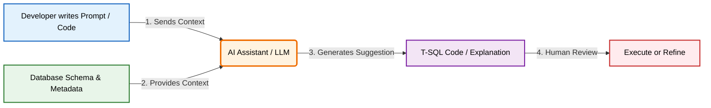
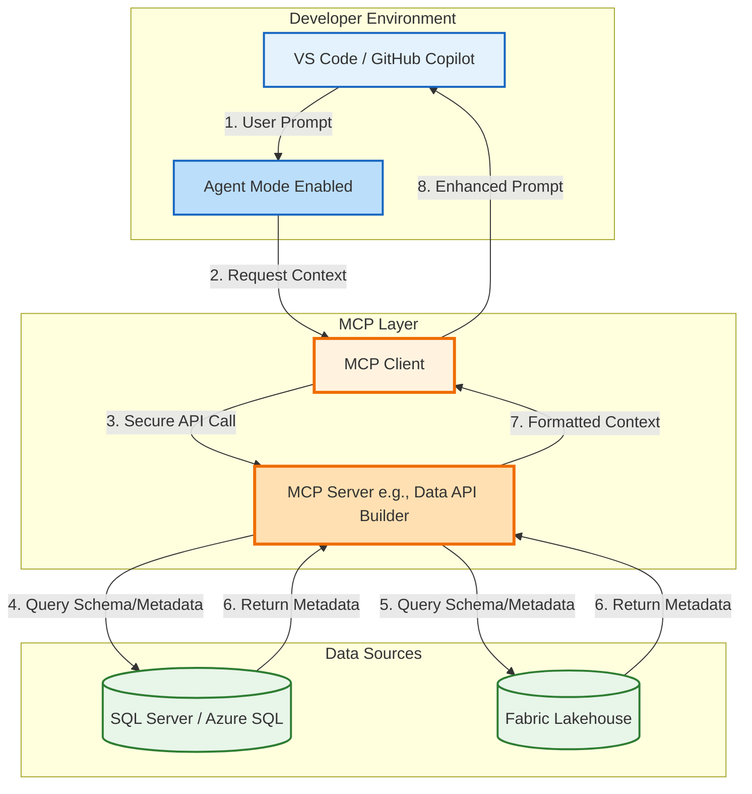

# Microsoft Certified: SQL AI Developer Associate (DP-800) - AI-Assisted Tools Study Guide

## 📋 Table of Contents
1. [Overview of AI-Assisted Development Tools](#1-overview-of-ai-assisted-development-tools)
2. [Security & Responsible AI Considerations](#2-security--responsible-ai-considerations)
3. [Enabling GitHub Copilot & Fabric Copilot](#3-enabling-github-copilot--fabric-copilot)
4. [Model Context Protocol (MCP)](#4-model-context-protocol-mcp)
5. [Custom Instruction Files & Prompting](#5-custom-instruction-files--prompting)
6. [Hands-On Lab Walkthrough](#6-hands-on-lab-walkthrough)
7. [55+ DP-800 Practice Questions](#7-55-dp-800-practice-questions)

---

## 1. Overview of AI-Assisted Development Tools

### What are they?
AI-assisted development tools (like **GitHub Copilot** and **Fabric Copilot**) leverage Large Language Models (LLMs) to understand your database context, schema, and natural language prompts to generate, explain, and optimize T-SQL code in real time.

### Why use them?
- **Accelerate Development**: Generate boilerplate T-SQL, stored procedures, and views instantly.
- **Contextual Awareness**: Unlike generic chatbots, these tools understand your specific database schema when connected properly.
- **Knowledge Transfer**: Explain complex, legacy recursive CTEs or obscure query plans to new team members.
- **Query Optimization**: Get instant suggestions to replace comma-separated joins with ANSI joins or add missing indexes.

### How they work (The Workflow)


### When to use them?
- Writing initial drafts of complex queries, views, or stored procedures.
- Refactoring legacy code to meet modern T-SQL standards.
- Generating unit tests or sample data for new tables.

### 💡 Fun Fact
GitHub Copilot in SQL Server Management Studio (SSMS) requires **SSMS version 22 or later**. Older versions do not have the native AI Assistance workload!

---

## 2. Security & Responsible AI Considerations

### What is the security impact?
When using AI tools, your code, schema metadata, and natural language prompts are sent to cloud-based AI models for processing. 

### Why does this matter?
If your database contains PII (Personally Identifiable Information), PHI (Protected Health Information), or financial data, sending schema details or sample data to an external AI service might violate compliance frameworks (GDPR, HIPAA) or expose intellectual property.

### How to secure AI-assisted development:
1. **Never hardcode credentials**: Use environment variables or parameterized inputs.
2. **Principle of Least Privilege**: When connecting AI to a database (via MCP), use a read-only service account just for schema metadata.
3. **Human Review**: Treat AI-generated code as a **first draft**. Always review `GRANT` statements, dynamic SQL, and `SELECT *` usage before execution.
4. **Enterprise Data Protection**: GitHub Copilot for Business/Enterprise guarantees that your prompts and code are **not** used to train the underlying public AI models.

### When to restrict AI usage?
- When working in highly regulated environments where *any* schema metadata leaving the corporate network is prohibited.
- When generating dynamic SQL that concatenates user input (high risk of AI suggesting SQL injection vulnerabilities if not carefully prompted).

### 💡 Fun Fact
GitHub Copilot includes built-in **content filtering** that actively blocks suggestions containing known security anti-patterns, such as hardcoded passwords or obvious SQL injection vectors!

---

## 3. Enabling GitHub Copilot & Fabric Copilot

### What is the setup process?
Enabling AI tools varies slightly depending on whether you are using SSMS, Visual Studio Code (VS Code), or the Microsoft Fabric portal.

### How to Enable

#### A. SQL Server Management Studio (SSMS 22+)
1. Open **Visual Studio Installer**.
2. Locate SSMS, click **Modify**.
3. Under the **Workloads** tab, check **AI Assistance**.
4. Click **Modify** to install.
5. In SSMS, click the Copilot badge (top right) → **Open Chat Window** → Sign in with your GitHub account.

#### B. Visual Studio Code
1. Install the **GitHub Copilot** and **GitHub Copilot Chat** extensions.
2. Install the **SQL Server (mssql)** extension by Microsoft.
3. Sign in to GitHub via the Accounts icon.
4. Connect to your database using the MSSQL extension.
5. Right-click the connected database → **Chat with this database**.

#### C. Microsoft Fabric
1. **Tenant Level**: Fabric Admin must enable "Users can use Copilot and other features powered by Azure OpenAI".
2. **Workspace Level**: Open a SQL database or Notebook in Fabric.
3. Click the **Copilot** icon in the toolbar to start a natural language chat.

### 💡 Fun Fact
In VS Code, you can right-click any connected database in the MSSQL extension sidebar and select **"Chat with this database"**. This automatically injects your live schema into the Copilot Chat context without needing complex MCP setups!

---

## 4. Model Context Protocol (MCP)

### What is MCP?
The **Model Context Protocol (MCP)** is an open standard that allows AI assistants to connect *directly* to external data sources and tools. Instead of relying only on the text visible in your editor, MCP lets the AI query your live database schema, metadata, or even sample data in real time.

### Why use MCP?
Generic AI guesses your column names. MCP-enabled AI *knows* your column names, data types, and foreign key relationships, resulting in highly accurate, executable T-SQL on the first try.

### How to Configure MCP in VS Code
MCP uses a client-server architecture. You configure it via a `.vscode/mcp.json` file in your workspace.

```json
{
  "servers": {
    "sql-server-mcp": {
      "type": "http",
      "url": "https://your-mcp-endpoint.azurewebsites.net/mcp",
      "headers": {
        "Authorization": "Bearer ${input:azure_token}"
      }
    }
  },
  "inputs": [
    {
      "id": "azure_token",
      "type": "promptString",
      "description": "Enter Azure Access Token",
      "password": true
    }
  ]
}
```
*Commentary*: 
- `type`: Defines how VS Code connects (HTTP or Stdio).
- `inputs`: Securely prompts the user for credentials at runtime, preventing hardcoded secrets in source control.

### MCP Architecture Intuition


### When to use MCP?
- When working with large, complex databases where keeping schema context in the editor is impossible.
- When building AI agents that need to autonomously explore database structures before writing code.

### 💡 Fun Fact
Microsoft's open-source **Data API builder (DAB)** is the recommended engine for hosting SQL MCP servers, providing a secure, managed layer between the AI and your database!

---

## 5. Custom Instruction Files & Prompting

### What are Instruction Files?
Markdown files that define rules, coding standards, and preferences for GitHub Copilot. Copilot reads these automatically, ensuring generated code aligns with your team's specific style guide.

### Why use them?
Without instructions, Copilot might generate `SELECT *`, omit schema prefixes, or use outdated T-SQL syntax. Instruction files enforce consistency across the entire team.

### How to Create Them
There are two primary types of files:

#### 1. Repository Instructions (`copilot-instructions.md`)
Placed in the `.github/` folder at the root of your repository. Applies globally to all Copilot interactions in that repo.

```markdown
# .github/copilot-instructions.md

## T-SQL Development Standards
- **Naming**: Tables are PascalCase singular (e.g., `Customer`). Stored procedures use `usp_ActionEntity` (e.g., `usp_GetCustomerOrders`).
- **Style**: ALWAYS use explicit column lists (NO `SELECT *`). ALWAYS include schema prefix (e.g., `SalesLT.Customer`).
- **Performance**: Use `SET NOCOUNT ON` in all stored procedures. Prefer `EXISTS` over `COUNT()` for existence checks.
- **Security**: Never generate dynamic SQL without `sp_executesql` parameterization.
```

#### 2. Reusable Prompt Files (`.prompt.md`)
Placed in the `.github/prompts/` folder. These are templates you can invoke in chat using `#`.

```markdown
# .github/prompts/create-procedure.prompt.md

# Create Stored Procedure Template
Generate a stored procedure with:
- Name: {{procedureName}}
- Purpose: {{description}}
- Parameters: {{parameters}}

Requirements:
1. Include `SET NOCOUNT ON;`
2. Wrap logic in `BEGIN TRY ... BEGIN CATCH`
3. Use explicit `BEGIN TRANSACTION` and `COMMIT`
```

### When to use them?
- Onboarding new developers to enforce team standards automatically.
- Standardizing error handling, naming conventions, and security practices across all generated code.

### 💡 Fun Fact
You can reference a prompt file directly in VS Code Copilot Chat by typing `#` followed by the prompt file name (e.g., `#create-procedure`), and Copilot will auto-fill the template structure for you!

---

## 6. Hands-On Lab Walkthrough

The provided lab walks through a real-world scenario: accelerating T-SQL development using Copilot in VS Code.

### Key Steps & Intuition:
1. **Provision Azure SQL**: Creates a safe, isolated `AdventureWorksLT` environment.
2. **VS Code Setup**: Installs `GitHub Copilot`, `Copilot Chat`, and `mssql` extensions.
3. **Database Connection**: The `mssql` extension establishes the live schema context.
4. **Instruction File Creation**: Creating `.github/copilot-instructions.md` ensures Copilot doesn't suggest bad habits (like `SELECT *`).
5. **Generating a Stored Procedure**: 
   - *Prompt*: "Create `usp_GetCustomerOrderSummary` with optional `@CustomerID`, joining Customer, OrderHeader, and OrderDetail, with TRY...CATCH."
   - *Intuition*: Copilot reads the instruction file, applies the `usp_` prefix, adds `SET NOCOUNT ON`, and writes the `TRY...CATCH` block automatically.
6. **Explaining Legacy Code**: Highlighting a complex recursive CTE view and asking Copilot to explain it demystifies legacy code instantly.
7. **Query Optimization**: Pasting a legacy comma-join query (`FROM A, B, C WHERE...`) and asking for optimization prompts Copilot to refactor it into modern `INNER JOIN` syntax with explicit columns.

---

## 7. 55+ DP-800 Practice Questions

### Topic: AI-Assisted Tools Overview
**Q1.** Which AI assistant is natively integrated into Microsoft Fabric workspaces for data engineering and SQL analytics?
- A) GitHub Copilot
- B) Fabric Copilot
- C) Azure OpenAI Studio
- D) SQL Server Agent
<details><summary><strong>Answer</strong></summary><strong>B) Fabric Copilot</strong>. It is built directly into the Fabric portal for workspace-specific data tasks.</details>

**Q2.** What is the primary benefit of using AI-assisted tools for database development?
- A) They completely eliminate the need for human code review.
- B) They automatically deploy code to production without testing.
- C) They provide contextual code suggestions, explanations, and optimization recommendations.
- D) They replace the need for database administrators.
<details><summary><strong>Answer</strong></summary><strong>C) They provide contextual code suggestions, explanations, and optimization recommendations.</strong></details>

**Q3.** Which development environment is NOT officially supported for native GitHub Copilot integration for SQL development?
- A) Visual Studio Code
- B) SQL Server Management Studio (SSMS) 22+
- C) Visual Studio 2022
- D) Notepad++
<details><summary><strong>Answer</strong></summary><strong>D) Notepad++</strong>. SSMS 22+, VS Code, and Visual Studio are the supported environments.</details>

**Q4.** When GitHub Copilot suggests a T-SQL query, what should be your immediate next step?
- A) Execute it immediately in production.
- B) Copy it directly to source control.
- C) Review and validate the code for security, performance, and business logic accuracy.
- D) Assume it is 100% error-free.
<details><summary><strong>Answer</strong></summary><strong>C) Review and validate the code.</strong> AI-generated code is a first draft and requires human review.</details>

**Q5.** What role does the database schema play when using GitHub Copilot?
- A) It is ignored; Copilot only uses generic SQL knowledge.
- B) It provides context so Copilot can suggest accurate table and column names.
- C) It is permanently stored in the AI model's training data.
- D) It slows down the AI response time significantly.
<details><summary><strong>Answer</strong></summary><strong>B) It provides context so Copilot can suggest accurate table and column names.</strong></details>

---

### Topic: Security & Responsible AI
**Q6.** What is a major security risk when using AI-assisted tools in database development?
- A) AI tools generate code too slowly.
- B) AI-generated code might inadvertently expose sensitive data or suggest SQL injection vulnerabilities if not reviewed.
- C) AI tools require too much disk space.
- D) AI tools cannot connect to Azure SQL.
<details><summary><strong>Answer</strong></summary><strong>B) AI-generated code might inadvertently expose sensitive data or suggest SQL injection vulnerabilities if not reviewed.</strong></details>

**Q7.** How should database credentials be handled when working with AI-assisted tools?
- A) Paste them into the Copilot Chat to help it connect.
- B) Hardcode them in the `.sql` files for easy access.
- C) Store them in environment variables or secure vaults, never in AI-visible files or prompts.
- D) Share them in the `copilot-instructions.md` file.
<details><summary><strong>Answer</strong></summary><strong>C) Store them in environment variables or secure vaults, never in AI-visible files or prompts.</strong></details>

**Q8.** For enterprise users, how does GitHub handle the data sent to GitHub Copilot?
- A) It is used to train the public base models.
- B) It is sold to third-party data brokers.
- C) Prompts and code are not used to train the underlying AI models, and data is encrypted in transit and at rest.
- D) It is stored in plain text on public GitHub repositories.
<details><summary><strong>Answer</strong></summary><strong>C) Prompts and code are not used to train the underlying AI models, and data is encrypted in transit and at rest.</strong></details>

**Q9.** When Copilot suggests a `GRANT` statement, what should you verify?
- A) That it grants permissions to the `public` role for maximum compatibility.
- B) That the permissions align with the principle of least privilege.
- C) That it grants `sysadmin` rights to the application user.
- D) Nothing, AI always gets permissions right.
<details><summary><strong>Answer</strong></summary><strong>B) That the permissions align with the principle of least privilege.</strong></details>

**Q10.** Why is it dangerous to let AI generate dynamic SQL without review?
- A) Dynamic SQL is deprecated in SQL Server 2025.
- B) It might be vulnerable to SQL injection if user input is concatenated instead of parameterized via `sp_executesql`.
- C) It runs slower than static SQL.
- D) AI cannot write dynamic SQL.
<details><summary><strong>Answer</strong></summary><strong>B) It might be vulnerable to SQL injection if user input is concatenated instead of parameterized.</strong></details>

**Q11.** What compliance consideration is critical when using AI tools on a healthcare database?
- A) Ensuring the AI tool has a colorful UI.
- B) Ensuring no Protected Health Information (PHI) or PII is unnecessarily processed or exposed to the AI service.
- C) Using the AI tool to replace all manual HIPAA audits.
- D) Allowing the AI tool unrestricted access to all tables.
<details><summary><strong>Answer</strong></summary><strong>B) Ensuring no Protected Health Information (PHI) or PII is unnecessarily processed or exposed to the AI service.</strong></details>

**Q12.** When configuring an MCP server for AI schema access, what is the best practice for the database account used?
- A) Use the `sa` (system administrator) account for unrestricted access.
- B) Use a dedicated service account with read-only access to schema metadata (least privilege).
- C) Use a guest account with no permissions.
- D) Do not use authentication; rely on network obscurity.
<details><summary><strong>Answer</strong></summary><strong>B) Use a dedicated service account with read-only access to schema metadata.</strong></details>

**Q13.** Which GitHub Copilot feature helps prevent the generation of harmful code patterns?
- A) Content filtering
- B) Auto-deployment
- C) Schema caching
- D) Query rewriting
<details><summary><strong>Answer</strong></summary><strong>A) Content filtering</strong> actively blocks suggestions that match known security anti-patterns.</details>

**Q14.** What should an organization do to maintain control over AI tool usage?
- A) Ban all AI tools permanently.
- B) Configure organization-level policies in GitHub Enterprise to control repository access and usage.
- C) Let every developer choose their own AI tools without oversight.
- D) Disable all network firewalls.
<details><summary><strong>Answer</strong></summary><strong>B) Configure organization-level policies in GitHub Enterprise to control repository access and usage.</strong></details>

---

### Topic: Enabling & Setup
**Q15.** What is the minimum version of SQL Server Management Studio (SSMS) required for native GitHub Copilot support?
- A) SSMS 18
- B) SSMS 19
- C) SSMS 20
- D) SSMS 22
<details><summary><strong>Answer</strong></summary><strong>D) SSMS 22</strong>. Native AI Assistance was introduced in SSMS 22.</details>

**Q16.** In Visual Studio Code, which extension is required to connect to and chat with a SQL database alongside GitHub Copilot?
- A) Python
- B) SQL Server (mssql) by Microsoft
- C) Docker
- D) Azure Functions
<details><summary><strong>Answer</strong></summary><strong>B) SQL Server (mssql) by Microsoft</strong>. This provides the database connection context for Copilot.</details>

**Q17.** How do you install the GitHub Copilot workload in SSMS?
- A) Download it from the SSMS website.
- B) Use the Visual Studio Installer, locate SSMS, click Modify, and check "AI Assistance".
- C) Run a T-SQL script `INSTALL COPILOT`.
- D) It is installed by default in all versions.
<details><summary><strong>Answer</strong></summary><strong>B) Use the Visual Studio Installer, locate SSMS, click Modify, and check "AI Assistance".</strong></details>

**Q18.** What tenant-level setting must a Fabric Administrator enable for users to use Fabric Copilot?
- A) "Allow public internet access"
- B) "Users can use Copilot and other features powered by Azure OpenAI"
- C) "Disable all AI features"
- D) "Enable legacy SQL endpoints"
<details><summary><strong>Answer</strong></summary><strong>B) "Users can use Copilot and other features powered by Azure OpenAI"</strong>.</details>

**Q19.** In VS Code, what is the keyboard shortcut to open the Copilot Chat panel?
- A) Ctrl+Shift+P
- B) Ctrl+Alt+I
- C) F5
- D) Ctrl+S
<details><summary><strong>Answer</strong></summary><strong>B) Ctrl+Alt+I</strong> (Windows/Linux) or Cmd+Option+I (macOS).</details>

**Q20.** If Copilot is not providing contextual suggestions about your database in VS Code, what should you check first?
- A) Your monitor brightness.
- B) That the MSSQL extension is connected to the database and the connection is active.
- C) That you have uninstalled the Copilot extension.
- D) That the database is turned off.
<details><summary><strong>Answer</strong></summary><strong>B) That the MSSQL extension is connected to the database and the connection is active.</strong></details>

**Q21.** What does the GitHub Copilot status icon in the upper-right corner of SSMS indicate?
- A) The number of rows in the database.
- B) Whether Copilot is active, inactive, unavailable, or not installed.
- C) The current CPU usage of the SQL Server.
- D) The version of T-SQL being used.
<details><summary><strong>Answer</strong></summary><strong>B) Whether Copilot is active, inactive, unavailable, or not installed.</strong></details>

**Q22.** To use GitHub Copilot, what type of account is required?
- A) A local Windows account only.
- B) A GitHub account with an active Copilot subscription (Individual, Business, or Enterprise).
- C) A Microsoft Entra ID account without GitHub linkage.
- D) An anonymous guest account.
<details><summary><strong>Answer</strong></summary><strong>B) A GitHub account with an active Copilot subscription.</strong></details>

**Q23.** In Fabric, where do you typically find the Copilot interface when working with a SQL database?
- A) In the Azure Portal.
- B) In the query editor toolbar within the Fabric workspace.
- C) In SQL Server Configuration Manager.
- D) In the Windows Start Menu.
<details><summary><strong>Answer</strong></summary><strong>B) In the query editor toolbar within the Fabric workspace.</strong></details>

**Q24.** What is the purpose of the "Chat with this database" context menu option in VS Code?
- A) To delete the database.
- B) To initiate a schema-aware conversation with Copilot about the specific connected database.
- C) To export the database to Excel.
- D) To restart the SQL Server service.
<details><summary><strong>Answer</strong></summary><strong>B) To initiate a schema-aware conversation with Copilot about the specific connected database.</strong></details>

---

### Topic: Model Context Protocol (MCP)
**Q25.** What does MCP stand for in the context of AI-assisted development?
- A) Microsoft Cloud Protocol
- B) Model Context Protocol
- C) Managed Connection Pool
- D) Multi-tenant Compute Platform
<details><summary><strong>Answer</strong></summary><strong>B) Model Context Protocol</strong>.</details>

**Q26.** What is the primary purpose of the Model Context Protocol (MCP)?
- A) To compress database files.
- B) To allow AI assistants to connect directly to external data sources and tools for real-time context.
- C) To encrypt T-SQL scripts.
- D) To replace the need for SQL Server.
<details><summary><strong>Answer</strong></summary><strong>B) To allow AI assistants to connect directly to external data sources and tools for real-time context.</strong></details>

**Q27.** In the MCP architecture, what is the role of the "MCP Server"?
- A) It is the AI model itself.
- B) It is a service that exposes specific data sources or tools to the AI assistant.
- C) It is the Visual Studio Code editor.
- D) It is the user's web browser.
<details><summary><strong>Answer</strong></summary><strong>B) It is a service that exposes specific data sources or tools to the AI assistant.</strong></details>

**Q28.** Which VS Code mode must be enabled to allow GitHub Copilot to use external MCP tools?
- A) Ask mode
- B) Edit mode
- C) Agent mode
- D) Preview mode
<details><summary><strong>Answer</strong></summary><strong>C) Agent mode</strong>. Agent mode allows Copilot to use external tools, including MCP servers.</details>

**Q29.** Where is the MCP server configuration stored in a Visual Studio Code workspace?
- A) In the `package.json` file.
- B) In the `.vscode/mcp.json` file.
- C) In the Windows Registry.
- D) In the `launch.json` file.
<details><summary><strong>Answer</strong></summary><strong>B) In the `.vscode/mcp.json` file.</strong></details>

**Q30.** Microsoft's open-source solution for building SQL MCP servers is built on top of which technology?
- A) Entity Framework
- B) Data API builder (DAB)
- C) Azure DevOps
- D) Power BI Desktop
<details><summary><strong>Answer</strong></summary><strong>B) Data API builder (DAB)</strong>.</details>

**Q31.** How can you expose a Fabric Lakehouse or Warehouse to an external MCP client?
- A) By downloading the data to a local CSV.
- B) By creating and publishing a Data Agent in the Fabric workspace, then copying its MCP server URL from Settings.
- C) By granting public internet access to the Lakehouse.
- D) Fabric does not support MCP.
<details><summary><strong>Answer</strong></summary><strong>B) By creating and publishing a Data Agent in the Fabric workspace, then copying its MCP server URL from Settings.</strong></details>

**Q32.** What is a recommended authentication method for MCP servers in automated or shared environments?
- A) Hardcoded plaintext passwords.
- B) Service principals (Microsoft Entra ID applications) with appropriate permissions.
- C) Anonymous access.
- D) Sharing personal GitHub passwords.
<details><summary><strong>Answer</strong></summary><strong>B) Service principals (Microsoft Entra ID applications) with appropriate permissions.</strong></details>

**Q33.** If an MCP connection results in "Empty schema results", what is the most likely cause?
- A) The AI model is turned off.
- B) Insufficient database permissions for the authenticated user.
- C) The database is too large.
- D) The MCP server is running too fast.
<details><summary><strong>Answer</strong></summary><strong>B) Insufficient database permissions for the authenticated user.</strong></details>

**Q34.** Why should you use separate MCP endpoints for development, test, and production?
- A) To make the configuration files longer.
- B) To prevent AI assistants from accidentally querying or suggesting changes against live production data during routine development.
- C) Because MCP only works in development.
- D) There is no reason; they should all be the same.
<details><summary><strong>Answer</strong></summary><strong>B) To prevent AI assistants from accidentally querying or suggesting changes against live production data during routine development.</strong></details>

---

### Topic: Custom Instruction Files & Prompting
**Q35.** What is the exact filename for a repository-level GitHub Copilot instruction file?
- A) `instructions.txt`
- B) `copilot-rules.json`
- C) `copilot-instructions.md`
- D) `ai-config.xml`
<details><summary><strong>Answer</strong></summary><strong>C) `copilot-instructions.md`</strong>.</details>

**Q36.** Where should the `copilot-instructions.md` file be placed in a repository?
- A) In the root directory.
- B) In the `.github` folder at the repository root.
- C) In the `src` folder.
- D) In the `.vscode` folder.
<details><summary><strong>Answer</strong></summary><strong>B) In the `.github` folder at the repository root.</strong></details>

**Q37.** What is the purpose of a `.prompt.md` file in the `.github/prompts/` directory?
- A) To store database connection strings.
- B) To define reusable prompt templates for specific tasks (e.g., creating a stored procedure).
- C) To log AI usage metrics.
- D) To replace the `copilot-instructions.md` file.
<details><summary><strong>Answer</strong></summary><strong>B) To define reusable prompt templates for specific tasks.</strong></details>

**Q38.** How do you reference a reusable prompt file in VS Code Copilot Chat?
- A) By typing `@prompt`
- B) By typing `#` followed by the prompt file name (e.g., `#create-procedure`).
- C) By copying and pasting the entire file contents.
- D) By restarting VS Code.
<details><summary><strong>Answer</strong></summary><strong>B) By typing `#` followed by the prompt file name.</strong></details>

**Q39.** Which of the following is a BEST practice for writing `copilot-instructions.md`?
- A) Be vague so the AI can be creative.
- B) Be specific, provide code examples of desired patterns, and prioritize the most important rules.
- C) Write it in a compiled language like C++.
- D) Never update it once created.
<details><summary><strong>Answer</strong></summary><strong>B) Be specific, provide code examples of desired patterns, and prioritize the most important rules.</strong></details>

**Q40.** If your team decides to change its stored procedure naming convention, what should you do?
- A) Tell the developers to remember the new rule.
- B) Update the `copilot-instructions.md` file to reflect the new standard so future AI suggestions align.
- C) Disable GitHub Copilot permanently.
- D) Rename all existing procedures manually without updating documentation.
<details><summary><strong>Answer</strong></summary><strong>B) Update the `copilot-instructions.md` file to reflect the new standard.</strong></details>

**Q41.** In a custom instruction file, how should you specify that dynamic SQL must be secure?
- A) "Make sure dynamic SQL is safe."
- B) "Never generate dynamic SQL without using `sp_executesql` with properly parameterized inputs."
- C) "Dynamic SQL is forbidden."
- D) "Use dynamic SQL whenever possible."
<details><summary><strong>Answer</strong></summary><strong>B) "Never generate dynamic SQL without using `sp_executesql` with properly parameterized inputs."</strong> Specificity yields better AI results.</details>

**Q42.** Can custom instruction files be version-controlled?
- A) No, they are stored locally on the developer's machine only.
- B) Yes, they should be committed to Git to track changes and share standards across the team.
- C) Only if they are encrypted.
- D) GitHub does not allow versioning of markdown files.
<details><summary><strong>Answer</strong></summary><strong>B) Yes, they should be committed to Git to track changes and share standards across the team.</strong></details>

**Q43.** What happens if you put conflicting rules in your `copilot-instructions.md` file?
- A) Copilot will crash.
- B) Copilot may produce inconsistent results; it's best to keep rules clear, prioritized, and non-contradictory.
- C) Copilot will automatically choose the shortest rule.
- D) The file will be deleted.
<details><summary><strong>Answer</strong></summary><strong>B) Copilot may produce inconsistent results; it's best to keep rules clear, prioritized, and non-contradictory.</strong></details>

---

### Topic: Query Optimization & Copilot Usage
**Q44.** You paste a legacy query using comma-separated tables (`FROM A, B WHERE A.id = B.id`) into Copilot Chat. What optimization should you expect it to suggest?
- A) Convert it to explicit ANSI `INNER JOIN` syntax.
- B) Add more comma-separated tables.
- C) Remove the `WHERE` clause.
- D) Convert the query to XML.
<details><summary><strong>Answer</strong></summary><strong>A) Convert it to explicit ANSI `INNER JOIN` syntax.</strong></details>

**Q45.** Why is it beneficial to ask Copilot to "Explain this code" when reviewing a complex recursive CTE?
- A) It deletes the code.
- B) It helps developers understand the logic, anchor member, and recursive member without manually tracing the execution.
- C) It automatically optimizes the CTE without human review.
- D) It converts the CTE into a physical table.
<details><summary><strong>Answer</strong></summary><strong>B) It helps developers understand the logic, anchor member, and recursive member without manually tracing the execution.</strong></details>

**Q46.** When asking Copilot to generate a stored procedure, what key element should your prompt include to ensure robustness?
- A) A request to use `SELECT *`.
- B) A request to include `TRY...CATCH` error handling and `SET NOCOUNT ON`.
- C) A request to hardcode the server name.
- D) A request to omit comments.
<details><summary><strong>Answer</strong></summary><strong>B) A request to include `TRY...CATCH` error handling and `SET NOCOUNT ON`.</strong></details>

**Q47.** If Copilot suggests a query with `SELECT *`, how should you respond based on best practices?
- A) Accept it as is.
- B) Refine the prompt or manually edit the code to specify explicit column names, improving performance and maintainability.
- C) Delete the database.
- D) Assume `SELECT *` is required for AI to work.
<details><summary><strong>Answer</strong></summary><strong>B) Refine the prompt or manually edit the code to specify explicit column names.</strong></details>

**Q48.** What is the benefit of using the "Agent mode" in VS Code Copilot Chat for database tasks?
- A) It allows the AI to autonomously use tools (like MCP) to gather schema context before answering.
- B) It writes code faster than Ask mode.
- C) It bypasses all security checks.
- D) It only works with Python, not SQL.
<details><summary><strong>Answer</strong></summary><strong>A) It allows the AI to autonomously use tools (like MCP) to gather schema context before answering.</strong></details>

**Q49.** You want Copilot to generate a view that aggregates sales data. What should you verify in the generated code?
- A) That it uses `GROUP BY` correctly and does not include non-aggregated columns in the `SELECT` list.
- B) That it uses a cursor.
- C) That it updates the base tables.
- D) That it contains a `DROP TABLE` statement.
<details><summary><strong>Answer</strong></summary><strong>A) That it uses `GROUP BY` correctly and does not include non-aggregated columns in the `SELECT` list.</strong></details>

**Q50.** How can Copilot assist with database performance tuning?
- A) By physically adding indexes to the database without permission.
- B) By analyzing a query and suggesting missing indexes, better join strategies, or pointing out SARGable issues.
- C) By deleting large tables.
- D) By changing the SQL Server edition.
<details><summary><strong>Answer</strong></summary><strong>B) By analyzing a query and suggesting missing indexes, better join strategies, or pointing out SARGable issues.</strong></details>

**Q51.** When generating a data migration script with Copilot, what is a critical security check?
- A) Ensure the script does not contain hardcoded credentials or sensitive sample data.
- B) Ensure the script is written in French.
- C) Ensure the script uses the `sa` account.
- D) Ensure the script has no comments.
<details><summary><strong>Answer</strong></summary><strong>A) Ensure the script does not contain hardcoded credentials or sensitive sample data.</strong></details>

**Q52.** What is the role of the `{{parameter}}` syntax in a `.prompt.md` file?
- A) It is a T-SQL variable.
- B) It acts as a placeholder that the developer can fill in when invoking the prompt template.
- C) It is a JSON formatting error.
- D) It tells Copilot to ignore the line.
<details><summary><strong>Answer</strong></summary><strong>B) It acts as a placeholder that the developer can fill in when invoking the prompt template.</strong></details>

**Q53.** If an MCP server connection times out, what is the most appropriate troubleshooting step?
- A) Reinstall Windows.
- B) Check firewall rules, network access, and ensure the MCP endpoint URL is correct and reachable.
- C) Increase the `MAXRECURSION` limit.
- D) Switch to a different AI model.
<details><summary><strong>Answer</strong></summary><strong>B) Check firewall rules, network access, and ensure the MCP endpoint URL is correct and reachable.</strong></details>

**Q54.** Which of the following is a valid reason to use Fabric Copilot over GitHub Copilot for a specific task?
- A) You need to write a complex C++ application.
- B) You are working directly inside the Microsoft Fabric portal and want to quickly explore lakehouse data or generate a SQL query without leaving the browser.
- C) You want to edit the `mcp.json` file.
- D) You need to install SSMS extensions.
<details><summary><strong>Answer</strong></summary><strong>B) You are working directly inside the Microsoft Fabric portal and want to quickly explore lakehouse data or generate a SQL query without leaving the browser.</strong></details>

**Q55.** True or False: GitHub Copilot can completely replace the need for a Database Administrator (DBA) to review execution plans and security configurations.
- A) True
- B) False
<details><summary><strong>Answer</strong></summary><strong>B) False</strong>. Copilot is an assistant, not a replacement. Human expertise is still required for final validation, performance tuning, and security governance.</details>

---

## 🎯 Final Exam Tips for DP-800 AI Tools Domain
1. **Memorize the file names and paths**: `.github/copilot-instructions.md` and `.github/prompts/*.prompt.md`.
2. **Know the MCP architecture**: Host → Client → Server → Data Source.
3. **Security is paramount**: Always choose the answer that mentions "human review", "least privilege", "no hardcoded credentials", or "not used for training" (for Enterprise).
4. **SSMS Version**: Remember that native Copilot requires **SSMS 22**.
5. **Agent Mode**: This is the specific VS Code mode required to unlock MCP tool usage.

*Best of luck with your DP-800 certification! You are well on your way to becoming a SQL AI Developer Associate!* 🚀
