# DP-800 Security and Compliance with Microsoft SQL

> Detailed study notes based on the supplied learning module, with exam-focused comparisons, commented T-SQL and configuration examples, colourful Mermaid diagrams, worked scenarios, memory aids, and **60 practice questions with explained answers**.

---

## Table of contents

1. [Learning objectives](#1-learning-objectives)
2. [The security mindset: defense in depth](#2-the-security-mindset-defense-in-depth)
3. [Data encryption](#3-data-encryption)
4. [Dynamic Data Masking](#4-dynamic-data-masking)
5. [Row-Level Security](#5-row-level-security)
6. [Permissions, roles, schemas, and secure identity](#6-permissions-roles-schemas-and-secure-identity)
7. [Database auditing](#7-database-auditing)
8. [Securing AI model endpoints](#8-securing-ai-model-endpoints)
9. [Securing GraphQL, REST, and MCP endpoints](#9-securing-graphql-rest-and-mcp-endpoints)
10. [Network security](#10-network-security)
11. [Integrated implementation lab](#11-integrated-implementation-lab)
12. [DP-800 decision guide and exam traps](#12-dp-800-decision-guide-and-exam-traps)
13. [Rapid revision sheet](#13-rapid-revision-sheet)
14. [Practice set: 60 questions with explanations](#14-practice-set-60-questions-with-explanations)

---

## 1. Learning objectives

After studying these notes, you should be able to:

- choose between Transparent Data Encryption (TDE), Always Encrypted, and column-level encryption;
- configure and reason about Dynamic Data Masking (DDM);
- design Row-Level Security (RLS) with filter and block predicates;
- implement least-privilege permissions with schemas and database roles;
- distinguish SQL authentication, Microsoft Entra authentication, and Managed Identity;
- configure auditing and choose suitable audit events, destinations, and retention policies;
- protect calls to Azure OpenAI and Azure Machine Learning endpoints;
- secure GraphQL, REST, and Model Context Protocol (MCP) endpoints;
- combine these controls into a defense-in-depth design.

### What DP-800 questions usually test

Security questions are often **decision questions**, not syntax-recall questions. Look for four clues:

1. **What asset must be protected?** Files, columns, rows, an object, credentials, an endpoint, or logs.
2. **From whom?** Storage thieves, unauthorized employees, database administrators, other tenants, anonymous users, or a compromised AI agent.
3. **At which stage?** At rest, in transit, in use, or in query results.
4. **What constraint matters?** No application changes, equality searches, passwordless access, minimum privilege, immutable evidence, or low operational effort.

---

## 2. The security mindset: defense in depth

### What is defense in depth?

Defense in depth means using several independent controls so that the failure of one control does not expose the entire system. Each layer solves a different problem:

- **Encryption** protects the meaning of data.
- **Masking** reduces sensitive values shown in query results.
- **RLS** restricts which rows are visible or modifiable.
- **Permissions** restrict which objects and operations are available.
- **Authentication** proves who or what is connecting.
- **Auditing** records security-relevant activity.
- **Endpoint and network controls** reduce the routes through which data can be reached.


### Core vocabulary

| Term | Meaning | Example |
|---|---|---|
| Authentication | Verifies identity | Microsoft Entra token proves the caller is an application identity |
| Authorization | Determines allowed actions | A role grants `SELECT` on the `Sales` schema |
| Principal | A user, login, role, group, or identity that receives permissions | `DataAnalystsGroup` |
| Securable | A resource on which permissions can be granted | Server, database, schema, table, procedure, or column |
| Least privilege | Grant only the minimum permissions required | Allow `EXECUTE` on one procedure, not `CONTROL` on the database |
| Separation of duties | Divide sensitive responsibilities | Administrators manage infrastructure while applications hold decryption access |
| Accountability | Make actions traceable | Audit records store principal, statement, object, and time |

### A useful risk model

No single formula completely measures cyber risk, but a useful exam intuition is:

$$
\text{Risk} \approx \text{Likelihood of compromise} \times \text{Impact of compromise}
$$

- Managed Identity reduces the likelihood of credential theft.
- Encryption reduces the impact of stolen files.
- RLS reduces the blast radius of an over-permissioned query.
- Auditing improves detection and investigation; it does not directly prevent access.

> **Exam memory aid:** Authenticate **who**, authorize **what**, filter **which rows**, mask **what is displayed**, encrypt **what is stored/processed**, and audit **what happened**.

---

## 3. Data encryption

### 3.1 Why encryption is needed

Encryption transforms plaintext into ciphertext using a key. Without the correct key, the ciphertext should be computationally impractical to reverse.

For an ideal key of $n$ bits, the theoretical key space contains:

$$
2^n \text{ possible keys}
$$

This explains why strong algorithms and protected keys matter. In practice, weak key storage can defeat strong encryption: an attacker who steals both the encrypted database and its accessible key may still decrypt the data.

### 3.2 Compare the three major approaches

| Feature | TDE | Always Encrypted | Column-level encryption |
|---|---|---|---|
| Main protection | Database files, logs, and backups at rest | Sensitive values throughout their lifecycle; database engine sees ciphertext | Selected values stored as ciphertext |
| Where encryption occurs | Database/storage layer | Supported client driver/application | Explicitly in T-SQL or application code |
| Where keys are kept | Database Encryption Key protected by a certificate/key hierarchy | Column Master Key outside the database; encrypted CEK metadata in database | Keys and certificates managed within the database hierarchy |
| Application changes | Usually none | Client driver/configuration required | Explicit encryption/decryption logic required |
| Protects from a privileged DBA reading query results? | No | Yes, when correctly configured | Not inherently; anyone able to open the key and decrypt can read it |
| Query flexibility | Normal queries | Limited; deterministic supports equality operations, randomized is more restricted | Depends on explicit decryption design |
| Best fit | Baseline encryption at rest and compliance | Highly sensitive data that must remain hidden from database administrators | Granular control with database-managed keys |

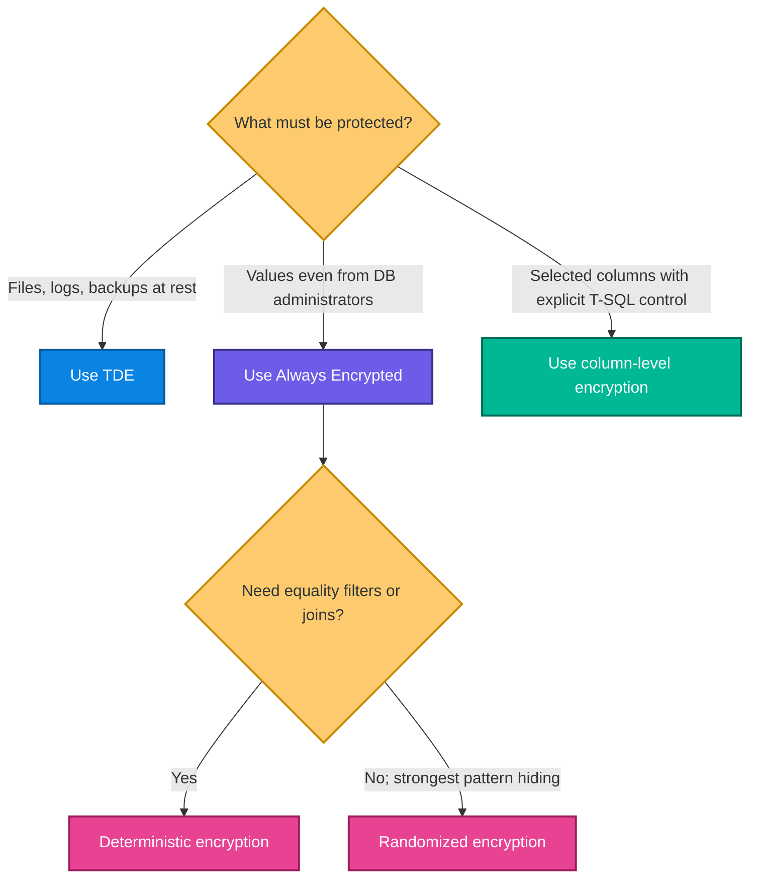

### 3.3 Transparent Data Encryption (TDE)

#### What?

TDE automatically encrypts database data files, transaction logs, and backups. Decryption occurs transparently when the database engine reads pages into memory.

#### Why?

If storage media or backup files are stolen, their contents remain unreadable without the encryption key hierarchy.

#### When?

Use TDE when the requirement says:

- “protect data at rest”;
- “encrypt database files and backups”;
- “avoid application changes”;
- “provide baseline compliance encryption.”

#### Critical limitation

TDE does **not** hide data from a user who authenticates successfully and has permission to query it. It protects storage, not authorized query results.

> In SQL databases in Microsoft Fabric, the supplied module states that TDE is enabled and managed automatically. Design effort therefore focuses more on column-level protection and access controls.

### 3.4 Always Encrypted

#### What?

Always Encrypted moves encryption and decryption to the client. The database engine stores and processes ciphertext and does not receive the plaintext or the Column Master Key (CMK).

#### Key hierarchy

- **Column Master Key (CMK):** Stored outside the database, such as in Azure Key Vault, Windows Certificate Store, or a hardware security module.
- **Column Encryption Key (CEK):** Encrypts data values. A protected form of the CEK is stored as database metadata.
- **CMK protects CEK; CEK protects column data.**

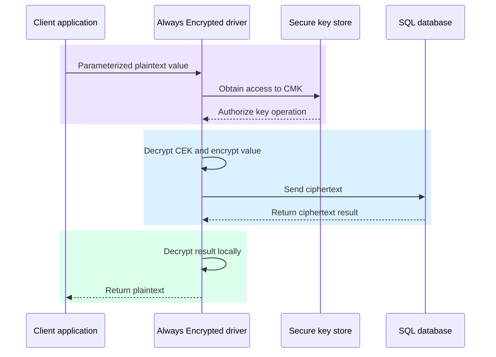

#### Create CMK metadata

```sql
-- This statement stores only metadata pointing to the real CMK.
-- The key material remains in Azure Key Vault.
CREATE COLUMN MASTER KEY MyCMK
WITH (
    KEY_STORE_PROVIDER_NAME = 'AZURE_KEY_VAULT',
    KEY_PATH = 'https://mykeyvault.vault.azure.net/keys/MyCMK/abc123'
);
```

#### Create a CEK

```sql
-- The CEK value stored in the database is already encrypted by MyCMK.
CREATE COLUMN ENCRYPTION KEY MyCEK
WITH VALUES (
    COLUMN_MASTER_KEY = MyCMK,
    ALGORITHM = 'RSA_OAEP',
    ENCRYPTED_VALUE = 0x01700000016C006F00... -- abbreviated encrypted bytes
);
```

#### Deterministic versus randomized encryption

| Property | Deterministic | Randomized |
|---|---|---|
| Same plaintext produces | Same ciphertext | Different ciphertext values |
| Information leakage | Repeated-value patterns may be visible | Repeated-value patterns are hidden better |
| Equality comparison | Supported | Generally not supported |
| Equality joins | Supported | Generally not supported |
| Typical use | IDs or values that must be matched exactly | Salaries or secrets that only need secure storage/retrieval |

```sql
CREATE TABLE Employees (
    EmployeeID int PRIMARY KEY,

    -- Deterministic encryption is chosen because the application may need
    -- to search for an exact SSN. BIN2 collation supports byte-wise matching.
    SSN char(11) COLLATE Latin1_General_BIN2
        ENCRYPTED WITH (
            ENCRYPTION_TYPE = DETERMINISTIC,
            ALGORITHM = 'AEAD_AES_256_CBC_HMAC_SHA_256',
            COLUMN_ENCRYPTION_KEY = MyCEK
        ),

    -- Randomized encryption is stronger against frequency analysis because
    -- equal salary values do not necessarily have equal ciphertext values.
    Salary money
        ENCRYPTED WITH (
            ENCRYPTION_TYPE = RANDOMIZED,
            ALGORITHM = 'AEAD_AES_256_CBC_HMAC_SHA_256',
            COLUMN_ENCRYPTION_KEY = MyCEK
        )
);
```

> **Exam trap:** “The database administrator must not see plaintext” strongly points to **Always Encrypted**, not TDE.

### 3.5 Column-level encryption with database-managed keys

This method uses a key hierarchy inside the database and explicit functions such as `ENCRYPTBYKEY` and `DECRYPTBYKEY`.

#### Key hierarchy and workflow

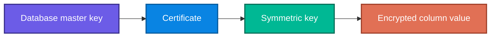

```sql
-- 1. Root key for the database key hierarchy.
CREATE MASTER KEY ENCRYPTION BY PASSWORD = 'Use-A-Secure-Secret-Here!';

-- 2. Certificate protects the symmetric key.
CREATE CERTIFICATE SensitiveDataCert
WITH SUBJECT = 'Certificate for sensitive data encryption';

-- 3. AES-256 symmetric key encrypts the actual data efficiently.
CREATE SYMMETRIC KEY SensitiveDataKey
WITH ALGORITHM = AES_256
ENCRYPTION BY CERTIFICATE SensitiveDataCert;
```

```sql
-- The symmetric key must be open in the session before ENCRYPTBYKEY is used.
OPEN SYMMETRIC KEY SensitiveDataKey
DECRYPTION BY CERTIFICATE SensitiveDataCert;

INSERT INTO dbo.CustomerData (CustomerID, CreditCardNumber)
VALUES (
    1,
    ENCRYPTBYKEY(
        KEY_GUID('SensitiveDataKey'),
        '4111-1111-1111-1111'
    )
);

-- Close the key when the cryptographic work is complete.
CLOSE SYMMETRIC KEY SensitiveDataKey;
```

```sql
OPEN SYMMETRIC KEY SensitiveDataKey
DECRYPTION BY CERTIFICATE SensitiveDataCert;

SELECT
    CustomerID,
    -- DECRYPTBYKEY returns binary, so convert it to the original string type.
    CONVERT(varchar(20), DECRYPTBYKEY(CreditCardNumber)) AS CardNumber
FROM dbo.CustomerData;

CLOSE SYMMETRIC KEY SensitiveDataKey;
```

#### Why choose it?

- You want explicit control over when values are decrypted.
- You need to grant or deny access to the symmetric key.
- Only a few columns need encryption.
- The client environment does not support Always Encrypted.

#### Trade-off

More flexibility means more developer responsibility. Key opening, permissions, error handling, backup/recovery of keys, and decryption code must be designed carefully.

### 3.6 Combined design example

For a healthcare database:

- enable **TDE** for files and backups;
- use **Always Encrypted randomized** for diagnoses that are never filtered;
- use **Always Encrypted deterministic** for a patient identifier used in exact lookups;
- use **RLS** so each clinic sees only its patients;
- use **DDM** so support staff see only partial contact values;
- audit access to sensitive tables.

This is defense in depth: each feature has a separate job.

## 🎯 Decision Matrix: Which Encryption to Use?
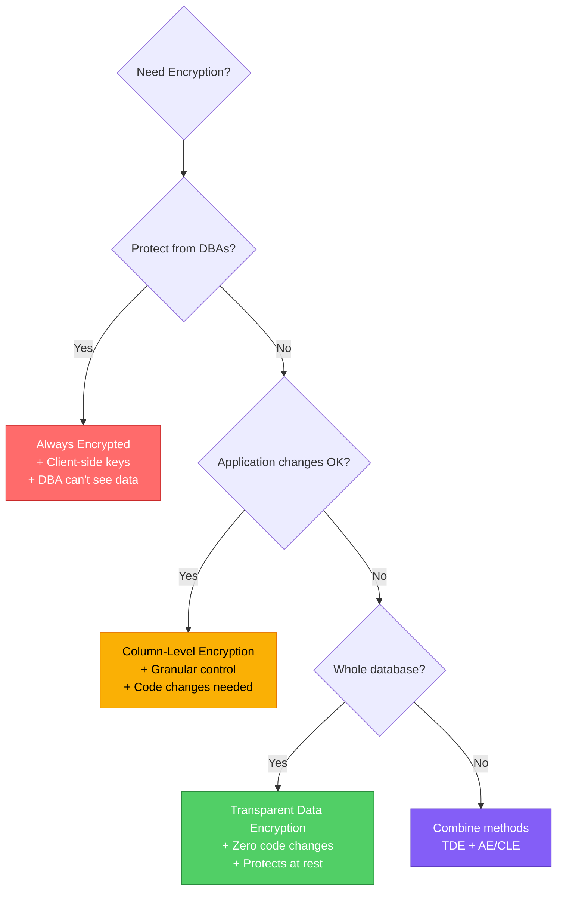
---

## 4. Dynamic Data Masking

### 4.1 What is DDM?

Dynamic Data Masking changes how a sensitive value appears in query results for users without `UNMASK`. The stored value is not changed.

### Why use it?

- Support staff may need to confirm the last four digits of a card.
- Developers may need realistic data shapes without seeing personal values.
- Reports may require useful-looking values while hiding individual details.
- Different roles may require different visibility.

### What DDM is not

DDM is **not encryption**. It operates at the presentation layer. A sufficiently privileged user, or a user with risky combinations of permissions, may bypass or infer masked information. Use encryption for data that must be cryptographically protected.

### 4.2 Masking functions

| Function | Example definition | Example output | Best use |
|---|---|---|---|
| Default | `default()` | String → `XXXX`; number → `0`; date → default date | Complete visual obfuscation |
| Email | `email()` | `john@contoso.com` → `jXXX@XXXX.com` | Preserve email-like shape |
| Random | `random(10000,100000)` | A number within the specified range | Numeric data that should look plausible |
| Partial | `partial(3,"-XXX-",2)` | Shows configured prefix and suffix | Phone, card, national ID |

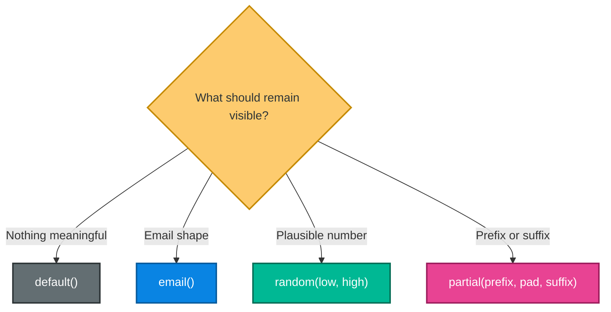

### 4.3 Configure masks

```sql
CREATE TABLE dbo.Customers (
    CustomerID int PRIMARY KEY,
    Email varchar(100)
        MASKED WITH (FUNCTION = 'email()'),

    -- Show the first three and final two characters.
    Phone varchar(20)
        MASKED WITH (FUNCTION = 'partial(3, "-XXX-XX", 2)'),

    -- Hide everything except the final four characters.
    CreditCardNumber varchar(19)
        MASKED WITH (FUNCTION = 'partial(0, "XXXX-XXXX-XXXX-", 4)'),

    -- Return a value in a plausible range to unauthorized viewers.
    Income decimal(18,2)
        MASKED WITH (FUNCTION = 'random(10000, 100000)'),

    -- Completely mask the value using the type's default mask.
    SSN char(11)
        MASKED WITH (FUNCTION = 'default()')
);
```

Add or remove a mask on an existing column:

```sql
-- Add a default mask.
ALTER TABLE dbo.Customers
ALTER COLUMN DateOfBirth ADD MASKED WITH (FUNCTION = 'default()');

-- Remove the mask definition.
ALTER TABLE dbo.Customers
ALTER COLUMN DateOfBirth DROP MASKED;
```

### 4.4 Control visibility with `UNMASK`

```sql
-- Broadest: see all masked data in the database.
GRANT UNMASK TO ComplianceOfficer;

-- Narrower: see masked data in one schema.
GRANT UNMASK ON SCHEMA::Sales TO SalesManager;

-- Narrower: see masked data in one table.
GRANT UNMASK ON dbo.Customers TO CustomerService;

-- Most granular in the examples: unmask one column.
GRANT UNMASK ON dbo.Customers(Phone) TO TelemarketingTeam;
```

> Granular schema/table/column `UNMASK` is identified in the supplied material as available from SQL Server 2022 onward.

### 4.5 Role-based masking pattern

```sql
-- Both roles can query the table.
CREATE ROLE MaskedDataViewers;
CREATE ROLE UnmaskedDataViewers;

GRANT SELECT ON dbo.Customers TO MaskedDataViewers;
GRANT SELECT ON dbo.Customers TO UnmaskedDataViewers;

-- Only this role sees the original values.
GRANT UNMASK ON dbo.Customers TO UnmaskedDataViewers;

ALTER ROLE MaskedDataViewers ADD MEMBER SupportStaff;
ALTER ROLE UnmaskedDataViewers ADD MEMBER ComplianceOfficer;
```

### 4.6 Common mistakes

- Treating DDM as encryption.
- Granting database-wide `UNMASK` when only one column is required.
- Giving a masked-data user broad `ALTER` permissions; the user may be able to change the mask definition.
- Assuming masking filters rows; that is RLS.
- Assuming `random()` produces stable analytical values; a query may show different masked values.

---

## 5. Row-Level Security

### 5.1 What is RLS?

RLS automatically applies a security rule to rows in a protected table. Different users can run the same query and receive different rows.

Typical scenarios:

- a multi-tenant SaaS application;
- sales representatives limited to their own customers;
- regional teams limited to their regions;
- managers allowed to see their reporting hierarchy.

### 5.2 Two RLS components

1. **Security predicate:** An inline table-valued function that returns a row (logically true) when access is allowed.
2. **Security policy:** Binds the function to one or more table operations.

### Filter versus block predicate

| Predicate | Behavior | Typical operations | User experience |
|---|---|---|---|
| Filter | Silently removes unauthorized rows from consideration/results | `SELECT`, `UPDATE`, `DELETE` | Unauthorized rows appear not to exist |
| Block | Rejects an unauthorized data change | `INSERT`, `UPDATE`, and applicable write boundaries | Statement fails with an error |

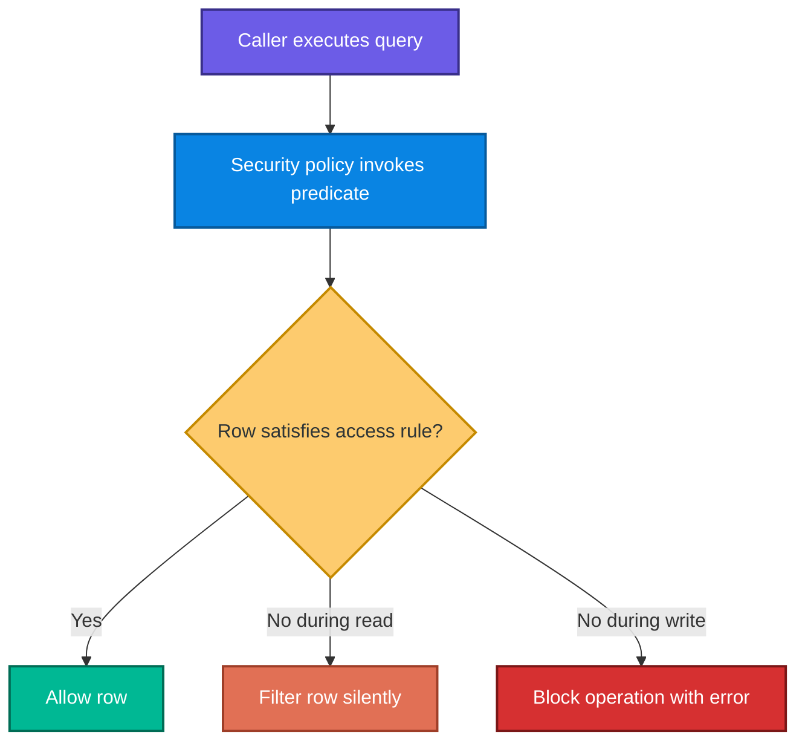

### 5.3 Tenant isolation with session context

```sql
CREATE SCHEMA Security;
GO

CREATE FUNCTION Security.fn_TenantAccessPredicate(@TenantID int)
RETURNS TABLE
WITH SCHEMABINDING
AS
RETURN
    SELECT 1 AS AccessAllowed
    -- The row's TenantID must equal the authenticated application's
    -- tenant value stored in this database session.
    WHERE @TenantID = CAST(SESSION_CONTEXT(N'TenantID') AS int);
GO
```

The application sets context after authenticating the caller:

```sql
-- All RLS-protected queries in this session now evaluate for tenant 42.
EXEC sys.sp_set_session_context @key = N'TenantID', @value = 42;
```

Bind the predicate to tables:

```sql
CREATE SECURITY POLICY TenantSecurityPolicy
ADD FILTER PREDICATE Security.fn_TenantAccessPredicate(TenantID)
    ON dbo.Orders,
ADD FILTER PREDICATE Security.fn_TenantAccessPredicate(TenantID)
    ON dbo.OrderDetails
WITH (STATE = ON);
```

### 5.4 Why combine filter and block predicates?

```sql
CREATE SECURITY POLICY SalesSecurityPolicy
ADD FILTER PREDICATE Security.fn_SalesRepPredicate(SalesRepID)
    ON dbo.CustomerAccounts,

-- Prevent a user from inserting a row assigned to somebody else.
ADD BLOCK PREDICATE Security.fn_SalesRepPredicate(SalesRepID)
    ON dbo.CustomerAccounts AFTER INSERT,

-- Prevent a user from changing ownership to an unauthorized representative.
ADD BLOCK PREDICATE Security.fn_SalesRepPredicate(SalesRepID)
    ON dbo.CustomerAccounts AFTER UPDATE
WITH (STATE = ON);
```

Without a block predicate, a user could create or reassign a row they cannot subsequently see. The filter predicate would hide the row, but it would not necessarily stop the invalid ownership change.

### 5.5 Identity-based predicate

```sql
CREATE FUNCTION Security.fn_SalesRepPredicate(@SalesRepID int)
RETURNS TABLE
WITH SCHEMABINDING
AS
RETURN
    SELECT 1 AS AccessAllowed
    WHERE
        -- A representative sees rows that match their database principal ID.
        @SalesRepID = DATABASE_PRINCIPAL_ID()
        -- Managers in this role can see every representative's rows.
        OR IS_MEMBER('SalesManagers') = 1;
```

### 5.6 Hierarchical access

A recursive CTE can build a manager's reporting tree, and the predicate can admit rows owned by anyone in that tree. This is expressive, but recursive work can be costly on large tables.

Performance options include:

- precomputing manager–subordinate relationships;
- indexing the ownership and hierarchy keys;
- limiting recursion depth where the business structure permits;
- keeping the predicate deterministic and as simple as possible.

### 5.7 Manage and inspect policies

```sql
-- Temporarily disable filtering without deleting the policy.
ALTER SECURITY POLICY TenantSecurityPolicy WITH (STATE = OFF);

-- Add a protected table.
ALTER SECURITY POLICY TenantSecurityPolicy
ADD FILTER PREDICATE Security.fn_TenantAccessPredicate(TenantID)
    ON dbo.Shipments;

-- Remove protection from a target table.
ALTER SECURITY POLICY TenantSecurityPolicy
DROP FILTER PREDICATE ON dbo.Orders;
```

```sql
-- Inspect policies, target objects, and predicate definitions.
SELECT
    p.name AS PolicyName,
    p.is_enabled,
    o.name AS TableName,
    pred.predicate_definition
FROM sys.security_policies AS p
INNER JOIN sys.security_predicates AS pred
    ON p.object_id = pred.object_id
INNER JOIN sys.objects AS o
    ON pred.target_object_id = o.object_id;
```

### 5.8 Important design rules

- Granting `SELECT` is still required; RLS refines access but does not replace object permissions.
- Use `SCHEMABINDING` in the predicate function.
- Protect session context from untrusted manipulation in the application design.
- Test as each real security principal using `EXECUTE AS USER` and `REVERT`.
- Remember that views and stored procedures reading an RLS-protected table still receive filtered rows.

---

## 6. Permissions, roles, schemas, and secure identity

**What are Object-Level Permissions?**

A hierarchical permission model controlling user actions on database objects (tables, views, procedures) from server-level down to individual columns. Using `GRANT`, `DENY`, and `REVOKE`, combined with Role-Based Access Control (RBAC) and schema separation. Modern setups use Microsoft Entra ID and Managed Identities for passwordless authentication. Prefer Managed Identity over SQL authentication (passwords) for Azure-hosted apps.

**Why Use Object-Level Permissions?**
- **Principle of least privilege(PoLP)**: Users get only required access
- **Separation of duties**: Different roles for different functions
- **Audit compliance**: Documented access controls
- **Defense in depth**: Multiple permission layers

### 6.1 Permission hierarchy

SQL permissions form a hierarchy:

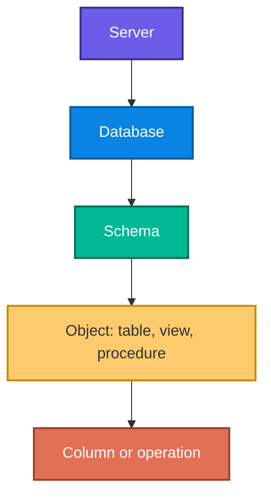

A schema-level grant can apply to existing and future objects in that schema:

```sql
-- Read tables and views currently in Sales and those created later.
GRANT SELECT ON SCHEMA::Sales TO SalesAnalyst;

-- Execute stored procedures currently or subsequently placed in Reports.
GRANT EXECUTE ON SCHEMA::Reports TO ReportingUsers;
```

### 6.2 `GRANT`, `REVOKE`, and `DENY`

| Statement | Meaning | Effect when another role grants the permission |
|---|---|---|
| `GRANT` | Explicitly allows | Access is allowed unless an applicable `DENY` overrides it |
| `REVOKE` | Removes the selected grant or deny | Another independent grant may still provide access |
| `DENY` | Explicitly prohibits | Normally overrides applicable grants |

```sql
GRANT SELECT ON dbo.Customers TO CustomerServiceRole;
GRANT INSERT, UPDATE ON dbo.Orders TO OrderProcessingRole;

-- Explicit prohibition; stronger than merely removing a grant.
DENY SELECT ON dbo.EmployeeSalaries TO HRAssistants;

-- Removes this permission assignment but does not create a prohibition.
REVOKE INSERT ON dbo.Customers FROM CustomerServiceRole;
```

> **Exam trap:** If the requirement says “ensure access is blocked even if another role grants it,” choose `DENY`. If it says “remove a previously assigned permission,” choose `REVOKE`.

### 6.3 Role-based access control (RBAC)

Do not repeatedly grant permissions to individual people. Grant them to roles representing job functions, then manage role membership.

```sql
CREATE ROLE DataReaders;
CREATE ROLE DataWriters;

GRANT SELECT ON SCHEMA::dbo TO DataReaders;
GRANT INSERT, UPDATE, DELETE ON SCHEMA::dbo TO DataWriters;

ALTER ROLE DataReaders ADD MEMBER JohnSmith;
ALTER ROLE DataWriters ADD MEMBER JaneDoe;
```

Benefits:

- simpler onboarding and offboarding;
- consistent access for the same job function;
- easier audits;
- fewer permission mistakes;
- supports least privilege.

### 6.4 Schema separation

Schemas are both namespaces and permission boundaries.

```sql
CREATE SCHEMA Sales AUTHORIZATION dbo;
CREATE SCHEMA HR AUTHORIZATION dbo;

GRANT SELECT, INSERT, UPDATE ON SCHEMA::Sales TO SalesTeam;
GRANT CONTROL ON SCHEMA::HR TO HRAdministrators;
```

Use separate schemas when groups own different data domains or when one group should execute procedures without directly accessing underlying tables.

### 6.5 Microsoft Entra authentication

Microsoft Entra authentication uses cloud identities rather than SQL passwords. Those identities can be:

- human users;
- Microsoft Entra groups;
- service principals;
- managed identities.

```sql
-- Create database principals backed by external Microsoft Entra identities.
CREATE USER [app-service-identity] FROM EXTERNAL PROVIDER;
CREATE USER [developer@contoso.com] FROM EXTERNAL PROVIDER;
CREATE USER [DataAnalystsGroup] FROM EXTERNAL PROVIDER;

ALTER ROLE db_datareader ADD MEMBER [developer@contoso.com];
ALTER ROLE db_datawriter ADD MEMBER [app-service-identity];
```

### 6.6 Managed Identity

Managed Identity is preferred for Azure-hosted applications because Azure manages the identity lifecycle. The application requests tokens without storing a password or client secret.

| Type | Lifecycle | Good fit |
|---|---|---|
| System-assigned | Bound to one Azure resource; deleted with it | One application/resource needs its own identity |
| User-assigned | Independent Azure resource; reusable | Multiple applications need a shared identity/permission set |

```sql
-- The Azure App Service has a managed identity named MyWebApp.
CREATE USER [MyWebApp] FROM EXTERNAL PROVIDER;
ALTER ROLE db_datareader ADD MEMBER [MyWebApp];
ALTER ROLE db_datawriter ADD MEMBER [MyWebApp];
```

```text
Server=tcp:myserver.database.windows.net,1433;
Database=mydb;
Authentication=Active Directory Managed Identity;
Encrypt=True;
TrustServerCertificate=False;
```

### 6.7 Secure connection checklist

- Store unavoidable secrets in Azure Key Vault or environment variables, never source code.
- Prefer Managed Identity so no secret is present at all.
- Set `Encrypt=True`.
- Set `TrustServerCertificate=False` so certificate validation remains enabled.
- Restrict the network with firewall rules and private endpoints.
- If a service principal must use a secret, rotate it; certificate-based authentication is stronger than a shared secret.

### 6.8 Inspect effective permissions

```sql
SELECT
    prin.name AS PrincipalName,
    perm.permission_name,
    perm.state_desc AS PermissionState,
    obj.name AS ObjectName
FROM sys.database_permissions AS perm
INNER JOIN sys.database_principals AS prin
    ON perm.grantee_principal_id = prin.principal_id
LEFT JOIN sys.objects AS obj
    ON perm.major_id = obj.object_id
WHERE prin.name = 'SalesAnalyst';
```

```sql
-- Return the current caller's effective permissions on this object.
SELECT *
FROM fn_my_permissions('Sales.Orders', 'OBJECT');
```

---

## 7. Database auditing

### 7.1 What and why

Auditing records security-relevant events so an organization can:

- detect suspicious behavior;
- investigate incidents;
- prove compliance;
- track permission and schema changes;
- create accountability for sensitive data access.

Auditing is primarily a **detective** and **evidentiary** control. It usually does not prevent the audited action.

### 7.2 Platform comparison

| Platform | Audit mechanism/destinations from the supplied module |
|---|---|
| SQL Server | SQL Server Audit using Extended Events infrastructure; file, Windows Security log, or Windows Application log |
| Azure SQL Database | Azure Blob Storage, Log Analytics, or Event Hubs |
| SQL database in Microsoft Fabric | Fabric activity logging and Microsoft Purview integration |

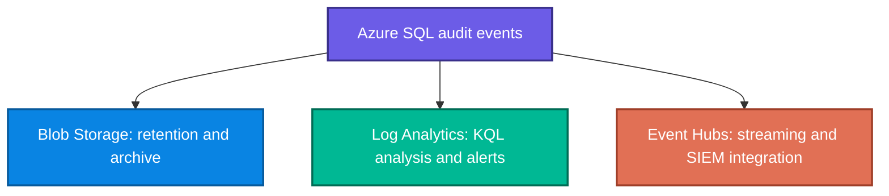

### 7.3 Configure SQL Server Audit

There are two design levels:

1. A **server audit** defines the destination and failure behavior.
2. **Server/database audit specifications** define the events to capture.

```sql
CREATE SERVER AUDIT SecurityAudit
TO FILE (
    FILEPATH = 'C:\AuditLogs\',
    MAXSIZE = 100 MB,
    MAX_ROLLOVER_FILES = 10
)
WITH (
    -- Buffer up to 1000 ms before writing; lower delay is more immediate
    -- but can increase performance overhead.
    QUEUE_DELAY = 1000,

    -- Continue database operations if audit writing fails.
    -- For strict compliance, SHUTDOWN may be required instead.
    ON_FAILURE = CONTINUE
);

ALTER SERVER AUDIT SecurityAudit WITH (STATE = ON);
```

```sql
CREATE SERVER AUDIT SPECIFICATION ServerAuditSpec
FOR SERVER AUDIT SecurityAudit
ADD (FAILED_LOGIN_GROUP),
ADD (SUCCESSFUL_LOGIN_GROUP),
ADD (SERVER_PERMISSION_CHANGE_GROUP),
ADD (DATABASE_PERMISSION_CHANGE_GROUP)
WITH (STATE = ON);
```

```sql
USE MyDatabase;
GO

CREATE DATABASE AUDIT SPECIFICATION DatabaseAuditSpec
FOR SERVER AUDIT SecurityAudit
-- Target data access on a sensitive table instead of auditing every SELECT.
ADD (SELECT, INSERT, UPDATE, DELETE ON dbo.SensitiveData BY public),
ADD (EXECUTE ON SCHEMA::dbo BY public),
ADD (DATABASE_ROLE_MEMBER_CHANGE_GROUP)
WITH (STATE = ON);
```

### 7.4 Choose audit actions

| Requirement | Suitable event/action group |
|---|---|
| Detect failed sign-in attacks | `FAILED_DATABASE_AUTHENTICATION_GROUP` |
| Record successful authentication | `SUCCESSFUL_DATABASE_AUTHENTICATION_GROUP` |
| Track `GRANT`, `REVOKE`, and `DENY` | `DATABASE_PERMISSION_CHANGE_GROUP` |
| Track additions/removals from roles | `DATABASE_ROLE_MEMBER_CHANGE_GROUP` |
| Track user/principal changes | `DATABASE_PRINCIPAL_CHANGE_GROUP` |
| Track access to one sensitive table | Object-specific `SELECT`, `INSERT`, `UPDATE`, `DELETE` |
| Track schema-object changes | `SCHEMA_OBJECT_CHANGE_GROUP` |
| Capture all completed batches | `BATCH_COMPLETED_GROUP`—high volume |

Start focused. Capturing every batch may increase latency, storage cost, and analysis noise.

### 7.5 Analyze logs

```sql
SELECT
    event_time,
    action_id,
    succeeded,
    session_server_principal_name AS UserName,
    database_name,
    object_name,
    statement
FROM sys.fn_get_audit_file(
    'C:\AuditLogs\*.sqlaudit',
    DEFAULT,
    DEFAULT
)
WHERE event_time > DATEADD(day, -7, GETUTCDATE())
ORDER BY event_time DESC;
```

```kusto
AzureDiagnostics
| where Category == "SQLSecurityAuditEvents"
| where TimeGenerated > ago(7d)
| where action_name_s == "SELECT"
| summarize QueryCount = count() by client_ip_s, server_principal_name_s
| order by QueryCount desc
```

### 7.6 Retention planning

A useful capacity estimate is:

$$
\text{Audit storage} \approx
\text{events/second} \times
\text{average bytes/event} \times
\text{retention seconds}
$$

Example: if a focused policy produces 20 events/s, each event averages 1.5 KB, and hot retention is 30 days:

$$
20 \times 1.5\text{ KB} \times (30 \times 86{,}400)
= 77{,}760{,}000\text{ KB} \approx 77.76\text{ GB}
$$

The estimate demonstrates why targeted actions and archival tiers matter.

Retention and protection checklist:

- store audit logs separately from the database being monitored;
- use immutable storage where evidence must be tamper-resistant;
- follow regulatory retention requirements;
- archive older data to cold storage to reduce cost;
- alert on failed logins, unexpected permission changes, and unusual access spikes;
- define what should happen if audit writing fails (`CONTINUE` versus stricter behavior).

---

## 8. Securing AI model endpoints

### 8.1 Why AI endpoints need special protection

An AI endpoint can:

- process sensitive input data;
- incur a cost per request or token;
- expose proprietary model behavior;
- become an exfiltration channel;
- be abused through compromised credentials;
- receive malicious or prompt-injected instructions.

Security therefore needs authentication, authorization, input/output control, network protection, monitoring, and cost governance.

### 8.2 Managed Identity flow

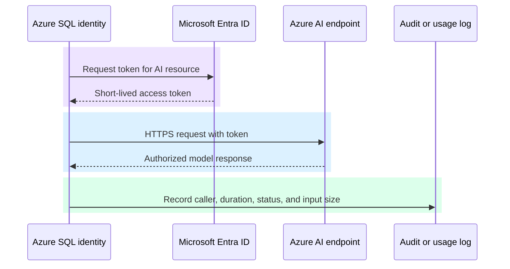

Why it is safer than an API key:

- no shared key is embedded in code or a connection string;
- Azure handles credential lifecycle;
- access is controlled with Azure RBAC;
- the token is scoped and short-lived.

### 8.3 Configure identity and credential

After enabling the Azure SQL server's system-assigned Managed Identity, grant that identity an appropriate Azure role on the AI resource. For Azure OpenAI, the supplied example uses the `Cognitive Services User` role.

```sql
-- SQL obtains a token for the Cognitive Services resource using Managed Identity.
CREATE DATABASE SCOPED CREDENTIAL AzureOpenAICredential
WITH IDENTITY = 'Managed Identity',
SECRET = '{"resourceId": "https://cognitiveservices.azure.com/"}';
```

```sql
CREATE EXTERNAL DATA SOURCE AzureOpenAI
WITH (
    TYPE = REST,
    LOCATION = 'https://myopenai.openai.azure.com',
    CREDENTIAL = AzureOpenAICredential
);
```

### 8.4 Encapsulate the call in a stored procedure

```sql
CREATE PROCEDURE dbo.GetEmbedding
    @InputText nvarchar(max),
    @Embedding nvarchar(max) OUTPUT
AS
BEGIN
    SET NOCOUNT ON;

    -- Construct a JSON request body without manual string concatenation.
    DECLARE @payload nvarchar(max) = JSON_OBJECT('input': @InputText);
    DECLARE @response nvarchar(max);

    -- Credential uses Managed Identity; no API key is stored here.
    EXEC sys.sp_invoke_external_rest_endpoint
        @url = 'https://myopenai.openai.azure.com/openai/deployments/text-embedding/embeddings?api-version=2024-02-01',
        @method = 'POST',
        @payload = @payload,
        @credential = AzureOpenAICredential,
        @response = @response OUTPUT;

    -- The embedding is a JSON array, so JSON_QUERY is used rather than
    -- JSON_VALUE, which is intended for scalar values.
    SET @Embedding = JSON_QUERY(@response, '$.data[0].embedding');
END;
```

Only approved callers receive permission:

```sql
CREATE ROLE AIFeatureUsers;
GRANT EXECUTE ON dbo.GetEmbedding TO AIFeatureUsers;
ALTER ROLE AIFeatureUsers ADD MEMBER [app-service-identity];
```

This is safer than granting broad access to credentials or generic endpoint invocation.

### 8.5 Azure Machine Learning endpoint

```sql
CREATE DATABASE SCOPED CREDENTIAL AMLCredential
WITH IDENTITY = 'Managed Identity',
SECRET = '{"resourceId": "https://ml.azure.com/"}';

CREATE EXTERNAL DATA SOURCE AMLEndpoint
WITH (
    TYPE = REST,
    LOCATION = 'https://myworkspace.region.inference.ml.azure.com',
    CREDENTIAL = AMLCredential
);
```

For batch inference, input/output storage must also use secure, least-privilege access—preferably Managed Identity.

### 8.6 Monitor AI use and cost

```sql
CREATE TABLE dbo.AIEndpointLog (
    LogID int IDENTITY PRIMARY KEY,
    CallTimestamp datetime2 DEFAULT SYSUTCDATETIME(),
    CallerPrincipal nvarchar(128) DEFAULT ORIGINAL_LOGIN(),
    EndpointName nvarchar(256),
    InputLength int,
    ResponseStatus int,
    DurationMs int
);
```

```sql
-- Identify principals with unexpectedly high hourly usage.
SELECT
    CallerPrincipal,
    COUNT(*) AS CallCount,
    AVG(DurationMs) AS AvgDuration
FROM dbo.AIEndpointLog
WHERE CallTimestamp > DATEADD(hour, -1, SYSUTCDATETIME())
GROUP BY CallerPrincipal
HAVING COUNT(*) > 100
ORDER BY CallCount DESC;
```

Cost can be estimated as:

$$
\text{Estimated cost} =
\text{number of calls} \times \text{average cost per call}
$$

For token-priced models, a more useful approximation is:

$$
\text{Cost} \approx
\frac{T_{in}}{1000}P_{in} + \frac{T_{out}}{1000}P_{out}
$$

where $T_{in}$ and $T_{out}$ are input/output tokens and $P_{in}$, $P_{out}v are the prices per 1,000 tokens. The formula is useful for monitoring design even though actual pricing varies.

### 8.7 Microsoft Fabric distinction

According to the supplied module, Fabric AI access is governed primarily through workspace roles and capacity-based access rather than Azure SQL-style database-scoped Managed Identity credentials. Therefore:

- assign workspace roles carefully;
- monitor capacity metrics and activity logs;
- control which protected data AI features can reach.

---

## 9. Securing GraphQL, REST, and MCP endpoints

### 9.1 Compare endpoint risks

| Endpoint | Strength | Main security risks | Important controls |
|---|---|---|---|
| GraphQL | Client requests exactly the required fields | Schema discovery, excessive nesting/complexity, unintended field exposure | Authentication, field/entity authorization, disable production introspection, depth/complexity limits |
| REST | Predictable resource/operation routes | Broken endpoint authorization, unsafe input, excess actions | Authentication, per-route permissions, validation, database policies |
| MCP | AI agents can obtain context and invoke tools | Prompt injection, excessive autonomy, data exfiltration, unsafe generated SQL | Read-only default, table/operation allowlists, row limits, validation, complete logging |

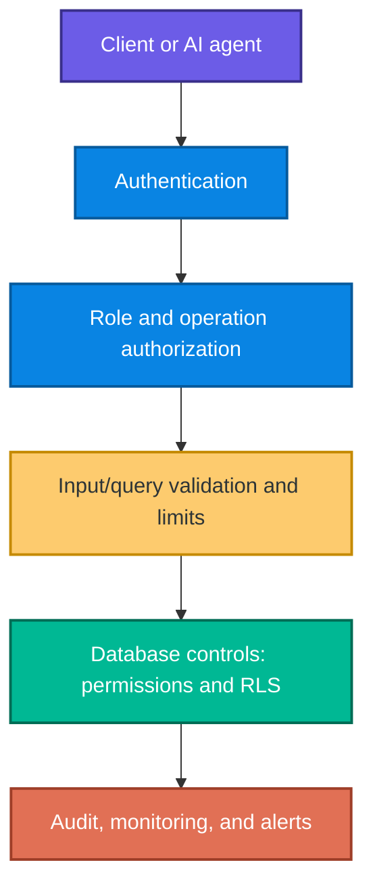

### 9.2 GraphQL configuration

```jsonc
{
  "runtime": {
    "rest": { "enabled": false },
    "graphql": {
      "enabled": true,
      "path": "/graphql",
      // Do not reveal the full production schema to unauthenticated explorers.
      "allow-introspection": false
    }
  },
  "authentication": {
    "provider": "AzureAD",
    "jwt": {
      "audience": "api://my-graphql-api",
      "issuer": "https://login.microsoftonline.com/{tenant-id}/v2.0"
    }
  }
}
```

Entity- and field-level control:

```jsonc
{
  "entities": {
    "Order": {
      "source": "dbo.Orders",
      "permissions": [
        {
          "role": "authenticated",
          "actions": ["read"],
          "fields": {
            "include": ["OrderID", "OrderDate", "Status"],
            "exclude": ["InternalNotes", "CostPrice"]
          }
        },
        {
          "role": "admin",
          "actions": ["*"]
        }
      ]
    }
  }
}
```

Depth and complexity limits reduce denial-of-service risk from deeply nested or computationally expensive queries.

### 9.3 REST authorization

```jsonc
{
  "entities": {
    "Product": {
      "source": "dbo.Products",
      "rest": { "enabled": true, "path": "/products" },
      "permissions": [
        {
          "role": "anonymous",
          "actions": [
            {
              "action": "read",
              // Anonymous callers receive only rows marked public.
              "policy": { "database": "@item.IsPublic eq true" }
            }
          ]
        },
        {
          "role": "inventory-manager",
          "actions": ["create", "read", "update"]
        },
        { "role": "admin", "actions": ["*"] }
      ]
    }
  }
}
```

A custom stored procedure should independently verify caller access:

```sql
CREATE PROCEDURE api.GetCustomerOrders
    @CustomerID int
AS
BEGIN
    SET NOCOUNT ON;

    -- Authorize this specific principal for this specific customer.
    IF NOT EXISTS (
        SELECT 1
        FROM dbo.CustomerAccess
        WHERE CustomerID = @CustomerID
          AND UserPrincipal = ORIGINAL_LOGIN()
    )
    BEGIN
        THROW 50401, 'Unauthorized access to customer data', 1;
    END;

    SELECT OrderID, OrderDate, TotalAmount
    FROM dbo.Orders
    WHERE CustomerID = @CustomerID;
END;
```

### 9.4 MCP hardening

```jsonc
{
  "mcpServers": {
    "sqlDatabase": {
      "transport": "stdio",
      "authentication": {
        "type": "azure-identity",
        "scope": "https://database.windows.net/.default"
      },
      "security": {
        // Start read-only; add write actions only for a proven requirement.
        "allowedOperations": ["read"],
        "deniedTables": ["dbo.Passwords", "dbo.APIKeys"],
        // Limit bulk extraction and accidental oversized results.
        "maxRowsReturned": 1000
      }
    }
  }
}
```

#### Allowlist beats blocklist

Searching a generated SQL string for words such as `DROP` is brittle. Attackers can use alternative syntax, comments, encoding, indirect execution, or permitted functions in harmful ways. A safer approach is to:

- parse or generate structured queries;
- permit only approved operations;
- permit only approved schemas/tables/columns;
- use parameterized values;
- execute under a least-privilege database principal;
- apply RLS even after validation;
- cap rows and execution time;
- log the prompt, generated action, caller, result count, and decision.

> **Important:** Never trust AI-generated SQL merely because it was produced by a model. Treat it as untrusted input.

---

## 10. Network security

Endpoint authentication is necessary but insufficient. Restrict who can reach the service at the network layer.

Controls from the supplied module include:

- Azure SQL firewall rules;
- virtual network integration for applications;
- Private Endpoints/Private Link for Azure SQL;
- service endpoints where appropriate;
- managed private endpoints in Microsoft Fabric;
- encrypted connections.

```sql
-- Illustrative firewall rule from the source material.
-- In a real design, verify whether these addresses match the intended
-- Azure networking model and keep the permitted range as narrow as possible.
EXECUTE sys.sp_set_firewall_rule
    @name = 'AllowAppService',
    @start_ip_address = '10.0.0.1',
    @end_ip_address = '10.0.0.255';
```

### Defense-in-depth request path

```mermaid
flowchart LR
    N["Approved network"] --> I["Microsoft Entra identity"]
    I --> E["Authorized endpoint action"]
    E --> P["Database permissions and RLS"]
    P --> A["Audit and monitoring"]

    classDef network fill:#6C5CE7,color:#fff,stroke:#392F8A,stroke-width:2px
    classDef identity fill:#0984E3,color:#fff,stroke:#075A9C,stroke-width:2px
    classDef endpoint fill:#FDCB6E,color:#2D3436,stroke:#C58A00,stroke-width:2px
    classDef database fill:#00B894,color:#fff,stroke:#006C55,stroke-width:2px
    classDef audit fill:#E17055,color:#fff,stroke:#9E3E28,stroke-width:2px
    class N network
    class I identity
    class E endpoint
    class P database
    class A audit
```

---

## 11. Integrated implementation lab

This condensed lab follows the source exercise while emphasizing why every step exists.

### 11.1 Create sample data

```sql
CREATE TABLE dbo.Employees (
    EmployeeID int PRIMARY KEY IDENTITY(1,1),
    FirstName nvarchar(50) NOT NULL,
    LastName nvarchar(50) NOT NULL,
    Email nvarchar(100) NOT NULL,
    SSN char(11) NOT NULL,
    Salary decimal(18,2) NOT NULL,
    Department nvarchar(50) NOT NULL
);

CREATE TABLE dbo.Customers (
    CustomerID int PRIMARY KEY IDENTITY(1,1),
    CompanyName nvarchar(100) NOT NULL,
    ContactName nvarchar(100) NOT NULL,
    Phone nvarchar(20) NOT NULL,
    CreditCardNumber nvarchar(19) NOT NULL,
    SalesRegion nvarchar(20) NOT NULL
);
```

### 11.2 Add masking

```sql
ALTER TABLE dbo.Employees
ALTER COLUMN SSN ADD MASKED WITH (FUNCTION = 'partial(0, "XXX-XX-", 4)');

ALTER TABLE dbo.Employees
ALTER COLUMN Salary ADD MASKED WITH (FUNCTION = 'random(50000, 150000)');

ALTER TABLE dbo.Employees
ALTER COLUMN Email ADD MASKED WITH (FUNCTION = 'email()');

ALTER TABLE dbo.Customers
ALTER COLUMN CreditCardNumber
    ADD MASKED WITH (FUNCTION = 'partial(0, "XXXX-XXXX-XXXX-", 4)');

ALTER TABLE dbo.Customers
ALTER COLUMN Phone
    ADD MASKED WITH (FUNCTION = 'partial(0, "XXX-XXX-", 4)');
```

### 11.3 Test masking with impersonation

```sql
CREATE USER MaskedViewer WITHOUT LOGIN;
GRANT SELECT ON dbo.Employees TO MaskedViewer;
GRANT SELECT ON dbo.Customers TO MaskedViewer;

EXECUTE AS USER = 'MaskedViewer';
SELECT FirstName, LastName, Email, SSN, Salary
FROM dbo.Employees;
SELECT CompanyName, ContactName, Phone, CreditCardNumber
FROM dbo.Customers;
REVERT;
```

Expected behavior: `MaskedViewer` sees masked results because it has `SELECT` but not `UNMASK`. `REVERT` returns execution to the original principal.

### 11.4 Create regional RLS

```sql
CREATE USER WestSalesRep WITHOUT LOGIN;
CREATE USER EastSalesRep WITHOUT LOGIN;

GRANT SELECT ON dbo.Customers TO WestSalesRep;
GRANT SELECT ON dbo.Customers TO EastSalesRep;

CREATE SCHEMA Security;
GO

CREATE FUNCTION Security.fn_RegionFilter(@SalesRegion nvarchar(20))
RETURNS TABLE
WITH SCHEMABINDING
AS
RETURN
    SELECT 1 AS AccessGranted
    WHERE @SalesRegion = CASE USER_NAME()
        WHEN 'WestSalesRep' THEN 'West'
        WHEN 'EastSalesRep' THEN 'East'
        ELSE @SalesRegion -- source exercise lets other/admin contexts pass
    END
    OR IS_MEMBER('db_owner') = 1;
GO

CREATE SECURITY POLICY CustomerRegionPolicy
ADD FILTER PREDICATE Security.fn_RegionFilter(SalesRegion)
    ON dbo.Customers
WITH (STATE = ON);
```

### 11.5 Test each user

```sql
EXECUTE AS USER = 'WestSalesRep';
SELECT * FROM dbo.Customers; -- West rows only
REVERT;

EXECUTE AS USER = 'EastSalesRep';
SELECT * FROM dbo.Customers; -- East rows only
REVERT;
```

### 11.6 Production design warning

The exercise's `ELSE @SalesRegion` branch allows unrecognized users to satisfy the predicate for every row. That behavior is convenient for an admin-oriented lab, but production security should normally **fail closed**: explicitly allow administrators and return no row for unknown users.

A safer pattern is conceptually:

```sql
RETURN
    SELECT 1 AS AccessGranted
    WHERE (@SalesRegion = CASE USER_NAME()
              WHEN 'WestSalesRep' THEN 'West'
              WHEN 'EastSalesRep' THEN 'East'
              ELSE NULL -- unknown users match no region
           END)
       OR IS_MEMBER('ApprovedRegionalAdminRole') = 1;
```

### 11.7 Cleanup order

Dependencies matter. Drop the policy before the predicate function, then remove the schema and tables.

```sql
DROP SECURITY POLICY IF EXISTS CustomerRegionPolicy;
DROP FUNCTION IF EXISTS Security.fn_RegionFilter;
DROP SCHEMA IF EXISTS Security;

DROP USER IF EXISTS MaskedViewer;
DROP USER IF EXISTS WestSalesRep;
DROP USER IF EXISTS EastSalesRep;

DROP TABLE IF EXISTS dbo.Customers;
DROP TABLE IF EXISTS dbo.Employees;
```

---

## 12. DP-800 decision guide and exam traps

### 12.1 “Requirement → feature” mapping

| Requirement clue | Best first answer | Why |
|---|---|---|
| Encrypt files, logs, and backups without application changes | TDE | Transparent at-rest protection |
| DBA must not see plaintext | Always Encrypted | Client holds/uses keys; database engine sees ciphertext |
| Exact equality search on an Always Encrypted column | Deterministic encryption | Equal plaintext produces equal ciphertext |
| Strongest pattern hiding; no equality filtering | Randomized encryption | Repeated plaintext does not expose repeated ciphertext pattern |
| Hide all but last four digits in results | DDM `partial()` | Presentation-layer partial disclosure |
| Users must see only their tenant's rows | RLS filter predicate | Automatically filters rows |
| Prevent a user inserting a row for another tenant | RLS block predicate | Rejects unauthorized write |
| Apply permissions to current and future objects in a group | Schema-level grant | Permission flows to objects in the schema |
| Remove one permission assignment but allow other grants to work | `REVOKE` | Removes rather than explicitly blocks |
| Block access even if another role grants it | `DENY` | Explicit denial normally overrides grants |
| Azure-hosted app needs passwordless SQL access | Managed Identity + external user | No application secret |
| Analyze Azure SQL audit events with KQL | Log Analytics | Querying and alerting platform |
| Long-term, tamper-resistant audit evidence | Immutable Blob Storage | Retention and anti-tampering |
| Protect AI endpoint credentials | Managed Identity | Avoids API keys/secrets |
| Stop GraphQL schema discovery in production | Disable introspection | Does not expose schema metadata |
| Limit AI agent data extraction | MCP read-only allowlist + row limits | Reduces available operations and volume |

### 12.2 Frequent distractors

1. **TDE versus Always Encrypted:** TDE does not protect results from authorized DB users.
2. **DDM versus encryption:** DDM changes display, not stored bytes.
3. **RLS versus permissions:** RLS filters rows only after the caller can access the object.
4. **Filter versus block:** Filter hides; block rejects.
5. **`REVOKE` versus `DENY`:** Revoke removes one assignment; deny creates an explicit prohibition.
6. **Managed Identity versus Key Vault:** Key Vault safely stores secrets; Managed Identity can eliminate the secret.
7. **Audit everything:** Maximum volume is not automatically maximum security; focused auditing may be more usable and performant.
8. **Blocklisting generated SQL:** An allowlist and least-privilege execution context are safer.
9. **Authentication alone:** A valid identity still needs narrow authorization.
10. **Application checks alone:** Database RLS and permissions provide protection across access paths.

---

## 13. Rapid revision sheet

### Encryption

- **TDE:** at rest, transparent, files/logs/backups, no protection from authorized query access.
- **Always Encrypted:** client-side; CMK outside database; CEK encrypts columns; hides plaintext from DB engine/DBA.
- **Deterministic:** equality filters/joins, but leaks repetition patterns.
- **Randomized:** stronger pattern protection, fewer query operations.
- **Column-level encryption:** explicit key operations and T-SQL functions; flexible but developer-managed.

### Masking and rows

- **DDM:** display-time protection; stored data unchanged; controlled by `UNMASK`.
- Masks: `default()`, `email()`, `random()`, `partial()`.
- **RLS filter:** silently hides rows.
- **RLS block:** rejects unauthorized writes.
- Predicate = rule; policy = binding.

### Permissions and identity

- Hierarchy: server → database → schema → object → column/operation.
- `GRANT` allows; `REVOKE` removes; `DENY` blocks.
- Prefer permissions → roles → members.
- Managed Identity eliminates stored application credentials.

### Audit and endpoints

- Audit logs should be separate and tamper-resistant.
- Log Analytics supports KQL and alerts; Blob supports retention/archive; Event Hubs supports streaming.
- AI calls: Managed Identity + narrow `EXECUTE` + logging + cost alerts.
- GraphQL: disable production introspection and limit depth/complexity.
- REST: route/action authorization and validation.
- MCP: read-only by default, allowlists, row limits, untrusted-query validation, logging.

---

## 14. Practice set: 60 questions with explanations

Try each question before expanding its answer.

### Part A — Multiple-choice questions (1–36)

#### 1. A company must encrypt Azure SQL database files and backups without changing its application. Which feature should it use first?

A. Dynamic Data Masking  
B. Transparent Data Encryption  
C. Row-Level Security  
D. `DENY SELECT`

<details><summary>Answer and explanation</summary>

**Answer: B — Transparent Data Encryption (TDE).** TDE transparently protects data files, logs, and backups at rest. DDM changes query presentation, RLS filters rows, and `DENY SELECT` is authorization rather than encryption.

</details>

#### 2. A database administrator must be unable to read patient identifiers in plaintext. Which feature best meets the requirement?

A. TDE  
B. Always Encrypted  
C. DDM with `default()`  
D. SQL Server Audit

<details><summary>Answer and explanation</summary>

**Answer: B — Always Encrypted.** Encryption/decryption occurs in the supported client, and the database engine sees ciphertext. TDE decrypts data for normal query processing; masking is not cryptographic protection; auditing records access rather than hiding data.

</details>

#### 3. An Always Encrypted column must support equality searches. Which encryption type should be selected?

A. Randomized  
B. Deterministic  
C. TDE  
D. Partial

<details><summary>Answer and explanation</summary>

**Answer: B — Deterministic.** Equal plaintext values generate equal ciphertext, enabling equality comparison and equality joins. This also exposes repetition patterns, so randomized encryption is preferred when equality operations are unnecessary.

</details>

#### 4. Which key directly encrypts Always Encrypted column values?

A. Column Master Key  
B. Database master key  
C. Column Encryption Key  
D. Service principal secret

<details><summary>Answer and explanation</summary>

**Answer: C — Column Encryption Key (CEK).** The CEK encrypts data; the CMK protects the CEK. Confusing these two levels is a common exam distractor.

</details>

#### 5. Where should an Always Encrypted Column Master Key be kept?

A. In plaintext in the user table  
B. Outside the database in a protected key store  
C. In every stored procedure  
D. In the audit log

<details><summary>Answer and explanation</summary>

**Answer: B.** Azure Key Vault, a certificate store, or an HSM can protect the CMK outside the database. This separation prevents the database engine from independently decrypting protected columns.

</details>

#### 6. Which statement about TDE is correct?

A. It prevents every DBA from querying plaintext.  
B. It automatically filters tenant rows.  
C. It protects database storage at rest.  
D. It requires `ENCRYPTBYKEY` in every insert.

<details><summary>Answer and explanation</summary>

**Answer: C.** TDE protects files, logs, and backups. It is transparent to normal queries and does not replace authorization or client-side encryption.

</details>

#### 7. Which DDM function is most suitable for revealing only the final four digits of a payment card?

A. `email()`  
B. `random()`  
C. `partial()`  
D. `default()`

<details><summary>Answer and explanation</summary>

**Answer: C — `partial()`.** It lets you configure how many leading/trailing characters remain visible and what padding appears between them.

</details>

#### 8. What happens to the stored value when Dynamic Data Masking is applied?

A. It is permanently replaced with X characters.  
B. It is encrypted with the CMK.  
C. It remains unchanged.  
D. It is deleted for unauthorized users.

<details><summary>Answer and explanation</summary>

**Answer: C.** DDM changes the query result presented to callers without `UNMASK`; the underlying stored value remains intact.

</details>

#### 9. A role should view the original values in only `dbo.Customers.Phone`. Which permission best follows least privilege?

A. `GRANT CONTROL ON DATABASE`  
B. `GRANT UNMASK` at database level  
C. `GRANT UNMASK ON dbo.Customers(Phone)`  
D. `ALTER ROLE db_owner ADD MEMBER`

<details><summary>Answer and explanation</summary>

**Answer: C.** A column-level `UNMASK` grant is narrower than table-, schema-, database-level access or membership in `db_owner`.

</details>

#### 10. Which statement describes a limitation of DDM?

A. It cannot preserve email-like output.  
B. It is presentation-layer protection and not strong encryption.  
C. It permanently modifies values.  
D. It can be used only on numbers.

<details><summary>Answer and explanation</summary>

**Answer: B.** DDM reduces casual exposure, but highly sensitive values require encryption, permissions, and other controls as well.

</details>

#### 11. Which RLS component contains the row-access logic?

A. Security predicate function  
B. Column Master Key  
C. Audit specification  
D. Firewall rule

<details><summary>Answer and explanation</summary>

**Answer: A.** The inline table-valued predicate function evaluates each row; the security policy binds that function to a table and operation.

</details>

#### 12. What does an RLS filter predicate do to unauthorized rows in a `SELECT`?

A. Returns an authorization error for every row  
B. Silently excludes them  
C. Masks their columns  
D. Encrypts them

<details><summary>Answer and explanation</summary>

**Answer: B.** Filter predicates make unauthorized rows appear absent. A block predicate raises errors for prohibited writes.

</details>

#### 13. Why add an RLS block predicate after `INSERT`?

A. To encrypt the new row  
B. To prevent inserting a row outside the caller's allowed security scope  
C. To record the statement  
D. To mask the new value

<details><summary>Answer and explanation</summary>

**Answer: B.** A filter might merely hide an incorrectly assigned row after insertion. A block predicate rejects the unauthorized write itself.

</details>

#### 14. Which function can hold an authenticated tenant value for an RLS predicate?

A. `SESSION_CONTEXT`  
B. `DECRYPTBYKEY`  
C. `fn_get_audit_file`  
D. `JSON_VALUE`

<details><summary>Answer and explanation</summary>

**Answer: A.** The application can set a tenant identifier using `sp_set_session_context`, and the predicate can read it through `SESSION_CONTEXT`.

</details>

#### 15. A user has no `SELECT` permission on a table protected by RLS. Does the RLS policy give the user access to allowed rows?

A. Yes, always  
B. Only if the policy is schema-bound  
C. No; object permission is still required  
D. Only for deterministic encryption

<details><summary>Answer and explanation</summary>

**Answer: C.** RLS refines row access; it does not grant base access to the table.

</details>

#### 16. Which statement applies a read permission to present and future objects in the `Sales` schema?

A. `GRANT SELECT ON SCHEMA::Sales TO SalesAnalyst`  
B. `GRANT UNMASK TO SalesAnalyst`  
C. `GRANT SELECT ON DATABASE::Sales`  
D. `ALTER SECURITY POLICY Sales`

<details><summary>Answer and explanation</summary>

**Answer: A.** A schema-level permission provides a scalable boundary for current and future objects in that schema.

</details>

#### 17. A permission must be explicitly blocked even if the user receives the same permission from another role. What should be used?

A. `REVOKE`  
B. `DENY`  
C. `GRANT`  
D. `UNMASK`

<details><summary>Answer and explanation</summary>

**Answer: B — `DENY`.** `REVOKE` removes an assignment but another grant may still provide access. `DENY` creates an explicit prohibition that normally overrides grants.

</details>

#### 18. What is the best way to manage permissions for many employees who share a job function?

A. Grant permissions to every user separately  
B. Put a password in a shared file  
C. Grant permissions to a database role and manage membership  
D. Add everyone to `db_owner`

<details><summary>Answer and explanation</summary>

**Answer: C.** Role-based access is consistent, auditable, and easier to maintain. `db_owner` violates least privilege.

</details>

#### 19. Which authentication option best eliminates stored credentials for an Azure App Service?

A. SQL username and password  
B. Managed Identity  
C. A permanent API key  
D. A password stored in source control

<details><summary>Answer and explanation</summary>

**Answer: B.** Managed Identity lets the Azure resource request tokens without storing a reusable secret.

</details>

#### 20. When is a user-assigned Managed Identity especially useful?

A. When only anonymous access is allowed  
B. When multiple applications should share an independently managed identity  
C. When encryption must be disabled  
D. When audit records must be deleted

<details><summary>Answer and explanation</summary>

**Answer: B.** A user-assigned identity has an independent lifecycle and can be attached to multiple resources.

</details>

#### 21. Which connection-string pair provides encrypted transport with certificate validation?

A. `Encrypt=False;TrustServerCertificate=True`  
B. `Encrypt=True;TrustServerCertificate=False`  
C. `Encrypt=False;TrustServerCertificate=False`  
D. `Encrypt=True;TrustServerCertificate=True`

<details><summary>Answer and explanation</summary>

**Answer: B.** `Encrypt=True` enables encryption; `TrustServerCertificate=False` requires proper certificate validation instead of blindly trusting the server certificate.

</details>

#### 22. What is the primary purpose of database auditing?

A. Encrypt every column  
B. Filter tenant rows  
C. Create an accountability and investigation trail  
D. Replace authentication

<details><summary>Answer and explanation</summary>

**Answer: C.** Auditing records who did what and when. It is a detective/evidentiary control, not an encryption or authorization substitute.

</details>

#### 23. Which Azure SQL audit destination is most directly associated with KQL queries and alerting?

A. Log Analytics  
B. A Column Master Key  
C. Windows Certificate Store  
D. RLS policy

<details><summary>Answer and explanation</summary>

**Answer: A.** Log Analytics supports Kusto Query Language, dashboards, queries, and alerts over collected diagnostic data.

</details>

#### 24. Which action group is best for detecting repeated unsuccessful authentication attempts?

A. `FAILED_DATABASE_AUTHENTICATION_GROUP`  
B. `SCHEMA_OBJECT_CHANGE_GROUP`  
C. `DATABASE_ROLE_MEMBER_CHANGE_GROUP`  
D. `BATCH_COMPLETED_GROUP`

<details><summary>Answer and explanation</summary>

**Answer: A.** It directly records failed database authentication. The others concern schema changes, role changes, or all completed batches.

</details>

#### 25. Why should audit logs be stored separately from the monitored database?

A. To disable authentication  
B. To make RLS unnecessary  
C. To reduce the chance that a database compromise also permits audit tampering  
D. To make all queries faster

<details><summary>Answer and explanation</summary>

**Answer: C.** Separate, immutable storage preserves evidence even if the monitored database is compromised.

</details>

#### 26. What is a likely disadvantage of auditing every completed batch?

A. It prevents all logins.  
B. It can produce high volume, cost, noise, and performance overhead.  
C. It disables encryption.  
D. It grants `CONTROL` to users.

<details><summary>Answer and explanation</summary>

**Answer: B.** Broad auditing can overwhelm storage and analysts. Begin with events linked to explicit threats and compliance needs.

</details>

#### 27. Which choice avoids storing an Azure OpenAI API key in a database procedure?

A. Hard-code the key in JSON  
B. Use Managed Identity and Azure RBAC  
C. Put the key in an audit table  
D. Disable HTTPS

<details><summary>Answer and explanation</summary>

**Answer: B.** Managed Identity obtains a token and Azure RBAC controls access to the AI resource.

</details>

#### 28. Why wrap an AI endpoint call in a stored procedure and grant `EXECUTE` only on that procedure?

A. It allows every caller to access every credential.  
B. It creates a narrow, governable interface to the AI capability.  
C. It disables monitoring.  
D. It replaces endpoint authentication.

<details><summary>Answer and explanation</summary>

**Answer: B.** The procedure constrains how the endpoint is invoked; role-based `EXECUTE` limits who may use it. Authentication to the endpoint is still required.

</details>

#### 29. Which AI usage pattern should trigger investigation?

A. Expected calls from an approved application  
B. A sudden spike from an unexpected principal  
C. A successful health check  
D. A documented maintenance window

<details><summary>Answer and explanation</summary>

**Answer: B.** It may indicate compromised credentials, misuse, or a software defect and can lead to data or cost exposure.

</details>

#### 30. What should be disabled in a production GraphQL endpoint to reduce schema discovery?

A. Encryption  
B. Introspection  
C. Authentication  
D. RLS

<details><summary>Answer and explanation</summary>

**Answer: B.** GraphQL introspection reveals types, fields, and relationships. Disabling it reduces information available to an attacker, although it does not replace authorization.

</details>

#### 31. Which control helps prevent a deeply nested GraphQL query from exhausting resources?

A. Query depth and complexity limits  
B. `GRANT UNMASK`  
C. Randomized encryption  
D. Audit retention

<details><summary>Answer and explanation</summary>

**Answer: A.** These limits constrain computationally expensive queries and reduce denial-of-service risk.

</details>

#### 32. A public REST endpoint should return only products where `IsPublic = true`. Where should the restriction be enforced?

A. Only in client-side JavaScript  
B. In the endpoint/database authorization policy  
C. By granting `db_owner`  
D. By disabling auditing

<details><summary>Answer and explanation</summary>

**Answer: B.** Server/database-side policy is enforceable for all clients. Client-side filtering is not a security boundary.

</details>

#### 33. What is the safest default operation set for an MCP endpoint that only needs to answer questions from data?

A. Full create, read, update, delete  
B. Read-only  
C. `CONTROL SERVER`  
D. Anonymous writes

<details><summary>Answer and explanation</summary>

**Answer: B.** Start with read-only access and add capabilities only when justified. This reduces the effect of prompt injection or model error.

</details>

#### 34. Which strategy is stronger for validating AI-generated SQL?

A. Search only for the word `DROP`  
B. Allow only approved operations and objects, then run as a least-privilege principal  
C. Trust the model because it generated the query  
D. Hide errors from the audit log

<details><summary>Answer and explanation</summary>

**Answer: B.** An allowlist defines the small known-safe space. Keyword blocklists are easy to bypass and cannot enumerate every harmful form.

</details>

#### 35. Which network feature keeps Azure SQL access private rather than broadly exposed to the public internet?

A. Private Endpoint  
B. Dynamic Data Masking  
C. Deterministic encryption  
D. `REVOKE`

<details><summary>Answer and explanation</summary>

**Answer: A.** A Private Endpoint places access through private networking. The other answers protect data presentation, cryptography, or permissions rather than network reachability.

</details>

#### 36. Which combination best demonstrates defense in depth for a multi-tenant database?

A. TDE only  
B. A strong password only  
C. Managed Identity, least-privilege roles, RLS, encryption, auditing, and private networking  
D. DDM only

<details><summary>Answer and explanation</summary>

**Answer: C.** The combination protects identity, operations, rows, data, evidence, and network reachability. A single control leaves multiple threat paths unaddressed.

</details>

### Part B — Scenario-based questions (37–48)

#### 37. Support agents need to confirm a customer's identity using only the final four digits of an SSN. Compliance officers need the complete SSN. Design the minimum controls.

<details><summary>Model answer and explanation</summary>

Apply a `partial(0, "XXX-XX-", 4)` DDM mask to the SSN. Grant `SELECT` to a support role without `UNMASK`. Grant narrowly scoped `UNMASK` on the SSN column to a compliance role. Encrypt the SSN separately if cryptographic protection is required, because masking alone protects only presentation.

</details>

#### 38. A backup file is copied from a storage account by an attacker, but the application and database identities remain secure. Which control most directly limits exposure?

<details><summary>Model answer and explanation</summary>

TDE most directly protects the stolen backup at rest. Always Encrypted can add stronger protection for selected columns, but the requirement specifically targets copied database storage/backup files.

</details>

#### 39. A payroll database must support exact employee-number lookups, while salary values are never filtered or joined. Choose Always Encrypted types for both columns.

<details><summary>Model answer and explanation</summary>

Use deterministic encryption for employee number because exact equality lookups are required. Use randomized encryption for salary because query matching is unnecessary and stronger repetition-pattern protection is preferred.

</details>

#### 40. A SaaS application stores all tenants in `dbo.Orders`. The application authenticates users and knows the tenant ID. How should the database enforce isolation?

<details><summary>Model answer and explanation</summary>

Set a trusted tenant value in session context after authentication. Create a schema-bound inline table-valued predicate comparing each row's `TenantID` to `SESSION_CONTEXT('TenantID')`, then bind it with an RLS filter predicate. Add block predicates for inserts and updates so a tenant cannot create or move rows into another tenant's scope.

</details>

#### 41. A sales representative can insert a customer record with another representative's ID. The record then disappears from the inserter's queries. What is missing?

<details><summary>Model answer and explanation</summary>

An RLS block predicate on `AFTER INSERT` is missing. The filter predicate hides the newly inserted unauthorized row, but a block predicate is required to reject the invalid insert.

</details>

#### 42. A developer belongs to `ReportingReaders`, which grants `SELECT`, and `RestrictedHR`, which explicitly denies `SELECT` on salaries. Can the developer query salary data?

<details><summary>Model answer and explanation</summary>

Normally no. The applicable `DENY` overrides the grant. If the intent were only to remove one role's grant while allowing another independent grant, `REVOKE` would be used instead.

</details>

#### 43. Ten applications should execute all current and future reporting stored procedures but not query base tables. Propose a scalable permission design.

<details><summary>Model answer and explanation</summary>

Place reporting procedures in a dedicated `Reports` schema. Create a database role, grant `EXECUTE ON SCHEMA::Reports` to the role, create Microsoft Entra/Managed Identity database users for the applications, and add them to the role. Do not grant direct table `SELECT` unless ownership-chain or procedure requirements make it necessary.

</details>

#### 44. An Azure App Service currently stores a SQL password in configuration. What migration improves security most directly?

<details><summary>Model answer and explanation</summary>

Enable a Managed Identity for the App Service, create that external identity as a database user, grant it only the required role permissions, and change the connection string to `Authentication=Active Directory Managed Identity;Encrypt=True;TrustServerCertificate=False`. This eliminates the stored database password.

</details>

#### 45. A compliance policy requires that database operations stop if SQL Server cannot write critical audit records. Which audit design choice matters?

<details><summary>Model answer and explanation</summary>

Configure the server audit with a strict `ON_FAILURE` behavior such as `SHUTDOWN`, as described in the supplied module for scenarios where missing audit records is unacceptable. This prioritizes evidence completeness over availability and must be approved as a business trade-off.

</details>

#### 46. Security analysts need near-real-time queries and alerts over Azure SQL audit events. Which destination is the best fit?

<details><summary>Model answer and explanation</summary>

Log Analytics is the best fit because analysts can use KQL and create monitoring/alerting workflows. Blob Storage is better suited to durable retention/archive, while Event Hubs is useful for event streaming to downstream systems.

</details>

#### 47. Only a backend application may request embeddings. Analysts can query stored embeddings but must not invoke the model. Design the permissions.

<details><summary>Model answer and explanation</summary>

Authenticate the database to the AI endpoint with Managed Identity and Azure RBAC. Encapsulate the external call in a stored procedure. Grant `EXECUTE` on that procedure only to an `AIFeatureUsers` role containing the backend identity. Give analysts only the database permissions needed to query approved stored results. Audit endpoint invocations and alert on unusual volume.

</details>

#### 48. An MCP agent needs to answer inventory questions. It never needs to change inventory. List at least five controls.

<details><summary>Model answer and explanation</summary>

A strong design includes: read-only operations; allowlisted inventory tables and columns; explicit denial/no permission for secrets tables; a maximum row count; execution under a least-privilege principal; RLS for tenant/region scope; parameterized or structured query generation; query time/complexity limits; complete operation logging; and private network access. Any five well-justified controls earn credit.

</details>

### Part C — Code analysis and troubleshooting (49–56)

#### 49. What security problem exists in this code?

```sql
CREATE USER ReportApp WITH PASSWORD = 'ReportApp123!';
ALTER ROLE db_owner ADD MEMBER ReportApp;
```

<details><summary>Answer and explanation</summary>

Two major problems exist: a reusable password is being managed, and `db_owner` is far broader than a reporting application needs. Prefer a Managed Identity/external provider user and grant a narrow role such as `EXECUTE` on a reports schema or `SELECT` on only approved objects.

</details>

#### 50. Why might this DDM design be insufficient for protecting a highly sensitive national identifier?

```sql
ALTER TABLE dbo.Person
ALTER COLUMN NationalID ADD MASKED WITH (FUNCTION = 'default()');
```

<details><summary>Answer and explanation</summary>

The mask changes only displayed results for callers without `UNMASK`; it does not encrypt the stored identifier. Use encryption for cryptographic protection and tightly control object/`UNMASK` permissions. Audit access as an additional layer.

</details>

#### 51. Find the missing step:

```sql
CREATE FUNCTION Security.fn_Tenant(@TenantID int)
RETURNS TABLE WITH SCHEMABINDING
AS RETURN SELECT 1 AS Allowed
WHERE @TenantID = CAST(SESSION_CONTEXT(N'TenantID') AS int);

SELECT * FROM dbo.Orders;
```

<details><summary>Answer and explanation</summary>

Creating the function alone does not activate RLS. A `CREATE SECURITY POLICY` statement must add a filter predicate binding `Security.fn_Tenant(TenantID)` to `dbo.Orders` with `STATE = ON`. The application must also set trustworthy session context.

</details>

#### 52. Why does this policy not prevent a representative from inserting another user's record?

```sql
CREATE SECURITY POLICY SalesPolicy
ADD FILTER PREDICATE Security.fn_SalesRep(SalesRepID)
ON dbo.CustomerAccounts
WITH (STATE = ON);
```

<details><summary>Answer and explanation</summary>

It has only a filter predicate. Add an appropriate block predicate for `AFTER INSERT` and usually `AFTER UPDATE` to reject unauthorized ownership values.

</details>

#### 53. Explain the risk in this connection string:

```text
Server=tcp:server.database.windows.net;
Database=prod;
User ID=app;
Password=P@ssw0rd;
Encrypt=False;
```

<details><summary>Answer and explanation</summary>

It embeds a reusable password and disables transport encryption. Prefer Managed Identity. At minimum, obtain the secret from a protected store and use `Encrypt=True;TrustServerCertificate=False`.

</details>

#### 54. The following KQL returns too much data. Rewrite its intent to show counts by user and IP for only failed authentication events during the last day.

```kusto
AzureDiagnostics
```

<details><summary>Answer and explanation</summary>

One suitable pattern is:

```kusto
AzureDiagnostics
| where Category == "SQLSecurityAuditEvents"
| where TimeGenerated > ago(1d)
| where action_name_s == "FAILED_DATABASE_AUTHENTICATION_GROUP"
| summarize FailureCount = count() by server_principal_name_s, client_ip_s
| order by FailureCount desc
```

Exact field/action values can vary with the collected schema, but the required logic is: scope category, time, failed authentication, aggregate, then sort.

</details>

#### 55. Why is the following AI-SQL validation strategy unsafe?

```sql
IF @GeneratedQuery NOT LIKE '%DROP%'
    EXEC sys.sp_executesql @GeneratedQuery;
```

<details><summary>Answer and explanation</summary>

It blocks only one keyword. Harm can occur through `DELETE`, `UPDATE`, `INSERT`, `ALTER`, procedure execution, system objects, large reads, obfuscated text, or other mechanisms. Use an allowlist of approved operations/objects, structured parsing or constrained generation, parameterization, row/time limits, and a read-only least-privilege execution identity.

</details>

#### 56. A lab RLS predicate contains `ELSE @SalesRegion` for unknown users. Why is this dangerous in production?

<details><summary>Answer and explanation</summary>

For an unknown user, the comparison becomes `@SalesRegion = @SalesRegion`, which is true for every non-null row. The policy fails open. Return `NULL`/no row for unknown principals and explicitly allow a trusted admin role.

</details>

### Part D — Short-answer and calculation questions (57–60)

#### 57. Estimate 30-day audit storage for 10 events/second at an average of 2 KB/event. Ignore compression and storage overhead.

<details><summary>Answer and explanation</summary>

\[
10 \times 2\text{ KB} \times (30 \times 86{,}400)
= 51{,}840{,}000\text{ KB}
\]

Using decimal units, this is approximately **51.84 GB**. The point is not exact billing; it is recognizing that event rate, event size, and retention multiply together.

</details>

#### 58. An AI endpoint receives 80,000 calls per month at an average cost of ₹0.012 per call. Estimate the monthly call cost.

<details><summary>Answer and explanation</summary>

\[
80{,}000 \times ₹0.012 = ₹960
\]

The estimated monthly cost is **₹960**, excluding other infrastructure and data-processing charges. Monitoring call volume allows alerts before misuse becomes expensive.

</details>

#### 59. In one sentence each, distinguish authentication, object authorization, RLS, DDM, encryption, and auditing.

<details><summary>Model answer</summary>

- **Authentication:** proves the caller's identity.
- **Object authorization:** determines which database objects and actions the identity can use.
- **RLS:** restricts which rows the authorized caller can see or modify.
- **DDM:** obscures sensitive values in results for callers without unmasking rights.
- **Encryption:** makes data unreadable without the correct cryptographic key.
- **Auditing:** records relevant activity for detection, investigation, and compliance.

</details>

#### 60. Build a six-layer security design for an Azure-hosted, multi-tenant AI application using Azure SQL.

<details><summary>Model answer and explanation</summary>

One strong answer is:

1. **Identity:** Managed Identity for the application and AI endpoint calls.
2. **Authorization:** job-function database roles with narrow schema/object permissions.
3. **Tenant isolation:** RLS filter plus block predicates using trusted tenant context.
4. **Data protection:** TDE for storage and Always Encrypted for the most sensitive columns; DDM for partial display where appropriate.
5. **Endpoint/network controls:** private networking, encrypted connections, validated/allowlisted AI or MCP operations, and result limits.
6. **Accountability:** focused SQL/endpoint audit logs stored separately, protected from tampering, with anomaly and cost alerts.

The value comes from independent layers: bypassing one control does not automatically bypass all others.

</details>

---

## Final memory map

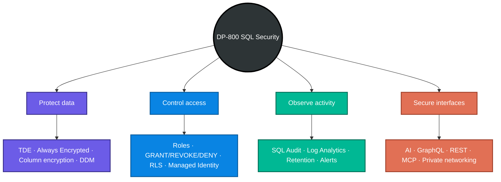

> **One-line exam strategy:** identify the asset, threat actor, lifecycle stage, and operational constraint—then choose the narrowest control that directly satisfies the requirement and combine it with supporting layers.
