# DP-800: Optimize Azure SQL Database Performance

> Detailed exam notes derived from the supplied module. These notes explain **what, why, how, and when**, add mathematical intuition and worked examples, correct a few easy-to-misread concurrency ideas, comment the code, and finish with **70 practice questions with explained answers**.

---

## Table of contents

1. [Exam objectives and performance mindset](#1-exam-objectives-and-performance-mindset)
2. [Recommend database configurations](#2-recommend-database-configurations)
3. [Transaction isolation and concurrency](#3-transaction-isolation-and-concurrency)
4. [Execution plans and dynamic management views](#4-execution-plans-and-dynamic-management-views)
5. [Query Store and Query Performance Insight](#5-query-store-and-query-performance-insight)
6. [Blocking and deadlocks](#6-blocking-and-deadlocks)
7. [Integrated performance-tuning lab](#7-integrated-performance-tuning-lab)
8. [DP-800 decision guide and exam traps](#8-dp-800-decision-guide-and-exam-traps)
9. [Rapid revision sheet](#9-rapid-revision-sheet)
10. [Practice set: 70 questions with explanations](#10-practice-set-70-questions-with-explanations)

---

## 1. Exam objectives and performance mindset

After studying this guide, you should be able to:

- recommend Azure SQL Database resource models, service tiers, and compute tiers;
- configure `MAXDOP`, automatic tuning, compatibility level, and plan-cache behavior;
- explain Accelerated Database Recovery (ADR) and monitor its Persistent Version Store (PVS);
- choose an isolation level that balances consistency and concurrency;
- interpret estimated and actual execution plans;
- use Dynamic Management Views (DMVs) to find expensive and currently running queries;
- use Query Store to diagnose regressions, force plans, and apply hints;
- diagnose blocking chains and capture deadlocks;
- implement safe transaction and deadlock-retry patterns.

### 1.1 Performance is a system, not a single query

A slow request may originate from several interacting layers:

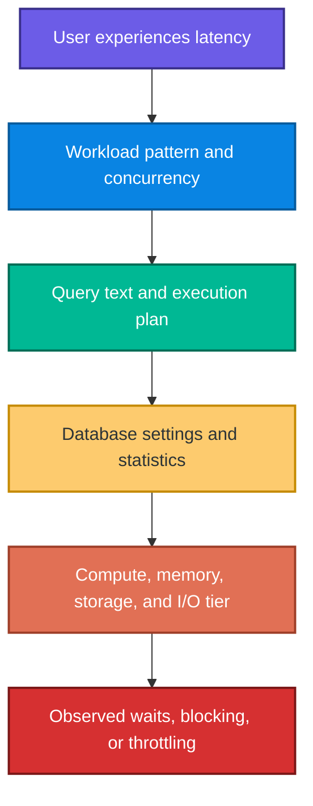

Scaling up can hide an inefficient plan temporarily. Adding an index cannot fix writer-writer blocking caused by an abandoned transaction. Reducing `MAXDOP` cannot fix storage latency. Good troubleshooting identifies the constrained resource and causal mechanism before applying a fix.

### 1.2 Four essential performance quantities

| Quantity | Meaning | Typical evidence |
|---|---|---|
| Latency | Time one request takes | Query duration, wait time |
| Throughput | Work completed per unit time | Transactions/second, executions/minute |
| Resource consumption | CPU, memory, logical reads, physical I/O, log writes | DMVs, Query Store, Azure metrics |
| Concurrency | Number of operations progressing together | Sessions, blocking chains, lock waits |

Useful formulas:

\[
\text{Average cost per execution}
= \frac{\text{Total accumulated cost}}{\text{Execution count}}
\]

\[
\text{Workload impact}
\approx \text{Average cost} \times \text{Execution count}
\]

A query that takes 200 ms once per day may matter less than a 10 ms query executed 100,000 times per hour.

### 1.3 A systematic tuning loop

```mermaid
flowchart LR
    B["Baseline"] --> F["Find expensive or waiting work"]
    F --> E["Examine plan and evidence"]
    E --> C["Change one controlled factor"]
    C --> M["Measure again"]
    M -->|Improved| K["Keep and monitor"]
    M -->|Not improved| F

    classDef baseline fill:#6C5CE7,color:#fff,stroke:#392F8A,stroke-width:2px
    classDef find fill:#0984E3,color:#fff,stroke:#075A9C,stroke-width:2px
    classDef examine fill:#00B894,color:#fff,stroke:#006C55,stroke-width:2px
    classDef change fill:#FDCB6E,color:#2D3436,stroke:#C58A00,stroke-width:2px
    classDef measure fill:#E17055,color:#fff,stroke:#9E3E28,stroke-width:2px
    classDef keep fill:#E84393,color:#fff,stroke:#9C1C5C,stroke-width:2px
    class B baseline
    class F find
    class E examine
    class C change
    class M measure
    class K keep
```

> **Exam memory aid:** Start broad with metrics/DMVs, isolate the expensive query, inspect its actual plan, apply a targeted fix, and compare against the baseline.

---

## 2. Recommend database configurations

### 2.1 vCore versus DTU resource models

#### vCore model

**What:** Exposes virtual cores, memory, storage, hardware generation, service tier, and compute tier as understandable choices.

**Why:** It maps more naturally to physical CPU/memory capacity and supports granular scaling and pricing options.

**When:** Prefer it for most new deployments and migrations from on-premises SQL Server.

#### DTU model

**What:** Bundles CPU, memory, and I/O into one Database Transaction Unit measurement.

**Why:** It simplifies purchasing when you do not need to size individual resource dimensions.

**When:** Use Basic, Standard, or Premium DTU packages for simpler, preconfigured capacity choices.

| Decision point | vCore | DTU |
|---|---|---|
| Resource visibility | CPU/memory/storage choices are explicit | Resources are bundled |
| Scaling granularity | High | Package-based |
| On-premises migration mapping | Straightforward | Less direct |
| Pricing flexibility in supplied module | Reserved pricing and Azure Hybrid Benefit | Preconfigured bundles |
| Default recommendation for new work | Usually preferred | Useful for simple bundled sizing |

### 2.2 vCore service tiers

The values below reproduce the comparison in the supplied module; use them as exam cues for this learning unit.

| Feature | General Purpose | Business Critical | Hyperscale |
|---|---|---|---|
| Storage architecture | Remote Azure Blob Storage | Local SSD per replica | Decoupled storage plus local SSD cache/page servers |
| Typical storage latency | 5–10 ms | 1–2 ms | Cache-dependent, scalable architecture |
| Maximum storage in module | 4 TB | 4 TB | 128 TB |
| Maximum IOPS per vCore in module | 320 | 4,000 | 5,500 on local SSD cache |
| Availability/read replicas | One HA replica; no read replica in table | Three secondaries plus one read replica | Zero to four configurable HA replicas; named replicas for read scale |
| Best fit | Budget-oriented general workloads | Low latency and high I/O | Very large databases and flexible scaling |

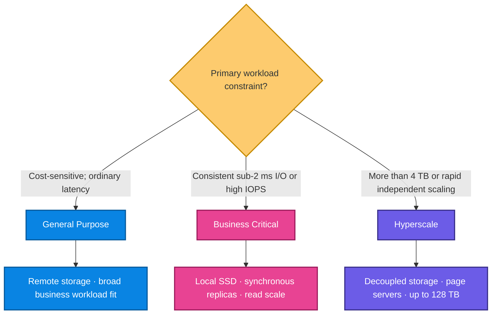

#### General Purpose

- Compute and storage are separated.
- Good cost/performance balance for most business workloads.
- Compute failover can attach the existing remote storage to another node.
- Not the best choice when every millisecond of storage latency matters.

#### Business Critical

- Local SSD reduces I/O latency.
- Always On architecture provides multiple synchronous replicas.
- A read-only replica can offload reporting.
- The module estimates about **2.7×** the General Purpose cost for the same vCore count, so the latency requirement must justify it.

#### Hyperscale

- Compute and storage scale more independently.
- Page servers and caching remove the practical 4 TB boundary of the other tiers.
- Scaling compute does not require copying the whole database.
- Useful for large/rapidly growing databases and read-scale scenarios.

### 2.3 Provisioned versus serverless compute

| Compute tier | Behavior | Billing intuition | Best use |
|---|---|---|---|
| Provisioned | Fixed vCores remain allocated | Predictable hourly capacity cost | Steady or predictable production workload |
| Serverless | Automatically scales within configured limits | Per-second compute usage | Intermittent, unpredictable, development, or internal workloads |

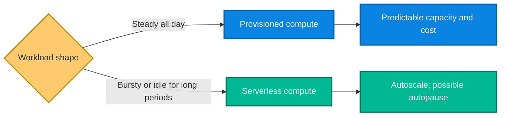

From the supplied module:

- serverless compute is available for General Purpose and Hyperscale;
- autopause is described as available only for General Purpose;
- provisioned compute is better when cold starts or unpredictable scale-up delays are unacceptable.

Approximate compute-cost intuition:

\[
\text{Provisioned cost} \approx
\text{fixed hourly rate} \times \text{elapsed hours}
\]

\[
\text{Serverless cost} \approx
\sum(\text{vCores used} \times \text{active seconds} \times \text{unit rate})
\]

Serverless saves money only when idle/low-utilization periods outweigh its operational trade-offs.

### 2.4 `MAXDOP`: control parallelism

`MAXDOP` limits the number of worker threads a parallel query can use.

- Azure SQL Database's default in the module is **8**.
- `MAXDOP 1` forces serial execution.
- `MAXDOP 0` permits the engine to use all available logical processors and is risky for shared production workloads.
- A query-level `OPTION (MAXDOP n)` can override the database setting for one statement.

```sql
-- Set the database-wide maximum degree of parallelism.
ALTER DATABASE SCOPED CONFIGURATION
SET MAXDOP = 8;

-- Limit only this aggregation to two worker threads.
SELECT CustomerID, SUM(TotalAmount) AS Revenue
FROM dbo.OrderHistory
GROUP BY CustomerID
OPTION (MAXDOP 2);
```

#### Why parallel is not always faster

Parallelism adds coordination and exchange overhead. A simplified Amdahl's Law model is:

\[
S(N)=\frac{1}{(1-P)+\frac{P}{N}}
\]

where:

- \(S(N)\) is speedup with \(N\) workers;
- \(P\) is the parallelizable fraction of the work;
- \(1-P\) is serial work.

If only 80% is parallelizable and four workers are used:

\[
S(4)=\frac{1}{0.2+0.8/4}=2.5
\]

Four workers produce only a 2.5× theoretical speedup before coordination overhead. This explains why higher `MAXDOP` can consume more total CPU without proportional latency improvement.

### 2.5 Automatic tuning

Azure SQL Database monitors plan/index changes, validates them over a window, and can revert harmful changes.

| Option | Purpose | Module default/guidance |
|---|---|---|
| `FORCE_LAST_GOOD_PLAN` | Detect a regression and force a previously faster plan | Enabled by default |
| `CREATE_INDEX` | Create and validate recommended indexes | Disabled by default; review carefully |
| `DROP_INDEX` | Remove unused/duplicate indexes | Disabled by default; unique/constraint indexes are protected |

```sql
ALTER DATABASE CURRENT
SET AUTOMATIC_TUNING (
    FORCE_LAST_GOOD_PLAN = ON,
    CREATE_INDEX = ON,
    DROP_INDEX = OFF
);
```

**When:** Automatic plan correction is especially valuable after data distribution changes or deployments. Index automation requires write-cost and storage review.

### 2.6 Compatibility level and Intelligent Query Processing

Compatibility level controls optimizer behavior without changing the database engine version.

| Level | Features highlighted in supplied module |
|---|---|
| 150 | Batch mode on rowstore, table-variable deferred compilation, scalar UDF inlining |
| 160 | Parameter Sensitive Plan (PSP) optimization, cardinality-estimation feedback |
| 170 | Optional Parameter Plan Optimization (OPPO) |

```sql
-- Unlock optimizer behavior associated with compatibility level 170.
ALTER DATABASE CURRENT
SET COMPATIBILITY_LEVEL = 170;
```

Do not change production blindly:

1. capture a Query Store baseline;
2. test the new level with representative workloads;
3. compare duration, CPU, reads, and plan changes;
4. force a previous plan temporarily if a regression occurs;
5. investigate root causes before making the workaround permanent.

> Imported or older databases can retain the source/previous compatibility level. Engine upgrades do not necessarily upgrade this setting.

### 2.7 `OPTIMIZE_FOR_AD_HOC_WORKLOADS`

Unique query text normally creates a separate cached compiled plan. Thousands of single-use queries can evict valuable reusable plans.

With this setting:

- first execution stores a small plan stub;
- second execution compiles/stores the full plan;
- single-use ad hoc plan cache bloat falls.

```sql
ALTER DATABASE SCOPED CONFIGURATION
SET OPTIMIZE_FOR_AD_HOC_WORKLOADS = ON;
```

A useful diagnostic ratio is:

\[
\text{Single-use plan ratio}
=\frac{\text{single-use cached plans}}{\text{all cached plans}}
\]

A high ratio plus memory pressure and many literal-only query variations makes this feature relevant. Parameterizing queries is another important remedy.

### 2.8 Accelerated Database Recovery (ADR)

ADR is always enabled in Azure SQL Database according to the module.

**Benefits:**

- near-constant-time recovery despite long active transactions;
- fast transaction rollback;
- aggressive transaction-log truncation.

**Mechanism:** Row versions are stored in a Persistent Version Store (PVS) inside the user database rather than the traditional `tempdb` version store. Versions can be in-row or off-row.

**Trade-offs:**

- extra row versions and log records for write-heavy workloads;
- possible page splits;
- PVS consumes database storage;
- long-running/aborted transactions can delay cleanup.

```sql
-- This DMV reports off-row PVS size; it does not include in-row versions.
SELECT
    database_id,
    persistent_version_store_size_kb
FROM sys.dm_tran_persistent_version_store_stats;
```

Track a baseline using:

\[
\text{Off-row PVS percentage}
=\frac{\text{PVS size KB}}{\text{database size KB}}\times100
\]

If the ratio grows far beyond the normal baseline, investigate long-running transactions and high abort rates.

### 2.9 Configuration selection example

An e-commerce database has these requirements:

- 600 GB data;
- steady traffic;
- checkout needs 1–2 ms storage latency;
- reporting should not compete with writes.

Reasoning:

1. 600 GB fits all tiers, so storage capacity is not decisive.
2. The latency target points to Business Critical.
3. Steady traffic points to provisioned compute.
4. The read-only replica can offload reporting.
5. Start with `MAXDOP 8`, capture a baseline, and adjust only with evidence.

---

## 3. Transaction isolation and concurrency

### 3.1 ACID and the role of isolation

Transactions are commonly described by ACID:

- **Atomicity:** all changes succeed or all roll back.
- **Consistency:** constraints/business invariants remain valid.
- **Isolation:** concurrent transactions behave as though protected from selected interference.
- **Durability:** committed data survives failure.

Isolation is not simply “more is better.” Stronger locking can improve consistency guarantees but reduce concurrency and increase blocking/deadlock risk.

### 3.2 Three concurrency anomalies

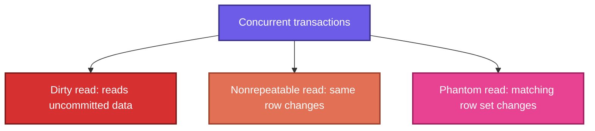

#### Dirty read

Transaction B reads Transaction A's uncommitted change. If A rolls back, B used a value that never became durable.

#### Nonrepeatable read

Transaction A reads the same row twice and sees different committed values because Transaction B updated it between the reads.

#### Phantom read

Transaction A repeats a predicate query and sees extra/missing rows because Transaction B inserted or deleted matching rows.

### 3.3 Isolation-level comparison

| Level/behavior | Dirty reads | Nonrepeatable reads | Phantom reads | Reader–writer blocking | Snapshot scope |
|---|---:|---:|---:|---:|---|
| `READ UNCOMMITTED` | Possible | Possible | Possible | Minimal/no shared-read locks | None |
| Locking `READ COMMITTED` | Prevented | Possible | Possible | Yes | None |
| `REPEATABLE READ` | Prevented | Prevented | Possible | Yes; row locks held longer | None |
| `SERIALIZABLE` | Prevented | Prevented | Prevented | Highest; key-range locks | None |
| RCSI behavior | Prevented | Possible across statements | Possible across statements | Readers do not block writers | Statement |
| `SNAPSHOT` | Prevented | Prevented | Prevented for transaction view | Readers do not block writers; update conflicts possible | Transaction |

### 3.4 Lock-based isolation levels

#### `READ UNCOMMITTED`

- Highest concurrency for reads, weakest correctness.
- Can read uncommitted, internally inconsistent data.
- Appropriate only when approximate results are truly acceptable.
- `NOLOCK` is not a universal performance fix; it trades blocking for correctness risk.

#### Locking `READ COMMITTED`

- Prevents dirty reads.
- Shared locks are normally released after the statement reads the resource.
- Repeated statements may see newly committed values or rows.

#### `REPEATABLE READ`

- Holds shared row locks until transaction end.
- Same rows cannot be changed by others while the transaction remains active.
- New qualifying rows can still appear because gaps are not fully protected.

#### `SERIALIZABLE`

- Uses key-range protection so the predicate's result set cannot gain phantoms.
- Strongest lock-based isolation.
- More blocking, memory pressure, and deadlock opportunity.
- Reserve for business rules that require serial equivalence, such as some reservation/reconciliation operations.

### 3.5 Row-versioning isolation

#### Read Committed Snapshot Isolation (RCSI)

- A database option that changes `READ COMMITTED` reads to use row versions.
- Each statement sees committed data as of that statement's start.
- Readers do not request shared locks that block writers.
- A later statement in the same transaction can see newer committed data.
- Enabled by default in Azure SQL Database according to the module.

#### `SNAPSHOT`

- All statements in the transaction see a consistent version from transaction start.
- Must be enabled with `ALLOW_SNAPSHOT_ISOLATION` and selected in the session.
- Competing updates can raise an update conflict; the application must handle/retry.

```sql
-- Enable transaction-level snapshot isolation for the database.
ALTER DATABASE CURRENT
SET ALLOW_SNAPSHOT_ISOLATION ON;
GO

-- Use one transaction-wide point-in-time view.
SET TRANSACTION ISOLATION LEVEL SNAPSHOT;
BEGIN TRANSACTION;

SELECT SUM(Balance) FROM dbo.Accounts;
SELECT COUNT(*) FROM dbo.Accounts;

COMMIT TRANSACTION;
```

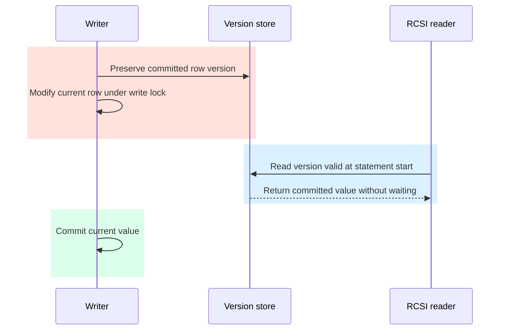

### 3.6 Correctly solve the “last item” problem

A common but dangerous pattern is:

1. `SELECT StockCount`;
2. application decides stock is available;
3. later `UPDATE StockCount = StockCount - 1`.

Even `READ COMMITTED` may oversell if two transactions both read `1` before either writes. A safer solution is a single atomic conditional update:

```sql
SET XACT_ABORT ON;
BEGIN TRANSACTION;

-- Only one concurrent transaction can successfully change 1 to 0.
UPDATE dbo.Products
SET StockCount = StockCount - 1
WHERE ProductID = 42
  AND StockCount >= 1;

IF @@ROWCOUNT = 0
BEGIN
    -- No row was updated: stock was already zero or product was absent.
    ROLLBACK TRANSACTION;
    THROW 50001, 'Product is out of stock.', 1;
END;

INSERT INTO dbo.Orders(ProductID, Quantity)
VALUES (42, 1);

COMMIT TRANSACTION;
```

Alternative designs may use `SERIALIZABLE`, `UPDLOCK`, or a proper reservation model, but the atomic predicate update is often simpler and reduces the lock window.

### 3.7 Optimized locking

The supplied module describes optimized locking as always enabled in Azure SQL Database and working with RCSI.

Two mechanisms:

1. **Transaction ID (TID) locking:** The transaction holds a compact transaction-level lock rather than retaining a large collection of row/page locks until commit.
2. **Lock After Qualification (LAQ):** The engine evaluates the latest committed row version first and locks only rows that actually qualify; LAQ requires RCSI.

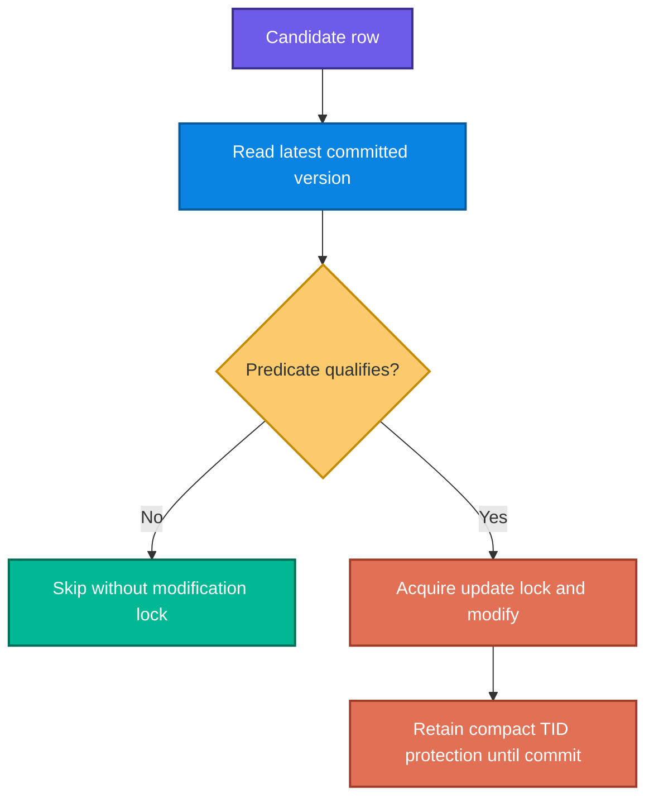

Optimized locking reduces lock count and escalation risk, but it does not allow two writers to update the same row simultaneously.

### 3.8 Isolation choice guide

| Requirement | Starting choice | Reason |
|---|---|---|
| Normal Azure SQL OLTP | Default RCSI + optimized locking | Strong general balance and little reader–writer blocking |
| Several statements need one consistent point in time | `SNAPSHOT` | Transaction-level snapshot |
| Predicate result must not gain/lose rows during transaction | `SERIALIZABLE` | Prevents phantoms with range protection |
| Approximate dashboard; correctness can be relaxed | `READ UNCOMMITTED` only after explicit risk acceptance | Avoids read locking but permits dirty/inconsistent reads |
| Same rows must remain unchanged but new matches are acceptable | `REPEATABLE READ` | Prevents nonrepeatable reads, not phantoms |

Always keep transactions short. Never wait for user input or an external API inside an open database transaction.

---

## 4. Execution plans and dynamic management views

### 4.1 What is an execution plan?

An execution plan is the optimizer's chosen tree of physical operators for reading, joining, filtering, sorting, and aggregating data.

The optimizer compares candidate plans using estimated cost and statistics. It does not search every imaginable plan; it searches a practical space under time/resource limits, so estimates matter enormously.

### 4.2 Estimated versus actual plans

| Plan | Executes query? | Contains estimates? | Contains runtime rows/timing/warnings? | Use case |
|---|---:|---:|---:|---|
| Estimated | No | Yes | No | Inspect risky statements without executing them |
| Actual | Yes | Yes | Yes | Diagnose real cardinality, memory, spills, and timing |

```sql
-- Return the estimated XML plan; following statements are not executed
-- until SHOWPLAN is turned off in the session.
SET SHOWPLAN_XML ON;
GO
SELECT * FROM dbo.OrderHistory WHERE CustomerID = 29485;
GO
SET SHOWPLAN_XML OFF;
GO
```

```sql
-- Execute and return the actual XML plan with runtime details.
SET STATISTICS XML ON;
SELECT * FROM dbo.OrderHistory WHERE CustomerID = 29485;
SET STATISTICS XML OFF;
```

> In an SSMS graphical plan, data generally flows from the rightmost leaf access operators toward the leftmost result operator. Follow the arrows and operator properties rather than memorizing a rigid visual direction.

### 4.3 Operator and warning checklist

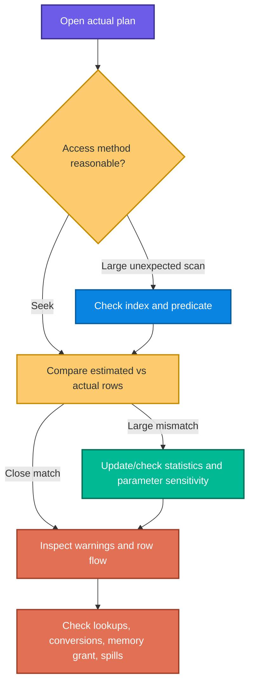

#### Seek versus scan

- **Index Seek:** Navigates index keys to a targeted range.
- **Index/Table Scan:** Reads a broad or complete structure.
- A scan is not automatically bad: it may be optimal for a small table or a query returning most rows.

Approximate selectivity:

\[
\text{Selectivity} = \frac{\text{rows returned}}{\text{total table rows}}
\]

Low selectivity value means a small fraction is returned and a suitable seek is more likely to help. High fraction means a scan may be reasonable.

#### Estimated versus actual rows

A large mismatch can cause:

- Nested Loops chosen for far more rows than expected;
- too-small memory grants and sort/hash spills;
- too-large memory grants that starve other queries;
- a scan/seek choice that fits one parameter but not another.

Check statistics, data skew, parameter sniffing, predicate expressions, and implicit conversions.

#### Key Lookup

A nonclustered index finds matching keys but lacks requested output columns. SQL performs one lookup into the clustered index for each matching row.

Remedies:

- include frequently returned columns in the nonclustered index;
- select fewer columns;
- reconsider the key order;
- accept the lookup if only a few rows match.

Included columns enlarge the index and increase insert/update/storage cost, so “cover everything” is not good index design.

#### Thick arrows

Arrow thickness visualizes row volume. A large flow early in a plan may indicate a missing filter, poor join order driven by estimates, or insufficient index support.

#### Common warnings

| Warning | Likely cause | First investigation |
|---|---|---|
| Missing statistics | Optimizer guessed distribution | Create/update statistics |
| Excessive memory grant | Row overestimate or wide operators | Statistics, earlier filtering, query shape |
| No join predicate | Missing/incorrect `ON`; Cartesian product | Correct join condition |
| Implicit conversion | Parameter/column types differ | Align data types so index stays searchable |
| Sort/hash spill | Grant too small, often due underestimate | Statistics, reduce rows/width, inspect grant feedback |

#### Join algorithms

| Join | Usually good when | Risk when |
|---|---|---|
| Nested Loops | Outer input is small and inner side is indexed | Outer input is much larger than estimated |
| Hash Match | Large unsorted inputs and equality join | Hash table spills due insufficient memory |
| Merge Join | Both inputs are ordered on join keys | Sorting inputs costs more than benefit |

### 4.4 Measure I/O and time

```sql
SET STATISTICS IO ON;
SET STATISTICS TIME ON;

SELECT OrderID, OrderDate, Status
FROM dbo.OrderHistory
WHERE CustomerID = 29485;

SET STATISTICS TIME OFF;
SET STATISTICS IO OFF;
```

SQL Server pages are 8 KB, so a useful logical-read approximation is:

\[
\text{Data pages touched (MB)}
\approx \text{logical reads}\times\frac{8}{1024}
\]

Example: 25,600 logical reads correspond to approximately 200 MB of page access. Logical reads are not identical to physical disk reads, but they still measure buffer-pool work and often correlate with CPU.

### 4.5 Covering-index example

```sql
CREATE NONCLUSTERED INDEX IX_OrderHistory_CustomerDate
ON dbo.OrderHistory (
    CustomerID,
    OrderDate DESC -- Supports date range and requested sort direction.
)
INCLUDE (
    ProductID,
    Quantity,
    UnitPrice,
    Status -- Output columns avoid repeated Key Lookups.
);
```

Why this order?

- `CustomerID` is an equality predicate, so it leads the key.
- `OrderDate` is a range and ordering requirement, so it follows.
- output-only columns are included rather than bloating the searchable key.

### 4.6 DMVs: broad runtime evidence

DMVs show current or accumulated engine state. In Azure SQL Database, the module identifies `VIEW DATABASE STATE` as required for these database-level views.

#### Find expensive cached statements

```sql
SELECT TOP (10)
    -- Guard against division by zero even though cached stats normally
    -- represent executed statements.
    qs.total_worker_time / NULLIF(qs.execution_count, 0) AS avg_cpu_time_us,
    qs.execution_count,
    qs.total_logical_reads / NULLIF(qs.execution_count, 0) AS avg_logical_reads,
    SUBSTRING(
        st.text,
        (qs.statement_start_offset / 2) + 1,
        ((CASE qs.statement_end_offset
            WHEN -1 THEN DATALENGTH(st.text)
            ELSE qs.statement_end_offset
          END - qs.statement_start_offset) / 2) + 1
    ) AS query_text
FROM sys.dm_exec_query_stats AS qs
CROSS APPLY sys.dm_exec_sql_text(qs.sql_handle) AS st
ORDER BY avg_cpu_time_us DESC;
```

Interpret average and frequency together:

\[
\text{Total worker impact}
=\text{avg CPU}\times\text{execution count}
\]

`sys.dm_exec_query_stats` depends on cached plans; cache eviction/restart can remove its history. Use Query Store for durable database history.

#### Inspect currently running requests

```sql
SELECT
    r.session_id,
    r.status,
    r.command,
    r.wait_type,
    r.wait_time,
    r.blocking_session_id,
    r.cpu_time,
    r.logical_reads,
    r.writes,
    t.text AS query_text
FROM sys.dm_exec_requests AS r
CROSS APPLY sys.dm_exec_sql_text(r.sql_handle) AS t
WHERE r.session_id > 50 -- Filter typical system sessions.
ORDER BY r.cpu_time DESC;
```

Use it for “what is happening now?”—high CPU, high reads, waits, and blockers.

#### Prioritize missing-index recommendations

```sql
SELECT
    mid.statement AS table_name,
    mid.equality_columns,
    mid.inequality_columns,
    mid.included_columns,
    migs.avg_total_user_cost
      * migs.avg_user_impact
      * (migs.user_seeks + migs.user_scans) AS improvement_measure
FROM sys.dm_db_missing_index_groups AS mig
INNER JOIN sys.dm_db_missing_index_group_stats AS migs
    ON migs.group_handle = mig.index_group_handle
INNER JOIN sys.dm_db_missing_index_details AS mid
    ON mig.index_handle = mid.index_handle
ORDER BY improvement_measure DESC;
```

Formula:

\[
\text{Improvement measure}
=\text{average user cost}
\times\text{average user impact}
\times(\text{user seeks}+\text{user scans})
\]

This is a prioritization estimate, not promised performance. Recommendations may overlap, ignore write overhead, and disappear when DMV state resets. Consolidate and test indexes.

### 4.7 Investigation order

1. Use Azure metrics/DMVs to determine CPU, I/O, wait, or blocking symptoms.
2. Use `sys.dm_exec_query_stats` or Query Store to identify high-impact queries.
3. Capture the actual plan.
4. Compare estimated versus actual cardinalities.
5. Inspect scans, lookups, conversions, spills, and row flow.
6. Apply one change: index, statistics update, query rewrite, hint, or capacity change.
7. measure with the same workload and rollback if worse.

---

## 5. Query Store and Query Performance Insight

### 5.1 Why Query Store exists

DMV/cache evidence can disappear. Query Store persists query texts, plans, runtime statistics, and wait statistics inside the database, enabling before/after comparison across deployments and plan changes.

### 5.2 Three internal stores

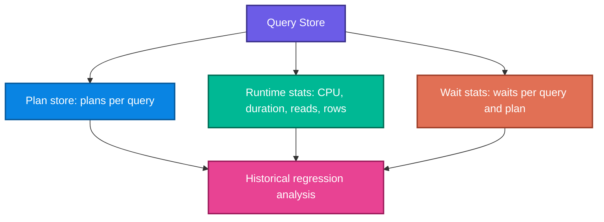

- Enabled by default in Azure SQL Database.
- Writes are asynchronous to reduce foreground workload overhead.
- Retention, capture mode, and maximum storage are configurable.

### 5.3 Configure and verify

```sql
ALTER DATABASE CURRENT
SET QUERY_STORE = ON (
    OPERATION_MODE = READ_WRITE,
    QUERY_CAPTURE_MODE = AUTO,
    WAIT_STATS_CAPTURE_MODE = ON
);
```

```sql
SELECT
    actual_state_desc,
    desired_state_desc,
    current_storage_size_mb,
    max_storage_size_mb,
    readonly_reason
FROM sys.database_query_store_options;
```

If desired state is `READ_WRITE` but actual state is `READ_ONLY`, Query Store may have hit its size limit:

```sql
ALTER DATABASE CURRENT
SET QUERY_STORE (MAX_STORAGE_SIZE_MB = 1024);
```

Use `AUTO` capture for most production workloads; `ALL` is useful for controlled labs but can capture large volumes of trivial queries.

### 5.4 Important SSMS reports

| Report | Question answered |
|---|---|
| Regressed Queries | Which queries became slower after a plan change? |
| Top Resource Consuming Queries | Which queries dominate CPU, duration, reads, or other metrics? |
| Queries With High Variation | Which queries fluctuate—possibly due to parameter sensitivity? |
| Queries With Forced Plans | Which plans are currently forced? |
| Query Wait Statistics | Which queries contribute to lock, CPU, I/O, or memory waits? |

### 5.5 Weighted average duration query

```sql
SELECT TOP (10)
    qt.query_sql_text,
    q.query_id,
    p.plan_id,
    -- Weight each interval's average by its execution count.
    ROUND(
        CONVERT(float, SUM(rs.avg_duration * rs.count_executions))
        / NULLIF(SUM(rs.count_executions), 0),
        2
    ) AS weighted_avg_duration,
    SUM(rs.count_executions) AS total_executions
FROM sys.query_store_query_text AS qt
INNER JOIN sys.query_store_query AS q
    ON qt.query_text_id = q.query_text_id
INNER JOIN sys.query_store_plan AS p
    ON q.query_id = p.query_id
INNER JOIN sys.query_store_runtime_stats AS rs
    ON p.plan_id = rs.plan_id
WHERE rs.last_execution_time > DATEADD(hour, -1, GETUTCDATE())
GROUP BY qt.query_sql_text, q.query_id, p.plan_id
ORDER BY weighted_avg_duration DESC;
```

Formula:

\[
\bar{x}_{weighted}
=\frac{\sum_i(\text{interval average}_i\times\text{executions}_i)}
{\sum_i\text{executions}_i}
\]

A simple average of interval averages would be misleading when intervals contain different execution counts.

### 5.6 Plan regression and parameter sniffing

Parameter sniffing occurs when a parameterized statement compiles using one parameter's data distribution and reuses that plan for different parameters.

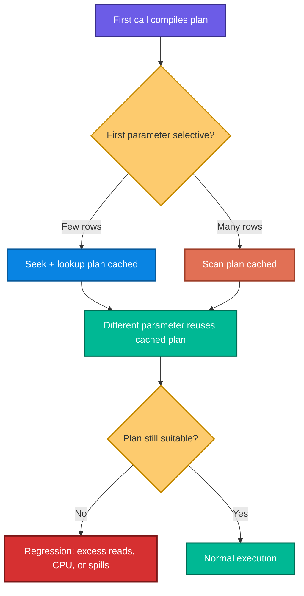

Query Store reveals multiple plans and their resource profiles. Short-term mitigation can force the plan that best serves the dominant workload. Long-term remedies may include:

- better indexes;
- updated statistics;
- query redesign;
- `OPTION (RECOMPILE)` where compile cost is acceptable;
- Parameter Sensitive Plan optimization at compatibility level 160;
- redesigning optional predicates or using OPPO at level 170 where applicable.

### 5.7 Force and unforce a plan

```sql
-- Immediate mitigation: force a known-good historical plan.
EXEC sys.sp_query_store_force_plan
    @query_id = 42,
    @plan_id = 17;

-- Remove mitigation after the underlying cause is fixed and validated.
EXEC sys.sp_query_store_unforce_plan
    @query_id = 42,
    @plan_id = 17;
```

Plan forcing is a performance rollback, not a guaranteed permanent fix. Schema/index changes may make the forced plan impossible; monitor `force_failure_count`.

### 5.8 Query Store hints

```sql
-- Reduce parallel worker usage without editing application SQL.
EXEC sys.sp_query_store_set_hints
    @query_id = 42,
    @query_hints = N'OPTION (MAXDOP 1)';

-- Compile for each execution; useful when parameter distributions vary
-- greatly and compile cost is acceptable.
EXEC sys.sp_query_store_set_hints
    @query_id = 42,
    @query_hints = N'OPTION (RECOMPILE)';

-- Combine supported hints.
EXEC sys.sp_query_store_set_hints
    @query_id = 42,
    @query_hints = N'OPTION (MAXDOP 1, MAX_GRANT_PERCENT = 10)';

-- Restore normal optimizer behavior.
EXEC sys.sp_query_store_clear_hints @query_id = 42;
```

Document each hint, its owner, evidence, review date, and removal condition.

### 5.9 Query Performance Insight (QPI)

QPI visualizes Query Store data in the Azure portal.

It supports views by CPU, duration, and execution count; time filters; aggregation; and drill-down charts. Database Advisor annotations can connect observed behavior with recommendations.

Limitations from the module:

- shows only the top 5–20 queries;
- many small queries with large collective impact can be hidden;
- requires Query Store to remain active/read-write;
- deep analysis still requires SSMS/catalog queries.

### 5.10 Query Store operating practice

1. Keep capture mode `AUTO` for ordinary production.
2. Use automatic size-based cleanup.
3. Check Regressed Queries after deployments, statistics changes, and index changes.
4. Force a known-good plan only as a controlled mitigation.
5. Fix the underlying index/statistics/query problem.
6. Remove forcing/hints after validation.
7. Monitor Query Store size and actual state.

---

## 6. Blocking and deadlocks

### 6.1 Blocking versus deadlock

| Condition | Shape | Engine response | Application impact |
|---|---|---|---|
| Blocking | A waits for B; B can eventually finish | Waits normally | Latency/timeouts if prolonged |
| Deadlock | A waits for B and B waits for A in a cycle | Chooses a victim and rolls it back | Error 1205; retry needed |

Brief blocking is normal. Investigate when duration affects service-level objectives or creates long chains.

### 6.2 Find blocked requests

```sql
SELECT
    r.session_id AS blocked_session_id,
    r.blocking_session_id,
    r.wait_type,
    r.wait_time AS wait_time_ms,
    r.wait_resource,
    r.status,
    r.command,
    t.text AS blocked_query
FROM sys.dm_exec_requests AS r
CROSS APPLY sys.dm_exec_sql_text(r.sql_handle) AS t
WHERE r.blocking_session_id <> 0
ORDER BY r.wait_time DESC;
```

Example chain:

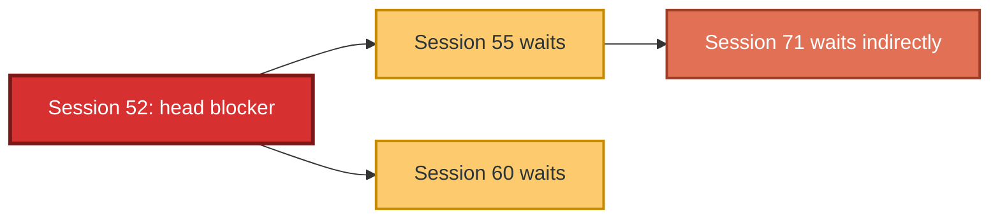

The head blocker blocks others but has `blocking_session_id = 0`. It may be actively running, sleeping with an open transaction, or disconnected/orphaned.

### 6.3 Inspect the head blocker

```sql
SELECT
    s.session_id,
    s.status,
    s.login_time,
    s.program_name,
    s.host_name,
    c.connect_time,
    s.last_request_start_time,
    s.last_request_end_time,
    t.text AS most_recent_query
FROM sys.dm_exec_sessions AS s
LEFT JOIN sys.dm_exec_connections AS c
    ON s.session_id = c.session_id
OUTER APPLY sys.dm_exec_sql_text(c.most_recent_sql_handle) AS t
WHERE s.session_id = @HeadBlockerSessionID;
```

`OUTER APPLY` is used so a session can still appear even when no text handle is available.

### 6.4 Common causes and remedies

| Cause | Evidence | Remedy |
|---|---|---|
| Long-running query | Active request with time/reads increasing | Tune plan/index; batch work; reduce affected rows |
| Sleeping session with open transaction | Session sleeping; locks remain | Fix application transaction handling; `XACT_ABORT`; terminate only after assessment |
| Unfetched result set | Client does not consume/close results | Fetch/close correctly; RCSI reduces reader impact |
| Rollback in progress | Session shows rollback | Usually wait; ADR reduces duration in Azure SQL |
| Orphaned connection | Client gone but session/transaction remains | `KILL <session_id>` after verification; fix connection handling |

RCSI removes most reader–writer blocking, but two writers targeting the same row still conflict.

### 6.5 Safe transaction template

```sql
CREATE OR ALTER PROCEDURE dbo.UpdateOrderStatus
    @OrderID int,
    @Status nvarchar(20)
AS
BEGIN
    SET NOCOUNT ON;
    -- Most runtime errors automatically roll back the transaction.
    SET XACT_ABORT ON;

    BEGIN TRY
        BEGIN TRANSACTION;

        UPDATE dbo.OrderHistory
        SET Status = @Status
        WHERE OrderID = @OrderID;

        IF @@ROWCOUNT = 0
            THROW 50002, 'Order not found.', 1;

        COMMIT TRANSACTION;
    END TRY
    BEGIN CATCH
        -- XACT_STATE() is nonzero when a transaction is still active,
        -- including an uncommittable transaction (-1).
        IF XACT_STATE() <> 0
            ROLLBACK TRANSACTION;

        THROW;
    END CATCH;
END;
```

Do not hold this transaction open while calling an API, waiting for a user, or performing unrelated computation.

### 6.6 Deadlock cycle

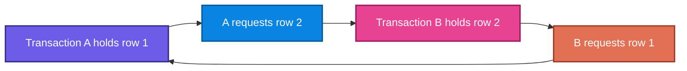

The engine chooses a transaction—typically the least costly victim—to roll back and returns error **1205**. The other transaction then proceeds.

### 6.7 Capture Azure SQL Database deadlocks

Azure SQL Database uses a database-scoped Extended Events session in the supplied module:

```sql
-- Create a database-scoped event session and capture XML deadlock graphs.
CREATE EVENT SESSION [deadlocks] ON DATABASE
ADD EVENT sqlserver.database_xml_deadlock_report
ADD TARGET package0.ring_buffer
WITH (
    STARTUP_STATE = ON,
    MAX_MEMORY = 4 MB
);
GO

ALTER EVENT SESSION [deadlocks]
ON DATABASE STATE = START;
GO
```

```sql
DECLARE @SessionName sysname = N'deadlocks';

SELECT
    event_node.value('(/event/@timestamp)[1]', 'datetime2') AS deadlock_time,
    event_node.query(
        '/event/data[@name="xml_report"]/value/deadlock'
    ) AS deadlock_xml
FROM (
    SELECT CAST(t.target_data AS xml) AS ring_buffer_xml
    FROM sys.dm_xe_database_sessions AS s
    INNER JOIN sys.dm_xe_database_session_targets AS t
        ON CAST(t.event_session_address AS binary(8))
         = CAST(s.address AS binary(8))
    WHERE s.name = @SessionName
      AND t.target_name = N'ring_buffer'
) AS rb
CROSS APPLY rb.ring_buffer_xml.nodes(
    '/RingBufferTarget/event[@name="database_xml_deadlock_report"]'
) AS deadlock_events(event_node)
ORDER BY deadlock_time DESC;
```

Deadlock graph sections:

- **victim-list:** transaction rolled back;
- **process-list:** statements, isolation levels, and lock modes;
- **resource-list:** owned/requested resources forming the cycle.

### 6.8 Prevent and recover from deadlocks

Prevention:

- access tables/rows in a consistent order;
- keep transactions short;
- add indexes so statements lock fewer rows;
- use RCSI for reads where appropriate;
- investigate plan regressions that suddenly broaden scans;
- avoid user/external calls inside transactions.

Recovery:

- catch error 1205;
- roll back safely;
- wait with randomized exponential backoff;
- retry a bounded number of times;
- log the failure when retries are exhausted.

Backoff intuition:

\[
\text{delay}_k
=\min(\text{cap},\ \text{base}\times2^k)+\text{random jitter}
\]

Jitter prevents two transactions from retrying in lockstep and deadlocking again.

Application-style pseudocode:

```text
for attempt from 0 to maxRetries:
    try:
        execute entire transaction
        return success
    catch database error 1205:
        if attempt == maxRetries:
            rethrow
        wait min(cap, base * 2^attempt) + random_jitter
```

> Retrying only the failed statement may be incorrect. Retry the entire logical transaction so all business decisions are recomputed from fresh data.

---

## 7. Integrated performance-tuning lab

### 7.1 Lab workflow

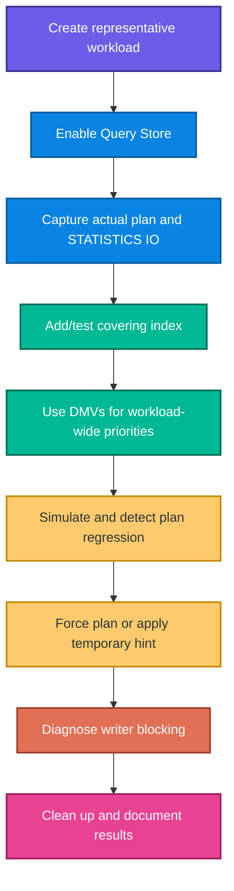

### 7.2 Create the workload table

```sql
DROP TABLE IF EXISTS dbo.OrderHistory;

CREATE TABLE dbo.OrderHistory (
    OrderID int IDENTITY(1,1) PRIMARY KEY,
    CustomerID int NOT NULL,
    ProductID int NOT NULL,
    OrderDate datetime NOT NULL,
    Quantity int NOT NULL,
    UnitPrice decimal(10,2) NOT NULL,
    -- Persist the computed amount so it is stored and can be indexed/read
    -- without recomputing during every query.
    TotalAmount AS (Quantity * UnitPrice) PERSISTED,
    Status nvarchar(20) NOT NULL
);

-- Generate 80,000 pseudo-random orders from sample customers/products.
INSERT INTO dbo.OrderHistory
    (CustomerID, ProductID, OrderDate, Quantity, UnitPrice, Status)
SELECT TOP (80000)
    c.CustomerID,
    p.ProductID,
    DATEADD(day, -ABS(CHECKSUM(NEWID())) % 365, GETDATE()),
    ABS(CHECKSUM(NEWID())) % 10 + 1,
    p.ListPrice,
    CASE ABS(CHECKSUM(NEWID())) % 4
        WHEN 0 THEN N'Pending'
        WHEN 1 THEN N'Processing'
        WHEN 2 THEN N'Shipped'
        ELSE N'Delivered'
    END
FROM SalesLT.Customer AS c
CROSS JOIN SalesLT.Product AS p
ORDER BY NEWID();
```

### 7.3 Baseline the slow lookup

```sql
SET STATISTICS IO ON;

SELECT
    oh.OrderID,
    oh.OrderDate,
    p.Name AS ProductName,
    oh.Quantity,
    oh.UnitPrice,
    oh.TotalAmount,
    oh.Status
FROM dbo.OrderHistory AS oh
INNER JOIN SalesLT.Product AS p
    ON oh.ProductID = p.ProductID
WHERE oh.CustomerID = 29485
  AND oh.OrderDate >= DATEADD(month, -3, GETDATE())
ORDER BY oh.OrderDate DESC;

SET STATISTICS IO OFF;
```

Capture:

- duration and CPU;
- logical reads;
- actual versus estimated rows;
- access operator;
- warnings;
- returned row count.

### 7.4 Add and validate the covering index

```sql
CREATE NONCLUSTERED INDEX IX_OrderHistory_CustomerDate
ON dbo.OrderHistory (CustomerID, OrderDate DESC)
INCLUDE (ProductID, Quantity, UnitPrice, Status);
```

Run the same query under the same conditions. A valid conclusion uses measured before/after evidence, not only the optimizer's estimated missing-index percentage.

Improvement percentage:

\[
\text{Improvement \%}
=\frac{\text{Before}-\text{After}}{\text{Before}}\times100
\]

Example: logical reads fall from 10,000 to 200:

\[
\frac{10{,}000-200}{10{,}000}\times100=98\%
\]

### 7.5 Simulate parameter sensitivity

The lab makes one customer have 50,000+ orders and most others fewer than 100. A noncovering index makes a seek plus lookups good for a small customer, while a scan may be better for the large customer.

```sql
CREATE OR ALTER PROCEDURE dbo.GetCustomerOrders
    @CustomerID int
AS
BEGIN
    SET NOCOUNT ON;

    SELECT
        oh.OrderID,
        oh.OrderDate,
        p.Name AS ProductName,
        oh.Quantity,
        oh.UnitPrice,
        oh.TotalAmount,
        oh.Status
    FROM dbo.OrderHistory AS oh
    INNER JOIN SalesLT.Product AS p
        ON oh.ProductID = p.ProductID
    WHERE oh.CustomerID = @CustomerID
    ORDER BY oh.OrderDate DESC;
END;
```

Controlled lab sequence:

1. clear the procedure cache;
2. execute a selective customer so a seek plan compiles;
3. record it in Query Store;
4. clear cache;
5. execute the high-volume customer so a scan compiles;
6. call the selective customer again and observe scan-plan reuse;
7. flush Query Store for immediate GUI inspection;
8. compare plans and force the temporary known-good plan;
9. verify `is_forced_plan` and `force_failure_count`;
10. pursue a permanent design rather than leaving the workaround unexplained.

### 7.6 Query Store hint experiment

Apply `MAXDOP 1` to a parallel aggregation, then compare:

- elapsed duration;
- total CPU;
- worker/thread usage;
- presence of `Gather Streams`;
- spill/memory behavior.

The serial plan may reduce concurrent CPU pressure while increasing one query's wall-clock time. Tuning is a workload trade-off, not a single-query beauty contest.

### 7.7 Writer-blocking experiment

Window 1:

```sql
BEGIN TRANSACTION;
UPDATE dbo.OrderHistory
SET Status = N'Cancelled'
WHERE OrderID = 1;
-- Intentionally do not commit yet.
```

Window 2:

```sql
-- This waits for Window 1's exclusive lock.
UPDATE dbo.OrderHistory
SET Status = N'Shipped'
WHERE OrderID = 1;
```

Window 3 runs the blocking DMV query, identifies the head blocker, and inspects the sleeping/open transaction. Resolve the controlled lab with:

```sql
-- Run in Window 1.
ROLLBACK TRANSACTION;
```

In production, do not issue `KILL` casually. Confirm session ownership, business impact, rollback cost, and whether the transaction can complete normally.

---

## 8. DP-800 decision guide and exam traps

### 8.1 Requirement-to-feature mapping

| Requirement clue | Best starting answer | Why |
|---|---|---|
| Most new deployments or on-prem migration sizing | vCore | Explicit CPU/memory mapping and granular scaling |
| Ordinary workload with moderate latency and cost focus | General Purpose | Broad cost/performance fit |
| Consistent 1–2 ms I/O and highest IOPS | Business Critical | Local SSD architecture |
| Database exceeds 4 TB | Hyperscale | Up to 128 TB in supplied module |
| Long idle periods | Serverless | Autoscale/per-second usage; possible autopause in GP |
| Stable 24×7 workload | Provisioned | Predictable available capacity |
| One query consumes too many workers | Query-level `MAXDOP` or Query Store hint | Narrower than global reduction |
| Plan became slow after deployment | Query Store Regressed Queries | Historical plans and runtime comparison |
| Immediate rollback to known plan | Force previous Query Store plan | No application rollback required |
| Many single-use cached plans | `OPTIMIZE_FOR_AD_HOC_WORKLOADS` plus parameterization | First-use stubs reduce cache bloat |
| Multi-statement transaction needs one consistent view | `SNAPSHOT` | Transaction-level snapshot |
| Prevent phantom rows | `SERIALIZABLE` | Key-range locks |
| Readers should not block writers | RCSI | Statement-level row versions |
| Find active request and blocker | `sys.dm_exec_requests` | Current request/wait/blocking data |
| Historical resource regression | Query Store | Durable plan/runtime history |
| Large estimated/actual row mismatch | Statistics/parameter sensitivity investigation | Optimizer planned from incorrect cardinality |
| Seek followed by many Key Lookups | Cover output columns or redesign | Avoid repeated clustered lookups |
| Detect Azure SQL deadlocks | Database-scoped Extended Events | Captures XML deadlock graph |
| Recover from error 1205 | Bounded retry with jitter | Victim transaction has been rolled back |

### 8.2 Frequent exam traps

1. **“Seek good, scan bad.”** A scan can be optimal for small tables or large result fractions.
2. **“Scale first.”** Scaling may mask bad SQL; diagnose first unless the database is demonstrably resource-capped.
3. **“READ COMMITTED prevents overselling.”** A separate read-then-write pattern can still race. Use an atomic conditional update or stronger coordination.
4. **“RCSI prevents all blocking.”** It removes reader–writer blocking; writers can still block writers.
5. **“SNAPSHOT and RCSI are identical.”** RCSI snapshots each statement; SNAPSHOT uses transaction start.
6. **“Higher isolation is always better.”** It may reduce throughput and increase deadlocks.
7. **“Estimated plan shows actual behavior.”** Only actual plans include runtime metrics.
8. **“Missing-index recommendation must be applied.”** It ignores overlapping indexes and write cost; review and test.
9. **“DMVs provide permanent history.”** Many DMV statistics depend on cache/uptime; Query Store persists history.
10. **“Plan forcing is permanent tuning.”** It is often a temporary mitigation; fix the underlying cause.
11. **“MAXDOP 1 is always safer.”** It lowers parallel resource usage but can substantially increase latency.
12. **“Kill the blocker immediately.”** First verify ownership, progress, and rollback consequences.
13. **“Retry only the deadlocked statement.”** Retry the entire logical transaction.
14. **“Query Store desired state equals actual state.”** It can switch to read-only when full.
15. **“Sleeping means harmless.”** A sleeping session can hold an uncommitted transaction and exclusive locks.

---

## 9. Rapid revision sheet

### Configuration

- vCore = explicit CPU/memory/storage; DTU = bundled resources.
- General Purpose = cost-focused remote storage.
- Business Critical = local SSD, lowest latency, read replica.
- Hyperscale = up to 128 TB in module, independent storage/compute scaling.
- Provisioned = steady; serverless = intermittent.
- Default `MAXDOP` in module = 8; avoid unbounded parallelism without evidence.
- Automatic tuning: last good plan on by default; index create/drop require care.
- Compatibility 150/160/170 unlocks IQP/PSP/OPPO features.
- Ad hoc optimization stores a stub on first execution.
- ADR uses PVS inside the database; monitor long transactions and PVS size.

### Concurrency

- Dirty = uncommitted value.
- Nonrepeatable = same row changes.
- Phantom = result set gains/loses rows.
- RCSI = statement snapshot and minimal reader–writer blocking.
- SNAPSHOT = transaction snapshot and possible update conflicts.
- SERIALIZABLE = range locks, no phantoms, most blocking.
- Optimized locking = TID + LAQ; does not eliminate same-row writer conflicts.

### Plans and monitoring

- Actual plan = estimates + runtime rows/timing/warnings.
- Large estimate error → statistics, skew, parameter sensitivity, conversions.
- Repeated Key Lookup → consider covering index.
- Spill → insufficient grant, often underestimated rows.
- `dm_exec_query_stats` = expensive cached work.
- `dm_exec_requests` = running work and blockers.
- Query Store = durable texts/plans/runtime/waits.
- QPI = portal visualization of Query Store, top 5–20.

### Blocking and deadlocks

- Head blocker blocks others but is not blocked.
- Sleeping session may hold open transaction.
- `SET XACT_ABORT ON` plus `TRY/CATCH` prevents stranded transactions.
- Deadlock = cycle; victim gets error 1205.
- Prevent with consistent access order, short transactions, indexes, RCSI.
- Retry whole transaction with bounded exponential backoff and jitter.

---

## 10. Practice set: 70 questions with explanations

Try each question before expanding its answer.

### Part A — Foundation warm-up (1)

#### 1. Which Azure SQL Database resource model exposes vCores, memory, storage, hardware, and compute tier separately?

A. DTU  
B. vCore  
C. RCSI  
D. Query Store

<details><summary>Answer and explanation</summary>

**Answer: B — vCore.** The vCore model provides explicit control over compute and storage dimensions. DTU bundles CPU, memory, and I/O into preconfigured units; RCSI and Query Store are database behaviors, not purchasing models.

</details>

### Part B — Scenario-based questions (2–15)

#### 2. A 900 GB line-of-business database has moderate I/O latency requirements and a strict budget. Traffic is steady. Recommend a tier and compute model.

<details><summary>Model answer and explanation</summary>

Start with **General Purpose on provisioned vCore compute**. The database fits below 4 TB, does not require local-SSD latency, and has steady traffic. Provisioned compute offers predictable capacity. Validate with a workload baseline; move to Business Critical only if evidence shows the remote-storage latency ceiling violates requirements.

</details>

#### 3. A 7 TB database is growing by 300 GB every month, and compute must scale without copying all data. What should be recommended?

<details><summary>Model answer and explanation</summary>

Choose **Hyperscale**. The size exceeds the 4 TB limit given for General Purpose and Business Critical, and Hyperscale's decoupled storage architecture supports large databases and compute scaling without a full data copy.

</details>

#### 4. A reporting query completes faster with `MAXDOP 16`, but checkout requests time out during the report. What should you do?

<details><summary>Model answer and explanation</summary>

Optimize for the workload, not only the report. Capture CPU/worker waits and compare lower degrees of parallelism. Apply a query-specific `MAXDOP` or Query Store hint to the report rather than immediately lowering the whole database. The report may take longer, but preserving checkout throughput is the higher business priority.

</details>

#### 5. After upgrading compatibility level, three queries switch from seeks to scans. How should the team respond?

<details><summary>Model answer and explanation</summary>

Use Query Store to compare prior and new plans and runtime metrics. Force known-good plans temporarily if service is affected, then investigate statistics, indexes, cardinality-estimator changes, and query patterns in a test environment. Do not discard the compatibility upgrade blindly; fix or isolate the regressions and retest.

</details>

#### 6. Plan cache analysis shows 80% of entries are single-use statements that differ only in literal values. Recommend two complementary actions.

<details><summary>Model answer and explanation</summary>

Enable `OPTIMIZE_FOR_AD_HOC_WORKLOADS` to store a plan stub on first use, and parameterize application queries so literal variations can share plans. The first action reduces first-use memory; the second attacks the cause of non-reuse.

</details>

#### 7. A financial report executes four queries inside one transaction and must see all balances at the same point in time without blocking writers. Which isolation level fits?

<details><summary>Model answer and explanation</summary>

Use **`SNAPSHOT` isolation** after enabling `ALLOW_SNAPSHOT_ISOLATION`. It provides one transaction-start view across all four statements. RCSI provides only a statement-start snapshot, so later statements could see newer commits.

</details>

#### 8. Two customers can both purchase the final unit even though the database uses locking `READ COMMITTED`. Why, and how should it be corrected?

<details><summary>Model answer and explanation</summary>

If both transactions read stock `1` before either updates, releasing the read lock after each statement does not preserve the business decision. Use an atomic conditional update such as `UPDATE ... SET StockCount=StockCount-1 WHERE StockCount>=1`, check `@@ROWCOUNT`, and insert the order in the same short transaction. `SERIALIZABLE` or appropriate update locks are alternatives when correctly designed.

</details>

#### 9. A dashboard needs approximate counts and must never wait behind writers. Is `READ UNCOMMITTED` appropriate?

<details><summary>Model answer and explanation</summary>

It may be acceptable only if the business explicitly tolerates dirty, duplicate, missing, or internally inconsistent results. In Azure SQL, default RCSI is usually safer because it avoids reader–writer blocking while returning committed versions. Therefore choose RCSI unless approximate uncommitted visibility is intentionally accepted.

</details>

#### 10. A plan estimates 10 rows but processes 2 million, then a hash operator spills. Explain the causal chain.

<details><summary>Model answer and explanation</summary>

The cardinality underestimate leads the optimizer to request too little memory and possibly choose operators suited to a small input. At runtime, the hash table exceeds its grant and spills to temporary storage, increasing I/O and latency. Investigate stale/missing statistics, skew, parameter sensitivity, conversions, and predicate expressions before merely increasing memory.

</details>

#### 11. A customer lookup uses an Index Seek followed by 40,000 Key Lookups. The query selects six non-key columns. What should be tested?

<details><summary>Model answer and explanation</summary>

Test a covering index with the filtering/order columns as keys and frequently returned columns as `INCLUDE` columns. Compare reads, duration, and write/storage overhead. If 40,000 rows are routinely returned, a scan or query redesign/pagination may still be more appropriate than an extremely wide covering index.

</details>

#### 12. Users report a page became slow two days after deployment, but it is fast in a developer test. Which feature should be used first?

<details><summary>Model answer and explanation</summary>

Use **Query Store**, especially Regressed Queries and plan history. It preserves the actual production plans and metrics from before/after deployment. Developer reproduction may not match production parameters, data distribution, concurrency, or cached plan state.

</details>

#### 13. A forced plan fixes 95% of calls but makes one large customer slower. What is the long-term response?

<details><summary>Model answer and explanation</summary>

Treat forcing as temporary. Investigate parameter sensitivity and use a permanent strategy such as a covering index, PSP optimization at compatibility level 160, query branching, or selective recompilation. Monitor both the dominant small-customer workload and the large outlier before removing the force.

</details>

#### 14. Session 82 is sleeping, has an open transaction, and blocks 40 warehouse sessions. What should the operator do?

<details><summary>Model answer and explanation</summary>

Verify that session 82 is the head blocker, identify its application/owner and transaction, and determine whether it can safely commit/roll back. If it is abandoned, terminate it with `KILL 82` after assessing rollback impact. Correct the application using short transactions, `SET XACT_ABORT ON`, `TRY/CATCH`, and reliable connection cleanup.

</details>

#### 15. Two procedures deadlock because one updates `Orders` then `Inventory`, while the other updates `Inventory` then `Orders`. Give the primary prevention and recovery measures.

<details><summary>Model answer and explanation</summary>

Standardize both procedures to access objects in the same order, keep the transactions short, and add/select indexes so fewer rows are locked. Capture the XML deadlock graph to verify the cycle. The application must catch error 1205 and retry the entire transaction with bounded randomized backoff.

</details>

### Part C — Code analysis and troubleshooting (16–24)

#### 16. What is risky about this production setting?

```sql
ALTER DATABASE SCOPED CONFIGURATION SET MAXDOP = 0;
```

<details><summary>Answer and explanation</summary>

`MAXDOP 0` permits the optimizer to use all available logical processors for a parallel query. One expensive analytical request can consume excessive workers and CPU, starving concurrent OLTP requests. Start with the documented default/baseline and use targeted query-level control where possible.

</details>

#### 17. Why does the following pattern still risk overselling?

```sql
BEGIN TRANSACTION;
SELECT @Stock = StockCount
FROM dbo.Products
WHERE ProductID = 42;

IF @Stock > 0
    UPDATE dbo.Products
    SET StockCount = StockCount - 1
    WHERE ProductID = 42;
COMMIT;
```

<details><summary>Answer and explanation</summary>

Under locking `READ COMMITTED`, the shared lock from the `SELECT` can be released before the `UPDATE`. Two sessions may both read `1`, both decide to proceed, and both decrement. Use one conditional atomic update and check `@@ROWCOUNT`, or apply a correctly designed locking/serializable strategy.

</details>

#### 18. What is wrong with using this predicate when `CustomerID` is an `int`?

```sql
WHERE CONVERT(nvarchar(20), CustomerID) = @CustomerIDText;
```

<details><summary>Answer and explanation</summary>

The function is applied to the indexed column, so the engine may be unable to seek efficiently and may convert every row. Convert/validate the parameter to `int` and compare `CustomerID = @CustomerIDInt`. Matching data types preserves sargability.

</details>

#### 19. This DMV query fails intermittently with divide-by-zero. Improve it.

```sql
SELECT total_worker_time / execution_count AS avg_cpu
FROM sys.dm_exec_query_stats;
```

<details><summary>Answer and explanation</summary>

Use `NULLIF` defensively:

```sql
SELECT
    total_worker_time / NULLIF(execution_count, 0) AS avg_cpu
FROM sys.dm_exec_query_stats;
```

`NULLIF(execution_count,0)` returns `NULL` for zero, avoiding an error. Also remember integer division may truncate; convert to `decimal`/`float` if fractional precision matters.

</details>

#### 20. Why is this Query Store average mathematically weak?

```sql
SELECT AVG(avg_duration)
FROM sys.query_store_runtime_stats;
```

<details><summary>Answer and explanation</summary>

It gives every runtime interval equal weight even if one interval has 1 execution and another has 10,000. Use a weighted average: `SUM(avg_duration * count_executions) / SUM(count_executions)` grouped by the desired query/plan and time range.

</details>

#### 21. What operational issue does this procedure risk?

```sql
BEGIN TRANSACTION;
UPDATE dbo.Orders SET Status = N'Processing' WHERE OrderID = @OrderID;
EXEC dbo.CallExternalShippingService @OrderID;
COMMIT;
```

<details><summary>Answer and explanation</summary>

It holds database locks while waiting for an external service whose latency/failure is outside SQL's control. Move the external call outside the transaction and use a durable workflow/outbox/state transition when cross-system consistency is required. Keep the database transaction to the minimum local work.

</details>

#### 22. The following catch block throws error 3903 when no transaction is active. Fix it.

```sql
BEGIN CATCH
    ROLLBACK TRANSACTION;
    THROW;
END CATCH;
```

<details><summary>Answer and explanation</summary>

Check transaction state first:

```sql
BEGIN CATCH
    IF XACT_STATE() <> 0
        ROLLBACK TRANSACTION;
    THROW;
END CATCH;
```

Also use `SET XACT_ABORT ON` in procedures that manage explicit transactions so most runtime errors trigger rollback behavior consistently.

</details>

#### 23. Why is the following deadlock handler incomplete?

```sql
IF ERROR_NUMBER() = 1205
    WAITFOR DELAY '00:00:01';
```

<details><summary>Answer and explanation</summary>

It waits but does not retry, does not bound attempts, does not add jitter, and may not re-run the whole logical transaction. A correct application handler rolls back/recognizes the victim rollback, waits with randomized backoff, retries the entire transaction a limited number of times, and logs/fails when exhausted.

</details>

#### 24. Query Store has stopped collecting even though it is configured `READ_WRITE`. What diagnostic query and repair are appropriate?

<details><summary>Answer and explanation</summary>

Inspect:

```sql
SELECT actual_state_desc, desired_state_desc,
       current_storage_size_mb, max_storage_size_mb, readonly_reason
FROM sys.database_query_store_options;
```

If it reached the size limit, increase `MAX_STORAGE_SIZE_MB` and/or configure cleanup/remove old data. Do not merely trust the desired state; confirm the actual state returns to `READ_WRITE`.

</details>

### Part D — Formula and calculation questions (25–29)

#### 25. A cached query used 9,000,000 microseconds of worker time over 300 executions. What is its average CPU time?

<details><summary>Answer and explanation</summary>

\[
\text{Average CPU}
=\frac{9{,}000{,}000}{300}
=30{,}000\ \mu s
\]

The average is **30,000 μs = 30 ms** per execution. Frequency still matters: total workload impact remains 9 seconds of CPU over the measurement window.

</details>

#### 26. Query A averages 100 ms of CPU and runs 20 times. Query B averages 8 ms and runs 10,000 times. Which has greater total CPU impact?

<details><summary>Answer and explanation</summary>

\[
A=100\times20=2{,}000\text{ ms}
\]

\[
B=8\times10{,}000=80{,}000\text{ ms}
\]

**Query B** uses about 80 seconds of CPU versus Query A's 2 seconds. A moderately expensive high-frequency query is often the better tuning target.

</details>

#### 27. A query falls from 12,500 logical reads to 500 after an index. Calculate the reduction percentage and approximate page data touched before and after.

<details><summary>Answer and explanation</summary>

Reduction:

\[
\frac{12{,}500-500}{12{,}500}\times100=96\%
\]

Approximate page volume at 8 KB/page:

\[
12{,}500\times8/1024\approx97.66\text{ MB}
\]

\[
500\times8/1024\approx3.91\text{ MB}
\]

The query's logical-read work fell by **96%**, from about **97.66 MB** of pages to **3.91 MB**. These are buffer-page accesses, not necessarily physical disk bytes.

</details>

#### 28. Query Store intervals report 10 ms for 100 executions and 50 ms for 20 executions. Compute the correct weighted average duration.

<details><summary>Answer and explanation</summary>

\[
\bar{x}
=\frac{10\times100+50\times20}{100+20}
=\frac{2{,}000}{120}
\approx16.67\text{ ms}
\]

The weighted average is **16.67 ms**. A simple average of 10 and 50 would incorrectly report 30 ms.

</details>

#### 29. A missing-index recommendation reports average user cost 4.5, average user impact 80, 600 seeks, and 50 scans. Calculate the module's improvement measure.

<details><summary>Answer and explanation</summary>

Using the DMV values directly:

\[
4.5\times80\times(600+50)
=4.5\times80\times650
=234{,}000
\]

The improvement measure is **234,000**. It is a ranking score, not a time saving or guaranteed percentage. Review overlap, key order, included columns, and write cost before creating the index.

</details>

---

## Performance memory map

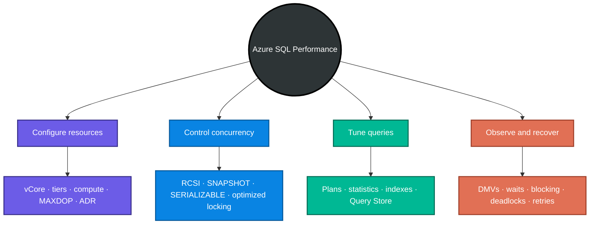

> **One-line exam strategy:** identify whether the bottleneck is capacity, concurrency, plan quality, or workload history; choose the narrowest evidence-based fix and verify it against a baseline.

### Part E — Multiple-choice questions (30–70)

#### 30. Which resource model generally maps most naturally to an on-premises SQL Server migration?

A. vCore  
B. DTU Basic  
C. Query Performance Insight  
D. Serverless autopause

<details><summary>Answer and explanation</summary>

**Answer: A — vCore.** Its explicit virtual CPU and memory concepts make capacity mapping easier than a bundled DTU score.

</details>

#### 31. An application needs consistent 1–2 ms storage latency and high IOPS. Which service tier best matches the supplied module?

A. General Purpose  
B. Business Critical  
C. DTU Basic  
D. Serverless General Purpose with autopause

<details><summary>Answer and explanation</summary>

**Answer: B — Business Critical.** It uses locally attached SSDs and is designed for low-latency, high-I/O workloads. General Purpose relies on remote storage with higher latency.

</details>

#### 32. A database is expected to grow to 12 TB. Which tier should be selected from the module's options?

A. General Purpose  
B. Business Critical  
C. Hyperscale  
D. Premium DTU only

<details><summary>Answer and explanation</summary>

**Answer: C — Hyperscale.** The module lists a 4 TB limit for General Purpose and Business Critical and up to 128 TB for Hyperscale.

</details>

#### 33. Which architecture is associated with General Purpose?

A. Compute with locally attached data files on every replica  
B. Compute separated from remote Azure storage  
C. No persistent storage  
D. A mandatory 128 TB allocation

<details><summary>Answer and explanation</summary>

**Answer: B.** General Purpose separates compute from remote storage. Business Critical uses local SSD; Hyperscale uses decoupled storage/page servers plus caches.

</details>

#### 34. A small internal application is idle most nights and weekends. Which compute tier is the best starting recommendation?

A. Provisioned 24×7  
B. Serverless  
C. Business Critical only  
D. `MAXDOP 0`

<details><summary>Answer and explanation</summary>

**Answer: B — Serverless.** It scales compute with demand and can reduce costs during low activity. Verify cold-start/autopause behavior against application requirements.

</details>

#### 35. Which workload most strongly favors provisioned compute?

A. Unpredictable database used twice per week  
B. Stable production traffic throughout the day  
C. A database that must always autopause  
D. A one-hour demonstration

<details><summary>Answer and explanation</summary>

**Answer: B.** Provisioned compute keeps fixed capacity available and provides predictable cost/performance for steady workloads.

</details>

#### 36. What does `MAXDOP` control?

A. Query Store retention days  
B. Maximum worker threads used by one parallel query  
C. Maximum database size  
D. Transaction isolation level

<details><summary>Answer and explanation</summary>

**Answer: B.** `MAXDOP` is the maximum degree of parallelism. It limits workers participating in parallel execution, not storage or transaction behavior.

</details>

#### 37. What is the main risk of unbounded parallelism on a shared production database?

A. It always creates dirty reads.  
B. One query can consume excessive workers/CPU and starve concurrent work.  
C. It disables Query Store.  
D. It converts seeks into scans automatically.

<details><summary>Answer and explanation</summary>

**Answer: B.** Parallelism can lower one query's latency but increase overall worker and CPU pressure. `MAXDOP 0` should not be used casually in shared production workloads.

</details>

#### 38. Which automatic tuning option detects a regressed plan and reuses a previous fast plan?

A. `DROP_INDEX`  
B. `FORCE_LAST_GOOD_PLAN`  
C. `OPTIMIZE_FOR_AD_HOC_WORKLOADS`  
D. `ALLOW_SNAPSHOT_ISOLATION`

<details><summary>Answer and explanation</summary>

**Answer: B.** It monitors plan performance and can force the last known good plan. The other options concern indexes, cache use, or isolation.

</details>

#### 39. Why should automatic `CREATE_INDEX` recommendations be reviewed rather than accepted blindly?

A. Indexes never improve reads.  
B. Every index can add write, storage, and maintenance overhead.  
C. Azure SQL does not support indexes.  
D. Query Store deletes all created indexes.

<details><summary>Answer and explanation</summary>

**Answer: B.** A read benefit must be weighed against extra work on inserts/updates/deletes and possible overlap with existing indexes.

</details>

#### 40. Which compatibility level introduces Parameter Sensitive Plan optimization in the supplied module?

A. 140  
B. 150  
C. 160  
D. 170 only

<details><summary>Answer and explanation</summary>

**Answer: C — 160.** Level 150 highlights batch mode on rowstore, table-variable deferred compilation, and scalar UDF inlining; level 170 highlights Optional Parameter Plan Optimization.

</details>

#### 41. What should be done before changing a production database compatibility level?

A. Delete Query Store.  
B. Capture a baseline and test representative workloads.  
C. Set `MAXDOP 0`.  
D. Disable statistics.

<details><summary>Answer and explanation</summary>

**Answer: B.** The optimizer behavior can change. Query Store provides a before/after comparison and a temporary plan-forcing safety mechanism.

</details>

#### 42. What does `OPTIMIZE_FOR_AD_HOC_WORKLOADS` store on the first execution of a one-off ad hoc query?

A. A full duplicate database  
B. A small compiled plan stub  
C. A deadlock graph  
D. A transaction snapshot

<details><summary>Answer and explanation</summary>

**Answer: B.** The full plan is cached only if the same query text executes again, reducing memory consumed by single-use plans.

</details>

#### 43. Where does ADR keep its Persistent Version Store in Azure SQL Database?

A. Only in the client  
B. Inside the user database  
C. In Query Performance Insight  
D. In the application cache

<details><summary>Answer and explanation</summary>

**Answer: B.** ADR uses a Persistent Version Store inside the database. It can consume allocated database space and should be monitored.

</details>

#### 44. What often causes PVS growth beyond its normal baseline?

A. Short committed transactions only  
B. Long-running transactions or high abort rates  
C. A low execution count  
D. Disabling all writes

<details><summary>Answer and explanation</summary>

**Answer: B.** Old versions cannot be cleaned while active transactions may still require them; aborted/write-heavy activity also produces version overhead.

</details>

#### 45. Which anomaly reads data another transaction has not committed?

A. Phantom read  
B. Dirty read  
C. Key Lookup  
D. Memory spill

<details><summary>Answer and explanation</summary>

**Answer: B — Dirty read.** If the writer rolls back, the reader acted on a value that never became committed data.

</details>

#### 46. Which anomaly occurs when the same row returns different committed values in one transaction?

A. Nonrepeatable read  
B. Dirty read  
C. Phantom plan  
D. Deadlock victim

<details><summary>Answer and explanation</summary>

**Answer: A — Nonrepeatable read.** Another transaction commits an update between the two reads.

</details>

#### 47. Which anomaly occurs when a repeated predicate query returns a changed set of rows?

A. Key Lookup  
B. Phantom read  
C. Implicit conversion  
D. Excessive memory grant

<details><summary>Answer and explanation</summary>

**Answer: B — Phantom read.** Inserts/deletes by another committed transaction change which rows satisfy the predicate.

</details>

#### 48. Which isolation level permits dirty reads?

A. `READ UNCOMMITTED`  
B. `READ COMMITTED`  
C. `REPEATABLE READ`  
D. `SNAPSHOT`

<details><summary>Answer and explanation</summary>

**Answer: A.** It avoids shared-read locking and can observe uncommitted changes. The concurrency benefit comes with correctness risk.

</details>

#### 49. Which lock-based isolation level prevents dirty and nonrepeatable reads but can still allow phantoms?

A. `READ UNCOMMITTED`  
B. `READ COMMITTED`  
C. `REPEATABLE READ`  
D. `SERIALIZABLE`

<details><summary>Answer and explanation</summary>

**Answer: C — `REPEATABLE READ`.** It holds shared locks on rows already read, but does not fully protect gaps against newly inserted matching rows.

</details>

#### 50. Which level prevents phantom reads through key-range protection?

A. RCSI  
B. `READ UNCOMMITTED`  
C. `SERIALIZABLE`  
D. Locking `READ COMMITTED`

<details><summary>Answer and explanation</summary>

**Answer: C — `SERIALIZABLE`.** It provides the strongest lock-based isolation but increases blocking and deadlock risk.

</details>

#### 51. What snapshot scope does RCSI provide?

A. One snapshot for the entire server lifetime  
B. One snapshot per statement  
C. One snapshot per user account  
D. No row versions

<details><summary>Answer and explanation</summary>

**Answer: B.** Each statement sees committed data as of its start. Two statements in one transaction may see different committed versions.

</details>

#### 52. What snapshot scope does `SNAPSHOT` isolation provide?

A. Entire transaction  
B. One row only  
C. One operator only  
D. It uses no versioning

<details><summary>Answer and explanation</summary>

**Answer: A.** It provides a transaction-consistent point-in-time view. Write conflicts may cause an update-conflict error.

</details>

#### 53. Which statement about RCSI is correct?

A. It prevents all writer–writer blocking.  
B. It removes most reader–writer blocking by reading versions.  
C. It allows dirty reads.  
D. It is identical to `SERIALIZABLE`.

<details><summary>Answer and explanation</summary>

**Answer: B.** Writers still require exclusive protection, so two writes to the same row can block each other.

</details>

#### 54. Which optimized-locking mechanism checks a committed row version before locking only qualifying rows?

A. PVS cleanup  
B. Lock After Qualification (LAQ)  
C. Query Store forcing  
D. Key Lookup

<details><summary>Answer and explanation</summary>

**Answer: B — LAQ.** It reduces unnecessary modification locks and requires RCSI in the supplied description.

</details>

#### 55. Which plan contains actual row counts and runtime warnings?

A. Estimated plan only  
B. Actual execution plan  
C. Missing-index DMV only  
D. Database configuration blade

<details><summary>Answer and explanation</summary>

**Answer: B.** The actual plan includes the compiled estimates plus runtime observations.

</details>

#### 56. A large table scan is shown in a plan. What is the best first conclusion?

A. The scan is always wrong.  
B. Determine table size, result fraction, predicate, and available indexes before judging.  
C. Force `MAXDOP 1`.  
D. Switch to `READ UNCOMMITTED`.

<details><summary>Answer and explanation</summary>

**Answer: B.** A scan can be optimal for a small table or a query that returns most rows. Context and evidence determine whether it is problematic.

</details>

#### 57. Estimated rows are 100, but actual rows are 100,000. What should be investigated first?

A. Statistics, skew, and parameter sensitivity  
B. Firewall rules  
C. Backup redundancy  
D. Authentication mode

<details><summary>Answer and explanation</summary>

**Answer: A.** Cardinality errors can produce poor join, memory, and access choices. Stale statistics and skewed parameter values are common causes.

</details>

#### 58. A plan performs a Key Lookup for every matched row. Which index change may help?

A. Add required output columns as `INCLUDE` columns after testing  
B. Remove every index  
C. Increase isolation to `SERIALIZABLE`  
D. Disable Query Store

<details><summary>Answer and explanation</summary>

**Answer: A.** A covering index can supply output columns without repeated clustered lookups. The trade-off is a wider index and more write/storage cost.

</details>

#### 59. Which warning often results from comparing an `nvarchar` parameter to a `varchar` indexed column?

A. Implicit conversion  
B. Deadlock victim  
C. Dirty read  
D. Autopause

<details><summary>Answer and explanation</summary>

**Answer: A.** Converting the column at runtime may make the predicate non-sargable and turn a seek into a scan. Match parameter and column types.

</details>

#### 60. What does a sort/hash spill indicate?

A. The operation used temporary storage because the memory grant was insufficient.  
B. A transaction saw uncommitted data.  
C. Query Store is read-only.  
D. The database exceeded 128 TB.

<details><summary>Answer and explanation</summary>

**Answer: A.** Underestimated cardinality often produces an undersized grant, causing intermediate data to spill to `tempdb` and increasing I/O/latency.

</details>

#### 61. Which DMV is best for aggregate statistics on cached query plans?

A. `sys.dm_exec_query_stats`  
B. `sys.dm_exec_requests`  
C. `sys.database_query_store_options`  
D. `sys.dm_tran_persistent_version_store_stats`

<details><summary>Answer and explanation</summary>

**Answer: A.** It exposes accumulated CPU, reads, execution count, and related cached-plan statistics.

</details>

#### 62. Which DMV is best for currently executing requests, waits, and blocking session IDs?

A. `sys.dm_exec_requests`  
B. `sys.dm_exec_query_stats` only  
C. `sys.query_store_plan` only  
D. `sys.indexes` only

<details><summary>Answer and explanation</summary>

**Answer: A.** It is a real-time snapshot of active requests and includes `wait_type`, `wait_time`, and `blocking_session_id`.

</details>

#### 63. What is the correct attitude toward missing-index DMV recommendations?

A. Apply all automatically.  
B. Treat them as workload-based suggestions, consolidate overlaps, and test read/write impact.  
C. Ignore them always.  
D. They measure deadlock frequency.

<details><summary>Answer and explanation</summary>

**Answer: B.** The estimates omit some maintenance/overlap considerations and depend on observed/cached workload.

</details>

#### 64. Which feature preserves query plans and runtime history across time for regression analysis?

A. Query Store  
B. `READ UNCOMMITTED`  
C. Autopause  
D. TID locking

<details><summary>Answer and explanation</summary>

**Answer: A.** Query Store persists query text, plans, runtime statistics, and waits inside the database.

</details>

#### 65. Which Query Store view should be checked soon after a deployment?

A. Regressed Queries  
B. Database Users  
C. PVS Details  
D. Firewall Rules

<details><summary>Answer and explanation</summary>

**Answer: A.** It compares recent performance with prior plan behavior and surfaces queries that became slower.

</details>

#### 66. What is plan forcing best considered?

A. A guaranteed permanent replacement for query tuning  
B. An immediate mitigation while the root cause is investigated  
C. A way to change the service tier  
D. A deadlock retry mechanism

<details><summary>Answer and explanation</summary>

**Answer: B.** Forcing a known-good plan can stabilize service quickly, but index/schema/data changes and parameter diversity may make it unsuitable later.

</details>

#### 67. Query Store desired state is `READ_WRITE`, but actual state is `READ_ONLY`. What is a likely cause?

A. Query Store reached its storage limit.  
B. RCSI was enabled.  
C. An Index Seek occurred.  
D. A transaction committed.

<details><summary>Answer and explanation</summary>

**Answer: A.** Inspect `readonly_reason`, increase maximum storage, or clean old data. QPI cannot display new history while collection is stopped.

</details>

#### 68. Which Azure portal feature visualizes Query Store's top resource-consuming queries?

A. Query Performance Insight  
B. ADR  
C. TDE  
D. DTU calculator only

<details><summary>Answer and explanation</summary>

**Answer: A — Query Performance Insight (QPI).** It provides portal charts for CPU, duration, execution count, and related drill-downs.

</details>

#### 69. Which statement describes ordinary blocking?

A. Every wait is a deadlock.  
B. A session waits for a conflicting lock held by another session that can eventually finish.  
C. The engine immediately terminates both sessions.  
D. It occurs only under `READ UNCOMMITTED`.

<details><summary>Answer and explanation</summary>

**Answer: B.** Short blocking is expected in transactional systems. A deadlock specifically requires a circular dependency.

</details>

#### 70. What error number is returned to a deadlock victim?

A. 1205  
B. 404  
C. 18456 only  
D. 0

<details><summary>Answer and explanation</summary>

**Answer: A — 1205.** The engine rolls back the selected victim so the other transaction can proceed; the application should retry the whole logical transaction safely.

</details>
