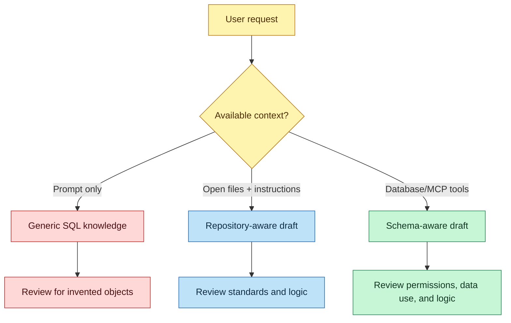
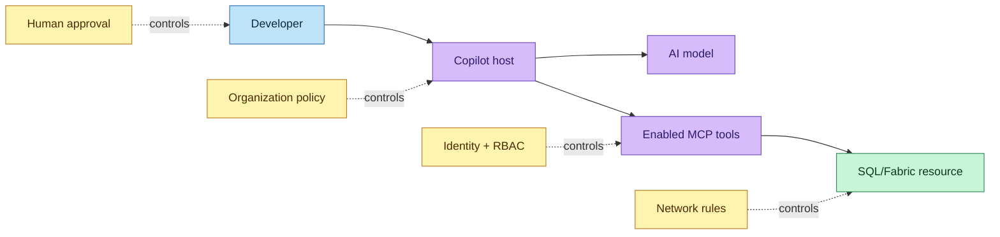
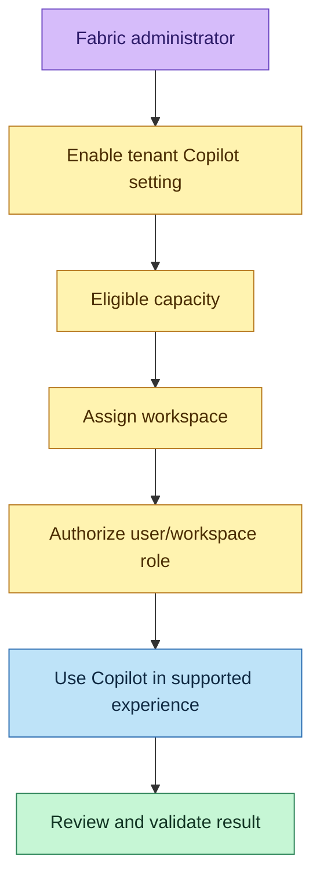
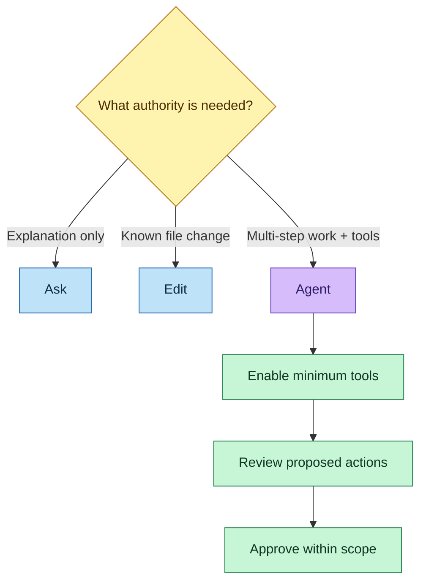
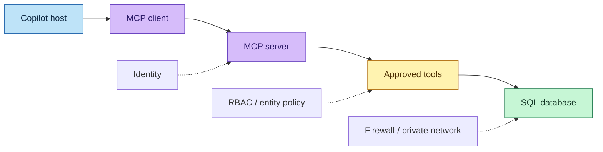
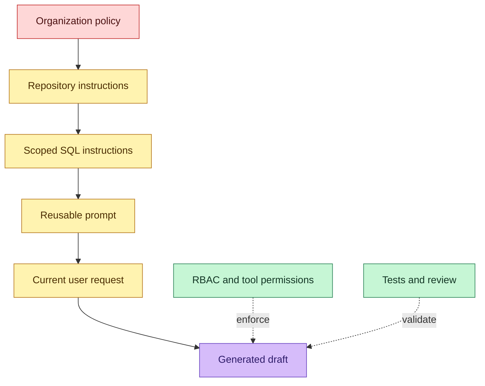

# DP-800 AI-Assisted SQL Development Study Guide

> **Module:** Implement SQL solutions by using AI-assisted tools  
> **Exam:** Microsoft Certified: SQL AI Developer Associate (DP-800)  
> **Coverage:** GitHub Copilot, Fabric Copilot, security, model selection, MCP, instruction files, SQL/Fabric endpoints, practical prompting, and human validation

---

## How to use this guide

1. Learn the workflow and security model before memorizing setup menus.
2. Recreate the instruction and MCP configuration examples in a test repository.
3. Practice reviewing generated SQL—not merely generating it.
4. Complete the integrated lab using a development database.
5. Attempt Questions 1–60 before reading the answer key.

> [!IMPORTANT]
> AI product names, model lists, keyboard shortcuts, licensing, and preview features change quickly. For the exam, understand the principles and the module’s stated workflow. For real deployments, verify the current documentation and your organization’s policy.

---

# Part I — Module Map and Core Mental Model

## 1. What this module is really testing

AI assistance changes *how quickly* you can draft SQL; it does not transfer responsibility for correctness, security, or deployment to the model. The exam expects you to understand the complete controlled workflow:


The central formula is:

\[
\text{Useful AI output} \approx f(\text{prompt},\text{context},\text{instructions},\text{tools},\text{model})
\]

But production quality additionally requires:

\[
\text{Production quality} = \text{useful draft} + \text{human validation} + \text{testing} + \text{governance}
\]

## 2. Capability map

| Need | Best starting capability | Human responsibility |
|---|---|---|
| Finish routine T-SQL | Code completion | Verify names, logic, and side effects |
| Convert intent to SQL | Natural-language prompt | Confirm requirements and output grain |
| Understand legacy SQL | Code explanation | Validate against schema and business rules |
| Improve a query | Optimization assistance | Inspect actual plan and measure performance |
| Fix an error | Error assistance | Reproduce and test the correction |
| Apply team standards | Custom instructions | Maintain precise, current rules |
| Use live schema/tools | MCP or database context | Control identity, permissions, and tools |
| Explore Fabric data | Fabric Copilot/data agent | Verify source, permissions, and result |

## 3. GitHub Copilot versus Fabric Copilot

| Dimension | GitHub Copilot | Fabric Copilot |
|---|---|---|
| Primary location | IDE or database tool such as VS Code and SSMS | Microsoft Fabric experiences |
| Best fit | Code-centric database development | Workspace-centric engineering, analytics, and data exploration |
| SQL platforms | SQL Server, Azure SQL, Fabric SQL through supported tools/connections | Fabric lakehouse, warehouse, SQL database, notebooks, and related experiences |
| Context source | Open files, repository instructions, selected code, database connection, enabled tools | User’s Fabric workspace items and permissions |
| Customization | Instructions, prompt files, model/tool selection, MCP | Tenant/capacity/workspace settings, data agents, experience-specific context |
| Shared principle | AI produces assistance, not an automatic correctness guarantee | AI produces assistance, not an automatic correctness guarantee |

> **Exam trap:** GitHub Copilot does not deploy a database or replace backup, review, testing, or compliance processes. Its primary role here is to assist with T-SQL and database work.

---

# Part II — How AI-Assisted SQL Development Works

## 4. Context is the difference between generic and grounded output

Without database context, a model may know standard T-SQL but not your real tables. With approved schema/tool context, it can use actual object and column names.



More context can improve relevance, but it also enlarges the data-governance boundary. Give the model only the context needed for the task.

## 5. The five main capabilities

### 5.1 Code completion

Copilot predicts a likely continuation from nearby code, comments, open files, and other enabled context. It is valuable for repetitive statements, explicit column lists, test data, and common procedure patterns.

### 5.2 Natural language to SQL

A strong prompt specifies:

- the role or goal;
- tables and relationships;
- filters and parameters;
- output columns and grain;
- edge cases;
- security and performance constraints;
- the required explanation or test plan.

Weak prompt:

```text
Get customer sales.
```

Stronger prompt:

```text
Using SalesLT.Customer and SalesLT.SalesOrderHeader, write a parameterized
T-SQL query that returns one row per customer for orders in a supplied date
range. Return CustomerID, full name, order count, and total due. Keep customers
with zero orders, avoid SELECT *, use schema-qualified names, and explain the
choice of join and NULL handling. Do not execute the query.
```

### 5.3 Code explanation

Ask for data flow, result grain, joins, side effects, transaction behavior, error handling, and likely performance risks. An explanation remains a hypothesis until checked against the actual schema and plan.

### 5.4 Query optimization assistance

AI can suggest indexes, sargable predicates, explicit joins, or smaller projections. It cannot infer workload-wide consequences reliably from query text alone. Validate with the actual execution plan, runtime statistics, representative parameters, and existing index usage.

### 5.5 Error assistance

Provide the exact error, relevant DDL, sanitized parameters, target engine/version, and minimal reproduction. Never paste credentials or regulated data just to improve the answer.

---

# Part III — Security, Privacy, and Governance

## 6. Understand the data flow

Depending on product configuration, relevant prompt and context may include:

- the code being edited or selected;
- content from open or indexed files;
- natural-language prompts;
- repository instructions;
- schema and metadata from a database connection;
- results returned by an enabled tool.

The correct governance question is not merely “Is Copilot secure?” It is:

> What information can this configured user, client, model, extension, and tool send, retrieve, modify, log, or reveal in this specific environment?



## 7. Security decision checklist

Before enabling AI assistance, evaluate:

| Area | Questions to ask | Safe direction |
|---|---|---|
| Data classification | Does context contain PII, health, payment, or secret information? | Exclude or sanitize prohibited data |
| Compliance | Do GDPR, HIPAA, PCI, residency, or retention rules apply? | Obtain policy/legal approval and configure accordingly |
| Intellectual property | Is schema or code a trade secret? | Follow approved enterprise controls |
| Identity | Which principal will the tool use? | Dedicated, least-privilege identity |
| Authorization | Can the tool read or modify data? | Expose only necessary operations/entities |
| Network | Is the endpoint public? | Use firewall/private connectivity as required |
| Logging | Are prompts/tool actions auditable? | Enable appropriate auditing without leaking secrets |
| Environment | Is the agent connected to production? | Start with dev/test; isolate environments |
| Human control | Can generated DDL/DML run automatically? | Require review/approval for material changes |

## 8. Credentials: never make secrets part of the prompt

Avoid:

```json
{
  "connectionString": "Server=prod;User ID=admin;Password=<DO-NOT-STORE-SECRETS-HERE>"
}
```

Prefer a secure input, environment variable, managed identity, or credential store. A workspace MCP configuration can request a value without committing it:

```json
{
  "servers": {
    "approved-sql": {
      "type": "http",
      "url": "${input:mcpEndpoint}",
      "headers": {
        "Authorization": "Bearer ${input:accessToken}"
      }
    }
  },
  "inputs": [
    {
      "id": "mcpEndpoint",
      "type": "promptString",
      "description": "Approved MCP endpoint"
    },
    {
      "id": "accessToken",
      "type": "promptString",
      "description": "Temporary access token",
      "password": true
    }
  ]
}
```

> [!CAUTION]
> A masked prompt input prevents a token from being written literally in the configuration, but the receiving system still handles that credential. Prefer platform authentication and short-lived tokens where supported.

## 9. Review AI-generated SQL as untrusted code

Check at least the following:

1. **Correct database and schema** — could it target the wrong environment?
2. **Object validity** — do every table and column actually exist?
3. **Result grain** — is it one row per customer, order, or order line?
4. **Join cardinality** — will a many-to-many join multiply totals?
5. **NULL and boundary behavior** — inclusive dates, zero rows, divide by zero.
6. **Security** — parameterization, permissions, row-level restrictions, exposed columns.
7. **Side effects** — `UPDATE`, `DELETE`, DDL, triggers, transactions.
8. **Performance** — sargability, scans, spills, cardinality estimates, parameter sensitivity.
9. **Error handling** — rollback and propagation.
10. **Tests** — normal, empty, invalid, duplicate, boundary, and concurrency cases.

### Injection-safe dynamic SQL

Unsafe:

```sql
-- User input becomes executable SQL text.
SET @sql = N'SELECT * FROM SalesLT.Customer WHERE LastName = '''
         + @LastName + N'''';
EXEC(@sql);
```

Safer:

```sql
-- The SQL text is stable; the value travels as a typed parameter.
DECLARE @sql nvarchar(max) = N'
SELECT CustomerID, FirstName, LastName
FROM SalesLT.Customer
WHERE LastName = @pLastName;';

EXEC sys.sp_executesql
    @sql,
    N'@pLastName nvarchar(50)',
    @pLastName = @LastName;
```

> **Exam trap:** “The AI generated it” is never evidence that code is secure or compliant.

---

# Part IV — Enabling Copilot in Microsoft SQL Workflows

## 10. GitHub Copilot in SSMS

Current Microsoft guidance uses GitHub Copilot in **SSMS 22**. Install it by modifying SSMS in Visual Studio Installer and selecting the **AI Assistance** workload, then sign in with a GitHub account that has Copilot access. T-SQL code completions specifically require **SSMS 22.2 or later** and inline suggestions enabled.

Typical verification:

1. Connect to a non-production database.
2. Open the Copilot chat window.
3. Select the intended database context.
4. Ask for a read-only schema explanation.
5. Compare the answer with Object Explorer/system catalog output.

> **Version trap:** Earlier Copilot in SSMS 21 was replaced by GitHub Copilot in SSMS 22. If an assessment option asks about unsupported environments, read the version carefully.

## 11. GitHub Copilot in VS Code

For the module workflow:

1. Install current GitHub Copilot/Copilot Chat support.
2. Install Microsoft’s SQL Server (`mssql`) extension.
3. Sign in with the authorized GitHub account.
4. Create a database connection.
5. Open Copilot Chat and select the suitable chat mode/model/tools.
6. Ground requests with the connected database or an approved MCP tool.

Menus and extension packaging evolve. The durable concept is that **Copilot provides AI assistance**, while **the MSSQL extension provides SQL connectivity and database tooling**.

## 12. Fabric Copilot

Fabric Copilot requires organizational enablement and eligible capacity/workspace configuration. The module identifies paid **F2+ Fabric** or **P1+ Power BI Premium** capacity as the normal baseline, tenant-level Copilot settings enabled by an administrator, and appropriate workspace access.

Access is governed by the user’s permissions: Copilot does not give a user data access that the user otherwise lacks.



### Troubleshooting enablement

| Symptom | Likely check |
|---|---|
| Copilot control absent in Fabric | Tenant/capacity/workspace/region/experience eligibility |
| Copilot unavailable in SSMS | SSMS version, AI Assistance workload, sign-in, subscription/policy |
| No contextual database answer | Active connection, selected database, extension state, permissions |
| Copilot extension absent in VS Code | Extension installation/marketplace/enterprise policy |

---

# Part V — Model and Tool Selection

## 13. Model selection

The available model list varies by product, plan, policy, and date. Select by task characteristics rather than memorizing a brand list:

| Task | Model preference |
|---|---|
| Short completion | Low latency |
| Multi-table design or debugging | Strong reasoning |
| Large stored-procedure explanation | Large context + explanation quality |
| Sensitive enterprise task | Only organization-approved models/configuration |
| Repeated workflow | Consistency, cost, latency, and evaluation results |

Changing models can change results. Maintain test prompts and expected checks for important workflows.

## 14. Chat modes and tool control

Conceptually:

- **Ask** answers or explains.
- **Edit** proposes changes to files.
- **Agent** can plan, edit, and invoke enabled tools within its permissions.

The more agency a mode has, the more important scope, tool selection, review, and approval become.



Best practice: enable only the tools needed for the current task. A disabled write-capable tool cannot be invoked accidentally during that session.

---

# Part VI — Model Context Protocol (MCP)

## 15. What MCP is

MCP is an open protocol that standardizes how an AI host connects to external servers that expose capabilities such as tools, resources, and prompts.

| Component | Meaning | Example |
|---|---|---|
| Host | Application containing the AI experience | VS Code with Copilot Chat |
| Client | Protocol connection managed by the host | The MCP client for one configured server |
| Server | Service exposing controlled capabilities | SQL MCP Server |
| Tool | Callable operation | Read an entity, aggregate rows, execute an allowed procedure |
| Resource/prompt | Context or reusable template, when supported | Schema description or standard workflow prompt |



MCP is not the database, the model, or an automatic security boundary. It is the connection/protocol layer; the server’s configuration and backing identity determine allowed operations.

## 16. Why MCP improves SQL assistance

Without an external tool, the model may invent `Customers.EmailAddress` even if the real column is `SalesLT.Customer.EmailAddress`. An MCP tool can retrieve authoritative schema or perform a controlled operation. This reduces hallucination, but it does not eliminate errors in requirements, joins, filters, or interpretation.

## 17. SQL MCP Server and Data API builder

Microsoft’s SQL MCP Server is built on Data API builder (DAB). DAB uses configured entities, roles, permissions, and policies to expose a controlled API surface over supported databases. Current documentation describes typed data-manipulation tools including controlled CRUD, aggregation, and stored-procedure execution.

Security implications:

- expose only required entities;
- prefer read-only access for schema/exploration tasks;
- do not treat natural-language intent as authorization;
- keep production separate from development;
- validate generated tool arguments;
- log and monitor material operations;
- apply the same database and network controls used for any application.

## 18. Configure an MCP server in VS Code

Workspace configuration normally lives in `.vscode/mcp.json`. A remote example:

```json
{
  "servers": {
    "team-sql": {
      "type": "http",
      "url": "https://approved.example.com/mcp"
    }
  }
}
```

A local standard-input/output server uses a command and arguments:

```json
{
  "servers": {
    "local-sql-tools": {
      "type": "stdio",
      "command": "approved-server-command",
      "args": ["--config", "${workspaceFolder}/config/dab-config.json"]
    }
  }
}
```

Safe connection workflow:

1. Obtain the server from an approved source.
2. Inspect the configuration and requested permissions.
3. Add it with the command palette or `mcp.json`.
4. Authenticate using an approved mechanism.
5. Start the server and inspect its exposed tools.
6. Enable the minimum required tools.
7. test a harmless, read-only schema question.
8. Verify returned metadata independently.

## 19. SQL Server, Azure SQL, and Fabric endpoints

### SQL Server / Azure SQL

- Use Microsoft’s SQL MCP Server/Data API builder approach for a controlled MCP surface.
- Azure SQL additionally requires appropriate firewall/private endpoint routing and Microsoft Entra/service identity configuration where applicable.
- A direct MSSQL extension database-chat experience is conceptually different from separately deploying a general MCP endpoint, even though both can supply database context.

### Fabric

A Fabric data agent can be grounded in supported Fabric data sources and, when the feature is enabled and published, exposed to external clients through an MCP endpoint. Configure the client with the published endpoint, authenticate as the authorized user, and remember that Fabric permissions still govern access.

## 20. MCP troubleshooting

| Problem | Likely cause | First checks |
|---|---|---|
| Server not listed | Invalid location or JSON | Validate `.vscode/mcp.json`; reload configuration |
| Server does not start | Bad command/dependency | Check command, arguments, environment, logs |
| Authentication fails | Expired/incorrect identity | Reauthenticate; check tenant and audience |
| Timeout | DNS, firewall, proxy, private endpoint | Verify network path and endpoint health |
| Tools absent | Server/policy does not expose them | Inspect server config and organization policy |
| Empty schema/results | Insufficient permissions or wrong database | Verify identity, role, entity mapping, connection target |
| Correct tool, wrong answer | Prompt/interpretation or stale metadata | Inspect raw result and validate independently |

> **Exam trap:** Giving a model an MCP connection does not automatically give it unrestricted database access. The server and its authenticated identity remain subject to configured permissions.

---

# Part VII — Custom Instructions and Reusable Prompts

## 21. Repository-wide instructions

Place repository-wide guidance in `.github/copilot-instructions.md`. These instructions tell Copilot how to work in the repository; they do not execute SQL or enforce database permissions.

```markdown
# T-SQL project instructions

## Target
- Target Azure SQL Database and SQL Server 2025-compatible T-SQL.
- Use the `SalesLT` schema shown in the checked-in database project.

## Style
- Use schema-qualified object names and explicit column lists.
- Use ANSI joins and descriptive aliases.
- Use `CREATE OR ALTER` for programmable objects when supported.

## Security
- Never include credentials, tokens, or real customer data.
- Parameterize values; never concatenate untrusted input into dynamic SQL.
- Do not generate `GRANT ... TO public`.

## Reliability
- For multi-statement writes, use `SET XACT_ABORT ON`, `TRY...CATCH`, rollback,
  and bare `THROW;` after cleanup.
- Do not execute DDL or DML. Produce a reviewable script and tests.

## Performance
- Avoid `SELECT *`.
- Do not recommend an index without explaining key order, INCLUDE columns,
  expected benefit, and write/storage cost.
```

### Good instructions are

- **specific** — “schema-qualify every object,” not “write good SQL”;
- **testable** — reviewers can see whether the output complied;
- **non-secret** — safe to commit;
- **current** — matches target engine and team practice;
- **concise** — critical rules do not disappear in noise;
- **example-driven** — show the desired pattern when ambiguity exists.

> **Important distinction:** Instructions steer generation; policy, RBAC, linters, tests, branch protection, and code review enforce controls.

## 22. Scoped instruction files

Modern VS Code also supports instruction files that can target file patterns. A database team might apply SQL-specific rules only to `**/*.sql` rather than loading them for every file. Use scoped instructions when different languages or folders require different conventions.

## 23. Prompt files

Prompt files are reusable task templates, normally stored under `.github/prompts` with a `.prompt.md` extension. They represent *what to do*; instruction files represent *how to behave consistently*.

Example `review-query.prompt.md`:

```markdown
---
description: Review selected T-SQL without executing it
---

Review the selected query for:

1. result grain and join cardinality;
2. injection and unintended data exposure;
3. NULL and date-boundary behavior;
4. likely performance risks;
5. target-platform compatibility.

Return a corrected query, assumptions, and a test checklist. Do not execute it.
```

## 24. Instruction hierarchy and conflicts

Instructions may exist at organization, repository, path/file, user, and prompt levels depending on the product. Do not assume a natural-language rule overrides a higher-priority safety policy or actual tool permission. When two instructions conflict, clarify or remove the ambiguity and test the effective result.



---

# Part VIII — Prompt Engineering for SQL

## 25. A repeatable prompt framework: SCOUT

| Letter | Meaning | Example |
|---|---|---|
| S | **Scenario** | “AdventureWorksLT order reporting” |
| C | **Context** | Tables, keys, target platform, existing code |
| O | **Output** | One row per customer; named columns |
| U | **User constraints** | Parameterization, no `SELECT *`, read-only |
| T | **Tests** | Empty customers, date boundary, duplicated details |

Example:

```text
Scenario: Build an Azure SQL reporting procedure.
Context: SalesLT.Customer(CustomerID...), SalesLT.SalesOrderHeader(CustomerID,
OrderDate, TotalDue...). Target Azure SQL Database.
Output: One row per customer with order count, total amount, and latest date.
Constraints: Optional @CustomerID; explicit columns; schema-qualified names;
TRY...CATCH; do not execute; state assumptions.
Tests: No orders, one order, multiple orders, NULL parameter, unknown ID.
```

## 26. Ask for evidence, not confidence

Useful follow-ups include:

- “State the output grain before writing SQL.”
- “Identify every many-to-many multiplication risk.”
- “Show which predicate is sargable and why.”
- “Give a counterexample that would make this total incorrect.”
- “Write test inserts and expected outputs in a transaction that rolls back.”
- “Do not claim an index helps until you specify how to measure it.”

## 27. Use AI to criticize AI output

A second review prompt can find issues, but it is not independent proof when the same assumptions and context are reused. Combine model critique with deterministic validation: compilation, unit tests, schema comparison, security scanning, and execution-plan measurement.

---

# Part IX — Worked SQL Review Examples

## 28. Rewrite an unsafe/inefficient query

Starting query:

```sql
SELECT *
FROM SalesLT.SalesOrderHeader h,
     SalesLT.SalesOrderDetail d,
     SalesLT.Product p
WHERE h.SalesOrderID = d.SalesOrderID
  AND d.ProductID = p.ProductID
  AND YEAR(h.OrderDate) = 2025;
```

Reviewed version:

```sql
SELECT
    h.SalesOrderID,
    h.OrderDate,
    h.CustomerID,
    p.ProductID,
    p.Name AS ProductName,
    d.OrderQty,
    d.UnitPrice,
    d.LineTotal
FROM SalesLT.SalesOrderHeader AS h
INNER JOIN SalesLT.SalesOrderDetail AS d
    ON d.SalesOrderID = h.SalesOrderID
INNER JOIN SalesLT.Product AS p
    ON p.ProductID = d.ProductID
-- A half-open range is explicit and can use an index on OrderDate.
WHERE h.OrderDate >= DATEFROMPARTS(@Year, 1, 1)
  AND h.OrderDate <  DATEFROMPARTS(@Year + 1, 1, 1);
```

Improvements:

- explicit output contract instead of `SELECT *`;
- schema-qualified objects;
- explicit joins;
- sargable date predicate;
- half-open boundary handles time values;
- still requires plan/runtime validation before any index recommendation.

## 29. Stored procedure generated with defensive patterns

```sql
CREATE OR ALTER PROCEDURE SalesLT.usp_GetCustomerOrderSummary
    @CustomerID int = NULL
AS
BEGIN
    SET NOCOUNT ON;
    SET XACT_ABORT ON;

    BEGIN TRY
        -- No explicit transaction is required for this read-only statement.
        SELECT
            c.CustomerID,
            CONCAT(c.FirstName, N' ', c.LastName) AS CustomerName,
            COUNT_BIG(h.SalesOrderID) AS OrderCount,
            COALESCE(SUM(h.TotalDue), 0) AS TotalOrderAmount,
            MAX(h.OrderDate) AS LastOrderDate
        FROM SalesLT.Customer AS c
        LEFT JOIN SalesLT.SalesOrderHeader AS h
            ON h.CustomerID = c.CustomerID
        WHERE @CustomerID IS NULL
           OR c.CustomerID = @CustomerID
        GROUP BY
            c.CustomerID,
            c.FirstName,
            c.LastName;
    END TRY
    BEGIN CATCH
        -- Preserve the original error number, state, and line.
        THROW;
    END CATCH;
END;
```

Review observations:

- Joining order details was unnecessary because `TotalDue` is already header-level. Adding detail rows would multiply each header total.
- `LEFT JOIN` preserves customers without orders.
- The optional-parameter predicate can create plan-quality trade-offs at scale; measure before choosing `OPTION (RECOMPILE)`, dynamic SQL, or another strategy.
- Error handling does not make incorrect aggregation correct; semantic review remains essential.

## 30. A view for product sales

```sql
CREATE OR ALTER VIEW SalesLT.vw_ProductSalesAnalysis
AS
SELECT
    p.ProductID,
    p.Name AS ProductName,
    pc.Name AS CategoryName,
    COALESCE(SUM(d.OrderQty), 0) AS TotalQuantitySold,
    COALESCE(SUM(d.LineTotal), 0) AS TotalRevenue,
    CAST(COALESCE(SUM(d.LineTotal) /
         NULLIF(SUM(CONVERT(decimal(19,4), d.OrderQty)), 0), 0)
         AS decimal(19,4)) AS WeightedAverageSalePrice,
    COUNT(DISTINCT d.SalesOrderID) AS OrderCount
FROM SalesLT.Product AS p
LEFT JOIN SalesLT.ProductCategory AS pc
    ON pc.ProductCategoryID = p.ProductCategoryID
LEFT JOIN SalesLT.SalesOrderDetail AS d
    ON d.ProductID = p.ProductID
GROUP BY
    p.ProductID,
    p.Name,
    pc.Name;
```

> **Review insight:** `AVG(UnitPrice)` is not the same as revenue divided by quantity. The requirement “average sale price” must be clarified before accepting either definition.

---

# Part X — Integrated Practical Lab

## 31. Goal

Build a small, governed AI-assisted workflow for AdventureWorksLT without allowing the assistant to execute production changes.

## 32. Repository layout

```text
dp800-ai-sql-lab/
├── .github/
│   ├── copilot-instructions.md
│   └── prompts/
│       ├── create-procedure.prompt.md
│       └── review-query.prompt.md
├── .vscode/
│   └── mcp.json
├── sql/
│   ├── procedures/
│   ├── views/
│   └── tests/
└── README.md
```

## 33. Tasks

1. Connect VS Code/MSSQL to an AdventureWorksLT development database.
2. Create repository instructions defining T-SQL style, security, reliability, and “do not execute” boundaries.
3. Add a reusable procedure-generation prompt.
4. Configure an approved read-only database/MCP context if available.
5. Ask Copilot to draft `SalesLT.usp_GetCustomerOrderSummary`.
6. Ask it to state output grain and possible join multiplication.
7. Compile in development and run tests for `NULL`, known, unknown, zero-order, and multi-order customers.
8. Compare actual output with hand-calculated expected values.
9. Ask for query optimization ideas, then measure the actual plan before accepting them.
10. Commit instructions, prompts, SQL, tests, and documentation—but no credentials.

## 34. Acceptance checklist

- [ ] No secrets, customer records, or tokens in prompts/configuration/git.
- [ ] Database and MCP identities follow least privilege.
- [ ] Generated objects use the intended schema and naming convention.
- [ ] Every aggregate has a documented grain.
- [ ] No `SELECT *`.
- [ ] Dynamic values are parameterized.
- [ ] Tests cover boundaries and empty results.
- [ ] DDL/DML is reviewed before execution.
- [ ] Performance claims are supported by measurements.
- [ ] Production access is not used for routine experimentation.

---

# Part XI — Rapid Revision Sheet

## 35. One-minute contrasts

| Contrast | Remember |
|---|---|
| GitHub Copilot vs Fabric Copilot | IDE/code workflow vs Fabric workspace/data workflow |
| Prompt vs instruction | One task vs persistent guidance |
| Instruction vs enforcement | Steers output vs controls what is actually permitted |
| Ask vs Agent | Explain/answer vs multi-step tool-capable work |
| Model vs MCP server | Reasons/generates vs exposes external context/actions |
| Context vs authorization | What the model sees vs what the identity may access |
| Generic SQL vs grounded SQL | General syntax knowledge vs actual schema/tool results |
| Suggested optimization vs proven optimization | Hypothesis vs measured plan/runtime evidence |
| Secret input vs hardcoded secret | Runtime secure mechanism vs committed credential |
| AI review vs human accountability | Helpful critique vs final responsibility |

## 36. High-probability exam rules

1. Always review AI-generated SQL, especially writes and permission changes.
2. Never paste or hardcode credentials in AI-visible/committed content.
3. Store secrets using approved environment, identity, prompt input, or secret-store mechanisms.
4. Apply least privilege to database and MCP identities.
5. Use custom instructions for naming, security, error handling, and transaction standards.
6. Use specific examples in instruction files.
7. MCP supplies external tools/context; it does not remove RBAC or network controls.
8. Configure `.vscode/mcp.json` for workspace MCP servers.
9. Start with a development/test database.
10. Confirm AI optimizations using execution plans and measurements.

## 37. Common traps

- “AI-generated code is automatically secure.” **False.**
- “Copilot replaces compliance review.” **False.**
- “MCP gives unrestricted database access.” **False.**
- “An instruction file enforces database permissions.” **False.**
- “A more capable model makes tests unnecessary.” **False.**
- “Schema-aware means logically correct.” **False.**
- “Fabric Copilot bypasses user permissions.” **False.**
- “The model should receive a real password to test connectivity.” **False.**
- “Every suggested index should be created.” **False.**
- “SSMS 21 is the current GitHub Copilot target.” **False; current guidance targets SSMS 22.**

---

# Part XII — Practice Questions

## Questions 1–40: Single best answer

### 1. What is GitHub Copilot’s primary function in this DP-800 module?

A. Back up SQL databases  
B. Suggest and explain T-SQL using code and natural-language context  
C. Replace Azure deployment pipelines  
D. Guarantee compliance

### 2. Which statement best describes Fabric Copilot?

A. It works only in SSMS  
B. It assists across supported Microsoft Fabric data experiences  
C. It is a database backup engine  
D. It grants workspace permissions

### 3. Which input most improves a natural-language-to-SQL prompt?

A. “Make it good”  
B. Required grain, schema, filters, constraints, and edge cases  
C. The production administrator password  
D. A request to skip testing

### 4. What should happen immediately before executing AI-generated data-modification SQL?

A. Trust the generated explanation  
B. Review and test it in the appropriate controlled environment  
C. Disable transaction handling  
D. Remove parameters

### 5. Where should a repository-wide Copilot instruction file normally be placed?

A. `.github/copilot-instructions.md`  
B. `.vscode/passwords.json`  
C. `tempdb`  
D. `.git/credentials`

### 6. What is the main purpose of a `.prompt.md` file?

A. Store a reusable task prompt  
B. Store a database password  
C. Enforce SQL permissions  
D. Replace all repository instructions

### 7. Which is the best custom instruction?

A. “Write excellent SQL”  
B. “Always schema-qualify objects and avoid SELECT *”  
C. “Ignore the schema”  
D. “Use every available tool”

### 8. Which statement about instructions is correct?

A. They enforce database RBAC  
B. They guide model behavior but require technical controls and review  
C. They encrypt prompts  
D. They replace unit tests

### 9. What does MCP standardize?

A. SQL backup files  
B. Connections between AI hosts and external tools/context servers  
C. Database normalization  
D. Git branching

### 10. In MCP architecture, what exposes database-related tools?

A. MCP server  
B. SQL index  
C. Prompt file  
D. Execution plan

### 11. Which file commonly stores workspace MCP configuration in VS Code?

A. `.vscode/mcp.json`  
B. `.github/mcp.sql`  
C. `master.mdf`  
D. `copilot.exe.config`

### 12. What is the safest initial database permission for schema exploration?

A. `sysadmin`  
B. The minimum read/metadata permissions required  
C. `db_owner`  
D. Unrestricted production DML

### 13. What should you do with unused MCP tools?

A. Enable them for convenience  
B. Disable them to minimize capability and ambiguity  
C. Give them administrator credentials  
D. Commit their secrets

### 14. Which chat mode is most associated with multi-step tool use?

A. Agent  
B. Plain text editor  
C. Object Explorer  
D. Backup mode

### 15. Which factor should drive model selection?

A. Model name alone  
B. Task complexity, latency, policy, cost, and evaluation results  
C. The longest response every time  
D. Random choice

### 16. How should connection secrets be handled?

A. Paste them into chat  
B. Hardcode them in `.vscode/mcp.json`  
C. Use approved secure identity/input/environment/secret mechanisms  
D. Put them in SQL comments

### 17. Which dynamic-SQL approach is normally safer for values?

A. Concatenate user input  
B. Use `sp_executesql` with typed parameters  
C. Disable escaping  
D. Use `EXEC` on raw input

### 18. A generated query returns doubled revenue. What should be checked first?

A. Font size  
B. Join cardinality and result grain  
C. Copilot subscription tier  
D. Repository name

### 19. A suggested index looks plausible. What is the next step?

A. Create it in production immediately  
B. Measure relevant plans/workloads and assess write/storage trade-offs  
C. Add every included column  
D. Drop existing indexes

### 20. Which current SSMS generation is the target for GitHub Copilot integration?

A. SSMS 18  
B. SSMS 19  
C. SSMS 22  
D. Query Analyzer

### 21. What does the SSMS installer workload use for Copilot installation?

A. AI Assistance  
B. Mobile Development  
C. Data Backup  
D. Linux Kernel

### 22. Current T-SQL code completions in GitHub Copilot for SSMS require at least:

A. SSMS 22.2  
B. SSMS 17  
C. SQL Server 2000  
D. Visual Studio 2019 only

### 23. Which pair supports the module’s VS Code SQL workflow?

A. GitHub Copilot and Microsoft MSSQL extension  
B. Paint and Notepad  
C. Fabric capacity and SSMS backup  
D. Excel and IIS only

### 24. What normally must an administrator enable for Fabric Copilot?

A. A tenant Copilot setting  
B. `sa` login  
C. Public anonymous access  
D. Every MCP tool

### 25. Which is the module’s normal Fabric capacity baseline?

A. F2+ or P1+  
B. F0 only  
C. LocalDB only  
D. No capacity

### 26. Can Fabric Copilot retrieve data the user has no permission to access?

A. Yes, Copilot bypasses Fabric permissions  
B. No, access remains governed by the user’s permissions  
C. Yes, if asked politely  
D. Only through prompt files

### 27. Microsoft’s SQL MCP Server is built on:

A. Data API builder  
B. SQL Agent backups  
C. Excel VBA  
D. Git LFS

### 28. What is a key Data API builder security concept?

A. Expose all database objects automatically  
B. Configure entities, roles, permissions, and policies  
C. Disable authentication  
D. Store passwords in prompts

### 29. An MCP server does not appear in VS Code. What should be checked first?

A. JSON/configuration location and syntax  
B. Table fill factor  
C. Query collation  
D. Backup compression

### 30. Authentication succeeds but no tables are returned. What is a likely cause?

A. Insufficient database/entity permission or wrong target database  
B. The prompt is too polite  
C. SQL requires `SELECT *`  
D. The model is too fast

### 31. Which environment is best for first testing a new write-capable MCP workflow?

A. Isolated development/test  
B. Production primary  
C. Unbacked-up finance database  
D. Any environment with anonymous access

### 32. What is the best way to validate an AI explanation of a query plan?

A. Accept its confidence score  
B. Inspect the actual execution plan and runtime metrics  
C. Increase temperature  
D. Add more comments only

### 33. What is “grounding” in this context?

A. Supplying relevant authoritative context/tools to improve the response  
B. Encrypting a database backup  
C. Dropping a table  
D. Rebuilding all indexes

### 34. Does schema grounding guarantee a correct query?

A. Yes  
B. No; requirements, joins, filters, and interpretation can still be wrong  
C. Only for `DELETE`  
D. Only in production

### 35. Which prompt instruction is safest for a review task?

A. “Execute every proposed fix”  
B. “Return a reviewable script; do not execute it”  
C. “Connect as sysadmin”  
D. “Hide assumptions”

### 36. Why use a half-open date range such as `>= start AND < nextStart`?

A. It clearly handles time values and can remain sargable  
B. It disables indexes  
C. It exposes credentials  
D. It guarantees no duplicates from joins

### 37. Why can joining order headers to details corrupt header totals?

A. Each header value can repeat for every detail row  
B. `JOIN` disables aggregation  
C. Details have no keys  
D. Copilot cannot generate joins

### 38. What is the difference between context and authorization?

A. None  
B. Context informs the model; authorization determines permitted access/actions  
C. Context is always a password  
D. Authorization is a prompt style

### 39. Which control best prevents accidental use of a write tool in a session?

A. Disable the write tool when it is not needed  
B. Ask the model to remember not to use it  
C. Rename it  
D. Hide it in a long prompt

### 40. Who remains accountable for AI-assisted database changes?

A. The language model  
B. The responsible human/team and organization  
C. The SQL parser alone  
D. The prompt file

## Questions 41–50: Select all that apply

### 41. Which are useful Copilot SQL capabilities?

A. Code completion  
B. Code explanation  
C. Query optimization suggestions  
D. Guaranteed regulatory compliance

### 42. Which belong in a strong SQL prompt?

A. Output grain  
B. Relevant schema/context  
C. Edge cases and constraints  
D. A real production password

### 43. Which are good instruction-file practices?

A. Be specific and testable  
B. Include representative examples  
C. Keep rules current  
D. Commit secrets for convenience

### 44. Which should be reviewed in generated SQL?

A. Join cardinality  
B. Parameterization and data exposure  
C. NULL/boundary behavior  
D. Side effects and transaction handling

### 45. Which are MCP security controls?

A. Least-privilege identity  
B. Entity/tool permissions  
C. Network controls  
D. Monitoring and logging

### 46. Which can cause MCP connection failure?

A. Invalid JSON  
B. Expired credentials  
C. Firewall/private endpoint configuration  
D. Missing server dependency

### 47. Which statements about Fabric Copilot are true?

A. Tenant/capacity configuration matters  
B. Workspace permissions still apply  
C. Results should be validated  
D. It automatically grants access to all tenant data

### 48. Which are suitable deterministic checks after AI generation?

A. Compile/lint the SQL  
B. Run unit/integration tests  
C. Compare actual plans and metrics  
D. Validate schema/object names

### 49. Which practices reduce secret exposure?

A. Managed identities or approved credential stores  
B. Short-lived tokens  
C. Input variables instead of committed literals  
D. Pasting credentials into a prompt and deleting the chat later

### 50. Which statements about AI optimization advice are correct?

A. It is a hypothesis until measured  
B. Indexes have write and storage costs  
C. Representative parameters matter  
D. The longest generated answer is necessarily correct

## Questions 51–60: Scenarios and short answers

### 51. Copilot generates a procedure that concatenates `@LastName` into SQL text. What should you change and why?

### 52. A team wants every generated object schema-qualified and every procedure to use its standard error pattern. Where should these rules be recorded, and what else is needed to enforce quality?

### 53. A developer asks an MCP-connected agent to list tables, but it returns none. Give four checks in a sensible order.

### 54. An agent can call both read and delete tools, but today’s task is schema documentation. How should the session be configured?

### 55. Copilot proposes an index for a slow query. What evidence should be collected before and after testing it?

### 56. A Fabric user can open Copilot but cannot retrieve a restricted table. Is Copilot malfunctioning? Explain.

### 57. A generated revenue query joins `SalesOrderHeader` to `SalesOrderDetail` and sums `SalesOrderHeader.TotalDue`. Explain the bug and two valid repair strategies.

### 58. Distinguish a repository instruction file from a reusable prompt file using one sentence for each.

### 59. Your organization prohibits customer PII from being sent to AI services. How can the team still use AI assistance for SQL development?

### 60. Design a safe end-to-end workflow for generating and deploying an AI-assisted stored procedure.

---

# Part XIII — Answers and Rationales

## Answers 1–40

1. **B.** Copilot assists with drafting, completing, explaining, and reviewing T-SQL; it is not a backup or compliance system.
2. **B.** Fabric Copilot is integrated into supported Fabric experiences and works within configured workspace/capacity and user permissions.
3. **B.** Explicit grain, schema, filters, constraints, and edge cases reduce ambiguity and make the draft testable.
4. **B.** Human review and controlled testing are required before material database changes.
5. **A.** `.github/copilot-instructions.md` is the standard repository-wide instruction path discussed in the module.
6. **A.** Prompt files package repeatable tasks; they do not store secrets or enforce permissions.
7. **B.** It is precise and visibly testable.
8. **B.** Natural-language guidance influences output, while RBAC, policy, tests, and reviews enforce boundaries.
9. **B.** MCP standardizes connections between an AI host/client and external capability servers.
10. **A.** The MCP server exposes controlled tools/resources/prompts to the host.
11. **A.** Workspace MCP configuration normally lives in `.vscode/mcp.json`.
12. **B.** Least privilege means granting only what the read/schema task requires.
13. **B.** Fewer enabled tools reduce accidental capability and help tool selection remain relevant.
14. **A.** Agent mode is designed for multi-step work and tool invocation.
15. **B.** Evaluate the task, organizational approval, latency, cost, and measured behavior—not branding alone.
16. **C.** Use approved identity and secret mechanisms; never expose secrets in prompts or committed files.
17. **B.** Typed parameters separate data from executable SQL text and reduce injection risk.
18. **B.** Incorrect result grain and many-to-many/one-to-many multiplication are common causes of doubled aggregates.
19. **B.** An index must be evaluated against actual plans/workload plus write and storage costs.
20. **C.** Current Microsoft guidance targets GitHub Copilot in SSMS 22.
21. **A.** The Visual Studio Installer workload is named AI Assistance.
22. **A.** Current documentation specifies SSMS 22.2 or later for T-SQL code completions.
23. **A.** Copilot supplies AI assistance and the Microsoft MSSQL extension supplies SQL connectivity/tooling.
24. **A.** A Fabric administrator enables the applicable Copilot tenant setting, possibly with delegated capacity controls.
25. **A.** The module’s standard baseline is paid F2+ Fabric or P1+ Power BI Premium capacity, subject to current product rules.
26. **B.** Fabric access remains permission-aware; Copilot is not a bypass.
27. **A.** Microsoft’s SQL MCP Server is built on Data API builder.
28. **B.** Controlled entities, roles, permissions, and policies define the exposed surface.
29. **A.** Invalid JSON or an incorrectly located configuration is the fastest first check.
30. **A.** Authentication proves identity; authorization, mappings, and the selected target determine visible data.
31. **A.** Test new capabilities away from production with isolated, reversible data.
32. **B.** The actual execution plan and measured runtime/resource behavior are evidence.
33. **A.** Grounding supplies relevant authoritative context or tool results.
34. **B.** Real object names do not guarantee correct business logic or cardinality.
35. **B.** A non-execution boundary produces a reviewable artifact without taking action.
36. **A.** A half-open range is clear for date/time boundaries and avoids wrapping the indexed column in a function.
37. **A.** One header appears once per matching detail; summing its total therefore overcounts.
38. **B.** Context informs generation; authorization is enforced by identity, policy, server, and database controls.
39. **A.** Removing capability is stronger than relying only on an instruction not to use it.
40. **B.** The accountable people and organization remain responsible for review, authorization, and outcomes.

## Answers 41–50

41. **A, B, C.** These are AI-assistance capabilities; compliance still requires organizational processes and controls.
42. **A, B, C.** All make the request testable. Real passwords must never be included.
43. **A, B, C.** Precise, example-driven, maintained rules help consistency; secrets never belong there.
44. **A, B, C, D.** Logical correctness, security, boundary behavior, and side effects are all mandatory review areas.
45. **A, B, C, D.** Identity, authorization, network, and observability work together as defense in depth.
46. **A, B, C, D.** Configuration, identity, network, and runtime dependency failures are all common.
47. **A, B, C.** Enablement and permissions matter, and outputs need validation. Copilot grants no blanket tenant access.
48. **A, B, C, D.** These checks produce evidence beyond a natural-language assertion.
49. **A, B, C.** Approved identities, stores, expiring tokens, and runtime inputs reduce exposure. Deleting a chat does not make past disclosure safe.
50. **A, B, C.** Optimization requires workload evidence and trade-off analysis; length is not correctness.

## Answers 51–60

51. Replace concatenation with a stable SQL statement executed through `sys.sp_executesql` using a typed `@pLastName` parameter. This keeps untrusted data separate from executable text and improves plan reuse.

52. Record persistent repository rules in `.github/copilot-instructions.md`, optionally adding SQL-scoped instructions and a reusable prompt. Then enforce quality with linting/compilation, tests, RBAC, code review, branch/deployment controls, and measured validation.

53. Validate `.vscode/mcp.json` syntax/location and confirm the server is started; verify endpoint/network reachability; reauthenticate and confirm the expected identity; then check the target database, entity mappings, and that identity’s metadata/read permissions. Inspect server logs/tool output at each step.

54. Enable only the read/schema tools needed and disable delete/write tools. Use a least-privilege read-only identity, ask for documentation without execution, and verify the returned schema independently.

55. Capture the actual execution plan, duration, CPU, logical reads, memory/spills, representative parameter behavior, row estimates versus actuals, existing indexes, and workload frequency. Test the proposed index in a representative environment, compare the same metrics, then evaluate storage and insert/update/delete overhead before approval.

56. Not necessarily. Copilot respects the user’s Fabric permissions, so inability to retrieve a restricted table can be the correct security outcome. Confirm workspace/item permissions and row/object security rather than trying to bypass them.

57. Each header total repeats once per detail row, causing overcounting. Either aggregate header totals without joining details, or first reduce details to one row per order (or calculate a detail-level revenue measure such as `SUM(LineTotal)`) before combining results. Choose based on the required business definition.

58. A repository instruction file supplies persistent project behavior and coding rules; a prompt file packages a reusable task such as creating or reviewing one procedure.

59. Use sanitized or synthetic schemas and test data, metadata-only or approved least-privilege context, and redact values from errors and examples. Keep prohibited files closed/excluded, use enterprise-approved configurations, and validate locally without sending customer records.

60. Define requirements and data classification; select an approved model/tool with least privilege; create precise instructions and a non-executing prompt; generate a script; review schema, grain, joins, security, transactions, and compatibility; compile and test in development with edge cases; measure plans; obtain code/security approval; deploy through the normal controlled pipeline; monitor behavior and retain appropriate audit evidence.

---

# Part XIV — Final Self-Assessment

You are ready to move on when you can do the following without notes:

- [ ] Explain GitHub Copilot versus Fabric Copilot.
- [ ] Describe the complete prompt-to-review-to-deployment workflow.
- [ ] Explain why grounding improves relevance but not guaranteed correctness.
- [ ] Identify what context might leave the editor/workspace.
- [ ] Apply data classification, least privilege, and credential protection.
- [ ] Install/enable Copilot conceptually in SSMS, VS Code, and Fabric.
- [ ] Choose a model and chat mode based on task and risk.
- [ ] Draw the MCP host-client-server-tool-data architecture.
- [ ] Configure and troubleshoot `.vscode/mcp.json` safely.
- [ ] Distinguish instructions, prompt files, policies, and permissions.
- [ ] Write a precise SQL-generation/review prompt.
- [ ] Detect injection, join multiplication, bad date filters, and unproven index advice.
- [ ] Complete the 60 practice questions with at least 85% accuracy.

---

## Verified platform notes and current references

- The uploaded Microsoft Learn module is the primary source for the learning objectives, sequence, exercise, and assessment emphasis.
- [GitHub Copilot in SSMS: Get started](https://learn.microsoft.com/en-us/ssms/github-copilot/get-started) documents the AI Assistance workload and GitHub sign-in flow.
- [GitHub Copilot code completions in SSMS](https://learn.microsoft.com/en-us/ssms/github-copilot/code-completions) currently specifies SSMS 22.2 or later for T-SQL completions.
- [VS Code MCP server documentation](https://code.visualstudio.com/docs/agent-customization/mcp-servers) and the [MCP configuration reference](https://code.visualstudio.com/docs/agents/reference/mcp-configuration) document server management and `.vscode/mcp.json`.
- [Enable and configure Copilot in Fabric](https://learn.microsoft.com/en-us/fabric/fundamentals/copilot-enable-fabric) describes tenant, delegated-capacity, and workspace configuration.
- [SQL MCP Server documentation](https://learn.microsoft.com/en-us/sql/mcp/) explains Microsoft’s Data API builder-based SQL MCP surface.
- [Data API builder MCP DML tools](https://learn.microsoft.com/en-us/azure/data-api-builder/mcp/data-manipulation-language-tools) documents the typed tool surface and RBAC/entity-policy enforcement.
- Product menus, model availability, licensing, previews, and capacity rules can change. Recheck the linked official documentation for a real deployment.
