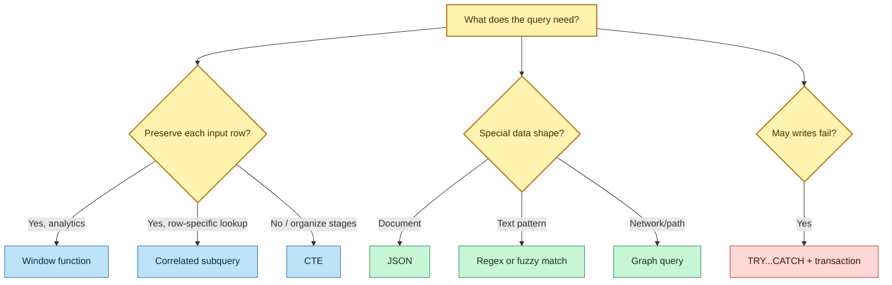
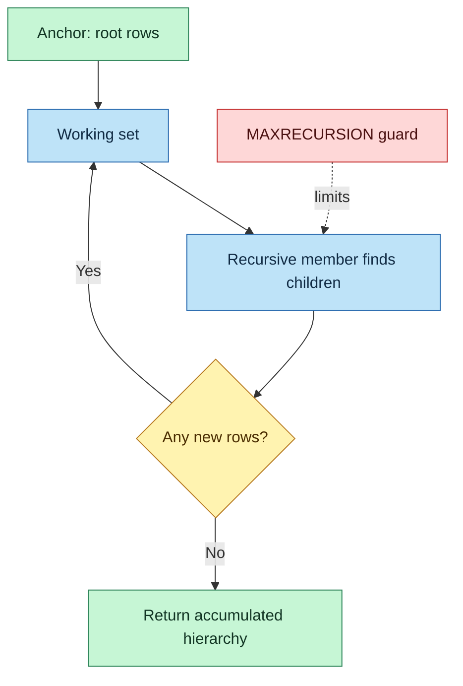
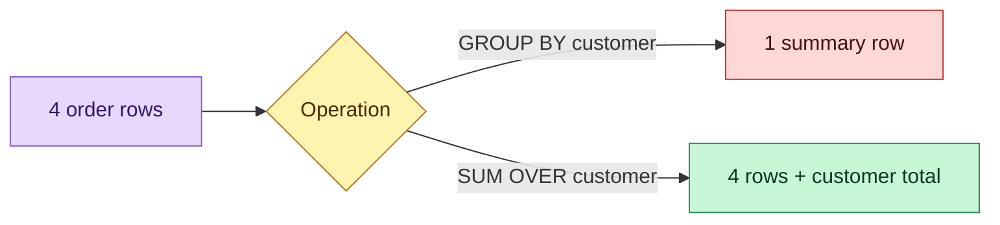
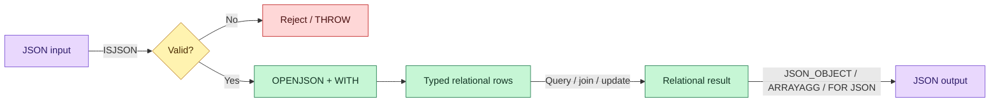
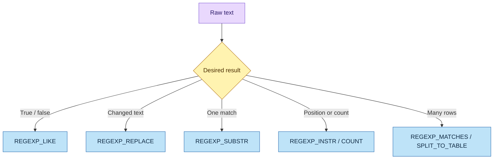
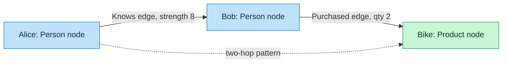
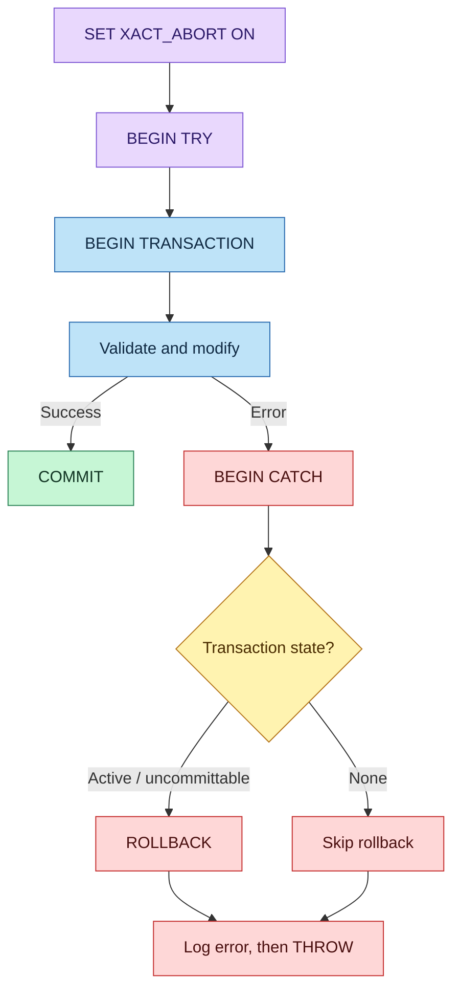

# DP-800 Advanced T-SQL Study Guide

> **Module:** Write advanced T-SQL code  
> **Exam:** Microsoft Certified: SQL AI Developer Associate (DP-800)  
> **Coverage:** CTEs, window functions, JSON, regular expressions, fuzzy matching, graph queries, correlated subqueries, and error handling

---

## How to use this guide

1. Read the **mental model** and **decision rules** first.
2. Run each commented query against `AdventureWorksLT` or a scratch database.
3. Complete the integrated lab without copying the solution.
4. Attempt Questions 1–60 before opening the answer key.
5. Revisit the rapid-revision tables during the final week before the exam.

> [!IMPORTANT]
> Feature availability differs across SQL Server, Azure SQL, and SQL database in Microsoft Fabric. The core ideas are portable, but always verify the engine version and database compatibility level before blaming the query.

---

## 1. Module map and central intuition

Advanced T-SQL is largely about choosing the correct *shape of computation*:

| Requirement | Best starting tool | Core idea |
|---|---|---|
| Break a complex statement into named stages | CTE | A temporary named result for one statement |
| Traverse a hierarchy | Recursive CTE | Anchor rows, then repeatedly find children |
| Rank or aggregate without losing individual rows | Window function | Calculate across a related window while preserving row detail |
| Exchange semi-structured API data | JSON functions | Convert between JSON documents and relational rows |
| Validate or transform complex text patterns | Regex | Describe the pattern rather than every possible string |
| Find likely matches despite spelling variation | Fuzzy functions | Measure distance or similarity rather than equality |
| Query networks and paths | SQL graph | Model entities as nodes and relationships as edges |
| Compare every row with a row-specific result | Correlated subquery | Let the inner query refer to the current outer row |
| Protect multi-step writes | `TRY...CATCH` + transaction | Commit everything or undo everything, then report the failure |



---

# Part I — Common Table Expressions

## 2. What is a CTE?

A Common Table Expression is a named query result defined with `WITH` and consumed by the immediately following `SELECT`, `INSERT`, `UPDATE`, `DELETE`, or `MERGE` statement. It is a query-scoping construct—not a persisted table and not automatically a materialized cache.

### Why use one?

- Give business meaning to an intermediate result.
- Replace deeply nested derived tables with readable stages.
- Reuse a logical result more than once in the consuming statement.
- Build hierarchies with recursion.
- Test complicated transformations one stage at a time.

### Basic syntax

```sql
-- The semicolon safely terminates any preceding statement.
;WITH SalesSummary AS
(
    SELECT
        ProductID,
        SUM(OrderQty) AS TotalQuantity,
        SUM(LineTotal) AS TotalRevenue
    FROM SalesLT.SalesOrderDetail
    GROUP BY ProductID
)
SELECT
    p.Name,
    s.TotalQuantity,
    s.TotalRevenue,
    -- NULLIF converts a zero denominator to NULL and prevents error 8134.
    s.TotalRevenue / NULLIF(s.TotalQuantity, 0) AS AverageUnitPrice
FROM SalesLT.Product AS p
JOIN SalesSummary AS s
  ON s.ProductID = p.ProductID
ORDER BY s.TotalRevenue DESC;
```

### CTE versus related objects

| Object | Scope/lifetime | Stored data? | Index directly? | Reusable across statements? |
|---|---|---:|---:|---:|
| CTE | One statement | No | No | No |
| Derived table | One query block | No | No | No |
| Temporary table | Session or procedure | Yes, in `tempdb` | Yes | Yes |
| Table variable | Batch/procedure/function | Yes, table-like | Limited declaration-time indexes | Yes within scope |
| View | Persistent metadata | Normally no | Indexed views are a special case | Yes |

> **Exam trap:** A CTE improves organization, but it does not guarantee that its result is evaluated once. The optimizer may inline or re-evaluate its logic.

## 3. Multiple CTEs

Define several CTEs after one `WITH`, separated by commas. A later CTE may reference an earlier CTE.

```sql
;WITH CategorySales AS
(
    SELECT
        p.ProductCategoryID,
        SUM(d.LineTotal) AS Revenue
    FROM SalesLT.Product AS p
    JOIN SalesLT.SalesOrderDetail AS d
      ON d.ProductID = p.ProductID
    GROUP BY p.ProductCategoryID
),
RankedCategories AS
(
    SELECT
        ProductCategoryID,
        Revenue,
        RANK() OVER (ORDER BY Revenue DESC) AS RevenueRank
    FROM CategorySales
)
SELECT ProductCategoryID, Revenue, RevenueRank
FROM RankedCategories
WHERE RevenueRank <= 5;
```

## 4. Recursive CTEs

A recursive CTE has:

1. **Anchor member** — supplies the starting rows.
2. **Recursive member** — joins the base data to rows found in the previous iteration.
3. **Termination condition** — recursion stops naturally when the recursive member returns no rows.
4. **Final consumer** — reads the accumulated result.



```sql
-- Example table assumption: Employee(EmployeeID, Name, ManagerID)
;WITH EmployeeHierarchy AS
(
    -- Anchor: begin at employees with no manager.
    SELECT
        EmployeeID,
        Name,
        ManagerID,
        0 AS HierarchyLevel,
        CAST(Name AS nvarchar(1000)) AS HierarchyPath
    FROM dbo.Employee
    WHERE ManagerID IS NULL

    UNION ALL

    -- Recursive member: find employees whose manager was found previously.
    SELECT
        e.EmployeeID,
        e.Name,
        e.ManagerID,
        h.HierarchyLevel + 1,
        CAST(h.HierarchyPath + N' > ' + e.Name AS nvarchar(1000))
    FROM dbo.Employee AS e
    JOIN EmployeeHierarchy AS h
      ON e.ManagerID = h.EmployeeID
)
SELECT *
FROM EmployeeHierarchy
ORDER BY HierarchyPath
OPTION (MAXRECURSION 100);
```

### Recursion safety

- The default limit is 100 recursive levels.
- `OPTION (MAXRECURSION n)` accepts `0` for unlimited—but unlimited can become an infinite loop.
- Cyclic data can revisit nodes even if the query logic looks correct.
- For large reusable number/date ranges, a permanent calendar or tally table is usually preferable.
- Keep anchor and recursive columns compatible in number and data type.

### Data modification through a CTE

```sql
;WITH ExpensiveProducts AS
(
    SELECT ProductID, ListPrice
    FROM SalesLT.Product
    WHERE ListPrice > 3000
)
UPDATE ExpensiveProducts
SET ListPrice = ListPrice * 0.95; -- Updates the underlying eligible rows.
```

---

# Part II — Window Functions

## 5. The central idea

`GROUP BY` collapses many input rows into one row per group. A window function calculates over related rows but returns a result for every original row.



### `OVER` anatomy

```sql
function_name(arguments) OVER
(
    PARTITION BY grouping_expression
    ORDER BY sequencing_expression
    ROWS BETWEEN frame_start AND frame_end
)
```

- `PARTITION BY` restarts the calculation for each logical group.
- `ORDER BY` defines sequence inside that group.
- `ROWS` or `RANGE` defines which ordered rows contribute to the current result.

## 6. Ranking functions and ties

| Function | Ties share rank? | Gaps after ties? | Main use |
|---|---:|---:|---|
| `ROW_NUMBER()` | No | No | Exactly one sequence position per row |
| `RANK()` | Yes | Yes | Competition ranking: 1, 1, 3 |
| `DENSE_RANK()` | Yes | No | Distinct value levels: 1, 1, 2 |
| `NTILE(n)` | Not rank-based | N/A | Divide ordered rows into roughly equal buckets |

```sql
SELECT
    ProductID,
    Name,
    ListPrice,
    -- Add ProductID as a deterministic tie-breaker.
    ROW_NUMBER() OVER (
        PARTITION BY ProductCategoryID
        ORDER BY ListPrice DESC, ProductID
    ) AS RowNum,
    RANK() OVER (
        PARTITION BY ProductCategoryID
        ORDER BY ListPrice DESC
    ) AS PriceRank,
    DENSE_RANK() OVER (
        PARTITION BY ProductCategoryID
        ORDER BY ListPrice DESC
    ) AS DensePriceRank,
    NTILE(4) OVER (ORDER BY ListPrice DESC) AS PriceQuartile
FROM SalesLT.Product
WHERE ListPrice > 0;
```

> **Exam trap:** `ROW_NUMBER()` with a nonunique `ORDER BY` is nondeterministic among ties. Add a unique tie-breaker when repeatability matters.

## 7. Aggregate windows and frames

```sql
SELECT
    CustomerID,
    SalesOrderID,
    OrderDate,
    TotalDue,
    -- Explicit ROWS avoids peer-row surprises when dates tie.
    SUM(TotalDue) OVER (
        PARTITION BY CustomerID
        ORDER BY OrderDate, SalesOrderID
        ROWS BETWEEN UNBOUNDED PRECEDING AND CURRENT ROW
    ) AS RunningTotal,
    -- Current order plus the two preceding physical rows.
    AVG(TotalDue) OVER (
        PARTITION BY CustomerID
        ORDER BY OrderDate, SalesOrderID
        ROWS BETWEEN 2 PRECEDING AND CURRENT ROW
    ) AS MovingAverage3
FROM SalesLT.SalesOrderHeader;
```

### `ROWS` versus `RANGE`

- `ROWS` counts physical rows relative to the current row.
- `RANGE` is value/peer aware; rows sharing the same ordering value can enter the frame together.
- An ordered aggregate window without an explicit frame commonly defaults to `RANGE BETWEEN UNBOUNDED PRECEDING AND CURRENT ROW`.
- For a predictable row-by-row running total, explicitly write `ROWS BETWEEN UNBOUNDED PRECEDING AND CURRENT ROW`.

## 8. Offset and distribution functions

```sql
SELECT
    CustomerID,
    SalesOrderID,
    OrderDate,
    TotalDue,
    -- Previous/next values avoid self-joins.
    LAG(TotalDue, 1, 0) OVER (
        PARTITION BY CustomerID ORDER BY OrderDate, SalesOrderID
    ) AS PreviousTotal,
    LEAD(TotalDue, 1, 0) OVER (
        PARTITION BY CustomerID ORDER BY OrderDate, SalesOrderID
    ) AS NextTotal,
    PERCENT_RANK() OVER (
        PARTITION BY CustomerID ORDER BY TotalDue
    ) AS PercentRank,
    CUME_DIST() OVER (
        PARTITION BY CustomerID ORDER BY TotalDue
    ) AS CumulativeDistribution
FROM SalesLT.SalesOrderHeader;
```

`PERCENT_RANK()` is based on `(rank - 1) / (rows - 1)` and begins at 0. `CUME_DIST()` is the proportion of rows less than or equal to the current value and is greater than 0.

### `FIRST_VALUE` and the `LAST_VALUE` trap

```sql
SELECT
    ProductCategoryID,
    Name,
    ListPrice,
    FIRST_VALUE(Name) OVER (
        PARTITION BY ProductCategoryID
        ORDER BY ListPrice DESC, ProductID
    ) AS HighestPricedProduct,
    LAST_VALUE(Name) OVER (
        PARTITION BY ProductCategoryID
        ORDER BY ListPrice DESC, ProductID
        -- Without UNBOUNDED FOLLOWING, the last row is often the current row.
        ROWS BETWEEN UNBOUNDED PRECEDING AND UNBOUNDED FOLLOWING
    ) AS LowestPricedProduct
FROM SalesLT.Product
WHERE ListPrice > 0;
```

---

# Part III — JSON

## 9. Relational-to-document mental model



## 10. Extract, validate, and modify JSON

| Function | Returns | Use when |
|---|---|---|
| `ISJSON(text)` | `1`, `0`, or `NULL` | Validate before parsing |
| `JSON_VALUE(text, path)` | Scalar as `nvarchar(4000)` | Extract one string/number/Boolean value |
| `JSON_QUERY(text, path)` | Object or array JSON fragment | Extract nested nonscalar JSON |
| `OPENJSON(text)` | Rowset | Turn an object/array into rows |
| `JSON_MODIFY(text, path, value)` | Updated JSON text | Add, change, or delete a property |

```sql
DECLARE @OrderJson nvarchar(max) = N'{
  "customer":{"id":42,"name":"Contoso"},
  "items":[{"productId":680,"quantity":2},{"productId":706,"quantity":1}],
  "priority":true
}';

IF ISJSON(@OrderJson) <> 1
    THROW 50010, 'Invalid JSON payload.', 1;

SELECT
    TRY_CONVERT(int, JSON_VALUE(@OrderJson, '$.customer.id')) AS CustomerID,
    JSON_VALUE(@OrderJson, '$.customer.name') AS CustomerName,
    JSON_QUERY(@OrderJson, '$.items') AS Items;

-- Parse the array with an explicit schema and SQL types.
SELECT ProductID, Quantity
FROM OPENJSON(@OrderJson, '$.items')
WITH
(
    ProductID int '$.productId',
    Quantity int '$.quantity'
);

-- JSON_MODIFY returns a new JSON string; assign it back to retain the change.
SET @OrderJson = JSON_MODIFY(@OrderJson, '$.status', 'validated');
SELECT @OrderJson;
```

### Lax and strict path modes

- `lax $.missing`: normally returns `NULL` or an empty result rather than raising a path error.
- `strict $.missing`: raises an error when the expected path is absent or has the wrong shape.
- Use **lax** for optional fields and **strict** for mandatory contract fields.

```sql
SELECT
    JSON_VALUE(@OrderJson, 'lax $.coupon') AS OptionalCoupon,
    JSON_VALUE(@OrderJson, 'strict $.customer.id') AS RequiredCustomerID;
```

## 11. Construct JSON

```sql
-- One JSON object from expressions.
SELECT JSON_OBJECT(
    'ProductID': p.ProductID,
    'Name': p.Name,
    'Price': p.ListPrice
) AS ProductJson
FROM SalesLT.Product AS p;

-- Aggregate multiple scalar/object expressions into one array.
SELECT
    ProductCategoryID,
    JSON_ARRAYAGG(JSON_OBJECT('id': ProductID, 'name': Name)) AS Products
FROM SalesLT.Product
GROUP BY ProductCategoryID;

-- Shape an entire query result as a JSON array with a named root.
SELECT ProductID, Name, ListPrice
FROM SalesLT.Product
WHERE ListPrice > 0
FOR JSON PATH, ROOT('products');
```

### Prevent unwanted escaping

When already-valid JSON is embedded into outer JSON, wrap it with `JSON_QUERY` so it is treated as a JSON fragment rather than ordinary text.

```sql
DECLARE @details nvarchar(max) = N'{"color":"red","size":"L"}';

SELECT
    680 AS ProductID,
    JSON_QUERY(@details) AS Details
FOR JSON PATH, WITHOUT_ARRAY_WRAPPER;
```

### JSON performance pattern

Repeated `JSON_VALUE` predicates parse text repeatedly and are not naturally index-seekable. For a heavily queried path, expose it through a computed column and index that column where the platform supports the pattern.

```sql
CREATE TABLE dbo.ApiOrder
(
    ApiOrderID bigint IDENTITY PRIMARY KEY,
    Payload nvarchar(max) NOT NULL,
    CustomerID AS TRY_CONVERT(int, JSON_VALUE(Payload, '$.customer.id'))
);
GO
CREATE INDEX IX_ApiOrder_CustomerID ON dbo.ApiOrder(CustomerID);
```

---

# Part IV — Regular Expressions

## 12. `LIKE` versus regex

`LIKE` is excellent for simple `%` and `_` wildcard matching. Regex adds anchors, repetition, character classes, alternation, capture groups, extraction, replacement, and splitting.

| Requirement | Prefer |
|---|---|
| Prefix such as `Name LIKE 'Jo%'` | `LIKE`—simple and often index-friendly |
| Exact product-code format | `REGEXP_LIKE` |
| Extract all numbers from prose | `REGEXP_MATCHES` |
| Replace repeated whitespace | `REGEXP_REPLACE` |
| Split on commas, semicolons, or pipes | `REGEXP_SPLIT_TO_TABLE` |

### Compatibility checkpoint

- Module syntax targets SQL Server 2025, Azure SQL Database, Azure SQL Managed Instance where supported, and SQL database in Microsoft Fabric.
- `REGEXP_LIKE` requires database compatibility level 170.
- SQL Server’s current regex implementation is based on RE2 syntax. Do not assume every PCRE feature is supported.
- If a regex function is unknown, check engine/version/compatibility before rewriting valid logic.

## 13. Regex building blocks

| Pattern | Meaning | Example |
|---|---|---|
| `.` | Any one character | `a.c` |
| `*`, `+`, `?` | Zero or more, one or more, optional | `ab*c` |
| `^`, `$` | Start and end anchors | `^[A-Z]+$` |
| `[A-Z]`, `[^0-9]` | Class, negated class | Capital / nondigit |
| `\d`, `\w`, `\s` | Digit, word, whitespace | `\d{4}` |
| `{n}`, `{n,m}` | Repetition count | `[A-Z]{2,4}` |
| `(a|b)` | Group and alternation | `(com|org)` |

```sql
-- Require two letters, a hyphen, then four to six alphanumerics.
SELECT ProductID, ProductNumber
FROM SalesLT.Product
WHERE REGEXP_LIKE(ProductNumber, '^[A-Z]{2}-[A-Z0-9]{4,6}$') = 1;

-- Case-insensitive name search.
SELECT ProductID, Name
FROM SalesLT.Product
WHERE REGEXP_LIKE(Name, 'frame', 'i') = 1;

-- Normalize arbitrary phone punctuation after stripping nondigits.
SELECT REGEXP_REPLACE(
           REGEXP_REPLACE(Phone, '[^\d]', ''),
           '^(\d{3})(\d{3})(\d{4})$',
           '($1) $2-$3'
       ) AS StandardizedPhone
FROM SalesLT.Customer;

-- Extract the first numeric sequence.
SELECT ProductNumber, REGEXP_SUBSTR(ProductNumber, '\d+') AS FirstNumber
FROM SalesLT.Product;

-- Count vowels, ignoring case.
SELECT Name, REGEXP_COUNT(Name, '[aeiou]', 1, 'i') AS VowelCount
FROM SalesLT.Product;

-- Split one string into a relational rowset.
DECLARE @tags nvarchar(200) = N'sql,database;azure|fabric';
SELECT value AS Tag
FROM REGEXP_SPLIT_TO_TABLE(@tags, '[,;|]');
```



> **Security note:** Regex validates structure, not truth or safety. A well-formed email may not exist, and removing HTML tags with one simple regex is not a complete security sanitizer.

---

# Part V — Fuzzy String Matching

## 14. Distance and similarity

Exact equality answers “Are these strings identical?” Fuzzy matching answers “How much transformation separates them?”

| Function | Scale | Better match means | Best fit |
|---|---:|---:|---|
| `EDIT_DISTANCE(a,b)` | 0 upward | Lower | Raw number of insertions, deletions, substitutions |
| `EDIT_DISTANCE_SIMILARITY(a,b)` | 0–100 | Higher | Length-normalized comparisons |
| `JARO_WINKLER_DISTANCE(a,b)` | 0–1 floating-point distance | **Lower** | Names and short strings, with prefix emphasis |
| `JARO_WINKLER_SIMILARITY(a,b)` | 0–100 integer similarity | **Higher** | Threshold-based name matching |

> [!WARNING]
> **Correction to the supplied module:** it uses `JARO_WINKLER_DISTANCE` with values near 1 and `> 0.85` as though it were similarity. Current Microsoft documentation says distance is lower-is-closer (for example, `Colour`/`Color` returns about `0.0333`). Use `JARO_WINKLER_SIMILARITY` for a higher-is-closer 0–100 score. These functions are currently documented as preview features.

```sql
DECLARE @FirstName nvarchar(50) = N'John';
DECLARE @LastName  nvarchar(50) = N'Smythe';

SELECT
    CustomerID,
    FirstName,
    LastName,
    JARO_WINKLER_SIMILARITY(@FirstName, FirstName) AS FirstScore,
    JARO_WINKLER_SIMILARITY(@LastName, LastName) AS LastScore
FROM SalesLT.Customer
-- Cheap/selective candidate filters first.
WHERE FirstName LIKE N'Jo%'
  AND LastName LIKE N'Sm%'
  -- Expensive fuzzy work only on the reduced set.
  AND JARO_WINKLER_SIMILARITY(@FirstName, FirstName) > 85
  AND JARO_WINKLER_SIMILARITY(@LastName, LastName) > 85;
```

### Why prefilter?

A self-comparison of every pair grows approximately as \(n(n-1)/2\). At one million rows, brute-force pair matching is infeasible. Block candidates first by country, postcode, first letter, phonetic key, date range, or another indexed attribute; then score the smaller set.

```mermaid
flowchart LR
    A["1,000,000 rows"] -->|Indexed blocking filters| B["Small candidate set"]
    B -->|Fuzzy score| C["Probable matches"]
    C -->|Business threshold / review| D["Merge or reject"]
    classDef large fill:#FED7D7,stroke:#C53030,color:#4A1010
    classDef reduced fill:#FFF3B0,stroke:#B7791F,color:#4A2C00
    classDef score fill:#BEE3F8,stroke:#2B6CB0,color:#102A43
    classDef final fill:#C6F6D5,stroke:#2F855A,color:#123524
    class A large
    class B reduced
    class C score
    class D final
```



### Thresholds are business decisions

Do not treat `0.85` or `70` as universal truth. Calibrate thresholds on labeled pairs and evaluate false merges versus missed matches. Names, addresses, product descriptions, and IDs have different error patterns.

---

# Part VI — SQL Graph

## 15. Nodes, edges, and direction

- A **node** is an entity: person, product, account, location.
- An **edge** is a directed relationship: knows, purchased, transferred-to.
- Node tables gain `$node_id`.
- Edge tables gain `$edge_id`, `$from_id`, and `$to_id`.
- Edge tables may store relationship properties such as date, quantity, or strength.



```sql
CREATE TABLE dbo.Person
(
    PersonID int PRIMARY KEY,
    Name nvarchar(100) NOT NULL
) AS NODE;

CREATE TABLE dbo.Product
(
    ProductID int PRIMARY KEY,
    Name nvarchar(100) NOT NULL
) AS NODE;

CREATE TABLE dbo.Purchased
(
    PurchaseDate date NOT NULL,
    Quantity int NOT NULL
) AS EDGE;

-- Connect nodes by their graph identifiers, not their business IDs.
INSERT dbo.Purchased ($from_id, $to_id, PurchaseDate, Quantity)
SELECT p.$node_id, pr.$node_id, '2026-07-22', 2
FROM dbo.Person AS p
CROSS JOIN dbo.Product AS pr
WHERE p.PersonID = 1 AND pr.ProductID = 680;

-- Direction: Person -> Purchased -> Product.
SELECT p.Name AS Buyer, pr.Name AS Product, e.Quantity
FROM dbo.Person AS p, dbo.Purchased AS e, dbo.Product AS pr
WHERE MATCH(p-(e)->pr);
```

### Multi-hop and shortest paths

```sql
-- Separate aliases are required when traversing the same edge type twice.
SELECT DISTINCT p1.Name, p3.Name AS FriendOfFriend
FROM dbo.Person AS p1,
     dbo.Knows AS k1,
     dbo.Person AS p2,
     dbo.Knows AS k2,
     dbo.Person AS p3
WHERE MATCH(p1-(k1)->p2-(k2)->p3)
  AND p1.PersonID = 1
  AND p3.PersonID <> p1.PersonID;
```

For variable-length paths, mark participating aliases `FOR PATH` and use `SHORTEST_PATH`. Graph tables and `MATCH` date to SQL Server 2017; `SHORTEST_PATH` requires SQL Server 2019 or later in the module guidance.

### Choose graph when

- Relationship traversal is the main workload.
- Path length is variable or unknown.
- Queries otherwise require many self-joins.
- Connectivity, recommendations, routes, or fraud rings are central.

Choose ordinary relational design for simple fixed relationships, attribute-heavy aggregation, and workloads well served by foreign-key indexes.

---

# Part VII — Correlated Subqueries

## 16. What makes a subquery correlated?

A correlated subquery references a column from its outer query. Logically, it is evaluated using the current outer row. Physically, the optimizer may transform it into a join or another efficient plan.

```sql
-- Compare every product with the average for its own category.
SELECT p.ProductID, p.Name, p.ListPrice
FROM SalesLT.Product AS p
WHERE p.ListPrice >
(
    SELECT AVG(p2.ListPrice)
    FROM SalesLT.Product AS p2
    WHERE p2.ProductCategoryID = p.ProductCategoryID -- Outer reference
);
```

## 17. `EXISTS` and `NOT EXISTS`

`EXISTS` asks whether at least one qualifying row exists; projected values are irrelevant, so `SELECT 1` communicates intent. It can stop after the first match.

```sql
-- Customers with at least one order.
SELECT c.CustomerID, c.FirstName, c.LastName
FROM SalesLT.Customer AS c
WHERE EXISTS
(
    SELECT 1
    FROM SalesLT.SalesOrderHeader AS h
    WHERE h.CustomerID = c.CustomerID
);

-- Customers with no order. This avoids NOT IN's NULL trap.
SELECT c.CustomerID, c.FirstName, c.LastName
FROM SalesLT.Customer AS c
WHERE NOT EXISTS
(
    SELECT 1
    FROM SalesLT.SalesOrderHeader AS h
    WHERE h.CustomerID = c.CustomerID
);
```

### Universal condition using double negation

“Categories where every product costs more than 100” becomes “categories for which no product violates the rule.”

```sql
SELECT pc.ProductCategoryID, pc.Name
FROM SalesLT.ProductCategory AS pc
WHERE NOT EXISTS
(
    SELECT 1
    FROM SalesLT.Product AS p
    WHERE p.ProductCategoryID = pc.ProductCategoryID
      AND p.ListPrice <= 100 -- A violating row
);
```

## 18. Scalar correlated subqueries

A scalar subquery in `SELECT` must return at most one value. Aggregates such as `COUNT`, `MAX`, and `AVG` naturally return one row.

```sql
SELECT
    c.CustomerID,
    c.FirstName,
    -- Contextual values calculated for the current customer.
    (SELECT COUNT(*)
     FROM SalesLT.SalesOrderHeader AS h
     WHERE h.CustomerID = c.CustomerID) AS OrderCount,
    (SELECT MAX(h.OrderDate)
     FROM SalesLT.SalesOrderHeader AS h
     WHERE h.CustomerID = c.CustomerID) AS LastOrderDate
FROM SalesLT.Customer AS c;
```

### Alternatives and performance

| Need | Usually prefer |
|---|---|
| Previous or next row | `LAG` / `LEAD` |
| Top N per group | `ROW_NUMBER`/`RANK` in a CTE |
| Retrieve columns across simple relationship | Join |
| Existence/absence with NULL-safe logic | `EXISTS` / `NOT EXISTS` |
| Complex row-specific selection | Correlated subquery or `APPLY` |

Index the correlation key and consider covering columns. Review the actual plan and `SET STATISTICS IO ON`; do not assume the logical “once per row” description is the physical implementation.

---

# Part VIII — Error Handling and Transactions

## 19. Reliable write pattern



```sql
CREATE OR ALTER PROCEDURE dbo.UpdateProductPrice
    @ProductID int,
    @NewPrice decimal(10,2)
AS
BEGIN
    SET NOCOUNT ON;
    SET XACT_ABORT ON;

    BEGIN TRY
        -- Validate before starting the transaction where possible.
        IF @NewPrice <= 0
            THROW 50001, 'Price must be greater than zero.', 1;

        BEGIN TRANSACTION;

        UPDATE SalesLT.Product
        SET ListPrice = @NewPrice
        WHERE ProductID = @ProductID;

        IF @@ROWCOUNT = 0
            THROW 50002, 'Product not found.', 1;

        COMMIT TRANSACTION;
    END TRY
    BEGIN CATCH
        -- XACT_STATE() = -1 means uncommittable; 1 means active/committable.
        IF XACT_STATE() <> 0
            ROLLBACK TRANSACTION;

        -- Capture/log ERROR_* values here before control leaves CATCH.
        DECLARE @Message nvarchar(4000) = ERROR_MESSAGE();
        DECLARE @Number int = ERROR_NUMBER();

        -- Parameterless THROW preserves the original error context.
        THROW;
    END CATCH;
END;
```

## 20. Error-information functions

Inside `CATCH`, use:

| Function | Information |
|---|---|
| `ERROR_NUMBER()` | Error number |
| `ERROR_MESSAGE()` | Complete message |
| `ERROR_SEVERITY()` | Severity |
| `ERROR_STATE()` | State/location discriminator |
| `ERROR_LINE()` | Line number |
| `ERROR_PROCEDURE()` | Procedure or trigger name, otherwise `NULL` |

## 21. `@@TRANCOUNT` versus `XACT_STATE()`

- `@@TRANCOUNT` tells how many `BEGIN TRANSACTION` levels are active.
- `XACT_STATE()` tells whether the session has no transaction (`0`), a committable transaction (`1`), or an uncommittable transaction (`-1`).
- A nested `COMMIT` normally decrements `@@TRANCOUNT`; it does not make the outer transaction durable.
- A full `ROLLBACK TRANSACTION` without a savepoint rolls back the entire transaction and resets the count.

## 22. `THROW` versus `RAISERROR`

| Feature | `THROW` | `RAISERROR` |
|---|---|---|
| Recommended for new code | Yes | Usually legacy/compatibility cases |
| Rethrow original error | Bare `THROW;` | More manual |
| Formatted printf-style substitutions | No | Yes |
| Honors `SET XACT_ABORT` consistently | Yes | No |
| Custom error number | Must be at least 50000 | Can use message IDs or dynamic text |

> **Exam trap:** `TRY...CATCH` does not catch every failure in the same scope. Syntax/compile errors and connection-terminating errors may bypass it. Also, `XACT_ABORT ON` does not replace logging and rethrowing; it complements structured handling.

---

# Part IX — Integrated AdventureWorksLT Lab

## 23. Scenario

An API submits proposed product prices as JSON. Your procedure must validate and parse the document, retain only valid products, rank changes inside each category, apply approved changes atomically, and return a JSON audit response.

### Step A — Parse and preview

```sql
DECLARE @Payload nvarchar(max) = N'{
  "requestedBy":"marketing-api",
  "updates":[
    {"productId":680,"newPrice":1250.00},
    {"productId":706,"newPrice":1450.00},
    {"productId":707,"newPrice":38.99}
  ]
}';

IF ISJSON(@Payload) <> 1
    THROW 50100, 'Payload is not valid JSON.', 1;

;WITH ParsedUpdates AS
(
    SELECT ProductID, NewPrice
    FROM OPENJSON(@Payload, '$.updates')
    WITH
    (
        ProductID int '$.productId',
        NewPrice decimal(10,2) '$.newPrice'
    )
),
ChangeAnalysis AS
(
    SELECT
        p.ProductID,
        p.ProductCategoryID,
        p.Name,
        p.ListPrice AS OldPrice,
        u.NewPrice,
        u.NewPrice - p.ListPrice AS PriceDifference,
        ROW_NUMBER() OVER
        (
            PARTITION BY p.ProductCategoryID
            ORDER BY ABS(u.NewPrice - p.ListPrice) DESC, p.ProductID
        ) AS ChangeRank
    FROM ParsedUpdates AS u
    JOIN SalesLT.Product AS p
      ON p.ProductID = u.ProductID
    WHERE u.NewPrice > 0
)
SELECT ProductID, Name, OldPrice, NewPrice, PriceDifference, ChangeRank
FROM ChangeAnalysis
ORDER BY ProductCategoryID, ChangeRank;
```

### Step B — Transactional update pattern

```sql
SET XACT_ABORT ON;

BEGIN TRY
    BEGIN TRANSACTION;

    -- Re-parse inside the unit of work or stage validated input beforehand.
    UPDATE p
    SET p.ListPrice = u.NewPrice
    FROM SalesLT.Product AS p
    JOIN OPENJSON(@Payload, '$.updates')
    WITH
    (
        ProductID int '$.productId',
        NewPrice decimal(10,2) '$.newPrice'
    ) AS u
      ON u.ProductID = p.ProductID
    WHERE u.NewPrice > 0;

    COMMIT TRANSACTION;

    SELECT
        JSON_VALUE(@Payload, '$.requestedBy') AS RequestedBy,
        'accepted' AS [Status],
        SYSUTCDATETIME() AS ProcessedAt
    FOR JSON PATH, WITHOUT_ARRAY_WRAPPER;
END TRY
BEGIN CATCH
    IF XACT_STATE() <> 0
        ROLLBACK TRANSACTION;
    THROW;
END CATCH;
```

### Lab extensions

1. Reject the whole request if any `ProductID` does not exist.
2. Reject duplicate `productId` entries.
3. Add a maximum allowed price-change percentage.
4. Log the old and new prices using `OUTPUT deleted... inserted...`.
5. Return accepted and rejected items as separate nested JSON arrays.

---

# Part X — Rapid Revision Sheet

## 24. One-line rules

- A CTE lasts for one consuming statement; it is not automatically materialized.
- Recursive CTE = anchor + `UNION ALL` + recursive member + termination.
- Window functions preserve rows; `GROUP BY` collapses rows.
- `ROW_NUMBER` breaks ties, `RANK` leaves gaps, `DENSE_RANK` does not.
- Explicit `ROWS` frames make running calculations predictable.
- `LAST_VALUE` usually needs `UNBOUNDED FOLLOWING` to mean the last row in the partition.
- `JSON_VALUE` is scalar; `JSON_QUERY` is object/array; `OPENJSON` returns rows.
- Lax JSON paths tolerate absence; strict paths enforce the contract.
- `JSON_QUERY` prevents valid nested JSON from being escaped as plain text.
- `REGEXP_LIKE` tests; `REPLACE` changes; `SUBSTR` extracts; table-valued regex functions return rows.
- Fuzzy matching needs candidate blocking before expensive scoring.
- Graph edge direction must agree with `$from_id` → `$to_id`.
- `EXISTS` checks presence; `NOT EXISTS` is safe for anti-joins involving possible `NULL`s.
- Window functions usually beat correlated subqueries for rankings and adjacent-row comparison.
- Use `SET XACT_ABORT ON`, `TRY...CATCH`, rollback when a transaction exists, log, then `THROW`.
- Custom `THROW` error numbers start at 50000.

## 25. “Which tool?” mini-table

| Exam wording | Likely answer |
|---|---|
| “Previous row” | `LAG` |
| “Next row” | `LEAD` |
| “Top 3 within every category” | `ROW_NUMBER`/`RANK` + `PARTITION BY` |
| “Keep detail plus department total” | `SUM(...) OVER (PARTITION BY ...)` |
| “Hierarchy of unknown depth” | Recursive CTE or graph path, depending on model |
| “Parse array into typed rows” | `OPENJSON ... WITH` |
| “Extract nested object” | `JSON_QUERY` |
| “Optional JSON property” | Lax path |
| “Complex text format” | `REGEXP_LIKE` |
| “Likely duplicate name” | Jaro-Winkler / edit similarity after prefiltering |
| “No related rows” | `NOT EXISTS` |
| “Undo every write after failure” | Transaction + `TRY...CATCH` + rollback |

---

# Part XI — Practice Questions

## Questions 1–40: Multiple choice

### 1. What is the lifetime of a CTE?

A. The current connection  
B. The current transaction  
C. The single statement that immediately consumes it  
D. Until explicitly dropped

### 2. How are multiple CTE definitions combined?

A. Separate `WITH` clauses joined by semicolons  
B. Commas within one `WITH` clause  
C. `UNION` between CTE names  
D. Nested `CREATE CTE` statements

### 3. Which two logical members define a recursive CTE?

A. Parent and child indexes  
B. Anchor and recursive members  
C. Source and target tables  
D. `TRY` and `CATCH`

### 4. What is SQL Server’s default recursive CTE limit?

A. 10  
B. 32  
C. 100  
D. Unlimited

### 5. What does `OPTION (MAXRECURSION 0)` mean?

A. Disable recursion  
B. Use only the anchor  
C. No recursion limit  
D. Return zero rows

### 6. Which statement about CTEs is correct?

A. They are always materialized once  
B. They can never participate in an update  
C. They are named query expressions scoped to one statement  
D. They automatically create indexes

### 7. Which feature distinguishes a window aggregate from a grouped aggregate?

A. It cannot use `SUM`  
B. It preserves individual rows  
C. It requires a temporary table  
D. It always sorts final output

### 8. Which function assigns unique sequential numbers even when values tie?

A. `RANK`  
B. `DENSE_RANK`  
C. `ROW_NUMBER`  
D. `NTILE`

### 9. Prices are 100, 100, and 90. What ranks does `RANK()` assign in descending order?

A. 1, 1, 2  
B. 1, 2, 3  
C. 1, 1, 3  
D. 0, 0, 2

### 10. What does `PARTITION BY DepartmentID` do?

A. Filters unwanted departments  
B. Restarts the window calculation for each department  
C. Physically partitions the table  
D. Sorts the final output

### 11. Which function retrieves the previous ordered row’s value?

A. `LEAD`  
B. `LAG`  
C. `FIRST_VALUE`  
D. `CUME_DIST`

### 12. Which frame represents a three-row moving window ending at the current row?

A. `ROWS 3 PRECEDING`  
B. `ROWS BETWEEN 2 PRECEDING AND CURRENT ROW`  
C. `RANGE BETWEEN 3 PRECEDING AND CURRENT ROW`  
D. `ROWS BETWEEN CURRENT ROW AND 3 FOLLOWING`

### 13. Why can `LAST_VALUE()` unexpectedly return the current row?

A. It ignores `PARTITION BY`  
B. The default ordered frame usually ends at the current row  
C. It sorts only ascending  
D. It requires a CTE

### 14. Which function divides ordered rows into four roughly equal buckets?

A. `NTILE(4)`  
B. `RANK(4)`  
C. `CUME_DIST(4)`  
D. `ROW_NUMBER(4)`

### 15. Which expression adds a department total beside every employee row?

A. `SUM(Sales) GROUP BY DepartmentID`  
B. `SUM(Sales) OVER (PARTITION BY DepartmentID)`  
C. `RANK(Sales) OVER DepartmentID`  
D. `COUNT(DepartmentID) WHERE Sales`

### 16. Which JSON function extracts a scalar value?

A. `JSON_QUERY`  
B. `JSON_VALUE`  
C. `OPENJSON`  
D. `FOR JSON`

### 17. Which function extracts a nested JSON object or array without treating it as a scalar?

A. `JSON_QUERY`  
B. `JSON_VALUE`  
C. `ISJSON`  
D. `JSON_MODIFY`

### 18. Which feature converts a JSON array into a relational rowset?

A. `JSON_ARRAY`  
B. `OPENJSON`  
C. `JSON_VALUE`  
D. `ROOT`

### 19. Which mode should be used for an optional path that may be absent without raising an error?

A. Strict  
B. Lax  
C. Recursive  
D. Scalar

### 20. Why wrap an already valid nested JSON fragment in `JSON_QUERY` during outer JSON generation?

A. To encrypt it  
B. To avoid escaping it as ordinary text  
C. To make it scalar  
D. To create an index

### 21. Which function should aggregate multiple row expressions into one JSON array?

A. `JSON_VALUE`  
B. `JSON_ARRAYAGG`  
C. `JSON_OBJECT`  
D. `ISJSON`

### 22. Which clause converts an entire query result to JSON?

A. `OVER JSON`  
B. `FOR JSON PATH`  
C. `WITH JSON`  
D. `CAST AS JSON`

### 23. Which JSON path mode is appropriate when a missing mandatory property must cause an error?

A. Lax  
B. Strict  
C. Default-only  
D. Array

### 24. Which function answers only whether text matches a regex pattern?

A. `REGEXP_REPLACE`  
B. `REGEXP_LIKE`  
C. `REGEXP_SUBSTR`  
D. `REGEXP_SPLIT_TO_TABLE`

### 25. What do `^` and `$` represent in regex?

A. Digit and whitespace  
B. Start and end of the string  
C. Capture and replacement  
D. Optional and repeated

### 26. Which function returns rows after splitting on a regular-expression delimiter?

A. `REGEXP_COUNT`  
B. `REGEXP_INSTR`  
C. `REGEXP_SPLIT_TO_TABLE`  
D. `STRING_ESCAPE`

### 27. What compatibility level does the current `REGEXP_LIKE` documentation require?

A. 130  
B. 150  
C. 160  
D. 170

### 28. Which fuzzy function returns a raw minimum edit count?

A. `EDIT_DISTANCE`  
B. `EDIT_DISTANCE_SIMILARITY`  
C. `JARO_WINKLER_DISTANCE`  
D. `SOUNDEX_SIMILARITY`

### 29. For `EDIT_DISTANCE_SIMILARITY`, which score indicates the best match?

A. 0  
B. 1  
C. 50  
D. 100

### 30. Which technique should normally precede expensive fuzzy scoring on a large table?

A. Cross join every row  
B. Candidate prefiltering/blocking  
C. Remove all indexes  
D. Convert values to JSON

### 31. Which fuzzy algorithm in the module is especially suitable for short person names?

A. `EDIT_DISTANCE_SIMILARITY` only  
B. `JARO_WINKLER_SIMILARITY`  
C. `REGEXP_COUNT`  
D. `DIFFERENCE_PERCENT`

### 32. Which system column is automatically added to a node table?

A. `$edge_id`  
B. `$node_id`  
C. `$path_id`  
D. `$graph_key`

### 33. Which columns identify the direction endpoints of an edge?

A. `$left_id`, `$right_id`  
B. `$parent_id`, `$child_id`  
C. `$from_id`, `$to_id`  
D. `$start`, `$finish`

### 34. What is wrong if a graph query returns no rows despite existing edges?

A. `MATCH` cannot query edge properties  
B. The pattern’s arrow direction may oppose how the edge was inserted  
C. Nodes cannot contain ordinary columns  
D. Graph tables cannot be indexed

### 35. Which construct handles variable-length graph traversal?

A. `LONGEST_JOIN`  
B. `SHORTEST_PATH`  
C. Recursive `JSON_PATH`  
D. `RANGE PATH`

### 36. What makes a subquery correlated?

A. It contains an aggregate  
B. It references a column from the outer query  
C. It uses `IN`  
D. It appears in `SELECT`

### 37. Which pattern is usually safest for “customers with no orders” when the inner key might contain `NULL`?

A. `NOT IN`  
B. `NOT EXISTS`  
C. `<> ALL` without correlation  
D. `CROSS JOIN`

### 38. What must a scalar subquery in the `SELECT` list return?

A. Exactly one table  
B. At most one value  
C. At least two rows  
D. JSON only

### 39. Which is normally clearer for comparing a row with its immediately previous row?

A. Recursive CTE  
B. `LAG`  
C. Graph `MATCH`  
D. `JSON_VALUE`

### 40. Which error-handling statement reraises the current error while preserving its context?

A. `THROW;` inside `CATCH`  
B. `RETURN 0`  
C. `PRINT ERROR_MESSAGE()`  
D. `COMMIT`

## Questions 41–50: Select all that apply

### 41. Which are benefits or capabilities of CTEs?

A. Improve readability  
B. Support recursion  
C. Persist results across a session automatically  
D. Can precede certain data-modification statements

### 42. Which statements about window ordering are correct?

A. It defines logical order for the window calculation  
B. It guarantees final result display order  
C. Adding a unique tie-breaker can make `ROW_NUMBER` repeatable  
D. It can create a running aggregate

### 43. Which functions preserve row detail while calculating across related rows?

A. `SUM(...) OVER (...)`  
B. `RANK() OVER (...)`  
C. Plain `GROUP BY` aggregate  
D. `LAG(...) OVER (...)`

### 44. Which statements about JSON are correct?

A. `OPENJSON ... WITH` can assign SQL data types  
B. `JSON_VALUE` is intended for objects and arrays  
C. `ISJSON` can validate a payload  
D. `JSON_MODIFY` returns modified JSON text

### 45. Which regex requirements are good fits for regex rather than simple `LIKE`?

A. Exact repeated digit counts  
B. Alternation among several domains  
C. A simple indexed prefix search  
D. Capture-group replacement

### 46. Which actions improve fuzzy-match performance or quality?

A. Prefilter candidates  
B. Calibrate thresholds on labeled examples  
C. Compare every possible pair first  
D. Use a metric suited to the string type

### 47. Which statements describe SQL graph tables?

A. Nodes represent entities  
B. Edges can store properties  
C. Edge direction is irrelevant  
D. Graph tables can work with relational features

### 48. Which are appropriate uses for `EXISTS`?

A. Determine whether any related order exists  
B. Return every column from the related table automatically  
C. Express an anti-join with `NOT EXISTS`  
D. Stop logically after finding one qualifying row

### 49. Which error details can be retrieved inside `CATCH`?

A. `ERROR_NUMBER()`  
B. `ERROR_MESSAGE()`  
C. `ERROR_LINE()`  
D. `ERROR_PROCEDURE()`

### 50. Which belong in a robust multi-statement write procedure?

A. `SET XACT_ABORT ON`  
B. A transaction  
C. Conditional rollback in `CATCH`  
D. Bare `THROW;` after logging/cleanup

## Questions 51–60: Scenarios and short answers

### 51. You need each employee row plus the total salary of that employee’s department. Which expression should you use?

### 52. You need the three most expensive products in every category, exactly three when each category has at least three products. Which ranking function is the best default, and how should ties be made deterministic?

### 53. An ordered running total jumps by several tied-date rows at once. What likely caused this, and how do you fix it?

### 54. An API property `shipping.instructions` is an object. Why does `JSON_VALUE` return `NULL` or fail, and what should replace it?

### 55. A query embeds a nested JSON string but the output contains escaped quotation marks. What is the fix?

### 56. A valid `REGEXP_LIKE` query is reported as an unknown function on a database. What two compatibility checks should you perform?

### 57. Duplicate detection over ten million customers is too slow. Give a two-stage matching plan.

### 58. A `MATCH(Employee-(ReportsTo)->Manager)` query returns nothing. What data should you inspect first?

### 59. Explain the logic behind using `NOT EXISTS` to find categories in which every product is above ₹100.

### 60. In a `CATCH` block, when should you roll back, what should you record, and how should you notify the caller?

---

# Part XII — Answers and Rationales

## Answers 1–40

1. **C.** A CTE is visible only to the immediately following consuming statement.
2. **B.** One `WITH` clause can define multiple comma-separated CTEs.
3. **B.** The anchor supplies initial rows; the recursive member repeatedly derives more.
4. **C.** SQL Server defaults to 100 recursive levels.
5. **C.** Zero means unlimited recursion, so it must be used cautiously.
6. **C.** A CTE is a statement-scoped named query expression; it is not guaranteed materialized storage.
7. **B.** Window functions calculate across related rows while retaining one output per original row.
8. **C.** `ROW_NUMBER` gives every row a unique sequential number.
9. **C.** `RANK` preserves the tie and skips the occupied next rank: 1, 1, 3.
10. **B.** The window calculation starts again for each department partition.
11. **B.** `LAG` reads a preceding row in the specified window order.
12. **B.** Current plus two preceding physical rows produces at most three rows.
13. **B.** The default ordered frame ends at the current row; explicitly extend it to `UNBOUNDED FOLLOWING`.
14. **A.** `NTILE(4)` creates four approximately equal ordered buckets.
15. **B.** The windowed `SUM` adds the total while preserving employee rows.
16. **B.** `JSON_VALUE` extracts a scalar.
17. **A.** `JSON_QUERY` returns an object or array fragment.
18. **B.** `OPENJSON` is a table-valued parser.
19. **B.** Lax mode tolerates a missing optional path.
20. **B.** `JSON_QUERY` marks the fragment as JSON and avoids double escaping.
21. **B.** `JSON_ARRAYAGG` aggregates multiple expressions into one array.
22. **B.** `FOR JSON PATH` formats the query result as JSON.
23. **B.** Strict mode enforces the required path and raises an error when absent/incompatible.
24. **B.** `REGEXP_LIKE` is the predicate-style regex function.
25. **B.** They anchor the match at the beginning and end.
26. **C.** It splits a string and exposes parts as rows.
27. **D.** Current Microsoft documentation specifies compatibility level 170 for `REGEXP_LIKE`.
28. **A.** `EDIT_DISTANCE` returns the raw minimum number of edits.
29. **D.** The normalized similarity scale reaches 100 for identical strings.
30. **B.** Cheap, selective blocking reduces the number of expensive comparisons.
31. **B.** Jaro-Winkler emphasizes matching prefixes and is useful for names/short strings.
32. **B.** SQL Server adds `$node_id` to node tables.
33. **C.** `$from_id` and `$to_id` establish edge direction.
34. **B.** `MATCH` arrows must align with the stored direction.
35. **B.** `SHORTEST_PATH` supports variable-length traversal patterns.
36. **B.** The inner query’s outer reference creates correlation.
37. **B.** `NOT EXISTS` avoids the three-valued-logic surprise that `NULL` can cause with `NOT IN`.
38. **B.** A scalar context accepts zero rows as `NULL` or one value, but multiple rows cause an error.
39. **B.** `LAG` directly expresses an adjacent preceding value and is usually clearer and faster.
40. **A.** Bare `THROW;` inside `CATCH` reraises the original error.

## Answers 41–50

41. **A, B, D.** CTEs improve organization, support recursion, and can feed eligible modifications; they do not persist automatically.
42. **A, C, D.** Window `ORDER BY` controls the calculation, not final display. It supports running calculations, and a unique tie-breaker stabilizes ordering.
43. **A, B, D.** All three are window operations. Plain `GROUP BY` collapses rows.
44. **A, C, D.** An explicit `OPENJSON` schema creates typed columns; `ISJSON` validates; `JSON_MODIFY` returns changed text. `JSON_VALUE` is scalar-only.
45. **A, B, D.** Repetition, alternation, and capture replacement need regex power. A basic prefix is usually better with `LIKE`.
46. **A, B, D.** Reduce candidates, validate thresholds empirically, and match the algorithm to the data.
47. **A, B, D.** Nodes are entities, edges are directional relationships with optional properties, and graph tables remain relationally interoperable.
48. **A, C, D.** `EXISTS`/`NOT EXISTS` test presence/absence; they do not automatically project related columns.
49. **A, B, C, D.** All are standard error-information functions available in `CATCH`.
50. **A, B, C, D.** Together they provide predictable rollback, cleanup, diagnostics, and propagation.

## Answers 51–60

51. Use `SUM(Salary) OVER (PARTITION BY DepartmentID)`. It computes the departmental total without collapsing employee rows.

52. Use `ROW_NUMBER()` partitioned by category and ordered by price descending. Add a unique key such as `ProductID` after price in the `ORDER BY` so tied prices have a deterministic sequence. Use `RANK` instead if the requirement says to retain all ties, even when that returns more than three rows.

53. An implicit `RANGE` frame probably grouped peer rows with the same date. Specify a unique ordering key and `ROWS BETWEEN UNBOUNDED PRECEDING AND CURRENT ROW`.

54. `JSON_VALUE` only returns scalars. `shipping.instructions` is nonscalar, so use `JSON_QUERY(payload, '$.shipping.instructions')`.

55. Wrap the nested valid fragment with `JSON_QUERY(fragment)` before `FOR JSON` so SQL Server embeds it as JSON instead of escaped text.

56. Check whether the database platform/version supports the regex feature, then check whether the database compatibility level is 170 for `REGEXP_LIKE`.

57. First block candidates with indexed/selective rules such as normalized country, postcode, surname prefix, or email domain. Then calculate edit or Jaro-Winkler similarity only within each small block and apply a threshold calibrated on labeled duplicate/nonduplicate pairs.

58. Inspect how the edge rows were inserted: confirm the employee’s `$node_id` is in `$from_id` and the manager’s `$node_id` is in `$to_id`. If reversed, reverse the pattern arrow or correct the data.

59. Search for a violating product (`ListPrice <= 100`) within each category. `NOT EXISTS` keeps only categories for which no violating row exists; logically, “not any violation” means every product satisfies the rule. Decide separately how empty categories should be treated, because the condition is vacuously true for them.

60. If `XACT_STATE() <> 0` (or an appropriate `@@TRANCOUNT > 0` check is used), roll back. Record `ERROR_NUMBER`, message, severity, state, procedure, line, relevant business identifiers, and timestamp. After cleanup/logging, use bare `THROW;` to preserve and propagate the original error.

---

# Part XIII — Final Self-Assessment

You are ready to move on when you can do the following without notes:

- [ ] Write a recursive hierarchy query and explain anchor, recursion, termination, and `MAXRECURSION`.
- [ ] Predict tie behavior for `ROW_NUMBER`, `RANK`, and `DENSE_RANK`.
- [ ] Explain `ROWS` versus `RANGE` and repair a `LAST_VALUE` frame.
- [ ] Parse typed JSON rows, extract scalars/objects, modify a property, and generate nested output.
- [ ] Select the correct regex function and diagnose a compatibility-level problem.
- [ ] Design an efficient candidate-blocking strategy before fuzzy scoring.
- [ ] Create/query node and edge tables with correct direction.
- [ ] Rewrite a correlated ranking/adjacent-row query with a window function.
- [ ] Explain why `NOT EXISTS` is preferable to `NOT IN` when `NULL` is possible.
- [ ] Write a production-style transaction with validation, rollback, diagnostics, and rethrow.

---

## Verified platform notes

- The uploaded module is the primary source for the learning sequence, examples, lab, and assessment coverage.
- [Microsoft Learn: regular expressions](https://learn.microsoft.com/en-us/sql/relational-databases/regular-expressions/overview?view=sql-server-ver17) currently documents regex support for SQL Server 2025, Azure SQL Database, supported Azure SQL Managed Instance configurations, and SQL database in Microsoft Fabric.
- [`REGEXP_LIKE`](https://learn.microsoft.com/en-us/sql/t-sql/functions/regexp-like-transact-sql?view=sql-server-ver17) requires compatibility level 170; current SQL Server regex support uses RE2-based syntax.
- Current Microsoft Learn pages distinguish lower-is-closer [`JARO_WINKLER_DISTANCE`](https://learn.microsoft.com/en-us/sql/t-sql/functions/jaro-winkler-distance-transact-sql?view=sql-server-ver17) from higher-is-closer [`JARO_WINKLER_SIMILARITY`](https://learn.microsoft.com/en-us/sql/t-sql/functions/jaro-winkler-similarity-transact-sql?view=sql-server-ver17).
- Always consult the documentation for the exact target platform because cloud services and compatibility behavior evolve.
