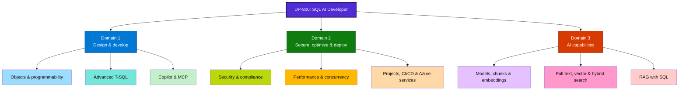
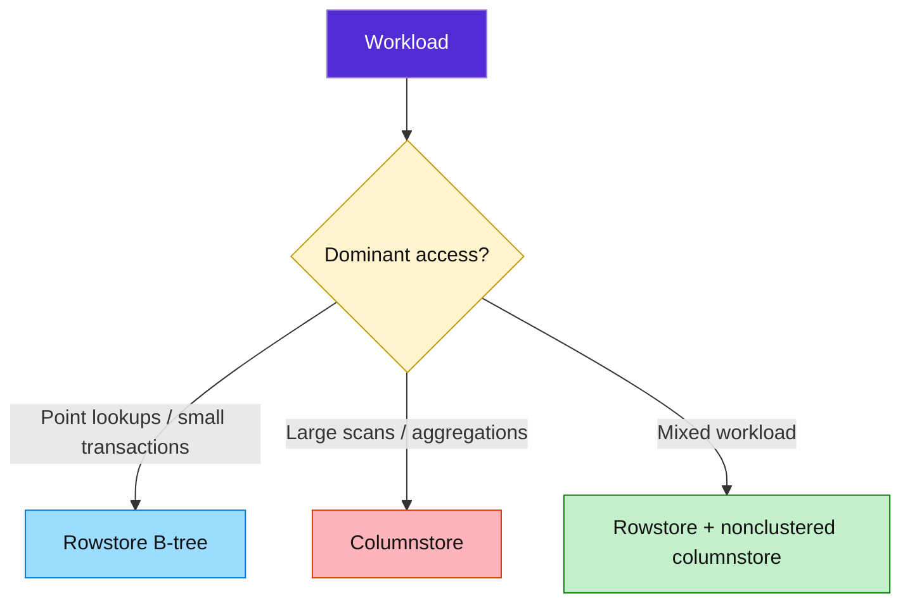
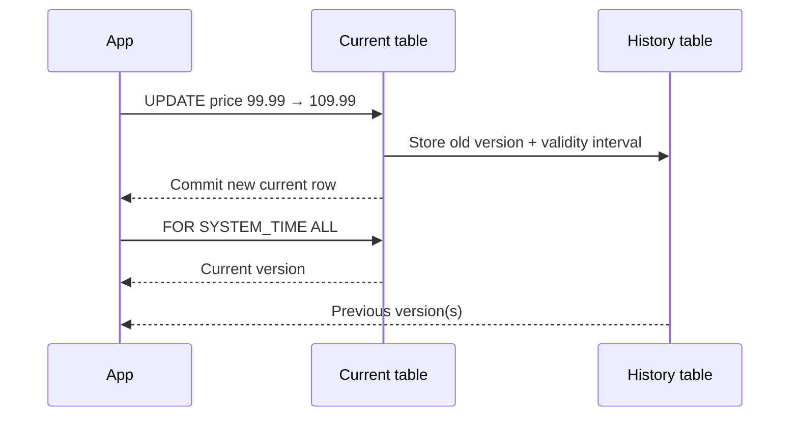
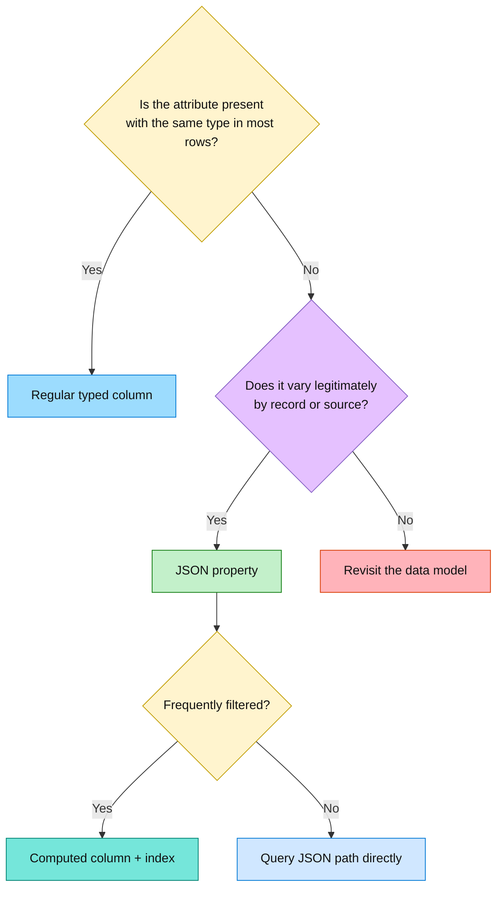
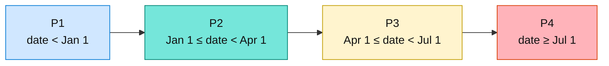

# DP-800 Study Guide: Design and Implement Database Objects with SQL

> Microsoft Certified: SQL AI Developer Associate (DP-800)  
> Source scope: DP-800 skills outline plus the Microsoft Learn module **Design and implement database objects with SQL** supplied by the learner.

## How to use this guide

1. Read the **exam map** to understand where this chapter fits.
2. Study each concept through **what, why, how, when, examples, and pitfalls**.
3. Run the commented T-SQL lab in SQL Server 2025 or a compatible environment.
4. Use the **rapid revision sheet** before a mock exam.
5. Attempt the **60 practice questions** without looking at the answer key.

> [!IMPORTANT]
> Several features in the supplied material, including the native `JSON` data type and some JSON modification behavior, require SQL Server 2025 or are version/platform dependent. Always check feature support for your target SQL platform.

---

## 1. DP-800 exam map

| Domain | Weight | Main abilities |
|---|---:|---|
| Design and develop database solutions | 35–40% | Database objects, programmable objects, advanced T-SQL, AI-assisted development |
| Secure, optimize, and deploy database solutions | 35–40% | Security, performance, SQL Database Projects, CI/CD, Azure integration |
| Implement AI capabilities in database solutions | 25–30% | Models, embeddings, vector/hybrid search, RAG |

### Full skills roadmap



This chapter deeply covers **Domain 1.1: Design and implement database objects**. The other listed skills are included in the roadmap so you can place the chapter within your wider preparation plan.

---

## 2. Why database-object design matters

Database design decisions are expensive to reverse. Application code may be refactored and redeployed quickly, but changing the physical foundation of a large production table can require data movement, index rebuilding, locking, testing, and downtime.

Good object design improves:

- **Performance:** narrower types and suitable indexes reduce I/O and CPU work.
- **Integrity:** constraints stop invalid data at the database boundary.
- **Scalability:** partitioning and appropriate storage structures handle growth.
- **Maintainability:** explicit names and clear relationships simplify deployment.
- **AI readiness:** well-structured relational and semi-structured data is easier to chunk, embed, retrieve, and ground in RAG systems.

### The central design idea


Before choosing an object, ask:

- Is the workload mostly single-row transactions or large analytical scans?
- Is the schema fixed or does part of it vary by row?
- Must history be queryable, cryptographically verifiable, or both?
- Are relationships simple foreign-key relationships or multi-hop networks?
- Which column dominates filtering, archival, and maintenance?
- Which platform features are available?

---

## 3. Microsoft SQL platform choices

### 3.1 Azure SQL Database

**What:** A fully managed PaaS relational database.

**Why:** Azure manages infrastructure, patching, backups, and built-in availability, allowing the team to focus on schemas, queries, and applications.

**When to use:** Cloud-native applications that need managed operations, elastic scaling, serverless compute, or Hyperscale storage/read scale.

**Exam cues:**

- Built-in high availability and a 99.99% SLA in the supplied module.
- Serverless can pause during inactivity and resume on connection.
- Applications should implement connection retry logic for resume delays.
- Long-running transactions can prevent autopause.
- Hyperscale separates compute and storage and supports read replicas.

### 3.2 Azure SQL Managed Instance

**What:** Managed PaaS with high SQL Server instance compatibility.

**Why:** It reduces migration friction when an application depends on instance-level features.

**When to use:** Migrations requiring SQL Server Agent, Service Broker, linked servers, cross-database queries, database mail, or native virtual-network integration.

**Special cue:** Business Critical supports In-Memory OLTP for latency-sensitive workloads.

### 3.3 SQL Server on Azure Virtual Machines

**What:** IaaS: you control the VM, operating system, SQL instance, and configuration.

**Why:** Maximum compatibility and customization.

**When to use:** A specific engine/OS version, OS-level access, or configuration unavailable in PaaS is mandatory.

**Trade-off:** More control means more operational responsibility.

### 3.4 SQL Database in Microsoft Fabric

**What:** A transactional SQL database integrated with the Fabric analytics ecosystem.

**Why:** Operational changes can be mirrored automatically into OneLake as Delta Parquet, avoiding a custom ETL path for analytics.

**When to use:** Applications needing OLTP plus near-seamless analytics across Fabric.

**Exam cues:**

- Analytics read mirrored data rather than burdening the live OLTP table.
- The SQL analytics endpoint is read-only for analytical access.
- Cross-source queries can use three-part naming.
- Supports source control, GraphQL APIs, and AI-oriented patterns such as semantic search and RAG.

### Platform comparison

| Platform | Service model | Best fit | Responsibility/control |
|---|---|---|---|
| Azure SQL Database | PaaS | Modern managed cloud database | Least infrastructure work |
| Azure SQL Managed Instance | PaaS | SQL Server migrations needing instance features | Managed service with instance compatibility |
| SQL Server on Azure VM | IaaS | Maximum compatibility and OS/engine control | Most operational responsibility |
| SQL Database in Fabric | SaaS/PaaS-style managed experience | OLTP integrated with Fabric analytics | Managed, analytics-connected |

---

## 4. Build effective tables

### 4.1 Choose appropriate data types

The data type defines valid values, storage size, comparison behavior, precision, and available operations.

#### Core rules

- Use the **smallest type that safely covers the business range**.
- Use `DECIMAL(p,s)` for exact monetary values; avoid approximate floating-point types for currency.
- Use `DATE` when time is not needed and `DATETIME2` when it is.
- Use Unicode types such as `NVARCHAR` when multilingual text must be stored.
- Avoid `NVARCHAR(MAX)` unless values can genuinely exceed bounded lengths.
- Keep keys narrow because key width propagates into related indexes.

#### Why width matters

If a row is narrower, more rows fit on an 8-KB data page. A query then needs fewer page reads, which can reduce memory, storage, and I/O costs. A wide clustered key also becomes part of nonclustered-index row locators, magnifying its cost.

#### Example

```sql
CREATE TABLE dbo.Product
(
    ProductID      INT            NOT NULL,       -- Narrow numeric key
    ProductName    NVARCHAR(100)  NOT NULL,       -- Unicode, bounded length
    BasePrice      DECIMAL(10,2)  NOT NULL,       -- Exact amount
    StockQuantity  INT            NOT NULL,       -- Whole-number quantity
    CreatedAt      DATETIME2(0)   NOT NULL        -- Date and time to seconds
);
```

### 4.2 Rowstore indexes

#### Clustered index

**What:** Defines how table rows are arranged at the leaf level of the B-tree. A table can have only one clustered index.

**Use when:** OLTP queries often seek or range-scan by a stable, narrow key.

**Good clustered-key properties:** narrow, unique, stable, and preferably ever-increasing.

#### Nonclustered index

**What:** A separate B-tree containing index keys plus a row locator back to the base table.

**Use when:** Queries need alternate access paths, such as finding products by category rather than primary key.

```sql
-- Helps filters and joins on CategoryID.
CREATE INDEX IX_Product_CategoryID
    ON dbo.Product(CategoryID)
    INCLUDE (ProductName, BasePrice); -- Can cover a common query
```

**Pitfall:** Every index accelerates some reads but adds storage and write-maintenance cost. Do not index every column.

### 4.3 Columnstore indexes

**What:** Stores data by column in compressed column segments grouped into rowgroups.

**Why:** Analytical queries often scan a few columns across many rows. Columnar storage reads only the required columns and compresses repeated values well.

**When:** Large scans, aggregations, operational analytics, fact tables.

**Avoid as the default when:** The workload is dominated by frequent single-row seeks and updates.



**Fun fact:** A nonclustered columnstore can provide analytical access while preserving a rowstore table for transactions—a useful hybrid design.

---

## 5. Specialized table types

### 5.1 Memory-optimized tables

**What:** Tables optimized for In-Memory OLTP; data and indexes use memory-optimized structures.

**Why:** Reduce latch/lock contention and provide very low latency for high-throughput transactions.

**When:** Hot, highly concurrent OLTP workloads with predictable memory capacity.

**Trade-offs:** Requires sufficient memory, platform support, and careful feature/operational review. It is not automatically better for every table.

### 5.2 Temporal tables

**What:** System-versioned tables that automatically retain previous row versions in a history table.

**Why:** Query data as it existed at a prior time without building custom history triggers.

**When:** Auditing, historical analysis, accidental-change investigation, slowly changing business data.



```sql
CREATE TABLE dbo.ProductPrice
(
    PriceID       INT IDENTITY PRIMARY KEY,
    ProductID     INT NOT NULL,
    CurrentPrice  DECIMAL(10,2) NOT NULL,
    SysStartTime  DATETIME2 GENERATED ALWAYS AS ROW START HIDDEN NOT NULL,
    SysEndTime    DATETIME2 GENERATED ALWAYS AS ROW END HIDDEN NOT NULL,
    PERIOD FOR SYSTEM_TIME (SysStartTime, SysEndTime)
)
WITH (SYSTEM_VERSIONING = ON);

-- Returns current and historical versions.
SELECT *
FROM dbo.ProductPrice
FOR SYSTEM_TIME ALL
WHERE ProductID = 1;
```

**Pitfall:** History consumes storage and needs retention/index planning. Temporal history is not the same as cryptographic tamper evidence.

### 5.3 External tables

**What:** Metadata in SQL that exposes data stored outside the database.

**Why:** Query external data through SQL without first copying it into an internal table.

**When:** Lakehouse integration, federated access, or data virtualization.

**Trade-offs:** Network latency, source availability, pushdown limitations, and external security must be considered.

### 5.4 Ledger tables

**What:** Tables that create cryptographically linked evidence of changes.

**Why:** Make tampering detectable for high-trust and compliance scenarios.

**Types:**

- **Updatable ledger:** permits `INSERT`, `UPDATE`, and `DELETE`, retaining evidence/history of changes.
- **Append-only ledger:** permits only inserts, supporting immutable event-style records.

```sql
-- Updatable ledger table.
CREATE TABLE dbo.FinancialTransaction
(
    TransactionID   INT IDENTITY PRIMARY KEY,
    AccountNumber   NVARCHAR(20) NOT NULL,
    Amount          DECIMAL(15,2) NOT NULL
)
WITH (LEDGER = ON);

-- Insert-only ledger table.
CREATE TABLE dbo.AuditLog
(
    LogID             INT IDENTITY PRIMARY KEY,
    EventDescription  NVARCHAR(500) NOT NULL,
    EventTimestamp    DATETIME2 NOT NULL
)
WITH (LEDGER = ON, APPEND_ONLY = ON);
```

**Temporal vs ledger:** Temporal answers *what did the row look like then?* Ledger adds *can I detect whether the history was altered?*

### 5.5 Graph tables

**What:** Node tables represent entities; edge tables represent relationships. Hidden graph identifiers support traversal with `MATCH`.

**Why:** Multi-hop relationship queries can be clearer than repeated self-joins and junction-table logic.

**When:** Social networks, recommendation relationships, fraud rings, dependency networks, knowledge graphs.

**Avoid when:** A simple one-to-many relationship with a foreign key is sufficient.

```sql
CREATE TABLE dbo.Person
(
    PersonID INT,
    Name NVARCHAR(100)
) AS NODE;

CREATE TABLE dbo.Manages AS EDGE;

-- Find manager-to-report relationships.
SELECT Manager.Name AS ManagerName,
       Report.Name  AS ReportName
FROM dbo.Person AS Manager,
     dbo.Manages,
     dbo.Person AS Report
WHERE MATCH(Manager-(Manages)->Report);
```

### Specialized-table decision table

| Requirement | Best candidate | Key caution |
|---|---|---|
| Very high-throughput, latency-sensitive OLTP | Memory-optimized | Memory and platform constraints |
| Queryable row history | Temporal | History growth |
| Query data outside the database | External | Network/source dependency |
| Tamper-evident records | Ledger | Operational and retention restrictions |
| Complex multi-hop relationships | Graph | New model and `MATCH` syntax |

---

## 6. Constraints and data integrity

Database constraints apply regardless of whether data enters through an application, direct SQL, an import, or another service. They provide centralized enforcement.

### 6.1 `PRIMARY KEY`

- Identifies each row uniquely.
- Implies `NOT NULL` for participating columns.
- Only one primary-key constraint per table.
- Creates a unique index to enforce uniqueness.

### 6.2 `FOREIGN KEY`

- Enforces referential integrity between child and parent tables.
- Prevents orphaned child rows.
- May define actions such as `CASCADE`, `SET NULL`, or `SET DEFAULT` where supported and appropriate.
- Does **not** automatically mean the foreign-key column has a useful index; add one when joins/lookups warrant it.

### 6.3 `UNIQUE`

- Enforces candidate-key uniqueness outside the primary key.
- Useful for email addresses, SKUs, and natural identifiers.
- In SQL Server, a single-column unique constraint normally permits at most one `NULL`.

### 6.4 `CHECK`

- Enforces a Boolean domain/business rule.
- A check rejects rows only when the expression evaluates to `FALSE`; `UNKNOWN` from `NULL` can pass.
- Combine with `NOT NULL` when a value must exist and satisfy the rule.

### 6.5 `DEFAULT`

- Supplies a value only when an insert omits that column.
- It does not prevent a caller from explicitly inserting another allowed value.
- Name defaults explicitly in database projects to avoid environment-specific generated names.

```sql
CREATE TABLE dbo.Product
(
    ProductID      INT IDENTITY(1,1),
    SKU            NVARCHAR(50) NOT NULL,
    CategoryID     INT NOT NULL,
    BasePrice      DECIMAL(10,2) NOT NULL,
    StockQuantity  INT NOT NULL
        CONSTRAINT DF_Product_Stock DEFAULT (0),

    CONSTRAINT PK_Product PRIMARY KEY (ProductID),
    CONSTRAINT UQ_Product_SKU UNIQUE (SKU),
    CONSTRAINT CK_Product_BasePrice CHECK (BasePrice > 0),
    CONSTRAINT CK_Product_Stock CHECK (StockQuantity >= 0),
    CONSTRAINT FK_Product_Category
        FOREIGN KEY (CategoryID) REFERENCES dbo.Category(CategoryID)
);
```

### Exam trap: `CHECK` and `NULL`

```sql
-- Salary = NULL produces UNKNOWN, not FALSE, so CHECK alone may allow it.
Salary DECIMAL(10,2) CHECK (Salary >= 20000)

-- Require both presence and a valid range.
Salary DECIMAL(10,2) NOT NULL CHECK (Salary >= 20000)
```

---

## 7. `IDENTITY` versus `SEQUENCE`

### Identity

An identity property generates values for one column in one table. It is ideal for a straightforward surrogate key when no other object needs the same number series.

### Sequence

A sequence is a schema-bound object independent of any table. Callers obtain values through `NEXT VALUE FOR` or reserve a range with `sp_sequence_get_range`.

| Capability | `IDENTITY` | `SEQUENCE` |
|---|---:|---:|
| Attached to one table column | Yes | No |
| Share a series across tables | No | Yes |
| Obtain value before insert | No | Yes |
| Reserve a block of values | No | Yes |
| Cycle at a boundary | No | Yes |
| Change increment independently | No | Yes |

```sql
CREATE SEQUENCE dbo.OrderNumberSequence
    AS BIGINT
    START WITH 1000
    INCREMENT BY 1
    MINVALUE 1000
    MAXVALUE 999999
    NO CYCLE;

-- Get a number during an insert.
INSERT dbo.SalesOrder(OrderNumber, CustomerID)
VALUES (NEXT VALUE FOR dbo.OrderNumberSequence, 42);

-- Obtain it before inserting when an application needs to reference it.
DECLARE @OrderNumber BIGINT = NEXT VALUE FOR dbo.OrderNumberSequence;
SELECT @OrderNumber;
```

**Critical exam facts:**

- Consuming a sequence value is outside the transaction; rollback does not put it back.
- A sequence can have gaps.
- A sequence does not enforce uniqueness. Add a `UNIQUE` constraint if the stored values must be unique.
- Identity values can also have gaps; neither mechanism promises gapless numbering.

---

## 8. JSON columns and indexes

### What and why

JSON is useful when part of a record varies by type, tenant, source, or feature. Keep stable, frequently joined, strongly typed attributes as relational columns and place genuinely variable attributes in JSON.

### Good uses

- Product-specific attributes
- User preferences
- Variable API payloads
- Flexible metadata
- Audit before/after payloads

### Poor uses

- Replacing a well-defined relational schema
- Hiding columns used in every join or filter
- Storing unvalidated critical fields
- Creating giant documents that are always rewritten or fully scanned

### Querying JSON

- `JSON_VALUE` returns a scalar.
- `JSON_QUERY` returns an object or array.
- `JSON_MODIFY` changes a path in JSON text.
- `OPENJSON` converts JSON objects/arrays into a rowset.

```sql
CREATE TABLE dbo.ProductMetadata
(
    ProductID             INT NOT NULL PRIMARY KEY,
    AdditionalAttributes  JSON NOT NULL,
    Color AS JSON_VALUE(AdditionalAttributes, '$.color'),

    CONSTRAINT FK_ProductMetadata_Product
        FOREIGN KEY (ProductID) REFERENCES dbo.Product(ProductID),
    CONSTRAINT CK_ProductMetadata_Weight
        CHECK (JSON_PATH_EXISTS(AdditionalAttributes, '$.weight') = 1)
);

-- Index a frequently filtered scalar path through a computed column.
CREATE INDEX IX_ProductMetadata_Color
    ON dbo.ProductMetadata(Color);

SELECT ProductID,
       JSON_VALUE(AdditionalAttributes, '$.weight') AS Weight,
       JSON_QUERY(AdditionalAttributes, '$.dimensions') AS Dimensions
FROM dbo.ProductMetadata
WHERE Color = N'blue';
```

### JSON design intuition



---

## 9. Partitioning tables and indexes

### 9.1 What partitioning does

Partitioning divides one logical table/index into physical partitions based on a partition key.

Three components work together:

1. **Partition function:** maps key values to partition numbers.
2. **Partition scheme:** maps partitions to filegroups.
3. **Partitioned table/index:** specifies the partitioning column and scheme.

### 9.2 Why partition

- **Partition elimination:** a predicate on the partition key can avoid irrelevant partitions.
- **Operational maintenance:** rebuild or manage selected partitions.
- **Fast archival:** aligned partitions can be switched through metadata operations.
- **Tiered storage:** selected partitions can map to different filegroups where appropriate.
- **Manageability:** statistics and index maintenance can be more granular.

Partitioning is not magic acceleration. If most queries do not filter on the partition key, they may scan every partition and gain little or even suffer overhead.

### 9.3 Choosing the key

A good key:

- Appears in most important filters.
- Produces reasonably balanced partitions.
- Matches archival/retention boundaries.
- Rarely changes after insertion.

Date/time is common because queries and retention frequently follow time ranges.

### 9.4 `RANGE RIGHT` intuition

With boundaries `2025-01-01`, `2025-04-01`, and `2025-07-01`, `RANGE RIGHT` places each boundary in the partition on its right. This keeps all values from the boundary date onward in the new period.



### 9.5 Implementation

```sql
-- 1. Define how dates map to partitions.
CREATE PARTITION FUNCTION PF_OrderDate (DATE)
AS RANGE RIGHT FOR VALUES
(
    '2025-01-01',
    '2025-04-01',
    '2025-07-01',
    '2025-10-01'
);

-- 2. Map all partitions to PRIMARY for a simple design.
CREATE PARTITION SCHEME PS_OrderDate
AS PARTITION PF_OrderDate ALL TO ([PRIMARY]);

-- 3. Place the table on the scheme by OrderDate.
CREATE TABLE dbo.SalesOrder
(
    OrderID      BIGINT IDENTITY(1,1) NOT NULL,
    OrderDate    DATE NOT NULL,
    CustomerID   INT NOT NULL,
    TotalAmount  DECIMAL(12,2) NOT NULL,

    -- Partition key is included for an aligned unique/clustered key.
    CONSTRAINT PK_SalesOrder PRIMARY KEY (OrderID, OrderDate),
    CONSTRAINT CK_SalesOrder_Total CHECK (TotalAmount > 0)
)
ON PS_OrderDate(OrderDate);

-- Aligned nonclustered index uses the same scheme and partition key.
CREATE INDEX IX_SalesOrder_Customer
ON dbo.SalesOrder(CustomerID)
ON PS_OrderDate(OrderDate);
```

### 9.6 Aligned vs nonaligned indexes

- **Aligned:** table and index share compatible partitioning. Enables partition switching and partition-level maintenance.
- **Nonaligned:** index uses different/no partitioning. It can serve special queries but complicates switching and maintenance.

### 9.7 Maintenance

```sql
-- Inspect row distribution by partition.
SELECT
    $PARTITION.PF_OrderDate(OrderDate) AS PartitionNumber,
    COUNT(*) AS RowCount,
    MIN(OrderDate) AS MinDate,
    MAX(OrderDate) AS MaxDate
FROM dbo.SalesOrder
GROUP BY $PARTITION.PF_OrderDate(OrderDate)
ORDER BY PartitionNumber;

-- Add a boundary by splitting an existing partition.
ALTER PARTITION FUNCTION PF_OrderDate()
SPLIT RANGE ('2026-01-01');

-- Remove a boundary by merging adjacent ranges.
ALTER PARTITION FUNCTION PF_OrderDate()
MERGE RANGE ('2025-01-01');
```

**Best practices:** automate future boundary creation, monitor skew, use millions rather than thousands of rows per partition as a rough design instinct, and verify execution plans for actual partition elimination.

---

## 10. Integrated e-commerce lab

The following compact lab connects constraints, temporal history, JSON, partitioning, and sequences.

### 10.1 Core relational objects

```sql
CREATE DATABASE EcommerceDB;
GO
USE EcommerceDB;
GO

CREATE TABLE dbo.Category
(
    CategoryID    INT IDENTITY(1,1),
    CategoryName  NVARCHAR(100) NOT NULL,
    CONSTRAINT PK_Category PRIMARY KEY (CategoryID),
    CONSTRAINT UQ_Category_Name UNIQUE (CategoryName)
);

CREATE TABLE dbo.Product
(
    ProductID     INT IDENTITY(1,1),
    ProductName   NVARCHAR(100) NOT NULL,
    CategoryID    INT NOT NULL,
    BasePrice     DECIMAL(10,2) NOT NULL,
    StockQuantity INT NOT NULL
        CONSTRAINT DF_Product_StockQuantity DEFAULT (0),
    Metadata      JSON NULL,
    MetadataColor AS JSON_VALUE(Metadata, '$.color'),

    CONSTRAINT PK_Product PRIMARY KEY (ProductID),
    CONSTRAINT FK_Product_Category
        FOREIGN KEY (CategoryID) REFERENCES dbo.Category(CategoryID),
    CONSTRAINT CK_Product_Price CHECK (BasePrice > 0),
    CONSTRAINT CK_Product_Stock CHECK (StockQuantity >= 0)
);

-- Supports the foreign-key join and category filtering.
CREATE INDEX IX_Product_CategoryID ON dbo.Product(CategoryID);

-- Supports filtering on the extracted JSON property.
CREATE INDEX IX_Product_MetadataColor ON dbo.Product(MetadataColor);
```

### 10.2 Temporal prices

```sql
CREATE TABLE dbo.ProductPrice
(
    PriceID       INT IDENTITY PRIMARY KEY,
    ProductID     INT NOT NULL,
    CurrentPrice  DECIMAL(10,2) NOT NULL,
    SysStartTime  DATETIME2 GENERATED ALWAYS AS ROW START HIDDEN NOT NULL,
    SysEndTime    DATETIME2 GENERATED ALWAYS AS ROW END HIDDEN NOT NULL,
    PERIOD FOR SYSTEM_TIME (SysStartTime, SysEndTime),

    CONSTRAINT FK_ProductPrice_Product
        FOREIGN KEY (ProductID) REFERENCES dbo.Product(ProductID),
    CONSTRAINT CK_ProductPrice_Positive CHECK (CurrentPrice > 0)
)
WITH (SYSTEM_VERSIONING = ON);

-- Updating a current row automatically preserves the previous version.
UPDATE dbo.ProductPrice
SET CurrentPrice = 109.99
WHERE ProductID = 1;

SELECT ProductID, CurrentPrice, SysStartTime, SysEndTime
FROM dbo.ProductPrice
FOR SYSTEM_TIME ALL
WHERE ProductID = 1;
```

### 10.3 Sequence-backed order lines

```sql
CREATE SEQUENCE dbo.OrderLineSequence
    AS INT
    START WITH 1
    INCREMENT BY 1;

CREATE TABLE dbo.OrderDetail
(
    OrderLineID  INT NOT NULL,
    ProductID    INT NOT NULL,
    Quantity     INT NOT NULL,
    UnitPrice    DECIMAL(10,2) NOT NULL,
    LineTotal AS (Quantity * UnitPrice), -- Computed from base values

    CONSTRAINT PK_OrderDetail PRIMARY KEY (OrderLineID),
    CONSTRAINT UQ_OrderDetail_OrderLine UNIQUE (OrderLineID),
    CONSTRAINT FK_OrderDetail_Product
        FOREIGN KEY (ProductID) REFERENCES dbo.Product(ProductID),
    CONSTRAINT CK_OrderDetail_Quantity CHECK (Quantity > 0),
    CONSTRAINT CK_OrderDetail_UnitPrice CHECK (UnitPrice > 0)
);

INSERT dbo.OrderDetail(OrderLineID, ProductID, Quantity, UnitPrice)
VALUES
    (NEXT VALUE FOR dbo.OrderLineSequence, 1, 2, 99.99);
```

### 10.4 Negative tests

```sql
-- Expected to fail because BasePrice violates the CHECK constraint.
INSERT dbo.Product(ProductName, CategoryID, BasePrice, StockQuantity)
VALUES (N'Invalid product', 1, -50.00, 10);

-- Expected to fail if category 999 does not exist.
INSERT dbo.Product(ProductName, CategoryID, BasePrice, StockQuantity)
VALUES (N'Orphan product', 999, 50.00, 10);
```

Negative tests are important: a schema is not verified merely because valid inserts work. You should prove that invalid rows are rejected.

---

## 11. Rapid revision summary

### One-minute memory map

- **Azure SQL Database:** managed PaaS, serverless/Hyperscale, built-in HA.
- **Managed Instance:** managed service with instance-level SQL Server compatibility.
- **Azure VM:** maximum control and responsibility.
- **Fabric SQL database:** OLTP plus automatic mirroring into OneLake analytics.
- **Rowstore:** point lookups and transactions.
- **Columnstore:** large scans and aggregations.
- **Temporal:** queryable row history.
- **Ledger:** tamper-evident verification.
- **Graph:** nodes, edges, `MATCH`, multi-hop relationships.
- **External:** SQL metadata over outside data.
- **Memory-optimized:** very high-throughput, low-latency OLTP.
- **Primary key:** unique identity, not null.
- **Foreign key:** referential integrity.
- **Unique:** alternate candidate key.
- **Check:** domain rule; remember `NULL` can yield `UNKNOWN`.
- **Default:** used only when a value is omitted.
- **Identity:** one table/column.
- **Sequence:** independent, shareable, reservable, may have gaps.
- **JSON_VALUE:** scalar; **JSON_QUERY:** object/array; **OPENJSON:** rows.
- **Partition function:** values → partitions.
- **Partition scheme:** partitions → filegroups.
- **Partition elimination:** requires a useful predicate on the partition key.
- **Aligned indexes:** enable easier switching and partition-level maintenance.

### High-probability exam contrasts

| If the question says… | Think… |
|---|---|
| “history without changing application code” | Temporal table |
| “prove records were not altered” | Ledger table |
| “large aggregations over few columns” | Columnstore |
| “friends of friends / multi-hop” | Graph + `MATCH` |
| “same numbering series across tables” | Sequence |
| “variable attributes by product type” | JSON for variable part |
| “archive monthly data quickly” | Date partitioning + aligned indexes + switching |
| “queries rarely filter by proposed partition key” | Do not partition on it |
| “operational data automatically available in OneLake” | SQL Database in Fabric |
| “instance-level SQL Server features with PaaS” | Azure SQL Managed Instance |

---

## 12. Practice questions

### Multiple choice (1–45)

1. Which platform is the best match for a team that wants a fully managed PaaS database and does not require instance-level SQL Server features?  
   A. SQL Server on Azure VM  
   B. Azure SQL Database  
   C. Local SQL Server Express  
   D. Azure Storage

2. Which platform in the supplied module automatically mirrors operational table changes into OneLake?  
   A. Azure SQL Managed Instance  
   B. SQL Server on Azure VM  
   C. SQL Database in Microsoft Fabric  
   D. Azure SQL Database serverless

3. An application requires SQL Server Agent, linked servers, and cross-database queries but the team wants PaaS. Which platform fits best?  
   A. Azure SQL Managed Instance  
   B. Azure SQL Database  
   C. Fabric lakehouse only  
   D. Azure Cosmos DB

4. Which choice gives the greatest OS and SQL instance control?  
   A. Azure SQL Database  
   B. SQL Database in Fabric  
   C. SQL Server on Azure VM  
   D. Azure SQL Managed Instance

5. Which data type is normally most suitable for an exact currency amount?  
   A. `FLOAT`  
   B. `REAL`  
   C. `DECIMAL(12,2)`  
   D. `NVARCHAR(MAX)`

6. Why should a frequently used key generally be narrow?  
   A. It prevents all deadlocks  
   B. It reduces index and row-locator storage  
   C. It makes constraints unnecessary  
   D. It guarantees compression

7. Which index is most appropriate for large analytical scans and aggregations over a few columns?  
   A. Columnstore  
   B. Heap only  
   C. XML index  
   D. Full-text index

8. A table supports heavy OLTP point lookups by a stable integer key. What is the most natural base design?  
   A. Clustered rowstore index  
   B. Append-only ledger only  
   C. External table  
   D. Columnstore with no rowstore access

9. What is a cost of adding a nonclustered index?  
   A. It disables joins  
   B. It adds storage and write-maintenance work  
   C. It removes constraints  
   D. It converts JSON to XML

10. Which feature automatically retains previous row versions and supports `FOR SYSTEM_TIME` queries?  
    A. Temporal table  
    B. Graph table  
    C. External table  
    D. Sequence

11. Which table type is designed to make data tampering detectable?  
    A. Heap  
    B. Ledger  
    C. Temporary  
    D. External

12. Which ledger type permits only `INSERT` operations?  
    A. Updatable ledger  
    B. Append-only ledger  
    C. Temporal ledger view  
    D. Memory-optimized ledger index

13. A query needs to find friends of friends through multiple relationship hops. Which SQL feature is most relevant?  
    A. Graph tables and `MATCH`  
    B. Default constraints  
    C. Sequences  
    D. Partition schemes

14. A simple order-to-customer relationship should normally be represented by:  
    A. Two graph edge tables  
    B. A foreign key  
    C. A JSON array only  
    D. A ledger digest

15. Which object lets SQL query data held outside the database?  
    A. External table  
    B. Temporal table  
    C. Check constraint  
    D. Sequence

16. Which constraint guarantees entity identity and disallows null key values?  
    A. `DEFAULT`  
    B. `CHECK`  
    C. `PRIMARY KEY`  
    D. `FOREIGN KEY`

17. Which constraint prevents an order from referencing a nonexistent customer?  
    A. `UNIQUE`  
    B. `FOREIGN KEY`  
    C. `DEFAULT`  
    D. `CHECKSUM`

18. Which constraint best prevents duplicate SKU values?  
    A. `UNIQUE`  
    B. `DEFAULT`  
    C. `FOREIGN KEY`  
    D. `PERIOD`

19. Why can `CHECK (Salary >= 20000)` still allow `NULL`?  
    A. `CHECK` constraints run only on deletes  
    B. The expression evaluates to `UNKNOWN`, not `FALSE`  
    C. Salary is automatically converted to zero  
    D. `CHECK` ignores numeric columns

20. What should accompany the salary check when salary must be supplied?  
    A. `NOT NULL`  
    B. `SPARSE`  
    C. `HIDDEN`  
    D. `CYCLE`

21. A default constraint is applied when:  
    A. Any invalid value is inserted  
    B. The column is omitted from the insert  
    C. A query reads the row  
    D. A transaction rolls back

22. Why explicitly name constraints in database projects?  
    A. To disable source control  
    B. To avoid inconsistent system-generated names across environments  
    C. To guarantee every query uses an index  
    D. To eliminate migrations

23. A number series must be shared by invoices and credit notes. Use:  
    A. One identity property on each table  
    B. A sequence  
    C. A temporal history table  
    D. A JSON property

24. Which statement obtains the next sequence value?  
    A. `NEXT VALUE FOR`  
    B. `IDENT_CURRENT FOR`  
    C. `NEW SEQUENCE VALUE`  
    D. `SEQUENCE.NEXT()`

25. What happens to a sequence value used by a transaction that rolls back?  
    A. It is automatically returned  
    B. It remains consumed  
    C. The sequence is dropped  
    D. The value becomes `NULL`

26. Does a sequence automatically guarantee uniqueness in the destination column?  
    A. Yes, always  
    B. No; add a unique constraint if required  
    C. Only after rollback  
    D. Only for `NVARCHAR`

27. Which procedure reserves multiple sequence numbers?  
    A. `sp_sequence_get_range`  
    B. `sp_helpindex`  
    C. `sp_who2`  
    D. `sp_verify_database_ledger`

28. Which function extracts a scalar from JSON?  
    A. `JSON_QUERY`  
    B. `JSON_VALUE`  
    C. `OPENJSON_ARRAY`  
    D. `JSON_TABLE_VALUE`

29. Which function returns a JSON object or array?  
    A. `JSON_QUERY`  
    B. `JSON_VALUE`  
    C. `ISJSON_VALUE`  
    D. `STRING_AGG`

30. Which function turns JSON into rows and columns?  
    A. `OPENJSON`  
    B. `JSON_VALUE`  
    C. `$PARTITION`  
    D. `MATCH`

31. A JSON property is filtered in most product searches. What indexing approach is shown in the module?  
    A. Computed column extracting the property, then index it  
    B. Cluster every JSON document directly  
    C. Store the property only in a comment  
    D. Partition by the entire JSON document

32. Which is the best relational/JSON design?  
    A. Put every field in JSON  
    B. Put stable fields in typed columns and variable attributes in JSON  
    C. Duplicate every value in both forms  
    D. Avoid constraints on JSON-related tables

33. What defines how partition-key values map to partitions?  
    A. Partition function  
    B. Partition scheme  
    C. Filetable  
    D. Query Store

34. What maps partitions to filegroups?  
    A. Partition function  
    B. Partition scheme  
    C. Foreign key  
    D. Sequence

35. What is partition elimination?  
    A. Dropping all empty partitions  
    B. Accessing only partitions relevant to a predicate  
    C. Compressing every partition  
    D. Converting partitions into views

36. Most queries filter by customer, but the table is partitioned by a date that queries never restrict. What is likely?  
    A. Guaranteed single-partition access  
    B. Many/all partitions may be scanned  
    C. Foreign keys become invalid  
    D. JSON indexes stop working

37. Why include the partition key in an aligned unique clustered key?  
    A. To support correct uniqueness and partition alignment  
    B. To encrypt the key  
    C. To enable graph traversal  
    D. To create sequence gaps

38. Which command adds a new boundary to a partition function?  
    A. `SPLIT RANGE`  
    B. `ADD PARTITION ROW`  
    C. `CREATE RANGE ROW`  
    D. `EXPAND FILEGROUP`

39. Which command removes a boundary by combining adjacent ranges?  
    A. `MERGE RANGE`  
    B. `JOIN PARTITION`  
    C. `DROP RANGE ROWS`  
    D. `UNION RANGE`

40. Which function reports the partition number for a value?  
    A. `$PARTITION`  
    B. `PARTITION_NUMBER()`  
    C. `RANK()`  
    D. `VECTORPROPERTY`

41. Which index design best supports partition switching?  
    A. Aligned index  
    B. Random nonaligned index  
    C. No key columns  
    D. Full-text catalog only

42. A multi-terabyte log table is archived monthly, and almost all queries filter by event date. Should you consider date partitioning?  
    A. Yes  
    B. No, partitioning never helps maintenance  
    C. Only if every row is JSON  
    D. Only if the table is a graph

43. A small lookup table has 5,000 rows and only point lookups. Should it be divided into hundreds of partitions?  
    A. Yes, always  
    B. No, overhead likely exceeds benefit  
    C. Only with a sequence  
    D. Only with a temporal table

44. Which test best proves a check constraint works?  
    A. Insert only valid rows  
    B. Attempt an invalid insert and confirm rejection  
    C. Read the table name  
    D. Rebuild every index

45. Which pairing is correct?  
    A. Temporal—cryptographic tamper evidence only  
    B. Ledger—query outside data source  
    C. Graph—nodes and edges  
    D. Sequence—referential integrity

### Scenario and short-answer questions (46–60)

46. Explain why changing a production table from rowstore to columnstore can be more disruptive than refactoring application code.

47. A clothing catalog and laptop catalog share `ProductID`, name, price, and category, but have different technical attributes. Propose a relational-plus-JSON design.

48. A compliance team needs both point-in-time row reconstruction and evidence that history was not altered. Which two features might be combined, and why?

49. Explain the difference between a clustered index and a nonclustered index in one or two sentences.

50. Why is an index on a foreign-key column often useful even though SQL Server does not require it?

51. Write a check constraint that allows only `Pending`, `Processing`, `Shipped`, `Delivered`, or `Cancelled` order status values.

52. Write a query that returns every current and historical version of `ProductID = 10` from a temporal table named `ProductPrice`.

53. Write a computed column expression that extracts `$.color` from a `Metadata` JSON column.

54. Explain why a sequence is not suitable when the business requires perfectly gapless legal invoice numbering without additional controls.

55. A table is partitioned monthly by `OrderDate`. A query filters only by `CustomerID`. Will partition elimination necessarily occur? Explain.

56. What operational advantage does an aligned index offer during partition archival?

57. Why should an application using Azure SQL Database serverless include connection retry logic?

58. Contrast temporal and append-only ledger tables.

59. Give two reasons not to place every attribute inside one JSON column.

60. Design a negative test for each of these constraints: foreign key, unique, and check.

---

## 13. Answer key and rationales

### Multiple choice

| Q | Answer | Rationale |
|---:|:---:|---|
| 1 | B | Azure SQL Database is the managed PaaS choice without a requirement for instance-level compatibility. |
| 2 | C | Fabric SQL database mirrors operational changes into OneLake for analytics. |
| 3 | A | Managed Instance offers PaaS plus SQL Server instance-level compatibility. |
| 4 | C | A VM provides control over the OS, instance, version, and configuration. |
| 5 | C | `DECIMAL` stores fixed precision exactly, suitable for money calculations. |
| 6 | B | Narrow keys reduce table/index size and the cost propagated into row locators. |
| 7 | A | Columnstore is optimized for compressed scans and aggregations. |
| 8 | A | Rowstore B-trees are the natural choice for point seeks and transactional access. |
| 9 | B | Indexes consume space and must be maintained on writes. |
| 10 | A | System-versioned temporal tables retain row versions and support time queries. |
| 11 | B | Ledger uses cryptographic linking to make tampering detectable. |
| 12 | B | Append-only ledger tables accept inserts but not updates/deletes. |
| 13 | A | Graph nodes/edges and `MATCH` express relationship traversal. |
| 14 | B | A normal foreign key is simpler and appropriate for a straightforward relationship. |
| 15 | A | External tables expose externally stored data through SQL metadata. |
| 16 | C | A primary key uniquely identifies each row and cannot contain null key values. |
| 17 | B | A foreign key prevents orphaned child references. |
| 18 | A | A unique constraint enforces alternate-key uniqueness. |
| 19 | B | SQL three-valued logic produces `UNKNOWN`; checks reject `FALSE`. |
| 20 | A | `NOT NULL` requires presence, while `CHECK` enforces the range. |
| 21 | B | A default supplies a value when the insert omits the column. |
| 22 | B | Explicit names make schemas and deployments deterministic across environments. |
| 23 | B | A sequence is independent and can be shared across tables. |
| 24 | A | `NEXT VALUE FOR schema.SequenceName` consumes the next value. |
| 25 | B | Sequence generation is outside the transaction; rollback does not restore it. |
| 26 | B | The destination still needs a unique constraint if uniqueness must be enforced. |
| 27 | A | `sp_sequence_get_range` reserves a block of sequence values. |
| 28 | B | `JSON_VALUE` extracts a scalar value. |
| 29 | A | `JSON_QUERY` returns an object or array. |
| 30 | A | `OPENJSON` exposes JSON as a rowset. |
| 31 | A | A computed column makes the scalar path indexable in the design shown. |
| 32 | B | Stable fields benefit from relational types; JSON should hold the variable portion. |
| 33 | A | The partition function maps key values into partition numbers. |
| 34 | B | The scheme maps function partitions to filegroups. |
| 35 | B | The optimizer avoids irrelevant partitions when predicates permit it. |
| 36 | B | Without a useful predicate on the key, all partitions may need access. |
| 37 | A | Unique indexes on partitioned tables need the partitioning column for aligned uniqueness. |
| 38 | A | `ALTER PARTITION FUNCTION ... SPLIT RANGE` adds a boundary. |
| 39 | A | `MERGE RANGE` removes a boundary and combines adjacent ranges. |
| 40 | A | `$PARTITION.FunctionName(value)` returns the target partition number. |
| 41 | A | Alignment is central to partition switching and partition-level maintenance. |
| 42 | A | The query and retention patterns align strongly with date partitioning. |
| 43 | B | Many tiny partitions add metadata and optimization overhead with little benefit. |
| 44 | B | A negative test demonstrates that invalid data is rejected. |
| 45 | C | SQL graph represents entities as nodes and relationships as edges. |

### Suggested short answers

46. A storage-model change can rebuild and move the entire table and its indexes, generating logs, locks, validation work, and possible downtime. Application code is usually easier to version, test, and redeploy independently.

47. Put `ProductID`, `ProductName`, `CategoryID`, and `BasePrice` in typed relational columns. Put legitimately variable fields—such as size/color for clothing or CPU/RAM for laptops—in a JSON column. Extract and index any JSON property that becomes a frequent filter.

48. Combine a temporal table with an updatable ledger design where supported. Temporal provides point-in-time row versions; ledger provides cryptographic tamper-evidence.

49. A clustered index stores base-table rows at its leaf level and defines their primary physical access organization. A nonclustered index is a separate B-tree with keys and row locators pointing back to the base rows.

50. Foreign-key columns are frequently used to join from child to parent and to validate parent updates/deletes. An index can reduce scans and improve join and referential-check performance.

51.

```sql
CONSTRAINT CK_Order_Status
CHECK (OrderStatus IN
    ('Pending', 'Processing', 'Shipped', 'Delivered', 'Cancelled'))
```

52.

```sql
SELECT *
FROM dbo.ProductPrice
FOR SYSTEM_TIME ALL
WHERE ProductID = 10;
```

53.

```sql
MetadataColor AS JSON_VALUE(Metadata, '$.color')
```

54. Sequence values can be consumed and lost through rollbacks, failures, caching, or unused reservations. Gapless legal numbering requires an additional serialized business process and carefully designed transactional controls, not reliance on a sequence alone.

55. No. Partition elimination normally requires a predicate that constrains `OrderDate` (or an equivalent optimizer-inferable condition). A customer-only filter may scan every monthly partition.

56. Because the index partitions match the table partitions, an old table partition and its indexes can participate in switching/maintenance as a consistent aligned unit.

57. A paused serverless database needs time to resume after a connection request. Transient connection failure or delay should be handled with bounded retry/backoff logic.

58. Temporal tables permit normal changes and retain queryable historical row versions. Append-only ledger tables allow only inserts and emphasize cryptographically verifiable immutability/tamper evidence.

59. Typed columns provide native type validation and simpler joins; directly indexed columns are generally easier and faster to search. An all-JSON design can also hide relationships, weaken constraints, and make frequent-path queries more complex.

60. Attempt to insert a child row with a nonexistent parent for the foreign key; insert the same candidate-key value twice for `UNIQUE`; insert an out-of-range value such as a negative price for `CHECK`. Each statement should fail with the expected constraint violation.

---

## 14. Final self-check checklist

- [ ] I can choose among Azure SQL Database, Managed Instance, Azure VM, and Fabric SQL database.
- [ ] I can explain rowstore versus columnstore from workload characteristics.
- [ ] I can distinguish temporal history from ledger verification.
- [ ] I know when graph or external tables are justified.
- [ ] I can implement and troubleshoot all five major constraint types.
- [ ] I understand sequence gaps, rollback behavior, and lack of automatic uniqueness.
- [ ] I can extract, validate, and index important JSON properties.
- [ ] I can define a partition function, partition scheme, and aligned table/index.
- [ ] I can explain when partition elimination will and will not occur.
- [ ] I can run negative tests that prove the schema rejects invalid data.

## 15. Suggested next DP-800 study order

1. Programmability objects: views, scalar/table-valued functions, stored procedures, triggers.
2. Advanced T-SQL: CTEs, window functions, JSON, regex, fuzzy matching, graph, correlated queries, error handling.
3. Security: encryption, masking, RLS, permissions, passwordless access, auditing, endpoint security.
4. Performance: isolation, execution plans, DMVs, Query Store, blocking, and deadlocks.
5. SQL Database Projects and GitHub CI/CD.
6. Data API builder, GraphQL/REST, monitoring, and change events.
7. Models, chunking, embeddings, vector indexes, ANN/ENN, hybrid search, RRF, and RAG.

---

> **Core exam habit:** Do not select a technology merely because it is advanced. Match the requirement to the simplest feature that satisfies integrity, performance, security, scale, and operational needs.
