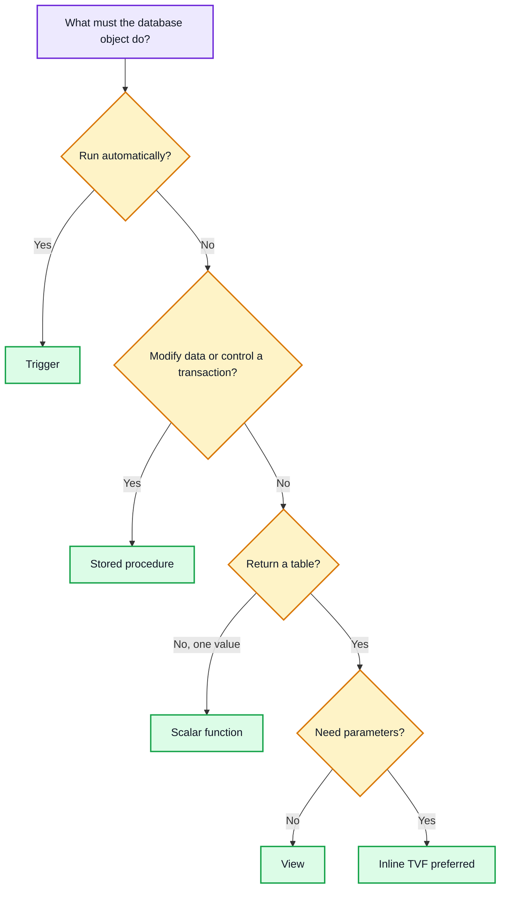
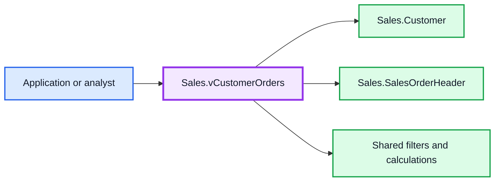
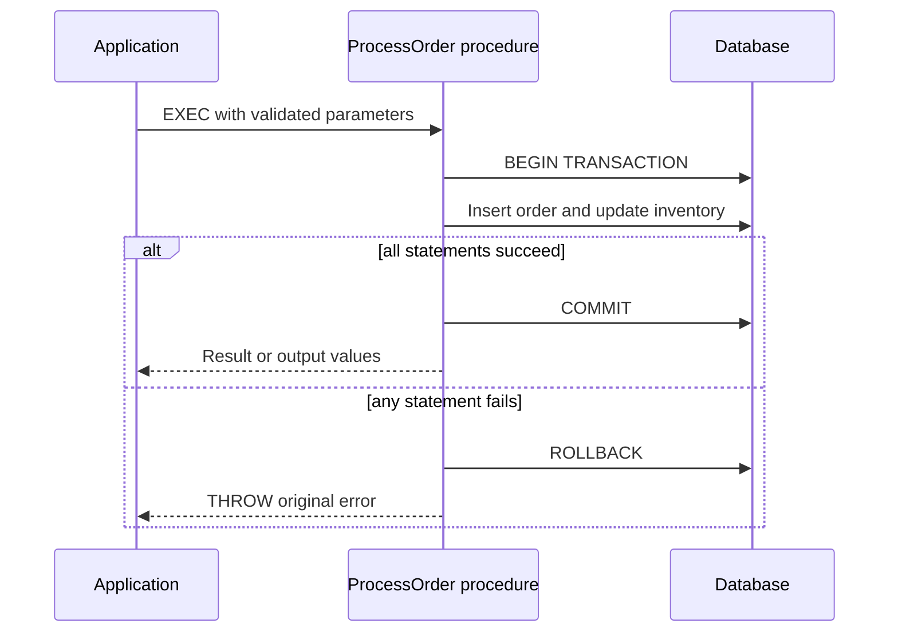
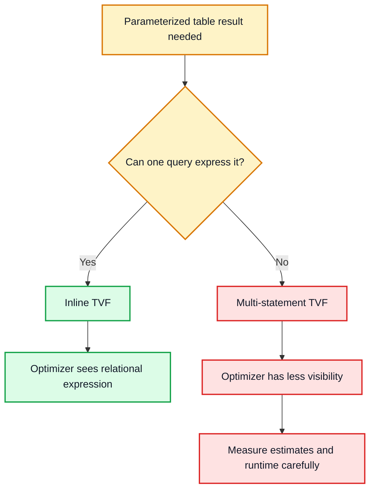
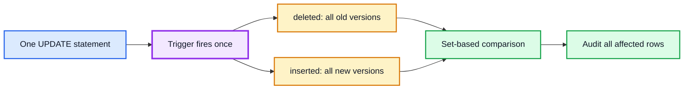
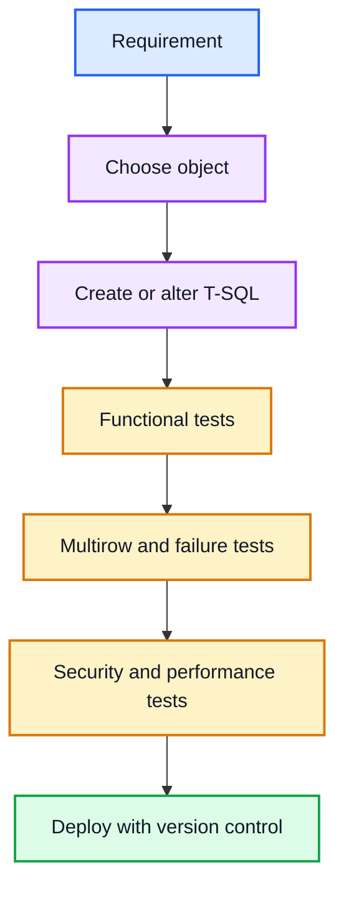
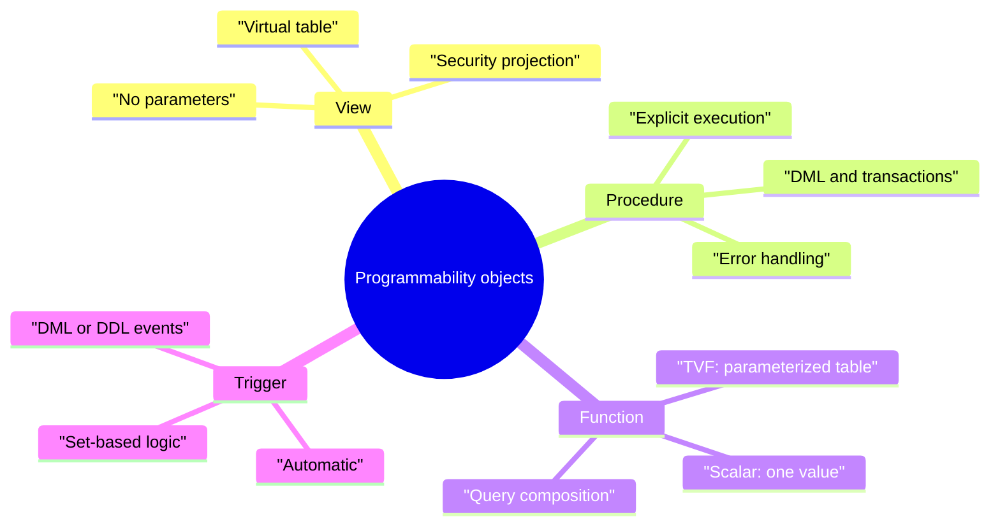

# DP-800 Study Guide: Implement Programmability Objects with SQL

> **Exam:** Microsoft Certified: SQL AI Developer Associate (DP-800)  
> **Module:** Implement programmability objects with SQL  
> **Platforms:** SQL Server, Azure SQL Database, Azure SQL Managed Instance, Microsoft Fabric SQL databases  
> **Level:** Intermediate

---

## How to use this guide

1. Read the **rapid summary** to build the mental map.
2. Study one object at a time: view, stored procedure, scalar UDF, TVF, and trigger.
3. Run the commented examples in a nonproduction database.
4. Complete the integrated AdventureWorksLT lab.
5. Attempt the 60 questions without looking at the answer key.
6. Revisit the comparison table and exam traps before the exam.

> [!IMPORTANT]
> The supplied module is the primary source for this guide. Additional explanations clarify SQL Server behavior where short learning modules commonly simplify details.

---

## Learning objectives

By the end of this chapter, you should be able to:

- Create views that simplify access and form security boundaries.
- Build stored procedures that encapsulate business operations, validation, transactions, and error handling.
- Create scalar functions that return one reusable value.
- Distinguish inline from multi-statement table-valued functions.
- Design set-based triggers that handle multirow changes correctly.
- Select an object from the requirements rather than from personal preference.
- Recognize performance, security, maintainability, and correctness trade-offs.

---

# Part 1 — Rapid summary

## The five objects in one table

| Object | Main purpose | Parameters? | Can modify persistent data? | Usable in `SELECT`/`FROM`? | Runs automatically? |
|---|---|---:|---:|---:|---:|
| View | Reusable, parameterless virtual table | No | Sometimes, with restrictions | Yes | No |
| Stored procedure | Executable operation or workflow | Yes | Yes | Not as a relational expression | No |
| Scalar UDF | Return one calculated value | Yes | No | Yes, as an expression | No |
| Table-valued function | Return a parameterized table | Yes | No | Yes, in `FROM`, `JOIN`, or `APPLY` | No |
| Trigger | React to a database event | No caller parameters | Yes | No | Yes |

## One-sentence decision rule

- Need a **parameterless virtual table**? Use a **view**.
- Need an **explicit command**, data changes, or transaction control? Use a **stored procedure**.
- Need **one value inside a query**? Consider a **scalar function**, but check row-by-row cost.
- Need a **parameterized result set inside a query**? Prefer an **inline TVF**.
- Need code to run **automatically for every relevant event**, regardless of the calling application? Consider a **trigger**.



---

# Part 2 — Views

## What is a view?

A view is a named `SELECT` statement that behaves like a virtual table. A normal view stores its definition, not a separate copy of its result rows. When a query refers to the view, SQL Server incorporates its definition into the query and accesses the underlying objects.

This makes a view a **logical abstraction layer** between consumers and the physical schema.



## Why use views?

### 1. Hide query complexity

A consumer can query one object instead of repeatedly writing the same joins, expressions, and filters.

### 2. Improve consistency

If “active customer” or “large order” has one centralized definition, reports are less likely to disagree.

### 3. Create a security boundary

Grant `SELECT` on a view that exposes approved rows and columns while withholding direct permissions on the base tables. This is effective only when permissions and ownership chaining are configured deliberately; merely creating a view does not secure data.

### 4. Stabilize an interface

Applications can depend on a stable logical shape while the implementation beneath it evolves, provided the view contract is preserved.

## Basic view with commented code

```sql
-- CREATE OR ALTER is deployment-friendly: create the view if absent,
-- otherwise update its definition without a separate DROP operation.
CREATE OR ALTER VIEW Sales.vCustomerOrders
AS
SELECT
    c.CustomerID,                                  -- Stable business key
    c.CustomerName,                                -- Explicitly approved column
    o.OrderID,
    o.OrderDate,
    o.TotalAmount,
    CASE                                           -- Centralized classification rule
        WHEN o.TotalAmount < 100  THEN 'Small'
        WHEN o.TotalAmount < 1000 THEN 'Medium'
        ELSE 'Large'
    END AS OrderSize
FROM Sales.Customers AS c
INNER JOIN Sales.Orders AS o
    ON o.CustomerID = c.CustomerID;
GO

-- Consumers query the view like a table.
SELECT OrderID, CustomerName, OrderSize
FROM Sales.vCustomerOrders
WHERE OrderDate >= '20260101';                     -- Unambiguous ISO date literal
```

## `WITH CHECK OPTION`

A filtered view can sometimes be updated. `WITH CHECK OPTION` prevents an insert or update made **through that view** from creating a row that no longer satisfies the view predicate.

```sql
CREATE OR ALTER VIEW Sales.vHighValueOrders
AS
SELECT OrderID, CustomerID, OrderDate, TotalAmount
FROM Sales.Orders
WHERE TotalAmount > 1000
WITH CHECK OPTION;
GO

-- Rejected: the inserted row would not be visible through the view.
INSERT INTO Sales.vHighValueOrders
    (OrderID, CustomerID, OrderDate, TotalAmount)
VALUES
    (9001, 42, '20260722', 500.00);
```

**Important:** `WITH CHECK OPTION` is not a general table constraint. It governs modifications routed through that view. A base-table `CHECK` constraint is the better universal mechanism for a row-level invariant.

## Updatable views

A simple view based on one table is often updatable. Updates become restricted or impossible when SQL Server cannot map a result row unambiguously to base-table rows—for example, with many aggregates, `DISTINCT`, grouping, set operators, or changes spanning multiple base tables.

An `INSTEAD OF` trigger can define custom modification behavior for some otherwise non-updatable views, but this adds complexity and must be carefully tested.

## Normal view versus indexed view

| Normal view | Indexed view |
|---|---|
| Stores definition only | First unique clustered index materializes view results |
| No independent result storage | Occupies storage |
| No maintenance cost for a stored result | Base-table changes maintain the indexed result |
| Broadly flexible definition | Strict schema-binding and determinism requirements |

Do not assume “view = faster.” A view primarily encapsulates logic. Performance depends on the expanded query, indexes, statistics, predicates, cardinality estimates, and workload. Indexed views are a separate physical optimization with write and storage costs.

## View best practices

- Use schema-qualified names: `Sales.Orders`, not just `Orders`.
- List columns explicitly; avoid `SELECT *` in stable interfaces.
- Give each view one clear responsibility.
- Avoid deep chains of nested views.
- Index base-table join and filter columns when workload evidence supports it.
- Treat the view’s column list as a contract.
- Grant the minimum required permissions.
- Use `WITH SCHEMABINDING` only when its dependency guarantees and restrictions serve a clear purpose.

## When to use a view

Use a view for reusable joins, standardized filters, calculated presentation columns, a stable parameterless interface, or row/column exposure. Do not use it when callers need parameters, procedural branching, cross-table transactions, or automatic event handling.

---

# Part 3 — Stored procedures

## What is a stored procedure?

A stored procedure is a named, explicitly executed T-SQL program. It can accept input parameters, expose output parameters, return one or more result sets, modify data, use transactions, and handle errors.

## Why use stored procedures?

- Centralize business operations close to the data.
- Reduce network round trips by performing several statements in one call.
- Grant `EXECUTE` without granting broad direct table modification rights.
- Validate inputs consistently.
- Make multi-table work atomic with transactions.
- Provide a controlled API for applications.

## Plan caching: the precise version

SQL Server commonly compiles a procedure statement and caches an execution plan for reuse. That can reduce compilation overhead, but “stored procedures are always precompiled and faster” is too absolute:

- Ad hoc parameterized statements can also use cached plans.
- Plans may be evicted or recompiled.
- A cached plan can be unsuitable for later parameter values, often discussed as **parameter sensitivity** or historically **parameter sniffing**.
- Performance still depends on query design, indexes, statistics, cardinality, and runtime values.

## Procedure with parameters and an output value

```sql
CREATE OR ALTER PROCEDURE Sales.GetCustomerOrders
    @CustomerID int,                 -- Required input parameter
    @StartDate  date = NULL,         -- Optional input: NULL means no lower bound
    @EndDate    date = NULL,         -- Optional input: NULL means no upper bound
    @OrderCount int OUTPUT            -- Output parameter for a scalar result
AS
BEGIN
    SET NOCOUNT ON;                  -- Suppress row-count messages to the client

    -- Fail early with a clear validation error.
    IF @CustomerID IS NULL OR @CustomerID <= 0
        THROW 50001, 'CustomerID must be a positive integer.', 1;

    IF @StartDate IS NOT NULL
       AND @EndDate IS NOT NULL
       AND @StartDate > @EndDate
        THROW 50002, 'StartDate cannot be later than EndDate.', 1;

    SELECT
        o.OrderID,
        o.OrderDate,
        o.TotalAmount
    FROM Sales.Orders AS o
    WHERE o.CustomerID = @CustomerID
      AND (@StartDate IS NULL OR o.OrderDate >= @StartDate)
      AND (@EndDate   IS NULL OR o.OrderDate < DATEADD(day, 1, @EndDate))
    ORDER BY o.OrderDate DESC;

    -- Return a value through the declared OUTPUT parameter.
    SELECT @OrderCount = COUNT(*)
    FROM Sales.Orders AS o
    WHERE o.CustomerID = @CustomerID
      AND (@StartDate IS NULL OR o.OrderDate >= @StartDate)
      AND (@EndDate   IS NULL OR o.OrderDate < DATEADD(day, 1, @EndDate));
END;
GO

DECLARE @Count int;

EXEC Sales.GetCustomerOrders
    @CustomerID = 42,
    @StartDate = '20260101',
    @EndDate = '20260630',
    @OrderCount = @Count OUTPUT;      -- OUTPUT is also required at the call site

SELECT @Count AS OrderCount;
```

### Return code versus output parameter versus result set

| Mechanism | Best use |
|---|---|
| Integer `RETURN` code | Status convention, not business data |
| `OUTPUT` parameter | One or a few scalar values |
| `SELECT` result set | Tabular rows and columns |
| `THROW` | Signal an error to the caller |

## Atomic transaction and error handling



```sql
CREATE OR ALTER PROCEDURE Sales.AddOrderLine
    @OrderID  int,
    @ProductID int,
    @Quantity int
AS
BEGIN
    SET NOCOUNT ON;
    SET XACT_ABORT ON;  -- Many runtime errors automatically make the transaction fail

    IF @Quantity <= 0
        THROW 50010, 'Quantity must be greater than zero.', 1;

    BEGIN TRY
        BEGIN TRANSACTION;

        DECLARE @UnitPrice decimal(18,2);

        SELECT @UnitPrice = p.ListPrice
        FROM Sales.Products AS p
        WHERE p.ProductID = @ProductID;

        IF @UnitPrice IS NULL
            THROW 50011, 'Product not found.', 1;

        IF NOT EXISTS
           (SELECT 1 FROM Sales.Orders WHERE OrderID = @OrderID)
            THROW 50012, 'Order not found.', 1;

        INSERT INTO Sales.OrderDetails
            (OrderID, ProductID, Quantity, UnitPrice)
        VALUES
            (@OrderID, @ProductID, @Quantity, @UnitPrice);

        UPDATE Sales.Orders
        SET SubTotal =
            (SELECT SUM(d.Quantity * d.UnitPrice)
             FROM Sales.OrderDetails AS d
             WHERE d.OrderID = @OrderID)
        WHERE OrderID = @OrderID;

        COMMIT TRANSACTION;
    END TRY
    BEGIN CATCH
        -- XACT_STATE() is more informative than @@TRANCOUNT alone.
        IF XACT_STATE() <> 0
            ROLLBACK TRANSACTION;

        THROW;  -- Rethrow the original number, message, state, and line context
    END CATCH;
END;
```

## `THROW` versus `RAISERROR`

For new code, `THROW` is usually clearer and integrates well with `TRY...CATCH`. `THROW;` inside a `CATCH` block preserves the original error. `RAISERROR` remains available for legacy and specialized formatting scenarios, but it has behavioral differences and does not honor `SET XACT_ABORT` in the same way.

## Procedure best practices

- Use `CREATE OR ALTER PROCEDURE` in repeatable deployments where supported.
- Use schema-qualified object names.
- Use meaningful verb-based names, such as `GetCustomerOrders` or `UpdateAddress`.
- Avoid the `sp_` prefix; SQL Server reserves it for system procedure naming conventions and may search `master` first.
- Use `SET NOCOUNT ON`.
- Validate parameters before expensive work.
- Use least-privilege permissions and avoid unsafe dynamic SQL.
- Parameterize dynamic SQL with `sys.sp_executesql`; never concatenate untrusted input.
- Keep transactions as short as correctness permits.
- Use `TRY...CATCH`, `XACT_STATE()`, and `THROW` for robust failure handling.
- Do not assume one cached plan is ideal for every parameter distribution.

---

# Part 4 — Scalar user-defined functions

## What is a scalar UDF?

A scalar user-defined function accepts zero or more parameters and returns exactly one value of a declared data type. It can appear where an expression is valid, such as a `SELECT` list, subject to SQL Server’s function rules.

```sql
CREATE OR ALTER FUNCTION dbo.CalculateSalesTax
(
    @Amount  decimal(18,2),
    @TaxRate decimal(9,6)
)
RETURNS decimal(18,2)
AS
BEGIN
    -- COALESCE gives deliberate NULL behavior; ROUND fixes monetary scale.
    RETURN ROUND(COALESCE(@Amount, 0) * COALESCE(@TaxRate, 0), 2);
END;
GO

SELECT
    OrderID,
    TotalAmount,
    dbo.CalculateSalesTax(TotalAmount, 0.18) AS SalesTax
FROM Sales.Orders;
```

## Deterministic versus nondeterministic

A deterministic function returns the same result for the same inputs and database state under the relevant definition. A function that relies on `GETDATE()` is nondeterministic because time changes even when its explicit parameters do not.

```sql
-- Better for deterministic logic: pass the effective date as an input.
CREATE OR ALTER FUNCTION HR.CompletedYears
(
    @StartDate date,
    @AsOfDate  date
)
RETURNS int
AS
BEGIN
    DECLARE @Years int = DATEDIFF(year, @StartDate, @AsOfDate);

    -- DATEDIFF(year, ...) counts year boundaries, not completed anniversaries.
    IF DATEADD(year, @Years, @StartDate) > @AsOfDate
        SET @Years -= 1;

    RETURN @Years;
END;
```

## Performance intuition

Historically, scalar UDFs could cause iterative, row-by-row evaluation and hide cost from the optimizer. Modern SQL Server versions can inline some eligible scalar UDFs, but not every function or compatibility configuration qualifies. Therefore:

- Inspect the actual execution plan.
- Measure with representative data.
- Avoid wrapping indexed columns in functions inside large-table filters when a sargable predicate is possible.
- Consider an inline expression, computed column, join, or inline TVF when appropriate.

```sql
-- Often less index-friendly because a function transforms every OrderDate.
WHERE YEAR(OrderDate) = 2026

-- Sargable range predicate: an index can seek by date range.
WHERE OrderDate >= '20260101'
  AND OrderDate <  '20270101'
```

## Scalar function rules and best practices

- Return exactly one declared scalar type.
- Keep the logic focused and side-effect free.
- Define intentional `NULL` behavior.
- Prefer deterministic logic when indexing requirements demand it.
- Do not use a scalar UDF merely to make syntax look shorter; evaluate its runtime effect.
- Use `ALTER FUNCTION` or `CREATE OR ALTER FUNCTION` to preserve the object identity during changes.
- Check dependencies before `DROP FUNCTION IF EXISTS`.

---

# Part 5 — Table-valued functions

## What is a TVF?

A table-valued function returns a table and can be referenced in the relational part of a query. Unlike a view, it can accept parameters.

## Inline TVF

An inline TVF contains one relational expression. The optimizer can usually expand that expression into the calling query, which generally produces better estimates and optimization opportunities.

```sql
CREATE OR ALTER FUNCTION Sales.GetCustomerOrders
(
    @CustomerID int,
    @StartDate date,
    @EndDate date
)
RETURNS TABLE
AS
RETURN
(
    SELECT
        o.OrderID,
        o.OrderDate,
        o.TotalAmount
    FROM Sales.Orders AS o
    WHERE o.CustomerID = @CustomerID
      AND o.OrderDate >= @StartDate
      AND o.OrderDate < DATEADD(day, 1, @EndDate)
);
GO

SELECT *
FROM Sales.GetCustomerOrders(42, '20260101', '20260630');
```

## `CROSS APPLY` and `OUTER APPLY`

```sql
-- Evaluate the TVF for each customer and return matching orders only.
SELECT c.CustomerName, o.OrderID, o.TotalAmount
FROM Sales.Customers AS c
CROSS APPLY Sales.GetCustomerOrders
    (c.CustomerID, '20260101', '20261231') AS o;

-- OUTER APPLY also keeps customers for whom the function returns no rows.
SELECT c.CustomerName, o.OrderID, o.TotalAmount
FROM Sales.Customers AS c
OUTER APPLY Sales.GetCustomerOrders
    (c.CustomerID, '20260101', '20261231') AS o;
```

## Multi-statement TVF

A multi-statement TVF declares a table return variable, populates it with multiple statements, and returns it.

```sql
CREATE OR ALTER FUNCTION Sales.GetCustomerOrderSummary
(
    @CustomerID int
)
RETURNS @Summary TABLE
(
    OrderID int PRIMARY KEY,
    OrderDate date,
    TotalAmount decimal(18,2),
    OrderBand varchar(10)
)
AS
BEGIN
    INSERT INTO @Summary (OrderID, OrderDate, TotalAmount, OrderBand)
    SELECT
        o.OrderID,
        o.OrderDate,
        o.TotalAmount,
        CASE
            WHEN o.TotalAmount < 1000 THEN 'Regular'
            ELSE 'Large'
        END
    FROM Sales.Orders AS o
    WHERE o.CustomerID = @CustomerID;

    RETURN;
END;
```

## Inline versus multi-statement TVF

| Feature | Inline TVF | Multi-statement TVF |
|---|---|---|
| Body | One query expression | Multiple statements |
| Return table | Inferred from query | Explicit table variable |
| Optimizer visibility | High; expanded into outer query | More limited; often behaves like a black box |
| Cardinality estimates | Usually better | Can be less accurate |
| Complexity supported | Relational expression | Procedural population logic |
| Default preference | Prefer when requirements fit | Use only when multiple steps are genuinely necessary |



---

# Part 6 — Triggers

## What is a trigger?

A trigger is code that SQL Server invokes automatically in response to an event. It is not called explicitly by an application and does not accept ordinary caller parameters.

## Main trigger families

| Trigger type | Responds to | Typical use |
|---|---|---|
| DML trigger | `INSERT`, `UPDATE`, `DELETE` | Auditing or complex cross-row/cross-table enforcement |
| DDL trigger | `CREATE`, `ALTER`, `DROP`, and related schema events | Governance or schema-change audit |
| Logon trigger | Login/session establishment event | Specialized connection control; use cautiously |

Within DML triggers:

- `AFTER` fires after the statement and relevant constraint checks succeed.
- `INSTEAD OF` replaces the original DML action with custom logic.

## The most important trigger fact: statements can affect many rows

In SQL Server, a DML trigger fires once per statement, not once per row. The logical `inserted` and `deleted` tables may therefore contain zero, one, or many rows.

| Event | `inserted` | `deleted` |
|---|---|---|
| `INSERT` | New rows | Empty |
| `DELETE` | Empty | Old rows |
| `UPDATE` | New row versions | Old row versions |



## Set-based audit trigger

```sql
CREATE TABLE Audit.OrderAmountChange
(
    AuditID   bigint IDENTITY PRIMARY KEY,
    OrderID   int NOT NULL,
    OldAmount decimal(18,2) NULL,
    NewAmount decimal(18,2) NULL,
    ChangedAt datetime2(7) NOT NULL
        CONSTRAINT DF_OrderAmountChange_ChangedAt DEFAULT SYSUTCDATETIME(),
    ChangedBy sysname NOT NULL
        CONSTRAINT DF_OrderAmountChange_ChangedBy DEFAULT ORIGINAL_LOGIN()
);
GO

CREATE OR ALTER TRIGGER Sales.trg_Orders_AuditAmount
ON Sales.Orders
AFTER UPDATE
AS
BEGIN
    SET NOCOUNT ON;

    -- UPDATE(column) means the column appeared in the SET list;
    -- comparing i and d ensures the value actually changed.
    IF UPDATE(TotalAmount)
    BEGIN
        INSERT INTO Audit.OrderAmountChange
            (OrderID, OldAmount, NewAmount)
        SELECT
            i.OrderID,
            d.TotalAmount,
            i.TotalAmount
        FROM inserted AS i
        INNER JOIN deleted AS d
            ON d.OrderID = i.OrderID
        WHERE i.TotalAmount <> d.TotalAmount
           OR (i.TotalAmount IS NULL AND d.TotalAmount IS NOT NULL)
           OR (i.TotalAmount IS NOT NULL AND d.TotalAmount IS NULL);
    END;
END;
```

## Validation trigger

```sql
CREATE OR ALTER TRIGGER Sales.trg_Orders_ValidateDate
ON Sales.Orders
AFTER INSERT, UPDATE
AS
BEGIN
    SET NOCOUNT ON;

    IF EXISTS
       (SELECT 1 FROM inserted WHERE OrderDate > CONVERT(date, SYSUTCDATETIME()))
    BEGIN
        THROW 50020, 'Order date cannot be in the future.', 1;
    END;
END;
```

If an unhandled trigger error occurs, the triggering statement and trigger work normally roll back as part of the same transaction. That power is also a risk: an expensive or incorrect trigger can slow or break every affected write path.

## Prefer constraints when they fit

Use a `CHECK`, `FOREIGN KEY`, `UNIQUE`, `NOT NULL`, or other declarative constraint for rules those mechanisms can express. Constraints are visible to tooling and the optimizer, are easier to understand, and usually communicate intent better. Use triggers for requirements that genuinely need event-driven or cross-row/cross-table logic.

## Trigger risks and best practices

- Write set-based logic for arbitrary row counts.
- Keep the trigger short and predictable.
- Avoid returning result sets to callers.
- Guard against recursion and cascading side effects.
- Index tables used by trigger joins.
- Document why automatic behavior is essential.
- Test multirow insert, update, and delete—not only single-row cases.
- Test transaction rollback and failure behavior.
- Avoid slow remote calls or long-running work inside a trigger.
- Use triggers sparingly because their behavior is implicit.

---

# Part 7 — Choosing the correct object

## Capability matrix

| Requirement | View | Stored procedure | Scalar UDF | Inline TVF | Trigger |
|---|---:|---:|---:|---:|---:|
| Hide a reusable join | ✅ | Possible, but not composable | ❌ | ✅ if parameterized | ❌ |
| Accept parameters | ❌ | ✅ | ✅ | ✅ | ❌ |
| Return one calculated value in `SELECT` | ❌ | Awkward | ✅ | Possible as one-row table | ❌ |
| Return a table usable in `JOIN` | ✅ | ❌ directly | ❌ | ✅ | ❌ |
| Modify several tables | ❌ | ✅ | ❌ | ❌ | ✅ when event-driven |
| Explicit transaction control | ❌ | ✅ | ❌ | ❌ | Participates in caller transaction |
| Automatic event response | ❌ | ❌ | ❌ | ❌ | ✅ |
| Hide selected columns | ✅ | ✅ via result set | ❌ | ✅ | ❌ |

## Scenario mapping

| Scenario | Best starting choice | Why |
|---|---|---|
| Reuse a five-table report join with no parameters | View | Parameterless, composable abstraction |
| Process an order and update inventory atomically | Stored procedure | Multi-statement modification plus transaction control |
| Format a phone number consistently | Scalar UDF | One reusable scalar transformation |
| Return orders for a supplied customer and date range | Inline TVF | Parameterized table usable in queries |
| Audit salary changes regardless of which application made them | Trigger | Automatic response at the data boundary |
| Expose employee names but not national identifiers | View plus permissions | Row/column projection and least privilege |
| Enforce `Quantity > 0` | `CHECK` constraint | Declarative rule is simpler than any programmability object |

## Common exam traps

1. A view does **not** accept parameters; choose an inline TVF for a parameterized relational result.
2. A stored procedure cannot be placed directly in a `FROM` clause.
3. A function should not be chosen for persistent data modification.
4. A DML trigger fires once per statement and must handle multiple rows.
5. `inserted` holds new versions; `deleted` holds old versions during an update.
6. `WITH CHECK OPTION` controls writes through a filtered view; it is not a universal base-table constraint.
7. A normal view does not materialize its rows.
8. Indexed views trade storage and write maintenance for possible read benefits.
9. Inline TVFs usually offer the optimizer better visibility than multi-statement TVFs.
10. A scalar UDF in a large filter can become expensive or non-sargable.
11. `SET NOCOUNT ON` suppresses row-count messages; it does not stop SQL Server from counting or processing rows.
12. `OUTPUT` must appear in both the procedure parameter declaration and the execution call.
13. `THROW;` inside `CATCH` preserves original error information.
14. A trigger is not automatically better than a constraint or stored procedure; automatic execution must be required.

---

# Part 8 — Integrated AdventureWorksLT lab

> [!CAUTION]
> Run data-changing examples only in a disposable practice database. The lab assumes AdventureWorksLT and appropriate `CREATE` permissions.

## Step 1: Verify the sample tables

```sql
SELECT TOP (5) CustomerID, FirstName, LastName
FROM SalesLT.Customer;

SELECT TOP (5) SalesOrderID, OrderDate, CustomerID
FROM SalesLT.SalesOrderHeader;

SELECT TOP (5) ProductID, Name, ListPrice
FROM SalesLT.Product;
```

## Step 2: Create a reusable view

```sql
CREATE OR ALTER VIEW SalesLT.vCustomerOrders
AS
SELECT
    c.CustomerID,
    CONCAT(c.FirstName, ' ', c.LastName) AS CustomerName,
    h.SalesOrderID,
    h.OrderDate,
    h.TotalDue
FROM SalesLT.Customer AS c
INNER JOIN SalesLT.SalesOrderHeader AS h
    ON h.CustomerID = c.CustomerID;
GO

SELECT TOP (5)
    CustomerID, CustomerName, SalesOrderID, OrderDate, TotalDue
FROM SalesLT.vCustomerOrders
ORDER BY OrderDate DESC;
```

## Step 3: Create a robust order-line procedure

The source lab demonstrates a transaction but does not wrap every possible runtime failure in `TRY...CATCH`. This hardened version adds validation, `XACT_ABORT`, rollback protection, and `THROW`.

```sql
CREATE OR ALTER PROCEDURE dbo.AddOrderLineItem
    @SalesOrderID int,
    @ProductID    int,
    @Quantity     int
AS
BEGIN
    SET NOCOUNT ON;
    SET XACT_ABORT ON;

    IF @Quantity <= 0
        THROW 50009, 'Quantity must be greater than zero.', 1;

    BEGIN TRY
        BEGIN TRANSACTION;

        DECLARE @UnitPrice decimal(18,2);

        SELECT @UnitPrice = CAST(p.ListPrice AS decimal(18,2))
        FROM SalesLT.Product AS p
        WHERE p.ProductID = @ProductID;

        IF @UnitPrice IS NULL
            THROW 50010, 'Invalid ProductID specified.', 1;

        IF NOT EXISTS
           (SELECT 1
            FROM SalesLT.SalesOrderHeader
            WHERE SalesOrderID = @SalesOrderID)
            THROW 50011, 'Invalid SalesOrderID specified.', 1;

        INSERT INTO SalesLT.SalesOrderDetail
            (SalesOrderID, OrderQty, ProductID, UnitPrice, UnitPriceDiscount)
        VALUES
            (@SalesOrderID, @Quantity, @ProductID, @UnitPrice, 0);

        UPDATE h
        SET h.SubTotal = x.SumLineTotal,
            h.ModifiedDate = SYSUTCDATETIME()
        FROM SalesLT.SalesOrderHeader AS h
        INNER JOIN
        (
            SELECT SalesOrderID, SUM(LineTotal) AS SumLineTotal
            FROM SalesLT.SalesOrderDetail
            WHERE SalesOrderID = @SalesOrderID
            GROUP BY SalesOrderID
        ) AS x
            ON x.SalesOrderID = h.SalesOrderID;

        COMMIT TRANSACTION;
    END TRY
    BEGIN CATCH
        IF XACT_STATE() <> 0
            ROLLBACK TRANSACTION;
        THROW;
    END CATCH;
END;
GO
```

## Step 4: Create a scalar order-total function

```sql
CREATE OR ALTER FUNCTION dbo.fnOrderTotal
(
    @OrderID int
)
RETURNS decimal(18,2)
AS
BEGIN
    DECLARE @Total decimal(18,2);

    SELECT @Total = SUM(d.LineTotal)
    FROM SalesLT.SalesOrderDetail AS d
    WHERE d.SalesOrderID = @OrderID;

    RETURN COALESCE(@Total, 0.00);
END;
GO

SELECT
    h.SalesOrderID,
    dbo.fnOrderTotal(h.SalesOrderID) AS CalculatedOrderTotal
FROM SalesLT.SalesOrderHeader AS h;
```

**Performance extension:** compare its actual execution plan and elapsed time with a set-based `GROUP BY` query on a large copy of the data.

## Step 5: Create an inline TVF

```sql
CREATE OR ALTER FUNCTION dbo.GetCustomerOrders
(
    @CustomerID int
)
RETURNS TABLE
AS
RETURN
(
    SELECT
        h.SalesOrderID,
        h.OrderDate,
        h.TotalDue
    FROM SalesLT.SalesOrderHeader AS h
    WHERE h.CustomerID = @CustomerID
);
GO

SELECT *
FROM dbo.GetCustomerOrders(29929)
ORDER BY OrderDate DESC;

SELECT
    CONCAT(c.FirstName, ' ', c.LastName) AS CustomerName,
    o.SalesOrderID,
    o.OrderDate,
    o.TotalDue
FROM SalesLT.Customer AS c
CROSS APPLY dbo.GetCustomerOrders(c.CustomerID) AS o
WHERE c.CustomerID = 29929;
```

## Step 6: Create a multirow-safe audit trigger

```sql
IF OBJECT_ID('dbo.OrderAudit', 'U') IS NULL
BEGIN
    CREATE TABLE dbo.OrderAudit
    (
        AuditID   bigint IDENTITY PRIMARY KEY,
        OrderID   int NOT NULL,
        OldTotal  decimal(18,2) NULL,
        NewTotal  decimal(18,2) NULL,
        ChangedAt datetime2(7) NOT NULL
            CONSTRAINT DF_OrderAudit_ChangedAt DEFAULT SYSUTCDATETIME()
    );
END;
GO

CREATE OR ALTER TRIGGER SalesLT.trg_LogOrderTotalChange
ON SalesLT.SalesOrderDetail
AFTER INSERT, UPDATE, DELETE
AS
BEGIN
    SET NOCOUNT ON;

    ;WITH AffectedOrders AS
    (
        SELECT SalesOrderID FROM inserted
        UNION
        SELECT SalesOrderID FROM deleted
    ),
    CurrentTotals AS
    (
        SELECT
            a.SalesOrderID,
            COALESCE(SUM(d.LineTotal), 0.00) AS NewTotal
        FROM AffectedOrders AS a
        LEFT JOIN SalesLT.SalesOrderDetail AS d
            ON d.SalesOrderID = a.SalesOrderID
        GROUP BY a.SalesOrderID
    ),
    InsertedContribution AS
    (
        SELECT SalesOrderID, SUM(LineTotal) AS Amount
        FROM inserted
        GROUP BY SalesOrderID
    ),
    DeletedContribution AS
    (
        SELECT SalesOrderID, SUM(LineTotal) AS Amount
        FROM deleted
        GROUP BY SalesOrderID
    )
    INSERT INTO dbo.OrderAudit (OrderID, OldTotal, NewTotal)
    SELECT
        c.SalesOrderID,
        c.NewTotal
            - COALESCE(ic.Amount, 0.00)
            + COALESCE(dc.Amount, 0.00) AS OldTotal,
        c.NewTotal
    FROM CurrentTotals AS c
    LEFT JOIN InsertedContribution AS ic
        ON ic.SalesOrderID = c.SalesOrderID
    LEFT JOIN DeletedContribution AS dc
        ON dc.SalesOrderID = c.SalesOrderID;
END;
GO
```

## Step 7: Test like an engineer

Test all of these cases:

- One valid row.
- Several rows in one statement.
- Invalid product, order, quantity, and date inputs.
- A customer with zero orders.
- `NULL` function inputs where allowed.
- A transaction that fails after the first data change.
- Audit calculations for insert, update, and delete.
- Security using a low-privilege test user.
- Performance with representative, not tiny, row counts.



---

# Part 9 — Practice questions

## Questions 1–40: Multiple choice

### 1. Which object best exposes selected columns from a reusable five-table join without accepting parameters?

A. Trigger  
B. View  
C. Scalar function  
D. Stored procedure

### 2. Which object is directly usable in a `FROM` clause and can accept parameters?

A. Inline TVF  
B. Stored procedure  
C. DML trigger  
D. Scalar UDF

### 3. Which object is designed for an explicit multi-table modification inside a transaction?

A. View  
B. Inline TVF  
C. Stored procedure  
D. Scalar UDF

### 4. What does `WITH CHECK OPTION` do on a filtered view?

A. Encrypts view data  
B. Materializes the view  
C. Rejects changes through the view that would make affected rows invisible to it  
D. Prevents all updates to base tables

### 5. What does a normal, non-indexed view primarily store?

A. A private copy of every result row  
B. Its query definition  
C. Only statistics  
D. An execution log

### 6. Which statement about `SELECT *` in a production view is most accurate?

A. It guarantees a stable interface  
B. It is required for performance  
C. Explicit columns are safer when base schemas change  
D. It automatically hides sensitive data

### 7. Which statement about stored-procedure plans is correct?

A. Procedures never compile  
B. A cached plan may be reused, recompiled, or evicted  
C. Only procedures can use cached plans  
D. Cached plans are optimal for every parameter value

### 8. What is the main purpose of `SET NOCOUNT ON`?

A. Prevent DML  
B. Suppress row-count messages sent to the client  
C. Disable `COUNT()`  
D. Stop transaction logging

### 9. Where must `OUTPUT` be specified for an output parameter?

A. Only in the procedure declaration  
B. Only in the `EXEC` call  
C. In both the declaration and call  
D. It is never required

### 10. Which error statement inside `CATCH` preserves the original error context most directly?

A. `RETURN -1`  
B. `PRINT ERROR_MESSAGE()`  
C. `THROW;`  
D. `SELECT @@ERROR`

### 11. Why check `XACT_STATE()` in a `CATCH` block?

A. To discover the current schema  
B. To determine transaction state before commit or rollback logic  
C. To count changed rows  
D. To recompile the plan

### 12. Why should user procedures usually avoid the `sp_` prefix?

A. It makes parameters illegal  
B. It is associated with system procedures and can cause unnecessary `master` lookup behavior  
C. It disables transactions  
D. It forces dynamic SQL

### 13. Which object returns exactly one value of a declared type?

A. Scalar UDF  
B. DML trigger  
C. View  
D. DDL trigger

### 14. Why can `WHERE YEAR(OrderDate) = 2026` be worse than a date-range predicate?

A. `YEAR` changes the stored data  
B. It can make an index seek harder by applying a function to the column  
C. SQL Server does not support `YEAR`  
D. It returns multiple result sets

### 15. Which function is nondeterministic because its result changes with time?

A. A function returning `@Price * @Rate`  
B. A function using `GETDATE()`  
C. A function using `ABS(@Value)`  
D. A function concatenating two parameters

### 16. Which design often gives the optimizer the clearest relational expression?

A. Inline TVF  
B. Multi-statement TVF  
C. Recursive trigger  
D. Cursor inside a scalar UDF

### 17. What does a multi-statement TVF return?

A. An output parameter only  
B. A declared table variable populated by its body  
C. A trigger result set  
D. A materialized indexed view

### 18. What is the difference between `CROSS APPLY` and `OUTER APPLY`?

A. `OUTER APPLY` preserves left rows even when the right expression returns none  
B. `CROSS APPLY` always returns all left rows  
C. `OUTER APPLY` modifies data  
D. There is no difference

### 19. A DML trigger in SQL Server fires:

A. Once per affected row  
B. Once per statement  
C. Once per database restart  
D. Only when manually executed

### 20. During an `UPDATE`, what do `inserted` and `deleted` contain?

A. Both contain only new rows  
B. `inserted` has new versions and `deleted` has old versions  
C. `inserted` is empty  
D. `deleted` contains physical log records only

### 21. Which trigger responds to `CREATE TABLE` or `ALTER TABLE` events?

A. DML trigger  
B. DDL trigger  
C. Scalar trigger  
D. TVF trigger

### 22. Which trigger replaces the original DML action?

A. `AFTER`  
B. `INSTEAD OF`  
C. `BEFORE SELECT`  
D. Logon

### 23. Which mechanism should normally enforce `Quantity > 0`?

A. `CHECK` constraint  
B. DDL trigger  
C. View without check option  
D. Scalar UDF in every report

### 24. Why are triggers harder to debug than explicit procedures?

A. Triggers cannot contain SQL  
B. They execute implicitly as side effects of events  
C. They never participate in transactions  
D. They cannot fail

### 25. What should an audit trigger assume about `inserted`?

A. It always has exactly one row  
B. It may have many rows and requires set-based logic  
C. It is a permanent table  
D. It contains old values after insert

### 26. Which choice best returns all orders for a caller-supplied customer inside a join?

A. Parameterized view  
B. Inline TVF  
C. DDL trigger  
D. Output parameter

### 27. Which choice best processes an order, validates stock, inserts details, and updates inventory atomically?

A. Stored procedure  
B. View  
C. Scalar UDF  
D. Indexed view

### 28. Which choice best logs all salary changes regardless of the modifying application?

A. View  
B. Scalar UDF  
C. DML trigger  
D. Inline TVF

### 29. Which statement about permissions is correct?

A. Creating a view automatically revokes base-table permissions  
B. A view can support least privilege when grants and ownership are configured correctly  
C. Every view exposes every column  
D. Procedures cannot form a security boundary

### 30. Which change is safest for a stable view contract?

A. Use `SELECT *` so new columns automatically appear  
B. Explicitly list and deliberately version exposed columns  
C. Nest the view through ten other views  
D. Grant all users direct table access

### 31. What does an indexed view introduce?

A. No storage or write cost  
B. Physical storage and maintenance during base-table changes  
C. Parameters  
D. Automatic trigger execution

### 32. A stored procedure must return tabular data. Which mechanism is natural?

A. A `SELECT` result set  
B. `WITH CHECK OPTION`  
C. `inserted` table  
D. `RETURNS TABLE`

### 33. A procedure must return a status convention and a calculated scalar. What is a good design?

A. Integer `RETURN` for status and `OUTPUT` for the scalar  
B. One trigger for both  
C. A view with two parameters  
D. A DDL event

### 34. What is a major risk of concatenating untrusted input into dynamic SQL?

A. Indexed view creation  
B. SQL injection  
C. Automatic schema binding  
D. Determinism

### 35. Which approach reduces that dynamic-SQL risk?

A. Add more string concatenation  
B. Parameterize with `sys.sp_executesql` and validate identifiers separately  
C. Rename procedure with `sp_`  
D. Use `SELECT *`

### 36. Which statement about scalar-UDF performance is most accurate?

A. Every scalar UDF is always inlined  
B. Scalar UDFs can incur per-row cost; eligible modern UDFs may be inlined, so measure actual behavior  
C. Scalar UDFs always outperform joins  
D. Functions can freely modify tables

### 37. Why keep transactions short?

A. To increase lock duration  
B. To reduce contention and the time resources remain held  
C. To disable atomicity  
D. To stop all plan caching

### 38. What happens when an unhandled error occurs inside a DML trigger?

A. The original statement always commits  
B. The trigger and triggering statement generally roll back together  
C. Only the `inserted` table persists  
D. SQL Server ignores the error

### 39. Which object cannot accept ordinary caller parameters?

A. Trigger  
B. Stored procedure  
C. Scalar UDF  
D. Inline TVF

### 40. Which object should be the default when one query can express a parameterized result table?

A. Multi-statement TVF  
B. Inline TVF  
C. Logon trigger  
D. Scalar stored procedure

## Questions 41–50: True or false

41. A normal view always stores a physical copy of its rows.  
42. `WITH CHECK OPTION` prevents every direct base-table modification that violates the view predicate.  
43. A stored procedure can return multiple result sets.  
44. Ad hoc SQL can also have a cached execution plan.  
45. A scalar UDF can be used as an expression in a `SELECT` list.  
46. A view is the correct object when a result set must accept a customer ID parameter.  
47. A trigger written for one row is automatically safe for a 10,000-row update.  
48. On an update, joining `inserted` to `deleted` by the key can compare new and old values.  
49. An inline TVF is normally more optimizer-friendly than a multi-statement TVF.  
50. A declarative constraint is usually preferable when it fully expresses the rule.

## Questions 51–60: Scenario and code analysis

### 51. Correct the object choice

A developer wants a reusable result set filtered by `@RegionID` and proposes a view. Which object should replace it, and why?

### 52. Find the trigger bug

```sql
CREATE TRIGGER Sales.trg_Audit
ON Sales.Orders
AFTER UPDATE
AS
BEGIN
    DECLARE @OrderID int = (SELECT OrderID FROM inserted);
    INSERT Audit.Log(OrderID) VALUES (@OrderID);
END;
```

Why can this fail, and what design principle fixes it?

### 53. Improve the predicate

Rewrite this filter to make it more index-friendly for calendar year 2026:

```sql
WHERE YEAR(OrderDate) = 2026
```

### 54. Choose the simplest enforcement mechanism

Every row in `OrderDetail` must have `Quantity >= 1`. Should you use a stored procedure, scalar function, trigger, or something else?

### 55. Explain rollback behavior

A procedure begins a transaction, inserts an order header, and then the detail insert fails. What structure ensures the header does not remain committed?

### 56. Diagnose a view misconception

A team creates a normal view over an expensive join and expects the result to be stored and refreshed nightly. What misconception do they have?

### 57. Choose between TVF types

One `SELECT` can return the required parameterized customer orders. Should you begin with an inline or multi-statement TVF, and why?

### 58. Secure data exposure

Analysts need employee name and department but must not access salary or national ID. Describe a suitable view-and-permission design.

### 59. Interpret pseudotables

An update changes `TotalAmount` for 300 orders in one statement. How many times does the trigger fire, and where are the old and new values?

### 60. Object-selection synthesis

Choose the best primary object for each requirement:

1. A reusable parameterless sales join.
2. A parameterized order table usable with `APPLY`.
3. An explicitly invoked, atomic checkout workflow.
4. One reusable tax calculation in a query.
5. Automatic audit logging for every update path.

---

# Part 10 — Answers and rationales

## Answers 1–40

1. **B — View.** It encapsulates a parameterless relational query and can expose only selected columns.
2. **A — Inline TVF.** It accepts parameters and returns a relation usable in `FROM`.
3. **C — Stored procedure.** Procedures support explicit execution, DML, transactions, and error handling.
4. **C.** It prevents modifications through the view from producing rows outside the view predicate.
5. **B.** A normal view stores metadata and its query definition, not a separate result copy.
6. **C.** Explicit columns keep the interface deliberate and avoid accidental exposure or shape changes.
7. **B.** Plan reuse is common but conditional; plans can be recompiled or removed.
8. **B.** It suppresses “N rows affected” messages, reducing unnecessary client traffic.
9. **C.** `OUTPUT` belongs in both the parameter definition and the `EXEC` binding.
10. **C.** A parameterless `THROW;` inside `CATCH` rethrows the original error.
11. **B.** `XACT_STATE()` distinguishes no transaction, committable transaction, and uncommittable transaction.
12. **B.** `sp_` follows system-procedure conventions and can trigger lookup in `master`.
13. **A.** A scalar UDF has one declared scalar return value.
14. **B.** Transforming an indexed column can make the predicate non-sargable; a range is usually more seekable.
15. **B.** `GETDATE()` changes as time advances.
16. **A.** An inline TVF exposes its single relational expression to optimization.
17. **B.** A multi-statement TVF fills a declared table return variable.
18. **A.** `OUTER APPLY` behaves like a left-preserving apply; `CROSS APPLY` removes left rows with no right result.
19. **B.** SQL Server DML triggers fire once for each triggering statement.
20. **B.** The two logical tables represent after and before versions, respectively.
21. **B.** DDL triggers respond to schema-definition events.
22. **B.** `INSTEAD OF` substitutes custom code for the original action.
23. **A.** A `CHECK` constraint is the clearest declarative row rule.
24. **B.** Trigger behavior is implicit and may be missed when tracing a write path.
25. **B.** One statement may affect any number of rows, so logic must be set-based.
26. **B.** An inline TVF is a parameterized relational object and composes with queries.
27. **A.** The requirement is an explicit multi-statement transaction.
28. **C.** A trigger sees modifications regardless of which application performs them.
29. **B.** Views and permissions can implement least privilege, but security is not automatic.
30. **B.** Deliberate column projection protects the public contract.
31. **B.** Materialized indexed results require storage and maintenance on writes.
32. **A.** A procedure naturally emits tabular rows through `SELECT`.
33. **A.** Use the integer return code for status and an output parameter for scalar data.
34. **B.** Untrusted concatenation can change command structure and produce SQL injection.
35. **B.** Data values should be bound as parameters; dynamic identifiers require allow-list validation and safe quoting.
36. **B.** Inlining can help eligible functions, but it is not universal; execution plans and measurements decide.
37. **B.** Short transactions reduce locking, blocking, and other resource retention.
38. **B.** Trigger work participates in the transaction of the triggering statement.
39. **A.** A trigger receives event context through logical tables and metadata, not caller parameters.
40. **B.** Prefer the simpler, optimizer-visible inline form when one relational expression is sufficient.

## Answers 41–50

41. **False.** That describes materialization, not a normal view.  
42. **False.** It governs modifications through that view, not every possible base-table write.  
43. **True.** Multiple `SELECT` statements can emit multiple result sets.  
44. **True.** Plan caching is not exclusive to stored procedures.  
45. **True.** A scalar function can be invoked as an expression.  
46. **False.** A view has no caller parameters; use an inline TVF when composition is needed.  
47. **False.** A trigger must explicitly use set-based multirow logic.  
48. **True.** Join by a stable key to compare before and after values.  
49. **True, generally.** The optimizer can expand an inline TVF into the surrounding query.  
50. **True.** Constraints are explicit and designed for declarative integrity rules.

## Answers 51–60

### 51.

Use an **inline table-valued function**. A view cannot accept `@RegionID`, whereas an inline TVF can accept it and remain usable in `FROM`, `JOIN`, or `APPLY`.

### 52.

The scalar subquery assumes `inserted` contains one row. A multirow update makes it return more than one value and can raise an error. Insert directly from `inserted`:

```sql
INSERT Audit.Log (OrderID)
SELECT i.OrderID
FROM inserted AS i;
```

### 53.

```sql
WHERE OrderDate >= '20260101'
  AND OrderDate <  '20270101'
```

The half-open range includes all 2026 date/time values and avoids transforming the indexed column.

### 54.

Use a `CHECK (Quantity >= 1)` constraint. It is simpler, declarative, and applies regardless of the write path.

### 55.

Use `BEGIN TRY`, `BEGIN TRANSACTION`, both inserts, `COMMIT`, and a `CATCH` block that checks transaction state, rolls back, and rethrows. `SET XACT_ABORT ON` is also commonly used for safer runtime-error behavior.

### 56.

A normal view stores the query definition, not a nightly materialized result. They need to evaluate an indexed view if its restrictions fit, a reporting table maintained by an ETL/ELT process, caching, or another materialization strategy.

### 57.

Begin with an **inline TVF**. It is simpler and normally gives the optimizer better visibility and cardinality information than a multi-statement TVF.

### 58.

Create a view that explicitly selects only employee name and department. Deny or omit direct base-table access for the analyst role, and grant `SELECT` on the view. Verify ownership chaining and test with the actual low-privilege role.

### 59.

The trigger fires **once** for the update statement. `deleted` contains 300 old versions and `inserted` contains 300 new versions. Set-based logic should join them using the order key.

### 60.

1. **View**  
2. **Inline TVF**  
3. **Stored procedure**  
4. **Scalar UDF**, after considering set-based alternatives and performance  
5. **DML trigger**

---

# Part 11 — Final revision sheet

## Memorize these contrasts

| Contrast | Key distinction |
|---|---|
| View vs inline TVF | Both return relations; only the TVF accepts parameters |
| Procedure vs function | Procedure is an executable operation; function composes inside a query and cannot perform ordinary persistent DML |
| Scalar UDF vs TVF | One value versus a table |
| Inline vs multi-statement TVF | One optimizer-visible expression versus a separately populated table return variable |
| Procedure vs trigger | Explicit call versus automatic event response |
| `AFTER` vs `INSTEAD OF` trigger | Runs after successful action versus substitutes for the action |
| `inserted` vs `deleted` | New versions versus old versions |
| Constraint vs trigger | Declarative integrity rule versus event-driven procedural logic |
| Normal vs indexed view | Definition only versus physically indexed result with maintenance cost |

## Five-second object selection



## Final self-assessment

You are ready for this module when you can answer **yes** to each statement:

- I can explain why a normal view is not automatically a performance optimization.
- I can use `WITH CHECK OPTION` without confusing it with a table constraint.
- I can write a parameterized procedure with validation, output parameters, transactions, and error handling.
- I understand plan caching without assuming every cached plan is ideal.
- I can explain determinism and sargability in relation to functions.
- I can choose an inline TVF over a view when parameters are required.
- I can explain why multi-statement TVFs need special performance attention.
- I can write a trigger that handles an arbitrary number of rows.
- I know what `inserted` and `deleted` contain for insert, update, and delete.
- I can choose constraints over triggers when declarative enforcement is sufficient.
- I can select the right object from a short business scenario in under 30 seconds.

---

## Fun facts and useful insights

- A view is closer to a saved query contract than to a saved result set.
- “Stored” in stored procedure refers to the program being stored in the database—not a guarantee that one execution plan is permanently precompiled.
- `DATEDIFF(year, start, end)` counts crossed year boundaries; it does not automatically calculate completed anniversaries.
- A single `UPDATE` can affect millions of rows while invoking a DML trigger only once.
- `inserted` and `deleted` are logical tables; treating them like scalar variables is one of the most common trigger bugs.
- `OUTER APPLY` is especially useful when the left row must survive even if the parameterized right-side expression returns nothing.
- The best database object is often the least powerful object that cleanly satisfies the requirement: constraint before trigger, inline TVF before multi-statement TVF, and a focused view before a procedural layer.

---

**End of study guide**
