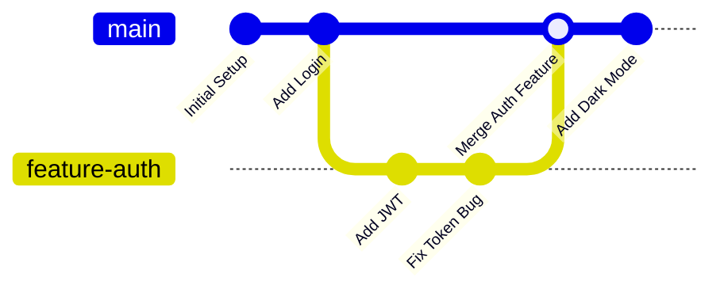
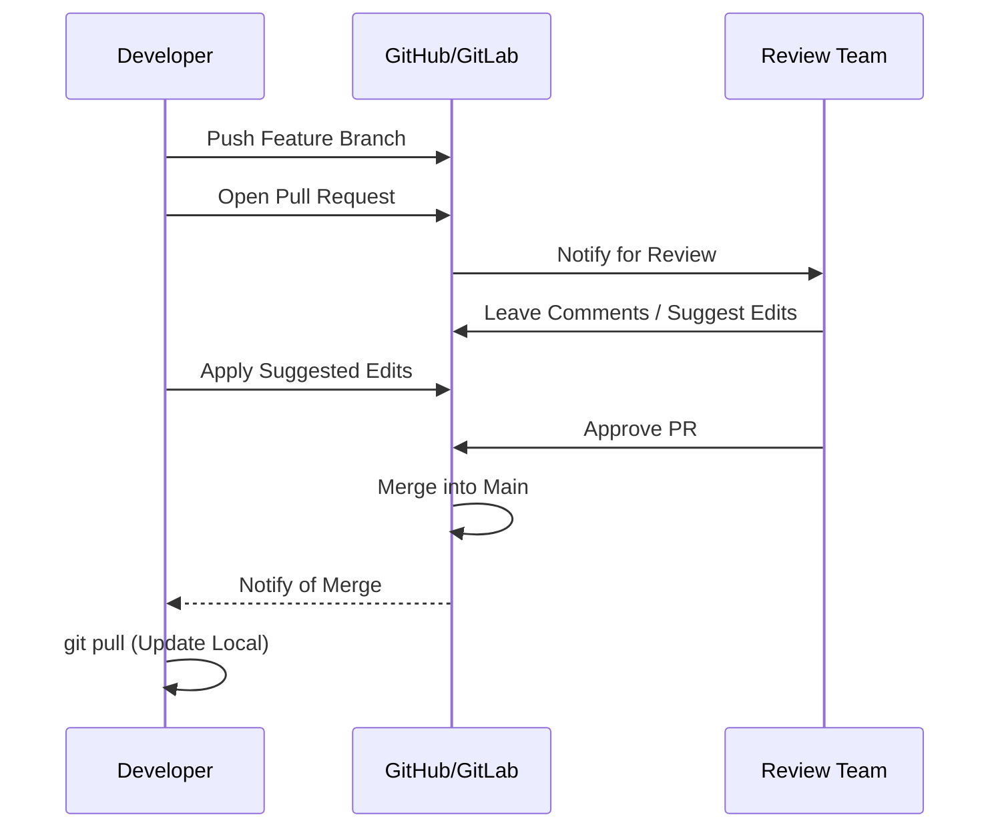
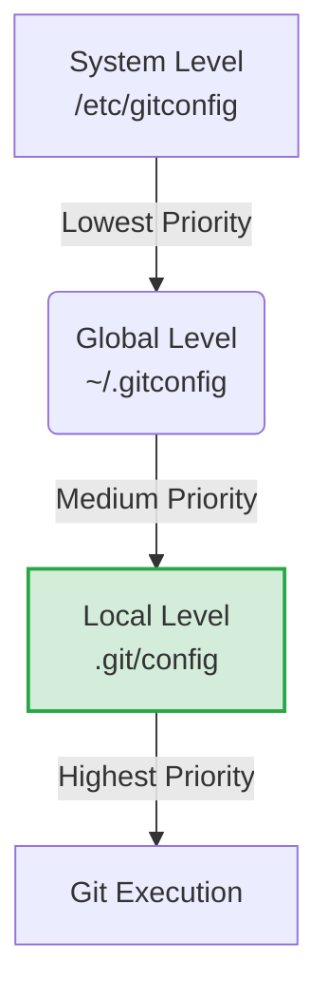
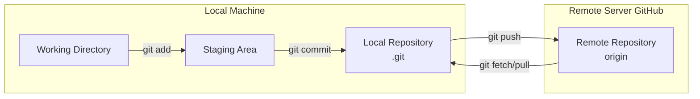
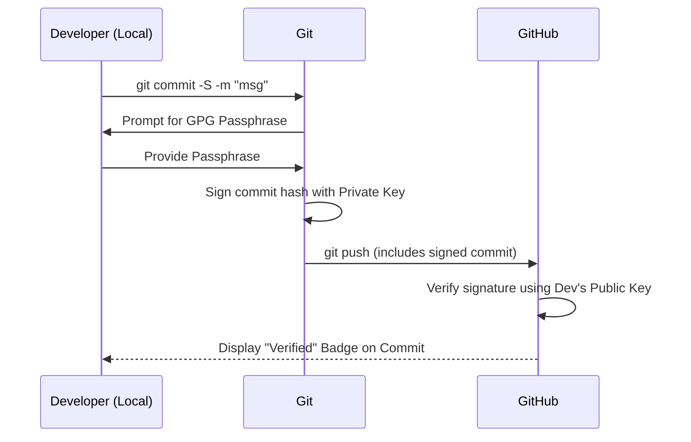
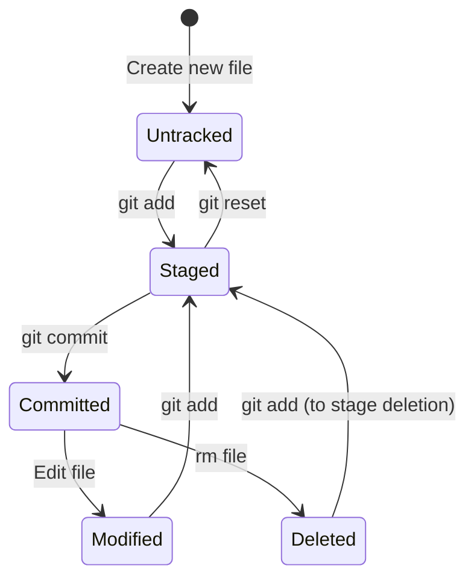
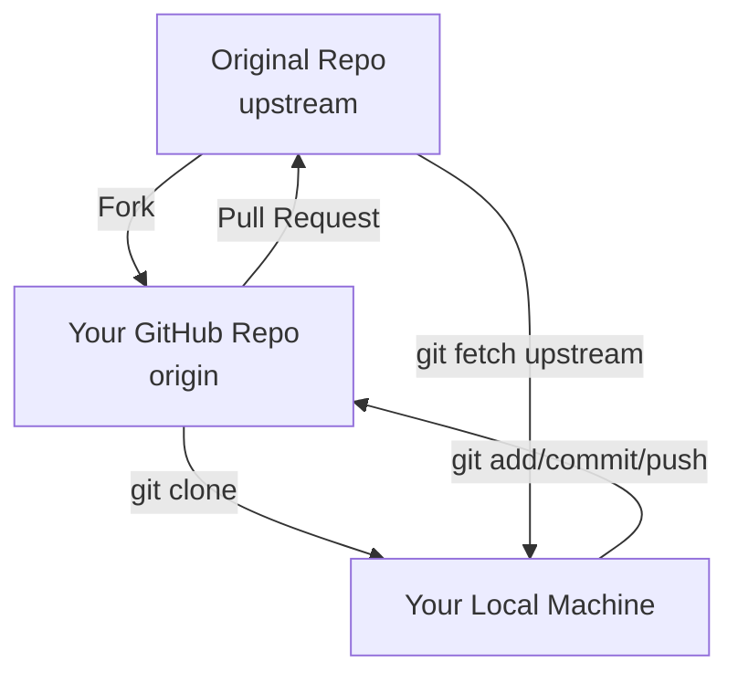
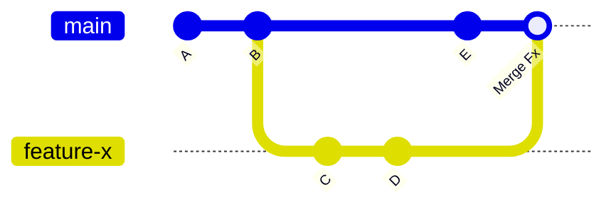
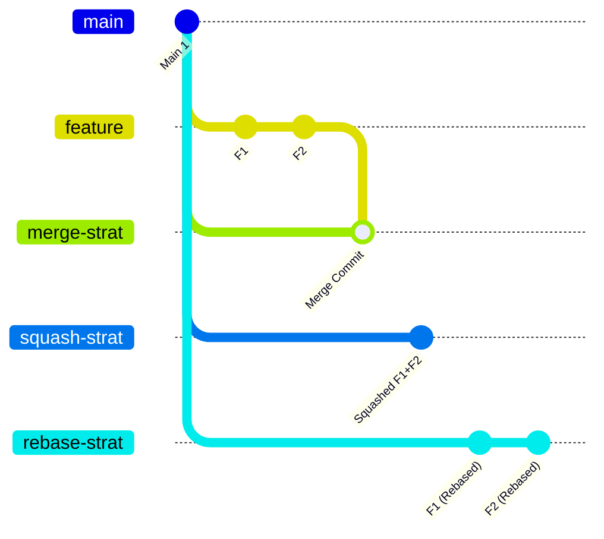

# 🚀 Ultimate Git & Version Control Mastery Guide

> **A comprehensive, interview-ready guide to Version Control, Git, GitHub, and collaborative workflows.**  
> *Designed with deep intuitions, visual Mermaid diagrams, and targeted interview questions to surpass standard learning materials.*

---

## 📚 Table of Contents

1. [What Is Version Control?](#1-what-is-version-control)
2. [The Purpose of GitHub & GitLab](#2-the-purpose-of-github--gitlab)
3. [Installing & Configuring Git](#3-installing--configuring-git)
4. [Understanding Repositories](#4-understanding-repositories)
5. [Security: SSH & GPG Keys](#5-security-ssh--gpg-keys)
6. [Pushing Local Repositories to GitHub](#6-pushing-local-repositories-to-github)
7. [Contributing to Others' Repositories (Forking)](#7-contributing-to-others-repositories-forking)
8. [Branching Strategies](#8-branching-strategies)
9. [Pull Requests & Merge Strategies](#9-pull-requests--merge-strategies)
10. [🔥 Bonus: Advanced Interview Cheat Sheet](#10-bonus-advanced-interview-cheat-sheet)

---

## 1. What Is Version Control?

### 📖 Concept Overview
Version Control Systems (VCS) like **Git**, **SVN**, and **Mercurial** track and manage changes to your codebase over time. Instead of saving files as `Thesis-Final`, `Thesis-Final-For-Real`, Git allows you to create **commits** (snapshots of your codebase) and **branches** (isolated pathways for development). This prevents developers from overwriting each other's work and enables safe experimentation.

### 💡 Intuition
Think of Git as a **video game save system combined with a multiverse**. 
- A **Commit** is a "Save Game" checkpoint. 
- The **Main Branch** is the primary timeline. 
- A **Feature Branch** is a parallel universe where you can fight a boss (build a feature). If you die (the feature fails), you just delete that universe. If you win, you merge that universe back into the main timeline.

### 📊 Mermaid Diagram: The Git Multiverse

### 📝 Original Questions
1. **What is a commit in Git?**  
   ✅ *A snapshot of a specific state of your codebase.*
2. **Why are branches useful in version control systems like Git?**  
   ✅ *They allow you to work on features in isolation.*
3. **Which of the following is NOT mentioned as a version control system in the lesson?**  
   ✅ *Docker* (Docker is a containerization platform, not a VCS).

### 🔥 Interview-Specific Questions
- **Q: What is the difference between a Centralized VCS (like SVN) and a Distributed VCS (like Git)?**  
  **A:** In a Centralized VCS, there is a single central server containing all versioned files, and clients check out files from it. If the server goes down, collaboration stops. In a Distributed VCS (Git), every developer has a full copy of the repository, including its entire history, on their local machine. This allows offline work, faster operations, and better redundancy.
- **Q: What exactly is stored inside a Git commit object?**  
  **A:** A commit object stores: 1) A snapshot of the project's directory tree (via tree objects), 2) The author and committer name/email with timestamps, 3) A commit message, and 4) The SHA-1 hash of the parent commit(s).

---

## 2. The Purpose of GitHub & GitLab

### 📖 Concept Overview
**GitHub** and **GitLab** are cloud-based *Version Control Providers*. They host remote Git repositories and layer powerful collaboration tools on top, such as code reviews, issue trackers, project boards, and CI/CD pipelines. Projects can be **open-source** (publicly visible and contributable) or **closed-source** (private, restricted to authorized users).

### 💡 Intuition
If Git is the engine, GitHub/GitLab is the **entire car**. Git just tracks changes locally; GitHub provides the "digital office" where teams review code, track bugs (issues), and plan sprints (project boards) without needing to email zip files or screen-share.

### 📊 Mermaid Diagram: The Collaboration Loop

### 📝 Original Questions
1. **What is the main purpose of GitHub and GitLab as discussed in the lesson?**  
   ✅ *Version control providers with collaboration features.*
2. **What is an advantage of using GitHub or GitLab for team collaboration?**  
   ✅ *Team members can propose changes that others can review online.*
3. **Which of the following project management features do GitHub and GitLab offer?**  
   ✅ *Issue trackers and project boards.*

### 🔥 Interview-Specific Questions
- **Q: Explain the difference between Git, GitHub, and GitLab.**  
  **A:** **Git** is the underlying open-source version control tool installed locally. **GitHub** is a proprietary cloud platform (owned by Microsoft) that hosts Git repositories and adds collaboration features. **GitLab** is a similar platform but is well-known for its robust, built-in DevOps and CI/CD capabilities, and it offers a fully self-hosted open-core version.
- **Q: Why is a `.gitignore` file critical in a team environment?**  
  **A:** It prevents unnecessary, sensitive, or machine-specific files (like `node_modules`, `.env` files with API keys, or OS files like `.DS_Store`) from being committed to the repository. This keeps the repo clean, secure, and fast to clone.

---

## 3. Installing & Configuring Git

### 📖 Concept Overview
Before using Git, it must be installed (`git --version`) and configured. Configuration is done via `git config`, which sets variables dictating how Git operates. The `--global` flag applies settings to all projects for the current user, while omitting it applies settings only to the current repository.

### 💡 Intuition
Configuring Git is like **getting your ID badge and preferred tools** before entering a secure corporate building. The `user.name` and `user.email` are your ID badge (proving who made a change), and the `core.editor` is your preferred workstation setup.

### 📊 Mermaid Diagram: Git Config Hierarchy

### 📝 Original Questions
1. **What does the following command do? `git config --list --show-origin`**  
   ✅ *Shows your current setting variables and where they are stored on your system.*
2. **What is the purpose of using the `--global` flag when configuring your user name?**  
   ✅ *The `--global` flag is used to set the user name for all projects on your system that use Git.*
3. **Which of the following is NOT a valid option mentioned for setting your preferred editor in Git?**  
   ✅ *ESLint* (ESLint is a code linter, not a text editor).

### 🔥 Interview-Specific Questions
- **Q: If you set a config value globally, but then set a different value locally in a repo, which one takes precedence and why?**  
  **A:** The local config takes precedence. Git reads configurations in a specific order: local repository (`.git/config`) overrides global (`~/.gitconfig`), which overrides system (`/etc/gitconfig`). This allows project-specific overrides (e.g., using a work email for a work repo).
- **Q: How do you undo a global Git configuration?**  
  **A:** By using the `--unset` flag: `git config --global --unset user.name`.

---

## 4. Understanding Repositories

### 📖 Concept Overview
A **repository (repo)** is a container for a project and its entire version history. It can be **local** (on your machine) or **remote** (on GitHub/GitLab). You can create a repo via the web UI, GitHub CLI (`gh repo create`), or locally and push it. Cloning (`git clone`) downloads a remote repo to your local machine, automatically setting up a remote connection named `origin`.

### 💡 Intuition
A repository is a **smart, time-traveling filing cabinet**. Unlike a normal folder, it doesn't just hold the current files; it holds a hidden ledger (the `.git` directory) that records every change, who made it, and when.

### 📊 Mermaid Diagram: Local vs. Remote Relationship

### 📝 Original Questions
1. **What does a repository primarily function as in Git?**  
   ✅ *A container for a project and its files.*
2. **When creating a repository on GitHub, which of the following is NOT an automatic file generation option?**  
   ✅ *A package.json file.* (This is generated by package managers like npm, not Git).
3. **Which of the following Git commands is used to clone a remote repository to your local computer?**  
   ✅ *git clone*

### 🔥 Interview-Specific Questions
- **Q: What happens under the hood when you run `git init`?**  
  **A:** It creates a new `.git` subdirectory in the current folder. This directory contains all the necessary metadata, object database (commits, trees, blobs), and references (heads/branches) required to track the project.
- **Q: What is the difference between `git clone` and `git fork`?**  
  **A:** `git clone` is a local command that downloads a copy of a repository to your machine. `git fork` is a server-side action (on GitHub/GitLab) that creates a personal, independent copy of someone else's repository under your own account, enabling you to propose changes via Pull Requests.

---

## 5. Security: SSH & GPG Keys

### 📖 Concept Overview
Both **SSH** and **GPG** use public-private key cryptography. 
- **SSH (Secure Shell)** is used for *authentication* (proving you are you to push/pull code securely without passwords).
- **GPG (GNU Privacy Guard)** is used for *signing* commits (proving that a specific commit was authored by you and hasn't been tampered with).

### 💡 Intuition
- **SSH** is your **keycard** to enter the office building (authenticates your connection).
- **GPG** is your **wax seal** on a physical letter. Anyone can read the letter (public key verifies it), but only you could have sealed it (private key signs it), proving it wasn't altered in transit.

### 📊 Mermaid Diagram: GPG Commit Signing Flow

### 📝 Original Questions
1. **What is the fundamental difference between private and public keys in SSH and GPG key pairs?**  
   ✅ *The private key stays on your local machine while the public key is shared.*
2. **Which command would you use to enable automatic signing of all commits with your GPG key?**  
   ✅ *git config --global commit.gpgsign true*
3. **What's required to set up SSH key signing for Git commits on GitHub?**  
   ✅ *Set the signing format to SSH and configure your signing key path.*

### 🔥 Interview-Specific Questions
- **Q: Why did GitHub deprecate password authentication for HTTPS Git operations in favor of Personal Access Tokens (PATs) or SSH?**  
  **A:** Passwords are susceptible to brute-force attacks, phishing, and credential stuffing. SSH keys and PATs are cryptographically stronger, can be scoped to specific permissions, and can be easily revoked without changing your main account password.
- **Q: If you lose your private SSH key, what are the security implications and how do you recover?**  
  **A:** Anyone who obtains your private key can impersonate you and push malicious code to your repositories. Recovery involves: 1) Immediately deleting the compromised public key from GitHub/GitLab, 2) Generating a new key pair, 3) Updating the new public key on the server, and 4) Updating local Git config to point to the new key.

---

## 6. Pushing Local Repositories to GitHub

### 📖 Concept Overview
To push an existing local project to GitHub:
1. `git init` (creates the `.git` folder).
2. `git status` (checks file states: Untracked, Modified, Ignored, Deleted, Renamed).
3. `git add <file>` or `git add .` (moves files to the **Staging Area**).
4. `git commit -m "message"` (snapshots the staged files).
5. `git remote add origin <url>` (links local to remote).
6. `git push -u origin main` (uploads changes and sets upstream tracking).

### 💡 Intuition
Think of the **Staging Area** as a **loading dock**. You don't just throw everything onto the truck. You carefully select which boxes (files) to load onto the dock (`git add`). Once the dock is perfectly packed, you seal the truck and send it off (`git commit`).

### 📊 Mermaid Diagram: Git File Lifecycle

### 📝 Original Questions
1. **What command would you use to initialize a Git repository in an existing local directory?**  
   ✅ *git init*
2. **What does the `git commit -m` command do?**  
   ✅ *It commits your changes with a short message you provide.*
3. **Which of the following commands is used to push up changes to remote repository?**  
   ✅ *git push*

### 🔥 Interview-Specific Questions
- **Q: Explain the difference between the Working Directory, Staging Area, and Local Repository.**  
  **A:** The **Working Directory** is your actual project folder where you edit files. The **Staging Area** (or Index) is a hidden file (`.git/index`) that holds a list of changes that will be included in the next commit. The **Local Repository** (`.git/`) is the database where committed snapshots are permanently stored.
- **Q: What does the `-u` (or `--set-upstream`) flag do in `git push -u origin main`?**  
  **A:** It links your local branch to the specified remote branch. After running this once, Git remembers the relationship, allowing you to simply type `git push` or `git pull` in the future without specifying the remote and branch names.

---

## 7. Contributing to Others' Repositories (Forking)

### 📖 Concept Overview
When you lack write access to a repository, you **fork** it (create a server-side copy under your account). You then clone your fork, make changes, and push them. To keep your fork updated with the original project, you add the original repo as an `upstream` remote and fetch/merge its changes.

### 💡 Intuition
Forking is like **getting a photocopy of a library book** to write your own notes in. The `upstream` remote is like checking the library's catalog to see if the author released a new edition, so you can update your photocopy with the new pages.

### 📊 Mermaid Diagram: The Forking Workflow

### 📝 Original Questions
1. **Why do you need to fork a repository when contributing to someone else's project?**  
   ✅ *Because you generally don't have write access to someone else's repository.*
2. **After forking and cloning a repository, what command would you use to add the original repository as a remote?**  
   ✅ *git remote add upstream [URL]*
3. **What is the conventional name for the remote that points to the original repository you forked from?**  
   ✅ *upstream*

### 🔥 Interview-Specific Questions
- **Q: How do you sync a forked repository with the original upstream repository?**  
  **A:** 
  1. `git fetch upstream` (downloads new commits from the original repo).
  2. `git checkout main` (switch to your local main branch).
  3. `git merge upstream/main` (integrates the upstream changes into your local main).
  4. `git push origin main` (updates your GitHub fork with the synced changes).
- **Q: What is the difference between `origin` and `upstream`?**  
  **A:** `origin` is the default name Git gives to the remote repository you cloned *from* (usually your personal fork). `upstream` is a conventionally named remote pointing to the *original* repository you forked from, used to pull in the latest community changes.

---

## 8. Branching Strategies

### 📖 Concept Overview
Branches allow isolated development. The default branch is usually `main`. You can create a new branch (`git branch <name>`), switch to it (`git checkout <name>` or `git switch <name>`), or do both at once (`git checkout -b <name>`). Changes made here do not affect `main` until merged.

### 💡 Intuition
A branch is a **parallel timeline**. You can experiment wildly (refactor the whole codebase, try a new library). If it fails, you collapse the timeline (`git branch -D`). If it succeeds, you merge it into the primary timeline (`main`), and it becomes the new reality.

### 📊 Mermaid Diagram: Branch Creation and Switching

### 📝 Original Questions
1. **What does creating a new branch in Git allow you to do?**  
   ✅ *Make changes without affecting the main branch.*
2. **What does the `*` symbol next to a branch name in `git branch` output indicate?**  
   ✅ *The branch is currently "checked out".*
3. **What does the following command do? `git push -u origin feature`**  
   ✅ *Pushes the feature branch and sets it to track the remote branch.*

### 🔥 Interview-Specific Questions
- **Q: What is the difference between `git checkout` and `git switch`?**  
  **A:** Historically, `git checkout` was overloaded to do two things: switch branches AND restore working tree files. This was confusing. Git 2.23 introduced `git switch` (exclusively for changing branches) and `git restore` (exclusively for undoing file changes) to make commands more intuitive and safer.
- **Q: What happens if you delete a branch that has not been merged?**  
  **A:** If you use `git branch -d <branch>`, Git will prevent the deletion and throw an error to protect your unmerged work. If you force delete it using `git branch -D <branch>`, the branch reference is removed. The commits may eventually be garbage-collected by Git, making them very difficult (though not always impossible via `git reflog`) to recover.

---

## 9. Pull Requests & Merge Strategies

### 📖 Concept Overview
A **Pull Request (PR)** is a formal request to merge a source branch (head/compare) into a target branch (base). It facilitates code review, discussion, and automated testing. GitHub offers three merge strategies:
1. **Merge**: Creates a new merge commit, preserving all individual commits and branch history.
2. **Squash and Merge**: Combines all commits from the feature branch into a single new commit on the base branch. Keeps history clean.
3. **Rebase and Merge**: Replays each commit from the feature branch onto the tip of the base branch, creating a linear history without a merge commit.

### 💡 Intuition
A PR is a **formal proposal** to a committee. The "diff" is your presentation. The reviewers are the committee. The merge strategy is how the committee records the decision: 
- *Merge* = "We accept this, and we're keeping a record of every draft you submitted."
- *Squash* = "We accept this, but we're only recording the final, polished version."
- *Rebase* = "We accept this, and we're rewriting history so it looks like you built it directly on top of the latest work, one step at a time."

### 📊 Mermaid Diagram: Merge Strategies Compared

### 📝 Original Questions
1. **What is a pull request in GitHub?**  
   ✅ *A request to pull changes from one branch into another branch.*
2. **In a pull request, what do the terms "base" and "compare" (or "head") refer to?**  
   ✅ *"Base" is the target branch; "compare" is the source branch.*
3. **Which of the following is NOT a merge strategy mentioned when merging a pull request on GitHub?**  
   ✅ *Fork and Merge*

### 🔥 Interview-Specific Questions
- **Q: When would you choose "Squash and Merge" over a standard "Merge"?**  
  **A:** "Squash and Merge" is preferred when a feature branch has many small, messy, or "WIP" commits (e.g., "fix typo", "update", "actually fix it"). Squashing condenses them into a single, clean, descriptive commit on the `main` branch, making the project history much easier to read and `git bisect`.
- **Q: What is a "merge conflict" and how do you resolve it?**  
  **A:** A merge conflict occurs when Git cannot automatically reconcile differences between two commits (e.g., two developers modified the exact same line of code on different branches). To resolve it: 1) Git will mark the conflicting files. 2) You open the files, manually edit the code between the `<<<<<<<`, `=======`, and `>>>>>>>` markers to choose the correct code. 3) You `git add` the resolved files and `git commit` to finalize the merge.

---

## 10. 🔥 Bonus: Advanced Interview Cheat Sheet

| Concept | Key Command / Fact | Interview Talking Point |
| :--- | :--- | :--- |
| **Undo Last Commit** | `git reset --soft HEAD~1` | Keeps changes staged. Use `--mixed` to unstage, `--hard` to destroy changes entirely. |
| **Undo Last Push** | `git push --force-with-lease` | Safer than `--force` because it aborts if the remote has new commits you don't have locally. |
| **View Hidden History** | `git reflog` | The "safety net". Records every movement of HEAD. Can recover "deleted" branches or hard resets. |
| **Stash Changes** | `git stash` / `git stash pop` | Temporarily shelves uncommitted changes so you can switch branches without committing messy work. |
| **Find a Bug** | `git bisect` | Uses binary search through commit history to find the exact commit that introduced a bug. |
| **Ignore File Rules** | `.gitignore` | Use `!` to negate a rule (e.g., ignore all `.log` files, but *not* `important.log`). |

---

> **🌟 Golden Rule for Interviews & Production:**  
> *Never commit directly to `main`!* Always create a feature branch, push it, and open a Pull Request. This ensures code review, maintains a clean history, and prevents catastrophic overrides in collaborative environments.
