# Comprehensive Notes on Linear Regression Assumptions and Multicollinearity

## Table of Contents
1. [Introduction to Linear Regression Assumptions](#introduction)
2. [Assumption 1: Linearity](#linearity)
3. [Assumption 2: Normality of Residuals](#normality)
4. [Assumption 3: Homoscedasticity](#homoscedasticity)
5. [Assumption 4: No Autocorrelation](#autocorrelation)
6. [Assumption 5: No Multicollinearity](#multicollinearity)
7. [Multicollinearity Deep Dive](#multicollinearity-deep-dive)
8. [Python Implementation Guide](#python-implementation)

---

## 1. Introduction to Linear Regression Assumptions {#introduction}

### What are Linear Regression Assumptions?

Linear regression is a powerful statistical method, but its validity depends on five key assumptions that must be met for reliable results.

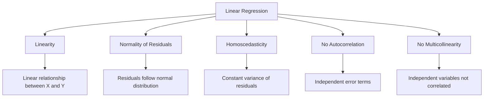

### Why These Assumptions Matter?

**When assumptions are met:**
- ✓ Unbiased coefficient estimates
- ✓ Minimum variance (BLUE - Best Linear Unbiased Estimators)
- ✓ Valid hypothesis tests
- ✓ Accurate confidence intervals
- ✓ Reliable predictions

**When assumptions are violated:**
- ✗ Biased or inefficient estimates
- ✗ Invalid statistical inferences
-  Misleading p-values
- ✗ Poor model performance

---

## 2. Assumption 1: Linearity {#linearity}

### What is Linearity?

**Definition:** There must be a linear relationship between the independent variables (predictors) and the dependent variable (outcome).

**Mathematical Form:**
```
Y = β₀ + β₁X₁ + β₂X₂ + ... + βₙXₙ + ε
```

### Intuition

**What:** The change in Y should be proportional to the change in X.

**Why:** Linear regression models can only capture straight-line relationships. If the true relationship is curved, the model will be misspecified.

**When to Check:** Before and after model fitting.

**Where it Matters:** In all predictive and inferential applications.

**How to Verify:** Through visualizations and statistical tests.

### What Happens When Violated?

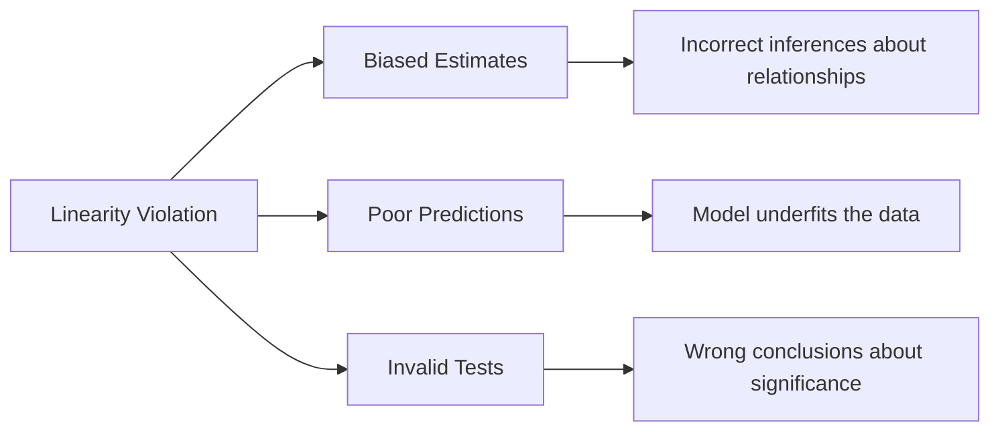

**Consequences:**
1. **Bias in parameter estimates:** Coefficients don't reflect true relationships
2. **Reduced predictive accuracy:** Model misses important patterns
3. **Invalid hypothesis tests:** Confidence intervals and p-values are unreliable

### How to Detect Linearity Violations

#### Method 1: Scatter Plots

```python
import matplotlib.pyplot as plt
import seaborn as sns
import pandas as pd
import numpy as np

# Example: Creating scatter plots
def check_linearity_scatter(X, y, variable_names):
    """
    Create scatter plots to check linearity
    """
    fig, axes = plt.subplots(1, len(variable_names), figsize=(15, 5))
    
    for i, var_name in enumerate(variable_names):
        axes[i].scatter(X[var_name], y, alpha=0.6)
        axes[i].set_xlabel(var_name)
        axes[i].set_ylabel('Target Variable')
        axes[i].set_title(f'{var_name} vs Target')
        
        # Add trend line
        z = np.polyfit(X[var_name], y, 1)
        p = np.poly1d(z)
        axes[i].plot(X[var_name], p(X[var_name]), "r--", alpha=0.8)
    
    plt.tight_layout()
    plt.show()
```

#### Method 2: Residual Plots

```python
def plot_residuals(model, X, y):
    """
    Plot residuals to check linearity
    """
    y_pred = model.predict(X)
    residuals = y - y_pred
    
    fig, axes = plt.subplots(1, 2, figsize=(12, 5))
    
    # Residuals vs Predicted
    axes[0].scatter(y_pred, residuals, alpha=0.6)
    axes[0].axhline(y=0, color='r', linestyle='--')
    axes[0].set_xlabel('Predicted Values')
    axes[0].set_ylabel('Residuals')
    axes[0].set_title('Residuals vs Predicted')
    
    # Residuals vs each predictor
    for col in X.columns:
        plt.figure(figsize=(8, 5))
        plt.scatter(X[col], residuals, alpha=0.6)
        plt.axhline(y=0, color='r', linestyle='--')
        plt.xlabel(col)
        plt.ylabel('Residuals')
        plt.title(f'Residuals vs {col}')
        plt.show()
```

### Solutions When Linearity Fails

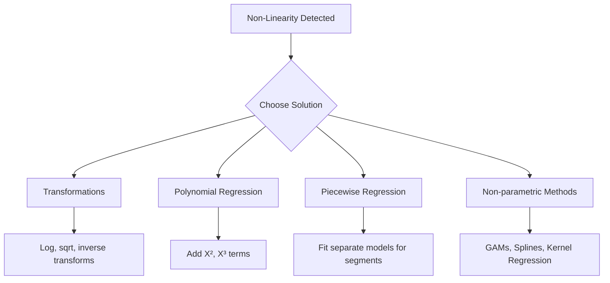

#### Solution 1: Variable Transformations

```python
from sklearn.preprocessing import PolynomialFeatures
from sklearn.linear_model import LinearRegression
import numpy as np

def apply_transformations(X, y, transformation_type='log'):
    """
    Apply transformations to achieve linearity
    """
    X_transformed = X.copy()
    
    if transformation_type == 'log':
        X_transformed = np.log(X_transformed + 1)  # +1 to handle zeros
    elif transformation_type == 'sqrt':
        X_transformed = np.sqrt(X_transformed)
    elif transformation_type == 'inverse':
        X_transformed = 1 / (X_transformed + 1e-10)
    elif transformation_type == 'square':
        X_transformed = X_transformed ** 2
    
    return X_transformed

# Example usage
X_log = apply_transformations(X, y, transformation_type='log')
model_log = LinearRegression().fit(X_log, y)
```

#### Solution 2: Polynomial Regression

```python
def polynomial_regression(X, y, degree=2):
    """
    Fit polynomial regression model
    """
    # Create polynomial features
    poly = PolynomialFeatures(degree=degree, include_bias=False)
    X_poly = poly.fit_transform(X)
    
    # Fit model
    model = LinearRegression()
    model.fit(X_poly, y)
    
    return model, poly

# Example
X = np.array([[1], [2], [3], [4], [5]])
y = np.array([2, 4, 9, 16, 25])  # Quadratic relationship

model_poly, poly_transformer = polynomial_regression(X, y, degree=2)
print(f"R² Score: {model_poly.score(poly_transformer.transform(X), y):.3f}")
```

#### Solution 3: Piecewise Regression

```python
def piecewise_regression(X, y, breakpoints):
    """
    Fit piecewise linear regression
    """
    from pyearth import Earth
    
    # Using MARS (Multivariate Adaptive Regression Splines)
    model = Earth(max_degree=1, prune=True)
    model.fit(X, y)
    
    return model

# Example with breakpoints at specific values
# This creates different linear models for different segments
```

---

## 3. Assumption 2: Normality of Residuals {#normality}

### What is Normality of Residuals?

**Definition:** The error terms (residuals) should follow a normal distribution with mean = 0 and constant variance.

**Mathematical Form:**
```
ε ~ N(0, σ²)
```

### Intuition

**What:** Residuals should be symmetrically distributed around zero.

**Why:** Many statistical tests (t-tests, F-tests) assume normality. The Central Limit Theorem helps with large samples.

**When Critical:** 
- Small sample sizes (< 30)
- When making inferences (hypothesis testing)
- Less critical for prediction with large samples

**Where:** In the error distribution, not the variables themselves.

**How:** Through visual inspection and statistical tests.

### What Happens When Violated?

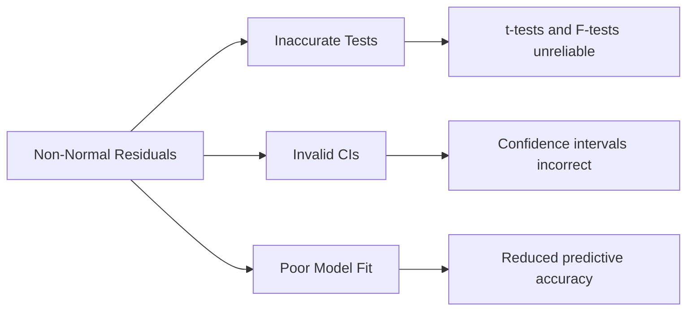

**Consequences:**
1. **Inaccurate hypothesis tests:** p-values may be wrong
2. **Invalid confidence intervals:** Effect size estimates unreliable
3. **Model performance issues:** May indicate model misspecification

### How to Check Normality

#### Method 1: Histogram of Residuals

```python
def plot_residual_histogram(model, X, y, bins=30):
    """
    Plot histogram of residuals with normal curve overlay
    """
    from scipy import stats
    
    y_pred = model.predict(X)
    residuals = y - y_pred
    
    fig, ax = plt.subplots(figsize=(10, 6))
    
    # Plot histogram
    ax.hist(residuals, bins=bins, density=True, alpha=0.6, color='g', 
            label='Residuals')
    
    # Plot normal distribution curve
    mu, sigma = stats.norm.fit(residuals)
    xmin, xmax = plt.xlim()
    x = np.linspace(xmin, xmax, 100)
    p = stats.norm.pdf(x, mu, sigma)
    ax.plot(x, p, 'r-', linewidth=2, label=f'Normal Fit\nμ={mu:.2f}, σ={sigma:.2f}')
    
    ax.set_xlabel('Residuals')
    ax.set_ylabel('Density')
    ax.set_title('Histogram of Residuals')
    ax.legend()
    plt.show()
```

#### Method 2: Q-Q Plot (Quantile-Quantile Plot)

```python
def plot_qq(residuals):
    """
    Create Q-Q plot to check normality
    """
    import scipy.stats as stats
    import matplotlib.pyplot as plt
    
    fig = plt.figure(figsize=(8, 8))
    
    # Q-Q plot
    stats.probplot(residuals, dist="norm", plot=plt)
    plt.title('Q-Q Plot of Residuals')
    plt.xlabel('Theoretical Quantiles')
    plt.ylabel('Sample Quantiles')
    plt.grid(True)
    plt.show()
```

#### Method 3: Statistical Tests

```python
from scipy import stats
from statsmodels.stats.stattools import omni_normtest

def test_normality(residuals, alpha=0.05):
    """
    Perform multiple normality tests
    """
    results = {}
    
    # Shapiro-Wilk test
    stat_sw, p_sw = stats.shapiro(residuals)
    results['Shapiro-Wilk'] = {'statistic': stat_sw, 'p-value': p_sw}
    
    # Jarque-Bera test
    stat_jb, p_jb = stats.jarque_bera(residuals)
    results['Jarque-Bera'] = {'statistic': stat_jb, 'p-value': p_jb}
    
    # Omnibus test
    stat_omni, p_omni = omni_normtest(residuals)
    results['Omnibus'] = {'statistic': stat_omni, 'p-value': p_omni}
    
    # Print results
    print("Normality Test Results:")
    print("-" * 50)
    for test_name, result in results.items():
        decision = "Reject H₀ (Not Normal)" if result['p-value'] < alpha else "Fail to reject H₀ (Normal)"
        print(f"{test_name}:")
        print(f"  Statistic: {result['statistic']:.4f}")
        print(f"  p-value: {result['p-value']:.4f}")
        print(f"  Decision: {decision}")
        print()
    
    return results
```

### Understanding the Omnibus Test

The Omnibus test checks normality using skewness and kurtosis:

```python
def omnibus_test_manual(residuals):
    """
    Manual calculation of Omnibus test
    """
    n = len(residuals)
    
    # Calculate skewness
    skew = stats.skew(residuals)
    
    # Calculate kurtosis (excess kurtosis)
    kurt = stats.kurtosis(residuals)  # Already excess kurtosis
    
    # Calculate Omnibus test statistic
    # K² = n * (skew²/6 + kurt²/24)
    omnibus_stat = n * (skew**2 / 6 + kurt**2 / 24)
    
    # p-value from chi-square distribution with 2 df
    p_value = 1 - stats.chi2.cdf(omnibus_stat, df=2)
    
    print(f"Omnibus Test (Manual Calculation):")
    print(f"  Skewness: {skew:.4f}")
    print(f"  Kurtosis: {kurt:.4f}")
    print(f"  Test Statistic (K²): {omnibus_stat:.4f}")
    print(f"  p-value: {p_value:.4f}")
    print(f"  Decision: {'Reject H₀' if p_value < 0.05 else 'Fail to reject H₀'}")
    
    return omnibus_stat, p_value
```

### Solutions When Normality Fails

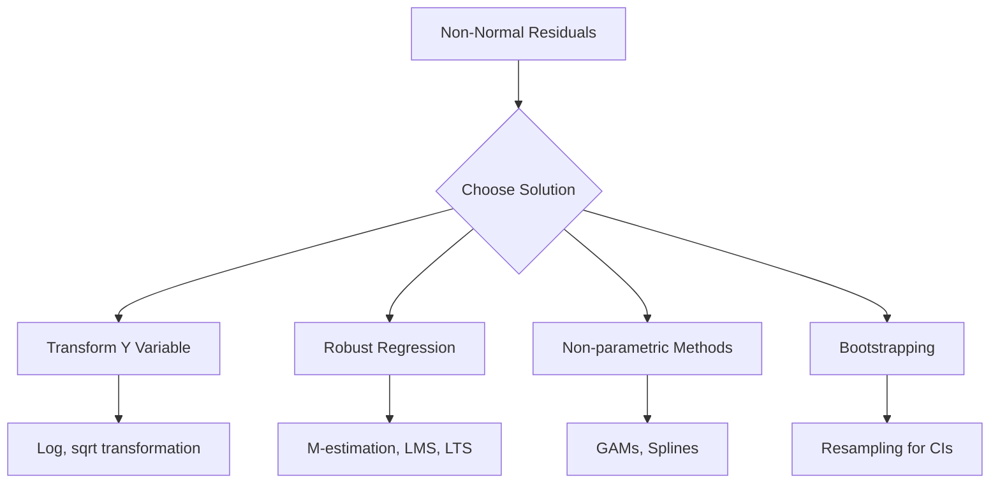

#### Solution 1: Transformations

```python
def transform_for_normality(X, y, X_test=None):
    """
    Apply transformations to achieve normality
    """
    from sklearn.preprocessing import PowerTransformer
    
    # Try Box-Cox transformation (requires positive values)
    if np.all(y > 0):
        pt = PowerTransformer(method='box-cox', standardize=True)
        y_transformed = pt.fit_transform(y.reshape(-1, 1)).ravel()
    else:
        # Use Yeo-Johnson (works with negative values)
        pt = PowerTransformer(method='yeo-johnson', standardize=True)
        y_transformed = pt.fit_transform(y.reshape(-1, 1)).ravel()
    
    return y_transformed, pt

# Example
y_transformed, transformer = transform_for_normality(X, y)
model = LinearRegression().fit(X, y_transformed)
```

#### Solution 2: Robust Regression

```python
from sklearn.linear_model import HuberRegressor, RANSACRegressor

def robust_regression(X, y, method='huber'):
    """
    Fit robust regression models
    """
    if method == 'huber':
        model = HuberRegressor(epsilon=1.35, max_iter=1000)
    elif method == 'ransac':
        model = RANSACRegressor(random_state=42)
    
    model.fit(X, y)
    return model

# Example
model_robust = robust_regression(X, y, method='huber')
```

#### Solution 3: Bootstrapping

```python
def bootstrap_confidence_intervals(X, y, model_class=LinearRegression, 
                                   n_bootstrap=1000, alpha=0.05):
    """
    Calculate confidence intervals using bootstrapping
    """
    from sklearn.utils import resample
    
    n_samples = X.shape[0]
    n_features = X.shape[1]
    coefficients = np.zeros((n_bootstrap, n_features))
    
    for i in range(n_bootstrap):
        # Resample with replacement
        X_sample, y_sample = resample(X, y, n_samples=n_samples, random_state=i)
        
        # Fit model
        model = model_class()
        model.fit(X_sample, y_sample)
        
        coefficients[i] = model.coef_
    
    # Calculate confidence intervals
    lower_percentile = (alpha / 2) * 100
    upper_percentile = (1 - alpha / 2) * 100
    
    ci_lower = np.percentile(coefficients, lower_percentile, axis=0)
    ci_upper = np.percentile(coefficients, upper_percentile, axis=0)
    
    return ci_lower, ci_upper, coefficients

# Example
ci_lower, ci_upper, boot_coefs = bootstrap_confidence_intervals(X, y)
print(f"95% Confidence Intervals for coefficients:")
for i in range(len(ci_lower)):
    print(f"  β{i+1}: [{ci_lower[i]:.4f}, {ci_upper[i]:.4f}]")
```

---

## 4. Assumption 3: Homoscedasticity {#homoscedasticity}

### What is Homoscedasticity?

**Definition:** The variance of error terms should be constant across all levels of independent variables.

**Mathematical Form:**
```
Var(ε|X) = σ² (constant)
```

**Heteroscedasticity:** When variance is NOT constant:
```
Var(ε|X) = σ²(X) (varies with X)
```

### Intuition

**What:** Residual spread should be the same regardless of predicted values.

**Why:** OLS gives equal weight to all observations. Unequal variance violates this.

**When to Check:** Always - it's common in real-world data.

**Where:** In the residual plot (residuals vs predicted values).

**How:** Visual inspection and Breusch-Pagan test.

### What Happens When Violated?

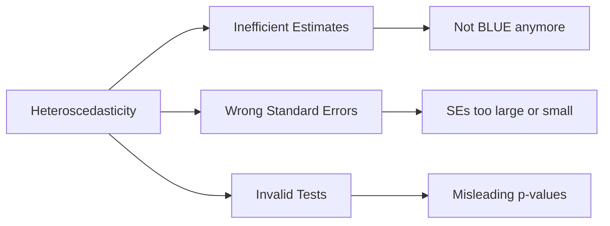

**Consequences:**
1. **Inefficient estimates:** Coefficients are unbiased but not minimum variance
2. **Inaccurate hypothesis tests:** Standard errors are biased
3. **Invalid confidence intervals:** Coverage probabilities incorrect

### How to Detect Heteroscedasticity

#### Method 1: Residual Plot (Visual)

```python
def plot_residuals_vs_fitted(model, X, y):
    """
    Create residual plots to detect heteroscedasticity
    """
    y_pred = model.predict(X)
    residuals = y - y_pred
    
    fig, axes = plt.subplots(1, 2, figsize=(14, 5))
    
    # Residuals vs Fitted
    axes[0].scatter(y_pred, residuals, alpha=0.6, edgecolors='k')
    axes[0].axhline(y=0, color='r', linestyle='--', linewidth=2)
    axes[0].set_xlabel('Fitted Values', fontsize=12)
    axes[0].set_ylabel('Residuals', fontsize=12)
    axes[0].set_title('Residuals vs Fitted Values', fontsize=14)
    axes[0].grid(True, alpha=0.3)
    
    # Add trend line to show pattern
    z = np.polyfit(y_pred, residuals, 1)
    p = np.poly1d(z)
    axes[0].plot(y_pred, p(y_pred), "g--", alpha=0.8, linewidth=2)
    
    # Scale-Location plot (sqrt of standardized residuals)
    standardized_residuals = residuals / np.std(residuals)
    axes[1].scatter(y_pred, np.sqrt(np.abs(standardized_residuals)), 
                    alpha=0.6, edgecolors='k')
    axes[1].set_xlabel('Fitted Values', fontsize=12)
    axes[1].set_ylabel('√|Standardized Residuals|', fontsize=12)
    axes[1].set_title('Scale-Location Plot', fontsize=14)
    axes[1].grid(True, alpha=0.3)
    
    plt.tight_layout()
    plt.show()
    
    # Interpretation
    print("Interpretation Guide:")
    print("-" * 50)
    print("✓ Homoscedasticity: Random scatter around zero")
    print("✗ Heteroscedasticity: Funnel shape or systematic pattern")
```

#### Method 2: Breusch-Pagan Test

```python
import statsmodels.api as sm
from statsmodels.stats.diagnostic import het_breuschpagan

def breusch_pagan_test(model, X, y):
    """
    Perform Breusch-Pagan test for heteroscedasticity
    """
    # Get residuals
    residuals = model.resid if hasattr(model, 'resid') else y - model.predict(X)
    
    # Perform Breusch-Pagan test
    bp_test = het_breuschpagan(residuals, X)
    
    labels = ['Lagrange Multiplier Statistic', 'p-value', 
              'f-value', 'f p-value']
    
    print("Breusch-Pagan Test for Heteroscedasticity")
    print("=" * 50)
    for i in range(len(labels)):
        print(f"{labels[i]}: {bp_test[i]:.4f}")
    
    print("\nInterpretation:")
    print("-" * 50)
    if bp_test[1] < 0.05:
        print("✗ Reject H₀: Heteroscedasticity is present")
    else:
        print("✓ Fail to reject H₀: Homoscedasticity assumption holds")
    
    return bp_test

# Manual implementation
def breusch_pagan_manual(X, y, model):
    """
    Manual calculation of Breusch-Pagan test
    """
    from sklearn.linear_model import LinearRegression
    
    # Step 1: Get residuals from original model
    y_pred = model.predict(X)
    residuals = y - y_pred
    
    # Step 2: Square the residuals
    residuals_squared = residuals ** 2
    
    # Step 3: Regress squared residuals on original predictors
    X_with_const = sm.add_constant(X)
    aux_model = sm.OLS(residuals_squared, X_with_const).fit()
    
    # Step 4: Calculate test statistic
    n = len(y)
    r_squared = aux_model.rsquared
    lm_stat = n * r_squared
    
    # Step 5: Calculate p-value
    df = X.shape[1]  # degrees of freedom
    p_value = 1 - stats.chi2.cdf(lm_stat, df)
    
    print("Breusch-Pagan Test (Manual Calculation)")
    print("=" * 50)
    print(f"Sample size (n): {n}")
    print(f"R² from auxiliary regression: {r_squared:.4f}")
    print(f"LM Statistic (n×R²): {lm_stat:.4f}")
    print(f"Degrees of freedom: {df}")
    print(f"p-value: {p_value:.4f}")
    print(f"\nDecision: {'Reject H₀' if p_value < 0.05 else 'Fail to reject H₀'}")
    
    return lm_stat, p_value
```

### Solutions When Homoscedasticity Fails

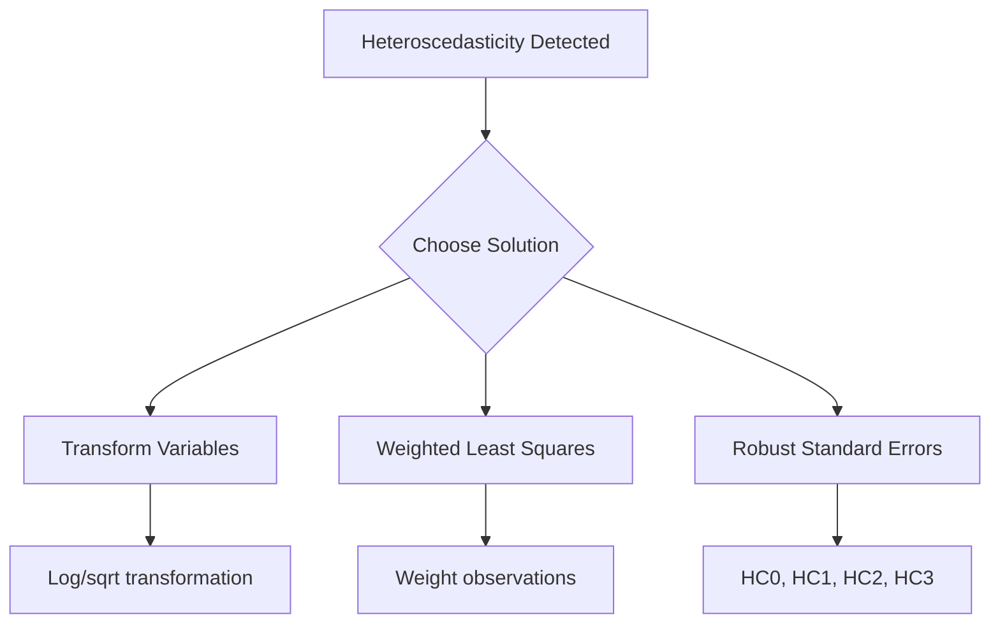

#### Solution 1: Variable Transformations

```python
def transform_for_homoscedasticity(X, y, transformation='log'):
    """
    Apply transformations to stabilize variance
    """
    X_transformed = X.copy()
    y_transformed = y.copy()
    
    if transformation == 'log':
        # Apply log transformation (add small constant if zeros exist)
        if np.any(y <= 0):
            y_transformed = np.log(y - np.min(y) + 1)
        else:
            y_transformed = np.log(y)
            
        for col in X_transformed.columns:
            if np.any(X_transformed[col] <= 0):
                X_transformed[col] = np.log(X_transformed[col] - 
                                            np.min(X_transformed[col]) + 1)
            else:
                X_transformed[col] = np.log(X_transformed[col])
    
    elif transformation == 'sqrt':
        y_transformed = np.sqrt(y)
        X_transformed = np.sqrt(X_transformed)
    
    elif transformation == 'boxcox':
        from scipy.stats import boxcox
        y_transformed, _ = boxcox(y - np.min(y) + 1)
    
    return X_transformed, y_transformed

# Example
X_trans, y_trans = transform_for_homoscedasticity(X, y, transformation='log')
model_trans = sm.OLS(y_trans, sm.add_constant(X_trans)).fit()
```

#### Solution 2: Weighted Least Squares (WLS)

```python
def weighted_least_squares(X, y, weights=None):
    """
    Fit Weighted Least Squares model
    """
    if weights is None:
        # Estimate weights from residuals of OLS
        model_ols = sm.OLS(y, sm.add_constant(X)).fit()
        residuals = model_ols.resid
        
        # Common weighting schemes:
        # 1. Inverse of squared fitted values
        weights = 1 / (model_ols.fitted_values ** 2)
        
        # 2. Inverse of absolute residuals
        # weights = 1 / np.abs(residuals)
        
        # 3. Inverse of variance function
        # weights = 1 / residuals ** 2
    
    # Normalize weights
    weights = weights / np.mean(weights)
    
    # Fit WLS model
    model_wls = sm.WLS(y, sm.add_constant(X), weights=weights).fit()
    
    return model_wls, weights

# Example
model_wls, weights = weighted_least_squares(X, y)
print(model_wls.summary())
```

#### Solution 3: Robust Standard Errors

```python
def robust_standard_errors(model, X, y, hc_type='HC3'):
    """
    Calculate robust (heteroscedasticity-consistent) standard errors
    """
    import statsmodels.regression.linear_model as lm
    
    # Fit model with robust standard errors
    model_robust = sm.OLS(y, sm.add_constant(X)).fit()
    
    # Get robust covariance matrix
    robust_cov = model_robust.get_robustcov_results(cov_type=hc_type)
    
    print(f"Robust Standard Errors ({hc_type})")
    print("=" * 50)
    print(robust_cov.summary())
    
    return robust_cov

# Compare regular vs robust SEs
def compare_standard_errors(model_regular, model_robust):
    """
    Compare regular and robust standard errors
    """
    import pandas as pd
    
    comparison = pd.DataFrame({
        'Coefficient': model_regular.params,
        'Regular SE': model_regular.bse,
        'Robust SE': model_robust.bse,
        'Regular t': model_regular.tvalues,
        'Robust t': model_robust.tvalues,
        'Regular p': model_regular.pvalues,
        'Robust p': model_robust.pvalues
    })
    
    print("Comparison: Regular vs Robust Standard Errors")
    print("=" * 70)
    print(comparison.round(4))
    
    return comparison
```

---

## 5. Assumption 4: No Autocorrelation {#autocorrelation}

### What is No Autocorrelation?

**Definition:** Error terms should be independent of each other. No correlation between residuals.

**Mathematical Form:**
```
Cov(ε, εⱼ) = 0 for i ≠ j
```

**Autocorrelation:** When errors are correlated:
```
Cov(εᵢ, ε₊₁) ≠ 0 (common in time series)
```

### Intuition

**What:** Each error should be independent; past errors shouldn't predict future errors.

**Why:** OLS assumes independence. Correlation violates this and affects efficiency.

**When Critical:** Time series data, spatial data, sequential measurements.

**Where:** In the ordering of observations (time, space, sequence).

**How:** Durbin-Watson test and residual plots.

### What Happens When Violated?

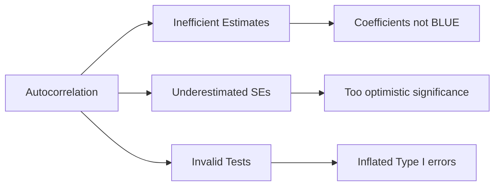

**Consequences:**
1. **Inefficient estimates:** Not minimum variance
2. **Inaccurate hypothesis tests:** Standard errors biased downward
3. **Invalid confidence intervals:** Too narrow, overconfident

### How to Detect Autocorrelation

#### Method 1: Durbin-Watson Test

```python
from statsmodels.stats.stattools import durbin_watson

def durbin_watson_test(model, X, y):
    """
    Perform Durbin-Watson test for autocorrelation
    """
    # Get residuals
    residuals = model.resid if hasattr(model, 'resid') else y - model.predict(X)
    
    # Calculate Durbin-Watson statistic
    dw_stat = durbin_watson(residuals)
    
    print("Durbin-Watson Test for Autocorrelation")
    print("=" * 50)
    print(f"Durbin-Watson Statistic: {dw_stat:.4f}")
    print()
    print("Interpretation:")
    print("-" * 50)
    print("DW ≈ 2.0  → No autocorrelation")
    print("DW < 2.0  → Positive autocorrelation")
    print("DW > 2.0  → Negative autocorrelation")
    print()
    
    if dw_stat < 1.5:
        print("⚠ Warning: Evidence of positive autocorrelation")
    elif dw_stat > 2.5:
        print("⚠ Warning: Evidence of negative autocorrelation")
    else:
        print("✓ No significant autocorrelation detected")
    
    return dw_stat

# Manual calculation
def durbin_watson_manual(residuals):
    """
    Manual calculation of Durbin-Watson statistic
    """
    n = len(residuals)
    
    # DW = Σ(eᵢ - e₋₁)² / Σeᵢ²
    numerator = sum((residuals[i] - residuals[i-1])**2 for i in range(1, n))
    denominator = sum(e**2 for e in residuals)
    
    dw = numerator / denominator
    
    print("Durbin-Watson Statistic (Manual)")
    print("=" * 50)
    print(f"Numerator Σ(eᵢ - e₋₁)²: {numerator:.4f}")
    print(f"Denominator Σeᵢ²: {denominator:.4f}")
    print(f"DW Statistic: {dw:.4f}")
    
    return dw
```

#### Method 2: Residual Plot Over Time

```python
def plot_residuals_over_time(residuals, time_index=None):
    """
    Plot residuals over time to detect autocorrelation
    """
    if time_index is None:
        time_index = range(len(residuals))
    
    fig, axes = plt.subplots(2, 1, figsize=(12, 10))
    
    # Residuals vs Time
    axes[0].plot(time_index, residuals, 'o-', alpha=0.7, markersize=4)
    axes[0].axhline(y=0, color='r', linestyle='--', linewidth=2)
    axes[0].set_xlabel('Time/Observation Order', fontsize=12)
    axes[0].set_ylabel('Residuals', fontsize=12)
    axes[0].set_title('Residuals vs Time', fontsize=14)
    axes[0].grid(True, alpha=0.3)
    
    # Lag plot (residuals vs lagged residuals)
    lag = 1
    residuals_lagged = residuals[:-lag]
    residuals_current = residuals[lag:]
    
    axes[1].scatter(residuals_lagged, residuals_current, alpha=0.6)
    axes[1].plot([residuals.min(), residuals.max()], 
                 [residuals.min(), residuals.max()], 'r--', linewidth=2)
    axes[1].set_xlabel(f'Residual at t-{lag}', fontsize=12)
    axes[1].set_ylabel(f'Residual at t', fontsize=12)
    axes[1].set_title(f'Lag Plot (Lag = {lag})', fontsize=14)
    axes[1].grid(True, alpha=0.3)
    
    plt.tight_layout()
    plt.show()
```

#### Method 3: Autocorrelation Function (ACF) Plot

```python
from statsmodels.graphics.tsaplots import plot_acf, plot_pacf

def plot_acf_pacf(residuals, lags=20):
    """
    Plot ACF and PACF of residuals
    """
    fig, axes = plt.subplots(2, 1, figsize=(12, 10))
    
    # ACF plot
    plot_acf(residuals, lags=lags, ax=axes[0], alpha=0.05)
    axes[0].set_title('Autocorrelation Function (ACF)', fontsize=14)
    
    # PACF plot
    plot_pacf(residuals, lags=lags, ax=axes[1], alpha=0.05)
    axes[1].set_title('Partial Autocorrelation Function (PACF)', fontsize=14)
    
    plt.tight_layout()
    plt.show()
    
    # Check for significant autocorrelations
    from statsmodels.tsa.stattools import acf
    acf_values = acf(residuals, nlags=lags)
    
    print("ACF Values:")
    print("-" * 30)
    for lag, value in enumerate(acf_values[:11]):  # Show first 10 lags
        print(f"Lag {lag}: {value:.4f}")
```

### Solutions When Autocorrelation Exists

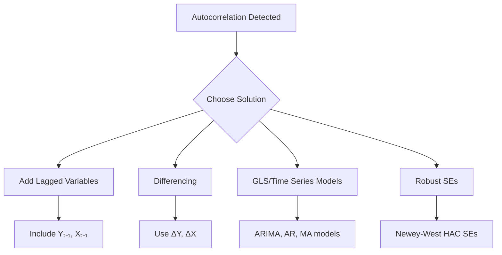

#### Solution 1: Add Lagged Variables

```python
def add_lagged_features(X, y, lags=1):
    """
    Add lagged variables to account for autocorrelation
    """
    X_lagged = X.copy()
    y_lagged = y.copy()
    
    # Add lagged dependent variable
    for lag in range(1, lags+1):
        X_lagged[f'y_lag_{lag}'] = np.roll(y, lag)
        X_lagged[f'y_lag_{lag}'].iloc[:lag] = np.nan
    
    # Add lagged independent variables
    for col in X.columns:
        for lag in range(1, lags+1):
            X_lagged[f'{col}_lag_{lag}'] = np.roll(X[col], lag)
            X_lagged[f'{col}_lag_{lag}'].iloc[:lag] = np.nan
    
    # Remove rows with NaN
    mask = ~X_lagged.isna().any(axis=1)
    X_lagged = X_lagged[mask]
    y_lagged = y_lagged[mask]
    
    return X_lagged, y_lagged

# Example
X_with_lags, y_with_lags = add_lagged_features(X, y, lags=1)
model_lagged = sm.OLS(y_with_lags, sm.add_constant(X_with_lags)).fit()
```

#### Solution 2: Differencing

```python
def difference_data(X, y, order=1):
    """
    Apply differencing to remove autocorrelation
    """
    X_diff = X.diff(order).dropna()
    y_diff = pd.Series(y).diff(order).dropna()
    
    # Align indices
    common_idx = X_diff.index.intersection(y_diff.index)
    X_diff = X_diff.loc[common_idx]
    y_diff = y_diff.loc[common_idx]
    
    return X_diff, y_diff

# Example
X_diff, y_diff = difference_data(X, y, order=1)
model_diff = sm.OLS(y_diff, sm.add_constant(X_diff)).fit()
```

#### Solution 3: Newey-West Standard Errors

```python
def newey_west_standard_errors(model, X, y, max_lag=1):
    """
    Calculate Newey-West HAC (Heteroscedasticity and Autocorrelation 
    Consistent) standard errors
    """
    # Fit model with Newey-West covariance
    model_hac = sm.OLS(y, sm.add_constant(X)).fit()
    hac_results = model_hac.get_robustcov_results(
        cov_type='HAC', 
        maxlags=max_lag
    )
    
    print("Newey-West HAC Standard Errors")
    print("=" * 50)
    print(hac_results.summary())
    
    return hac_results

# Example
model_hac = newey_west_standard_errors(model, X, y, max_lag=2)
```

#### Solution 4: Time Series Models (ARIMA)

```python
from statsmodels.tsa.arima.model import ARIMA

def fit_arima_model(y, X=None, order=(1, 0, 1)):
    """
    Fit ARIMA model to account for autocorrelation
    """
    if X is not None:
        # ARIMAX model (with exogenous variables)
        model = ARIMA(y, exog=X, order=order)
    else:
        model = ARIMA(y, order=order)
    
    results = model.fit()
    print(results.summary())
    
    return results

# Example
arima_results = fit_arima_model(y, X=None, order=(1, 0, 1))
```

---

## 6. Assumption 5 & Deep Dive: No Multicollinearity {#multicollinearity}

### What is Multicollinearity?

**Definition:** Two or more independent variables are highly correlated with each other.

**Mathematical Form:**
```
Xᵢ ≈ α₀ + α₁Xⱼ + α₂Xₖ + ... + ε
```

**Perfect Multicollinearity:**
```
Xᵢ = β₀ + β₁X (exact linear relationship)
```

### Intuition

**What:** Predictors contain redundant information.

**Why:** Makes it impossible to isolate individual effects of each variable.

**When Problematic:**
- **Inference:** When you need to understand individual variable effects
- **Less critical:** When only prediction matters (not interpretation)

**Where:** In the correlation structure of independent variables.

**How:** VIF, correlation matrix, condition number.

### Inference vs Prediction

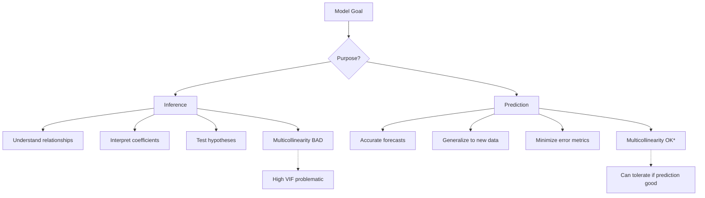

**Key Differences:**

| Aspect | Inference | Prediction |
|--------|-----------|------------|
| **Goal** | Understand relationships | Accurate forecasts |
| **Focus** | Coefficient interpretation | Minimize error metrics |
| **Multicollinearity** | Serious problem | May be acceptable |
| **Methods** | Linear/Logistic Regression | Random Forest, Neural Nets |
| **Interpretability** | Critical | Less important |

### What Happens When Multicollinearity Exists?

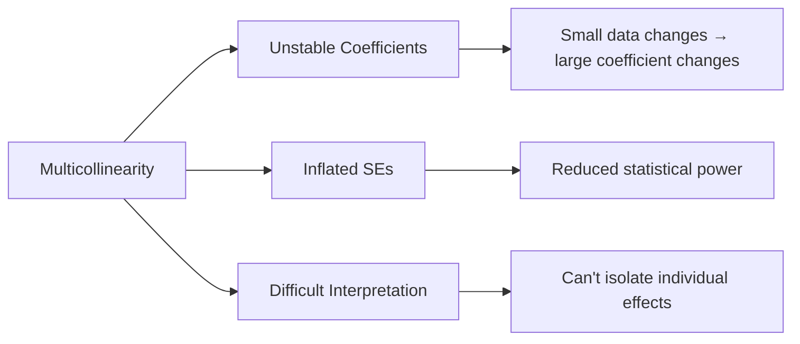

**Consequences:**
1. **Difficulty identifying important predictors:** Can't determine which variable matters
2. **Inflated standard errors:** Reduced statistical power
3. **Unstable estimates:** Sensitive to small data changes

### Types of Multicollinearity

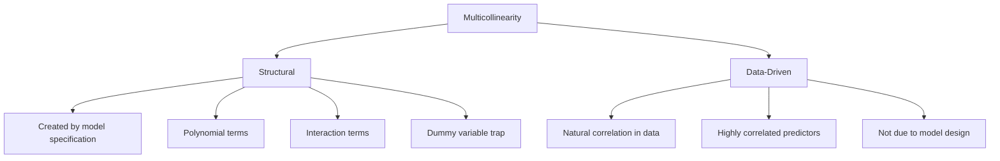

**1. Structural Multicollinearity:**
- Created by how we construct variables
- Example: Including both X and X² without centering
- Solution: Center variables before creating polynomials

**2. Data-Driven Multicollinearity:**
- Exists in the data itself
- Example: Height and weight are naturally correlated
- Solution: Remove variables, combine, or use regularization

### How to Detect Multicollinearity

#### Method 1: Correlation Matrix

```python
def check_correlation_matrix(X, threshold=0.8):
    """
    Check correlation matrix for multicollinearity
    """
    import seaborn as sns
    
    corr_matrix = X.corr()
    
    # Visualize correlation matrix
    plt.figure(figsize=(12, 10))
    sns.heatmap(corr_matrix, annot=True, cmap='coolwarm', center=0,
                fmt='.2f', square=True, linewidths=0.5)
    plt.title('Correlation Matrix', fontsize=14, fontweight='bold')
    plt.tight_layout()
    plt.show()
    
    # Find highly correlated pairs
    high_corr_pairs = []
    for i in range(len(corr_matrix.columns)):
        for j in range(i+1, len(corr_matrix.columns)):
            if abs(corr_matrix.iloc[i, j]) > threshold:
                high_corr_pairs.append({
                    'Variable 1': corr_matrix.columns[i],
                    'Variable 2': corr_matrix.columns[j],
                    'Correlation': corr_matrix.iloc[i, j]
                })
    
    if high_corr_pairs:
        print(f"\nHighly Correlated Pairs (|r| > {threshold}):")
        print("-" * 60)
        for pair in high_corr_pairs:
            print(f"{pair['Variable 1']} & {pair['Variable 2']}: "
                  f"r = {pair['Correlation']:.3f}")
    else:
        print(f"\n✓ No highly correlated pairs found (threshold = {threshold})")
    
    return corr_matrix, high_corr_pairs

# Example
corr_matrix, high_corr = check_correlation_matrix(X, threshold=0.8)
```

#### Method 2: Variance Inflation Factor (VIF)

```python
from statsmodels.stats.outliers_influence import variance_inflation_factor

def calculate_vif(X, threshold=5.0):
    """
    Calculate VIF for each predictor
    """
    # Add constant if not present
    if 'const' not in X.columns:
        X_with_const = sm.add_constant(X)
    else:
        X_with_const = X
    
    vif_data = pd.DataFrame()
    vif_data["Variable"] = X_with_const.columns
    vif_data["VIF"] = [variance_inflation_factor(X_with_const.values, i) 
                       for i in range(X_with_const.shape[1])]
    
    # Sort by VIF
    vif_data = vif_data.sort_values("VIF", ascending=False)
    
    print("Variance Inflation Factor (VIF)")
    print("=" * 50)
    print(vif_data.to_string(index=False))
    print()
    
    # Interpretation
    print("VIF Interpretation:")
    print("-" * 50)
    print("VIF = 1    → No multicollinearity")
    print("1 < VIF < 5 → Moderate multicollinearity")
    print("5 < VIF < 10 → High multicollinearity")
    print("VIF ≥ 10   → Severe multicollinearity")
    print()
    
    # Flag problematic variables
    problematic = vif_data[vif_data["VIF"] > threshold]
    if len(problematic) > 0:
        print(f"⚠ Variables with VIF > {threshold}:")
        for _, row in problematic.iterrows():
            print(f"  - {row['Variable']}: VIF = {row['VIF']:.2f}")
    else:
        print(f"✓ All variables have VIF < {threshold}")
    
    return vif_data

# Manual VIF calculation
def calculate_vif_manual(X, variable_name):
    """
    Manual calculation of VIF for a specific variable
    """
    # Regress this variable on all others
    y_var = X[variable_name]
    X_others = X.drop(columns=[variable_name])
    
    # Add constant
    X_others_const = sm.add_constant(X_others)
    
    # Fit regression
    model = sm.OLS(y_var, X_others_const).fit()
    r_squared = model.rsquared
    
    # Calculate VIF
    vif = 1 / (1 - r_squared)
    
    print(f"VIF Calculation for '{variable_name}'")
    print("=" * 50)
    print(f"R² from regressing on other variables: {r_squared:.4f}")
    print(f"VIF = 1/(1-R²) = 1/(1-{r_squared:.4f}) = {vif:.2f}")
    
    return vif

# Example
vif_data = calculate_vif(X, threshold=5.0)
```

#### Method 3: Condition Number

```python
def calculate_condition_number(X, threshold=30):
    """
    Calculate condition number to detect multicollinearity
    """
    from numpy.linalg import cond, eigvals
    
    # Add constant
    X_with_const = sm.add_constant(X)
    
    # Calculate X'X
    XtX = np.dot(X_with_const.T, X_with_const)
    
    # Calculate eigenvalues
    eigenvalues = eigvals(XtX)
    
    # Condition number = sqrt(max eigenvalue / min eigenvalue)
    cond_number = np.sqrt(np.max(np.abs(eigenvalues)) / 
                          np.min(np.abs(eigenvalues)))
    
    # Alternative: using numpy's cond function
    cond_number_np = cond(X_with_const)
    
    print("Condition Number Analysis")
    print("=" * 50)
    print(f"Condition Number: {cond_number:.2f}")
    print(f"Condition Number (numpy): {cond_number_np:.2f}")
    print()
    print("Interpretation:")
    print("-" * 50)
    print("Condition Number < 10  → Low multicollinearity")
    print("10 ≤ CN < 30   → Moderate multicollinearity")
    print("30 ≤ CN < 100  → High multicollinearity")
    print("CN ≥ 100       → Severe multicollinearity")
    print()
    
    if cond_number >= threshold:
        print(f"⚠ Warning: Condition number > {threshold}")
        print("   Multicollinearity may be present")
    else:
        print(f"✓ Condition number < {threshold}")
        print("   Multicollinearity not severe")
    
    return cond_number

# Example
cond_num = calculate_condition_number(X, threshold=30)
```

### Solutions When Multicollinearity Exists

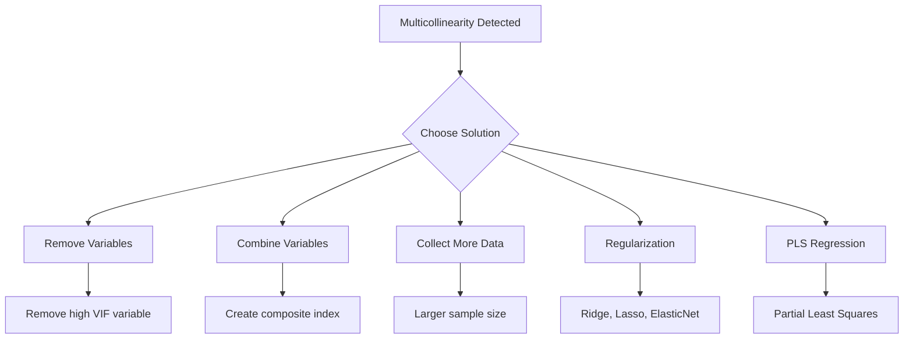

#### Solution 1: Remove Highly Correlated Variables

```python
def remove_multicollinear_variables(X, threshold=0.8):
    """
    Remove one variable from each highly correlated pair
    """
    corr_matrix = X.corr().abs()
    
    # Select upper triangle of correlation matrix
    upper = corr_matrix.where(np.triu(np.ones(corr_matrix.shape), k=1).astype(bool))
    
    # Find features with correlation greater than threshold
    to_drop = [column for column in upper.columns if any(upper[column] > threshold)]
    
    print(f"Variables to remove (correlation > {threshold}):")
    print("-" * 50)
    for var in to_drop:
        print(f"  - {var}")
    
    # Remove variables
    X_reduced = X.drop(columns=to_drop)
    
    print(f"\nOriginal variables: {X.shape[1]}")
    print(f"Variables after removal: {X_reduced.shape[1]}")
    
    return X_reduced, to_drop

# Example
X_reduced, dropped = remove_multicollinear_variables(X, threshold=0.8)
```

#### Solution 2: Combine Correlated Variables

```python
def combine_correlated_variables(X, variables_to_combine, method='mean'):
    """
    Combine correlated variables into a single composite variable
    """
    X_combined = X.copy()
    
    if method == 'mean':
        composite = X_combined[variables_to_combine].mean(axis=1)
    elif method == 'sum':
        composite = X_combined[variables_to_combine].sum(axis=1)
    elif method == 'pca':
        from sklearn.decomposition import PCA
        pca = PCA(n_components=1)
        composite = pca.fit_transform(X_combined[variables_to_combine])
        composite = composite.ravel()
    
    # Create composite variable name
    composite_name = '_'.join(variables_to_combine) + f'_{method}'
    
    # Add composite variable and remove originals
    X_combined[composite_name] = composite
    X_combined = X_combined.drop(columns=variables_to_combine)
    
    print(f"Created composite variable: {composite_name}")
    print(f"Combined variables: {', '.join(variables_to_combine)}")
    print(f"Method: {method}")
    
    return X_combined, composite_name

# Example
vars_to_combine = ['variable1', 'variable2', 'variable3']
X_combined, new_var = combine_correlated_variables(X, vars_to_combine, method='pca')
```

#### Solution 3: Ridge Regression (L2 Regularization)

```python
from sklearn.linear_model import Ridge
from sklearn.model_selection import GridSearchCV

def ridge_regression(X, y, alpha_range=None):
    """
    Apply Ridge regression to handle multicollinearity
    """
    if alpha_range is None:
        alpha_range = [0.001, 0.01, 0.1, 1, 10, 100, 1000]
    
    # Standardize features
    from sklearn.preprocessing import StandardScaler
    scaler = StandardScaler()
    X_scaled = scaler.fit_transform(X)
    
    # Grid search for best alpha
    ridge = Ridge()
    param_grid = {'alpha': alpha_range}
    grid_search = GridSearchCV(ridge, param_grid, cv=5, scoring='r2')
    grid_search.fit(X_scaled, y)
    
    best_alpha = grid_search.best_params_['alpha']
    print(f"Best alpha: {best_alpha}")
    print(f"Best R² score: {grid_search.best_score_:.4f}")
    
    # Fit final model
    ridge_final = Ridge(alpha=best_alpha)
    ridge_final.fit(X_scaled, y)
    
    # Display coefficients
    coef_df = pd.DataFrame({
        'Variable': X.columns,
        'Coefficient': ridge_final.coef_
    }).sort_values('Coefficient', key=abs, ascending=False)
    
    print("\nRidge Regression Coefficients:")
    print("-" * 50)
    print(coef_df.to_string(index=False))
    
    return ridge_final, scaler, best_alpha

# Example
ridge_model, scaler, alpha = ridge_regression(X, y)
```

#### Solution 4: Lasso Regression (L1 Regularization)

```python
from sklearn.linear_model import Lasso

def lasso_regression(X, y, alpha_range=None):
    """
    Apply Lasso regression for variable selection and multicollinearity
    """
    if alpha_range is None:
        alpha_range = np.logspace(-4, 2, 50)
    
    # Standardize features
    from sklearn.preprocessing import StandardScaler
    scaler = StandardScaler()
    X_scaled = scaler.fit_transform(X)
    
    # Grid search
    lasso = Lasso(max_iter=10000, random_state=42)
    param_grid = {'alpha': alpha_range}
    grid_search = GridSearchCV(lasso, param_grid, cv=5, scoring='r2')
    grid_search.fit(X_scaled, y)
    
    best_alpha = grid_search.best_params_['alpha']
    print(f"Best alpha: {best_alpha:.6f}")
    print(f"Best R² score: {grid_search.best_score_:.4f}")
    
    # Fit final model
    lasso_final = Lasso(alpha=best_alpha, max_iter=10000, random_state=42)
    lasso_final.fit(X_scaled, y)
    
    # Display coefficients (including zeros)
    coef_df = pd.DataFrame({
        'Variable': X.columns,
        'Coefficient': lasso_final.coef_,
        'Selected': lasso_final.coef_ != 0
    })
    
    print(f"\nVariables selected: {coef_df['Selected'].sum()} / {len(X.columns)}")
    print("\nLasso Coefficients:")
    print("-" * 50)
    print(coef_df.sort_values('Coefficient', key=abs, ascending=False).to_string(index=False))
    
    return lasso_final, scaler, best_alpha

# Example
lasso_model, scaler, alpha = lasso_regression(X, y)
```

#### Solution 5: Partial Least Squares (PLS) Regression

```python
from sklearn.cross_decomposition import PLSRegression

def pls_regression(X, y, n_components=None):
    """
    Apply Partial Least Squares regression
    """
    # Standardize features
    from sklearn.preprocessing import StandardScaler
    scaler_X = StandardScaler()
    scaler_y = StandardScaler()
    
    X_scaled = scaler_X.fit_transform(X)
    y_scaled = scaler_y.fit_transform(y.reshape(-1, 1)).ravel()
    
    # If n_components not specified, use cross-validation
    if n_components is None:
        from sklearn.model_selection import cross_val_score
        
        best_n = 1
        best_score = -np.inf
        
        for n in range(1, min(X.shape[1] + 1, 11)):
            pls = PLSRegression(n_components=n)
            scores = cross_val_score(pls, X_scaled, y_scaled, cv=5, scoring='r2')
            mean_score = scores.mean()
            
            if mean_score > best_score:
                best_score = mean_score
                best_n = n
        
        n_components = best_n
        print(f"Optimal number of components: {n_components}")
        print(f"Cross-validated R²: {best_score:.4f}")
    
    # Fit final model
    pls = PLSRegression(n_components=n_components)
    pls.fit(X_scaled, y_scaled)
    
    print(f"\nPLS Regression with {n_components} component(s)")
    print("-" * 50)
    print(f"R² score: {pls.score(X_scaled, y_scaled):.4f}")
    
    # Variable importance
    vip_scores = np.abs(pls.coef_).sum(axis=1)
    importance_df = pd.DataFrame({
        'Variable': X.columns,
        'VIP Score': vip_scores.ravel()
    }).sort_values('VIP Score', ascending=False)
    
    print("\nVariable Importance (VIP scores):")
    print("-" * 50)
    print(importance_df.to_string(index=False))
    
    return pls, scaler_X, scaler_y, n_components

# Example
pls_model, scaler_x, scaler_y, n_comp = pls_regression(X, y)
```

#### Solution 6: Principal Component Regression (PCR)

```python
from sklearn.decomposition import PCA
from sklearn.pipeline import Pipeline

def pcr_regression(X, y, n_components=None):
    """
    Apply Principal Component Regression
    """
    # Standardize features
    scaler = StandardScaler()
    X_scaled = scaler.fit_transform(X)
    
    # If n_components not specified, use explained variance
    if n_components is None:
        pca_temp = PCA()
        pca_temp.fit(X_scaled)
        
        # Choose components that explain 95% variance
        cumsum = np.cumsum(pca_temp.explained_variance_ratio_)
        n_components = np.argmax(cumsum >= 0.95) + 1
        
        print(f"Components for 95% variance: {n_components}")
        print(f"Explained variance ratio: {cumsum[n_components-1]:.4f}")
    
    # Create pipeline
    pcr_pipeline = Pipeline([
        ('pca', PCA(n_components=n_components)),
        ('regression', LinearRegression())
    ])
    
    # Fit model
    pcr_pipeline.fit(X_scaled, y)
    
    print(f"\nPCR with {n_components} principal components")
    print("-" * 50)
    print(f"R² score: {pcr_pipeline.score(X_scaled, y):.4f}")
    
    return pcr_pipeline, scaler, n_components

# Example
pcr_model, scaler, n_comp = pcr_regression(X, y)
```

---

## 7. Complete Diagnostic Workflow {#complete-workflow}

### Comprehensive Regression Diagnostics

```python
class RegressionDiagnostics:
    """
    Complete diagnostic toolkit for linear regression assumptions
    """
    
    def __init__(self, model, X, y):
        self.model = model
        self.X = X
        self.y = y
        self.y_pred = model.predict(X)
        self.residuals = y - self.y_pred
        
    def check_all_assumptions(self):
        """
        Run all diagnostic tests
        """
        print("=" * 70)
        print("COMPREHENSIVE REGRESSION DIAGNOSTICS")
        print("=" * 70)
        
        results = {}
        
        # 1. Linearity
        print("\n1. LINEARITY")
        print("-" * 70)
        results['linearity'] = self.check_linearity()
        
        # 2. Normality
        print("\n2. NORMALITY OF RESIDUALS")
        print("-" * 70)
        results['normality'] = self.check_normality()
        
        # 3. Homoscedasticity
        print("\n3. HOMOSCEDASTICITY")
        print("-" * 70)
        results['homoscedasticity'] = self.check_homoscedasticity()
        
        # 4. Autocorrelation
        print("\n4. AUTOCORRELATION")
        print("-" * 70)
        results['autocorrelation'] = self.check_autocorrelation()
        
        # 5. Multicollinearity
        print("\n5. MULTICOLLINEARITY")
        print("-" * 70)
        results['multicollinearity'] = self.check_multicollinearity()
        
        # Summary
        print("\n" + "=" * 70)
        print("SUMMARY")
        print("=" * 70)
        self.print_summary(results)
        
        return results
    
    def check_linearity(self):
        """Check linearity assumption"""
        # Create residual plot
        fig, ax = plt.subplots(figsize=(8, 6))
        ax.scatter(self.y_pred, self.residuals, alpha=0.6)
        ax.axhline(y=0, color='r', linestyle='--')
        ax.set_xlabel('Predicted Values')
        ax.set_ylabel('Residuals')
        ax.set_title('Residuals vs Predicted (Linearity Check)')
        plt.show()
        
        # Check for pattern
        from scipy import stats
        slope, intercept, r_value, p_value, std_err = stats.linregress(
            self.y_pred, self.residuals
        )
        
        is_linear = p_value > 0.05
        print(f"Residual trend test: p-value = {p_value:.4f}")
        print(f"Assumption {'met' if is_linear else 'violated'}")
        
        return {'is_linear': is_linear, 'p_value': p_value}
    
    def check_normality(self):
        """Check normality assumption"""
        # Q-Q plot
        fig = plt.figure(figsize=(8, 8))
        stats.probplot(self.residuals, dist="norm", plot=plt)
        plt.title('Q-Q Plot')
        plt.show()
        
        # Statistical tests
        _, p_sw = stats.shapiro(self.residuals)
        _, p_jb = stats.jarque_bera(self.residuals)
        
        is_normal = p_sw > 0.05 and p_jb > 0.05
        
        print(f"Shapiro-Wilk test: p-value = {p_sw:.4f}")
        print(f"Jarque-Bera test: p-value = {p_jb:.4f}")
        print(f"Assumption {'met' if is_normal else 'violated'}")
        
        return {'is_normal': is_normal, 'p_shapiro': p_sw, 'p_jarque': p_jb}
    
    def check_homoscedasticity(self):
        """Check homoscedasticity assumption"""
        # Residual plot
        fig, ax = plt.subplots(figsize=(8, 6))
        ax.scatter(self.y_pred, self.residuals, alpha=0.6)
        ax.axhline(y=0, color='r', linestyle='--')
        ax.set_xlabel('Predicted Values')
        ax.set_ylabel('Residuals')
        ax.set_title('Residuals vs Predicted (Homoscedasticity Check)')
        plt.show()
        
        # Breusch-Pagan test
        bp_test = het_breuschpagan(self.residuals, self.X)
        
        is_homo = bp_test[1] > 0.05
        
        print(f"Breusch-Pagan test: p-value = {bp_test[1]:.4f}")
        print(f"Assumption {'met' if is_homo else 'violated'}")
        
        return {'is_homoscedastic': is_homo, 'p_value': bp_test[1]}
    
    def check_autocorrelation(self):
        """Check autocorrelation assumption"""
        # Durbin-Watson test
        dw_stat = durbin_watson(self.residuals)
        
        is_independent = 1.5 < dw_stat < 2.5
        
        print(f"Durbin-Watson statistic: {dw_stat:.4f}")
        print(f"Assumption {'met' if is_independent else 'violated'}")
        
        return {'is_independent': is_independent, 'dw_statistic': dw_stat}
    
    def check_multicollinearity(self):
        """Check multicollinearity assumption"""
        vif_data = calculate_vif(self.X, threshold=5.0)
        
        max_vif = vif_data['VIF'].max()
        is_no_multicollin = max_vif < 5.0
        
        print(f"Maximum VIF: {max_vif:.2f}")
        print(f"Assumption {'met' if is_no_multicollin else 'violated'}")
        
        return {'no_multicollinearity': is_no_multicollin, 'max_vif': max_vif}
    
    def print_summary(self, results):
        """Print summary of all checks"""
        assumptions = [
            ('Linearity', results['linearity']['is_linear']),
            ('Normality', results['normality']['is_normal']),
            ('Homoscedasticity', results['homoscedasticity']['is_homoscedastic']),
            ('No Autocorrelation', results['autocorrelation']['is_independent']),
            ('No Multicollinearity', results['multicollinearity']['no_multicollinearity'])
        ]
        
        print("\nAssumption Check Summary:")
        print("-" * 50)
        all_met = True
        for name, met in assumptions:
            status = "✓ PASS" if met else "✗ FAIL"
            print(f"{name:.<35} {status}")
            if not met:
                all_met = False
        
        print("-" * 50)
        if all_met:
            print("✓ All assumptions are satisfied!")
        else:
            print("⚠ Some assumptions are violated. Consider remedies.")
```

### Usage Example

```python
# Complete workflow example
import pandas as pd
import numpy as np
import statsmodels.api as sm
from sklearn.datasets import make_regression

# Generate sample data
X, y = make_regression(n_samples=100, n_features=5, noise=10, random_state=42)
X = pd.DataFrame(X, columns=[f'X{i+1}' for i in range(5)])

# Add some multicollinearity
X['X6'] = X['X1'] * 0.8 + np.random.normal(0, 1, 100)

# Fit model
X_const = sm.add_constant(X)
model = sm.OLS(y, X_const).fit()

# Run diagnostics
diagnostics = RegressionDiagnostics(model, X, y)
results = diagnostics.check_all_assumptions()
```

---

## 8. Quick Reference Guide {#quick-reference}

### Assumption Checklist

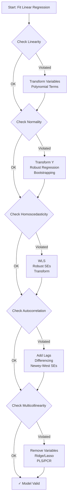

### Decision Tree for Remedies

| Assumption | Test | Threshold | Remedy 1 | Remedy 2 | Remedy 3 |
|------------|------|-----------|----------|----------|----------|
| **Linearity** | Residual plot | Pattern visible | Transform | Polynomial | GAM/Splines |
| **Normality** | Shapiro-Wilk | p < 0.05 | Transform Y | Robust regression | Bootstrap |
| **Homoscedasticity** | Breusch-Pagan | p < 0.05 | WLS | Robust SEs | Transform |
| **Autocorrelation** | Durbin-Watson | <1.5 or >2.5 | Add lags | Differencing | Newey-West |
| **Multicollinearity** | VIF | >5 or >10 | Remove variable | Ridge/Lasso | PLS/PCR |

### Python Libraries Quick Reference

```python
# Essential imports
import numpy as np
import pandas as pd
import matplotlib.pyplot as plt
import seaborn as sns

# Statistical tests
from scipy import stats
from statsmodels.stats.diagnostic import het_breuschpagan
from statsmodels.stats.stattools import durbin_watson, omni_normtest
from statsmodels.stats.outliers_influence import variance_inflation_factor

# Models
import statsmodels.api as sm
from sklearn.linear_model import LinearRegression, Ridge, Lasso, ElasticNet
from sklearn.cross_decomposition import PLSRegression
from sklearn.decomposition import PCA

# Preprocessing
from sklearn.preprocessing import StandardScaler, PowerTransformer
from sklearn.pipeline import Pipeline
```

---

## Conclusion

Understanding and validating the assumptions of linear regression is crucial for building reliable and interpretable models. This comprehensive guide provides:

1. **Theoretical understanding** of each assumption
2. **Practical detection methods** with visualizations and statistical tests
3. **Python implementations** for all diagnostic procedures
4. **Remedial actions** when assumptions are violated
5. **Complete workflow** for systematic model validation

Remember:
- **For inference:** All assumptions are critical
- **For prediction:** Some violations may be tolerable
- **Always diagnose:** Never skip assumption checking
- **Iterate:** Model building is an iterative process

By following this guide, you'll be equipped to build robust linear regression models that stand up to statistical scrutiny and provide reliable insights.

---
