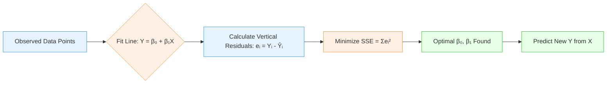
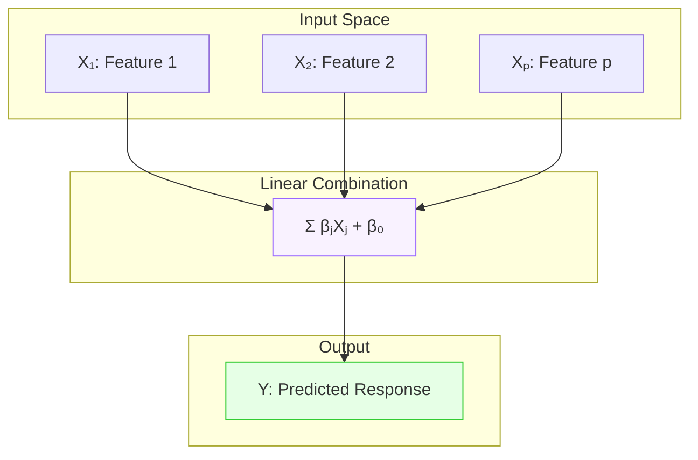
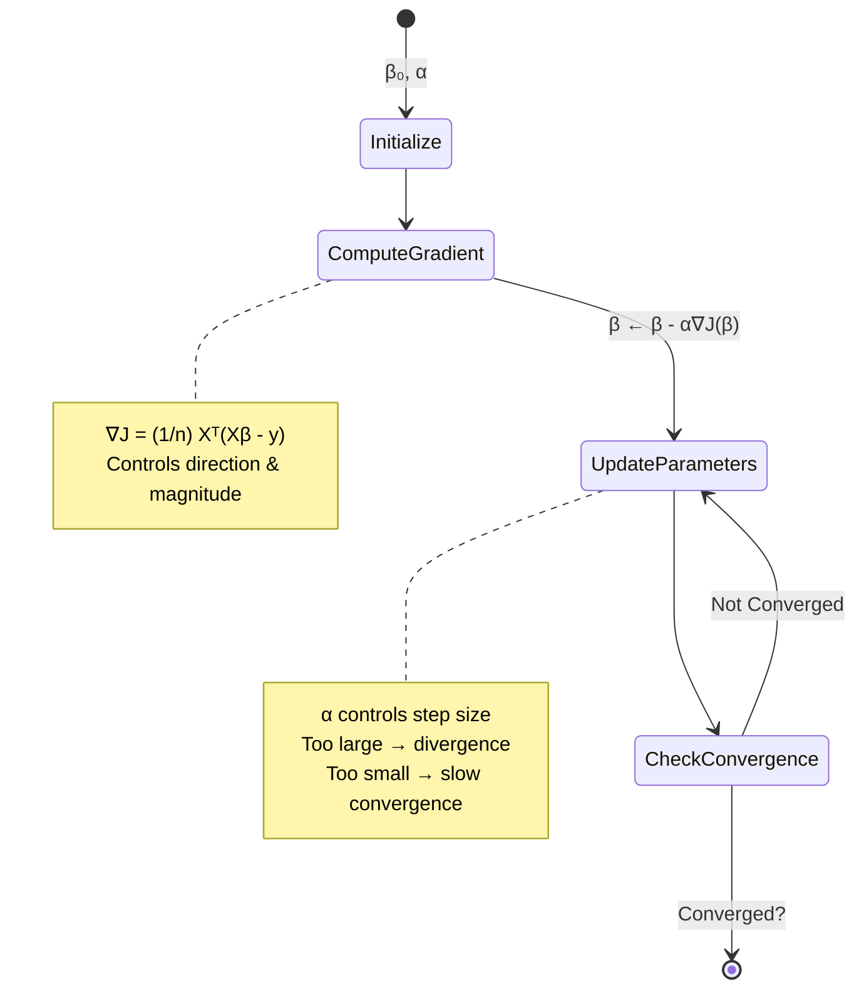
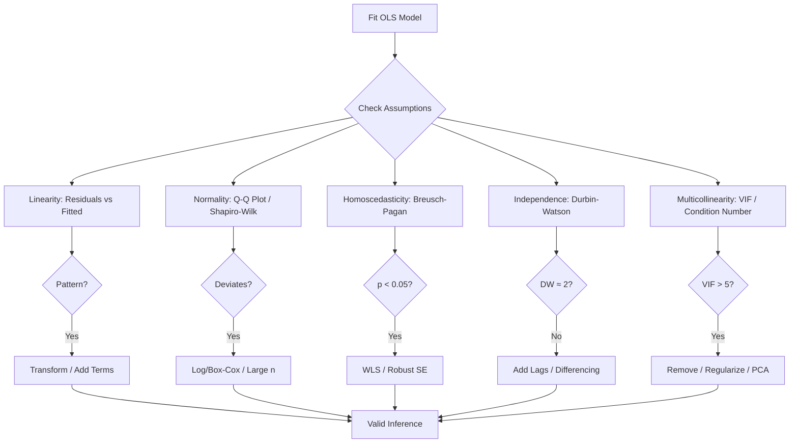

# 📘 Comprehensive Guide to Linear Regression

> A complete conceptual reference covering Simple & Multiple Linear Regression, Optimization, Model Assumptions, and Multicollinearity. Formulated for deep understanding, statistical rigor, and practical intuition.

---

## 📑 Table of Contents
1. [Simple Linear Regression](#1-simple-linear-regression)
2. [Multiple Linear Regression](#2-multiple-linear-regression)
3. [Optimization Techniques](#3-optimization-techniques)
4. [Assumptions of Linear Regression](#4-assumptions-of-linear-regression)
5. [Multicollinearity](#5-multicollinearity)
6. [Summary & Best Practices](#6-summary--best-practices)

---

## 1. Simple Linear Regression

### 🔍 Intuition Framework
| Dimension | Explanation |
|-----------|-------------|
| **What** | A statistical method modeling the linear relationship between a single independent variable $X$ and a continuous dependent variable $Y$. |
| **Why** | To quantify how changes in one predictor affect the outcome, enabling prediction and causal interpretation under controlled conditions. |
| **When** | When you have exactly one explanatory feature, the relationship appears roughly straight, and you need a baseline predictive model. |
| **Where** | Real estate (area → price), marketing (ad spend → sales), biology (drug dosage → response), economics (income → consumption). |
| **How** | By finding the straight line that minimizes the sum of squared vertical distances between observed data points and the line itself. |

### 📐 Mathematical Foundation
### The Population Model
$$Y = \beta_0 + \beta_1 X + \varepsilon$$

**Where:**
* $\beta_0$ = Intercept (expected $Y$ when $X=0$)
* $\beta_1$ = Slope (change in $Y$ per unit change in $X$)
* $\varepsilon$ = Random error term, $\varepsilon \sim N(0, \sigma^2)$

### The Ordinary Least Squares (OLS) Estimators
$$\hat{\beta}_1 = \frac{\sum_{i=1}^{n} (X_i - \bar{X})(Y_i - \bar{Y})}{\sum_{i=1}^{n} (X_i - \bar{X})^2} = \frac{\text{Cov}(X,Y)}{\text{Var}(X)}$$

$$\hat{\beta}_0 = \bar{Y} - \hat{\beta}_1 \bar{X}$$

### The Fitted Line
$$\hat{Y} = \hat{\beta}_0 + \hat{\beta}_1 X$$

### 💡 Illustrative Example
**Scenario:** Predicting house price based solely on square footage.
- Data shows as area increases, price rises proportionally.
- OLS finds the line that best captures this trend.
- Interpretation: $\hat{\beta}_1 = 150$ means each additional square foot adds approximately \$150 to the predicted price, holding all else constant (trivial here since only one predictor exists).

### 📊 Conceptual Diagram


---

## 2. Multiple Linear Regression

### 🔍 Intuition Framework
| Dimension | Explanation |
|-----------|-------------|
| **What** | Extension of SLR incorporating two or more independent variables to explain variation in $Y$. |
| **Why** | Real-world outcomes rarely depend on a single factor; MLR isolates individual effects while controlling for confounders. |
| **When** | Multiple relevant predictors exist, and you need to assess marginal contributions of each feature. |
| **Where** | Healthcare (age, BMI, genetics → disease risk), finance (interest rate, inflation, GDP → stock returns), engineering (material thickness, temperature, pressure → yield strength). |
| **How** | By solving a system of normal equations using matrix algebra or iterative optimization to minimize multivariate squared error. |

### 📐 Mathematical Foundation
Population model:
$$
Y = \beta_0 + \beta_1 X_1 + \beta_2 X_2 + \dots + \beta_p X_p + \varepsilon
$$

Matrix notation (compact & computationally efficient):
$$
\mathbf{y} = \mathbf{X}\boldsymbol{\beta} + \boldsymbol{\varepsilon}
$$
Where:
- $\mathbf{y} \in \mathbb{R}^{n \times 1}$: Response vector
- $\mathbf{X} \in \mathbb{R}^{n \times (p+1)}$: Design matrix (first column = 1s for intercept)
- $\boldsymbol{\beta} \in \mathbb{R}^{(p+1) \times 1}$: Coefficient vector
- $\boldsymbol{\varepsilon} \in \mathbb{R}^{n \times 1}$: Error vector

Loss function (Mean Squared Error scaled by $1/2$ for derivative convenience):
$$
J(\boldsymbol{\beta}) = \frac{1}{2n} \|\mathbf{y} - \mathbf{X}\boldsymbol{\beta}\|_2^2 = \frac{1}{2n} (\mathbf{y} - \mathbf{X}\boldsymbol{\beta})^\top (\mathbf{y} - \mathbf{X}\boldsymbol{\beta})
$$

OLS closed-form solution (Normal Equation):
$$
\hat{\boldsymbol{\beta}} = (\mathbf{X}^\top \mathbf{X})^{-1} \mathbf{X}^\top \mathbf{y}
$$
*Condition:* $\mathbf{X}^\top \mathbf{X}$ must be invertible (full column rank).

Variance of coefficients:
$$
\text{Var}(\hat{\boldsymbol{\beta}}) = \sigma^2 (\mathbf{X}^\top \mathbf{X})^{-1}
$$

### 💡 Illustrative Example
**Scenario:** Predicting monthly sales using TV, Radio, and Newspaper advertising budgets.
- MLR estimates how each channel contributes *independently*.
- If TV and Radio are both effective but correlated, MLR partitions their shared influence.
- Interpretation: $\hat{\beta}_1 = 0.05$ means increasing TV spend by \$1000 predicts a sales increase of \$50, *holding Radio and Newspaper constant*.

### 📊 Conceptual Diagram


---

## 3. Optimization Techniques

### 🔍 Intuition Framework
| Dimension | Explanation |
|-----------|-------------|
| **What** | Iterative algorithms that navigate the parameter space to minimize the loss function when analytical solutions are impractical. |
| **Why** | Matrix inversion scales poorly ($O(p^3)$), fails with singular matrices, and cannot handle streaming data or non-convex landscapes. |
| **When** | Large datasets ($n > 10^5$), high-dimensional features ($p \gg n$), online learning, or when using regularized/non-linear models. |
| **Where** | Deep learning training, recommendation systems, real-time forecasting, distributed computing environments. |
| **How** | Compute gradient of loss w.r.t parameters, take a step opposite to gradient direction scaled by learning rate, repeat until convergence. |

### 📐 Mathematical Foundation
Gradient of MSE loss:
$$
\nabla J(\boldsymbol{\beta}) = \frac{1}{n} \mathbf{X}^\top (\mathbf{X}\boldsymbol{\beta} - \mathbf{y})
$$

Update rule (Gradient Descent):
$$
\boldsymbol{\beta}^{(t+1)} = \boldsymbol{\beta}^{(t)} - \alpha \nabla J(\boldsymbol{\beta}^{(t)})
$$
Where $\alpha > 0$ is the learning rate.

Variants:
- **Batch GD**: Uses full dataset per step (stable, slow)
- **Stochastic GD (SGD)**: Uses one random sample per step (noisy, fast)
- **Mini-batch GD**: Uses subset of size $b$ (balances speed & stability)

Convergence criteria:
$$
\|\boldsymbol{\beta}^{(t+1)} - \boldsymbol{\beta}^{(t)}\| < \epsilon \quad \text{or} \quad |J^{(t+1)} - J^{(t)}| < \epsilon
$$

### 💡 Illustrative Example
**Scenario:** Training a linear model on 1 million customer records.
- Computing $(\mathbf{X}^\top \mathbf{X})^{-1}$ is memory-intensive and numerically unstable.
- Mini-batch GD processes 1000 records at a time, updates parameters, and converges in epochs.
- Learning rate scheduling ($\alpha_t = \alpha_0 / \sqrt{t}$) prevents overshooting near optimum.

### ⚠️ Problems in Optimization
1. **Non-Convexity:** The loss surface has multiple local minima. The algorithm might get "stuck" and never find the global minimum.
2. **Ill-Conditioning:** Gradients vary wildly in different dimensions, causing a "zig-zag" convergence path.
3. **Vanishing/Exploding Gradients:** Common in deep networks; gradients become infinitesimally small or infinitely large, halting learning.
4. **Overfitting:** The model memorizes the training data noise instead of the underlying signal.

### 📊 Conceptual Diagram


---

## 4. Assumptions of Linear Regression
Linear regression relies on the **Gauss-Markov Theorem**, which states that if certain assumptions hold, the OLS estimators are the **Best Linear Unbiased Estimators (BLUE)**.

### 🔍 Intuition Framework
| Dimension | Explanation |
|-----------|-------------|
| **What** | Five statistical conditions required for OLS estimators to be BLUE (Best Linear Unbiased Estimators) and for inference to be valid. |
| **Why** | Violations distort standard errors, invalidate hypothesis tests, produce biased predictions, and break confidence interval coverage. |
| **When** | Always verified after model fitting and before reporting coefficients, p-values, or making policy/business decisions. |
| **Where** | Academic research, clinical trials, economic forecasting, regulatory compliance, risk modeling. |
| **How** | Diagnostic visualizations (residual plots, Q-Q plots), formal statistical tests, and remedial transformations or robust methods. |
---
### 4.1 Linearity
*   **What:** The relationship between $X$ and $Y$ is linear. $E[Y|X] = \mathbf{X}\boldsymbol{\beta}$.
*   **Why:** If the true relationship is curved (e.g., exponential), a straight line will systematically under/over-predict.
*   **Violation Consequence:** Biased parameter estimates, reduced predictive accuracy, invalid hypothesis tests.
*   **How to Check:** Scatter plots of residuals vs. predicted values. If a "U-shape" or curve appears, linearity is violated.
*   **Remedy:** Apply transformations (Log, Square Root, Box-Cox) or use Polynomial Regression.

---

### 4.2 Normality of Residuals
*   **What:** The error terms $\epsilon_i$ are normally distributed with mean 0 and constant variance.
    $$ \epsilon \sim \mathcal{N}(0, \sigma^2) $$
*   **Why:** Required for valid hypothesis testing (t-tests, F-tests) and constructing confidence intervals.
*   **Violation Consequence:** P-values become unreliable; confidence intervals may be too narrow or wide.
*   **How to Check:** 
    *   **Histogram / Q-Q Plot:** Points should fall on the diagonal line.
    *   **Omnibus Test:** Tests skewness ($S$) and kurtosis ($K$).
        $$ K^2 = n \left( \frac{S^2}{6} + \frac{(K-3)^2}{24} \right) $$
        Where $K^2 \sim \chi^2_2$. If $p$-value $< 0.05$, normality is rejected.

---

### 4.3 Homoscedasticity (Constant Variance)
*   **What:** The variance of the error terms is constant across all levels of $X$.
    $$ Var(\epsilon_i) = \sigma^2 \quad \forall i $$
*   **Why:** If variance changes (Heteroscedasticity), OLS is no longer the "Best" estimator (inefficient).
*   **Violation Consequence:** Standard errors are biased, leading to incorrect t-statistics and p-values.
*   **How to Check:** 
    *   **Residual vs. Fitted Plot:** Look for a "funnel" shape.
    *   **Breusch-Pagan Test:** Regress squared residuals on $X$.
        $$ LM = n \cdot R^2_{aux} \sim \chi^2_k $$
        If $LM$ is large ($p < 0.05$), heteroscedasticity is present.
*   **Remedy:** Weighted Least Squares (WLS), Robust Standard Errors (Huber-White), or Log transformation of $Y$.

---

### 4.4 No Autocorrelation (Independence of Errors)
*   **What:** Error terms are uncorrelated with each other.
    $$ Cov(\epsilon_i, \epsilon_j) = 0 \quad \text{for } i \neq j $$
*   **Why:** Crucial for time-series or spatial data. Autocorrelation means the model is missing a temporal pattern.
*   **Violation Consequence:** Standard errors are underestimated, inflating t-statistics (false positives).
*   **How to Check:**
    *   **Durbin-Watson Test:**
        $$ d = \frac{\sum_{t=2}^{T} (e_t - e_{t-1})^2}{\sum_{t=1}^{T} e_t^2} $$
        *   $d \approx 2$: No autocorrelation.
        *   $d < 2$: Positive autocorrelation.
        *   $d > 2$: Negative autocorrelation.
*   **Remedy:** Add lagged variables, use Differencing, or switch to ARIMA/GLS models.
---

### 📐 Mathematical Foundation
Let $\varepsilon_i = Y_i - \hat{Y}_i$. The classical Gauss-Markov assumptions:

1. **Linearity & Correct Specification**
   $$
   E[Y|X] = \beta_0 + \beta_1 X_1 + \dots + \beta_p X_p \quad \Rightarrow \quad E[\varepsilon|X] = 0
   $$

2. **Strict Exogeneity / Independence**
   $$
   \text{Cov}(\varepsilon_i, \varepsilon_j | X) = 0 \quad \forall i \neq j
   $$

3. **Homoscedasticity (Constant Variance)**
   $$
   \text{Var}(\varepsilon_i | X) = \sigma^2 \quad \forall i
   $$

4. **No Perfect Multicollinearity**
   $$
   \text{rank}(\mathbf{X}) = p + 1 \quad \Rightarrow \quad \mathbf{X}^\top \mathbf{X} \text{ is invertible}
   $$

5. **Normality of Errors** (required for small-sample inference)
   $$
   \varepsilon | X \sim \mathcal{N}(0, \sigma^2 \mathbf{I})
   $$

### 💡 Illustrative Example
**Scenario:** Modeling annual income using years of education.
- **Linearity check:** Residuals vs fitted plot shows random scatter → passes.
- **Homoscedasticity check:** Residual spread widens at higher incomes → fails (heteroscedastic). Remedy: Log-transform income or use robust SE.
- **Normality check:** Q-Q plot deviates at tails → fails. Remedy: Large sample ($n>30$) relaxes this via Central Limit Theorem.

### 📊 Conceptual Diagram


---

## 5. Multicollinearity

### 🔍 Intuition Framework
| Dimension | Explanation |
|-----------|-------------|
| **What is it?** | A condition where two or more predictors in a regression model are highly linearly correlated, making their individual effects indistinguishable. |
| **Why is it bad?** | It makes it mathematically difficult to isolate the individual effect of each variable on Y. It inflates coefficient variances, destabilizes estimates, reduces statistical power, and complicates causal interpretation. |
| **When does it happen?** | When features are derived from each other (e.g., "Income" and "Tax Paid"), or when using dummy variables without dropping one (Dummy Variable Trap). |
|**Where does it hurt?**|Primarily in **Inference** (understanding feature importance). It matters less for pure **Prediction** if the correlation structure remains the same in the test set.|
| **Where does it occur?** | Socioeconomic surveys, marketing mix modeling, biomedical data, engineered feature spaces. |
| **How to detect it?** | Detect via VIF, correlation matrices, condition numbers; resolve by feature selection, regularization, dimensionality reduction, or domain-driven combinations. |

### 📐 Mathematical Foundation

If $X_1$ and $X_2$ are perfectly correlated, $X_2 = c \cdot X_1$. The columns of $\mathbf{X}$ are linearly dependent.
The determinant of $\mathbf{X}^T \mathbf{X}$ approaches zero:
$$ \det(\mathbf{X}^T \mathbf{X}) \to 0 \implies (\mathbf{X}^T \mathbf{X})^{-1} \text{ does not exist} $$


### 🔍 Detection Methods

#### 1. Correlation Matrix
Calculate the Pearson correlation coefficient $r$ between all pairs of features.
$$ r_{xy} = \frac{\sum (x_i - \bar{x})(y_i - \bar{y})}{\sqrt{\sum (x_i - \bar{x})^2 \sum (y_i - \bar{y})^2}} $$
*Rule of Thumb:* $|r| > 0.8$ indicates potential multicollinearity.

#### 2. Variance Inflation Factor (VIF)
VIF measures how much the variance of an estimated regression coefficient increases due to multicollinearity.
$$ VIF_j = \frac{1}{1 - R_j^2} $$
Where $R_j^2$ is the R-squared value obtained by regressing feature $X_j$ on all other features.
*   $VIF = 1$: No correlation.
*   $1 < VIF < 5$: Moderate correlation.
*   $VIF > 5$ (or $10$): Severe multicollinearity.

#### 3. Condition Number ($\kappa$)
Measures the sensitivity of the matrix $\mathbf{X}^T \mathbf{X}$ to numerical errors.
$$ \kappa = \frac{\lambda_{max}}{\lambda_{min}} $$
Where $\lambda$ represents the eigenvalues of $\mathbf{X}^T \mathbf{X}$.
*   $\kappa < 10$: Minor collinearity.
*   $\kappa > 30$: Severe multicollinearity.

### 💡 Illustrative Example
**Scenario:** Predicting health outcomes using `Height_cm` and `Height_inches`.
- Perfect linear relationship: `Height_cm = 2.54 × Height_inches`
- $R^2 = 1 \Rightarrow VIF = \infty$
- $\mathbf{X}^\top \mathbf{X}$ becomes singular → OLS fails.
- **Resolution:** Drop one variable, or combine into a single standardized height metric.

### 📊 Conceptual Diagram
```mermaid
graph LR
    subgraph "Detection Phase"
        A[Correlation Matrix] --> B[|r| > 0.8?]
        C[VIF Calculation] --> D[VIF > 5 or 10?]
        E[Condition Number] --> F[κ > 30?]
    end
    
    subgraph "Resolution Phase"
        G[Remove Redundant Feature]
        H[Create Composite Index]
        I[Ridge / Lasso Regularization]
        J[PCA / PLS Dimensionality Reduction]
        K[Center Polynomial Terms]
    end
    
    B -->|Yes| G
    D -->|Yes| H
    F -->|Yes| I
    G --> L[Stable Estimates]
    H --> L
    I --> L
    J --> L
    K --> L
    
    classDef detect fill:#ffe6e6,stroke:#ff6666;
    classDef resolve fill:#e6f7ff,stroke:#3399ff;
    class A,C,E,B,D,F detect
    class G,H,I,J,K,L resolve
```

---

## 6. Summary & Best Practices

### ✅ Core Principles
1. **Start Simple:** Begin with SLR or parsimonious MLR models before adding complexity.
2. **Validate Assumptions:** Never interpret coefficients or p-values without diagnostic checks.
3. **Prefer Interpretability Over Black Boxes:** In inferential settings, transparent models beat slightly more accurate opaque ones.
4. **Handle Multicollinearity Proactively:** Use domain knowledge to select non-redundant features or apply regularization.
5. **Optimize When Necessary:** Switch to gradient-based methods when data scale or matrix conditioning demands it.

### 📏 Decision Guidelines
| Goal | Recommended Approach |
|------|----------------------|
| **Prediction only** | Tolerate mild multicollinearity; focus on cross-validated error; use regularization if overfitting |
| **Causal inference** | Enforce all Gauss-Markov assumptions; remove collinear predictors; use robust standard errors |
| **Large-scale data** | Mini-batch gradient descent with learning rate scheduling; avoid full matrix inversion |
| **High-dimensional features** | Ridge/Lasso regression, PCA, or elastic net to stabilize estimates |

### 📘 Recommended Reading Path
1. Understand geometric interpretation of OLS (projection onto column space)
2. Master residual diagnostics and transformation techniques
3. Study bias-variance tradeoff in regularized regression
4. Explore generalized linear models when linearity assumptions fail

---
